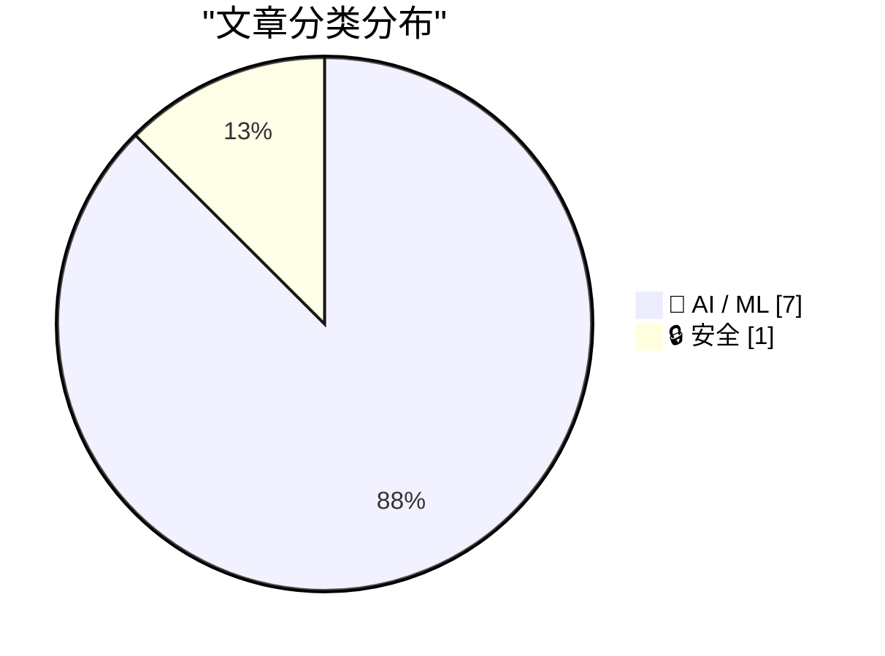
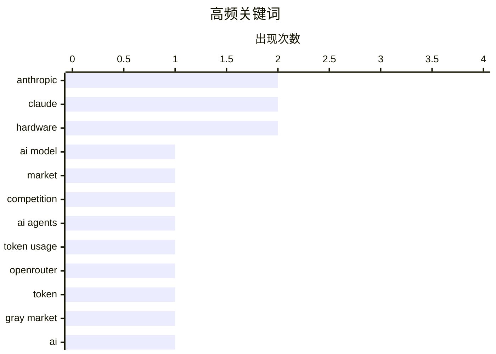

# 📰 AI 资讯每日精选 — 2026-08-24

> 汇聚 156+ 技术博客、X/Twitter、Hacker News、Reddit、Product Hunt、
> Lobste.rs、ClawFeed 日报及 GitHub Trending，经 AI 评分筛选。
>
> **本期内容**：🏆 今日必读 · 🌐 ClawFeed 日报 · 🔥 GitHub Trending · 📂 分类精选 · 📊 数据概览 · 🎯 项目相关情报

## 📝 今日看点

今日技术圈的核心趋势是AI产业正加速“自我消耗”——智能体对token的消耗量已远超人类，且增长迅猛，但廉价缓存token成为主流，反映出成本效率而非性能成为驱动关键。与此同时，高端AI模型面临用户增长瓶颈，低价替代品和灰色市场流转（如Claude token以目录价10%流通）正在重塑竞争格局。此外，AI内容的信任与安全议题升温，从Anthropic全面引入生成文本水印，到对AI可靠性事故的预警，都预示着技术圈正从追逐能力转向治理与落地风险。

---

## 🏆 今日必读

🥇 **Anthropic最佳AI模型用户增长乏力，廉价工具更受欢迎**

[Anthropic’s best AI model struggles to attract users as cheaper tools thrive](https://simonwillison.net/2026/Aug/23/anthropics-best-ai-model-struggles-to-attract-users-as-cheaper-t/) — simonwillison.net · 5 小时前 · 🤖 AI / ML

> 据英国《金融时报》援引知情人士消息，Anthropic的年度化收入从5月的470亿美元增长至7月的650亿美元。然而，其最先进的AI模型在吸引用户方面遇到困难，而更便宜的工具则表现更好。文章列举了具体数据，但未详细说明原因。

💡 **为什么值得读**: 了解Anthropic最新收入数据及其高端模型市场表现，对关注AI商业动态的读者有价值。

🏷️ Anthropic, AI model, market, competition

🥈 **AI成为AI最大客户：OpenRouter上智能体token使用量激增14倍**

[AI is becoming AI's biggest customer as agentic token usage jumps 14x on OpenRouter](https://the-decoder.com/ai-is-becoming-ais-biggest-customer-as-agentic-token-usage-jumps-14x-on-openrouter/) — The Decoder · 15 小时前 · 🤖 AI / ML · **二手来源**

> 自2025年2月6日起，OpenRouter上AI智能体消耗的token数量已超过人类。此后，智能体使用量增长了14倍，而人类使用量仅增长2.8倍。不过，近70%的智能体token消耗来自廉价的缓存提示，因此实际成本增长远低于原始数字所暗示的。

💡 **为什么值得读**: 揭示AI智能体对算力需求的快速增长及其成本结构，对理解AI基础设施趋势有参考价值。

🏷️ AI agents, token usage, OpenRouter

🥉 **中国灰色市场如何以极低价格出售Claude token**

[How China's gray market sells Claude tokens at a fraction of the price](https://the-decoder.com/how-chinas-gray-market-sells-claude-tokens-at-a-fraction-of-the-price/) — The Decoder · 18 小时前 · 🔒 安全 · **二手来源**

> Anthropic对中国实施严格访问控制，包括地理封锁和自拍验证，但通过所谓的“中转站”网络被系统性绕过。中国开发者可以以目录价10%的价格购买Claude token。分析师Zilan Qian警告，这种规避基础设施削弱了出口管制和Anthropic自身的安全系统。

💡 **为什么值得读**: 揭示AI模型访问控制的实际漏洞和灰色市场运作，对关注AI安全与合规的读者有警示意义。

🏷️ Claude, token, gray market

4️⃣ **与AI相关的可靠性事故即将到来**

[Wild AI-related reliability incidents are coming](https://surfingcomplexity.blog/2026/08/22/wild-ai-related-reliability-incidents-are-coming/) — Lobste.rs · 6 小时前 · 🤖 AI / ML

> 文章讨论了AI相关可靠性事故的潜在风险，但摘要未提供具体细节。

💡 **为什么值得读**: 对AI系统可靠性感兴趣的读者可能希望阅读原文以了解具体案例和观点。

🏷️ AI, reliability, incidents

5️⃣ **用Claude修复eMachines EL1200 BIOS漏洞**

[Fixing an eMachines EL1200 BIOS bug with Claude](https://www.downtowndougbrown.com/2026/08/fixing-an-emachines-el1200-bios-bug-with-claude/) — downtowndougbrown.com · 6 小时前 · 🤖 AI / ML

> 作者分享了自己修复eMachines EL1200主板BIOS漏洞的经历，该漏洞导致无法使用16GB内存（主板仅支持8GB）。最终通过修改GRUB启动参数，修复了ACPI表重叠问题。

💡 **为什么值得读**: 展示AI辅助硬件调试的实际案例，对技术爱好者有启发意义。

🏷️ Claude, BIOS, hardware, debugging

---

## 🌐 ClawFeed 日报精选

> 来源：[ClawFeed](https://clawfeed.kevinhe.io) — AI 驱动的多源新闻聚合

📋 ClawFeed Daily Digest | 2026-08-23 (Sat)

聚合 5 份 4h digest：#1044 (00:00-03:59) · #1045 (04:00-07:59) · #1046 (08:00-11:59) · #1047 (12:00-15:59) · #1048 (16:00-19:59)

素材总计：feed 157 + bookmarks 95 + followingSample 175（profiles 120/120 loaded，0 errored）。

---

## 🔥 当日最重要 5 条

### 1. AI Agent 流量结构性翻转——Agent 已成主要 token 消费者
a16z 数据显示 Agent token 消耗是人类的近 5 倍，自 2 月以来增长 14 倍。Cloudflare 机器流量已超人类，OpenRouter agentic token 消耗超 7.3T。同时 Vercel AI Gateway 开源模型份额翻转至 62%（两月前仅 28.4%），闭源模型份额从 71.6% 跌至 38%。
来源: a16z · 0xSammy · rauchg

### 2. NVIDIA AI 服务器涨价 15%+ 与 AI 能源布局
NVIDIA 向微软等大客户通知涨价超 15%，AI 基础设施成本上行。同时 Peter Thiel 重注铀矿/核能，判断"AI 需要的是电力而非芯片"。Dylan Patel (SemiAnalysis) 指出每个有收入的 AI 创业者都在转型做 NeoCloud（GPU 专营云），CoreWeave/Lambda 模式被大规模复制。
来源: Techub_News · hamptonism · MaxForAI

### 3. Andrew Ng "Prompting 将在 6 个月内消亡" + AI 工具生态加速
Andrew Ng 斯坦福 100 分钟演讲深度剖析 Loops+Graphs 取代 Prompting，METR 数据显示 AI 能扛近 2 小时复杂任务。Codex CLI 启动速度优化 25 倍（uv 作者 Charlie Marsh 加入 OpenAI）。OpenAI 收购 Instant DB 团队（面向 Agent 的后端基础设施）。
来源: hanakoxbt · LinearUncle · MaxForAI

### 4. 收购逻辑演化与智能成本崩塌
Andrew Chen（a16z）断言："2012 年买用户，2021 年买工程师，2026 年买训练数据"。Erik Voorhees 指出智能成本正在崩塌——更多智能本应意味着更高价格，但实际相反。Coinbase 正式支持 AI agent 交易衍生品，AI×crypto 交叉落地里程碑。
来源: andrewchen · laurashin · Techub_News

### 5. Agent 架构方向争论——Skills/MCP/单体 vs 分布式
dotey 判断 Agent 架构走向 MCP/CLI 模式（"每个人常用 agent 就两三个"）。Skills 规模化暴露 "single-player mode" 问题（Khe Hy, 108K views）。Pi 数据库范式挑战长程 Agent 问题（连续跑 50 小时的状态管理）。Greg Brockman 谈 OpenAI 非营利转型逻辑。
来源: dotey · khemaridh · arvin17x · rohanpaul_ai

---

## 📰 当日核心主题

### Agent 经济体成型
Agent token 消耗 5x 人类、Cloudflare 机器流量超人类、开源模型份额翻转——三组数据共同指向 Agent 已从概念进入规模化生产阶段。Grok Bot 营销全家桶（13 个 AI worker）、Coinbase AI 衍生品交易、EvoTrace 训练 Agent 偏好数据等案例进一步佐证。

### AI 基础设施成本重构
NVIDIA 涨价 15%、Thiel 押注铀矿核能、每个 AI 创业者转型 NeoCloud、智能成本崩塌但硬件成本上升——供给侧出现"软件降价+硬件涨价"剪刀差。

### 工具链快速迭代
Codex CLI 25x 加速、Skills 标准库（mattpocock/skills 登顶 GitHub）、ELI5 Skill 刷屏（但信息密度递减）、Claude Academy 上线、Remote Control 可靠性改进。

### 中国 AI 三弹齐发
DeepSeek/腾讯/小米同日发力，腾讯 Hy3 登陆 B.AI 全量免费。Ox Alpha 疑为智谱 GLM-5.X。Google Search Central Live Shanghai 释出 SEO/AIO/GEO 框架。

### 加密市场回暖
BTC ETF 单周 $19.2 亿、Perp DEX 未平仓量 $200 亿创新高、Ray Dalio 看涨黄金和 BTC。但传统科技 ETF 吸金仍 6x 于 crypto。

---

## 🔖 Bookmarks 精选

• **@guruchahal** — AI 市场渗透率 vs $6T+ 知识工作者劳动力支出矩阵（Kevin 本周活跃引用）
• **@AndrewYNg** — AI Engineering 技能地图（5.7M views）
• **@trq212** — Anthropic 为 Claude 5 删掉 80% 系统 prompt 的经验
• **@BruceGuai** — Matrix Agent 公司架构：长期运行的 Agent 公司 OS
• **@xiaohu** — Cloudflare @cloudflare/computer：给 AI Agent 配虚拟电脑

---

## 👀 推荐关注汇总（去重）

| 账号 | 定位 | 来源 |
|------|------|------|
| @runinfrai (RunInfra, YC F26) | AI 推理优化平台 | #1044, #1047 |
| @canghe (苍何) | AI Agent/Skills/MCP/开源出海 | #1044 |
| @midscene_ai (Midscene) | AI Operator for Web/Android | #1045 |
| @raft_hq (Raft) | 人机协作 Agent 平台 | #1046, #1047 |
| @OkhayIea | EEMA 论文，AutoML 方向 | #1048 |

提醒：未通过浏览器核实是否已关注，Kevin 操作前请先在 Following 里搜一下。

---

## 💤 当日重复噪音模式

1. **ELI5 Skill 搬运潮** — 至少 5 个中文 KOL 几乎相同内容转发（MaxForAI/mylifcc/omarsar0/dotey/GitTrend0x），实际只是一句 prompt 生成 HTML 可视化页面，信息密度急剧递减。
2. **马斯克高频推广** — Tesla FSD + Grok Bot 交替推广，叙事重复度高。
3. **加密 meme/诉讼噪音** — Justin Sun 冻结资产、FARTCOIN 清算、Solana 治理投票等与 AI/tech 主线无关。
4. **"BTC 涨了"感叹帖** — 多个加密 KOL 情绪表达，无新增结构性信息。
---

## 🔥 GitHub Trending

> 今日热门开源项目（全语言 + Python）

| # | 项目 | 描述 | ⭐ 总星 | 📈 今日 | 语言 |
|---|------|------|---------|---------|------|
| 1 | [openai/codex](https://github.com/openai/codex) 🤖 | Lightweight coding agent that runs in your terminal | 115.3k | +2715 | Rust |
| 2 | [mattpocock/skills](https://github.com/mattpocock/skills) | Skills for Real Engineers. Straight from my .agents direc... | 233.9k | +2447 | Shell |
| 3 | [Alishahryar1/free-claude-code](https://github.com/Alishahryar1/free-claude-code) 🤖 | Use Claude Code, Codex, Pi, and OpenCode for free (1.3B+ ... | 48.0k | +1081 | Python |
| 4 | [AprilNEA/OpenLogi](https://github.com/AprilNEA/OpenLogi) | ⚡️A native, local-first alternative to Logitech Options+,... | 15.0k | +1009 | Rust |
| 5 | [basecamp/omarchy](https://github.com/basecamp/omarchy) | Beautiful, Modern & Opinionated Linux | 29.2k | +750 | Shell |
| 6 | [ripienaar/free-for-dev](https://github.com/ripienaar/free-for-dev) | A list of SaaS, PaaS and IaaS offerings that have free ti... | 134.5k | +615 | HTML |
| 7 | [NousResearch/hermes-agent](https://github.com/NousResearch/hermes-agent) 🤖 | The agent that grows with you | 235.0k | +454 | Python |
| 8 | [affaan-m/ECC](https://github.com/affaan-m/ECC) 🤖 | The agent harness performance optimization system. Skills... | 242.6k | +427 | JavaScript |
| 9 | [virgiliojr94/book-to-skill](https://github.com/virgiliojr94/book-to-skill) 🤖 | Turn any technical book PDF into a Claude Code skill — re... | 24.7k | +417 | Python |
| 10 | [block/buzz](https://github.com/block/buzz) | A hive mind communication platform | 30.1k | +410 | Rust |
| 11 | [freestylefly/awesome-gpt-image-2](https://github.com/freestylefly/awesome-gpt-image-2) 🤖 | Prompt as Code | GPT-Image2 工业级提示词引擎与模板库，470+ 个案例逆向工程，20+... | 12.8k | +401 | JavaScript |
| 12 | [anthropics/claude-code](https://github.com/anthropics/claude-code) 🤖 | Claude Code is an agentic coding tool that lives in your ... | 142.8k | +361 | Python |
| 13 | [PostHog/posthog](https://github.com/PostHog/posthog) 🤖 | 🦔 PostHog is the leading platform for building self-driv... | 38.8k | +293 | Python |
| 14 | [anthropics/claude-plugins-community](https://github.com/anthropics/claude-plugins-community) 🤖 | Community plugin marketplace for Claude Cowork and Claude... | 983 | +225 | Python |
| 15 | [Comfy-Org/ComfyUI](https://github.com/Comfy-Org/ComfyUI) 🤖 | The most powerful and modular diffusion model GUI, api an... | 129.4k | +201 | Python |

---

## 🤖 AI / ML

### 1. Anthropic最佳AI模型用户增长乏力，廉价工具更受欢迎

[Anthropic’s best AI model struggles to attract users as cheaper tools thrive](https://simonwillison.net/2026/Aug/23/anthropics-best-ai-model-struggles-to-attract-users-as-cheaper-t/) — **simonwillison.net** · 5 小时前 · ⭐ 23/30

> 据英国《金融时报》援引知情人士消息，Anthropic的年度化收入从5月的470亿美元增长至7月的650亿美元。然而，其最先进的AI模型在吸引用户方面遇到困难，而更便宜的工具则表现更好。文章列举了具体数据，但未详细说明原因。

🏷️ Anthropic, AI model, market, competition

---

### 2. AI成为AI最大客户：OpenRouter上智能体token使用量激增14倍

[AI is becoming AI's biggest customer as agentic token usage jumps 14x on OpenRouter](https://the-decoder.com/ai-is-becoming-ais-biggest-customer-as-agentic-token-usage-jumps-14x-on-openrouter/) — **The Decoder** · 15 小时前 · ⭐ 23/30 · **二手来源**

> 自2025年2月6日起，OpenRouter上AI智能体消耗的token数量已超过人类。此后，智能体使用量增长了14倍，而人类使用量仅增长2.8倍。不过，近70%的智能体token消耗来自廉价的缓存提示，因此实际成本增长远低于原始数字所暗示的。

🏷️ AI agents, token usage, OpenRouter

---

### 3. 与AI相关的可靠性事故即将到来

[Wild AI-related reliability incidents are coming](https://surfingcomplexity.blog/2026/08/22/wild-ai-related-reliability-incidents-are-coming/) — **Lobste.rs** · 6 小时前 · ⭐ 23/30

> 文章讨论了AI相关可靠性事故的潜在风险，但摘要未提供具体细节。

🏷️ AI, reliability, incidents

---

### 4. 用Claude修复eMachines EL1200 BIOS漏洞

[Fixing an eMachines EL1200 BIOS bug with Claude](https://www.downtowndougbrown.com/2026/08/fixing-an-emachines-el1200-bios-bug-with-claude/) — **downtowndougbrown.com** · 6 小时前 · ⭐ 20/30

> 作者分享了自己修复eMachines EL1200主板BIOS漏洞的经历，该漏洞导致无法使用16GB内存（主板仅支持8GB）。最终通过修改GRUB启动参数，修复了ACPI表重叠问题。

🏷️ Claude, BIOS, hardware, debugging

---

### 5. 花费266美元和四个AI模型，我拥有了自己的平板：GLM-5.3一天完成

[I spent $266 and four AI models to own my tablet. GLM-5.3 finished it in a day](https://ericpardee.github.io/fire-hd-ownership/) — **Hacker News Best** · 11 小时前 · ⭐ 20/30

> 作者花费266美元和四个AI模型，成功解锁并拥有了自己的Fire HD平板。其中GLM-5.3模型在一天内完成了主要工作。

🏷️ AI models, GLM, tablet, reverse engineering

---

### 6. M5 Max vs RTX 5080/5090：本地图像/视频AI，选择Mac是否错误？

[M5 Max vs RTX 5080/5090 for local image/video AI. Am I making a mistake by choosing the Mac?](https://www.reddit.com/r/comfyui/comments/1vwipjp/m5_max_vs_rtx_50805090_for_local_imagevideo_ai_am/) — **r/comfyui** · 5 小时前 · ⭐ 20/30

> Reddit用户询问在本地运行图像/视频AI时，选择M5 Max Mac是否比RTX 5080/5090更合适。帖子未提供具体对比数据，但引发了讨论。

🏷️ hardware, GPU, Mac, AI performance

---

### 7. Cooper Sharp证明美国奶酪可以成为优质奶酪

[Cooper Sharp Proves That American Cheese Can Be Great Cheese](https://sixcolors.com/member/2026/08/this-week-in-apple-lets-fight/) — **daringfireball.net** · 8 小时前 · ⭐ 20/30 · **待核实**

> 文章提到Anthropic宣布对其生成的所有文本添加水印，通过微妙改变模型选择下一个词的随机性来区分AI与人类内容。这一做法引发了John Gruber的强烈不满。

🏷️ Anthropic, watermarking, AI content

---

## 🔒 安全

### 8. 中国灰色市场如何以极低价格出售Claude token

[How China's gray market sells Claude tokens at a fraction of the price](https://the-decoder.com/how-chinas-gray-market-sells-claude-tokens-at-a-fraction-of-the-price/) — **The Decoder** · 18 小时前 · ⭐ 22/30 · **二手来源**

> Anthropic对中国实施严格访问控制，包括地理封锁和自拍验证，但通过所谓的“中转站”网络被系统性绕过。中国开发者可以以目录价10%的价格购买Claude token。分析师Zilan Qian警告，这种规避基础设施削弱了出口管制和Anthropic自身的安全系统。

🏷️ Claude, token, gray market

---

## 📊 数据概览

| 扫描源 | 抓取文章 | 时间范围 | 精选 |
|:---:|:---:|:---:|:---:|
| 101/156 | 5195 篇 → 69 篇 | 24h | **8 篇** |

### 分类分布



### 高频关键词



<details>
<summary>📈 纯文本关键词图（终端友好）</summary>

```
anthropic   │ ████████████████████ 2
claude      │ ████████████████████ 2
hardware    │ ████████████████████ 2
ai model    │ ██████████░░░░░░░░░░ 1
market      │ ██████████░░░░░░░░░░ 1
competition │ ██████████░░░░░░░░░░ 1
ai agents   │ ██████████░░░░░░░░░░ 1
token usage │ ██████████░░░░░░░░░░ 1
openrouter  │ ██████████░░░░░░░░░░ 1
token       │ ██████████░░░░░░░░░░ 1
```

</details>

### 🏷️ 话题标签

**anthropic**(2) · **claude**(2) · **hardware**(2) · ai model(1) · market(1) · competition(1) · ai agents(1) · token usage(1) · openrouter(1) · token(1) · gray market(1) · ai(1) · reliability(1) · incidents(1) · bios(1) · debugging(1) · ai models(1) · glm(1) · tablet(1) · reverse engineering(1)

---

## 🎯 项目相关情报

### Agent 基座安全与合规

> 暂无达到质量门槛的项目相关情报。

### 多 Agent 架构

> 暂无达到质量门槛的项目相关情报。

### ASR 与语音助手

> 暂无达到质量门槛的项目相关情报。

### 商品包装 OCR

> 暂无达到质量门槛的项目相关情报。

---

*生成于 2026-08-24 01:54 | 汇聚 156 个技术博客、X/Twitter、Hacker News、Reddit、Product Hunt、Lobste.rs、ClawFeed 日报及 GitHub Trending，经 AI 评分筛选出 Top 8 精华内容*
