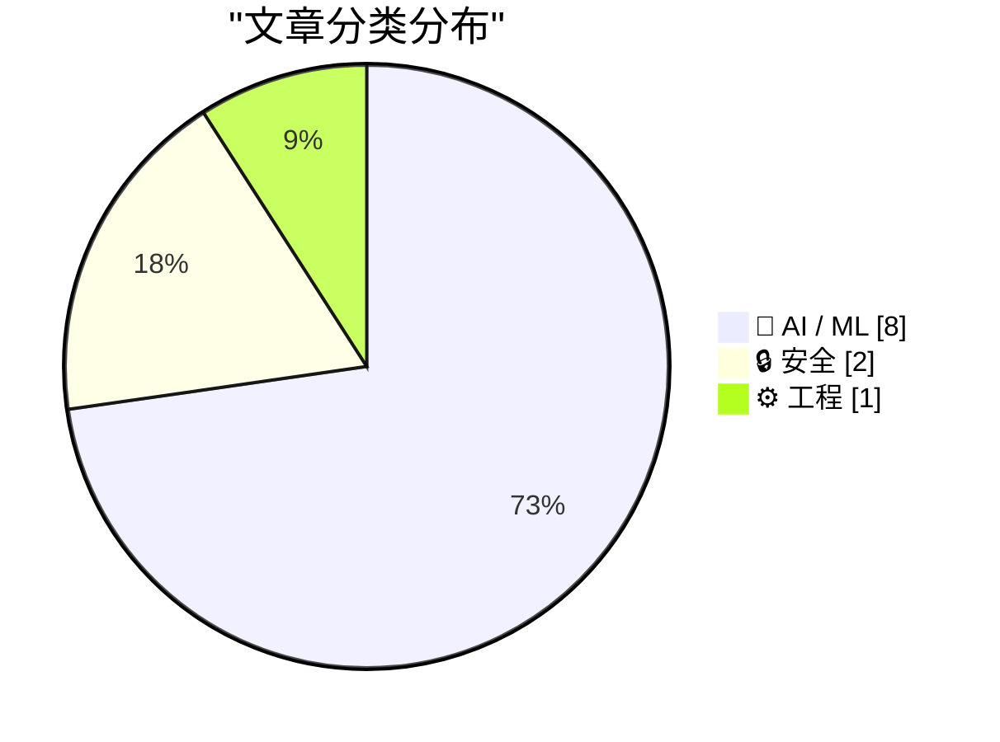
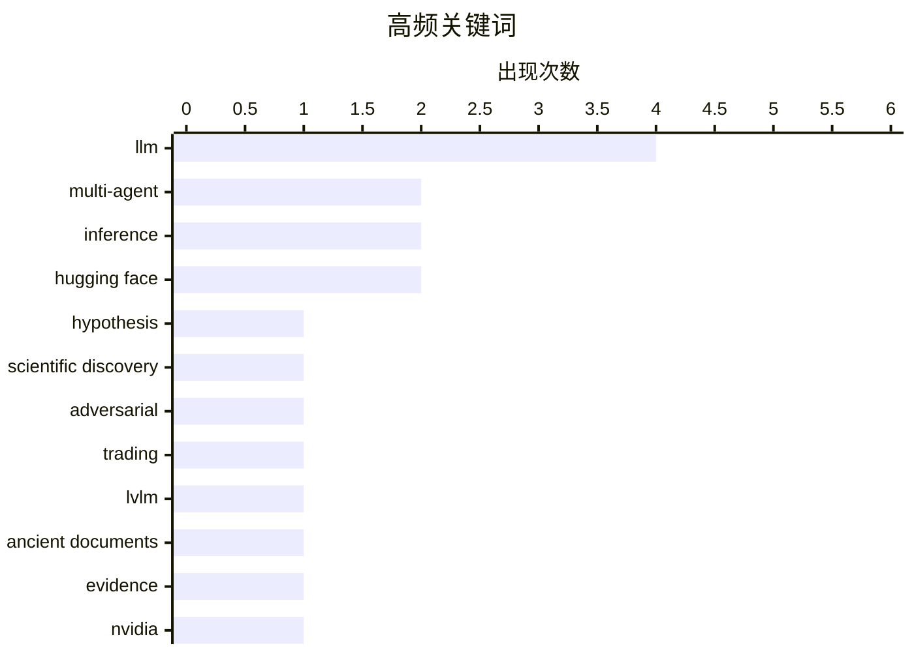

# 📰 AI 资讯每日精选 — 2026-08-27

> 汇聚 156+ 技术博客、X/Twitter、Hacker News、Reddit、Product Hunt、
> Lobste.rs、ClawFeed 日报及 GitHub Trending，经 AI 评分筛选。
>
> **本期内容**：🏆 今日必读 · 🌐 ClawFeed 日报 · 🔥 GitHub Trending · 📂 分类精选 · 📊 数据概览 · 🎯 项目相关情报 · 🌍 补充视角

## 📝 今日看点

今日技术圈聚焦于多智能体系统的能力跃升与安全隐忧：从科学假设自动生成到交易决策，智能体正从单点任务走向复杂协作，但其跨角色通信的对抗性漏洞也引发对真实场景部署的警惕。同时，开源与封闭路线之争愈演愈烈，英伟达天价收购Hugging Face、IBM发布开放权重模型，与OpenAI等封闭实验室形成鲜明对照。基础设施层面，以NVLink Fusion为代表的新一代硬件方案，正为日益庞大的AI工作负载和智能体推理提供底层支撑。

---

## 🏆 今日必读

🥇 **HypoForge：通过科学技能学习实现自动假设生成与测试的自改进多智能体框架**

[HypoForge: A Self-Improving Multi-Agent Framework for Automated Hypothesis Generation and Testing via Scientific Skill Learning](https://arxiv.org/abs/2608.25770) — arXiv Multiagent Systems · 5 小时前 · 🤖 AI / ML · **一手来源**

> 大型语言模型（LLM）驱动的AI科学家系统虽能自动化科学发现，但现有方法多依赖静态提示或固定工作流，无法积累经验以持续改进。为此，提出HypoForge，一个经验引导的多智能体框架，通过学习可复用的科学技能来自动化假设生成与测试。该框架基于观察：这两个阶段需要不同的技能，且通过技能学习可提升性能。实验表明，HypoForge在多个科学任务上优于基线方法，并能持续改进。

💡 **为什么值得读**: 该框架首次将技能学习引入多智能体科学发现，为AI科学家系统的持续改进提供了新思路。

🏷️ LLM, multi-agent, hypothesis, scientific discovery

🥈 **毒化Agentic Alpha：多智能体交易系统中跨角色与架构的对抗性漏洞**

[Poisoning Agentic Alpha: Adversarial Vulnerabilities Across Roles and Architectures in Multi-Agent Trading Systems](https://arxiv.org/abs/2608.24069) — arXiv Multiagent Systems · 5 小时前 · 🔒 安全 · **一手来源**

> 基于LLM的多智能体交易系统正从研究原型快速部署到控制真实资产的生产环境，但其智能体间通信也暴露了脆弱性：被污染的信号可能传播至最终决策并造成实际财务损失。与先前假设攻击者具有特权访问的研究不同，本文探讨了更现实的威胁模型。研究发现，攻击者可通过操纵单个智能体的输出，影响整个系统的交易决策，且不同角色和架构的脆弱性各异。

💡 **为什么值得读**: 该研究揭示了多智能体交易系统在真实部署中的安全风险，对金融AI系统的安全性设计具有重要警示意义。

🏷️ LLM, multi-agent, adversarial, trading

🥉 **SAGE：从直接回答到证据支撑推理的中国古代文献理解**

[SAGE: From Direct Answering to Evidence-Grounded Inference for Chinese Ancient Document Understanding](https://arxiv.org/abs/2608.24011) — arXiv Artificial Intelligence · 5 小时前 · 🤖 AI / ML · **一手来源**

> 中国古代文献理解需要复杂的视觉、语言和历史推理，而当前大型视觉语言模型（LVLMs）通常采用不透明的单次生成范式，常产生过度自信且缺乏依据的响应。为此，提出SAGE，一个证据支撑的多智能体框架，将中国古代文献理解重新定义为证据支撑的推理而非直接回答。SAGE通过多智能体协作，检索并引用证据，提高了回答的可解释性和准确性。

💡 **为什么值得读**: SAGE为古代文献理解提供了更可靠、可验证的推理范式，对数字人文研究具有重要价值。

🏷️ LVLM, ancient documents, evidence, inference

4️⃣ **英伟达以129亿美元收购Hugging Face，封闭AI实验室渐行渐远**

[Nvidia snaps up Hugging Face for $12.9 billion as closed AI labs pull away](https://the-decoder.com/nvidia-snaps-up-hugging-face-for-12-9-billion-as-closed-ai-labs-pull-away/) — The Decoder · 2 小时前 · 🤖 AI / ML · **二手来源**

> 英伟达以129亿美元收购开源AI平台Hugging Face，约为其1.5亿美元年收入的80倍。这笔交易符合英伟达投资数十亿美元于开源AI模型的战略，而OpenAI和Anthropic等封闭提供商正逐渐远离英伟达硬件。

💡 **为什么值得读**: 该收购事件标志着AI行业格局的重大变化，对开源社区和硬件生态具有深远影响。

🏷️ Nvidia, Hugging Face, acquisition

5️⃣ **OpenAI Hugging Face事件技术报告**

[OpenAI Hugging Face Incident Technical Report](https://www.reddit.com/r/singularity/comments/1vz7han/openai_hugging_face_incident_technical_report/) — r/singularity · 13 小时前 · 🔒 安全

> 该链接指向OpenAI官方发布的一份关于Hugging Face事件的技术报告，但摘要未提供具体内容。根据标题，报告可能涉及OpenAI与Hugging Face之间的一次安全事件，并讨论了后续改进措施。

💡 **为什么值得读**: 该报告可能揭示了AI平台安全事件的技术细节，对关注AI安全的人士具有参考价值。

🏷️ OpenAI, Hugging Face, incident, report

---

## 🌐 ClawFeed 日报精选

> 来源：[ClawFeed](https://clawfeed.kevinhe.io) — AI 驱动的多源新闻聚合

# ClawFeed 日报 | 2026-08-26 (Tue)

> 聚合 5 期 4h digest (#1066-#1070)，覆盖 00:00-19:59 SGT

---

## 🔥 当日全场最重要 5 条

1. **量子计算威胁加密货币签名安全，迁移进入工程议程** — a16z crypto 发布 Stanford 密码学家 Dan Boneh 新讲座，指出 BTC/ETH 签名可被量子计算机伪造，SPHINCS 哈希签名成本过高，两大网络升级时间窗口紧迫。Laura Shin 同日报道后量子密码学方案对比，Bitcoin 未迁移的 Satoshi 时代币成为量子计算对 crypto 最大考验。(@a16zcrypto, @laurashin)

2. **Anthropic 发布 AI-native SDLC Playbook，重构软件开发流程** — 保留标准 SDLC 阶段但重构为 artifact-driven loop，不再是线性流程。同日 Claude 统一记忆上线(chat+Cowork 共享)、Claude Code 系统提示精简 80% 持续被引用(4.7M views)。Anthropic 本周在开发者工具链上多点推进。(@rseroter, @bcherny, @trq212)

3. **IPFS 核心基础设施面临断裂** — Shipyard 宣布 Protocol Labs 停止续资，Kubo、Helia、IPFS Desktop 等核心项目将于 9/30 停止维护。去中心化存储赛道的基础设施危机。(@wublockchain12)

4. **Skild AI S1 机器人基础模型：看一段视频就能学会新任务** — 无需微调，in-context learning 实时运行。机器人从"预编程执行"到"看一遍就会"的跨越，具身 AI 里程碑。(@guruchahal)

5. **AI agent 支付难题催生稳定币基础设施需求** — a16z 点出信用卡 1 分钱交易收 31 分手续费，agent 日跑成千上万笔微支付不可行。Casper x402 协议已实现生产级 agent 支付；稳定币卡累计充值 138 亿美元(年增近 100 亿)；Airwallex 开始拥抱稳定币。Agent 经济正在重构支付 rail。(@a16zcrypto, @laurashin, @zdxg119, @scott_shannon)

---

## 📰 当日核心主题

### 🏗️ Agent 架构与工程（当日最热主题，5 期持续覆盖）
- Anthropic AI-native SDLC Playbook：从线性流程到 artifact-driven loop
- Claude Code 系统提示精简 80% 持续被引——模型能力升级让冗余指令有害
- Claude 统一记忆上线：chat + Cowork 共享同一份记忆(@bcherny)
- Recuris 递归自进化：不改模型权重，通过 Experiential-Working Memory 双循环让 frozen LLM 持续改进(@LingYang_PU)
- Matrix Agent OS 架构(@BruceGuai)持续被引，harness 从工具演进为操作系统
- 自媒体全流水线 9 个 Claude Code skill 拼出完整闭环(@GoSailGlobal, 389 stars)
- Claude SEO 审计：18 个专家 agent 并行(@tom_doerr)

### 💰 Crypto/DeFi 生态（多维高密度）
- 量子计算 vs 加密签名安全：SPHINCS 成本问题 + 后量子方案对比
- IPFS 核心维护 9/30 停止，去中心化存储基础设施断裂
- Agent 微支付 → 稳定币成唯一可行 rail，多方验证
- BTC 突破 $81K 创 5 月新高；灰度 IBIT 实物转换破 $50 亿
- Cosmos EVM 共享漏洞三链被攻，KiiChain 损失 ~$9M
- 1inch 联创自曝被 MEV bot 在 LP 里夹，Aqua 单 owner 方案
- 代币化股票趋势：Coinbase Base 上线 24/7 全球可交易股票
- 灰度创始人：美股 5 年内 24 小时交易

### 🤖 AI 产业与市场
- AI 市场渗透率 <1%($6T+ 知识工作者市场)——增长空间巨大但落地远未到位(@guruchahal)
- Martin Casado(a16z) 定义 AI 为"计算的全新抽象层"，20 人团队可高效部署 $1B
- Dwarkesh 深聊 AI lab 经济学：RSI 临近，Anthropic/OpenAI 将控制全球大部分 FLOPs
- Google Gemini Enterprise 行业垂直方案首发法律金融，对标 Harvey 等
- Opus 5 输出风格调教成共性痛点(@vasuman, 324 回复)
- Anthropic 前线部署工程师面试指南泄露
- Stripe 3 天拦截 3 亿美元 AI 时代欺诈

### 🛠️ 开发者工具链
- Qwen3.8-Flash-Next 发布，开源模型竞争加速
- Grok 4.6 在 OpenCode 上线(每 5h 169 次)
- Opus 5 three.js 产品页生成能力极强(@MengTo)，ThreeUI 160+ 组件
- GPT Image 提示词合集开源项目登顶 GitHub #1
- EIP-8130 提案：统一所有 EVM 标准
- 微信开源 WeMM-Embedding 多模态嵌入模型

---

## 🔖 Bookmark 精选（当日高频被引）

1. **@trq212 (Thariq, Anthropic)** — Claude Code 系统提示精简 80% 实践，Claude 5 时代的 context engineering 新规则。4.7M views。5 期全引用。
2. **@AndrewYNg** — AI Engineering 技能地图，系统梳理 2026 AI 工程师核心能力。5.7M views。5 期全引用。
3. **@BruceGuai** — Matrix Agent OS 架构详解：Agent 公司 OS，角色隔离+权限+问责。4 期引用。
4. **@xiaohu** — Cloudflare @cloudflare/computer：给 AI Agent 配云端虚拟电脑，毫秒级启动。3 期引用。
5. **@mntruell (Cursor CEO)** — "软件开发的第三纪元"：从 Tab 到 Agent。7.2M views。2 期引用。
6. **@mardehaym** — AI-Native Engineering 五个阶段，大多数团队还在第零阶段。189K views。2 期引用。

---

## 👀 推荐关注汇总

| 账号 | 理由 |
|------|------|
| @raft_hq | Agent 协作平台，agents 有独立 desk/report/reminder，人机混合工作空间 |
| @khoa_solo | 正在构建 Parallels Desktop 开源替代 + AI VM spawning，builder in public |
| @rwayne | PhD，医学与经济学交叉，AI 知识库/GEO/本地模型持续开源，高质量中文 AI 实操 |
| @tom_doerr | 高频 AI 工具/开源项目推荐，Claude Skills、Agent 架构，内容密度高 |
| @LingYang_PU | 北大研究员，agent 递归自进化(Recuris)作者，harness 架构前沿 |
| @hackernews | HN 官方重返 X，开发者社区热点一手信息源 |

⚠️ 操作前请先在 Following 里搜一下避免重复。

---

## 💤 当日重复噪音模式

- **@RaminNasibov 纯视觉/meme 内容**：多期重复出现，无文字纯图帖、气动力学梗图、鹦鹉视频等，零信息密度
- **励志鸡汤/生活碎片**：@lynk0x 等多期出现，属于常驻低信号噪音源
- **低信息量 crypto 情绪帖**：市场结构争论、应援帖等，无实质分析
- **纯招聘/活动营销**：@SophieWeb3 等，无技术内容

---

*Generated from 5 × 4h digests (feed 154 + bookmarks 19/period) | ClawFeed Daily*---

## 🔥 GitHub Trending

> 今日热门开源项目（全语言 + Python）

| # | 项目 | 描述 | ⭐ 总星 | 📈 今日 | 语言 |
|---|------|------|---------|---------|------|
| 1 | [freestylefly/awesome-gpt-image-2](https://github.com/freestylefly/awesome-gpt-image-2) 🤖 | Prompt as Code | GPT-Image2 工业级提示词引擎与模板库，530+ 个案例逆向工程，20+... | 22.3k | +4050 | JavaScript |
| 2 | [DietrichGebert/ponytail](https://github.com/DietrichGebert/ponytail) 🤖 | Makes your AI agent think like the laziest senior dev in ... | 113.2k | +1598 | JavaScript |
| 3 | [MadsLorentzen/ai-job-search](https://github.com/MadsLorentzen/ai-job-search) 🤖 | The job search that runs on your machine. AI job applicat... | 36.9k | +1300 | Python |
| 4 | [tt-a1i/archify](https://github.com/tt-a1i/archify) 🤖 | Agent skill for beautiful, verifiable architecture, workf... | 20.3k | +1035 | JavaScript |
| 5 | [basecamp/omarchy](https://github.com/basecamp/omarchy) | Beautiful, Modern & Opinionated Linux | 32.3k | +1024 | Shell |
| 6 | [rohitg00/ai-engineering-from-scratch](https://github.com/rohitg00/ai-engineering-from-scratch) 🤖 | Learn it. Build it. Ship it for others. | 49.8k | +838 | Python |
| 7 | [AgriciDaniel/claude-obsidian](https://github.com/AgriciDaniel/claude-obsidian) 🤖 | Self-organizing AI second brain for Obsidian + Claude Cod... | 13.7k | +810 | Python |
| 8 | [TauricResearch/TradingAgents](https://github.com/TauricResearch/TradingAgents) 🤖 | TradingAgents: Multi-Agents LLM Financial Trading Framework | 100.8k | +707 | Python |
| 9 | [anthropics/claude-plugins-community](https://github.com/anthropics/claude-plugins-community) 🤖 | Community plugin marketplace for Claude Cowork and Claude... | 2.3k | +538 | Python |
| 10 | [Alishahryar1/free-claude-code](https://github.com/Alishahryar1/free-claude-code) 🤖 | Use Claude Code, Codex, Pi, and OpenCode and more for fre... | 50.6k | +536 | Python |
| 11 | [tinyhumansai/openhuman](https://github.com/tinyhumansai/openhuman) 🤖 | Your Personal AI super intelligence. A brain that builds ... | 38.4k | +525 | Rust |
| 12 | [marin-community/marin](https://github.com/marin-community/marin) | Open-source framework for the research and development of... | 2.6k | +441 | Python |
| 13 | [Panniantong/Agent-Reach](https://github.com/Panniantong/Agent-Reach) 🤖 | Give your AI agent eyes to see the entire internet. Read ... | 75.8k | +367 | Python |
| 14 | [anthropics/claude-plugins-official](https://github.com/anthropics/claude-plugins-official) 🤖 | Official, Anthropic-managed directory of high quality Cla... | 34.5k | +308 | Python |
| 15 | [github/spec-kit](https://github.com/github/spec-kit) | 💫 Toolkit to help you get started with Spec-Driven Devel... | 131.8k | +301 | Python |

---

## 🤖 AI / ML

### 1. HypoForge：通过科学技能学习实现自动假设生成与测试的自改进多智能体框架

[HypoForge: A Self-Improving Multi-Agent Framework for Automated Hypothesis Generation and Testing via Scientific Skill Learning](https://arxiv.org/abs/2608.25770) — **arXiv Multiagent Systems** · 5 小时前 · ⭐ 26/30 · **一手来源**

> 大型语言模型（LLM）驱动的AI科学家系统虽能自动化科学发现，但现有方法多依赖静态提示或固定工作流，无法积累经验以持续改进。为此，提出HypoForge，一个经验引导的多智能体框架，通过学习可复用的科学技能来自动化假设生成与测试。该框架基于观察：这两个阶段需要不同的技能，且通过技能学习可提升性能。实验表明，HypoForge在多个科学任务上优于基线方法，并能持续改进。

🏷️ LLM, multi-agent, hypothesis, scientific discovery

---

### 2. SAGE：从直接回答到证据支撑推理的中国古代文献理解

[SAGE: From Direct Answering to Evidence-Grounded Inference for Chinese Ancient Document Understanding](https://arxiv.org/abs/2608.24011) — **arXiv Artificial Intelligence** · 5 小时前 · ⭐ 22/30 · **一手来源**

> 中国古代文献理解需要复杂的视觉、语言和历史推理，而当前大型视觉语言模型（LVLMs）通常采用不透明的单次生成范式，常产生过度自信且缺乏依据的响应。为此，提出SAGE，一个证据支撑的多智能体框架，将中国古代文献理解重新定义为证据支撑的推理而非直接回答。SAGE通过多智能体协作，检索并引用证据，提高了回答的可解释性和准确性。

🏷️ LVLM, ancient documents, evidence, inference

---

### 3. 英伟达以129亿美元收购Hugging Face，封闭AI实验室渐行渐远

[Nvidia snaps up Hugging Face for $12.9 billion as closed AI labs pull away](https://the-decoder.com/nvidia-snaps-up-hugging-face-for-12-9-billion-as-closed-ai-labs-pull-away/) — **The Decoder** · 2 小时前 · ⭐ 27/30 · **二手来源**

> 英伟达以129亿美元收购开源AI平台Hugging Face，约为其1.5亿美元年收入的80倍。这笔交易符合英伟达投资数十亿美元于开源AI模型的战略，而OpenAI和Anthropic等封闭提供商正逐渐远离英伟达硬件。

🏷️ Nvidia, Hugging Face, acquisition

---

### 4. 在NVIDIA GB300 NVL72上实验Qwen3.8-Flash-Next用于智能体编码

[Experiment with Qwen3.8-Flash-Next on NVIDIA GB300 NVL72 for Agentic Coding](https://developer.nvidia.com/blog/experiment-with-qwen3-8-flash-next-on-nvidia-gb300-nvl72-for-agentic-coding/) — **NVIDIA Technical Blog** · 16 小时前 · ⭐ 26/30

> 阿里巴巴发布了Qwen3.8-Flash-Next的模型权重，作为即将推出的Qwen4架构的预览，供开发者实验和评估。该模型在NVIDIA GB300 NVL72平台上进行了智能体编码任务的测试，展示了其性能。

🏷️ Qwen, agentic coding, GB300

---

### 5. IBM发布开放权重Granite 4.2系列，内置智能体能力，采用Apache 2.0许可

[IBM drops open-weight Granite 4.2 family with built-in agentic capabilities under Apache 2.0](https://the-decoder.com/ibm-drops-open-weight-granite-4-2-family-with-built-in-agentic-capabilities-under-apache-2-0/) — **The Decoder** · 22 小时前 · ⭐ 26/30 · **二手来源**

> IBM发布Granite 4.2语言模型，提供3B、8B和30B三种尺寸，基于约15万亿tokens训练，上下文窗口高达512,000 tokens。较大模型采用“智能体RL”训练，自主学会工具使用和代码执行。所有模型均采用Apache 2.0许可。

🏷️ Granite, LLM, agentic RL, Apache 2.0

---

### 6. Z.ai确认Ox Alpha是GLM系列新模型，并将发布权重

[Z.ai confirms Ox Alpha is a new GLM-series model and will release its weights](https://www.bloomberg.com/news/articles/2026-08-26/china-s-z-ai-made-ox-alpha-stealth-model-that-rivals-deepseek) — **Hacker News Best** · 23 小时前 · ⭐ 26/30

> 据报道，中国AI公司Z.ai确认其神秘模型Ox Alpha属于GLM系列，并计划发布其权重。该模型据称可与DeepSeek竞争，但具体性能细节尚未公开。

🏷️ GLM, model, weights

---

### 7. 使用Gemini 3.5 Transcribe实现智能转录

[Intelligent transcription with Gemini 3.5 Transcribe](https://deepmind.google/blog/intelligent-transcription-with-gemini-3-5-transcribe/) — **Google DeepMind Blog** · 16 小时前 · ⭐ 26/30

> Google DeepMind推出Gemini 3.5 Transcribe，提供更智能的语音转文字转录功能。该服务利用先进的AI技术，提高了转录的准确性和智能性，适用于多种场景。

🏷️ Gemini, speech-to-text, transcription

---

### 8. FAMPWQ：基于Fisher信息的自适应混合精度权重量化，用于高效LLM推理

[FAMPWQ: Fisher Information-based Adaptive Mixed Precision Weight Quantization for Effective LLM Inference](https://arxiv.org/abs/2608.24945) — **arXiv Machine Learning** · 5 小时前 · ⭐ 25/30 · **一手来源**

> 大型语言模型（LLM）在多个领域取得显著成就，但其资源需求过高，阻碍了在资源受限设备上的部署。量化是一种有效的模型压缩方法，但传统量化方法因均匀位宽或简单的启发式敏感性评估而导致严重的性能下降。本文提出FAMPWQ，一种基于Fisher信息的自适应混合精度权重量化方法，用于有效的LLM推理。该方法利用Fisher信息评估权重敏感性，并自适应地分配不同层以不同的位宽，从而在保持性能的同时减少内存占用。实验表明，FAMPWQ在多个LLM上实现了优于现有方法的性能-精度权衡。

🏷️ quantization, LLM, inference

---

## 🔒 安全

### 9. 毒化Agentic Alpha：多智能体交易系统中跨角色与架构的对抗性漏洞

[Poisoning Agentic Alpha: Adversarial Vulnerabilities Across Roles and Architectures in Multi-Agent Trading Systems](https://arxiv.org/abs/2608.24069) — **arXiv Multiagent Systems** · 5 小时前 · ⭐ 25/30 · **一手来源**

> 基于LLM的多智能体交易系统正从研究原型快速部署到控制真实资产的生产环境，但其智能体间通信也暴露了脆弱性：被污染的信号可能传播至最终决策并造成实际财务损失。与先前假设攻击者具有特权访问的研究不同，本文探讨了更现实的威胁模型。研究发现，攻击者可通过操纵单个智能体的输出，影响整个系统的交易决策，且不同角色和架构的脆弱性各异。

🏷️ LLM, multi-agent, adversarial, trading

---

### 10. OpenAI Hugging Face事件技术报告

[OpenAI Hugging Face Incident Technical Report](https://www.reddit.com/r/singularity/comments/1vz7han/openai_hugging_face_incident_technical_report/) — **r/singularity** · 13 小时前 · ⭐ 27/30

> 该链接指向OpenAI官方发布的一份关于Hugging Face事件的技术报告，但摘要未提供具体内容。根据标题，报告可能涉及OpenAI与Hugging Face之间的一次安全事件，并讨论了后续改进措施。

🏷️ OpenAI, Hugging Face, incident, report

---

## ⚙️ 工程

### 11. NVIDIA NVLink Fusion将NVHBM引入下一代AI基础设施

[NVIDIA NVLink Fusion Brings NVHBM to Next-Generation AI Infrastructure](https://developer.nvidia.com/blog/nvidia-nvlink-fusion-brings-nvhbm-to-next-generation-ai-infrastructure/) — **NVIDIA Technical Blog** · 12 小时前 · ⭐ 26/30

> AI工厂必须支持日益庞大的模型和更复杂的推理工作负载。为满足AI工作负载对计算的无尽需求，NVIDIA推出NVLink Fusion，将NVHBM（高带宽内存）引入下一代AI基础设施，以提升内存带宽和容量，从而加速AI训练和推理。

🏷️ NVLink, NVHBM, AI infrastructure

---

## 📊 数据概览

| 扫描源 | 抓取文章 | 时间范围 | 精选 |
|:---:|:---:|:---:|:---:|
| 108/156 | 6311 篇 → 1227 篇 | 24h | **11 篇** |

### 分类分布



### 高频关键词



<details>
<summary>📈 纯文本关键词图（终端友好）</summary>

```
llm                  │ ████████████████████ 4
multi-agent          │ ██████████░░░░░░░░░░ 2
inference            │ ██████████░░░░░░░░░░ 2
hugging face         │ ██████████░░░░░░░░░░ 2
hypothesis           │ █████░░░░░░░░░░░░░░░ 1
scientific discovery │ █████░░░░░░░░░░░░░░░ 1
adversarial          │ █████░░░░░░░░░░░░░░░ 1
trading              │ █████░░░░░░░░░░░░░░░ 1
lvlm                 │ █████░░░░░░░░░░░░░░░ 1
ancient documents    │ █████░░░░░░░░░░░░░░░ 1
```

</details>

### 🏷️ 话题标签

**llm**(4) · **multi-agent**(2) · **inference**(2) · hugging face(2) · hypothesis(1) · scientific discovery(1) · adversarial(1) · trading(1) · lvlm(1) · ancient documents(1) · evidence(1) · nvidia(1) · acquisition(1) · openai(1) · incident(1) · report(1) · nvlink(1) · nvhbm(1) · ai infrastructure(1) · qwen(1)

---

## 🎯 项目相关情报

### Agent 基座安全与合规

> 暂无达到质量门槛的项目相关情报。

### 多 Agent 架构

#### [HypoForge：通过科学技能学习实现自动假设生成与测试的自改进多智能体框架](https://arxiv.org/abs/2608.25770)

> **状态**：本期 Top 11 已收录

- **匹配类型**：直接相关
- **项目相关性**：9/10
- **可落地性**：8/10
- **为什么相关**：文章直接提出了一个自改进的多智能体框架，涉及多个Agent的协作与任务分工，属于多Agent架构的核心主题。
- **建议动作**：可参考其框架设计中的任务分解与协作机制，用于多Agent编排方案的设计。
- **来源**：arXiv Multiagent Systems · 一手来源

#### [毒化Agentic Alpha：多智能体交易系统中跨角色与架构的对抗性漏洞](https://arxiv.org/abs/2608.24069)

> **状态**：本期 Top 11 已收录

- **匹配类型**：直接相关
- **项目相关性**：8/10
- **可落地性**：7/10
- **为什么相关**：直接分析多智能体交易系统中不同角色和架构的漏洞，属于多Agent架构的安全视角研究。
- **建议动作**：可借鉴其角色划分和架构设计经验，在构建多Agent系统时考虑安全冗余。
- **来源**：arXiv Multiagent Systems · 一手来源

### ASR 与语音助手

> 暂无达到质量门槛的项目相关情报。

### 商品包装 OCR

#### [SAGE：从直接回答到证据支撑推理的中国古代文献理解](https://arxiv.org/abs/2608.24011)

> **状态**：本期 Top 11 已收录

- **匹配类型**：直接相关
- **项目相关性**：7/10
- **可落地性**：6/10
- **为什么相关**：直接涉及多模态文档理解，符合项目对复杂图片文字识别与文档解析的关注。
- **建议动作**：关注其证据修正推理方法，应用于古代文档或商品包装的文本提取。
- **来源**：arXiv Artificial Intelligence · 一手来源

---

## 🌍 补充视角

> Top 11 未覆盖的高质量不同来源，最多 3 条。

### 1. 使用 Amazon Bedrock AgentCore Evaluations 评估任何代理框架

[Evaluate any agent framework with Amazon Bedrock AgentCore Evaluations](https://aws.amazon.com/blogs/machine-learning/evaluate-any-agent-framework-with-amazon-bedrock-agentcore-evaluations/) — **AWS Machine Learning Blog** · 14 小时前 · 🛠 工具 / 开源 · ⭐ 23/30 · **一手来源**

> Amazon Bedrock AgentCore Evaluations 将代理评估与构建框架解耦，只要代理发出 OpenTelemetry 遥测数据，该服务即可对其进行评分，无论使用 LangGraph、LlamaIndex、OpenAI Agents SDK、Google ADK、Claude Agent SDK 还是 Strands Agents。文章解释了这种框架无关的契约如何工作。

💡 **补充价值**：对于使用不同代理框架的开发者，了解如何统一评估代理性能，具有实际指导意义。

### 2. AI 编写的软件质量如何？

[What is the quality of software that AI writes?](https://www.johndcook.com/blog/2026/08/26/what-is-the-quality-of-software-that-ai-writes/) — **johndcook.com** · 14 小时前 · 💡 观点 / 杂谈 · ⭐ 23/30

> AI 驱动的编码代理提高了许多开发者的生产力，但其生成的代码质量如何？有人认为这无关紧要，我们正走向源代码永不被检查的黑暗软件工厂，甚至可能应该完全消除源代码——“源代码是新的汇编代码”。另一些人则持不同观点，认为人类有时需要检查代码。文章探讨了这些不同观点。

💡 **补充价值**：关于 AI 生成代码质量的争议性话题，引发对软件开发未来的思考。

### 3. IQ Routing

[IQ Routing](https://www.producthunt.com/products/iq-routing) — **Product Hunt** · 2 小时前 · 🛠 工具 / 开源 · ⭐ 23/30

> IQ Routing 是一种轨迹感知的 LLM 路由，可降低代理成本。该产品在 Product Hunt 上发布，提供了讨论和链接。

💡 **补充价值**：对于关注 LLM 路由优化和成本控制的开发者，这是一个值得关注的新工具。

---

*生成于 2026-08-27 09:32 | 汇聚 156 个技术博客、X/Twitter、Hacker News、Reddit、Product Hunt、Lobste.rs、ClawFeed 日报及 GitHub Trending，经 AI 评分筛选出 Top 11 精华内容，另附 3 条不同来源补充视角*
