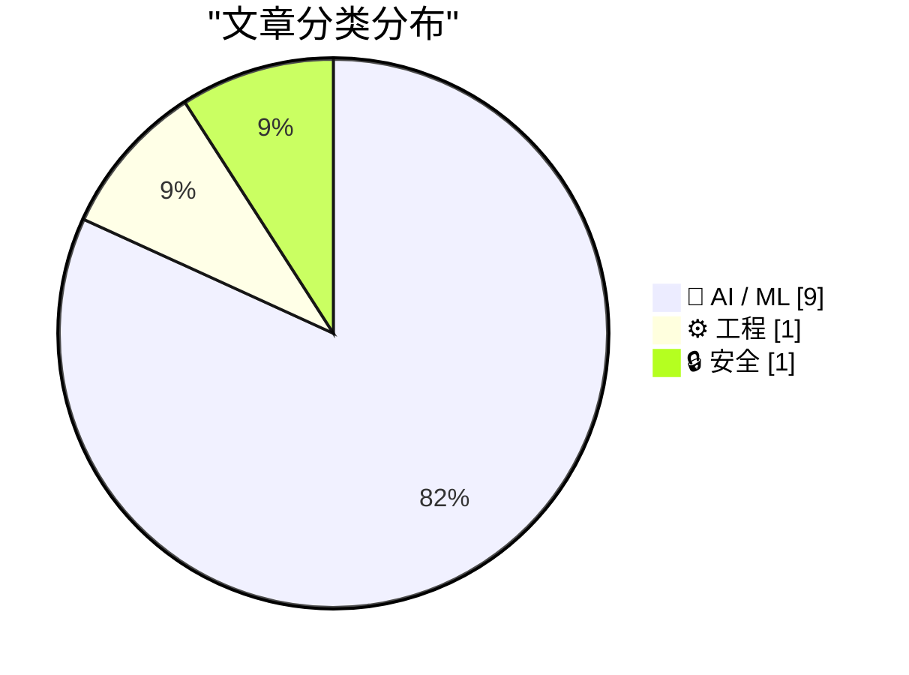
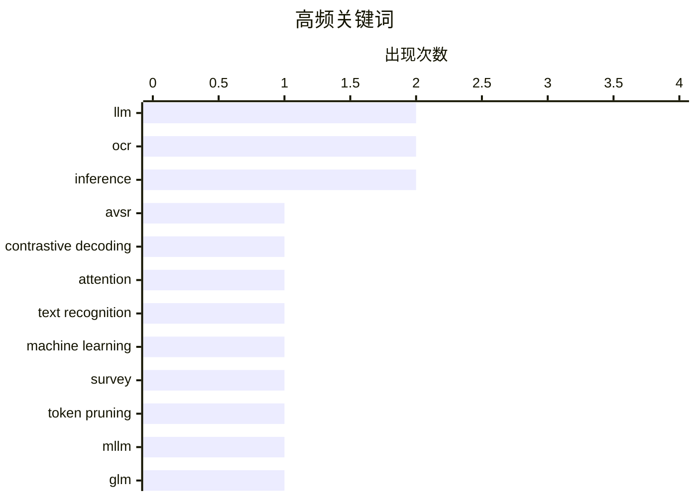

# 📰 AI 资讯每日精选 — 2026-08-29

> 汇聚 156+ 技术博客、X/Twitter、Hacker News、Reddit、Product Hunt、
> Lobste.rs、ClawFeed 日报及 GitHub Trending，经 AI 评分筛选。
>
> **本期内容**：🏆 今日必读 · 🌐 ClawFeed 日报 · 🔥 GitHub Trending · 📂 分类精选 · 📊 数据概览 · 🎯 项目相关情报 · 🌍 补充视角

## 📝 今日看点

今日技术圈聚焦多模态智能的深化与落地：从视觉令牌的高效剪枝到跨模态评估基准，业界正致力于让大模型更精准、更省地处理文本与视觉混合信息。同时，AI开始反哺科研本身，谷歌DeepMind的AI联合科学家已能自主完成实验规划与论文撰写，展现了从工具到协作者的跃迁。此外，开放权重生态持续升温，GLM-5.3的发布引发社区热议，而工程侧也更关注高可用与成本可控的推理部署。整体来看，效率、自主性与开放性构成了今日AI发展的关键词。

---

## 🏆 今日必读

🥇 **注意力引导的可靠性缩放用于鲁棒音视频语音识别中的对比解码**

[Attention-Guided Reliability Scaling for Contrastive Decoding in Robust Audio-Visual Speech Recognition](https://arxiv.org/abs/2608.26213) — arXiv Computer Vision · 3 小时前 · 🤖 AI / ML · **一手来源**

> 大型语言模型（LLM）为基础的音视频语音识别（AVSR）系统在噪声下表现鲁棒。对比解码（CD）最初用于通过对比弱模型和强模型来稳定LLM生成，无需额外训练即可调整预测。本文将CD应用于AVSR，通过在同一模型内对比仅音频条件与完整音视频条件。然而，直接应用CD可能因不可靠的音频条件而失败，因此提出注意力引导的可靠性缩放机制，根据注意力权重动态调整对比强度，从而提升鲁棒性。实验表明该方法在噪声环境下显著优于基线。

💡 **为什么值得读**: 提出了一种无需训练的改进对比解码方法，有效提升AVSR在噪声下的性能，值得关注。

🏷️ AVSR, contrastive decoding, LLM, attention

🥈 **机器学习模型与文本识别应用的系统文献综述**

[Systematic Literature Review of Machine Learning Models and Applications for Text Recognition](https://arxiv.org/abs/2608.26500) — arXiv Computer Vision · 3 小时前 · 🤖 AI / ML · **一手来源**

> 光学字符识别（OCR）在文本识别方面取得显著进步，尤其处理异构文本数据时。传统OCR模型难以应对字体变化、书写风格和退化文档。技术进步催生了具有改进架构的新AI模型，以处理多语言和复杂数据格式。尽管有这些进展，但缺乏对现有模型的全面评估。本文对机器学习模型在文本识别中的应用进行了系统文献综述，总结了当前方法、挑战和未来方向。

💡 **为什么值得读**: 系统梳理了OCR领域的最新进展，为研究者提供了全面的技术概览。

🏷️ OCR, text recognition, machine learning, survey

🥉 **ET-Prune：面向文本丰富多模态大模型的证据感知动态预算视觉令牌剪枝**

[ET-Prune: Evidence-Aware Dynamic Budgeting for Visual Token Pruning in Text-Rich MLLMs](https://arxiv.org/abs/2608.01979) — arXiv Computer Vision · 3 小时前 · 🤖 AI / ML · **一手来源**

> 视觉令牌剪枝可降低多模态大模型的推理成本，但固定令牌比例不适合文本丰富的输入。在OCR中心任务中，决定性证据可能是由问题指定的少量数字、标签或字段；不加区分地剪枝可能抹去这些证据，同时保留视觉显著但无关的区域。本文提出ET-Prune，一个无需训练的框架，将剪枝视为证据感知的动态预算分配问题。该方法根据问题相关性动态调整剪枝比例，在保持性能的同时显著降低计算开销。

💡 **为什么值得读**: 针对文本丰富场景的视觉令牌剪枝提出动态预算方案，有效平衡性能与效率。

🏷️ token pruning, MLLM, inference, OCR

4️⃣ **GLM-5.3 现已开放权重**

[GLM-5.3 is now open-weight](https://huggingface.co/zai-org/GLM-5.3) — Hacker News Best · 15 小时前 · 🤖 AI / ML

> 据报道，GLM-5.3模型现已开放权重，可在Hugging Face上获取。该模型由Z.ai发布，相关公告在Twitter和官方博客上发布。Hacker News上该消息获得659分和222条评论，表明社区高度关注。

💡 **为什么值得读**: 开放权重模型对AI研究和应用有重要影响，值得关注其性能和可用性。

🏷️ GLM, open-weight, LLM

5️⃣ **谷歌DeepMind的AI联合科学家现在能规划实验、运行实验室设备并撰写科学论文**

[Google Deepmind's AI Co-Scientist now plans experiments, runs lab equipment, and writes scientific papers](https://the-decoder.com/google-deepminds-ai-co-scientist-now-plans-experiments-runs-lab-equipment-and-writes-scientific-papers/) — The Decoder · 12 小时前 · 🤖 AI / ML · **二手来源**

> 谷歌DeepMind扩展了其AI联合科学家系统，从假设生成器转变为集成到实验室的研究系统。在三个学科中，从材料合成到医疗AI架构的自主开发，基于Gemini的多智能体系统提供了实验验证的结果。该系统能够规划实验、运行实验室设备并撰写科学论文，标志着AI在科学研究中的自动化水平进一步提升。

💡 **为什么值得读**: 展示了AI在科学研究中的端到端自动化能力，对科研领域具有变革性意义。

🏷️ AI Co-Scientist, multi-agent, lab automation

---

## 🌐 ClawFeed 日报精选

> 来源：[ClawFeed](https://clawfeed.kevinhe.io) — AI 驱动的多源新闻聚合

# ClawFeed Daily Digest | 2026-08-28 (SGT)

Aggregated from 5 × 4h digests (IDs: 1080, 1081, 1082, 1083, 1084)

---

## 🔥 Top 5 Most Important Items

**1. NVIDIA Q2 炸裂：收入 $96B（+106%），净利润 ~$60B，FY28 指引 +70%**
华尔街预期仅 +45%，NVIDIA 大幅超预期。Salesforce 当日涨 20%，"AI capex 是泡沫"和"SaaS 已死"两个叙事同时被击碎。Aaron Levie 长文强调软件是 AI 落地的护城河——数据治理、业务逻辑、权限管理都需要软件层。AI 基础设施投入正在转化为真实的收入增长。
*Sources: @levie, @DavidSacks*

**2. 腾讯混元 Hy4 Preview 开源：770B/49B MoE，1M 上下文，Apache-2.0**
又一个重量级开源前沿模型。主打生产力场景——长程写代码、改仓库、办公分析、游戏原型、科研推理。缓存输入仅 $0.042/M tokens。腾讯内部 WorkBuddy 已出现 Hy4-dev 选项，说明自家产品端已在使用。开源阵营实力再增。
*Source: @NFT_Chen*

**3. Charles Schwab 计划扩展至 SOL/AVAX/LINK**
传统券商巨头超越此前仅支持的 BTC/ETH，是 TradFi 对山寨币态度转变的里程碑。同日 DeFi Development Corp 以均价 $98.14 增持 1.9 万枚 SOL（总持仓 233 万枚），机构信心在消息前已有实质行动。
*Sources: @CoinMarketCap, @Techub_News*

**4. Qwen 3.8 Flash Next (125B-A6B) 在 Apple Silicon 本地运行：prefill ~700 tok/s**
通过 mlx-serve（纯 Zig + Metal，无需 Python），M4 Max 实测 prefill ~700 tok/s、输出 ~98 tok/s（MTP 加速）。本地跑 125B MoE 模型达到这个速度，对 AIPC 玩家和不依赖云端 API 的开发者是重大利好。
*Sources: @fankaishuoai, @ddalcu*

**5. Skild AI 发布 S1 机器人基础模型：看一段视频就学会 10 分钟长任务**
仅需一段视频示范即可学习从未见过的长任务，无需 fine-tuning，实时运行。从单一演示到通用操作的飞跃——机器人从"教一个动作"进化到"看一遍就会"。同日 Anthropic 发布 Model Hardware Standard，AI 进入物理世界的趋势加速。
*Sources: @guruchahal, @SkildAI, @AnthropicAI*

---

## 📰 Core Themes of the Day

### 1. AI 基础设施投入获得回报验证
NVIDIA Q2 收入翻倍，Salesforce +20%，Box 14 季度最高增速。"AI capex 泡沫论"正在被财报数据驳斥。Aaron Levie 的核心论点：AI 的价值需要软件层来释放——数据治理、权限管理、业务逻辑都是护城河。

### 2. Harness Engineering 从概念到工具链落地
Google 发布 9 页 Harness Engineering PDF（Agent = Model + Harness），Vercel 推出 HarnessAgent SDK 和 Workflow SDK（纯 TypeScript 编译工作流图），Mark Ajzenstadt 的比喻精准——"模型是涡扇发动机，harness 是驾驶舱"。Cursor 宣布 create → Origin → Vercel 一键部署闭环。Prompt engineering 之后，harness engineering 正在成为下一个核心技能。

### 3. 开源前沿模型加速追赶
腾讯 Hy4（770B/49B MoE）、Qwen 3.8 Flash Next 本地跑 125B、DeepSeek V4 Flash 以 $0.12 拿下 IMO 金牌。InferX 创始人称每周都有团队从 frontier API 转向开源，驱动力四合一：数据主权、成本、控制权、性能。开源正在从"性能妥协"变为"实用首选"。

### 4. TradFi-Crypto 加速融合
Schwab 扩展山寨币、Coinbase 在 Base 发行代币化股票、BNB Chain 加入 Mastercard Crypto Partner Program、Aerodrome 在 Base 年内交易量突破 $1000 亿。Ethena 解决 token/equity 错位难题——回购早期投资者锁定代币，Dankrad Feist 称之为 crypto 投资领域的关键突破。Forward Industries 公布 Solana 治理投票立场。链上金融从概念走向主流基础设施。

### 5. AI 向物理世界扩展
Anthropic 推出 Model Hardware Standard（AI Agent 安全操控物理硬件的规范），Skild AI S1 机器人基础模型从单段视频学习长任务，Bootoshi 实现 AI 语音通过 FaceTime Audio 呼叫 iPhone。AI 从纯数字交互进入物理操控和系统级集成阶段。

### 6. Agent 生态工具链成熟
RunInfra（YC F26）实测 93-98% cache hit rate、缓存输入 $0.01/M tokens；Agent Skills 生态出现排行榜工具，find-skills 超 310 万安装；Taste Skill 81.5K 安装推动 AI 从"能用"走向"好用"；LlamaIndex 新增 agentic 电子表格提取。

---

## 🔖 Cumulative Bookmark Highlights

本日所有 5 个 4h 周期均报告 bookmarks 为此前存量文章，无新增内容。

---

## 👀 Recommended Follows Summary

本日所有 5 个 4h 周期均未发现符合推荐标准的新账号。

---

## 💤 Noise Patterns of the Day

1. **孙宇晨/景甜八卦全天刷屏** — 从凌晨到深夜持续出现在各 4h 周期的噪音过滤中，多条转发评论，娱乐花边与 AI/crypto/tech 核心无关
2. **Ramin Nasibov 灌水常客** — 每个 4h 周期都出现，内容模式固定：纯视频/图片无实质文字、Adobe 吐槽、Batman 笑话、过誉景点提问等
3. **Elon Musk 政治评论** — 学校意识形态、暴力犯罪/死刑、Lake Ontario 改名等政治话题，Starlink 半价推广
4. **交易所/生态营销内容** — Binance 低信息量推文（"say less"/"you'll see it too"）、BNB Chain 活动汇总、BMT 交易锦标赛、Solana PSA Card + eBay 收藏品
5. **VPN 教程/个人里程碑/个人感悟类** — 低信息密度内容（DHH "New mood"、Lenny "I finished it"、各类个人感言）---

## 🔥 GitHub Trending

> 今日热门开源项目（全语言 + Python）

| # | 项目 | 描述 | ⭐ 总星 | 📈 今日 | 语言 |
|---|------|------|---------|---------|------|
| 1 | [tt-a1i/archify](https://github.com/tt-a1i/archify) 🤖 | Agent skill for beautiful, verifiable architecture, workf... | 28.4k | +4562 | JavaScript |
| 2 | [bilawalsidhu/gods-eye-view](https://github.com/bilawalsidhu/gods-eye-view) | A spy satellite simulator in your browser, except the dat... | 11.4k | +3829 | JavaScript |
| 3 | [freestylefly/awesome-gpt-image-2](https://github.com/freestylefly/awesome-gpt-image-2) 🤖 | Prompt as Code | GPT-Image2 工业级提示词引擎与模板库，530+ 个案例逆向工程，20+... | 24.5k | +1687 | JavaScript |
| 4 | [DietrichGebert/ponytail](https://github.com/DietrichGebert/ponytail) 🤖 | Makes your AI agent think like the laziest senior dev in ... | 115.7k | +1396 | JavaScript |
| 5 | [calesthio/OpenMontage](https://github.com/calesthio/OpenMontage) 🤖 | World's first open-source, agentic video production syste... | 53.5k | +1144 | Python |
| 6 | [tailscale/tailcat](https://github.com/tailscale/tailcat) | like netcat, but over Tailscale's data plane, without Tai... | 3.0k | +965 | Go |
| 7 | [K-Dense-AI/scientific-agent-skills](https://github.com/K-Dense-AI/scientific-agent-skills) 🤖 | Turn any AI agent into an AI Scientist. The #1 Agent Skil... | 37.0k | +720 | Python |
| 8 | [rohitg00/ai-engineering-from-scratch](https://github.com/rohitg00/ai-engineering-from-scratch) 🤖 | Learn it. Build it. Ship it for others. | 50.7k | +703 | Python |
| 9 | [JetBrains/go-modern-guidelines](https://github.com/JetBrains/go-modern-guidelines) 🤖 | Help AI coding agents write modern Go | 2.7k | +574 | Go |
| 10 | [Graphify-Labs/graphify](https://github.com/Graphify-Labs/graphify) 🤖 | Turn any codebase, with its docs, SQL schemas, configs, a... | 112.1k | +514 | Python |
| 11 | [anthropics/claude-plugins-official](https://github.com/anthropics/claude-plugins-official) 🤖 | Official, Anthropic-managed directory of high quality Cla... | 35.1k | +457 | Python |
| 12 | [tashfeenahmed/freellmapi](https://github.com/tashfeenahmed/freellmapi) 🤖 | 7.4 billion tokens per month. 34 free LLM providers. 635 ... | 21.7k | +433 | TypeScript |
| 13 | [mvanhorn/last30days-skill](https://github.com/mvanhorn/last30days-skill) 🤖 | AI agent skill that researches any topic across Reddit, X... | 60.0k | +394 | Python |
| 14 | [ComposioHQ/awesome-claude-skills](https://github.com/ComposioHQ/awesome-claude-skills) 🤖 | A curated list of awesome Claude Skills, resources, and t... | 73.8k | +343 | Python |
| 15 | [abi/screenshot-to-code](https://github.com/abi/screenshot-to-code) | Drop in a screenshot and convert it to clean code (HTML/T... | 75.7k | +326 | Python |

---

## 🤖 AI / ML

### 1. 注意力引导的可靠性缩放用于鲁棒音视频语音识别中的对比解码

[Attention-Guided Reliability Scaling for Contrastive Decoding in Robust Audio-Visual Speech Recognition](https://arxiv.org/abs/2608.26213) — **arXiv Computer Vision** · 3 小时前 · ⭐ 23/30 · **一手来源**

> 大型语言模型（LLM）为基础的音视频语音识别（AVSR）系统在噪声下表现鲁棒。对比解码（CD）最初用于通过对比弱模型和强模型来稳定LLM生成，无需额外训练即可调整预测。本文将CD应用于AVSR，通过在同一模型内对比仅音频条件与完整音视频条件。然而，直接应用CD可能因不可靠的音频条件而失败，因此提出注意力引导的可靠性缩放机制，根据注意力权重动态调整对比强度，从而提升鲁棒性。实验表明该方法在噪声环境下显著优于基线。

🏷️ AVSR, contrastive decoding, LLM, attention

---

### 2. 机器学习模型与文本识别应用的系统文献综述

[Systematic Literature Review of Machine Learning Models and Applications for Text Recognition](https://arxiv.org/abs/2608.26500) — **arXiv Computer Vision** · 3 小时前 · ⭐ 24/30 · **一手来源**

> 光学字符识别（OCR）在文本识别方面取得显著进步，尤其处理异构文本数据时。传统OCR模型难以应对字体变化、书写风格和退化文档。技术进步催生了具有改进架构的新AI模型，以处理多语言和复杂数据格式。尽管有这些进展，但缺乏对现有模型的全面评估。本文对机器学习模型在文本识别中的应用进行了系统文献综述，总结了当前方法、挑战和未来方向。

🏷️ OCR, text recognition, machine learning, survey

---

### 3. ET-Prune：面向文本丰富多模态大模型的证据感知动态预算视觉令牌剪枝

[ET-Prune: Evidence-Aware Dynamic Budgeting for Visual Token Pruning in Text-Rich MLLMs](https://arxiv.org/abs/2608.01979) — **arXiv Computer Vision** · 3 小时前 · ⭐ 23/30 · **一手来源**

> 视觉令牌剪枝可降低多模态大模型的推理成本，但固定令牌比例不适合文本丰富的输入。在OCR中心任务中，决定性证据可能是由问题指定的少量数字、标签或字段；不加区分地剪枝可能抹去这些证据，同时保留视觉显著但无关的区域。本文提出ET-Prune，一个无需训练的框架，将剪枝视为证据感知的动态预算分配问题。该方法根据问题相关性动态调整剪枝比例，在保持性能的同时显著降低计算开销。

🏷️ token pruning, MLLM, inference, OCR

---

### 4. GLM-5.3 现已开放权重

[GLM-5.3 is now open-weight](https://huggingface.co/zai-org/GLM-5.3) — **Hacker News Best** · 15 小时前 · ⭐ 28/30

> 据报道，GLM-5.3模型现已开放权重，可在Hugging Face上获取。该模型由Z.ai发布，相关公告在Twitter和官方博客上发布。Hacker News上该消息获得659分和222条评论，表明社区高度关注。

🏷️ GLM, open-weight, LLM

---

### 5. 谷歌DeepMind的AI联合科学家现在能规划实验、运行实验室设备并撰写科学论文

[Google Deepmind's AI Co-Scientist now plans experiments, runs lab equipment, and writes scientific papers](https://the-decoder.com/google-deepminds-ai-co-scientist-now-plans-experiments-runs-lab-equipment-and-writes-scientific-papers/) — **The Decoder** · 12 小时前 · ⭐ 26/30 · **二手来源**

> 谷歌DeepMind扩展了其AI联合科学家系统，从假设生成器转变为集成到实验室的研究系统。在三个学科中，从材料合成到医疗AI架构的自主开发，基于Gemini的多智能体系统提供了实验验证的结果。该系统能够规划实验、运行实验室设备并撰写科学论文，标志着AI在科学研究中的自动化水平进一步提升。

🏷️ AI Co-Scientist, multi-agent, lab automation

---

### 6. Procedura：具有程序化控制的智能体3D建模

[Procedura: Agentic 3D Modeling with Procedural Control](https://arxiv.org/abs/2608.26238) — **arXiv Computer Vision** · 3 小时前 · ⭐ 25/30 · **一手来源**

> 原生3D生成器现在能从单张图像恢复令人印象深刻的网格几何形状。然而，密集网格在机械物体应尖锐的地方保持柔软，没有部件分解，也没有用户可编辑的参数。为解决此问题，本文探索“3D形状即代码”的范式，利用并扩展LLM的编码能力进行3D建模。作者提出Procedura，一种新颖的3D建模智能体框架，将对象编写为程序化代码，实现可编辑和参数化的3D模型。

🏷️ 3D modeling, agentic, procedural

---

### 7. 模态成熟度指数：评估全能模型多模态能力的基准

[Modality Maturity Index: A benchmark for assessing multimodal capabilities of omni models](https://arxiv.org/abs/2608.26317) — **arXiv Computer Vision** · 3 小时前 · ⭐ 25/30 · **一手来源**

> 前沿语言模型越来越多地被宣传为能够跨模态感知和响应的全能系统。然而，现有评估框架几乎只关注双模态理解，通常是文本加另一种模态。本文提出模态成熟度指数（MMI），一个旨在评估大语言模型在五种模态（文本、图像、音频、视频和文档）上的多模态能力的基准。该基准提供了更全面的评估维度，以衡量模型的真正多模态能力。

🏷️ multimodal, benchmark, omni model

---

### 8. Anthropic：AI模型能否评判AI安全研究提案？

[Anthropic: Can AI Models Judge AI Safety Research Proposals?](https://www.reddit.com/r/singularity/comments/1w19iu8/anthropic_can_ai_models_judge_ai_safety_research/) — **r/singularity** · 5 小时前 · ⭐ 25/30

> Anthropic发布了一项研究，探讨AI模型是否能够有效评估AI安全研究提案。该研究可能涉及使用AI模型对研究提案进行评审，以加速安全研究的筛选过程。文章讨论了AI评审的潜在优势，如提高效率和一致性，但也指出了可能存在的偏见和局限性。Anthropic认为，尽管AI评审有前景，但需要谨慎设计，以确保评审质量。

🏷️ AI safety, evaluation, Anthropic

---

### 9. 寻找正确证据：长视频因子引导的由粗到细推理

[Finding the Right Evidence: Factor-Guided Coarse-to-Fine Reasoning for Long Videos](https://arxiv.org/abs/2608.26355) — **arXiv Computer Vision** · 3 小时前 · ⭐ 24/30 · **一手来源**

> 尽管LVLM快速进步，长视频问答仍然具有挑战性：相关证据稀疏，且与问题相关的上下文往往无法提供区分正确答案和合理干扰项的线索。对MMR-V手动注释子集的诊断分析显示，先前的智能体系统在提示检索方面比直接VLM推理有显著改进，但未能实现相应的答案准确性提升。本文提出因子引导的由粗到细推理方法，以更好地定位和利用证据。

🏷️ long video, reasoning, LVLM

---

## ⚙️ 工程

### 10. 负载分散：Salesforce如何通过SageMaker推理组件实现多AZ高可用

[Spreading the load: How Salesforce met Multi-AZ HA with SageMaker Inference Components](https://aws.amazon.com/blogs/machine-learning/spreading-the-load-how-salesforce-met-multi-az-ha-with-sagemaker-inference-components/) — **AWS Machine Learning Blog** · 14 小时前 · ⭐ 22/30 · **一手来源**

> 本文介绍了Salesforce如何使用Amazon SageMaker AI推理组件放置（SchedulingConfig参数）将模型副本分布到多个可用区，以满足其多AZ高可用合规要求，同时不牺牲多模型共置的成本效率。文章详细说明了实现方法和技术细节。

🏷️ SageMaker, inference, high availability

---

## 🔒 安全

### 11. OpenAI、谷歌等数十家科技公司联合呼吁紧急应对AI网络威胁

[OpenAI, Google join dozens of tech companies to call for urgent action against AI-powered threats | The companies stress in a letter that there is a “limited window” to prepare for AI-enabled cyberattacks before critical infrastructure is impacted.](https://www.reddit.com/r/singularity/comments/1w0t2my/openai_google_join_dozens_of_tech_companies_to/) — **r/singularity** · 15 小时前 · ⭐ 24/30

> OpenAI、谷歌等数十家科技公司联合签署公开信，呼吁采取紧急行动应对AI驱动的网络攻击。信中强调，在关键基础设施受到影响之前，有一个“有限的窗口”来准备应对AI增强的网络攻击。这些公司敦促政府和企业加强防御措施，并合作开发新的安全协议。文章指出，AI技术的快速发展使得网络攻击更加复杂和难以防范，因此需要立即采取行动。

🏷️ AI security, cyber threats, policy

---

## 📊 数据概览

| 扫描源 | 抓取文章 | 时间范围 | 精选 |
|:---:|:---:|:---:|:---:|
| 102/156 | 5408 篇 → 269 篇 | 24h | **11 篇** |

### 分类分布



### 高频关键词



<details>
<summary>📈 纯文本关键词图（终端友好）</summary>

```
llm                  │ ████████████████████ 2
ocr                  │ ████████████████████ 2
inference            │ ████████████████████ 2
avsr                 │ ██████████░░░░░░░░░░ 1
contrastive decoding │ ██████████░░░░░░░░░░ 1
attention            │ ██████████░░░░░░░░░░ 1
text recognition     │ ██████████░░░░░░░░░░ 1
machine learning     │ ██████████░░░░░░░░░░ 1
survey               │ ██████████░░░░░░░░░░ 1
token pruning        │ ██████████░░░░░░░░░░ 1
```

</details>

### 🏷️ 话题标签

**llm**(2) · **ocr**(2) · **inference**(2) · avsr(1) · contrastive decoding(1) · attention(1) · text recognition(1) · machine learning(1) · survey(1) · token pruning(1) · mllm(1) · glm(1) · open-weight(1) · ai co-scientist(1) · multi-agent(1) · lab automation(1) · 3d modeling(1) · agentic(1) · procedural(1) · multimodal(1)

---

## 🎯 项目相关情报

### Agent 基座安全与合规

> 暂无达到质量门槛的项目相关情报。

### 多 Agent 架构

> 暂无达到质量门槛的项目相关情报。

### ASR 与语音助手

#### [注意力引导的可靠性缩放用于鲁棒音视频语音识别中的对比解码](https://arxiv.org/abs/2608.26213)

> **状态**：本期 Top 11 已收录

- **匹配类型**：直接相关
- **项目相关性**：8/10
- **可落地性**：8/10
- **为什么相关**：提出注意力引导对比解码提升音频-视觉语音识别鲁棒性，可直接用于 ASR 抗噪优化与实时转写。
- **建议动作**：复现其解码策略并集成到低延迟语音助手，在噪声环境评测 WER 与延迟指标。
- **来源**：arXiv Computer Vision · 一手来源

### 商品包装 OCR

#### [机器学习模型与文本识别应用的系统文献综述](https://arxiv.org/abs/2608.26500)

> **状态**：本期 Top 11 已收录

- **匹配类型**：直接相关
- **项目相关性**：8/10
- **可落地性**：7/10
- **为什么相关**：系统综述机器学习文本识别模型与应用，覆盖 OCR 技术栈与评测，可直接指导商品包装文字识别模型选型。
- **建议动作**：通读综述，提取适合复杂包装背景的模型与数据集，评估迁移到商品场景的可行性与基线。
- **来源**：arXiv Computer Vision · 一手来源

#### [ET-Prune：面向文本丰富多模态大模型的证据感知动态预算视觉令牌剪枝](https://arxiv.org/abs/2608.01979)

> **状态**：本期 Top 11 已收录

- **匹配类型**：直接相关
- **项目相关性**：7/10
- **可落地性**：6/10
- **为什么相关**：面向 OCR 任务的视觉 token 剪枝方法，可提升商品包装多模态识别的推理效率，减少资源占用。
- **建议动作**：结合包装图片测试动态预算剪枝，对比精度与速度，探索集成到现有 OCR 流水线。
- **来源**：arXiv Computer Vision · 一手来源

---

## 🌍 补充视角

> Top 11 未覆盖的高质量不同来源，最多 3 条。

### 1. GLM-5.3 Flash在中国硬件上运行的实际意义

[What GLM-5.3 Flash running on Chinese hardware actually means](https://martinalderson.com/posts/glm-5-3-flash-chinese-hardware/?utm_source=rss&amp;utm_medium=rss&amp;utm_campaign=feed) — **martinalderson.com** · 7 小时前 · 🤖 AI / ML · ⭐ 23/30

> Z.AI在中国国产芯片上完成了完整模型发布，这一成就令人瞩目。然而，EUV光刻技术是一道难以逾越的壁垒，西方推理硬件与中国的差距更可能扩大而非缩小。文章指出，尽管中国在芯片制造上取得进展，但受限于光刻技术，其硬件性能仍落后于西方。因此，GLM-5.3 Flash在中国硬件上的运行虽具象征意义，但实际性能与西方硬件相比仍有差距。作者认为，中国在AI硬件领域追赶西方的道路依然漫长。

💡 **补充价值**：这篇文章提供了对中国AI芯片进展的客观评估，有助于理解中美技术差距的真实状况。

### 2. 使用NVIDIA TensorRT Model Connect两步部署开放模型：从检查点到推理

[Deploy an Open Model from Checkpoint to Inference in Two Commands with NVIDIA TensorRT Model Connect](https://developer.nvidia.com/blog/deploy-an-open-model-from-checkpoint-to-inference-in-two-commands-with-nvidia-tensorrt-model-connect/) — **NVIDIA Technical Blog** · 13 小时前 · 🛠 工具 / 开源 · ⭐ 23/30

> 开放AI模型发展迅速，但将其集成到原生应用通常需要模型特定的转换和预处理。NVIDIA TensorRT Model Connect旨在简化这一过程，仅需两个命令即可完成从检查点到推理的部署。该工具支持多种开放模型，并自动处理优化，减少开发者的工作量。通过TensorRT Model Connect，开发者可以更高效地将模型部署到生产环境。

💡 **补充价值**：对于希望快速部署AI模型的开发者，这篇文章介绍的工具能显著简化流程，值得一读。

### 3. 高级会员：循环融资仇恨指南（第一部分）

[Premium: The Hater's Guide To Circular Financing (Part One)](https://www.wheresyoured.at/premium-the-haters-guide-to-circular-financing-part-one/) — **wheresyoured.at** · 15 小时前 · 💡 观点 / 杂谈 · ⭐ 22/30

> 文章以讽刺口吻批评科技行业中的循环融资现象，即公司通过相互投资和估值虚高来制造虚假繁荣。作者指出，NVIDIA等巨头与AI实验室之间的交易并非基于实际需求，而是为了维持股价和融资循环。文章认为这种模式不可持续，最终会导致泡沫破裂。

💡 **补充价值**：这篇文章以幽默和批判性视角揭示了科技行业融资的阴暗面，对于理解当前AI泡沫风险具有启发意义。

---

*生成于 2026-08-29 07:00 | 汇聚 156 个技术博客、X/Twitter、Hacker News、Reddit、Product Hunt、Lobste.rs、ClawFeed 日报及 GitHub Trending，经 AI 评分筛选出 Top 11 精华内容，另附 3 条不同来源补充视角*
