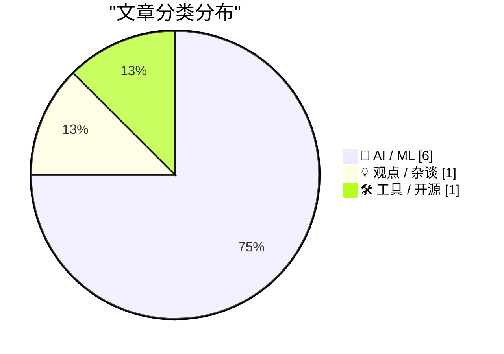
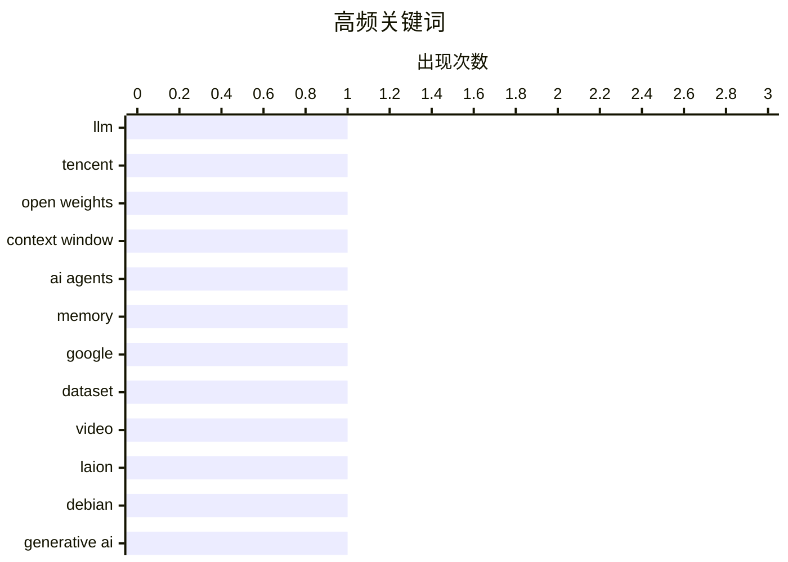

# 📰 AI 资讯每日精选 — 2026-08-30

> 汇聚 156+ 技术博客、X/Twitter、Hacker News、Reddit、Product Hunt、
> Lobste.rs、ClawFeed 日报及 GitHub Trending，经 AI 评分筛选。
>
> **本期内容**：🏆 今日必读 · 🌐 ClawFeed 日报 · 🔥 GitHub Trending · 📂 分类精选 · 📊 数据概览 · 🎯 项目相关情报

## 📝 今日看点

今日技术圈聚焦AI基础能力突破与行业渗透的双重变奏。开源大模型继续冲击规模上限，视频数据集与持久记忆框架则分别从数据厚度和代理学习机制上夯实基建。与此同时，生成式AI加速改写内容生产逻辑，短剧行业大规模取代人力已引发劳动争议，而社区层面如Debian对AI使用的规则化，也折射出技术落地与伦理约束的同步角力。

---

## 🏆 今日必读

🥇 **腾讯发布Hy4预览版：770B参数开源权重模型**

[Introducing Hy4 Preview](https://simonwillison.net/2026/Aug/29/hy4/) — simonwillison.net · 5 小时前 · 🤖 AI / ML

> 腾讯今日发布新开源权重文本模型Hy4预览版，总参数770B，激活参数49B，上下文窗口1M token，模型文件在Hugging Face上达1.56TB。相比7月发布的Hy3（295B总参数、21B激活、256K上下文），Hy4在规模上大幅提升。该模型仅支持文本输入，不支持视觉。

💡 **为什么值得读**: 关注腾讯最新开源大模型的技术规格和规模跃升，适合跟踪前沿模型动态。

🏷️ LLM, Tencent, open weights, context window

🥈 **谷歌WikiSkill：为AI代理提供持久记忆，从错误中学习以提升性能**

[Google's WikiSkill gives AI agents a persistent memory of past mistakes to sharpen future performance](https://the-decoder.com/google-gives-ai-agents-their-own-wiki-so-they-can-learn-from-mistakes-and-successes/) — The Decoder · 16 小时前 · 🤖 AI / ML · **二手来源**

> 谷歌研究院推出WikiSkill框架，为AI代理提供持久知识库。代理不再在每次运行后丢弃所学，而是将失败和成功经验记录在类似wiki的结构中，并利用这些知识逐步改进。研究表明，大型模型受益更多，但小型模型借助WikiSkill也能达到无此框架的更大模型的性能。

💡 **为什么值得读**: 了解谷歌如何通过持久记忆机制提升AI代理性能，对AI代理研究和应用有启发。

🏷️ AI agents, memory, Google

🥉 **LAION发布大规模开放视频数据集：1000万小时素材助力AI研究**

[LAION drops massive open video dataset with 10 million hours of footage for AI research](https://the-decoder.com/laion-drops-massive-open-video-dataset-with-10-million-hours-of-footage-for-ai-research/) — The Decoder · 19 小时前 · 🤖 AI / ML · **二手来源**

> LAION的Big Video Dataset（BVD）是最大的开放视频数据集之一，包含8000万个视频、1000万小时时长和5500万个自动描述片段。基于BVD训练的模型在基准测试中比之前的InternVid最高提升2.1个百分点。法律上，LAION可能引用2024年汉堡法院的裁决，允许为非商业研究收集受版权保护的内容。

💡 **为什么值得读**: 关注大规模开放视频数据集的最新进展，对AI视频研究和训练具有重要参考价值。

🏷️ dataset, video, LAION

4️⃣ **Debian投票允许“负责任地使用生成式AI”**

[Debian votes to allow "responsible use of generative AI"](https://lwn.net/Articles/1091231/) — Hacker News Best · 15 小时前 · 🤖 AI / ML

> Debian项目通过投票，允许在项目内“负责任地使用生成式AI”。该决议在LWN上发布，并在Hacker News上引发热议，获得475分和444条评论。具体内容和影响需进一步阅读原文。

💡 **为什么值得读**: 了解开源社区对生成式AI使用的态度转变，对开源项目政策制定有参考意义。

🏷️ Debian, generative AI, policy

5️⃣ **智能体文明的兴衰**

[The Rise and Fall of Agent Civilizations](https://www.dwarkesh.com/p/openai-huggingface) — dwarkesh.com · 6 小时前 · 💡 观点 / 杂谈

> 文章用通俗易懂的语言讲述了OpenAI和Hugging Face的完整故事，涉及两家公司的发展历程、竞争与合作，以及它们在AI领域的影响。具体细节和观点需阅读原文。

💡 **为什么值得读**: 以简明方式梳理OpenAI与Hugging Face的关系，适合快速了解AI行业格局。

🏷️ OpenAI, Hugging Face, agents, AI

---

## 🌐 ClawFeed 日报精选

> 来源：[ClawFeed](https://clawfeed.kevinhe.io) — AI 驱动的多源新闻聚合

📋 ClawFeed Daily | 2026-08-29 (SGT)

来源：5 期 4h digest (#1087 00:00, #1088 04:00, #1089 08:00, #1090 12:00, #1091 16:00)
feed 175 (5×35) · bookmarks 95 (5×19) · errors 0

---

🔥 当日全场最重要 5 条

1. **Claude Opus 5.1 灰度推送**：Dan McAteer 确认 Opus 5.1 已开始灰度推送，最大改进是回复风格——不再有冗长技术铺垫，直接回答。903 likes、81K views，社区反响强烈。(@daniel_mac8, #1087)

2. **NVIDIA Q2 财报碾压 "AI 泡沫" 叙事**：收入 $96B（+106%），净利润 ~$60B，毛利率 75%，FY28 指引 +70%（华尔街预期仅 45%）。Salesforce +20%。Aaron Levie / David Sacks 同时点评 "AI capex is a bubble" 和 "SaaS is dead" 两大叙事被击碎。(@levie, #1087)

3. **Grok Bot 接入 Stripe 支付 + 模板分享**：AI agent 直接闭环交易，从聊天到付款一步到位。Patrick Collison 亲推。随后又上线 Bot 模板分享功能，生态加速成型。1.3M views。(@elonmusk, #1088/#1089)

4. **AI 市场渗透率不到知识工作者劳动支出的 1%**：Guru Chahal（Lightspeed VP）粗算，整个 AI 行业在 $6T+ 市场连 1% 都没吃到，最好的垂直领域也才低个位数。增长空间巨大。(@guruchahal, #1089/#1090/#1091)

5. **Anthropic 移除 ~80% Claude Code system prompt**：trq212 分享一手经验——为新模型写 system prompt / skills / CLAUDE.md 的最佳实践。对所有 Claude Code 用户直接可用。(@trq212, #1090/#1091)

---

📰 当日核心主题

**🤖 Agent 基础设施加速**
全天最密集的主题。Grok Bot 接入 Stripe 支付并上线模板分享（#1088/#1089）；Cloudflare 发布 @cloudflare/computer 给 Agent 配虚拟电脑（#1089/#1090）；BruceGuai 拆解 Agent 公司 OS 的分层编排架构（#1090/#1091）；Elvis 谈前沿模型做编排、开源模型做执行的分层趋势（#1087）。Agent 从 demo 走向 production infrastructure。

**📊 AI 军备竞赛持续加速**
Claude Opus 5.1 灰度推送（#1087）；Gemini 3.8 Flash Preview 已在 Google 内部测试，距 3.7 仅两周（#1088/#1090）；Tencent Hy4 Preview 770B 参数 49B 激活（#1087）；RunInfra 跑 DeepSeek V4 Pro 到 296 tok/s（#1087/#1089）。模型发布节奏从大版本变成类 Chrome 持续交付。

**💰 Crypto/DeFi 治理与基础设施**
Solana 治理投票吸引 263M SOL（~$27.7B）参与（#1089/#1090）；xStocks 在 Solana 上 AUM 12 个月破 $5 亿（#1089）；Ethena USDe 在 Robinhood Chain 上 8 周破 $3.2 亿（#1087）；SBI Holdings $2.7 亿入股印尼券商推日元稳定币（#1088）。

**🏢 企业 AI 落地信号**
NVIDIA/Salesforce/Box 财报验证 AI 投资回报（#1087/#1088）；微软 $25 亿 + 6000 人做嵌入式 AI 工程（#1088）；Warp 分享 self-improving agents 实践（#1090）；6 周跑通保险理赔 AI agent（#1090）。

**🔧 开发者工具与生态**
MCP 生态持续扩展——Resend 月调用破百万、LangChain 支持新规范（#1087/#1088/#1089）；Claude Code 新增 Model Switch Hooks（#1088）；anydoc 新增 OCR <5ms（#1087）；Andrew Ng 发布 AI Engineering 技能图谱（#1089/#1090）。

---

🔖 累计 Bookmark 精选（当日新增/更新）

• @guruchahal — AI 市场渗透率 <1%，$6T+ 增长空间（#1089, 跨 3 期重复出现）
• @AndrewYNg — AI Engineering 核心技能图谱（#1089, 跨 3 期）
• @xiaohu — Cloudflare @cloudflare/computer 给 Agent 配虚拟电脑（#1089, 跨 3 期）
• @trq212 — Claude Code system prompt 精简 80% 实战经验（#1090, 跨 2 期）
• @BruceGuai — Matrix Agent 公司 OS 架构拆解（#1090, 跨 2 期）
• @arrakis_ai / @gdb — GPT-Realtime-2 实时音频翻译（#1089, 跨 3 期）
• @turingou — wanman.ai 一人公司 AI agents 框架持续迭代（#1089, 跨 3 期）
• @Av1dlive — Anthropic Claude for Finance 讲座（#1090, 跨 2 期）
• @demishassabis — DeepMind CEO 到 YC 做客，大量 startup 用 Gemma（#1090）

---

👀 推荐关注汇总（去重）

• @runinfrai (RunInfra, YC F26) — 推理优化平台，DeepSeek V4 Pro 296 tok/s，板上最便宜 V4 Pro 价格。https://x.com/runinfrai
• @trq212 — Anthropic 内部工程师，Claude Code system prompt 写作一手经验。https://x.com/trq212
• @_LuoFuli (Fuli Luo) — 小米 MiMo 构建者，前 DeepSeek 成员。https://x.com/_LuoFuli
• @sainingxie (Saining Xie) — AMI Labs 联合创始人，前 DeepMind / FAIR，顶级 CV/AI 研究者转创业。https://x.com/sainingxie
• @kalinowski007 (Caitlin Kalinowski) — Anthropic MTS，Axon 董事会成员。https://x.com/kalinowski007
• @istdrc (stdrc) — Raft 联合创始人 CEO，前 Kimi CLI 作者，Agent+编辑器方向。https://x.com/istdrc

提醒：上述未通过浏览器逐一核实是否已关注，操作前请先搜索确认。

---

💤 当日重复噪音模式

1. **Crypto 喊单/情绪帖**：@Btc_kking, @0xMoon, @AwbczBTC, @wolfyxbt, @andyyy 等，全天持续出现
2. **RaminNasibov**：每期都有纯图片/视频帖，无实质文字内容
3. **garrytan**：SF 本地政治话题反复出现（3 期），非核心领域
4. **vvxiaoyu8888**：Four.meme 香港线下聚会帖跨期重复（2 期）
5. **社交/活动签到帖**：线下聚会、晚宴照片、旅行日记等非信息帖跨多期出现
6. **binance/Coinbase**：官方账号发段子/互动帖，无实质内容（3 期）

—
本日 5 期 4h digest 全部正常产出，无中断、无 CDP 异常、无 scrape 错误。
---

## 🔥 GitHub Trending

> 今日热门开源项目（全语言 + Python）

| # | 项目 | 描述 | ⭐ 总星 | 📈 今日 | 语言 |
|---|------|------|---------|---------|------|
| 1 | [tt-a1i/archify](https://github.com/tt-a1i/archify) 🤖 | Agent skill for beautiful, verifiable architecture, workf... | 31.6k | +3902 | JavaScript |
| 2 | [bilawalsidhu/gods-eye-view](https://github.com/bilawalsidhu/gods-eye-view) | A spy satellite simulator in your browser, except the dat... | 12.8k | +1855 | JavaScript |
| 3 | [K-Dense-AI/scientific-agent-skills](https://github.com/K-Dense-AI/scientific-agent-skills) 🤖 | Turn any AI agent into an AI Scientist. The #1 Agent Skil... | 38.1k | +1587 | Python |
| 4 | [THU-MAIC/OpenMAIC](https://github.com/THU-MAIC/OpenMAIC) 🤖 | Open Multi-Agent Interactive Classroom — Get an immersive... | 22.5k | +907 | TypeScript |
| 5 | [calesthio/OpenMontage](https://github.com/calesthio/OpenMontage) 🤖 | World's first open-source, agentic video production syste... | 54.2k | +806 | Python |
| 6 | [tailscale/tailcat](https://github.com/tailscale/tailcat) | like netcat, but over Tailscale's data plane, without Tai... | 3.7k | +789 | Go |
| 7 | [abi/screenshot-to-code](https://github.com/abi/screenshot-to-code) | Drop in a screenshot and convert it to clean code (HTML/T... | 76.1k | +550 | Python |
| 8 | [every-app/open-seo](https://github.com/every-app/open-seo) | Open source alternative to Semrush and Ahrefs | 14.7k | +517 | TypeScript |
| 9 | [harry0703/MoneyPrinterTurbo](https://github.com/harry0703/MoneyPrinterTurbo) 🤖 | 利用 AI 大模型和自动化工作流，根据主题或关键词一键生成高清短视频。Generate HD short vide... | 118.6k | +385 | Python |
| 10 | [anthropics/claude-plugins-official](https://github.com/anthropics/claude-plugins-official) 🤖 | Official, Anthropic-managed directory of high quality Cla... | 35.5k | +358 | Python |
| 11 | [JetBrains/go-modern-guidelines](https://github.com/JetBrains/go-modern-guidelines) 🤖 | Help AI coding agents write modern Go | 2.9k | +303 | Go |
| 12 | [workweave/router](https://github.com/workweave/router) | Model router for agentic systems. Routes every prompt to ... | 2.8k | +284 | Go |
| 13 | [livekit/agents](https://github.com/livekit/agents) 🤖 | A framework for building realtime voice AI agents 🤖🎙️📹 | 13.6k | +254 | Python |
| 14 | [ayghri/i-have-adhd](https://github.com/ayghri/i-have-adhd) 🤖 | A skill to stop your coding agent from burying the answer... | 25.6k | +254 | Python |
| 15 | [addyosmani/agent-skills](https://github.com/addyosmani/agent-skills) 🤖 | Production-grade engineering skills for AI coding agents. | 90.8k | +196 | JavaScript |

---

## 🤖 AI / ML

### 1. 腾讯发布Hy4预览版：770B参数开源权重模型

[Introducing Hy4 Preview](https://simonwillison.net/2026/Aug/29/hy4/) — **simonwillison.net** · 5 小时前 · ⭐ 26/30

> 腾讯今日发布新开源权重文本模型Hy4预览版，总参数770B，激活参数49B，上下文窗口1M token，模型文件在Hugging Face上达1.56TB。相比7月发布的Hy3（295B总参数、21B激活、256K上下文），Hy4在规模上大幅提升。该模型仅支持文本输入，不支持视觉。

🏷️ LLM, Tencent, open weights, context window

---

### 2. 谷歌WikiSkill：为AI代理提供持久记忆，从错误中学习以提升性能

[Google's WikiSkill gives AI agents a persistent memory of past mistakes to sharpen future performance](https://the-decoder.com/google-gives-ai-agents-their-own-wiki-so-they-can-learn-from-mistakes-and-successes/) — **The Decoder** · 16 小时前 · ⭐ 25/30 · **二手来源**

> 谷歌研究院推出WikiSkill框架，为AI代理提供持久知识库。代理不再在每次运行后丢弃所学，而是将失败和成功经验记录在类似wiki的结构中，并利用这些知识逐步改进。研究表明，大型模型受益更多，但小型模型借助WikiSkill也能达到无此框架的更大模型的性能。

🏷️ AI agents, memory, Google

---

### 3. LAION发布大规模开放视频数据集：1000万小时素材助力AI研究

[LAION drops massive open video dataset with 10 million hours of footage for AI research](https://the-decoder.com/laion-drops-massive-open-video-dataset-with-10-million-hours-of-footage-for-ai-research/) — **The Decoder** · 19 小时前 · ⭐ 25/30 · **二手来源**

> LAION的Big Video Dataset（BVD）是最大的开放视频数据集之一，包含8000万个视频、1000万小时时长和5500万个自动描述片段。基于BVD训练的模型在基准测试中比之前的InternVid最高提升2.1个百分点。法律上，LAION可能引用2024年汉堡法院的裁决，允许为非商业研究收集受版权保护的内容。

🏷️ dataset, video, LAION

---

### 4. Debian投票允许“负责任地使用生成式AI”

[Debian votes to allow "responsible use of generative AI"](https://lwn.net/Articles/1091231/) — **Hacker News Best** · 15 小时前 · ⭐ 23/30

> Debian项目通过投票，允许在项目内“负责任地使用生成式AI”。该决议在LWN上发布，并在Hacker News上引发热议，获得475分和444条评论。具体内容和影响需进一步阅读原文。

🏷️ Debian, generative AI, policy

---

### 5. MiniMax H3掩码在v0.34.0+中损坏（v0.33.4正常）

[MiniMax H3 masking broken in v0.34.0+ (works on v0.33.4)](https://www.reddit.com/r/comfyui/comments/1w1pr9o/minimax_h3_masking_broken_in_v0340_works_on_v0334/) — **r/comfyui** · 13 小时前 · ⭐ 19/30

> 用户报告在ComfyUI最新版本中，MiniMax H3的潜在掩码功能失效。尝试多种已知工作流和调整均无效，目标像素被选中但生成区域变成灰色乱码。回退到0.33版本后一切正常。经LLM分析，问题可能出在SetLatentNoiseMask和LTXVConcatAVLatent的组合上。

🏷️ ComfyUI, MiniMax H3, masking, bug

---

### 6. AI生成视频已在中国娱乐业取代演员和主播

[AI-generated videos are already displacing actors and livestreamers across China's entertainment industry](https://the-decoder.com/ai-generated-videos-are-already-displacing-actors-and-livestreamers-across-chinas-entertainment-industry/) — **The Decoder** · 15 小时前 · ⭐ 23/30 · **可追溯二手**

> 据报道，2026年第一季度中国发布的12.8万部短剧中，95%由AI生成。部分演员被迫在解雇前将声音和肖像权交给AI工具。AI相关的劳动纠纷正在迅速增加。

🏷️ AI video, entertainment, labor

---

## 💡 观点 / 杂谈

### 7. 智能体文明的兴衰

[The Rise and Fall of Agent Civilizations](https://www.dwarkesh.com/p/openai-huggingface) — **dwarkesh.com** · 6 小时前 · ⭐ 23/30

> 文章用通俗易懂的语言讲述了OpenAI和Hugging Face的完整故事，涉及两家公司的发展历程、竞争与合作，以及它们在AI领域的影响。具体细节和观点需阅读原文。

🏷️ OpenAI, Hugging Face, agents, AI

---

## 🛠 工具 / 开源

### 8. 我构建了AbyssBeacon：跨平台搜索LoRA、检查点和模型

[I built AbyssBeacon to find new LoRAs, checkpoints, and models across CivitAI, Hugging Face, SeaArt and more](https://www.reddit.com/r/comfyui/comments/1w1xm9q/i_built_abyssbeacon_to_find_new_loras_checkpoints/) — **r/comfyui** · 8 小时前 · ⭐ 21/30

> 作者开发了AbyssBeacon工具，用于在CivitAI、Hugging Face、SeaArt等多个平台搜索新的LoRA、检查点和模型。该工具旨在帮助ComfyUI用户更便捷地发现和获取模型资源。具体功能和效果需查看原文。

🏷️ AbyssBeacon, LoRA, model discovery, AI tools

---

## 📊 数据概览

| 扫描源 | 抓取文章 | 时间范围 | 精选 |
|:---:|:---:|:---:|:---:|
| 100/156 | 5194 篇 → 61 篇 | 24h | **8 篇** |

### 分类分布



### 高频关键词



<details>
<summary>📈 纯文本关键词图（终端友好）</summary>

```
llm            │ ████████████████████ 1
tencent        │ ████████████████████ 1
open weights   │ ████████████████████ 1
context window │ ████████████████████ 1
ai agents      │ ████████████████████ 1
memory         │ ████████████████████ 1
google         │ ████████████████████ 1
dataset        │ ████████████████████ 1
video          │ ████████████████████ 1
laion          │ ████████████████████ 1
```

</details>

### 🏷️ 话题标签

**llm**(1) · **tencent**(1) · **open weights**(1) · context window(1) · ai agents(1) · memory(1) · google(1) · dataset(1) · video(1) · laion(1) · debian(1) · generative ai(1) · policy(1) · openai(1) · hugging face(1) · agents(1) · ai(1) · abyssbeacon(1) · lora(1) · model discovery(1)

---

## 🎯 项目相关情报

### Agent 基座安全与合规

> 暂无达到质量门槛的项目相关情报。

### 多 Agent 架构

> 暂无达到质量门槛的项目相关情报。

### ASR 与语音助手

> 暂无达到质量门槛的项目相关情报。

### 商品包装 OCR

> 暂无达到质量门槛的项目相关情报。

---

*生成于 2026-08-30 05:16 | 汇聚 156 个技术博客、X/Twitter、Hacker News、Reddit、Product Hunt、Lobste.rs、ClawFeed 日报及 GitHub Trending，经 AI 评分筛选出 Top 8 精华内容*
