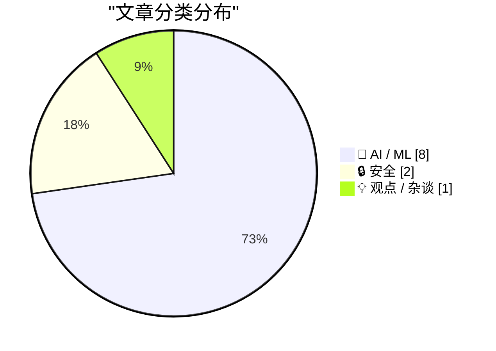
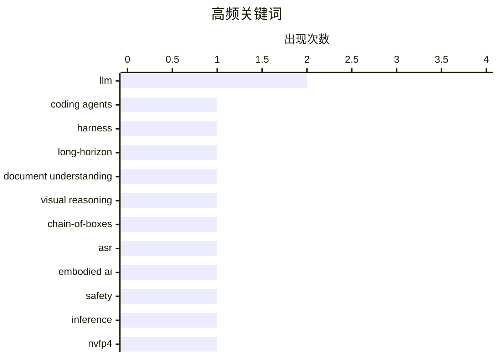

# 📰 AI 资讯每日精选 — 2026-08-31

> 汇聚 156+ 技术博客、X/Twitter、Hacker News、Reddit、Product Hunt、
> Lobste.rs、ClawFeed 日报及 GitHub Trending，经 AI 评分筛选。
>
> **本期内容**：🏆 今日必读 · 🌐 ClawFeed 日报 · 🔥 GitHub Trending · 📂 分类精选 · 📊 数据概览 · 🎯 项目相关情报 · 🌍 补充视角

## 📝 今日看点

今日技术圈的核心焦点集中在AI智能体的能力跃迁与其引发的连锁风险上：长时程编码与多智能体协调成为框架演进的关键方向，但与此同时，语音交互和自动模式下的安全漏洞也暴露出智能体落地的脆弱性。此外，大模型推理优化持续向细粒度量化与高效嵌入检索推进，力求突破部署瓶颈。更深远的影响则体现在社会层面——MIT开始反思AI对教育的根本性冲击，而索尼、华纳对Anthropic的版权诉讼，则标志着AI训练数据合法性问题正式进入法律对抗阶段。技术狂奔之余，安全、伦理与制度重构已成为不可回避的议题。

---

## 🏆 今日必读

🥇 **openJiuwen：超越静态框架的长时程编码智能体**

[openJiuwen: Beyond Static Harnesses for Long-Horizon Coding Agents](https://arxiv.org/abs/2608.27969) — arXiv Artificial Intelligence · 1 小时前 · 🤖 AI / ML · **一手来源**

> 长时程编码智能体在演化的代码库上运行，越来越依赖异构能力、委派智能体和多智能体协调，这给智能体框架带来两大挑战：开发者需要组合能力、重新配置执行逻辑并扩展复杂系统，而无需重复构建编排；复杂编码任务持续产生新需求。文章提出openJiuwen，旨在解决这些挑战，但摘要未提供具体技术方案或实验数据。

💡 **为什么值得读**: 关注长时程编码智能体框架的演进，了解openJiuwen如何应对动态环境下的编排挑战。

🏷️ coding agents, harness, long-horizon

🥈 **Doc-CoB：利用视觉链式框推理增强文档理解**

[Doc-CoB: Enhancing Document Understanding with Visual Chain-of-Boxes Reasoning](https://arxiv.org/abs/2505.18603) — arXiv Artificial Intelligence · 1 小时前 · 🤖 AI / ML · **一手来源**

> 文档理解旨在对文档图像进行问答和信息提取，视觉内容信息密集，大多数查询仅依赖少数相关布局区域。现有方法要么采用单遍策略隐式假设所有布局同等重要，要么过度关注小区域而丢失关键布局信息。为应对这些限制，文章提出Doc-CoB方法，但摘要未提供具体技术细节和实验结果。

💡 **为什么值得读**: 了解文档理解领域的新方法Doc-CoB，看它如何通过链式框推理改善布局信息利用。

🏷️ document understanding, visual reasoning, chain-of-boxes

🥉 **当机器人听错我们的话：映射语音控制具身AI的安全风险**

[When Robots Mishear Us: Mapping the Safety Risks of Voice-Controlled Embodied AI](https://arxiv.org/abs/2608.28518) — arXiv Artificial Intelligence · 1 小时前 · 🤖 AI / ML · **一手来源**

> 文章研究自动语音识别（ASR）错误是否会导致具身AI（EAI）模型产生不安全输出。研究发现ASR错误可能导致有害指令被EAI模型接受并执行，从而降低安全性。作者模拟ASR错误，并结合现有安全基准（SafeAgentBench和POEX）评估不同错误对具身AI安全的影响，发现其中一些错误呈现出特定模式。

💡 **为什么值得读**: 揭示语音识别错误对具身AI安全性的潜在威胁，为设计更安全的语音交互系统提供参考。

🏷️ ASR, embodied AI, safety

4️⃣ **H-Scale：基于Hessian引导的NVFP4亚字节LLM推理尺度细化**

[H-Scale: Hessian-Guided Scale Refinement for NVFP4 Sub-Byte LLM Inference](https://arxiv.org/abs/2608.28113) — arXiv Computation and Language · 1 小时前 · 🤖 AI / ML · **一手来源**

> NVIDIA Blackwell架构原生支持超细粒度NVFP4格式，为加速大语言模型（LLM）推理带来新机遇。NVFP4的微块设计（如组大小16）提供了强大的表示灵活性，以捕获局部权重分布和隔离异常值，但也引入了大量且高度敏感的逐组缩放因子空间。现有的后训练量化方法面临挑战，文章提出H-Scale方法，但摘要未提供具体细节。

💡 **为什么值得读**: 关注LLM推理加速中的量化技术，了解H-Scale如何利用Hessian信息优化NVFP4缩放因子。

🏷️ LLM, inference, NVFP4, quantization

5️⃣ **Claude Code Opus 5自动模式中的提示注入**

[Prompt Injection in Claude Code Opus 5 Auto Mode](https://embracethered.com/blog/posts/2026/breaking-claude-code-opus-5-and-automode/) — Lobste.rs · 23 小时前 · 🔒 安全

> 文章报道了在Claude Code Opus 5的自动模式中发现的提示注入漏洞。提示注入是一种攻击方式，攻击者通过精心构造的输入诱导AI模型执行非预期操作。文章可能详细描述了攻击方法、影响范围以及可能的防御措施，但摘要未提供具体细节。

💡 **为什么值得读**: 了解最新AI编程工具的安全漏洞，提高对提示注入攻击的防范意识。

🏷️ prompt injection, Claude, AI safety

---

## 🌐 ClawFeed 日报精选

> 来源：[ClawFeed](https://clawfeed.kevinhe.io) — AI 驱动的多源新闻聚合

📋 ClawFeed Daily | 2026-08-30 (SGT)

来源：5 期 4h digest (#1094 00:00, #1095 04:00, #1096 08:00, #1097 12:00, #1098 16:00)
feed 173 (34+31+37+34+37) · bookmarks 95 (5×19) · errors 0

---

🔥 当日全场最重要 5 条

1. **腾讯开源 MoE 大模型 Hy4 preview**：总参 7700 亿，激活 490 亿，支持超 100 万 token 上下文，已上线 OpenRouter。腾讯称模型参与自身训练/数据策略/底层算子的自动化优化，形成早期递归自改进循环。中国开源 LLM 新里程碑。(@hasantoxr/#1096, @ohxiyu/#1098)

2. **Stripe 构建 Agent Commerce 全栈**：Patrick Collison 描绘 Stripe agent 基建全景——agent 钱包(@link/@privy)、MPP、Tempo、MCP、CLI、Agentic Commerce Suite、sandbox、OpenRouter、Metronome 计量计费、Radar+蒸馏/token 反欺诈。"Stripe is building the entire agent commerce stack"。(@patrickc, #1098)

3. **AI 半导体基建期比互联网更长**：核心是"两个指数相乘"（用户数 × 人均 token 消耗量），渗透率拐点远未到来。同日 Elon Musk 补充：市场共识 ~15GW AI 算力将在 2027 年产出但无法全部上线——不只是电力，变压器、布线、液冷全链路都是瓶颈。(@qinbafrank/#1097, @elonmusk/#1096)

4. **Anthropic 移除 ~80% Claude Code system prompt**：trq212 分享系统提示/skills/CLAUDE.md 编写心得，对所有 Claude Code 用户直接可用。跨 3 期持续出现在 bookmarks。(@trq212, #1098, 🔖)

5. **100% 人类撰写内容成为 AI 时代稀缺资产**：分析 42,000 篇博文后发现，纯人类内容表现显著优于 AI 生成内容。对内容策略有直接启示。(@yangyi, #1095)

---

📰 当日核心主题

**🏗️ AI 基础设施与算力瓶颈**
全天最密集的主题。15GW 算力 2027 年无法全部上线（#1096）；AI 半导体基建期比互联网更长——两个指数相乘（#1097）；Dimension Capital 合伙人实地考察中国 AI 公司后的内部信——"跨太平洋的 AI 棋局：稀缺催生进化"（#1096）；Cerebras 联合创始人 Sean Lie 入驻 X（#1094）。从模型竞赛转向基建竞赛的转折信号。

**🤖 Agent 生态加速成型**
Stripe 构建 agent commerce 全栈（#1098）；Cloudflare 发布 @cloudflare/computer 给 Agent 配云端虚拟电脑（#1098 🔖）；wey_gu 做了 agent-as-QA-reporter 模式——agent 遇摩擦自动脱敏上报（#1098）；Matrix Agent 公司 OS 分层编排架构持续被讨论（#1096/#1097/#1098 🔖）；mobylond 反思 agent 做舆情监控的局限——无数值无阈值进不了模型（#1098）。

**🔬 模型发布与工程实践**
腾讯 Hy4 770B 开源（#1096/#1098）；Anthropic Claude Code system prompt 精简 80%（#1098）；Google DeepMind "Accelerating Scientific Research with Gemini" + Anthropic "Automated Researchers Can Reliably Mitigate Alignment Failures" 两篇重要论文（#1097）；Fable 模型自我审查案例值得关注（#1097）。

**💰 Crypto/DeFi 信号**
Solana TPS 8 个月 3.1x 增长（#1096）；Bitwise Solana Staking ETF AUM 破 $1B（#1094）；Circle USDC/EURC + CCTP 上线 Plasma（#1094）；TermMax 给 DeFi 补"债券市场"（#1095）；Tokenized stocks 可能蚕食 Interactive Brokers 77% 利润率（#1095）。

**🌍 全球化与出海**
德国创业环境之难被低估——注册公司 6 个月、税务合规比产品研发还耗时（#1097）；中国垂类 to B AI 工具可能重演 SaaS 故事（#1098）；出海工具补充清单（#1097）。

---

🔖 累计 Bookmark 精选（当日新增/更新）

• @xiaohu — Cloudflare @cloudflare/computer 给 Agent 配云端虚拟电脑，毫秒级启动（#1098, NEW）
• @Av1dlive — Anthropic Claude for Finance 讲座，量化 AI 最值得看的免费 1 小时（#1094/#1095/#1096/#1097/#1098, 跨 5 期）
• @guruchahal — AI 市场渗透率 <1%，$6T+ 增长空间（跨 5 期持续）
• @AndrewYNg — AI Engineering 核心技能图谱（跨 5 期持续）
• @trq212 — Claude Code system prompt 精简 80% 实战经验（#1095/#1096/#1097/#1098, 跨 4 期）
• @BruceGuai — Matrix Agent 公司 OS 架构拆解（#1096/#1097/#1098, 跨 3 期）
• @arrakis_ai / @gdb — GPT-Realtime-2 实时音频翻译 Chormex 集成（跨 4 期）
• @turingou — wanman.ai 持续迭代：db9 搜索 + GPT Image 2 设计师 agent + 自由布局（跨 5 期）
• @demishassabis — DeepMind CEO 到 YC 做客，大量 startup 用 Gemma（#1094/#1095）

---

👀 推荐关注汇总（去重）

• @seanlie (Sean Lie) — Cerebras 联合创始人，AI 推理芯片架构先驱，刚入驻 X。https://x.com/seanlie
• @foxshuo (狐说) — 一手美中 AI 投资圈内部信翻译+深度分析，信息差极高。https://x.com/foxshuo
• @hasantoxr — AI 模型发布 breaking news 第一时间拆解，覆盖面广且技术理解扎实。https://x.com/hasantoxr
• @0xCheshire (柴郡) — 中文圈 AI/播客/工具推荐质量稳定，bidclub.ai 资源发现能力强。https://x.com/0xCheshire
• @DaveShapi (David Shapiro) — AI 治理/伦理/信任独立评论人。https://x.com/DaveShapi
• @_avichawla (Avi Chawla) — 持续输出高质量 LLM/ML 技术解析。https://x.com/_avichawla
• @dongxi_nlp (东西) — AI 论文精选周报，覆盖 DeepMind/Anthropic/学术前沿。https://x.com/dongxi_nlp
• @wangfeng_0128 — 前火星财经创始人，转向 AI/Robotics 深度思考。https://x.com/wangfeng_0128
• @yangyi (lifesinger/玉伯) — 蚂蚁前端技术负责人，AI 自动化方向 building in public。https://x.com/yangyi

提醒：上述未通过浏览器逐一核实是否已关注，操作前请先搜索确认。

---

🧹 建议取关

• @0xJasonBateman — 最后一条推文 2026-04-10，已 4.5+ 月不活跃，内容为 Spotify 歌曲分享，无 tech 相关。(#1098)
• @HeXiaobo — 最后一条推文 2018-07-21，超 8 年不活跃，僵尸号。(#1098)

---

💤 当日重复噪音模式

1. **Crypto 喊单/情绪帖**：全天持续出现，@MengLayer, @RoundtableSpace, @NedHalawani, @NFTCPS, @0xKingsKuan, @Chrizhuu, @hualun 等
2. **RaminNasibov**：每期纯图片/视频帖，无实质文字内容（5 期全中）
3. **非 tech 生活内容**：遛娃、游船、恋爱建议、移民路径等，跨多期出现
4. **binance 官方账号**：营销帖/APR 广告/投票帖，无实质内容（3 期）
5. **孙宇晨相关**：身价讨论/丑闻/八卦，crypto 圈反复出现的背景噪音（2 期）

—
本日 5 期 4h digest 全部正常产出，无中断、无 CDP 异常、无 scrape 错误。
---

## 🔥 GitHub Trending

> 今日热门开源项目（全语言 + Python）

| # | 项目 | 描述 | ⭐ 总星 | 📈 今日 | 语言 |
|---|------|------|---------|---------|------|
| 1 | [tt-a1i/archify](https://github.com/tt-a1i/archify) 🤖 | Agent skill for beautiful, verifiable architecture, workf... | 35.6k | +3722 | JavaScript |
| 2 | [THU-MAIC/OpenMAIC](https://github.com/THU-MAIC/OpenMAIC) 🤖 | Open Multi-Agent Interactive Classroom — Get an immersive... | 24.7k | +1370 | TypeScript |
| 3 | [K-Dense-AI/scientific-agent-skills](https://github.com/K-Dense-AI/scientific-agent-skills) 🤖 | Turn any AI agent into an AI Scientist. The #1 Agent Skil... | 39.7k | +1114 | Python |
| 4 | [tashfeenahmed/freellmapi](https://github.com/tashfeenahmed/freellmapi) 🤖 | 7.4 billion tokens per month. 34 free LLM providers. 635 ... | 23.0k | +504 | TypeScript |
| 5 | [every-app/open-seo](https://github.com/every-app/open-seo) | Open source alternative to Semrush and Ahrefs | 15.3k | +469 | TypeScript |
| 6 | [kaifcodec/user-scanner](https://github.com/kaifcodec/user-scanner) | 🕵️‍♂️ (2-in-1) Email & Username OSINT suite for deep dat... | 3.9k | +462 | Python |
| 7 | [abi/screenshot-to-code](https://github.com/abi/screenshot-to-code) | Drop in a screenshot and convert it to clean code (HTML/T... | 76.5k | +418 | Python |
| 8 | [p-e-w/heretic](https://github.com/p-e-w/heretic) | Fully automatic censorship removal for language models | 29.3k | +369 | Python |
| 9 | [Lakr233/vphone-cli](https://github.com/Lakr233/vphone-cli) |  | 9.8k | +361 | Swift |
| 10 | [Osmantic/ODS](https://github.com/Osmantic/ODS) 🤖 | Turn your PC, Mac, or Linux box into an AI server. LLM in... | 5.2k | +331 | Python |
| 11 | [D4Vinci/Scrapling](https://github.com/D4Vinci/Scrapling) | 🕷️ An adaptive Web Scraping framework that handles every... | 77.4k | +253 | Python |
| 12 | [mvanhorn/last30days-skill](https://github.com/mvanhorn/last30days-skill) 🤖 | AI agent skill that researches any topic across Reddit, X... | 60.6k | +230 | Python |
| 13 | [unclecode/crawl4ai](https://github.com/unclecode/crawl4ai) 🤖 | 🚀🤖 Crawl4AI: Open-source LLM Friendly Web Crawler & Scr... | 80.4k | +221 | Python |
| 14 | [yt-dlp/yt-dlp](https://github.com/yt-dlp/yt-dlp) | A feature-rich command-line audio/video downloader | 188.0k | +209 | Python |
| 15 | [NationalSecurityAgency/ghidra](https://github.com/NationalSecurityAgency/ghidra) | Ghidra is a software reverse engineering (SRE) framework | 74.0k | +198 | Java |

---

## 🤖 AI / ML

### 1. openJiuwen：超越静态框架的长时程编码智能体

[openJiuwen: Beyond Static Harnesses for Long-Horizon Coding Agents](https://arxiv.org/abs/2608.27969) — **arXiv Artificial Intelligence** · 1 小时前 · ⭐ 23/30 · **一手来源**

> 长时程编码智能体在演化的代码库上运行，越来越依赖异构能力、委派智能体和多智能体协调，这给智能体框架带来两大挑战：开发者需要组合能力、重新配置执行逻辑并扩展复杂系统，而无需重复构建编排；复杂编码任务持续产生新需求。文章提出openJiuwen，旨在解决这些挑战，但摘要未提供具体技术方案或实验数据。

🏷️ coding agents, harness, long-horizon

---

### 2. Doc-CoB：利用视觉链式框推理增强文档理解

[Doc-CoB: Enhancing Document Understanding with Visual Chain-of-Boxes Reasoning](https://arxiv.org/abs/2505.18603) — **arXiv Artificial Intelligence** · 1 小时前 · ⭐ 22/30 · **一手来源**

> 文档理解旨在对文档图像进行问答和信息提取，视觉内容信息密集，大多数查询仅依赖少数相关布局区域。现有方法要么采用单遍策略隐式假设所有布局同等重要，要么过度关注小区域而丢失关键布局信息。为应对这些限制，文章提出Doc-CoB方法，但摘要未提供具体技术细节和实验结果。

🏷️ document understanding, visual reasoning, chain-of-boxes

---

### 3. 当机器人听错我们的话：映射语音控制具身AI的安全风险

[When Robots Mishear Us: Mapping the Safety Risks of Voice-Controlled Embodied AI](https://arxiv.org/abs/2608.28518) — **arXiv Artificial Intelligence** · 1 小时前 · ⭐ 25/30 · **一手来源**

> 文章研究自动语音识别（ASR）错误是否会导致具身AI（EAI）模型产生不安全输出。研究发现ASR错误可能导致有害指令被EAI模型接受并执行，从而降低安全性。作者模拟ASR错误，并结合现有安全基准（SafeAgentBench和POEX）评估不同错误对具身AI安全的影响，发现其中一些错误呈现出特定模式。

🏷️ ASR, embodied AI, safety

---

### 4. H-Scale：基于Hessian引导的NVFP4亚字节LLM推理尺度细化

[H-Scale: Hessian-Guided Scale Refinement for NVFP4 Sub-Byte LLM Inference](https://arxiv.org/abs/2608.28113) — **arXiv Computation and Language** · 1 小时前 · ⭐ 26/30 · **一手来源**

> NVIDIA Blackwell架构原生支持超细粒度NVFP4格式，为加速大语言模型（LLM）推理带来新机遇。NVFP4的微块设计（如组大小16）提供了强大的表示灵活性，以捕获局部权重分布和隔离异常值，但也引入了大量且高度敏感的逐组缩放因子空间。现有的后训练量化方法面临挑战，文章提出H-Scale方法，但摘要未提供具体细节。

🏷️ LLM, inference, NVFP4, quantization

---

### 5. 通过基于向量索引的输出嵌入加速LLM推理

[Accelerating LLM Inference via Vector Index Based Output Embeddings](https://arxiv.org/abs/2608.27460) — **arXiv Computation and Language** · 1 小时前 · ⭐ 25/30 · **一手来源**

> 大型输出嵌入矩阵在自回归解码过程中造成显著的内存带宽瓶颈，尤其是对于具有大型多语言词汇表的紧凑型LLM。文章将输出投影和top-k token选择重新表述为对token嵌入的最大内积搜索，并用基于HNSW的向量索引替换密集词汇投影。由此得到的输出头仅检索少量高概率候选集，从而加速推理。

🏷️ LLM inference, output embeddings, vector index

---

### 6. INSPIRE：一种内化-改进的示例驱动数学推理方法

[INSPIRE: An Internalize-Then-Improve Approach for Example-Driven Mathematical Reasoning](https://arxiv.org/abs/2608.27501) — **arXiv Computation and Language** · 1 小时前 · ⭐ 25/30 · **一手来源**

> 数学推理在大语言模型（LLM）中取得了快速进展，但现有方法主要优化最终答案的正确性，引发模型是否真正内化数学概念或仅记忆解题模式的疑问。在人类数学教育中，基于示例的推理（如构造反例来测试定理边界）反映了深层的概念理解，但在LLM中仍未充分发展。文章提出INSPIRE方法，但摘要未提供具体细节。

🏷️ LLM, mathematical reasoning, internalization

---

### 7. AI智能体没有时间感，且对此毫无察觉

[AI agents have no sense of time and are not aware of it](https://the-decoder.com/ai-agents-have-no-sense-of-time-and-are-not-aware-of-it/) — **The Decoder** · 18 小时前 · ⭐ 24/30 · **可追溯二手**

> 一项新研究发现，AI编程助手如Claude Code和Codex没有时间感。两者都系统性地高估任务所需时间，Codex的估计误差高达实际时长的十倍。它们对自己工作的评价也过高约20个百分点。对于长时间自主任务，这造成了监督上的实际问题。

🏷️ AI agents, time perception, coding assistants

---

### 8. 理解 ChatGPT Work

[Understanding ChatGPT Work](https://simonwillison.net/2026/Aug/30/understanding-chatgpt-work/) — **simonwillison.net** · 5 小时前 · ⭐ 23/30

> OpenAI 于 7 月 9 日发布了 ChatGPT Work，并持续快速迭代。该产品极其令人困惑但功能强大。实际上，ChatGPT Work 包含两个产品：一个在云端运行，可通过 chatgpt.com 访问；另一个可能为本地或集成版本。文章作者 Simon Willison 分享了他目前对这款产品的理解，包括其功能和使用方式。

🏷️ ChatGPT, OpenAI, product

---

## 🔒 安全

### 9. Claude Code Opus 5自动模式中的提示注入

[Prompt Injection in Claude Code Opus 5 Auto Mode](https://embracethered.com/blog/posts/2026/breaking-claude-code-opus-5-and-automode/) — **Lobste.rs** · 23 小时前 · ⭐ 27/30

> 文章报道了在Claude Code Opus 5的自动模式中发现的提示注入漏洞。提示注入是一种攻击方式，攻击者通过精心构造的输入诱导AI模型执行非预期操作。文章可能详细描述了攻击方法、影响范围以及可能的防御措施，但摘要未提供具体细节。

🏷️ prompt injection, Claude, AI safety

---

### 10. 索尼和华纳起诉Anthropic，称其“历史上最大规模、最明目张胆的知识产权盗窃之一”

[Sony and Warner sue Anthropic over "one of the largest and most blatant ongoing thefts of intellectual property in history"](https://the-decoder.com/sony-and-warner-sue-anthropic-over-one-of-the-largest-and-most-blatant-ongoing-thefts-of-intellectual-property-in-history/) — **The Decoder** · 20 小时前 · ⭐ 26/30 · **待核实**

> 索尼音乐、华纳音乐和其他出版商起诉Anthropic及其CEO Dario Amodei，指控其未经许可使用数万首受版权保护的音乐作品训练Claude。原告称这是“历史上最大规模、最明目张胆的知识产权盗窃之一”。在支付15亿美元与图书作者和解后仅数月，Anthropic面临又一场重大版权诉讼。

🏷️ Anthropic, copyright, AI training

---

## 💡 观点 / 杂谈

### 11. MIT警告AI现在能可靠完成几乎所有本科作业，考虑全面改革教育模式

[MIT Warns That AI Can Now Credibly Complete Pretty Much Any Undergrad Assignment, Considers Overhaul of Entire Educational Model](https://www.reddit.com/r/singularity/comments/1w31oif/mit_warns_that_ai_can_now_credibly_complete/) — **r/singularity** · 2 小时前 · ⭐ 25/30

> MIT正在考虑对其整个教育系统进行彻底改革，以应对强大AI模型带来的威胁。该校AI特别委员会发布新报告，由教授Eric Klopfer和Samuel Madden共同主持，描述了AI带来的“深刻挑战”。报告指出AI现在能可靠完成几乎所有本科作业，促使MIT考虑改革教育模式。

🏷️ AI, education, MIT

---

## 📊 数据概览

| 扫描源 | 抓取文章 | 时间范围 | 精选 |
|:---:|:---:|:---:|:---:|
| 110/156 | 6160 篇 → 986 篇 | 24h | **11 篇** |

### 分类分布



### 高频关键词



<details>
<summary>📈 纯文本关键词图（终端友好）</summary>

```
llm                    │ ████████████████████ 2
coding agents          │ ██████████░░░░░░░░░░ 1
harness                │ ██████████░░░░░░░░░░ 1
long-horizon           │ ██████████░░░░░░░░░░ 1
document understanding │ ██████████░░░░░░░░░░ 1
visual reasoning       │ ██████████░░░░░░░░░░ 1
chain-of-boxes         │ ██████████░░░░░░░░░░ 1
asr                    │ ██████████░░░░░░░░░░ 1
embodied ai            │ ██████████░░░░░░░░░░ 1
safety                 │ ██████████░░░░░░░░░░ 1
```

</details>

### 🏷️ 话题标签

**llm**(2) · **coding agents**(1) · **harness**(1) · long-horizon(1) · document understanding(1) · visual reasoning(1) · chain-of-boxes(1) · asr(1) · embodied ai(1) · safety(1) · inference(1) · nvfp4(1) · quantization(1) · prompt injection(1) · claude(1) · ai safety(1) · llm inference(1) · output embeddings(1) · vector index(1) · mathematical reasoning(1)

---

## 🎯 项目相关情报

### Agent 基座安全与合规

> 暂无达到质量门槛的项目相关情报。

### 多 Agent 架构

#### [openJiuwen：超越静态框架的长时程编码智能体](https://arxiv.org/abs/2608.27969)

> **状态**：本期 Top 11 已收录

- **匹配类型**：直接相关
- **项目相关性**：8/10
- **可落地性**：7/10
- **为什么相关**：文章涉及长时程编码代理与多代理协调，直接属于多智能体架构研究，并提供评测方法。
- **建议动作**：建议借鉴其评测框架，用于多智能体系统在复杂任务下的协作与协调能力验证。
- **来源**：arXiv Artificial Intelligence · 一手来源

### ASR 与语音助手

#### [当机器人听错我们的话：映射语音控制具身AI的安全风险](https://arxiv.org/abs/2608.28518)

> **状态**：本期 Top 11 已收录

- **匹配类型**：直接相关
- **项目相关性**：7/10
- **可落地性**：6/10
- **为什么相关**：文章直接研究 ASR 错误导致 Embodied AI 产生不安全输出，与语音识别安全性直接相关。
- **建议动作**：可参考其风险映射方法，为语音助手增加 ASR 错误检测与防护策略。
- **来源**：arXiv Artificial Intelligence · 一手来源

### 商品包装 OCR

#### [Doc-CoB：利用视觉链式框推理增强文档理解](https://arxiv.org/abs/2505.18603)

> **状态**：本期 Top 11 已收录

- **匹配类型**：直接相关
- **项目相关性**：8/10
- **可落地性**：7/10
- **为什么相关**：直接研究文档图像中的信息抽取，与OCR产品核心任务高度契合。
- **建议动作**：重点评估其Visual Chain-of-Boxes方法，测试在商品包装场景的迁移效果。
- **来源**：arXiv Artificial Intelligence · 一手来源

---

## 🌍 补充视角

> Top 11 未覆盖的高质量不同来源，最多 3 条。

### 1. 论必然性

[On Inevitability](https://borretti.me/article/on-inevitability) — **borretti.me** · 15 小时前 · 💡 观点 / 杂谈 · ⭐ 23/30

> 文章探讨了超级智能AI是否不可避免的问题。作者认为，超级智能AI并非不可避免，其发展受到多种因素的制约。文章指出，技术发展并非线性，存在许多瓶颈和不确定性。作者强调，人类的选择和决策在塑造AI未来中起着关键作用。结论是，超级智能AI的出现并非注定，而是取决于我们如何应对和引导技术发展。

💡 **补充价值**：这篇文章挑战了AI必然到来的普遍假设，提供了对技术发展不确定性的深刻思考，值得一读。

### 2. Claude会话URL默认附加到提交消息和PR描述中

[Claude Session URL appended to commit messages and PR descriptions by default](https://github.com/anthropics/claude-code/issues/66504) — **Hacker News Best** · 16 小时前 · 🛠 工具 / 开源 · ⭐ 22/30

> 据报道，Anthropic的Claude Code工具默认将Claude会话URL附加到Git提交消息和PR描述中。这一行为引发了用户关于隐私和透明度的讨论。用户担心这可能会泄露敏感信息，或导致不必要的跟踪。目前，该问题在GitHub上引发了广泛关注，有189个点赞和208条评论。

💡 **补充价值**：该问题涉及AI开发工具的隐私默认设置，对使用Claude Code的开发者有直接影响，值得关注。

---

*生成于 2026-08-31 05:24 | 汇聚 156 个技术博客、X/Twitter、Hacker News、Reddit、Product Hunt、Lobste.rs、ClawFeed 日报及 GitHub Trending，经 AI 评分筛选出 Top 11 精华内容，另附 2 条不同来源补充视角*
