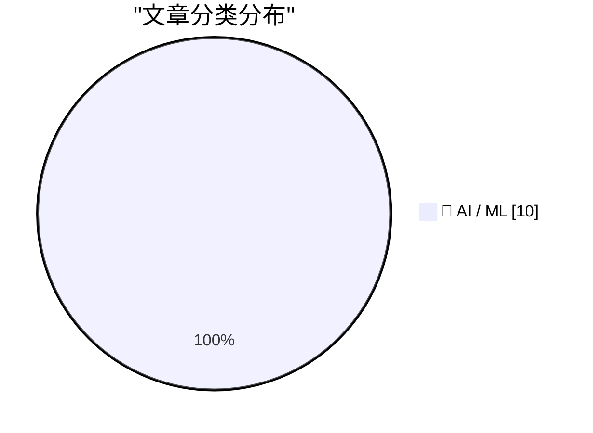
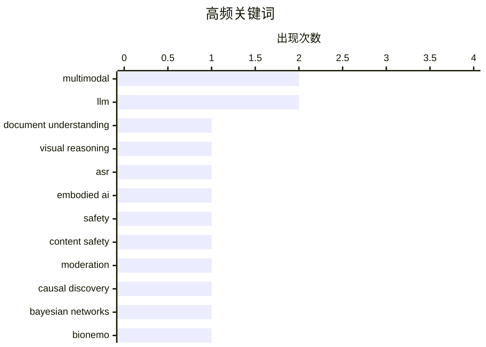

# 📰 AI 资讯每日精选 — 2026-09-01

> 汇聚 156+ 技术博客、X/Twitter、Hacker News、Reddit、Product Hunt、
> Lobste.rs、ClawFeed 日报及 GitHub Trending，经 AI 评分筛选。
>
> **本期内容**：🏆 今日必读 · 🌐 ClawFeed 日报 · 🔥 GitHub Trending · 📂 分类精选 · 📊 数据概览 · 🎯 项目相关情报 · 🌍 补充视角

## 📝 今日看点

今日技术圈聚焦AI安全与智能体落地两大主线。一方面，研究者密集关注语音识别错误、内容审核等安全问题，试图为多模态、多语言环境下的AI部署构建更可靠的防护屏障。另一方面，智能体技术加速从实验室走向工程实践，从OpenAI大规模采购Mac mini训练计算机智能体，到企业级知识库检索与科研场景中的AI科学家，均显示智能体正成为重塑工作流的关键力量。同时，基础模型继续向专业化、多模态延伸，文档理解、时间序列预测与蛋白质结构预测等垂直领域迎来更通用的零样本方案。

---

## 🏆 今日必读

🥇 **Doc-CoB：通过视觉链式框选推理增强文档理解**

[Doc-CoB: Enhancing Document Understanding with Visual Chain-of-Boxes Reasoning](https://arxiv.org/abs/2505.18603) — arXiv Artificial Intelligence · 1 小时前 · 🤖 AI / ML · **一手来源**

> 文档理解旨在对文档图像进行问答和信息提取，其中视觉内容信息密集，大多数查询仅依赖少数相关布局区域。然而，现有方法要么采用一次性策略，隐式假设所有布局同等重要，要么过度关注小区域而丢失关键布局信息。为解决这些局限，本文提出Doc-CoB方法，通过视觉链式框选推理逐步定位相关区域，增强文档理解。该方法在多个文档理解基准上取得了改进，展示了其在处理复杂文档布局方面的有效性。

💡 **为什么值得读**: 本文提出了一种新颖的视觉链式框选推理方法，有效解决了文档理解中布局信息利用不足的问题，值得关注。

🏷️ document understanding, visual reasoning, multimodal

🥈 **当机器人听错我们的话：映射语音控制具身AI的安全风险**

[When Robots Mishear Us: Mapping the Safety Risks of Voice-Controlled Embodied AI](https://arxiv.org/abs/2608.28518) — arXiv Artificial Intelligence · 1 小时前 · 🤖 AI / ML · **一手来源**

> 本文研究自动语音识别（ASR）错误是否会导致具身AI（EAI）模型产生不安全输出。研究发现，ASR错误可能导致有害指令被EAI模型接受并执行，从而降低安全性。作者模拟ASR错误，并结合现有安全基准（SafeAgentBench和POEX）评估不同错误对具身AI安全的影响。结果表明，某些ASR错误确实会带来安全风险，强调了语音交互中错误处理的重要性。

💡 **为什么值得读**: 该研究首次系统性地评估了ASR错误对具身AI安全的影响，为语音控制系统的安全设计提供了重要参考。

🏷️ ASR, embodied AI, safety

🥉 **Nemotron 3.5内容安全审核器：一款紧凑的多模态、多语言、支持推理的内容安全审核器**

[Nemotron 3.5 Content Safety Moderator: A Compact Multimodal, Multilingual, and Reasoning Enabled Content Safety Moderator](https://arxiv.org/abs/2608.27548) — arXiv Artificial Intelligence · 1 小时前 · 🤖 AI / ML · **一手来源**

> 随着AI应用部署，安全审核已超越纯文本提示，系统需要根据跨领域政策判断图像、文档、截图和生成响应。现有防护措施通常只覆盖部分场景，难以兼顾广泛覆盖、自定义策略控制和低计算成本。本文介绍Nemotron 3.5内容安全审核器，一款紧凑的多模态、多语言、支持推理的内容安全审核器，旨在解决上述问题。该审核器在多个维度上提供了综合解决方案，适用于多种部署场景。

💡 **为什么值得读**: 该审核器针对多模态内容安全审核的痛点，提供了紧凑且多功能的解决方案，对AI应用的安全部署具有实用价值。

🏷️ content safety, multimodal, moderation

4️⃣ **LLM增强的因果发现：边存在性与方向的概率融合**

[LLM-Augmented Causal Discovery: Probabilistic Fusion of Edge Existence and Orientation](https://arxiv.org/abs/2608.27472) — arXiv Artificial Intelligence · 1 小时前 · 🤖 AI / ML · **一手来源**

> 从观测数据中进行贝叶斯网络结构学习（BNSL）面临方向可识别性问题，而大语言模型（LLM）提供广泛但往往不可靠的因果知识。本文提出结合这些互补来源的新表示，称为概率依赖图（PDG）。在PDG中，每条边与有向、无向和不存在状态的分布相关联，从而通过加权融合实现因果发现。该方法在多个数据集上展示了优于现有方法的性能，有效提升了因果结构学习的准确性。

💡 **为什么值得读**: 本文创新性地将LLM知识与数据驱动方法融合，解决了因果发现中的方向识别难题，对因果推断领域有重要贡献。

🏷️ LLM, causal discovery, Bayesian networks

5️⃣ **在Claude Science中运行NVIDIA BioNeMo NIM微服务进行蛋白质结构预测**

[Run NVIDIA BioNeMo NIM Microservices for Protein Structure Prediction in Claude Science](https://developer.nvidia.com/blog/run-nvidia-bionemo-nim-microservices-for-protein-structure-prediction-in-claude-science/) — NVIDIA Technical Blog · 12 小时前 · 🤖 AI / ML

> 智能体AI正在改变研究方式，AI科学家可以阅读论文、提出假设、调用模型并确定优先实验。本文介绍了如何在Claude Science中运行NVIDIA BioNeMo NIM微服务，用于蛋白质结构预测。通过集成这些微服务，研究人员可以在Claude Science环境中直接调用蛋白质结构预测功能，加速研究流程。该方案展示了智能体AI在科学研究中的实际应用潜力。

💡 **为什么值得读**: 本文展示了将专业AI模型集成到智能体平台的具体实践，为科研人员提供了高效的工具集成范例。

🏷️ BioNeMo, protein structure, agentic AI

---

## 🌐 ClawFeed 日报精选

> 来源：[ClawFeed](https://clawfeed.kevinhe.io) — AI 驱动的多源新闻聚合

📋 ClawFeed Daily | 2026-08-31 (SGT)

来源：5 期 4h digest (#1102 00:00, #1103 04:00, #1104 08:00, #1105 12:00, #1106 16:00)
feed 162 (28+34+32+36+32) · bookmarks 95 (5×19) · errors 0

---

🔥 当日全场最重要 5 条

1. **Apple CEO 换帅：John Ternus 9月1日接任，AI 为第一优先**：Tim Cook 卸任，Ternus 接棒。苹果 AI 战略进入新阶段，对整个科技行业 AI 投入方向有风向标意义。(@Cointelegraph, #1105)

2. **OpenAI/Anthropic 大量采购 Mac 硬件训练 computer-use agent**：OpenAI 采购数万台 Mac mini 和 Mac Studio 用于强化学习训练，Anthropic 也在租用类似硬件。两大 AI 巨头同时押注 Mac 作为 agent 训练基础设施，信号极其明确。(@AndrewCurran_, #1104; @Cointelegraph, #1106)

3. **ECB 执行委员会成员：央行货币应搬上区块链**：用智能合约实时调整利率、抵押品要求和准入条件——欧央行最明确的 on-chain CBDC 信号之一。(@CoinDesk, #1103)

4. **吴恩达：Agentic Coding 时代基本功更重要而非过时**：以前学基本功为了自己写对代码，现在是为了判断 AI 写得对不对。软件工程教育定位从"执行者"变成"审计者"。(@frxiaobei, #1104)

5. **Stanford NLP 推出 DSPy："别再 prompt LLM，开始编程 LLM"**：从提示工程到编程范式的根本转变，对 agent 开发流程有直接影响。(@mdancho84, #1106)

---

📰 当日核心主题

**🤖 Agent 训练与基础设施**
全天最突出的主题。OpenAI/Anthropic 同时采购 Mac 硬件训练 computer-use agent（#1104/#1106）；Cloudflare @cloudflare/computer 给 Agent 配云端虚拟电脑（持续 🔖）；Codex 连续运行 5 天 13 小时无中断的实证（#1105）；Software Factory 基础设施从单人 AI 到多人 AI 需要大量投资（#1105）。从"造 agent"到"训练 agent"的基础设施层正在成型。

**🔬 AI 工程方法论演进**
吴恩达 Agentic Coding 基本功论（#1104）；Stanford DSPy "编程 LLM 而非 prompt LLM"（#1106）；Simon Willison 深度解读 ChatGPT Work 的 UX 困境（#1104/#1105）；Agentic Engineering Patterns 方法论——从知识资产复利到"认知债"系统性防御（#1105）。方法论层正在从零散经验向系统化框架收敛。

**🏗️ 开源与模型发布**
小红书开源 FireRedAudio 统一音频语言模型（#1106）；字节 Seed 开源 VeOmni + 腾讯混元开源 UniRL 双框架（#1104）；Qwen3.8-Flash Tech Report 被强烈推荐——不是新架构而是技术大阅兵式重组（#1106）；OpenROAD/IEDA 将颠覆 EDA 领域（#1103）。中国科技公司开源节奏加速。

**🔐 安全与漏洞**
JFrog Artifactory CVE-2026-82329 CVSS 9.8 关键认证绕过漏洞——影响广泛 CI/CD 基础设施（#1104）；针对 Claude 用户的恶意软件传播窃取密码和浏览器数据（#1104）；Bill Gates 提出保留 40% 人类岗位引发争论（#1103）。

**💰 Crypto/支付信号**
支付宝董事长韩歆毅：加密货币作为 AI 支付路径之一，四种全球探索路径并行（#1104）；Chainalysis 抗议 ICE 向 TRM Labs 授予 $9500 万独家合同（#1106）；a16z $1.1B Machine Age Fund 定向投注 AI 基础设施（#1102）。

---

🔖 累计 Bookmark 精选（当日新增/更新）

• @trq212 — Claude Code 最新模型移除约 80% 系统提示词，编写 system prompts/skills/CLAUDE.md 经验（跨 5 期持续）
• @xiaohu — Cloudflare @cloudflare/computer 给 Agent 配云端虚拟电脑，毫秒级启动（跨 5 期持续）
• @Av1dlive — Anthropic Claude for Finance 讲座，量化 AI 最值得看的免费 1 小时（跨 5 期持续）
• @guruchahal — AI 市场渗透率 <1%，$6T+ 增长空间（跨 5 期持续）
• @BruceGuai — Agent 公司 OS 架构 Matrix（跨 5 期持续）
• @turingou — wanman.ai 持续迭代：团队聊天自由布局 + Codex 调用 GPT image 2 自动创建设计师 agent（跨 5 期持续）
• @gdb — GPT-Realtime-2 实时音频翻译 Chormex 集成（跨 5 期持续）
• @AndrewYNg — AI Engineering 最重要技能地图（跨 5 期持续，#1106 新增引用）
• @Tao100086 — 张小珺×谢青池 36 篇 AI 经典论文下载地址（跨 5 期持续）

---

👀 推荐关注汇总（去重）

• @mardehaym (Mark Ajzenstadt) — Limestone Digital 创始人，PE portfolio AI 转型实操一手数据。https://x.com/mardehaym
• @bovensiepen (bovi) — 关注 OpenROAD/IEDA 等开源 EDA 生态与 AI 芯片设计创业，观点有深度。https://x.com/bovensiepen
• @balance0014 — 长期追踪中国 AI 大厂开源动态，信息结构化、密度高。https://x.com/balance0014
• @shao__meng — 对 Simon Willison 等头部 AI 工程方法论的中文深度解读，Agentic Engineering 方向。https://x.com/shao__meng
• @mdancho84 — Stanford DSPy 等 LLM 编程范式传播者，技术密度高。https://x.com/mdancho84

提醒：上述未通过浏览器逐一核实是否已关注，**Kevin 操作前请先在 Following 里搜一下**避免重复加关注。

---

💤 当日重复噪音模式

• **Crypto 喊单/交易信号**：全天各档均有大量 BTC/altcoin 价格预测、meme coin 推广、交易策略推荐，占过滤量最大比例
• **SpaceX/Tesla 非核心内容**：Falcon Heavy 着陆美图、FSD 推广、轨道成本讨论——与 AI/tech 核心无关
• **个人生活/旅行/美食**：马代餐厅评测、澳门夜景、台北活动、东京免税——非 tech 内容
• **NFT/域名交易**：allowlist 推广、NFT 销毁机制、域名销售——细分市场噪音
• **币安教育性/营销性内容**：区块链基础教程、bStocks AUM 宣传——品牌营销而非信息增量

---

📊 今日统计
• 总 feed: 162 条 · 总 bookmarks: 95 条 · 总 errors: 0
• 5 期 4h digest 全部正常产出，无遗漏
• 新增推荐关注 5 人 · 持续建议取关 2 人（@0xJasonBateman, @HeXiaobo）
---

## 🔥 GitHub Trending

> 今日热门开源项目（全语言 + Python）

| # | 项目 | 描述 | ⭐ 总星 | 📈 今日 | 语言 |
|---|------|------|---------|---------|------|
| 1 | [tt-a1i/archify](https://github.com/tt-a1i/archify) 🤖 | Agent skill for beautiful, verifiable architecture, workf... | 39.5k | +3991 | JavaScript |
| 2 | [THU-MAIC/OpenMAIC](https://github.com/THU-MAIC/OpenMAIC) 🤖 | Open Multi-Agent Interactive Classroom — Get an immersive... | 27.7k | +2824 | TypeScript |
| 3 | [K-Dense-AI/scientific-agent-skills](https://github.com/K-Dense-AI/scientific-agent-skills) 🤖 | Turn any AI agent into an AI Scientist. The #1 Agent Skil... | 40.9k | +1980 | Python |
| 4 | [zhaoxuya520/reverse-skill](https://github.com/zhaoxuya520/reverse-skill) 🤖 | Reverse Engineering / Authorized Penetration Testing / Se... | 33.3k | +1401 | PowerShell |
| 5 | [every-app/open-seo](https://github.com/every-app/open-seo) | Open source alternative to Semrush and Ahrefs | 15.8k | +610 | TypeScript |
| 6 | [browser-use/video-use](https://github.com/browser-use/video-use) | Edit videos with coding agents | 22.4k | +591 | Python |
| 7 | [k1tbyte/Wand-Enhancer](https://github.com/k1tbyte/Wand-Enhancer) | Advanced UX and interoperability extension for Wand (WeMo... | 23.5k | +582 | C# |
| 8 | [handsomestWei/patent-disclosure-skill](https://github.com/handsomestWei/patent-disclosure-skill) | 中国专利.skill：专利点挖掘与交底书（发明/实用/外观）编写，通俗解读专利，嗅探政策动向，辅助审查答复。 | 6.4k | +571 | Python |
| 9 | [p-e-w/heretic](https://github.com/p-e-w/heretic) | Fully automatic censorship removal for language models | 29.7k | +537 | Python |
| 10 | [unclecode/crawl4ai](https://github.com/unclecode/crawl4ai) 🤖 | 🚀🤖 Crawl4AI: Open-source LLM Friendly Web Crawler & Scr... | 80.6k | +516 | Python |
| 11 | [affaan-m/ECC](https://github.com/affaan-m/ECC) 🤖 | The agent harness performance optimization system. Skills... | 245.4k | +512 | JavaScript |
| 12 | [debpalash/VoiceStudio](https://github.com/debpalash/VoiceStudio) | VoiceStudio is the open-source, fully-local ElevenLabs al... | 12.8k | +509 | Python |
| 13 | [jingyaogong/minimind](https://github.com/jingyaogong/minimind) 🤖 | 🧠 Train a 64M-parameter LLM from scratch in just 2h! | 56.4k | +495 | Python |
| 14 | [calesthio/OpenMontage](https://github.com/calesthio/OpenMontage) 🤖 | World's first open-source, agentic video production syste... | 55.1k | +454 | Python |
| 15 | [mvanhorn/last30days-skill](https://github.com/mvanhorn/last30days-skill) 🤖 | AI agent skill that researches any topic across Reddit, X... | 60.8k | +429 | Python |

---

## 🤖 AI / ML

### 1. Doc-CoB：通过视觉链式框选推理增强文档理解

[Doc-CoB: Enhancing Document Understanding with Visual Chain-of-Boxes Reasoning](https://arxiv.org/abs/2505.18603) — **arXiv Artificial Intelligence** · 1 小时前 · ⭐ 22/30 · **一手来源**

> 文档理解旨在对文档图像进行问答和信息提取，其中视觉内容信息密集，大多数查询仅依赖少数相关布局区域。然而，现有方法要么采用一次性策略，隐式假设所有布局同等重要，要么过度关注小区域而丢失关键布局信息。为解决这些局限，本文提出Doc-CoB方法，通过视觉链式框选推理逐步定位相关区域，增强文档理解。该方法在多个文档理解基准上取得了改进，展示了其在处理复杂文档布局方面的有效性。

🏷️ document understanding, visual reasoning, multimodal

---

### 2. 当机器人听错我们的话：映射语音控制具身AI的安全风险

[When Robots Mishear Us: Mapping the Safety Risks of Voice-Controlled Embodied AI](https://arxiv.org/abs/2608.28518) — **arXiv Artificial Intelligence** · 1 小时前 · ⭐ 23/30 · **一手来源**

> 本文研究自动语音识别（ASR）错误是否会导致具身AI（EAI）模型产生不安全输出。研究发现，ASR错误可能导致有害指令被EAI模型接受并执行，从而降低安全性。作者模拟ASR错误，并结合现有安全基准（SafeAgentBench和POEX）评估不同错误对具身AI安全的影响。结果表明，某些ASR错误确实会带来安全风险，强调了语音交互中错误处理的重要性。

🏷️ ASR, embodied AI, safety

---

### 3. Nemotron 3.5内容安全审核器：一款紧凑的多模态、多语言、支持推理的内容安全审核器

[Nemotron 3.5 Content Safety Moderator: A Compact Multimodal, Multilingual, and Reasoning Enabled Content Safety Moderator](https://arxiv.org/abs/2608.27548) — **arXiv Artificial Intelligence** · 1 小时前 · ⭐ 26/30 · **一手来源**

> 随着AI应用部署，安全审核已超越纯文本提示，系统需要根据跨领域政策判断图像、文档、截图和生成响应。现有防护措施通常只覆盖部分场景，难以兼顾广泛覆盖、自定义策略控制和低计算成本。本文介绍Nemotron 3.5内容安全审核器，一款紧凑的多模态、多语言、支持推理的内容安全审核器，旨在解决上述问题。该审核器在多个维度上提供了综合解决方案，适用于多种部署场景。

🏷️ content safety, multimodal, moderation

---

### 4. LLM增强的因果发现：边存在性与方向的概率融合

[LLM-Augmented Causal Discovery: Probabilistic Fusion of Edge Existence and Orientation](https://arxiv.org/abs/2608.27472) — **arXiv Artificial Intelligence** · 1 小时前 · ⭐ 25/30 · **一手来源**

> 从观测数据中进行贝叶斯网络结构学习（BNSL）面临方向可识别性问题，而大语言模型（LLM）提供广泛但往往不可靠的因果知识。本文提出结合这些互补来源的新表示，称为概率依赖图（PDG）。在PDG中，每条边与有向、无向和不存在状态的分布相关联，从而通过加权融合实现因果发现。该方法在多个数据集上展示了优于现有方法的性能，有效提升了因果结构学习的准确性。

🏷️ LLM, causal discovery, Bayesian networks

---

### 5. 在Claude Science中运行NVIDIA BioNeMo NIM微服务进行蛋白质结构预测

[Run NVIDIA BioNeMo NIM Microservices for Protein Structure Prediction in Claude Science](https://developer.nvidia.com/blog/run-nvidia-bionemo-nim-microservices-for-protein-structure-prediction-in-claude-science/) — **NVIDIA Technical Blog** · 12 小时前 · ⭐ 25/30

> 智能体AI正在改变研究方式，AI科学家可以阅读论文、提出假设、调用模型并确定优先实验。本文介绍了如何在Claude Science中运行NVIDIA BioNeMo NIM微服务，用于蛋白质结构预测。通过集成这些微服务，研究人员可以在Claude Science环境中直接调用蛋白质结构预测功能，加速研究流程。该方案展示了智能体AI在科学研究中的实际应用潜力。

🏷️ BioNeMo, protein structure, agentic AI

---

### 6. TimesFM-3：用于多变量预测的零样本基础模型

[TimesFM-3: A zero-shot foundation model for multivariate forecasting](https://www.reddit.com/r/singularity/comments/1w3wyi8/timesfm3_a_zeroshot_foundation_model_for/) — **r/singularity** · 4 小时前 · ⭐ 26/30

> TimesFM-3 是一个用于多变量时间序列预测的零样本基础模型，由 Google 研究团队开发。该模型在多种公开数据集上进行了评估，包括零售、金融和能源领域，展示了其在不同预测任务中的通用性。与之前的版本相比，TimesFM-3 在零样本设置下取得了更优的性能，尤其是在处理多变量数据时。模型采用 transformer 架构，能够捕捉时间序列中的复杂依赖关系。实验结果表明，TimesFM-3 在多个基准测试中均优于现有的零样本预测方法，为时间序列预测提供了一种无需微调的解决方案。

🏷️ TimesFM-3, foundation model, forecasting

---

### 7. 给评分者评分：用于LLM评估的Rasch测量理论

[Rating the Raters: Rasch Measurement Theory for LLM Evaluation](https://arxiv.org/abs/2608.27463) — **arXiv Artificial Intelligence** · 1 小时前 · ⭐ 24/30 · **一手来源**

> LLM现在处于评估的各个方面：作为基准测试的考生、其他模型输出的评判者，以及人类生成内容的评分者。每种范式都可以视为一个测量问题，其中对象的潜在属性通过仪器（如基准）的项目由评分者探测。标准评估实践往往忽略每个核心组件对最终结果的贡献，限制了对评估内容的理解。本文提出使用Rasch测量理论来改进LLM评估，以更准确地分离和量化各组件的影响。

🏷️ LLM, evaluation, Rasch, measurement

---

### 8. ChatGPT 工作工具与技能参考

[ChatGPT Work Tool and Skill Reference](https://codex-tool-reference.simonw.chatgpt.site/) — **Hacker News Best** · 14 小时前 · ⭐ 24/30

> 该网站提供了 ChatGPT 工具和技能的参考文档，包括如何利用 Codex 工具进行代码生成和自动化任务。内容涵盖了工具的使用方法、示例和最佳实践，旨在帮助用户更高效地使用 ChatGPT 进行工作。文档还介绍了如何通过技能定义来扩展 ChatGPT 的功能，使其适应特定的工作流程。该参考资源对于希望深入挖掘 ChatGPT 潜力的开发者和用户来说是一个实用的指南。

🏷️ ChatGPT, tool, skill, reference

---

### 9. OpenAI和竞争对手AI实验室购买数万台Mac mini以训练计算机使用智能体

[OpenAI and rival AI labs are buying tens of thousands of Mac minis to train computer-use agents](https://the-decoder.com/openai-and-rival-ai-labs-are-buying-tens-of-thousands-of-mac-minis-to-train-computer-use-agents/) — **The Decoder** · 20 小时前 · ⭐ 24/30 · **可追溯二手**

> 据The Information报道，OpenAI已购买数万台Mac mini和Mac Studio用于训练计算机智能体。Anthropic也依赖苹果硬件。需求如此之高，以至于最强大的机型已售罄数月。苹果Mac收入在六月季度增长了近29%，达到104亿美元。

🏷️ Mac mini, AI training, computer-use agents

---

### 10. 使用AWS CloudFormation构建可观测的企业级智能体检索：基于托管Amazon Bedrock知识库

[Build observable enterprise agentic retrieval using Managed Amazon Bedrock Knowledge Base with AWS CloudFormation](https://aws.amazon.com/blogs/machine-learning/build-observable-enterprise-agentic-retrieval-using-managed-amazon-bedrock-knowledge-base-with-aws-cloudformation/) — **AWS Machine Learning Blog** · 9 小时前 · ⭐ 22/30 · **一手来源**

> 本文介绍如何在Amazon Bedrock托管知识库和Amazon Bedrock AgentCore上构建企业级智能体检索解决方案。该方案中，智能体进行推理、跨多个知识库路由，并返回带引用的答案，具备七层可观测性以及按需和持续评估，全部通过单个AWS CloudFormation链部署。

🏷️ Agent, Knowledge Base, Observability, AWS

---

## 📊 数据概览

| 扫描源 | 抓取文章 | 时间范围 | 精选 |
|:---:|:---:|:---:|:---:|
| 106/156 | 7383 篇 → 2309 篇 | 24h | **10 篇** |

### 分类分布



### 高频关键词



<details>
<summary>📈 纯文本关键词图（终端友好）</summary>

```
multimodal             │ ████████████████████ 2
llm                    │ ████████████████████ 2
document understanding │ ██████████░░░░░░░░░░ 1
visual reasoning       │ ██████████░░░░░░░░░░ 1
asr                    │ ██████████░░░░░░░░░░ 1
embodied ai            │ ██████████░░░░░░░░░░ 1
safety                 │ ██████████░░░░░░░░░░ 1
content safety         │ ██████████░░░░░░░░░░ 1
moderation             │ ██████████░░░░░░░░░░ 1
causal discovery       │ ██████████░░░░░░░░░░ 1
```

</details>

### 🏷️ 话题标签

**multimodal**(2) · **llm**(2) · **document understanding**(1) · visual reasoning(1) · asr(1) · embodied ai(1) · safety(1) · content safety(1) · moderation(1) · causal discovery(1) · bayesian networks(1) · bionemo(1) · protein structure(1) · agentic ai(1) · timesfm-3(1) · foundation model(1) · forecasting(1) · evaluation(1) · rasch(1) · measurement(1)

---

## 🎯 项目相关情报

### Agent 基座安全与合规

> 暂无达到质量门槛的项目相关情报。

### 多 Agent 架构

> 暂无达到质量门槛的项目相关情报。

### ASR 与语音助手

#### [当机器人听错我们的话：映射语音控制具身AI的安全风险](https://arxiv.org/abs/2608.28518)

> **状态**：本期 Top 10 已收录 · 48h 回填

- **匹配类型**：直接相关
- **项目相关性**：7/10
- **可落地性**：6/10
- **为什么相关**：直接研究ASR错误对EAI安全影响，属于语音识别安全评测方向。
- **建议动作**：可参考其ASR错误分类与安全评估方法，建立语音助手安全测试集。
- **来源**：arXiv Artificial Intelligence · 一手来源

### 商品包装 OCR

#### [Doc-CoB：通过视觉链式框选推理增强文档理解](https://arxiv.org/abs/2505.18603)

> **状态**：本期 Top 10 已收录 · 48h 回填

- **匹配类型**：直接相关
- **项目相关性**：8/10
- **可落地性**：7/10
- **为什么相关**：直接研究文档理解与图片信息抽取，属OCR/文档理解核心任务。
- **建议动作**：提取其视觉链式推理方法，评估在包装OCR中的应用。
- **来源**：arXiv Artificial Intelligence · 一手来源

---

## 🌍 补充视角

> Top 10 未覆盖的高质量不同来源，最多 3 条。

### 1. Polimill 构建日本下一代公共 AI 基础设施

[Polimill builds Japan's next-generation public AI infrastructure](https://openai.com/index/polimill) — **OpenAI News** · 22 小时前 · 🤖 AI / ML · ⭐ 21/30 · **一手来源**

> Polimill 利用 OpenAI 的 GPT 模型和 Codex，帮助日本 municipalities 搜索和利用行政知识，同时加速开发。该公司旨在构建日本下一代公共 AI 基础设施。通过结合 GPT 和 Codex，Polimill 能够提升行政效率，并促进公共服务的数字化转型。这一举措展示了 AI 在公共部门的应用潜力。

💡 **补充价值**：了解 AI 如何助力公共行政，以及 OpenAI 技术在日本的实际应用案例。

---

*生成于 2026-09-01 05:00 | 汇聚 156 个技术博客、X/Twitter、Hacker News、Reddit、Product Hunt、Lobste.rs、ClawFeed 日报及 GitHub Trending，经 AI 评分筛选出 Top 10 精华内容，另附 1 条不同来源补充视角*
