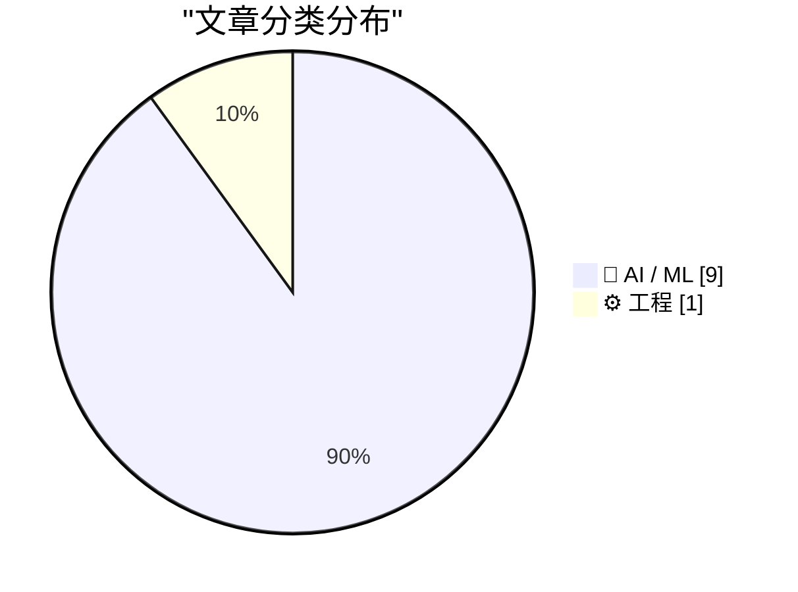
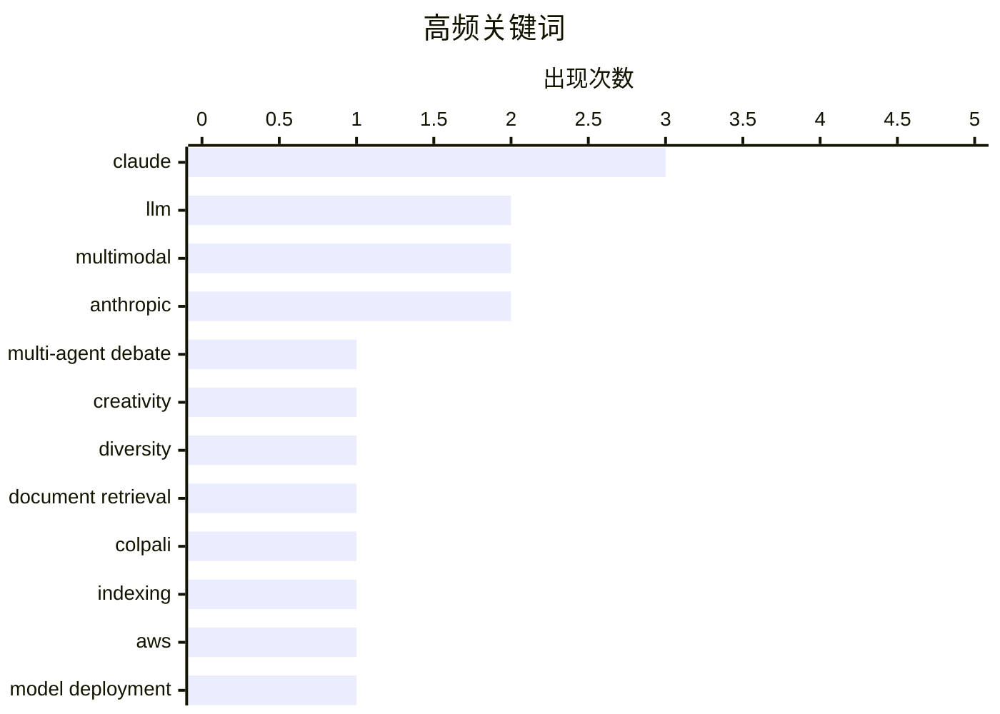

# 📰 AI 资讯每日精选 — 2026-09-02

> 汇聚 156+ 技术博客、X/Twitter、Hacker News、Reddit、Product Hunt、
> Lobste.rs、ClawFeed 日报及 GitHub Trending，经 AI 评分筛选。
>
> **本期内容**：🏆 今日必读 · 🌐 ClawFeed 日报 · 🔥 GitHub Trending · 📂 分类精选 · 📊 数据概览 · 🎯 项目相关情报 · 🌍 补充视角

## 📝 今日看点

今日技术圈的核心动向集中于大模型能力的代际跃迁与智能体工程化落地。Anthropic发布Claude Fable 5.1，在编码、科学研究和长期任务上树立新标准，同时成本最高下降45%，彰显前沿模型在性能与性价比上的双重突破。与此同时，业界对智能体系统的理解从“模型本身”转向“驾驭工程”，多智能体协作、记忆原生状态与内在安全等议题成为构建可靠长时程任务的关键。此外，生成式AI正加速渗透至文档检索、自动驾驶、实时界面生成等垂直场景，并伴随大规模成本治理与安全管控的实践深化。

---

## 🏆 今日必读

🥇 **通过多智能体辩论进行创造性生成：辩论会抑制多样性吗？**

[Creative Generation via Multi-Agent Debate: Does Debate Suppress Diversity?](https://arxiv.org/abs/2609.00683) — arXiv Computation and Language · 23 分钟前 · 🤖 AI / ML · **一手来源**

> 创造性生成任务（如叙事写作和科学构思）既要求高质量输出，也要求独立运行产生不同响应以最大化探索。多智能体辩论（MAD）在事实性和推理任务上显示出强大的质量提升，因此成为创造性生成的自然候选。然而，研究发现其趋同驱动设计会主动抑制独立运行间的输出多样性，造成内在的探索与利用权衡。文章探讨了MAD在创造性生成中的适用性，并指出其多样性抑制问题。

💡 **为什么值得读**: 该研究首次系统性地揭示了多智能体辩论在创造性任务中的多样性缺陷，对设计兼顾质量与多样性的生成系统具有重要参考价值。

🏷️ multi-agent debate, creativity, diversity, LLM

🥈 **MIDR：用于多模态文档检索的增强索引**

[MIDR: Enrichment-Augmented Indexing for Multimodal Document Retrieval](https://arxiv.org/abs/2609.01316) — arXiv Artificial Intelligence · 23 分钟前 · 🤖 AI / ML · **一手来源**

> 视觉丰富文档的检索存在表示问题：重要内容常位于表格、图表、图形和布局关系中，而纯OCR会线性化、破坏或遗漏这些内容。ColPali系列视觉检索器通过补丁级多向量索引和后期交互评分解决了这一问题，将图像派生的检索保留在查询时的服务路径上。文章介绍了MIDR（多模态文档检索索引），这是一种训练框架，旨在改进多模态文档的检索性能。

💡 **为什么值得读**: MIDR针对视觉丰富文档检索的表示瓶颈提出新方案，对提升文档理解与检索效率有直接帮助。

🏷️ multimodal, document retrieval, ColPali, indexing

🥉 **在AWS上推出Claude Fable 5.1**

[Introducing Claude Fable 5.1 on AWS](https://aws.amazon.com/blogs/machine-learning/introducing-claude-fable-5-1-on-aws/) — AWS Machine Learning Blog · 9 小时前 · 🤖 AI / ML · **一手来源**

> Claude Fable 5.1现已在Amazon Bedrock和AWS上的Claude平台可用。文章介绍了Claude Fable 5.1的改进、企业前沿保障（用于将数据保留在可控云环境中），以及如何在Amazon Bedrock上开始使用该模型进行构建。

💡 **为什么值得读**: 对于AWS用户，了解Claude Fable 5.1的新特性和企业级安全保障是决定是否采用的关键信息。

🏷️ Claude, AWS, model deployment

4️⃣ **Claude Fable 5.1给我做了一只非常棒的动画鹈鹕**

[Claude Fable 5.1 made me a really nice animated pelican](https://simonwillison.net/2026/Sep/1/claude-fable-5-1/) — simonwillison.net · 4 小时前 · 🤖 AI / ML

> 今天是Claude Fable（和Mythos）5.1发布日。Anthropic称Fable 5.1“为编码、知识工作和长期问题解决任务树立了新标准”。其公告在科学研究上花费了大量篇幅，宣称在全新的Terminal-Bench-Science 0.1基准上取得了52.6%的分数（该基准首次在tbench.ai上公布）。

💡 **为什么值得读**: 作者以实际体验和幽默方式介绍了Claude Fable 5.1的新能力，并提供了基准分数，让读者快速了解其性能提升。

🏷️ Claude, Anthropic, LLM, coding

5️⃣ **Anthropic的Claude Fable 5.1承诺更好的编码和研究，成本降低高达45%**

[Anthropic's Claude Fable 5.1 promises better coding and research at up to 45 percent less](https://the-decoder.com/anthropics-claude-fable-5-1-promises-better-coding-and-research-at-up-to-45-percent-less/) — The Decoder · 7 小时前 · 🤖 AI / ML · **二手来源**

> Anthropic推出了Claude Fable 5.1和Mythos 5.1，这是其最强大的AI模型。Fable 5.1在Terminal-Bench-Science上的得分是前代的两倍，代理编码能力提升超过30%。对于具有大量工具调用的长自主运行，成本降低高达45%。

💡 **为什么值得读**: 该文章提供了Claude Fable 5.1在性能和成本方面的具体数据，对于评估模型升级价值很有帮助。

🏷️ Anthropic, Claude, model release

---

## 🌐 ClawFeed 日报精选

> 来源：[ClawFeed](https://clawfeed.kevinhe.io) — AI 驱动的多源新闻聚合

# 📋 ClawFeed Daily | 2026-09-01（周一）

> 聚合 5 份 4h digest：#1110(00:00) · #1111(04:00) · #1112(08:00) · #1113(12:00) · #1114(16:00)
> feed 158 · bookmarks 95（全部历史已报，无新增）· errors 0

---

## 🔥 当日全场最重要 5 条

### 1. Google WikiSkill 论文 + Grok Bot 购物 = Agent 技能化在学术和消费端同日得到验证

两条独立信号在同一天收敛：Google Research 发布 WikiSkill——Agent 自建"技能百科"，小模型+技能库击败 3 倍大的裸模型，删掉百科能力即消失（Voyager skill library 模式的学术验证，直接指向 OpenMax 自进化设计）。同时 Grok Bot 从对话界面直接购买+砍价+Stripe Link 支付（3.1M views）——Agent 从"会思考"到"能花钱"，「付钱」不再需要跳出对话。**技能积累（WikiSkill）+ 经济行为（Grok 购物）= Agent 作为经济主体的两个前提条件在同一天到位。**

### 2. Runway Solaris："接口由生成而非编码"——UI 范式可能正在翻转

Runway 首次公开 Solaris：视频即通用 UI，最终所有 UI 将是 chat+手势输入、chat+视频输出。@bilawalsidhu 评"WYSIWYG 编辑器的精细控制 + 生成模型的创造力与速度，两全其美"。这不是又一个 AI 工具——它在说 **UI 这个品类的生产方式本身要变**。如果接口可以被生成而非编码，前端工程的定义会改变。

### 3. Anthropic 品牌信任压力全天持续加码——三波独立信号

00:00 档：@kimmonismus 长帖（65K views）"Anthropic 与 power user 的关系正在实时崩塌"，叠加 Elon "Grok 某些任务比 Claude 好用"（18M views）；08:00 档：@DeryaTR_ 追击 Max 定价"scamthropic"；20:00 档：@kimmonismus 再爆 Max 20x 实际仅 ~1.7x 且 Anthropic 删除了公开数据（192K views）。**三波来自不同账号、不同时间，指向同一个结论：Anthropic 的定价透明度和产品体验正在同时受到质疑。**

### 4. 欧盟 AI 法案首批正式执法问询——全球首个对前沿模型的结构性监管行动

欧盟 AI 办公室向 OpenAI、Anthropic、Google 发出 AI 法案首批 RFI，GPAI 义务生效仅四周即启动执法，覆盖安全评估与监测两条轨道。**从"应该监管"到"开始执法"的分水岭——法规不再只是讨论。**

### 5. andrew chen (a16z) Before/After AI 对照表——竞争壁垒从技术转向分发

"硬件是 AI 唯一造不了的东西" · solo founders = 100x engineers · SaaS 100x ARR 倍数消失。**结论：AI 时代的壁垒从技术能力转向分发和数据。** 这是本日对 Kevin 融资叙事最直接相关的单条信号——如果技术壁垒被 AI 抹平，OpenMax 的护城河必须在工作流数据和客户关系里找。

---

## 📰 当日核心主题

### 1. Agent 工程化持续推进（全天 5 档均有信号）
- **Vercel fx 接入 HarnessAgent SDK**（08:00）——Harness 工程从方法论到工具链
- **OpenClaw 2.0 登 GitHub 官方推荐**（12:00）——"用 OpenClaw 构建 OpenClaw" dogfooding 实录
- **Hermes Agent v0.21.0**（20:00）——Bots Mode + Agent-to-Agent 持久通信 + 多网关
- **useAgent 开源**（00:00）——Claude Code/Codex 跑在隔离 Linux 云端
- **Andrew Ng Graph Engineering 2h 完整课程**（00:00）——从 1 prompt 到 100 agent 的全路径

### 2. Grok/xAI 攻势密集（覆盖 3 档）
- Grok Bot 接入 Microsoft 全套（Outlook/Calendar/OneDrive/Teams）——跨工具链操作（12:00）
- Grok Bot 购物+砍价+Stripe Link 支付——Agent commerce 可演示（16:00）
- X Money 向全美 Premium 用户开放（20:00）
- Elon 多次公开对比 Grok > Claude（00:00 + 12:00）

### 3. 开源模型竞赛加速
- **GLM-5.3 post-training 追平开源榜首**（00:00）
- **Tencent Hy4 "context monster" 百万上下文持续发酵**（12:00）
- **Gemini Flash 冲刺节奏**：3.6→3.7 三周，3.7→3.8 Preview 仅 15 天（16:00）
- **TimesFM 3.0**：时间序列基础模型支持多变量零样本预测（08:00 + 16:00）

### 4. Robinhood Chain / RWAFi 生态成形（覆盖 3 档）
- 代币化股票 + Memecoin 配对玩法（00:00 + 16:00）
- Robinhood Chain 翻转以太坊 24h 应用收入，但 ~89% 费用归 Robinhood（20:00）
- $BONER 逼空叙事暴涨 7000 万（16:00）
- a16z 阿根廷稳定币深度分析："不是避险工具，是替代金融基础设施"（08:00 + 12:00）

### 5. BTC 回调 + 宏观鹰派
- BTC 从 $81K 回落至 ~$78.8K（Fed Warsh Jackson Hole 鹰派）（00:00）
- 全球国债抛售加剧，政府借款成本飙至多十年高位（20:00）
- BTC 8 月整体表现：第三好的 8 月，Strategy +4,603 BTC，ETF 周净流入 $9.24 亿（08:00）

---

## 🔖 Bookmarks 精选

全天 5 档 bookmarks 均为 19 条历史已报内容，无新增。结构性 stale 延续（每档命中 19/19 去重）。

核心存量 bookmarks（持续被引用）：
- @Tao100086 36 篇 AI 经典论文精选
- @AndrewYNg AI Engineering Skills Map
- @trq212 Claude Code 系统提示精简 80%
- @levie Era of Context / Future of Enterprise Software / Capability Overhang
- @guruchahal AI 市场渗透率 <1%

---

## 👀 推荐关注汇总

本日 5 档均未执行浏览器逐一核实（followingSample 正常 20+/34 人），不出正式新推荐。

观察到的活跃信号源（非正式推荐，未核实是否已关注）：
- **@DavidOndrej1** — Agentic Engineering Setup 长文（195K views），实操向
- **@Saboo_Shubham_** — WikiSkill 论文一手拆解
- **@kimmonismus** — Anthropic 品牌追踪，本日最高信噪比的批评者

---

## 💤 当日重复噪音模式

| 噪音类型 | 频次 | 代表账号 |
|---------|------|---------|
| Crypto 价格喊单/情绪帖 | 每档 3-5 条 | @exitpumpBTC @cryptorover @0xMoon @RainFire09 |
| @RaminNasibov 纯图/空正文 | 3 档出现 | 常驻噪音源 |
| @binance 营销通稿 | 每档 1 条 | "More finance" / Weekly Market Watch / AMA 预告 |
| 娱乐/生活八卦 | 2 档 | @web3usb（景甜）@suwanyu7777（个人） |
| 一句话鸡汤 | 2 档 | @hamptonism @aidasio |
| @0xJasonBateman / @HeXiaobo | 全天 followingSample 出现 | 僵尸号，连续多周建议取关，待 Kevin 决定 |

---

*聚合自 4h digest #1110/#1111/#1112/#1113/#1114 · 覆盖 2026-09-01 00:00-19:59 SGT（20:00-23:59 待次日补入）· feed 158 · bookmarks 95（0 新增）· errors 0*
---

## 🔥 GitHub Trending

> 今日热门开源项目（全语言 + Python）

| # | 项目 | 描述 | ⭐ 总星 | 📈 今日 | 语言 |
|---|------|------|---------|---------|------|
| 1 | [THU-MAIC/OpenMAIC](https://github.com/THU-MAIC/OpenMAIC) 🤖 | Open Multi-Agent Interactive Classroom — Get an immersive... | 29.7k | +3128 | TypeScript |
| 2 | [jingyaogong/minimind](https://github.com/jingyaogong/minimind) 🤖 | 🧠 Train a 64M-parameter LLM from scratch in just 2h! | 57.3k | +1005 | Python |
| 3 | [K-Dense-AI/scientific-agent-skills](https://github.com/K-Dense-AI/scientific-agent-skills) 🤖 | Turn any AI agent into an AI Scientist. The #1 Agent Skil... | 41.7k | +912 | Python |
| 4 | [affaan-m/ECC](https://github.com/affaan-m/ECC) 🤖 | The agent harness performance optimization system. Skills... | 245.8k | +623 | JavaScript |
| 5 | [iv-org/invidious](https://github.com/iv-org/invidious) | Invidious is an alternative front-end to YouTube | 23.8k | +577 | Crystal |
| 6 | [firecrawl/pdf-inspector](https://github.com/firecrawl/pdf-inspector) | Fast Rust library for PDF inspection, classification, and... | 18.0k | +541 | Rust |
| 7 | [handsomestWei/patent-disclosure-skill](https://github.com/handsomestWei/patent-disclosure-skill) | 中国专利.skill：专利点挖掘与交底书（发明/实用/外观）编写，通俗解读专利，嗅探政策动向，辅助审查答复。 | 6.8k | +501 | Python |
| 8 | [Osmantic/ODS](https://github.com/Osmantic/ODS) 🤖 | Turn your PC, Mac, or Linux box into an AI server. LLM in... | 5.8k | +497 | Python |
| 9 | [browser-use/video-use](https://github.com/browser-use/video-use) | Edit videos with coding agents | 23.1k | +472 | Python |
| 10 | [VoltAgent/awesome-design-md](https://github.com/VoltAgent/awesome-design-md) | A collection of DESIGN.md files analysis by popular brand... | 113.0k | +323 | - |
| 11 | [MakazhanAlpamys/Soup](https://github.com/MakazhanAlpamys/Soup) | Fine-tune LLMs from one YAML. Layer streaming trains an 8... | 4.6k | +280 | Python |
| 12 | [D4Vinci/Scrapling](https://github.com/D4Vinci/Scrapling) | 🕷️ An adaptive Web Scraping framework that handles every... | 77.8k | +210 | Python |
| 13 | [HKUDS/DeepTutor](https://github.com/HKUDS/DeepTutor) | DeepTutor: Lifelong Personalized Tutoring. https://deeptu... | 38.3k | +197 | Python |
| 14 | [Imbad0202/academic-research-skills](https://github.com/Imbad0202/academic-research-skills) 🤖 | Academic Research Skills for Claude Code: research → writ... | 45.1k | +193 | Python |
| 15 | [unclecode/crawl4ai](https://github.com/unclecode/crawl4ai) 🤖 | 🚀🤖 Crawl4AI: Open-source LLM Friendly Web Crawler & Scr... | 80.9k | +145 | Python |

---

## 🤖 AI / ML

### 1. 通过多智能体辩论进行创造性生成：辩论会抑制多样性吗？

[Creative Generation via Multi-Agent Debate: Does Debate Suppress Diversity?](https://arxiv.org/abs/2609.00683) — **arXiv Computation and Language** · 23 分钟前 · ⭐ 22/30 · **一手来源**

> 创造性生成任务（如叙事写作和科学构思）既要求高质量输出，也要求独立运行产生不同响应以最大化探索。多智能体辩论（MAD）在事实性和推理任务上显示出强大的质量提升，因此成为创造性生成的自然候选。然而，研究发现其趋同驱动设计会主动抑制独立运行间的输出多样性，造成内在的探索与利用权衡。文章探讨了MAD在创造性生成中的适用性，并指出其多样性抑制问题。

🏷️ multi-agent debate, creativity, diversity, LLM

---

### 2. MIDR：用于多模态文档检索的增强索引

[MIDR: Enrichment-Augmented Indexing for Multimodal Document Retrieval](https://arxiv.org/abs/2609.01316) — **arXiv Artificial Intelligence** · 23 分钟前 · ⭐ 22/30 · **一手来源**

> 视觉丰富文档的检索存在表示问题：重要内容常位于表格、图表、图形和布局关系中，而纯OCR会线性化、破坏或遗漏这些内容。ColPali系列视觉检索器通过补丁级多向量索引和后期交互评分解决了这一问题，将图像派生的检索保留在查询时的服务路径上。文章介绍了MIDR（多模态文档检索索引），这是一种训练框架，旨在改进多模态文档的检索性能。

🏷️ multimodal, document retrieval, ColPali, indexing

---

### 3. 在AWS上推出Claude Fable 5.1

[Introducing Claude Fable 5.1 on AWS](https://aws.amazon.com/blogs/machine-learning/introducing-claude-fable-5-1-on-aws/) — **AWS Machine Learning Blog** · 9 小时前 · ⭐ 26/30 · **一手来源**

> Claude Fable 5.1现已在Amazon Bedrock和AWS上的Claude平台可用。文章介绍了Claude Fable 5.1的改进、企业前沿保障（用于将数据保留在可控云环境中），以及如何在Amazon Bedrock上开始使用该模型进行构建。

🏷️ Claude, AWS, model deployment

---

### 4. Claude Fable 5.1给我做了一只非常棒的动画鹈鹕

[Claude Fable 5.1 made me a really nice animated pelican](https://simonwillison.net/2026/Sep/1/claude-fable-5-1/) — **simonwillison.net** · 4 小时前 · ⭐ 27/30

> 今天是Claude Fable（和Mythos）5.1发布日。Anthropic称Fable 5.1“为编码、知识工作和长期问题解决任务树立了新标准”。其公告在科学研究上花费了大量篇幅，宣称在全新的Terminal-Bench-Science 0.1基准上取得了52.6%的分数（该基准首次在tbench.ai上公布）。

🏷️ Claude, Anthropic, LLM, coding

---

### 5. Anthropic的Claude Fable 5.1承诺更好的编码和研究，成本降低高达45%

[Anthropic's Claude Fable 5.1 promises better coding and research at up to 45 percent less](https://the-decoder.com/anthropics-claude-fable-5-1-promises-better-coding-and-research-at-up-to-45-percent-less/) — **The Decoder** · 7 小时前 · ⭐ 27/30 · **二手来源**

> Anthropic推出了Claude Fable 5.1和Mythos 5.1，这是其最强大的AI模型。Fable 5.1在Terminal-Bench-Science上的得分是前代的两倍，代理编码能力提升超过30%。对于具有大量工具调用的长自主运行，成本降低高达45%。

🏷️ Anthropic, Claude, model release

---

### 6. Qwen-Drive-1.0：迈向自动驾驶视觉语言基础模型的第一步

[Qwen-Drive-1.0: An Initial Step towards a Vision-Language Foundation Model for Autonomous Driving](https://arxiv.org/abs/2609.00111) — **arXiv Computer Vision** · 23 分钟前 · ⭐ 26/30 · **一手来源**

> 文章介绍了Qwen-Drive-1.0，这是迈向自动驾驶视觉语言基础模型的第一步。Qwen-Drive-1.0保留了预训练视觉语言模型（VLM）的架构，并在统一框架内集成了3D感知、视觉问答和运动规划。外部鸟瞰图（BEV）感知头联合执行3D目标检测、语义占用预测和BEV地图分割。

🏷️ vision-language model, autonomous driving, multimodal

---

### 7. Runway的Solaris是一个实时生成软件界面的AI系统

[Runway's Solaris is an AI system that generates software interfaces in real time](https://the-decoder.com/runways-solaris-is-an-ai-system-that-generates-software-interfaces-in-real-time/) — **The Decoder** · 15 小时前 · ⭐ 26/30 · **二手来源**

> AI公司Runway发布了Solaris，这是其称为“界面世界模型”的新类别中的首个模型。该系统不运行代码，而是在交互时逐帧生成用户界面。

🏷️ Runway, Solaris, interface generation

---

### 8. 驾驭工程：编码代理的解剖、架构与演进——对十一个系统的源代码研究

[Harness Engineering: Anatomy, Architecture, and Evolution of Coding Agents -- A Source-Code Study of Eleven Systems](https://arxiv.org/abs/2609.00006) — **arXiv Multiagent Systems** · 23 分钟前 · ⭐ 25/30 · **一手来源**

> 代理是模型加驾驭（harness）——即通过循环、工具、上下文管理、安全控制、编排和扩展表面将LLM与世界耦合的运行时。驾驭工程在2026年初被命名为一门学科，是这种运行时的设计与演进。本文为该年轻学科提供了迄今为止最全面的实证基础：对十一个生产驾驭（包括Claude Code）的源代码解剖。

🏷️ coding agents, harness, architecture

---

### 9. Safin-1：通过记忆原生状态演进而实现的内在安全

[Safin-1: Safety from Within through Memory-Native State Evolution](https://arxiv.org/abs/2609.00092) — **arXiv Machine Learning** · 23 分钟前 · ⭐ 25/30 · **一手来源**

> 长时程复杂任务要求基础模型积累信息、维护内部状态，并在扩展交互中适应。安全性应是模型本身的内在属性，而非仅依赖外部保障或事后对齐（如监督微调）的行为约束。这激发了“内在安全”理念，即通过模型的记忆原生状态演进来表示和调用安全相关能力。

🏷️ safety, state evolution, foundation models

---

## ⚙️ 工程

### 10. 大规模Token经济学：Jamf如何为Amazon Bedrock构建实时支出强制

[Tokenomics at scale: How Jamf built real-time spend enforcement for Amazon Bedrock](https://aws.amazon.com/blogs/machine-learning/tokenomics-at-scale-how-jamf-built-real-time-spend-enforcement-for-amazon-bedrock/) — **AWS Machine Learning Blog** · 12 小时前 · ⭐ 24/30 · **一手来源**

> 随着生成式AI采用规模的扩大，成本治理成为首要挑战。文章介绍了Jamf如何使用IAM客户管理策略、Amazon Athena成本视图和无服务器AWS Lambda循环，为Amazon Bedrock构建实时、按用户的支出强制，在近实时应用分层模型限制而不中断活动会话。

🏷️ cost governance, Amazon Bedrock, serverless

---

## 📊 数据概览

| 扫描源 | 抓取文章 | 时间范围 | 精选 |
|:---:|:---:|:---:|:---:|
| 107/156 | 6624 篇 → 1529 篇 | 24h | **10 篇** |

### 分类分布



### 高频关键词



<details>
<summary>📈 纯文本关键词图（终端友好）</summary>

```
claude             │ ████████████████████ 3
llm                │ █████████████░░░░░░░ 2
multimodal         │ █████████████░░░░░░░ 2
anthropic          │ █████████████░░░░░░░ 2
multi-agent debate │ ███████░░░░░░░░░░░░░ 1
creativity         │ ███████░░░░░░░░░░░░░ 1
diversity          │ ███████░░░░░░░░░░░░░ 1
document retrieval │ ███████░░░░░░░░░░░░░ 1
colpali            │ ███████░░░░░░░░░░░░░ 1
indexing           │ ███████░░░░░░░░░░░░░ 1
```

</details>

### 🏷️ 话题标签

**claude**(3) · **llm**(2) · **multimodal**(2) · anthropic(2) · multi-agent debate(1) · creativity(1) · diversity(1) · document retrieval(1) · colpali(1) · indexing(1) · aws(1) · model deployment(1) · coding(1) · model release(1) · vision-language model(1) · autonomous driving(1) · runway(1) · solaris(1) · interface generation(1) · cost governance(1)

---

## 🎯 项目相关情报

### Agent 基座安全与合规

> 暂无达到质量门槛的项目相关情报。

### 多 Agent 架构

#### [通过多智能体辩论进行创造性生成：辩论会抑制多样性吗？](https://arxiv.org/abs/2609.00683)

> **状态**：本期 Top 10 已收录

- **匹配类型**：直接相关
- **项目相关性**：9/10
- **可落地性**：8/10
- **为什么相关**：直接研究多Agent辩论机制对创意生成质量与多样性的影响，涉及多Agent协作与共识，是multi-agent architecture项目关注的核心问题。
- **建议动作**：精读实验与分析，提取辩论中促进多样性与收敛的调整规则，为自建多Agent框架的协作协议设计提供参考。
- **来源**：arXiv Computation and Language · 一手来源

### ASR 与语音助手

> 暂无达到质量门槛的项目相关情报。

### 商品包装 OCR

#### [MIDR：用于多模态文档检索的增强索引](https://arxiv.org/abs/2609.01316)

> **状态**：本期 Top 10 已收录

- **匹配类型**：可迁移参考
- **项目相关性**：7/10
- **可落地性**：7/10
- **为什么相关**：研究视觉丰富文档的检索表示，关注表格、图表、布局关系等超越线性OCR的线索，可迁移到商品包装OCR的结构化提取与检索增强。
- **建议动作**：阅读全文，评估其富文档索引/表示方法能否用于包装标签的字段抽取或文档检索；若公开数据，可复现其布局建模模块。
- **来源**：arXiv Artificial Intelligence · 一手来源

---

## 🌍 补充视角

> Top 10 未覆盖的高质量不同来源，最多 3 条。

### 1. 使用NVIDIA Nemotron构建自适应智能体网络安全系统

[Building an Adaptive Agentic Cybersecurity System with NVIDIA Nemotron](https://developer.nvidia.com/blog/building-an-adaptive-agentic-cybersecurity-system-with-nvidia-nemotron/) — **NVIDIA Technical Blog** · 11 小时前 · 🤖 AI / ML · ⭐ 25/30

> 文章探讨了AI如何改变网络安全领域，特别是智能体系统如何协调工作并追求长期复杂目标。NVIDIA Nemotron提供了一套构建自适应智能体网络安全系统的方案，该系统能够自主执行安全任务，适应不断变化的威胁环境。文章可能详细介绍了系统的架构、关键组件以及如何利用NVIDIA的技术加速安全运营。结论强调智能体系统在提升网络安全响应速度和效率方面的潜力。

💡 **补充价值**：对于关注AI在网络安全中应用的技术人员，本文提供了NVIDIA Nemotron的具体实践案例，有助于理解智能体系统的构建方法。

### 2. 我花1.5小时训练的小型Transformer击败了许多LLM

[I trained a small transformer in 1.5hrs and it beats many LLMs](https://mvakde.github.io/blog/44-on-arc-1/) — **Hacker News Best** · 18 小时前 · 🤖 AI / ML · ⭐ 25/30

> 文章作者分享了一个实验：仅用1.5小时训练一个小型Transformer模型，在ARC-AGI基准上取得了44分，超过了众多大型语言模型。作者详细描述了训练过程、模型架构和关键技巧，强调了高效训练的可能性。结论表明，通过精心设计的数据和训练策略，小型模型也能在特定任务上表现出色，挑战了“越大越好”的传统观念。

💡 **补充价值**：该文章挑战了大型模型的主导地位，为资源有限的开发者提供了高效训练模型的思路，值得一读。

### 3. 医疗机构现可将电子病历及其他行业数据连接至ChatGPT

[Healthcare organizations can now connect EHR and additional industry data to ChatGPT](https://openai.com/index/chatgpt-connects-health-records-and-healthcare-sources) — **OpenAI News** · 16 小时前 · 🤖 AI / ML · ⭐ 23/30 · **一手来源**

> OpenAI宣布ChatGPT现已支持连接可信的医疗数据，使临床医生能够安全地访问患者病历、医学研究等信息。该功能旨在通过整合电子病历（EHR）和其他行业数据，提升医疗工作流程的效率。此举有望减少医生在信息检索上的时间，从而更专注于患者护理。OpenAI强调数据连接的安全性和隐私保护，但具体技术细节和合规措施尚未披露。

💡 **补充价值**：对于关注AI在医疗领域应用的专业人士，这篇文章揭示了ChatGPT在医疗数据集成方面的最新进展，值得一读。

---

*生成于 2026-09-02 04:23 | 汇聚 156 个技术博客、X/Twitter、Hacker News、Reddit、Product Hunt、Lobste.rs、ClawFeed 日报及 GitHub Trending，经 AI 评分筛选出 Top 10 精华内容，另附 3 条不同来源补充视角*
