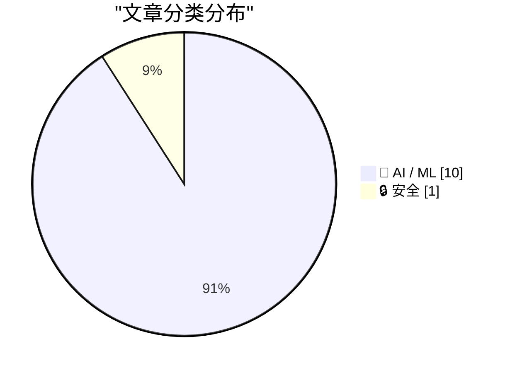
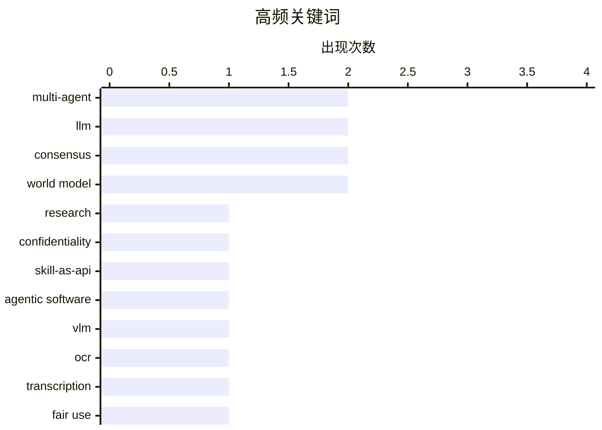

# 📰 AI 资讯每日精选 — 2026-09-03

> 汇聚 156+ 技术博客、X/Twitter、Hacker News、Reddit、Product Hunt、
> Lobste.rs、ClawFeed 日报及 GitHub Trending，经 AI 评分筛选。
>
> **本期内容**：🏆 今日必读 · 🌐 ClawFeed 日报 · 🔥 GitHub Trending · 📂 分类精选 · 📊 数据概览 · 🎯 项目相关情报 · 🌍 补充视角

## 📝 今日看点

今日技术圈聚焦三大主线：多智能体系统正从协作走向工程化与安全化，围绕技能封装、协议泄露及长时程任务验证的讨论日益深入；生成式AI加速从平面理解迈向3D世界级模拟，World Labs Atlas等模型展示了以少量图像重建可交互场景的潜力；与此同时，AI训练数据版权之争迎来里程碑式博弈，美国司法部支持的合理使用立场与版权局意见直接冲突，为行业合规走向蒙上不确定性。此外，轻量化推理优化与模型内部可解释性研究也在持续夯实AI落地的技术底座。

---

## 🏆 今日必读

🥇 **ArcticSwarm：在长时程多智能体研究中推迟早期共识**

[ArcticSwarm: Deferring Early Consensus in Long-Horizon Multi-Agent Research](https://arxiv.org/abs/2609.01870) — arXiv Multiagent Systems · 16 分钟前 · 🤖 AI / ML · **一手来源**

> 多智能体系统在具有可靠验证器的领域（如编程）中表现出色，但此类流水线无法推广到没有验证器的开放式、长时程研究任务。多数投票或自一致性常被用作代理验证器，但并行智能体会重复探索相同证据。ArcticSwarm提出了一种推迟早期共识的方法，以应对这一挑战。该方法旨在提高长时程研究任务中的探索效率和最终性能。

💡 **为什么值得读**: 对于关注多智能体系统在开放式任务中局限性的研究者，本文提出了一种新的共识策略，可能启发更高效的研究自动化方法。

🏷️ multi-agent, LLM, research, consensus

🥈 **技能即API：面向智能体软件工程的机密多智能体协调**

[Skill-as-API: Confidential Multi-Agent Coordination for Agentic Software Engineering](https://arxiv.org/abs/2609.01677) — arXiv Cryptography and Security · 16 分钟前 · 🔒 安全 · **一手来源**

> AI编程智能体正从孤立工具演变为协作队友，但协调渠道可能泄露技能的知识产权。MCP和A2A等协议在服务器端运行实现，但仍向每个对等方发布技能描述和类型模式，无法隐藏技能的存在，也不能保证包装的系统提示词的安全。本文提出了一种“技能即API”的方法，旨在实现机密的多智能体协调，保护技能知识产权。

💡 **为什么值得读**: 对于关注AI智能体协作中知识产权保护的开发者，本文指出了现有协议的缺陷并提出解决方案，具有实际参考价值。

🏷️ multi-agent, confidentiality, skill-as-api, agentic software

🥉 **视觉语言模型是阅读还是重写？关于视觉语言模型转录保真度的研究**

[Do VLMs Read or Rewrite? On Transcription Faithfulness in Vision-Language Models](https://arxiv.org/abs/2607.21617) — arXiv Artificial Intelligence · 16 分钟前 · 🤖 AI / ML · **一手来源**

> 视觉语言模型（VLM）越来越多地取代传统OCR流水线用于文档理解，但研究表明它们并不总是忠实的转录者：当文本不完美时，它们往往将其重写为更合理的形式，而干净的OCR基准无法检测到这种行为。为此，作者引入了FaithC4，一个包含1,455页单页文档（英语、中文、韩语）的多语言扰动基准。该基准旨在评估VLM的转录保真度，揭示其重写倾向。

💡 **为什么值得读**: 对于依赖VLM进行文档数字化和OCR的用户，本文揭示了VLM的潜在不可靠性，并提供了评估工具，有助于选择合适模型。

🏷️ VLM, OCR, transcription

4️⃣ **美国司法部在里程碑版权案中支持AI训练的合理使用**

[US Department of Justice backs fair use for AI training in landmark copyright case](https://the-decoder.com/us-department-of-justice-backs-fair-use-for-ai-training-in-landmark-copyright-case/) — The Decoder · 9 小时前 · 🤖 AI / ML · **二手来源**

> 在涉及《纽约时报》的集体诉讼中，美国司法部认为，在受版权保护的文本上训练AI模型属于合理使用。这一立场直接与美国版权局的报告相矛盾。该报告发布后，其局长被特朗普政府解雇。

💡 **为什么值得读**: 该报道涉及AI训练版权的重要法律争议，司法部的立场可能影响未来AI法规，值得关注。

🏷️ fair use, copyright, AI training, legal

5️⃣ **World Labs推出Atlas：一个从少量照片生成、重建和模拟3D世界的单一AI模型**

[World Labs unveils Atlas, a single AI model that generates, reconstructs, and simulates 3D worlds from just a few photos](https://the-decoder.com/world-labs-unveils-atlas-a-single-ai-model-that-generates-reconstructs-and-simulates-3d-worlds-from-just-a-few-photos/) — The Decoder · 15 小时前 · 🤖 AI / ML · **二手来源**

> 由AI研究员李飞飞联合创立的World Labs宣布推出Atlas，这是一个世界模型，可以从几张图像生成、重建和模拟3D场景。该公司声称，通过将所有输入锚定在3D空间而非作为平面序列处理，Atlas优于专用模型。Atlas还可以完全在模拟中生成机器人训练数据。

💡 **为什么值得读**: 对于3D视觉和机器人领域的研究者，Atlas展示了从少量图像构建3D世界的潜力，可能推动相关应用发展。

🏷️ world model, 3D, generation, simulation

---

## 🌐 ClawFeed 日报精选

> 来源：[ClawFeed](https://clawfeed.kevinhe.io) — AI 驱动的多源新闻聚合

# 📋 ClawFeed Daily | 2026-09-02（周二）

> 聚合 5 份 4h digest：#1117(00:00) · #1118(04:00) · #1119(08:00) · #1120(12:00) · #1121(16:00)
> feed 140 · bookmarks 95（全部历史已报，无新增）· errors 0

---

## 🔥 当日全场最重要 5 条

### 1. Claude Fable 5.1 + Mythos 5.1 正式发布——全天刷屏，缓存降价 75%，安全护栏拦截率降 6 成

Anthropic 官宣"世界最先进的编码和知识工作模型"。关键数字：缓存读取价格从 $1 降至 $0.25（降 75%），Claude Code 安全护栏拦截率降 60%，agent 同上下文场景可省 25-45%。隐藏升级：中途切换 effort 不再重写缓存——塞一条空 system 消息只带 effort 设定，前缀不动、缓存全命中，多档位任务成本直接砍下来。GitHub 官方同步宣布 Fable 5.1 进入 Copilot GA，Mythos 系列正式进入 IDE 主战场。**全天 5 档 4/5 档报道，中英文圈同步刷屏。**

### 2. 李飞飞 World Labs 发布 Atlas——世界模型从论文概念走向可用产品

首个从零训练的多模态世界模型，单张图片生成完整 3D 空间场景，支持自由运动和时间演变理解。两个 4h 档独立报道（12:00 + 16:00），与 Runway Solaris、MiniMax H3 Max 形成"构建虚拟世界的 N 种路径"对比。**标志着"世界模型"从研究方向升级为产品竞赛。**

### 3. Agent 成本管理成为核心工程问题——从 token 暴涨到 Grok Bot 云端常驻

三条独立信号同日收敛：@svpino 实测几周内 agent 成本 3x 暴涨（无故障纯费用膨胀）；Elon 宣布 Grok Bot 在云端 24/7 运行独立电脑，直击"代码在哪跑"痛点；Fable 5.1 缓存降价 75% 本质上也是成本回应。**Agent 经济从"能跑"进入"跑得起"的工程阶段。**

### 4. Graph Memory vs Flat Retrieval 首个严格对比论文——长期记忆架构实证出炉

将对话轮次抽取为类型化节点+属性化边，从两跳子图回答问题。为 long-term agent 记忆架构提供首个实证基准。**直接相关 OpenMax agent 记忆设计——graph 结构在多轮对话场景显著优于扁平检索。**

### 5. Andrew Chen (a16z) Before/After AI 范式翻转——AI 正在改写创业的每一条旧规则

"硬件不再难、独立创始人优于团队、非技术创始人可行、PhD 从实验室走向创业"。**核心结论：AI 时代的壁垒从技术能力转向分发和数据——如果所有人都能 build，差异化必须在工作流数据和客户关系里找。**

---

## 📰 当日核心主题

### 1. Claude/Anthropic 生态全面更新（全天 4/5 档信号）
- **Fable 5.1 + Mythos 5.1** 发布，缓存降价 75%，护栏降 60%
- **GitHub Copilot GA** 正式接入 Fable 5.1
- **Vercel AI Gateway** 上线 Fable 5.1
- **Claude token 省量技巧**：禁用 1M 上下文（CLAUDE_CODE_DISABLE_1M_CONTEXT=1）
- **effort 切换不重写缓存**：隐藏升级，多档位任务成本优化

### 2. 世界模型 / 界面生成竞赛（覆盖 3 档）
- **李飞飞 World Labs Atlas**——单图生成 3D 世界，从零训练
- **Runway Solaris**——界面世界模型，UI 实时生成而非编码
- **MiniMax H3 Max**——同一目标、不同技术路线
- 三者形成"构建虚拟世界的 N 种路径"对比

### 3. Grok / xAI 持续攻势（覆盖 3 档）
- Grok Bot 云端 24/7 运行，解决"代码在哪跑"问题
- Elon G20 演讲：电力/数据中心是 AI 瓶颈
- X 八月 App Store 下载破 1.03 亿次创历史新高
- X 开源算法持续更新 2 周+，已整合社区 PR
- Zuckerberg、Jensen、新 Apple CEO John Ternus 集体入驻 X

### 4. 推理速度 / 模型军备赛加速
- **OpenAI + Cerebras GPT 5.6 Sol** 跑到 750 tokens/s
- **Google Gemini 3.7 Flash** 发布
- **DeepSeek V4 Flash** 限时免费，V4 Pro 省 55%
- 推理速度从优化指标升级为架构级需求

### 5. RWA / 代币化证券持续渗透
- **ARB 单日暴涨 30%+**，Robinhood Chain 24h 收入 $1.92M
- **Bitfinex Securities** 首次上线代币化股票
- **萨尔瓦多** 233 个新代币登记项目，78% 集中在 7-8 月
- **Sberbank** 计划接受 ETH/USDT 作为贷款抵押品
- 加密行业 15 个项目从发币转向回购销毁模式

---

## 🔖 Bookmarks 精选

全天 5 档 bookmarks 均为 19 条历史已报内容，无新增。结构性 stale 延续。

核心存量 bookmarks（持续被引用）：
- @Tao100086 36 篇 AI 经典论文精选
- @AndrewYNg AI Engineering Skills Map
- @trq212 Claude Code 系统提示精简 80%
- @BruceGuai Matrix Agent 公司 OS 架构
- @guruchahal AI 市场渗透率 <1%

---

## 👀 推荐关注汇总

本日 5 档均未执行浏览器逐一核实，不出正式新推荐。

观察到的活跃信号源（非正式推荐，未核实是否已关注）：
- **@svpino** — Agent 成本工程实操，一手踩坑数据，从 token 优化到架构决策
- **@Gorden_Sun** — 中文 AI 产品深度解读（Solaris/Fable 5.1），视角独特信息密度高
- **@askalphaxiv (AlphaXiv)** — DeepWiki/研究论文搜索引擎，直接接入 agent 工具链
- **@servasyy_ai** — Fable 5.1 深度解读，价格/性能/护栏全维度拆解

---

## 💤 当日重复噪音模式

| 噪音类型 | 频次 | 代表账号 |
|---------|------|---------|
| @RaminNasibov 纯图/空正文 | 4 档出现 | 常驻噪音源，光盘笑话/行星动图/logo 设计广告 |
| Crypto 促销/活动帖 | 每档 2-4 条 | @BNBCHAIN 6 周年、@CoinMarketCap Ethena 广告、@binance 营销 |
| 纯 meme 币喊单 | 每档 1-2 条 | @CryptoOracle666 @biquanaishen @Forward_TD |
| 非领域内容 | 2 档 | @GetTheDailyDirt 政治新闻、@Meenerl4 宗教语录 |
| 空白/纯表情帖 | 2 档 | @binance @alex_prompter @indigox |

---

*聚合自 4h digest #1117/#1118/#1119/#1120/#1121 · 覆盖 2026-09-02 00:00-19:59 SGT（20:00-23:59 待次日补入）· feed 140 · bookmarks 95（0 新增）· errors 0*---

## 🔥 GitHub Trending

> 今日热门开源项目（全语言 + Python）

| # | 项目 | 描述 | ⭐ 总星 | 📈 今日 | 语言 |
|---|------|------|---------|---------|------|
| 1 | [DietrichGebert/ponytail](https://github.com/DietrichGebert/ponytail) 🤖 | Makes your AI agent think like the laziest senior dev in ... | 122.0k | +1354 | JavaScript |
| 2 | [mattpocock/skills](https://github.com/mattpocock/skills) | Skills for Real Engineers. Straight from my .agents direc... | 245.4k | +1166 | Shell |
| 3 | [pacifio/atlas](https://github.com/pacifio/atlas) | Source control for agents. Use multiple coding agents, tr... | 3.0k | +888 | Rust |
| 4 | [jingyaogong/minimind](https://github.com/jingyaogong/minimind) 🤖 | 🧠 Train a 64M-parameter LLM from scratch in just 2h! | 57.9k | +860 | Python |
| 5 | [debpalash/VoiceStudio](https://github.com/debpalash/VoiceStudio) | VoiceStudio is the open-source, fully-local ElevenLabs al... | 15.1k | +832 | Python |
| 6 | [Imbad0202/academic-research-skills](https://github.com/Imbad0202/academic-research-skills) 🤖 | Academic Research Skills for Claude Code: research → writ... | 45.6k | +799 | Python |
| 7 | [Gitlawb/openclaude](https://github.com/Gitlawb/openclaude) | runs anywhere. uses anything | 32.0k | +775 | TypeScript |
| 8 | [browser-use/video-use](https://github.com/browser-use/video-use) | Edit videos with coding agents | 23.6k | +733 | Python |
| 9 | [firecrawl/pdf-inspector](https://github.com/firecrawl/pdf-inspector) | Fast Rust library for PDF inspection, classification, and... | 18.6k | +586 | Rust |
| 10 | [NousResearch/hermes-agent](https://github.com/NousResearch/hermes-agent) 🤖 | The agent that grows with you | 240.2k | +533 | Python |
| 11 | [affaan-m/ECC](https://github.com/affaan-m/ECC) 🤖 | The agent harness performance optimization system. Skills... | 246.4k | +516 | JavaScript |
| 12 | [datawhalechina/hello-agents](https://github.com/datawhalechina/hello-agents) | 📚 《从零开始构建智能体》——从零开始的智能体原理与实践教程 | 76.6k | +446 | Python |
| 13 | [3b1b/manim](https://github.com/3b1b/manim) | Animation engine for explanatory math videos | 92.9k | +405 | Python |
| 14 | [blader/humanizer](https://github.com/blader/humanizer) 🤖 | Agent skill that removes signs of AI-generated writing fr... | 40.6k | +374 | Python |
| 15 | [google-research/timesfm](https://github.com/google-research/timesfm) | TimesFM (Time Series Foundation Model) is a pretrained ti... | 30.0k | +343 | Python |

---

## 🤖 AI / ML

### 1. ArcticSwarm：在长时程多智能体研究中推迟早期共识

[ArcticSwarm: Deferring Early Consensus in Long-Horizon Multi-Agent Research](https://arxiv.org/abs/2609.01870) — **arXiv Multiagent Systems** · 16 分钟前 · ⭐ 23/30 · **一手来源**

> 多智能体系统在具有可靠验证器的领域（如编程）中表现出色，但此类流水线无法推广到没有验证器的开放式、长时程研究任务。多数投票或自一致性常被用作代理验证器，但并行智能体会重复探索相同证据。ArcticSwarm提出了一种推迟早期共识的方法，以应对这一挑战。该方法旨在提高长时程研究任务中的探索效率和最终性能。

🏷️ multi-agent, LLM, research, consensus

---

### 2. 视觉语言模型是阅读还是重写？关于视觉语言模型转录保真度的研究

[Do VLMs Read or Rewrite? On Transcription Faithfulness in Vision-Language Models](https://arxiv.org/abs/2607.21617) — **arXiv Artificial Intelligence** · 16 分钟前 · ⭐ 22/30 · **一手来源**

> 视觉语言模型（VLM）越来越多地取代传统OCR流水线用于文档理解，但研究表明它们并不总是忠实的转录者：当文本不完美时，它们往往将其重写为更合理的形式，而干净的OCR基准无法检测到这种行为。为此，作者引入了FaithC4，一个包含1,455页单页文档（英语、中文、韩语）的多语言扰动基准。该基准旨在评估VLM的转录保真度，揭示其重写倾向。

🏷️ VLM, OCR, transcription

---

### 3. 美国司法部在里程碑版权案中支持AI训练的合理使用

[US Department of Justice backs fair use for AI training in landmark copyright case](https://the-decoder.com/us-department-of-justice-backs-fair-use-for-ai-training-in-landmark-copyright-case/) — **The Decoder** · 9 小时前 · ⭐ 27/30 · **二手来源**

> 在涉及《纽约时报》的集体诉讼中，美国司法部认为，在受版权保护的文本上训练AI模型属于合理使用。这一立场直接与美国版权局的报告相矛盾。该报告发布后，其局长被特朗普政府解雇。

🏷️ fair use, copyright, AI training, legal

---

### 4. World Labs推出Atlas：一个从少量照片生成、重建和模拟3D世界的单一AI模型

[World Labs unveils Atlas, a single AI model that generates, reconstructs, and simulates 3D worlds from just a few photos](https://the-decoder.com/world-labs-unveils-atlas-a-single-ai-model-that-generates-reconstructs-and-simulates-3d-worlds-from-just-a-few-photos/) — **The Decoder** · 15 小时前 · ⭐ 26/30 · **二手来源**

> 由AI研究员李飞飞联合创立的World Labs宣布推出Atlas，这是一个世界模型，可以从几张图像生成、重建和模拟3D场景。该公司声称，通过将所有输入锚定在3D空间而非作为平面序列处理，Atlas优于专用模型。Atlas还可以完全在模拟中生成机器人训练数据。

🏷️ world model, 3D, generation, simulation

---

### 5. 介绍Gemini 3.8 Flash和3.8 Flash Cyber

[Introducing Gemini 3.8 Flash and 3.8 Flash Cyber](https://deepmind.google/blog/introducing-gemini-3-8-flash-and-38-flash-cyber/) — **Google DeepMind Blog** · 11 小时前 · ⭐ 28/30

> Google DeepMind发布了Gemini 3.8 Flash和3.8 Flash Cyber。该博客文章介绍了这两个新模型，但摘要未提供具体细节。

🏷️ Gemini, Flash, AI model

---

### 6. CoViT：用于视觉Transformer的实例对应对比学习

[CoViT: Instance-Correspondence Contrastive Learning for Vision Transformer](https://arxiv.org/abs/2609.01787) — **arXiv Computer Vision** · 16 分钟前 · ⭐ 25/30 · **一手来源**

> 视觉Transformer（ViT）在语义理解方面表现出色，但无法区分对象实例（例如，两只狗产生相同嵌入），限制了其在实例级任务（如目标检测和实例分割）中的应用。为此，作者提出了对比视觉Transformer（CoViT），一种自监督学习框架，通过几何引导的对比学习将实例感知注入ViT。CoViT独特地协调ViT的全局注意力与局部几何信息，以增强实例判别能力。

🏷️ Vision Transformer, contrastive learning, instance discrimination, computer vision

---

### 7. 使用推测解码协同设计AI模型以加速LLM推理

[Co-Designing AI Models Using Speculative Decoding for Faster LLM Inference](https://developer.nvidia.com/blog/co-designing-ai-models-using-speculative-decoding-for-faster-llm-inference/) — **NVIDIA Technical Blog** · 12 小时前 · ⭐ 25/30

> 本文是NVIDIA关于AI模型协同设计系列文章的第三篇，聚焦于在不牺牲准确性的前提下加速大型语言模型（LLM）推理。文章介绍了推测解码（speculative decoding）技术，该技术通过使用一个小的草稿模型快速生成多个候选token，再由目标LLM进行验证，从而减少推理延迟。文中探讨了如何通过协同设计草稿模型和目标模型来优化推测解码的效率，包括选择合适的草稿模型大小、训练策略以及采样方法。文章还展示了在NVIDIA硬件上实现的性能提升，例如在保持生成质量的同时，推理速度可提升2-3倍。结论强调，推测解码是一种有效的模型协同设计方法，能够在不降低输出质量的情况下显著加速LLM推理，为实际部署提供了实用方案。

🏷️ speculative decoding, LLM inference, model co-design

---

### 8. 人工神经网络的涌现符号结构

[The Emergent Symbolic Structure of Artificial Neural Networks](https://arxiv.org/abs/2608.29530) — **Hacker News Best** · 1 天前 · ⭐ 25/30

> 本文探讨了人工神经网络中涌现的符号结构，即网络在训练过程中自发形成的可解释的内部表示。文章通过分析网络内部激活和权重，发现某些神经元或特征会形成类似符号的离散表示，这些表示与输入中的概念或实体相对应。作者提出了一种方法来识别和提取这些符号结构，并展示了它们在网络泛化和推理中的作用。实验表明，这些涌现的符号结构有助于提高模型的解释性和鲁棒性。结论认为，理解这些符号结构对于构建更透明和可控的AI系统具有重要意义。

🏷️ neural networks, interpretability, symbolic structure

---

### 9. 信念校准优化：用于智能体优化的显式世界模型

[Belief-Calibrated Optimization: An Explicit World Model for Agentic Optimization](https://arxiv.org/abs/2609.01861) — **arXiv Artificial Intelligence** · 16 分钟前 · ⭐ 24/30 · **一手来源**

> LLM智能体的性能取决于冻结模型周围的脚手架。改进脚手架的一种常见方法是使用编码智能体作为优化器：它读取当前分数和轨迹，并迭代编辑源代码，每轮产生新候选。每次编辑根据对环境反应的信念进行选择，但该信念通常是隐式的。本文提出信念校准优化，通过显式世界模型来校准信念，以提高优化效率。

🏷️ LLM agents, optimization, world model

---

### 10. AI智能体重塑人类群体中的共识形成

[AI agents reshape consensus formation in human groups](https://arxiv.org/abs/2609.02122) — **arXiv Computation and Language** · 16 分钟前 · ⭐ 24/30 · **一手来源**

> 随着大型语言模型（LLM）智能体从工具转变为人类群体的参与者，一个关于集体行为的基本问题是它们日益增长的存在如何重塑共识形成。本研究在协作描述游戏中考察混合人机群体，其中共享约定通过多轮随机成对交流涌现。通过改变LLM智能体的比例，研究者识别出共识形成的三种不同机制。

🏷️ LLM, agents, consensus, human-AI

---

## 🔒 安全

### 11. 技能即API：面向智能体软件工程的机密多智能体协调

[Skill-as-API: Confidential Multi-Agent Coordination for Agentic Software Engineering](https://arxiv.org/abs/2609.01677) — **arXiv Cryptography and Security** · 16 分钟前 · ⭐ 23/30 · **一手来源**

> AI编程智能体正从孤立工具演变为协作队友，但协调渠道可能泄露技能的知识产权。MCP和A2A等协议在服务器端运行实现，但仍向每个对等方发布技能描述和类型模式，无法隐藏技能的存在，也不能保证包装的系统提示词的安全。本文提出了一种“技能即API”的方法，旨在实现机密的多智能体协调，保护技能知识产权。

🏷️ multi-agent, confidentiality, skill-as-api, agentic software

---

## 📊 数据概览

| 扫描源 | 抓取文章 | 时间范围 | 精选 |
|:---:|:---:|:---:|:---:|
| 110/156 | 6334 篇 → 1162 篇 | 24h | **11 篇** |

### 分类分布



### 高频关键词



<details>
<summary>📈 纯文本关键词图（终端友好）</summary>

```
multi-agent      │ ████████████████████ 2
llm              │ ████████████████████ 2
consensus        │ ████████████████████ 2
world model      │ ████████████████████ 2
research         │ ██████████░░░░░░░░░░ 1
confidentiality  │ ██████████░░░░░░░░░░ 1
skill-as-api     │ ██████████░░░░░░░░░░ 1
agentic software │ ██████████░░░░░░░░░░ 1
vlm              │ ██████████░░░░░░░░░░ 1
ocr              │ ██████████░░░░░░░░░░ 1
```

</details>

### 🏷️ 话题标签

**multi-agent**(2) · **llm**(2) · **consensus**(2) · world model(2) · research(1) · confidentiality(1) · skill-as-api(1) · agentic software(1) · vlm(1) · ocr(1) · transcription(1) · fair use(1) · copyright(1) · ai training(1) · legal(1) · 3d(1) · generation(1) · simulation(1) · gemini(1) · flash(1)

---

## 🎯 项目相关情报

### Agent 基座安全与合规

> 暂无达到质量门槛的项目相关情报。

### 多 Agent 架构

#### [ArcticSwarm：在长时程多智能体研究中推迟早期共识](https://arxiv.org/abs/2609.01870)

> **状态**：本期 Top 11 已收录

- **匹配类型**：直接相关
- **项目相关性**：8/10
- **可落地性**：7/10
- **为什么相关**：文章研究长周期多Agent研究中的早期共识延迟方法，属于多Agent系统协作与编排策略方向，与多Agent架构的共享状态、共识机制直接相关。
- **建议动作**：关注其“延迟早期共识”策略，可能对多Agent任务编排和共识算法优化有参考价值，建议阅读全文评估可迁移性。
- **来源**：arXiv Multiagent Systems · 一手来源

#### [技能即API：面向智能体软件工程的机密多智能体协调](https://arxiv.org/abs/2609.01677)

> **状态**：本期 Top 11 已收录

- **匹配类型**：直接相关
- **项目相关性**：8/10
- **可落地性**：7/10
- **为什么相关**：文章讨论AI编码智能体之间技能发现与调用的协作机制，属于多Agent通信与协调范畴，直接涉及Agent间的技能API化交互。
- **建议动作**：研究其Skill-as-API设计，可作为多Agent通信协议或协作接口设计的参考，重点关注安全与保密机制。
- **来源**：arXiv Cryptography and Security · 一手来源

### ASR 与语音助手

> 暂无达到质量门槛的项目相关情报。

### 商品包装 OCR

#### [视觉语言模型是阅读还是重写？关于视觉语言模型转录保真度的研究](https://arxiv.org/abs/2607.21617)

> **状态**：本期 Top 11 已收录

- **匹配类型**：直接相关
- **项目相关性**：8/10
- **可落地性**：7/10
- **为什么相关**：研究VLM在文档理解中是否忠实转录，直接关系到OCR与多模态文档解析的可靠性。
- **建议动作**：分析其忠实性评测方法，评估现有OCR/VLM流水线的转录准确性，为商品包装OCR提供参考。
- **来源**：arXiv Artificial Intelligence · 一手来源

---

## 🌍 补充视角

> Top 11 未覆盖的高质量不同来源，最多 3 条。

### 1. Claude 的新系统提示词真的不想复制歌词

[Claude's new system prompt really doesn't want to reproduce song lyrics](https://simonwillison.net/2026/Sep/2/claudes-new-system-prompt/) — **simonwillison.net** · 13 小时前 · 🤖 AI / ML · ⭐ 24/30

> Anthropic 发布了其消费级应用（Claude.ai 和移动应用）的系统提示词，并公开了历史变更记录。文章指出，这些提示词明确禁止复制受版权保护的歌词，并详细说明了如何识别和避免此类请求。作者 Simon Willison 对此表示赞赏，认为这种透明度有助于用户理解模型的行为边界。

💡 **补充价值**：对于关注 AI 伦理和版权问题的读者，这篇文章揭示了 Anthropic 在系统提示词中如何处理版权内容，展示了其透明度策略。

### 2. 使用 AWS 上的生成式 AI 现代化和扩展支持运营

[Modernizing and scaling support operations with generative AI on AWS](https://aws.amazon.com/blogs/machine-learning/modernizing-and-scaling-support-operations-with-generative-ai-on-aws/) — **AWS Machine Learning Blog** · 9 小时前 · 🤖 AI / ML · ⭐ 22/30 · **一手来源**

> 文章介绍了如何在 AWS 上构建基于生成式 AI 的支持运营平台。该平台将培训视频转换为结构化标准操作程序（SOP），应用检索增强生成（RAG）来指导工单解决，并使用机器学习预测服务等级协议（SLA）风险并确定工作优先级。通过这一方案，企业可以提升支持效率，实现运营现代化和扩展。

💡 **补充价值**：对于希望利用生成式 AI 优化客户支持流程的技术决策者，这篇文章提供了具体的架构和实现方法，具有实践指导意义。

---

*生成于 2026-09-03 04:16 | 汇聚 156 个技术博客、X/Twitter、Hacker News、Reddit、Product Hunt、Lobste.rs、ClawFeed 日报及 GitHub Trending，经 AI 评分筛选出 Top 11 精华内容，另附 2 条不同来源补充视角*
