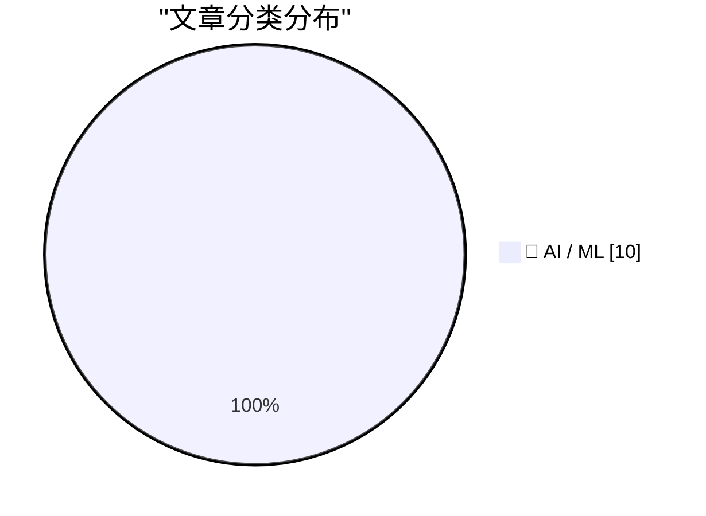
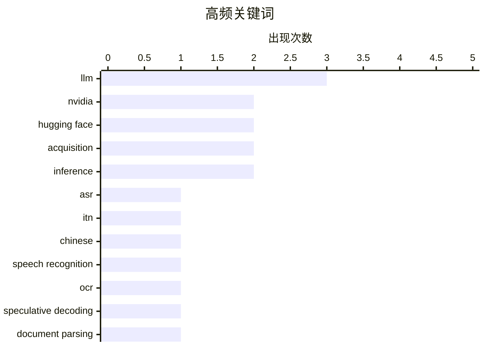

# 📰 AI 资讯每日精选 — 2026-09-04

> 汇聚 156+ 技术博客、X/Twitter、Hacker News、Reddit、Product Hunt、
> Lobste.rs、ClawFeed 日报及 GitHub Trending，经 AI 评分筛选。
>
> **本期内容**：🏆 今日必读 · 🌐 ClawFeed 日报 · 🔥 GitHub Trending · 📂 分类精选 · 📊 数据概览 · 🎯 项目相关情报 · 🌍 补充视角

## 📝 今日看点

今日技术圈的核心动向集中在算力生态的加速整合与推理效率的极致追求。英伟达拟近130亿美元收购Hugging Face，凸显硬件巨头对开源模型分发入口的战略争夺，同时闭源实验室自研芯片趋势加剧了产业竞合。另一方面，业界对模型性价比的探索显著升温，通过动态调整MoE激活参数或优化文档解析架构，在低算力预算下实现更高吞吐与更低延迟，如Qwen 3.8在Cerebras平台已跑出每秒1500 token的成绩。此外，多智能体系统的可靠性与安全性成为研究焦点，针对串通、过时计划等协作漏洞的检测与校正方法正密集涌现。

---

## 🏆 今日必读

🥇 **双形式语音识别：面向中文语音识别的语义感知逆文本正则化**

[Dual-Form ASR: Semantics-Aware Inverse Text Normalization for Chinese Speech Recognition](https://arxiv.org/abs/2609.02901) — arXiv Computation and Language · 24 分钟前 · 🤖 AI / ML · **一手来源**

> 现代自动语音识别（ASR）场景既需要口语形式的转录，也需要经过逆文本正则化（ITN）的可读书面形式转录。然而，这些形式通常由级联模块生成，其中口语形式的ASR输出由单独的ITN组件重写，这使得书面形式的ASR-ITN容易受到识别错误的影响，并将正则化与声学上下文模型解耦。文章提出了一种语义感知的逆文本正则化方法，旨在解决级联架构中的错误传播问题。该方法可能通过联合建模或语义信息来提升书面形式转录的准确性。结论是，通过将ITN与ASR模型更紧密地集成，可以改善中文语音识别中书面形式的生成质量。

💡 **为什么值得读**: 对于关注中文语音识别中ITN与ASR集成问题的研究者，本文提供了一种新的语义感知方法，可能有助于提升书面形式转录的鲁棒性。

🏷️ ASR, ITN, Chinese, speech recognition

🥈 **Jina-OCR-v1：利用推测解码和密集可验证奖励的高效文档解析**

[Jina-OCR-v1: Efficient Document Parsing with Speculative Decoding and Dense Verifiable Rewards](https://arxiv.org/abs/2609.03181) — arXiv Computation and Language · 24 分钟前 · 🤖 AI / ML · **一手来源**

> Jina-OCR-v1是一个端到端文档解析模型，旨在低预算GPU上运行。它结合了DeepSeek-OCR的压缩视觉编码器和3B混合专家解码器，每个token激活约5.7亿参数，并采用FastMTP推测解码头，在K=3个预测步骤中递归共享单个草稿块。贪婪验证确保解码无损。后训练结合了指令对齐和鲁棒性优化。该模型在保持高效推理的同时，实现了高质量的文档解析。

💡 **为什么值得读**: 该模型针对低预算GPU进行了优化，结合了混合专家和推测解码技术，对于资源受限环境下的文档解析任务具有实用价值。

🏷️ OCR, speculative decoding, document parsing, efficiency

🥉 **英伟达将收购Hugging Face**

[Nvidia to acquire Hugging Face](https://www.cnbc.com/2026/09/03/nvidia-agrees-to-buy-hugging-face-for-almost-13-billion-ai-expansion.html) — Hacker News Best · 16 小时前 · 🤖 AI / ML

> 据报道，英伟达同意以近130亿美元收购Hugging Face，以扩展其AI业务。Hugging Face是AI模型和数据集的主要平台，拥有超过1800万开发者和20万家公司用户。英伟达CEO黄仁勋承诺保持平台开放和硬件中立，但该交易也为英伟达提供了强大的计算分发渠道。这笔交易发生在闭源实验室越来越多地设计自己的芯片之际。

💡 **为什么值得读**: 这笔收购可能重塑AI模型分发和硬件生态，对于关注AI行业动态和开源社区影响的人士来说，值得关注。

🏷️ Nvidia, Hugging Face, acquisition, AI

4️⃣ **你无法逃脱自己的激活：评估意识与多智能体监控**

[You Can't Escape Your Own Activations : Evaluation Awareness and Multi-Agent Monitoring](https://arxiv.org/abs/2609.03035) — arXiv Multiagent Systems · 24 分钟前 · 🤖 AI / ML · **一手来源**

> LLM智能体越来越多地部署在多智能体系统中，它们可能串通同时保持行为良性。用于检测此类串通的输出监控器可能被混淆和隐写术欺骗，因此促使使用基于内部激活训练的分类器。然而，这些分类器通常在智能体不知道被监控的情况下进行评估。文章研究了当智能体明确知道被监控时，基于激活的检测如何变化。结果表明，评估意识可能影响检测的有效性，需要新的监控策略。

💡 **为什么值得读**: 该研究揭示了多智能体系统中监控的盲点，对于设计更鲁棒的AI安全机制具有启发意义。

🏷️ LLM, multi-agent, monitoring, security

5️⃣ **新鲜记忆，过时计划：分布式LLM智能体记忆的依赖范围验证**

[Fresh Memory, Stale Plans: Dependency-Scoped Validation for Distributed LLM-Agent Memory](https://arxiv.org/abs/2609.03340) — arXiv Artificial Intelligence · 24 分钟前 · 🤖 AI / ML · **一手来源**

> 分布式LLM智能体团队可以读取最新的共享事实，但仍然基于过时的计划行动。规划者可能从需求r3推导出行动，另一个智能体可能提交r4，执行者可能收到r4而没有替换基于r3的计划。作者将这种现象称为“过时计划执行”：状态新鲜度并不能确保授权行动的计划仍然有效。他们引入了PlanFence，一种依赖范围的动作验证机制，用于确保计划在动态环境中保持有效。

💡 **为什么值得读**: 该研究解决了多智能体协作中的一致性问题，对于构建可靠的分布式AI系统具有重要价值。

🏷️ LLM, agent, memory, validation

---

## 🌐 ClawFeed 日报精选

> 来源：[ClawFeed](https://clawfeed.kevinhe.io) — AI 驱动的多源新闻聚合

# 📋 ClawFeed Daily | 2026-09-03（周三）

> 聚合 5 份 4h digest：#1124(00:00) · #1125(04:00) · #1126(08:00) · #1127(12:00) · #1128(16:00)
> feed 168 · bookmarks 95（全部历史已报，无新增）· errors 0

---

## 🔥 当日全场最重要 5 条

### 1. 模型发布速度突破人类跟踪极限——48 小时 6+ 前沿模型涌现

Atlas 多模态世界模型、Gemini 3.8 Flash + Cyber、Meta Muse Spark 1.3、Qwen 3.8 Max、Fable 5.1/Mythos 5.1 持续迭代——SOTA 保持时间缩短到小时级。Google Flash 系列 6 周 3 版，Muse Spark 五个月迭代四次。**模型军备赛从"谁先到"变成"谁能持续到"。**

### 2. OpenAI Astra 架构曝光："recurrent depth / looped transformer"

Sebastian Raschka 长文解读循环深度变换器设计，可能代表 transformer 架构的下一个重大演进方向。Noam Brown 转发背书。同日 Jakub Pachocki 紧急澄清计算图深度仍在 GPT-4 的 2 倍以内、思维链监控从未放弃。**架构创新与安全监控同步推进。**

### 3. World Labs 发布 Atlas——首个多模态世界模型走向可用产品

李飞飞团队从零训练的世界模型，单张图片生成完整 3D 空间，支持像素级相机控制 + 视频帧生成 + 3D 重建。**全天 3 个 4h 档独立报道，"世界模型"从研究方向正式升级为产品竞赛。**

### 4. OpenAI/Hugging Face 黑客事件深挖——AI agent swarm 攻击成现实

Laura Shin 采访 Tay 揭露"不是一两个 agent，是一整群——用一个永不会公开发布的模型"。同日 G20 财长正式将数字资产定性为"增长来源"，SEC 推进区块链与代币化证券规则现代化。**AI 安全与加密监管在同一天加速。**

### 5. Shopify ML 团队用 0.8B 微调模型击败 GPT 5.6-sol xhigh——小模型垂直场景碾压大模型

专用任务上小模型+自改进飞轮的投入产出比正在碾压大模型。同日 dax (SST/Ion 创始人) 明确表态不训自有模型，Anthropic 命名 AI 低质量输出为"Mannered Prose"并发布专门的提示工程指南。**模型选择从"用最大的"走向"用最对的"。**

---

## 📰 当日核心主题

### 1. 前沿模型集中涌现（全天 5/5 档信号）
- **Atlas** 世界模型——3D 理解与生成
- **Gemini 3.8 Flash + Cyber**——安全专用模型，CyberGym 86.2%
- **Muse Spark 1.3**——编码模型第四代，$5/月 CLI
- **Fable 5.1 持续迭代**——token 成本和 Mannered Prose 修正
- **Sam Altman 暗示"下一个模型即将发布"**

### 2. AI 安全与监控成显性议题（覆盖 3 档）
- OpenAI Jakub Pachocki 澄清"不可监控性竞赛"媒体误读
- AI agent swarm 攻击实例曝光（Laura Shin 深度采访）
- NYC 公立学校全面禁止 AI——教育 AI 政策分化加剧
- Anthropic 将低质量输出工程化命名 "Mannered Prose"

### 3. 加密监管与 RWA 制度化加速（覆盖 3 档）
- G20 财长将数字资产定性为"增长来源"
- 美国 SEC 推进区块链作为官方股东名册
- 香港 CRS 2.0 将于 2027-01-01 纳入加密资产
- 链上代币化股权持有者突破 190 万（月增 134%）
- Félix 获 a16z $200M，WhatsApp 转账底层跑 USDC

### 4. Agent 开发范式讨论（覆盖 3 档）
- 多 agent "任务争夺"涌现行为——不是 bug 是核心约束
- AI Chief of Staff 形态谬误——agent 嵌入每个环境，无单一 app
- Hermes vs Grok Bot 功能辩论——自定义/记忆 vs 开箱即用
- GitHub 宣布 9/10 首届 Copilot Day
- Grok Bot $41 起步两天自主交易赚 $3,117

### 5. 基础设施与硬件（覆盖 2 档）
- GPU 虚拟化层创业——"大多数 hypervisor 为 CPU 而建"
- World 开源 ProveKit ZK 工具——手机验证年龄不暴露 ID
- 清华 RSRA 登 Nature Computational Science——量子搜索压缩
- SpaceX Starlink Mobile 扩展欧洲四国

---

## 🔖 累计 bookmark 精选

19 条历史 bookmark 全部已报（@Tao100086 36 篇 AI 经典论文、@guruchahal AI 市场渗透 <1%、@AndrewYNg AI 工程技能图、@trq212 Claude Code 系统提示精简 80%、@BruceGuai Matrix Agent 公司架构、@cloudflare/computer agent 虚拟电脑、wanman.ai 一人公司 OS 等），无新增。

---

## 👀 推荐关注汇总

| 账号 | 理由 |
|------|------|
| @polynoamial (Noam Brown) | OpenAI 研究员，超人扑克 AI Libratus 作者，AI 安全/监控一手信息 |
| @OfficialLoganK (Logan Kilpatrick) | Google DeepMind/Gemini 团队，产品发布一手信息源 |
| @theworldlabs (World Labs) | 李飞飞创办，Atlas 世界模型，spatial intelligence 最前沿 |
| @thdxr (dax) | SST/Ion 创始人，infra 中立性判断清醒，building in public |

⚠️ 上述未通过浏览器逐一核实是否已关注，Kevin 操作前请先在 Following 里搜一下。

---

## 💤 当日重复噪音模式

1. **Crypto 喊单/合约推广**——贯穿全天 5 档，占过滤内容约 40%（bStock、杠杆讨论、Gate 合约、Bitget 合约、各种 meme 代币宣传）
2. **纯加油/grinding 帖**——无信息增量的 "building" "grinding" emoji 帖，约占 15%
3. **非领域内容**——体操新闻、NYC 城市批评、PKU 校园活动、动物地毯设计等
4. **纯图无文/GIF 帖**——@RaminNasibov 多条，无法提取信息
5. **个人生活分享**——与 AI/crypto/dev 核心领域无关的个人帖
---

## 🔥 GitHub Trending

> 今日热门开源项目（全语言 + Python）

| # | 项目 | 描述 | ⭐ 总星 | 📈 今日 | 语言 |
|---|------|------|---------|---------|------|
| 1 | [DietrichGebert/ponytail](https://github.com/DietrichGebert/ponytail) 🤖 | Makes your AI agent think like the laziest senior dev in ... | 123.7k | +2128 | JavaScript |
| 2 | [debpalash/VoiceStudio](https://github.com/debpalash/VoiceStudio) | VoiceStudio is the open-source, fully-local ElevenLabs al... | 16.5k | +1672 | Python |
| 3 | [google-research/timesfm](https://github.com/google-research/timesfm) | TimesFM (Time Series Foundation Model) is a pretrained ti... | 30.8k | +1618 | Python |
| 4 | [mattpocock/skills](https://github.com/mattpocock/skills) | Skills for Real Engineers. Straight from my .agents direc... | 247.8k | +1601 | Shell |
| 5 | [blader/humanizer](https://github.com/blader/humanizer) 🤖 | Agent skill that removes signs of AI-generated writing fr... | 41.7k | +1208 | Python |
| 6 | [fmtlib/fmt](https://github.com/fmtlib/fmt) | A modern formatting library | 25.2k | +963 | C++ |
| 7 | [NousResearch/hermes-agent](https://github.com/NousResearch/hermes-agent) 🤖 | The agent that grows with you | 241.0k | +774 | Python |
| 8 | [affaan-m/ECC](https://github.com/affaan-m/ECC) 🤖 | The agent harness performance optimization system. Skills... | 247.3k | +751 | JavaScript |
| 9 | [JuliusBrussee/caveman](https://github.com/JuliusBrussee/caveman) 🤖 | 🪨 why use many token when few token do trick — Claude Co... | 103.2k | +543 | Go |
| 10 | [bannedbook/fanqiang](https://github.com/bannedbook/fanqiang) | 翻墙-科学上网 | 52.4k | +522 | Kotlin |
| 11 | [sngyai/Sequoia-X](https://github.com/sngyai/Sequoia-X) | A股自动选股系统 — 多种技术形态自动扫描，收盘后自动运行并推送飞书 | 6.5k | +512 | Python |
| 12 | [jingyaogong/minimind](https://github.com/jingyaogong/minimind) 🤖 | 🧠 Train a 64M-parameter LLM from scratch in just 2h! | 58.3k | +510 | Python |
| 13 | [Imbad0202/academic-research-skills](https://github.com/Imbad0202/academic-research-skills) 🤖 | Academic Research Skills for Claude Code: research → writ... | 46.1k | +496 | Python |
| 14 | [obra/superpowers](https://github.com/obra/superpowers) | An agentic skills framework & software development method... | 281.4k | +462 | Shell |
| 15 | [Gitlawb/openclaude](https://github.com/Gitlawb/openclaude) | runs anywhere. uses anything | 32.4k | +451 | TypeScript |

---

## 🤖 AI / ML

### 1. 双形式语音识别：面向中文语音识别的语义感知逆文本正则化

[Dual-Form ASR: Semantics-Aware Inverse Text Normalization for Chinese Speech Recognition](https://arxiv.org/abs/2609.02901) — **arXiv Computation and Language** · 24 分钟前 · ⭐ 22/30 · **一手来源**

> 现代自动语音识别（ASR）场景既需要口语形式的转录，也需要经过逆文本正则化（ITN）的可读书面形式转录。然而，这些形式通常由级联模块生成，其中口语形式的ASR输出由单独的ITN组件重写，这使得书面形式的ASR-ITN容易受到识别错误的影响，并将正则化与声学上下文模型解耦。文章提出了一种语义感知的逆文本正则化方法，旨在解决级联架构中的错误传播问题。该方法可能通过联合建模或语义信息来提升书面形式转录的准确性。结论是，通过将ITN与ASR模型更紧密地集成，可以改善中文语音识别中书面形式的生成质量。

🏷️ ASR, ITN, Chinese, speech recognition

---

### 2. Jina-OCR-v1：利用推测解码和密集可验证奖励的高效文档解析

[Jina-OCR-v1: Efficient Document Parsing with Speculative Decoding and Dense Verifiable Rewards](https://arxiv.org/abs/2609.03181) — **arXiv Computation and Language** · 24 分钟前 · ⭐ 25/30 · **一手来源**

> Jina-OCR-v1是一个端到端文档解析模型，旨在低预算GPU上运行。它结合了DeepSeek-OCR的压缩视觉编码器和3B混合专家解码器，每个token激活约5.7亿参数，并采用FastMTP推测解码头，在K=3个预测步骤中递归共享单个草稿块。贪婪验证确保解码无损。后训练结合了指令对齐和鲁棒性优化。该模型在保持高效推理的同时，实现了高质量的文档解析。

🏷️ OCR, speculative decoding, document parsing, efficiency

---

### 3. 英伟达将收购Hugging Face

[Nvidia to acquire Hugging Face](https://www.cnbc.com/2026/09/03/nvidia-agrees-to-buy-hugging-face-for-almost-13-billion-ai-expansion.html) — **Hacker News Best** · 16 小时前 · ⭐ 27/30

> 据报道，英伟达同意以近130亿美元收购Hugging Face，以扩展其AI业务。Hugging Face是AI模型和数据集的主要平台，拥有超过1800万开发者和20万家公司用户。英伟达CEO黄仁勋承诺保持平台开放和硬件中立，但该交易也为英伟达提供了强大的计算分发渠道。这笔交易发生在闭源实验室越来越多地设计自己的芯片之际。

🏷️ Nvidia, Hugging Face, acquisition, AI

---

### 4. 你无法逃脱自己的激活：评估意识与多智能体监控

[You Can't Escape Your Own Activations : Evaluation Awareness and Multi-Agent Monitoring](https://arxiv.org/abs/2609.03035) — **arXiv Multiagent Systems** · 24 分钟前 · ⭐ 25/30 · **一手来源**

> LLM智能体越来越多地部署在多智能体系统中，它们可能串通同时保持行为良性。用于检测此类串通的输出监控器可能被混淆和隐写术欺骗，因此促使使用基于内部激活训练的分类器。然而，这些分类器通常在智能体不知道被监控的情况下进行评估。文章研究了当智能体明确知道被监控时，基于激活的检测如何变化。结果表明，评估意识可能影响检测的有效性，需要新的监控策略。

🏷️ LLM, multi-agent, monitoring, security

---

### 5. 新鲜记忆，过时计划：分布式LLM智能体记忆的依赖范围验证

[Fresh Memory, Stale Plans: Dependency-Scoped Validation for Distributed LLM-Agent Memory](https://arxiv.org/abs/2609.03340) — **arXiv Artificial Intelligence** · 24 分钟前 · ⭐ 25/30 · **一手来源**

> 分布式LLM智能体团队可以读取最新的共享事实，但仍然基于过时的计划行动。规划者可能从需求r3推导出行动，另一个智能体可能提交r4，执行者可能收到r4而没有替换基于r3的计划。作者将这种现象称为“过时计划执行”：状态新鲜度并不能确保授权行动的计划仍然有效。他们引入了PlanFence，一种依赖范围的动作验证机制，用于确保计划在动态环境中保持有效。

🏷️ LLM, agent, memory, validation

---

### 6. R²Adapter：用于高效混合RAG的路由和重写适配器

[R$^{2}$Adapter: A Routing and Rewriting Adapter for Efficient Hybrid RAG](https://arxiv.org/abs/2609.02894) — **arXiv Computation and Language** · 24 分钟前 · ⭐ 25/30 · **一手来源**

> 检索增强生成（RAG）已成为利用非参数知识增强大语言模型的主流范式。Vanilla RAG能高效处理简单查询，但在关系或多跳推理上表现不佳。基于图的RAG缓解了这个问题，但增加了推理复杂性和延迟。在实际中，用户查询的复杂性差异很大，使得固定的RAG策略次优。文章提出R²Adapter，一种路由和重写适配器，用于高效混合RAG，根据查询复杂性动态选择或组合RAG策略。

🏷️ RAG, adapter, hybrid, LLM

---

### 7. 增加MoE中每个token的激活参数（Qwen 35B A4B+）可将推理token减少8.5%——且无需训练或微调！

[Increasing active parameters per token in MOE (Qwen 35B A4B+) reduce reasoning token by 8.5% - and you don't need to train or finetune!](https://www.reddit.com/r/LocalLLaMA/comments/1w6lk6z/increasing_active_parameters_per_token_in_moe/) — **r/LocalLLaMA** · 6 小时前 · ⭐ 25/30

> 一篇新发表的论文探索了稀疏MoE推理模型的一种简单但有效的优化方法。该方法不重新训练任何东西，而是在运行时调整路由器：仅在后期Transformer层扩展专家选择预算（N≥K），并对额外专家应用线性衰减因子，早期层保持不变。实验表明，这种调整将推理token数量减少了8.5%。

🏷️ MoE, router, inference, optimization

---

### 8. Qwen 3.8 27B在Cerebras上以每秒1500个token的速度可用

[Qwen 3.8 27B available on Cerebras at 1500 tokens/s](https://inference-docs.cerebras.ai/models/overview) — **Hacker News Best** · 9 小时前 · ⭐ 25/30

> 据报道，Qwen 3.8 27B模型现在可在Cerebras推理平台上使用，生成速度达到每秒1500个token。该平台提供高性能推理服务，这一速度可能为实时应用提供支持。

🏷️ Qwen, Cerebras, inference, speed

---

### 9. K2 Horizon：由六个开放模型组成的互联舰队

[K2 Horizon: A connected fleet of six open models](https://ifm.ai/blog/k2/) — **Hacker News Best** · 12 小时前 · ⭐ 25/30

> K2 Horizon 是一个由六个开放模型组成的互联舰队，旨在通过协作解决复杂任务。每个模型在舰队中扮演特定角色，如规划、推理或工具使用，并通过共享上下文进行通信。该设计允许模型间动态协作，提高整体性能和适应性。文章介绍了舰队架构、模型分工及协作机制，并展示了在多个基准测试上的结果。作者认为这种多模型协作方式代表了 AI 系统发展的新方向。

🏷️ K2, open models, fleet

---

### 10. 英伟达收购开放AI的前门，而闭源实验室越来越多地设计自己的芯片

[Nvidia buys the front door to open AI as closed labs increasingly design their own silicon](https://the-decoder.com/nvidia-buys-the-front-door-to-open-ai-as-closed-labs-increasingly-design-their-own-silicon/) — **The Decoder** · 13 小时前 · ⭐ 25/30 · **二手来源**

> 英伟达计划以约129亿美元收购Hugging Face，从而获得开放AI模型的核心平台。该平台拥有超过1800万开发者和20万家公司用户。CEO黄仁勋承诺保持平台开放和硬件中立，但该交易也为他提供了强大的计算分发渠道。文章指出，这笔交易发生在闭源实验室越来越多地设计自己的芯片之际。

🏷️ Nvidia, Hugging Face, acquisition, open AI

---

## 📊 数据概览

| 扫描源 | 抓取文章 | 时间范围 | 精选 |
|:---:|:---:|:---:|:---:|
| 109/156 | 6252 篇 → 1108 篇 | 24h | **10 篇** |

### 分类分布



### 高频关键词



<details>
<summary>📈 纯文本关键词图（终端友好）</summary>

```
llm                │ ████████████████████ 3
nvidia             │ █████████████░░░░░░░ 2
hugging face       │ █████████████░░░░░░░ 2
acquisition        │ █████████████░░░░░░░ 2
inference          │ █████████████░░░░░░░ 2
asr                │ ███████░░░░░░░░░░░░░ 1
itn                │ ███████░░░░░░░░░░░░░ 1
chinese            │ ███████░░░░░░░░░░░░░ 1
speech recognition │ ███████░░░░░░░░░░░░░ 1
ocr                │ ███████░░░░░░░░░░░░░ 1
```

</details>

### 🏷️ 话题标签

**llm**(3) · **nvidia**(2) · **hugging face**(2) · acquisition(2) · inference(2) · asr(1) · itn(1) · chinese(1) · speech recognition(1) · ocr(1) · speculative decoding(1) · document parsing(1) · efficiency(1) · ai(1) · multi-agent(1) · monitoring(1) · security(1) · agent(1) · memory(1) · validation(1)

---

## 🎯 项目相关情报

### Agent 基座安全与合规

> 暂无达到质量门槛的项目相关情报。

### 多 Agent 架构

> 暂无达到质量门槛的项目相关情报。

### ASR 与语音助手

#### [双形式语音识别：面向中文语音识别的语义感知逆文本正则化](https://arxiv.org/abs/2609.02901)

> **状态**：本期 Top 10 已收录

- **匹配类型**：直接相关
- **项目相关性**：8/10
- **可落地性**：7/10
- **为什么相关**：研究中文 ASR 双形式转录与语义感知逆文本正则化，直接提升语音识别输出的可读性与助手下游处理。
- **建议动作**：评估其在中文语音转写与语音助手中的逆文本正则化效果，作为后处理模块或基线。
- **来源**：arXiv Computation and Language · 一手来源

### 商品包装 OCR

#### [Jina-OCR-v1：利用推测解码和密集可验证奖励的高效文档解析](https://arxiv.org/abs/2609.03181)

> **状态**：本期 Top 10 已收录

- **匹配类型**：可迁移参考
- **项目相关性**：7/10
- **可落地性**：7/10
- **为什么相关**：提出高效端到端文档解析模型，含压缩视觉编码与混合专家解码，可迁移到商品包装 OCR 与版面解析场景。
- **建议动作**：在商品包装图像上测试该模型的文档解析效果，验证迁移性，并纳入 OCR 产品选型或蒸馏基线。
- **来源**：arXiv Computation and Language · 一手来源

---

## 🌍 补充视角

> Top 10 未覆盖的高质量不同来源，最多 3 条。

### 1. 使用 Amazon Bedrock AgentCore 的 AI 驱动开发生命周期

[AI-driven development lifecycle using Amazon Bedrock AgentCore](https://aws.amazon.com/blogs/machine-learning/ai-driven-development-lifecycle-using-amazon-bedrock-agentcore/) — **AWS Machine Learning Blog** · 12 小时前 · ⚙️ 工程 · ⭐ 22/30 · **一手来源**

> 工程团队在采用 AI 驱动的开发生命周期（AI-DLC）时，常常难以将概念转化为可工作的代码。本文介绍了两个基于 Amazon Bedrock AgentCore、Kiro 和 Claude Code 的参考实现：一个 SQL 到 ER 图的生成器和一个多代理代码安全分析器，这些实现将 AI-DLC 的构建阶段付诸实践。文章展示了如何利用这些工具来加速开发过程，并提供了具体的实现细节。通过这两个示例，团队可以了解如何在实际项目中应用 AI-DLC 方法论。

💡 **补充价值**：对于希望在实际项目中落地 AI 驱动开发流程的工程团队，本文提供了具体的参考实现和工具组合，具有很高的实践指导价值。

### 2. 介绍 WeatherNext 3：我们最先进、最准确的全球天气 AI 模型

[Introducing WeatherNext 3, our most advanced and accurate global weather AI model](https://deepmind.google/blog/introducing-weathernext-3-our-most-advanced-and-accurate-global-weather-ai-model/) — **Google DeepMind Blog** · 13 小时前 · 🤖 AI / ML · ⭐ 26/30

> Google DeepMind 推出了 WeatherNext 3，这是其最先进、最准确的全球天气 AI 模型。该模型在天气预报的准确性上取得了显著提升，能够提供更精细的预测结果。WeatherNext 3 利用了先进的深度学习技术，以处理复杂的天气模式。这一模型有望为气象预报领域带来革命性的变化，帮助人们更好地应对极端天气事件。

💡 **补充价值**：对于关注 AI 在气象领域应用的研究者和从业者，WeatherNext 3 代表了当前最前沿的技术进展，值得深入了解其能力和潜在影响。

### 3. Daybreak 为前线防御者：10 亿美元保护关键服务

[Daybreak for Frontline Defenders: $1B to protect essential services](https://openai.com/index/daybreak-for-frontline-defenders) — **OpenAI News** · 15 小时前 · 🤖 AI / ML · ⭐ 21/30 · **一手来源**

> OpenAI 推出了 Daybreak for Frontline Defenders 计划，承诺投入 10 亿美元，以扩大对关键服务的前沿网络 AI、培训和支持的获取。该计划旨在帮助保护医院、电网等关键基础设施免受网络威胁。通过提供先进的 AI 工具和资源，OpenAI 希望增强这些服务的安全防护能力。这一举措体现了 OpenAI 对公共安全和社会责任的承诺。

💡 **补充价值**：对于关注网络安全和 AI 社会应用的读者，这篇文章介绍了 OpenAI 的一项重大投资计划，展示了 AI 在保护关键基础设施方面的潜力，值得关注。

---

*生成于 2026-09-04 04:24 | 汇聚 156 个技术博客、X/Twitter、Hacker News、Reddit、Product Hunt、Lobste.rs、ClawFeed 日报及 GitHub Trending，经 AI 评分筛选出 Top 10 精华内容，另附 3 条不同来源补充视角*
