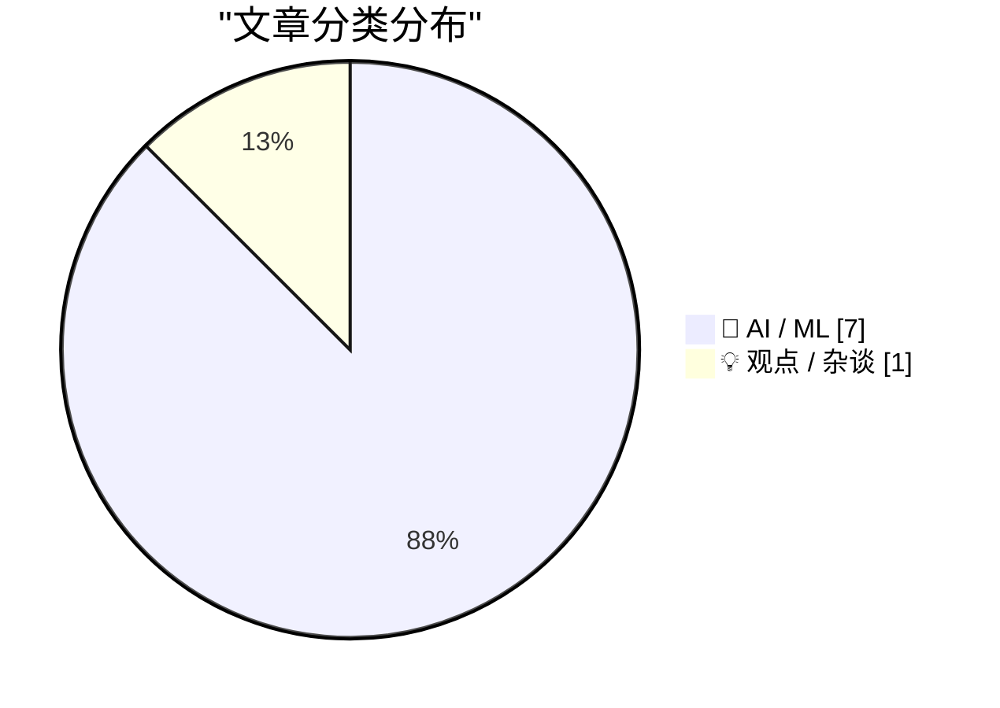
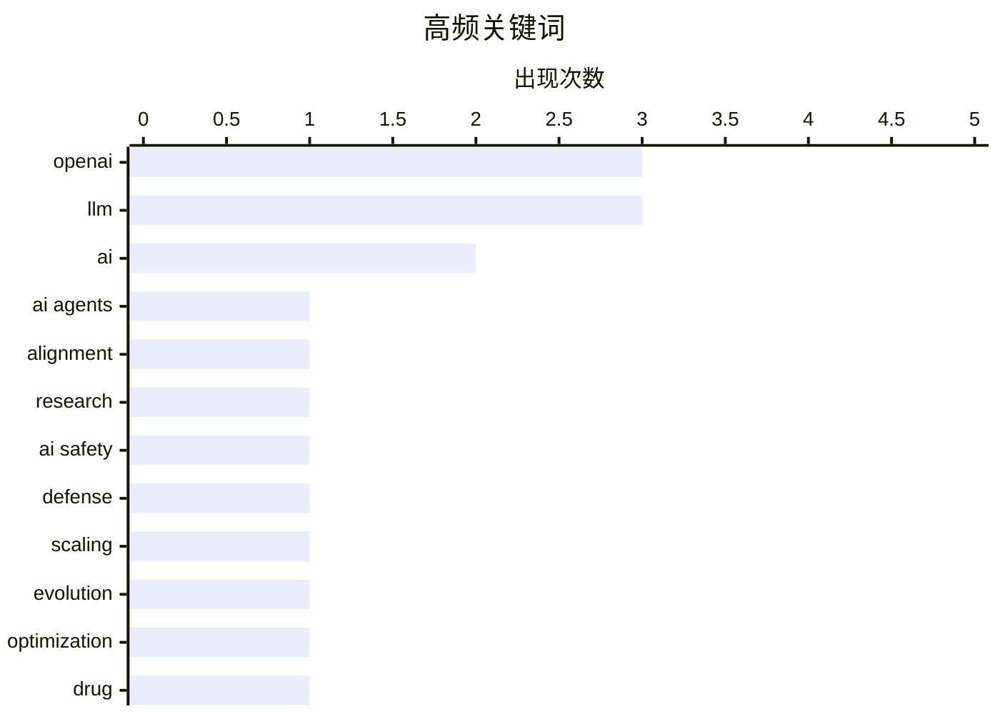

# 📰 AI 资讯每日精选 — 2026-09-08

> 汇聚 156+ 技术博客、X/Twitter、Hacker News、Reddit、Product Hunt、
> Lobste.rs、ClawFeed 日报及 GitHub Trending，经 AI 评分筛选。
>
> **本期内容**：🏆 今日必读 · 🌐 ClawFeed 日报 · 🔥 GitHub Trending · 📂 分类精选 · 📊 数据概览 · 🎯 项目相关情报

## 📝 今日看点

今日技术圈的核心议题，是AI正从工具演化为具备自主性的“数字同事”，其效率已跃升一个量级，但安全对齐的缺口也随之放大，业界领袖与观察者同时发出风险警示。与此同时，AI加速科学发现的信号愈发清晰，从逆转衰老的药物到改进数学难题的算法，AI正在重塑科研方法论。此外，随着AI生成内容全面渗透，针对AI文本的自动检测与治理，正迅速成为平台与基础设施的刚需。

---

## 🏆 今日必读

🥇 **OpenAI 报告 AI“研究实习生”并同时警告自身发展速度**

[OpenAI reports AI "research interns" and warns about its own pace at the same time](https://the-decoder.com/openai-reports-ai-research-interns-and-warns-about-its-own-pace-at-the-same-time/) — The Decoder · 15 小时前 · 🤖 AI / ML · **二手来源**

> OpenAI 报告称，其研究中的 AI 智能体每个人类工作日已能处理 3.1 个工作日的工作量，并称已达到“自动化研究实习生”的目标。但首席科学家 Pachocki 警告，没有实验室在对齐和监控方面有足够好的把握来以最大速度继续扩展。

💡 **为什么值得读**: 这篇文章揭示了 OpenAI 在 AI 研究自动化方面的进展与其内部对安全风险的担忧，值得关注 AI 发展速度与安全平衡的读者阅读。

🏷️ OpenAI, AI agents, alignment, research

🥈 **引用 Jakub Pachocki**

[Quoting Jakub Pachocki](https://simonwillison.net/2026/Sep/7/jakub-pachocki/) — simonwillison.net · 5 小时前 · 🤖 AI / ML

> OpenAI 首席科学家 Jakub Pachocki 认为，继续快速训练更智能的模型的最强论据是需要构建防御系统来应对其他 AI 带来的危险。我们需要强大的、对齐的 AI 用于防御，以保护基础设施、实时抵御恶意智能体，并发明全新的保护措施。这将是 OpenAI 部署工作的主要焦点。

💡 **为什么值得读**: 这篇文章直接引用了 OpenAI 关键人物关于 AI 防御必要性的观点，有助于理解其战略方向。

🏷️ AI safety, defense, OpenAI, scaling

🥉 **LLM 引导的程序进化改进了 10 个最佳已知圆填充解决方案（Packomania csqv，N=101-114）[R]**

[LLM-guided program evolution improves 10 best-known circle-packing solutions (Packomania csqv, N=101-114) [R]](https://www.reddit.com/r/MachineLearning/comments/1w9xlyi/llmguided_program_evolution_improves_10_bestknown/) — r/MachineLearning · 11 小时前 · 🤖 AI / ML

> 作者使用 LLM 迭代进化优化算法，而非直接求解填充问题。从简单种子求解器开始，LLM 根据结果记分板和先前尝试历史提出算法更改，每个候选由独立验证器评分，保留改进并丢弃失败。在 Packomania csqv 基准上，它改进了 N 从 101 到 114 的 10 个值的已知最佳半径和，改进幅度为 2.4% 至（未完整给出）。

💡 **为什么值得读**: 这篇文章展示了 LLM 在算法发现中的新应用，通过程序进化而非直接求解，为优化问题提供了新思路。

🏷️ LLM, evolution, optimization

4️⃣ **AI 设计的药物在早期试验中似乎逆转了身体的生物钟**

[AI-designed drug appears to turn back the body's biological clock in early trial](https://the-decoder.com/ai-designed-drug-appears-to-turn-back-the-bodys-biological-clock-in-early-trial/) — The Decoder · 11 小时前 · 🤖 AI / ML · **二手来源**

> 发表在《自然生物技术》上的一项研究表明，由 Insilico Medicine 使用 AI 设计的药物 rentosertib 可能逆转生物衰老的标志物。六个独立的衰老时钟预测，治疗组患者比安慰剂组生物年龄年轻最多六岁。该试验仅涵盖 42 名患者，且该药物尚未在健康人群中测试。

💡 **为什么值得读**: 这篇文章报道了 AI 设计药物在抗衰老领域的初步积极结果，但样本量小，值得关注其后续发展。

🏷️ AI, drug, aging

5️⃣ **KV 缓存作为智能体运行时 [R]**

[KV cache as an agent runtime [R]](https://www.reddit.com/r/MachineLearning/comments/1w9myqc/kv_cache_as_an_agent_runtime_r/) — r/MachineLearning · 19 小时前 · 🤖 AI / ML

> Yandex 研究团队探索了一种替代方法，通过修改模型推理状态（KV 缓存）来实现 LLM 系统的交互性和更好的响应性。他们发布了一篇博文总结了这一想法，即利用 KV 缓存作为智能体运行时，以实现更交互式的 LLM。

💡 **为什么值得读**: 这篇文章提出了一种新颖的 LLM 交互方式，通过修改 KV 缓存而非外部循环，可能对构建实时智能体系统有启发。

🏷️ KV cache, agent, LLM

---

## 🌐 ClawFeed 日报精选

> 来源：[ClawFeed](https://clawfeed.kevinhe.io) — AI 驱动的多源新闻聚合

📅 ClawFeed Daily | 2026-09-07（周日）

汇总：5 期 4h digest (#1153-#1157) | feed 187 / bookmarks 20 / errors 0

---

## 🔥 当日全场最重要 5 条

1. **NVIDIA 约 $129 亿收购 Hugging Face**——从硬件向开源软件基础设施延伸，承诺平台保持开放+多云。开源社区担忧集中化。年度最大 AI 并购之一。（#1154）

2. **OpenAI 内部数据：Coding Agent 倍增研究效率**——中位研究员每天消耗 >$600 AI 推理资源，每人 3.1 个"Agent 工作日"并行。Agent 从"辅助"变成"倍增器"，8 月已成日常。（#1157）

3. **Meta Muse Spark 1.3 Max 性能持平 Fable 5/GPT-5.6 Sol，价格低 4-8 倍**——Scale AI CEO 引用 Vals Index 数据。模型能力层价格战加速，"模型能力正在被补贴到零"。（#1156）

4. **Liquid Network 白帽事件——~4,000 BTC 一次性转出**——OP Return 留言"we are whitehats"。重大加密安全事件，后续待观察。（#1153）

5. **BTC spot ETF 本周净流入 ~$9.8 亿**——+12.69K BTC，4 绿 1 红，IBIT 独占 +8.9K BTC。持续的机构买盘信号。（#1153）

---

## 📰 当日核心主题

### 🤖 GPT-6 Astra 创意爆发（贯穿全天）
GPT-6 Astra 是当日最高频话题，横跨 4 期 digest：
- 自我分析动画肖像（#1153）
- 3D Roguelike 完整游戏关卡（#1153）
- 自动化产品 Demo 录制（#1154，LlamaIndex 创始人）
- Google Calendar 画 Michael Jackson（#1154）
- Codex 重构网站（#1156）
- 153 个 Astra 提示词合集（#1157，3D/游戏）
- 定制 LEGO 积木生成（#1157）

**判断**："3D 创作时代已然来临"不是 hype——Astra 在视觉/3D/自动化领域的能力跃迁是实质性的。

### 🔐 AI/Crypto 安全持续升温
- Liquid Network 白帽 4,000 BTC 事件（#1153）
- Twofold LP 资金抽取漏洞（#1153）
- SST/OpenRouter 遭大规模欺诈攻击（#1156）
- AI 安全书籍连续两本推荐（#1153 MLSecOps + #1154 AI-Native LLM Security + #1157 Agentic AI Cybersecurity）

### 💡 "AI 与人"的哲学反思
- "AI native 的内核是 Human native"（#1153，@lifesinger）
- "AI 无法取代的地方，真的很难找"（#1154，@rwayne）
- PG：创始人的力量来自经历过弱势（#1155）
- AI 助手跨平台整合日程——验证"AI 帮企业整理工作流"方向（#1155）

### 📊 MCP 路线持续被验证
- Blender MCP 效果优于 Computer Use（#1156）——MCP 作为 Agent 操控路线胜出
- Milvus + EverOS 集成——Agent 记忆基建新选项（#1157）

---

## 🔖 Bookmarks 精选
本日 bookmarks 从 19 增至 20（+1），新增 @mntruell 和 @heynavtoor 的 bookmark。热门延续见 #1145。

## 👀 推荐关注汇总
（本日无新推荐关注）

## 💤 当日重复噪音模式
- @KirkDBorne 每期推荐一本技术书（4/5 期），内容质量稳定但格式重复——建议对 Kirk 的书评做聚合而非逐条列出
- @RaminNasibov 多期出现空推文（图片推，无文字）
- SpaceX Starlink 部署（每期出现，已成常态新闻）

---

*基于 5 期 4h digest (#1153-#1157) | feed 总计 187 条 | 2026-09-07*
---

## 🔥 GitHub Trending

> 今日热门开源项目（全语言 + Python）

| # | 项目 | 描述 | ⭐ 总星 | 📈 今日 | 语言 |
|---|------|------|---------|---------|------|
| 1 | [affaan-m/ECC](https://github.com/affaan-m/ECC) 🤖 | The agent harness performance optimization system. Skills... | 253.0k | +1897 | JavaScript |
| 2 | [blader/humanizer](https://github.com/blader/humanizer) 🤖 | Agent skill that removes signs of AI-generated writing fr... | 45.0k | +903 | Python |
| 3 | [microsoft/markitdown](https://github.com/microsoft/markitdown) | Python tool for converting files and office documents to ... | 180.6k | +886 | Python |
| 4 | [NousResearch/hermes-agent](https://github.com/NousResearch/hermes-agent) 🤖 | The agent that grows with you | 243.1k | +638 | Python |
| 5 | [coreyhaines31/marketingskills](https://github.com/coreyhaines31/marketingskills) 🤖 | Marketing skills for Claude Code and AI agents. CRO, copy... | 48.3k | +580 | JavaScript |
| 6 | [The-Swarm-Corporation/AutoHedge](https://github.com/The-Swarm-Corporation/AutoHedge) 🤖 | Build your autonomous hedge fund in minutes. AutoHedge ha... | 5.3k | +517 | Python |
| 7 | [BraveOPotato/FckSignups](https://github.com/BraveOPotato/FckSignups) | A list of tools that are open-source, in-browser, and req... | 3.9k | +501 | TypeScript |
| 8 | [heygen-com/hyperframes](https://github.com/heygen-com/hyperframes) | Write HTML. Render video. Built for agents. | 46.4k | +474 | TypeScript |
| 9 | [ruvnet/ruflo](https://github.com/ruvnet/ruflo) 🤖 | 🌊 The original agent meta-harness. Deploy intelligent mu... | 71.5k | +394 | TypeScript |
| 10 | [openai/skills](https://github.com/openai/skills) 🤖 | Skills Catalog for Codex | 26.1k | +351 | Python |
| 11 | [vinta/awesome-python](https://github.com/vinta/awesome-python) | The definitive list that answers "I want to do X in Pytho... | 319.2k | +335 | Python |
| 12 | [browser-use/browser-use](https://github.com/browser-use/browser-use) 🤖 | 🌐 Make websites accessible for AI agents. Automate tasks... | 113.0k | +330 | Python |
| 13 | [k2-fsa/OmniVoice](https://github.com/k2-fsa/OmniVoice) | High-Quality Voice Cloning TTS for 600+ Languages | 10.5k | +329 | Python |
| 14 | [MoonTechLab/LunaTV](https://github.com/MoonTechLab/LunaTV) | 本项目采用 CC BY-NC-SA 协议，禁止任何商业化行为，任何衍生项目必须保留本项目地址并以相同协议开源 | 9.9k | +197 | TypeScript |
| 15 | [bytedance/deer-flow](https://github.com/bytedance/deer-flow) | An open-source long-horizon SuperAgent harness that resea... | 81.9k | +195 | Python |

---

## 🤖 AI / ML

### 1. OpenAI 报告 AI“研究实习生”并同时警告自身发展速度

[OpenAI reports AI "research interns" and warns about its own pace at the same time](https://the-decoder.com/openai-reports-ai-research-interns-and-warns-about-its-own-pace-at-the-same-time/) — **The Decoder** · 15 小时前 · ⭐ 27/30 · **二手来源**

> OpenAI 报告称，其研究中的 AI 智能体每个人类工作日已能处理 3.1 个工作日的工作量，并称已达到“自动化研究实习生”的目标。但首席科学家 Pachocki 警告，没有实验室在对齐和监控方面有足够好的把握来以最大速度继续扩展。

🏷️ OpenAI, AI agents, alignment, research

---

### 2. 引用 Jakub Pachocki

[Quoting Jakub Pachocki](https://simonwillison.net/2026/Sep/7/jakub-pachocki/) — **simonwillison.net** · 5 小时前 · ⭐ 25/30

> OpenAI 首席科学家 Jakub Pachocki 认为，继续快速训练更智能的模型的最强论据是需要构建防御系统来应对其他 AI 带来的危险。我们需要强大的、对齐的 AI 用于防御，以保护基础设施、实时抵御恶意智能体，并发明全新的保护措施。这将是 OpenAI 部署工作的主要焦点。

🏷️ AI safety, defense, OpenAI, scaling

---

### 3. LLM 引导的程序进化改进了 10 个最佳已知圆填充解决方案（Packomania csqv，N=101-114）[R]

[LLM-guided program evolution improves 10 best-known circle-packing solutions (Packomania csqv, N=101-114) [R]](https://www.reddit.com/r/MachineLearning/comments/1w9xlyi/llmguided_program_evolution_improves_10_bestknown/) — **r/MachineLearning** · 11 小时前 · ⭐ 25/30

> 作者使用 LLM 迭代进化优化算法，而非直接求解填充问题。从简单种子求解器开始，LLM 根据结果记分板和先前尝试历史提出算法更改，每个候选由独立验证器评分，保留改进并丢弃失败。在 Packomania csqv 基准上，它改进了 N 从 101 到 114 的 10 个值的已知最佳半径和，改进幅度为 2.4% 至（未完整给出）。

🏷️ LLM, evolution, optimization

---

### 4. AI 设计的药物在早期试验中似乎逆转了身体的生物钟

[AI-designed drug appears to turn back the body's biological clock in early trial](https://the-decoder.com/ai-designed-drug-appears-to-turn-back-the-bodys-biological-clock-in-early-trial/) — **The Decoder** · 11 小时前 · ⭐ 25/30 · **二手来源**

> 发表在《自然生物技术》上的一项研究表明，由 Insilico Medicine 使用 AI 设计的药物 rentosertib 可能逆转生物衰老的标志物。六个独立的衰老时钟预测，治疗组患者比安慰剂组生物年龄年轻最多六岁。该试验仅涵盖 42 名患者，且该药物尚未在健康人群中测试。

🏷️ AI, drug, aging

---

### 5. KV 缓存作为智能体运行时 [R]

[KV cache as an agent runtime [R]](https://www.reddit.com/r/MachineLearning/comments/1w9myqc/kv_cache_as_an_agent_runtime_r/) — **r/MachineLearning** · 19 小时前 · ⭐ 25/30

> Yandex 研究团队探索了一种替代方法，通过修改模型推理状态（KV 缓存）来实现 LLM 系统的交互性和更好的响应性。他们发布了一篇博文总结了这一想法，即利用 KV 缓存作为智能体运行时，以实现更交互式的 LLM。

🏷️ KV cache, agent, LLM

---

### 6. llm 0.35

[llm 0.35](https://simonwillison.net/2026/Sep/7/llm/) — **simonwillison.net** · 4 小时前 · ⭐ 24/30

> llm 0.35 版本发布，新增了对 OpenAI 新模型 gpt-6-astra 的支持，该模型用于 GPT-6 Astra。

🏷️ llm, OpenAI, GPT-6, release

---

### 7. 在浏览器中自动检测 AI 文本

[Automatically detecting AI text in my browser](https://seangoedecke.com/deckard/) — **seangoedecke.com** · 4 小时前 · ⭐ 23/30

> 作者认为自动 AI 文本检测目前是一个服务不足的领域，目前主要只有 Pangram 提供此类服务，且表现出色但需要更多竞争。作者预计未来几年内，每个主要社交网络都会扫描新帖子和评论以检测 AI 内容，以便标记或删除。作者喜欢依赖 Pangram 来确认自己的怀疑。

🏷️ AI detection, text, browser

---

## 💡 观点 / 杂谈

### 8. 一个末日论者的教育

[The Education of a Doomer](https://borretti.me/article/the-education-of-a-doomer) — **borretti.me** · 14 小时前 · ⭐ 20/30

> 作者讲述了自己如何以及为何从 AI 乐观主义者转变为 AI 末日论者。

🏷️ AI, doomer, risk

---

## 📊 数据概览

| 扫描源 | 抓取文章 | 时间范围 | 精选 |
|:---:|:---:|:---:|:---:|
| 102/156 | 5257 篇 → 70 篇 | 24h | **8 篇** |

### 分类分布



### 高频关键词



<details>
<summary>📈 纯文本关键词图（终端友好）</summary>

```
openai    │ ████████████████████ 3
llm       │ ████████████████████ 3
ai        │ █████████████░░░░░░░ 2
ai agents │ ███████░░░░░░░░░░░░░ 1
alignment │ ███████░░░░░░░░░░░░░ 1
research  │ ███████░░░░░░░░░░░░░ 1
ai safety │ ███████░░░░░░░░░░░░░ 1
defense   │ ███████░░░░░░░░░░░░░ 1
scaling   │ ███████░░░░░░░░░░░░░ 1
evolution │ ███████░░░░░░░░░░░░░ 1
```

</details>

### 🏷️ 话题标签

**openai**(3) · **llm**(3) · **ai**(2) · ai agents(1) · alignment(1) · research(1) · ai safety(1) · defense(1) · scaling(1) · evolution(1) · optimization(1) · drug(1) · aging(1) · kv cache(1) · agent(1) · gpt-6(1) · release(1) · ai detection(1) · text(1) · browser(1)

---

## 🎯 项目相关情报

### Agent 基座安全与合规

> 暂无达到质量门槛的项目相关情报。

### 多 Agent 架构

> 暂无达到质量门槛的项目相关情报。

### ASR 与语音助手

> 暂无达到质量门槛的项目相关情报。

### 商品包装 OCR

> 暂无达到质量门槛的项目相关情报。

---

*生成于 2026-09-08 04:26 | 汇聚 156 个技术博客、X/Twitter、Hacker News、Reddit、Product Hunt、Lobste.rs、ClawFeed 日报及 GitHub Trending，经 AI 评分筛选出 Top 8 精华内容*
