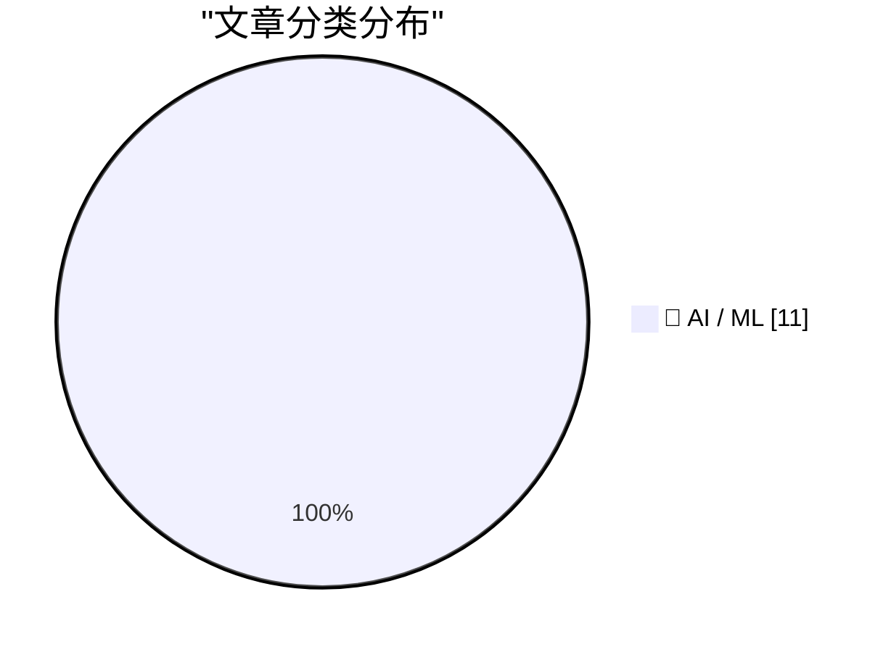
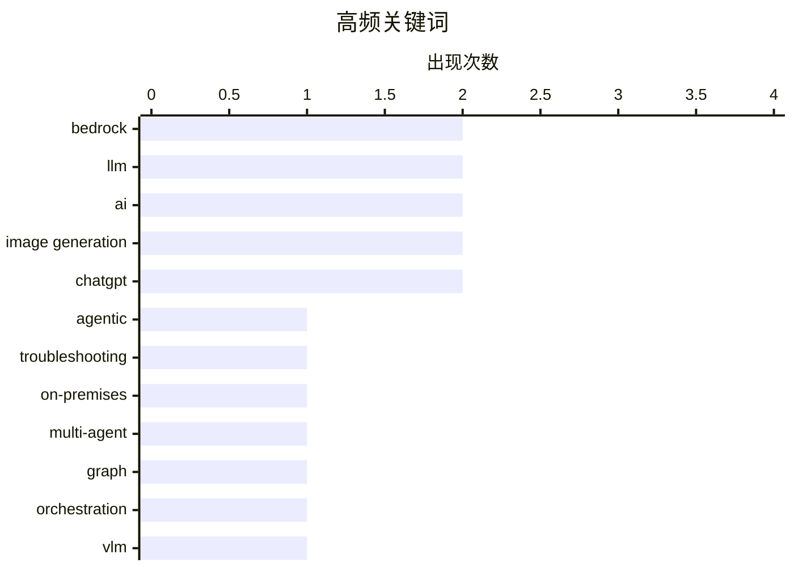

# 📰 AI 资讯每日精选 — 2026-09-09

> 汇聚 156+ 技术博客、X/Twitter、Hacker News、Reddit、Product Hunt、
> Lobste.rs、ClawFeed 日报及 GitHub Trending，经 AI 评分筛选。
>
> **本期内容**：🏆 今日必读 · 🌐 ClawFeed 日报 · 🔥 GitHub Trending · 📂 分类精选 · 📊 数据概览 · 🎯 项目相关情报 · 🌍 补充视角

## 📝 今日看点

今日技术圈聚焦于AI基础设施的工程化落地与智能体协作范式的演进，多家厂商围绕Amazon Bedrock、SageMaker等平台强化推理性能与自动化评估能力。多智能体系统正从静态拓扑转向任务条件化的动态图编排，并加速渗透至故障排查、个性化代理等真实场景。同时，资本与开源路线激烈碰撞，Mistral的30亿欧元巨额融资和OpenAI对千禧年难题的AI证明尝试，凸显出行业在追求模型能力边界的同时，正激烈争夺技术主权与可信度话语权。

---

## 🏆 今日必读

🥇 **HPE Zerto 如何利用 Amazon Bedrock 构建智能故障排查系统**

[How HPE Zerto built an agentic troubleshooting system with Amazon Bedrock](https://aws.amazon.com/blogs/machine-learning/how-hpe-zerto-built-an-agentic-troubleshooting-system-with-amazon-bedrock/) — AWS Machine Learning Blog · 12 小时前 · 🤖 AI / ML · **一手来源**

> HPE Zerto 构建了一个由 Amazon Bedrock 驱动的智能故障排查系统，该系统在客户环境内部本地运行。文章描述了多智能体架构、基于 Strands Agents 的本地部署模型，以及在实时灾难恢复数据中为智能体提供依据所面临的工程挑战。该系统旨在通过智能体协作自动诊断和解决灾难恢复相关问题。文章强调了在本地环境中部署 AI 智能体的可行性和优势。

💡 **为什么值得读**: 对于希望了解如何在本地环境中利用 Bedrock 构建多智能体系统的架构师和工程师，本文提供了宝贵的实战经验和架构参考。

🏷️ agentic, Bedrock, troubleshooting, on-premises

🥈 **多智能体 LLM 工作流的推理时图工程**

[Inference-Time Graph Engineering for Multi-Agent LLM Workflows](https://arxiv.org/abs/2609.05774) — arXiv Artificial Intelligence · 34 分钟前 · 🤖 AI / ML · **一手来源**

> 近期多智能体 LLM 系统越来越依赖图结构通信来协调专业智能体。本文从图工程的角度重新审视多智能体编排：不是优化静态拓扑，而是综合一个任务条件化的时间工作流图，该图同时指定智能体连接和边缘级通信语义。作者引入了 ReActNet，一个无需训练的框架，它将查询和一组智能体编译成动态工作流图。该方法旨在提高多智能体系统的灵活性和效率。

💡 **为什么值得读**: 本文提出了一种新颖的多智能体编排方法，通过动态图生成替代静态拓扑，为设计更灵活、高效的 LLM 系统提供了新思路。

🏷️ multi-agent, LLM, graph, orchestration

🥉 **阅读还是猜测？视觉语言模型在古希腊文版本 OCR 中的视觉基础失败**

[Reading or Guessing? Visual Grounding Failures of Vision-Language Models for OCR in Ancient Greek Editions](https://arxiv.org/abs/2605.27750) — arXiv Artificial Intelligence · 34 分钟前 · 🤖 AI / ML · **一手来源**

> 最近的研究表明，用于光学字符识别（OCR）的视觉语言模型（VLM）可能生成看似合理但视觉上无根据的文本，表明其依赖语言先验。在低资源古希腊文校勘本上比较开放权重 VLM 与传统 OCR 基线，作者发现 VLM 错误即使错误也往往保持流畅，产生看似合理的希腊语替换，而传统引擎则产生局部错误。这表明 VLM 可能依赖语言模型猜测而非实际视觉信息。

💡 **为什么值得读**: 该研究揭示了 VLM 在 OCR 任务中的潜在缺陷，对于依赖 VLM 进行文本数字化的领域具有警示意义，并强调了视觉基础的重要性。

🏷️ VLM, OCR, visual grounding, ancient Greek

4️⃣ **Mistral 融资30亿欧元，推动主权开放权重AI走向前沿**

[Mistral raises €3B](https://mistral.ai/news/mistral-makes-sovereign-open-weight-ai-to-frontier/) — Hacker News Best · 23 小时前 · 🤖 AI / ML

> Mistral AI 宣布完成30亿欧元融资，旨在将主权开放权重AI推向技术前沿。该公司称，这笔资金将用于扩大其AI模型的开源开放权重策略，并加强欧洲在AI领域的自主性。Mistral 强调其模型在性能上可与专有模型竞争，同时保持开放性和可定制性。此次融资是欧洲AI领域最大的一轮之一，反映了投资者对开放权重AI商业潜力的信心。Mistral 计划利用新资金加速研发，并拓展全球市场。

💡 **为什么值得读**: 了解欧洲AI独角兽如何通过巨额融资推动开放权重AI的规模化发展，对关注AI开源生态和欧洲科技自主的读者具有重要参考价值。

🏷️ Mistral, funding, open-weight, AI

5️⃣ **Pathway 在 Amazon SageMaker HyperPod 上的类脑架构开发**

[Pathway’s brain-inspired architecture development on Amazon SageMaker HyperPod](https://aws.amazon.com/blogs/machine-learning/pathways-brain-inspired-architecture-development-on-amazon-sagemaker-hyperpod/) — AWS Machine Learning Blog · 9 小时前 · 🤖 AI / ML · **一手来源**

> Pathway 的 Baby Dragon Hatchling (BDH) 是一种受大脑启发的后 Transformer 架构，它在潜在空间中推理，而不是生成思维链 token。文章展示了 Pathway 如何在 Amazon SageMaker HyperPod 上开发和扩展 BDH，以及 BDH-CQ 如何在 ARC-AGI-1 基准上创下新的成本效益记录。该架构旨在提高推理效率并降低成本。

💡 **为什么值得读**: 对于关注 AI 架构创新和成本优化的研究人员，本文提供了一个在 SageMaker HyperPod 上开发类脑架构的实例，并展示了其在基准测试中的成本效益优势。

🏷️ brain-inspired, architecture, SageMaker HyperPod, ARC-AGI

---

## 🌐 ClawFeed 日报精选

> 来源：[ClawFeed](https://clawfeed.kevinhe.io) — AI 驱动的多源新闻聚合

📅 ClawFeed Daily | 2026-09-08（周一）

汇总：5 期 4h digest (#1160-#1164) | feed 163 / bookmarks 20 / errors 0

---

## 🔥 当日全场最重要 5 条

1. **OpenAI 首席科学家 Pachocki 呼吁暂停扩展**——"没有任何 AI 实验室把 alignment 和 monitoring 做得足够好来全速扩展"，继早前 state of AI 长文后进一步明确立场。同日 Jakub 另一篇文章写道"we need to make choices to keep the future open"。AI 安全议题从学术圈升级到实验室核心管理层的公开表态。(#1164/#1161)

2. **Claude Code 系统提示词精简 80%**——Anthropic 官方分享最新模型下 system prompt / skills / CLAUDE.md 写法经验，"少即是多"。对我们自身 Agent 配置和 skill 设计直接相关——验证了 thinking-patterns 和 skill 精简的方向。(#1160/#1161)

3. **Cloudflare @cloudflare/computer**——给每个 AI Agent 配一台云端虚拟电脑（文件系统+多执行环境），Agent 自行决定命令派到哪个环境执行，毫秒级启动。Agent infra 层的新基建，标志着云厂商开始为 Agent 原生场景重建基础设施。(#1160/#1161)

4. **DeepSeek 大规模社招 150 HC**——Harness 团队技术骨干 Tianyi Cui 发文，"前所未有"的招聘规模，侧面印证 DeepSeek 在加速基建扩张。(#1162)

5. **3D Euler 方程发现稳定奇点**——anima-ai.org 宣布 "stable singularity on 3D Euler"，Euler 方程的 blow-up 问题是千禧年级别的开放问题之一，若成立将是数学/流体力学重大突破。(#1163)

---

## 📰 当日核心主题

**1. GPT-6 Astra 生态反应**
全天多条讨论围绕 Astra 展开：被称为"most AGI-like model"(#1161)；有人建议用它系统性学习商业/哲学而非只做开发(#1161)；Ram Ahluwalia 降温"not AGI yet"(#1164)；Fable 在 HR 场景表达优于 Astra(#1164)。市场对 Astra 的定位仍在摇摆。

**2. AI Agent 基础设施成熟化**
Cloudflare @cloudflare/computer(#1160)、Claude Code 系统提示词精简(#1160)、Matrix Agent 公司架构(#1161)、wanman.ai 开源一人公司框架(#1161)——Agent 从概念验证走向生产级基础设施的信号密集。

**3. AI 安全 + 实验室治理**
Pachocki 呼吁暂停扩展(#1164)、Jakub 长文论 AI 安全(#1161)、AI 实验室合作呼声(#1163)——安全议题正从边缘上升到行业核心议程。

**4. 对话式 vs GUI 界面之争**
"主要工作界面是 Telegram"的真实体感(#1162) vs "AI 释放了程序员，也说明了产品经理为什么存在"(#1164) vs Agentic commerce 先替代软件采购(#1162)——Agent 的交互范式尚未收敛。

**5. 中国互联网 + AI 动态**
野村证券研报：抖音月均使用时长首超微信(#1162)；百度 AI 云+昆仑芯片双引擎(#1162)；高德扫雷榜(#1163)；DeepSeek 150 HC(#1162)。

---

## 🔖 Bookmarks 精选（本日累计）

本日 bookmarks 20 条，全天无变化。精选：
- AI 市场渗透率 <1%（$6T+ knowledge worker 市场）
- AI Engineering 技能图谱
- 36 篇经典 AI 论文合集（谢青池精选）
- Claude Code 系统提示词精简 80% 经验
- Cloudflare @cloudflare/computer
- Matrix Agent 公司架构
- wanman.ai 开源一人公司框架
- GPT-Realtime-2 实时翻译

---

## 💤 当日重复噪音模式

- **Crypto 推广/Shill**：Binance earn、BNB Stonks Szn、token 回购数据、云挖矿指南——高频低信噪比，贯穿全天
- **政治争论**："far right" 定义辩论在多个时段反复出现（#1161/#1163/#1164），与 AI/tech 无关
- **Meme/低质内容**：gm tweets、rate my skills、forced marketplace blues 等零信息量内容

---

#daily-2026-09-08 · 5 期 4h (#1160-#1164) · feed 163 / bookmarks 20 / errors 0---

## 🔥 GitHub Trending

> 今日热门开源项目（全语言 + Python）

| # | 项目 | 描述 | ⭐ 总星 | 📈 今日 | 语言 |
|---|------|------|---------|---------|------|
| 1 | [heygen-com/hyperframes](https://github.com/heygen-com/hyperframes) | Write HTML. Render video. Built for agents. | 47.9k | +2627 | TypeScript |
| 2 | [microsoft/markitdown](https://github.com/microsoft/markitdown) | Python tool for converting files and office documents to ... | 181.8k | +2047 | Python |
| 3 | [affaan-m/ECC](https://github.com/affaan-m/ECC) 🤖 | The agent harness performance optimization system. Skills... | 254.4k | +1427 | JavaScript |
| 4 | [jo-inc/camofox-browser](https://github.com/jo-inc/camofox-browser) 🤖 | Stealth headless browser for AI agents — bypass Cloudflar... | 10.6k | +871 | JavaScript |
| 5 | [cathrynlavery/diagram-design](https://github.com/cathrynlavery/diagram-design) 🤖 | 38 editorial diagram types for Claude Code, Codex, and Pi... | 35.2k | +710 | HTML |
| 6 | [coreyhaines31/marketingskills](https://github.com/coreyhaines31/marketingskills) 🤖 | Marketing skills for Claude Code and AI agents. CRO, copy... | 48.9k | +666 | JavaScript |
| 7 | [ayghri/i-have-adhd](https://github.com/ayghri/i-have-adhd) 🤖 | A skill to stop your coding agent from burying the answer... | 31.2k | +656 | Python |
| 8 | [mksglu/context-mode](https://github.com/mksglu/context-mode) 🤖 | Context window optimization for AI coding agents. Sandbox... | 21.5k | +651 | TypeScript |
| 9 | [experientiallabs/experiential](https://github.com/experientiallabs/experiential) | Experiential is the open source, zero markup gateway for ... | 3.2k | +544 | Python |
| 10 | [TauricResearch/TradingAgents](https://github.com/TauricResearch/TradingAgents) 🤖 | TradingAgents: Multi-Agents LLM Financial Trading Framework | 103.5k | +506 | Python |
| 11 | [MoonTechLab/LunaTV](https://github.com/MoonTechLab/LunaTV) | 本项目采用 CC BY-NC-SA 协议，禁止任何商业化行为，任何衍生项目必须保留本项目地址并以相同协议开源 | 10.3k | +505 | TypeScript |
| 12 | [The-Swarm-Corporation/AutoHedge](https://github.com/The-Swarm-Corporation/AutoHedge) 🤖 | Build your autonomous hedge fund in minutes. AutoHedge ha... | 5.8k | +494 | Python |
| 13 | [openai/skills](https://github.com/openai/skills) 🤖 | Skills Catalog for Codex | 26.6k | +490 | Python |
| 14 | [obra/superpowers](https://github.com/obra/superpowers) | An agentic skills framework & software development method... | 283.5k | +452 | Shell |
| 15 | [rohitg00/ai-engineering-from-scratch](https://github.com/rohitg00/ai-engineering-from-scratch) 🤖 | Learn it. Build it. Ship it for others. | 53.2k | +356 | Python |

---

## 🤖 AI / ML

### 1. HPE Zerto 如何利用 Amazon Bedrock 构建智能故障排查系统

[How HPE Zerto built an agentic troubleshooting system with Amazon Bedrock](https://aws.amazon.com/blogs/machine-learning/how-hpe-zerto-built-an-agentic-troubleshooting-system-with-amazon-bedrock/) — **AWS Machine Learning Blog** · 12 小时前 · ⭐ 23/30 · **一手来源**

> HPE Zerto 构建了一个由 Amazon Bedrock 驱动的智能故障排查系统，该系统在客户环境内部本地运行。文章描述了多智能体架构、基于 Strands Agents 的本地部署模型，以及在实时灾难恢复数据中为智能体提供依据所面临的工程挑战。该系统旨在通过智能体协作自动诊断和解决灾难恢复相关问题。文章强调了在本地环境中部署 AI 智能体的可行性和优势。

🏷️ agentic, Bedrock, troubleshooting, on-premises

---

### 2. 多智能体 LLM 工作流的推理时图工程

[Inference-Time Graph Engineering for Multi-Agent LLM Workflows](https://arxiv.org/abs/2609.05774) — **arXiv Artificial Intelligence** · 34 分钟前 · ⭐ 22/30 · **一手来源**

> 近期多智能体 LLM 系统越来越依赖图结构通信来协调专业智能体。本文从图工程的角度重新审视多智能体编排：不是优化静态拓扑，而是综合一个任务条件化的时间工作流图，该图同时指定智能体连接和边缘级通信语义。作者引入了 ReActNet，一个无需训练的框架，它将查询和一组智能体编译成动态工作流图。该方法旨在提高多智能体系统的灵活性和效率。

🏷️ multi-agent, LLM, graph, orchestration

---

### 3. 阅读还是猜测？视觉语言模型在古希腊文版本 OCR 中的视觉基础失败

[Reading or Guessing? Visual Grounding Failures of Vision-Language Models for OCR in Ancient Greek Editions](https://arxiv.org/abs/2605.27750) — **arXiv Artificial Intelligence** · 34 分钟前 · ⭐ 22/30 · **一手来源**

> 最近的研究表明，用于光学字符识别（OCR）的视觉语言模型（VLM）可能生成看似合理但视觉上无根据的文本，表明其依赖语言先验。在低资源古希腊文校勘本上比较开放权重 VLM 与传统 OCR 基线，作者发现 VLM 错误即使错误也往往保持流畅，产生看似合理的希腊语替换，而传统引擎则产生局部错误。这表明 VLM 可能依赖语言模型猜测而非实际视觉信息。

🏷️ VLM, OCR, visual grounding, ancient Greek

---

### 4. Mistral 融资30亿欧元，推动主权开放权重AI走向前沿

[Mistral raises €3B](https://mistral.ai/news/mistral-makes-sovereign-open-weight-ai-to-frontier/) — **Hacker News Best** · 23 小时前 · ⭐ 28/30

> Mistral AI 宣布完成30亿欧元融资，旨在将主权开放权重AI推向技术前沿。该公司称，这笔资金将用于扩大其AI模型的开源开放权重策略，并加强欧洲在AI领域的自主性。Mistral 强调其模型在性能上可与专有模型竞争，同时保持开放性和可定制性。此次融资是欧洲AI领域最大的一轮之一，反映了投资者对开放权重AI商业潜力的信心。Mistral 计划利用新资金加速研发，并拓展全球市场。

🏷️ Mistral, funding, open-weight, AI

---

### 5. Pathway 在 Amazon SageMaker HyperPod 上的类脑架构开发

[Pathway’s brain-inspired architecture development on Amazon SageMaker HyperPod](https://aws.amazon.com/blogs/machine-learning/pathways-brain-inspired-architecture-development-on-amazon-sagemaker-hyperpod/) — **AWS Machine Learning Blog** · 9 小时前 · ⭐ 25/30 · **一手来源**

> Pathway 的 Baby Dragon Hatchling (BDH) 是一种受大脑启发的后 Transformer 架构，它在潜在空间中推理，而不是生成思维链 token。文章展示了 Pathway 如何在 Amazon SageMaker HyperPod 上开发和扩展 BDH，以及 BDH-CQ 如何在 ARC-AGI-1 基准上创下新的成本效益记录。该架构旨在提高推理效率并降低成本。

🏷️ brain-inspired, architecture, SageMaker HyperPod, ARC-AGI

---

### 6. 在 SageMaker AI 上对小型 LLM 推理进行基准测试：G7 与 G5 和 G6 的对比

[Benchmarking small LLM inference on SageMaker AI: G7 vs G5 and G6](https://aws.amazon.com/blogs/machine-learning/benchmarking-small-llm-inference-on-sagemaker-ai-g7-vs-g5-and-g6/) — **AWS Machine Learning Blog** · 12 小时前 · ⭐ 25/30 · **一手来源**

> 本文在 Amazon SageMaker AI 上对两个 30B 参数的混合专家模型（Qwen3-Coder-30B 和 NVIDIA Nemotron-3-Nano-30B）在 G5、G6、G6e 和 G7 GPU 实例上进行了基准测试。比较了吞吐量、延迟和每 token 成本，并展示了 G7 的 NVIDIA Blackwell GPU 如何为实时 LLM 推理带来可衡量的性价比提升。

🏷️ LLM, inference, benchmark, GPU

---

### 7. 关于纳维-斯托克斯千禧年奖问题

[On the Navier–Stokes Millennium Prize Problem](https://openai.com/index/navier-stokes-solution) — **OpenAI News** · 18 小时前 · ⭐ 25/30 · **一手来源**

> OpenAI 分享了一个 AI 生成的纳维-斯托克斯千禧年奖问题的解决方案，包括一份书面说明和 Lean 形式化证明。该解决方案声称解决了这个著名的数学难题，但尚未经过独立验证。

🏷️ AI, mathematics, proof, Navier-Stokes

---

### 8. 使用 Amazon Bedrock AgentCore 和 GitHub Actions 实现自动化智能体评估

[Automated agent evaluation with Amazon Bedrock AgentCore and GitHub Actions](https://aws.amazon.com/blogs/machine-learning/automated-agent-evaluation-with-amazon-bedrock-agentcore-and-github-actions/) — **AWS Machine Learning Blog** · 12 小时前 · ⭐ 24/30 · **一手来源**

> 本文介绍了如何将 Amazon Bedrock AgentCore 评估集成到 GitHub Actions 流水线中：部署 AI 智能体和受 OAuth 保护的 MCP 服务器到 AgentCore 运行时，使用测试提示调用智能体，对响应进行评分，并在智能体行为退化时自动阻止拉取请求。这实现了智能体质量的持续监控和回归测试。

🏷️ agent, evaluation, Bedrock, CI/CD

---

### 9. 推出 ChatGPT Images 2.5

[Introducing ChatGPT Images 2.5](https://openai.com/index/introducing-chatgpt-images-2-5) — **OpenAI News** · 17 小时前 · ⭐ 24/30 · **一手来源**

> ChatGPT Images 2.5 帮助用户将想法、草图和参考照片转化为更个性化、更精致的图像，更好地反映他们的想法。该版本可能改进了图像生成的质量和个性化能力。

🏷️ image generation, ChatGPT, multimodal

---

### 10. Muse——Meta的个性化AI代理

[Muse – Meta’s personal AI agent](https://ai.meta.com/muse/) — **Hacker News Best** · 9 小时前 · ⭐ 25/30

> Meta 推出了 Muse，一款个人AI代理，旨在通过自然语言交互帮助用户完成日常任务。Muse 基于Meta的Llama模型构建，能够访问用户的个人数据（如日历、消息）以提供个性化服务。Meta 强调 Muse 注重隐私，用户数据仅存储在本地设备上。该产品目前处于早期测试阶段，计划逐步向更多用户开放。Muse 的推出标志着Meta在AI助手领域的进一步布局，与现有产品如Ray-Ban智能眼镜集成。

🏷️ Meta, AI agent, personal assistant

---

### 11. OpenAI 推出 ChatGPT Images 2.5

[ChatGPT Images 2.5](https://openai.com/index/introducing-chatgpt-images-2-5/) — **Hacker News Best** · 9 小时前 · ⭐ 25/30

> OpenAI 发布了 ChatGPT Images 2.5，这是其图像生成模型的一次重大升级。该模型在图像质量、文本渲染和指令遵循方面均有显著提升，能够更准确地生成包含复杂文本的图像。ChatGPT Images 2.5 现已向 ChatGPT 的免费和付费用户推出，并集成在 Sora 中。OpenAI 声称该模型在多个基准测试中表现优异，但具体数据未在摘要中提供。

🏷️ OpenAI, image generation, ChatGPT

---

## 📊 数据概览

| 扫描源 | 抓取文章 | 时间范围 | 精选 |
|:---:|:---:|:---:|:---:|
| 109/156 | 8204 篇 → 3052 篇 | 24h | **11 篇** |

### 分类分布



### 高频关键词



<details>
<summary>📈 纯文本关键词图（终端友好）</summary>

```
bedrock          │ ████████████████████ 2
llm              │ ████████████████████ 2
ai               │ ████████████████████ 2
image generation │ ████████████████████ 2
chatgpt          │ ████████████████████ 2
agentic          │ ██████████░░░░░░░░░░ 1
troubleshooting  │ ██████████░░░░░░░░░░ 1
on-premises      │ ██████████░░░░░░░░░░ 1
multi-agent      │ ██████████░░░░░░░░░░ 1
graph            │ ██████████░░░░░░░░░░ 1
```

</details>

### 🏷️ 话题标签

**bedrock**(2) · **llm**(2) · **ai**(2) · image generation(2) · chatgpt(2) · agentic(1) · troubleshooting(1) · on-premises(1) · multi-agent(1) · graph(1) · orchestration(1) · vlm(1) · ocr(1) · visual grounding(1) · ancient greek(1) · mistral(1) · funding(1) · open-weight(1) · brain-inspired(1) · architecture(1)

---

## 🎯 项目相关情报

### Agent 基座安全与合规

> 暂无达到质量门槛的项目相关情报。

### 多 Agent 架构

#### [HPE Zerto 如何利用 Amazon Bedrock 构建智能故障排查系统](https://aws.amazon.com/blogs/machine-learning/how-hpe-zerto-built-an-agentic-troubleshooting-system-with-amazon-bedrock/)

> **状态**：本期 Top 11 已收录

- **匹配类型**：直接相关
- **项目相关性**：8/10
- **可落地性**：8/10
- **为什么相关**：文章描述多 agent 编排的故障排查系统，在客户环境内部署，涉及任务协调与生产落地，符合多 agent 架构追踪目标。
- **建议动作**：分析其编排与上下文传递方式，迁移到同类的本地化运维场景，并评估通信协议与容错设计。
- **来源**：AWS Machine Learning Blog · 一手来源

#### [多智能体 LLM 工作流的推理时图工程](https://arxiv.org/abs/2609.05774)

> **状态**：本期 Top 11 已收录

- **匹配类型**：直接相关
- **项目相关性**：8/10
- **可落地性**：8/10
- **为什么相关**：针对多 agent LLM 工作流，用图工程优化编排与通信，关注协作成本与结构设计，为多 agent 架构提供方法论。
- **建议动作**：借鉴其图结构设计评估框架，优化现有 agent 团队的任务编排，并加入失败恢复与局部重写机制。
- **来源**：arXiv Artificial Intelligence · 一手来源

### ASR 与语音助手

> 暂无达到质量门槛的项目相关情报。

### 商品包装 OCR

#### [阅读还是猜测？视觉语言模型在古希腊文版本 OCR 中的视觉基础失败](https://arxiv.org/abs/2605.27750)

> **状态**：本期 Top 11 已收录

- **匹配类型**：可迁移参考
- **项目相关性**：7/10
- **可落地性**：7/10
- **为什么相关**：该研究暴露VLM在OCR中生成视觉上无依据文本的缺陷，此失败模式可直接迁移到商品包装OCR的可靠性评估中。
- **建议动作**：评估现有商品包装OCR模型时，增加视觉接地校验，检测是否存在无视觉支持的文本生成。
- **来源**：arXiv Artificial Intelligence · 一手来源

---

## 🌍 补充视角

> Top 11 未覆盖的高质量不同来源，最多 3 条。

### 1. NVIDIA 推出 CUDA Rust：编写 GPU 内核的两条路径

[Introducing CUDA Rust: Two Tracks for Writing GPU Kernels](https://developer.nvidia.com/blog/introducing-cuda-rust-two-tracks-for-writing-gpu-kernels/) — **NVIDIA Technical Blog** · 16 小时前 · 🛠 工具 / 开源 · ⭐ 25/30

> NVIDIA 于 2026 年 9 月宣布支持使用 Rust 语言进行原生 GPU 编程，并推出 CUDA Rust 工具链。该工具链提供两条路径：一条用于编写新的 GPU 内核，另一条用于将现有 CUDA C++ 内核迁移到 Rust。CUDA Rust 旨在利用 Rust 的内存安全特性，同时保持与 CUDA 生态系统的互操作性。文章指出，CUDA C++ 和 CUDA Python 已成熟，而 CUDA Rust 为开发者提供了新的选择。

💡 **补充价值**：对于关注 GPU 编程语言演进和 Rust 在系统级编程中应用的开发者，这篇文章介绍了 NVIDIA 官方对 Rust 的支持，值得一读。

### 2. Mistral AI 完成 30 亿欧元融资，创欧洲科技史上最大融资纪录，尽管落后于竞争对手

[Mistral AI raises 3 billion euros in Europe's largest-ever tech funding round despite lagging behind rivals](https://the-decoder.com/mistral-ai-raises-3-billion-euros-in-europes-largest-ever-tech-funding-round-despite-lagging-behind-rivals/) — **The Decoder** · 20 小时前 · 🤖 AI / ML · ⭐ 24/30 · **二手来源**

> Mistral AI 在成立三年后完成了 30 亿欧元的 D 轮融资，估值超过 210 亿欧元。这是欧洲科技史上最大规模的融资轮次。尽管该公司在竞争中落后于其他 AI 公司，但此次融资表明投资者对其前景仍然看好。文章报道了这一融资事件，并指出其规模创纪录。

💡 **补充价值**：这篇文章报道了欧洲 AI 领域的重要融资里程碑，对于关注 AI 行业动态和投资趋势的读者具有参考价值。

---

*生成于 2026-09-09 04:34 | 汇聚 156 个技术博客、X/Twitter、Hacker News、Reddit、Product Hunt、Lobste.rs、ClawFeed 日报及 GitHub Trending，经 AI 评分筛选出 Top 11 精华内容，另附 2 条不同来源补充视角*
