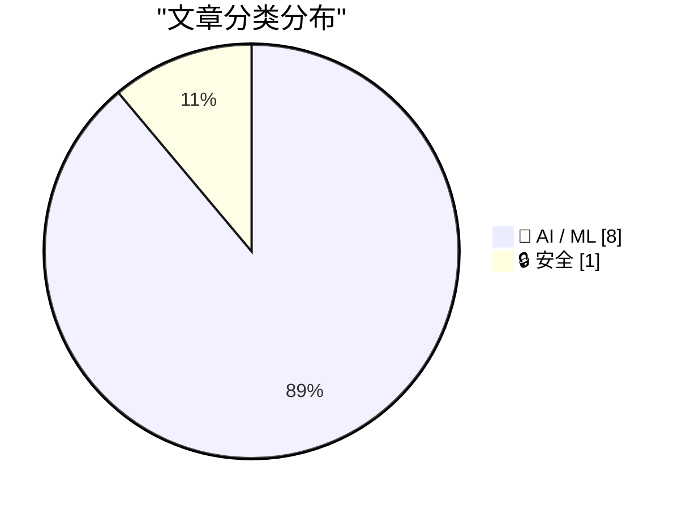
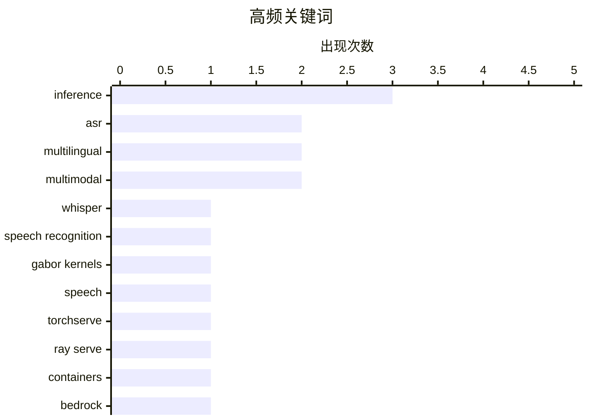

# 📰 AI 资讯每日精选 — 2026-09-10

> 汇聚 156+ 技术博客、X/Twitter、Hacker News、Reddit、Product Hunt、
> Lobste.rs、ClawFeed 日报及 GitHub Trending，经 AI 评分筛选。
>
> **本期内容**：🏆 今日必读 · 🌐 ClawFeed 日报 · 🔥 GitHub Trending · 📂 分类精选 · 📊 数据概览 · 🎯 项目相关情报 · 🌍 补充视角

## 📝 今日看点

今日AI技术圈有三条主线值得关注。语音识别正从"大一统多语言模型"转向语言专用化与结构改造，BuzzASR以102个语言专用模型、Orukeet以冻结Gabor核，分别补足低代表性语种的短板。推理基础设施的竞争焦点则转向缓存与阶段解耦，KV缓存跨上下文复用、编码-预填充-解码分离，以及TorchServe退役后的Ray Serve容器化，都在为多模态与多智能体负载压低成本。智能体加速落地的同时，安全与治理被推到台前：多模态提示注入已有可复现基准，业界也在呼吁抓住尚存的政策窗口。加上DeepSeek V4.1 Flash预告在性能与成本上全面升级，模型侧的效率与价格竞赛仍在继续。

---

## 🏆 今日必读

🥇 **BuzzASR：由100多个单语语音识别模型组成的集群**

[BuzzASR: A Swarm of 100+ Monolingual Speech Recognition Models](https://arxiv.org/abs/2609.09554) — arXiv Computation and Language · 31 分钟前 · 🤖 AI / ML · **一手来源**

> Whisper等大型端到端Transformer语音识别模型多为高度多语言模型，在训练数据中代表性不足的语言上表现往往较差。BuzzASR提出一组针对102种语言分别微调的语言专用Whisper模型集合，以语言特化方式提升自动语音识别效果。该工作延续了语言自适应可有效改善低资源语言识别的思路，但摘要未给出具体性能数据或对比结果。

💡 **为什么值得读**: 适合关注多语言/低资源语音识别与Whisper微调方案的研究者快速了解这一模型集合的思路。

🏷️ ASR, Whisper, multilingual, speech recognition

🥈 **Orukeet：使用冻结Gabor核的多语言语音识别**

[Orukeet: Multilingual ASR with Frozen Gabor Kernels](https://arxiv.org/abs/2609.10054) — arXiv Machine Learning · 31 分钟前 · 🤖 AI / ML · **一手来源**

> Orukeet将适配后的Parakeet编码器中一半时间滤波器替换为12,288个拟合的Gabor核，并冻结这些替换部分，仅训练其余参数，训练数据为多语言、多口音语料。最终适配与检查点选择使用LibriSpeech test-other。在25种语言、20,146条FLEURS录音上，汇总词错误率（WER）从Parakeet的11.01%降至Orukeet的9.85%，相对降低10.6%。

💡 **为什么值得读**: 给出了明确的WER对比与相对降幅，适合想了解冻结Gabor核在多语言ASR中实际收益的读者。

🏷️ ASR, multilingual, Gabor kernels, speech

🥉 **使用Ray Serve深度学习容器简化并支持你的TorchServe工作负载**

[Simplify and support your TorchServe workloads using Ray Serve Deep Learning Containers](https://aws.amazon.com/blogs/machine-learning/simplify-and-support-your-torchserve-workloads-using-ray-serve-deep-learning-containers/) — AWS Machine Learning Blog · 12 小时前 · 🤖 AI / ML · **一手来源**

> TorchServe已不再维护，团队需要自行承担整个GPU推理栈。AWS的Ray Serve深度学习容器是受支持、经过预测试的容器，已集成框架、GPU驱动和服务层。文章演示如何在Amazon EKS上使用该容器在单个GPU节点上部署一个视觉语言模型。

💡 **为什么值得读**: 为仍在用TorchServe、需要迁移到受支持推理方案的团队提供了具体的EKS部署路径。

🏷️ TorchServe, Ray Serve, inference, containers

4️⃣ **回顾：2026年8月AI构建者获得了哪些更新**

[ICYMI: What landed for AI builders in August 2026](https://aws.amazon.com/blogs/machine-learning/icymi-what-landed-for-ai-builders-in-august-2026/) — AWS Machine Learning Blog · 8 小时前 · 🤖 AI / ML · **一手来源**

> 文章汇总了2026年8月面向AI构建者的多项发布，覆盖Amazon Bedrock、Amazon Bedrock AgentCore和Strands。要点包括OpenAI模型的百万级token上下文、跨区域推理、可在专用计算上运行最长14天的智能体、扩展的AWS GovCloud可用性，以及用于物理部署的Strands Robots。

💡 **为什么值得读**: 一页式了解AWS在2026年8月对AI构建者推出的关键能力更新。

🏷️ Bedrock, agents, context window, AWS

5️⃣ **针对智能体AI框架的多模态提示注入攻击的实验评估**

[An Experimental Evaluation of Multimodal Prompt Injection Attacks on Agentic AI Frameworks](https://arxiv.org/abs/2609.09404) — arXiv Artificial Intelligence · 31 分钟前 · 🔒 安全 · **一手来源**

> 智能体AI框架让语言模型能够规划、保留记忆并调用可触及真实文件、邮件和服务的工具，而多数此类智能体还会读取图像，使攻击者可以绕过用户将文本注入智能体上下文。作者提出MMPIBench，一个可复现的基准，通过六种视觉载体（OCR文本、叠加层、EXIF元数据、二维码等）投递固定攻击集，以衡量后续影响。

💡 **为什么值得读**: 为关注智能体安全与多模态提示注入风险的研究者提供了可复现的评测基准。

🏷️ prompt injection, agentic AI, multimodal, security

---

## 🌐 ClawFeed 日报精选

> 来源：[ClawFeed](https://clawfeed.kevinhe.io) — AI 驱动的多源新闻聚合

📅 ClawFeed Daily | 2026-09-09（周二）

汇总：5 期 4h digest (#1167-#1171) | feed 154 / bookmarks 20 / errors 0

---

## 🔥 当日全场最重要 5 条

1. **Anthropic 研究员 Jacob Coxon 辞职事件全天发酵**——从早间第三方引述，到本人发布亲述长文"I resigned from Anthropic today. Neither company is acting responsibly"，再到 CoinDesk/Cointelegraph 跟进报道。继昨日 Pachocki 呼吁暂停后，AI 安全争议从内部呼吁升级为公开离职抗议，行业影响持续扩大。(#1169/#1170/#1171)

2. **Navier-Stokes 千禧年难题解法公开**——anima-ai 分享解法，随后 OpenAI 官宣"a group of AI agents using a next-generation model has produced a solution"，Lean 形式化验证已公开。AI 辅助数学证明从辅助工具升级为核心突破手段。(#1168/#1169)

3. **Cognition 融资 $2B+，估值 $48B**——Devin 背后的公司完成巨额融资，Scott Wu 将在直播中讨论。AI Agent 公司估值再创新高。(#1167)

4. **Meta 发布 Muse 个人 AI Agent 应用**——"gets things done across every part of life"，并已与 Link 支付集成实现任意网站购物。Meta 从社交平台正式向 Agent 产品迈步。(#1167/#1169)

5. **Andrew Ng 发布 AI Engineering 技能地图 + Karpathy 2 小时免费课**——Ng 系统梳理 AI 工程技能分布；Karpathy 将 8 年 OpenAI+Tesla 经验压缩成免费课，覆盖 Prompts→Harness→Loops→Graphs→Self-Improving Systems 全链路。行业教育基础设施集中释放。(#1171)

---

## 📰 当日核心主题

**1. AI 安全 + 实验室治理（全天主线）**
Coxon 辞职事件贯穿 3 个时段（#1169→#1170→#1171），从个人声明到行业新闻。@CharliehuAI 引出"AI 未来是混合模式"论点：开源与闭源共存，安全需行业协作而非单一实验室竞赛。承接昨日 Pachocki 呼吁，安全议题正从边缘升级为行业核心议程。

**2. AI Agent 产品化加速**
Cognition $48B 估值(#1167)、Meta Muse 发布+支付集成(#1167/#1169)、Manus 月访问量超 Genspark 两倍(#1167)、一人团队通过 Agent 效率提升 100x(#1167)——Agent 从技术 demo 进入商业化竞赛。

**3. Agent Harness 工程化**
Claude Code Skills 节省 3x tokens 实测(#1170)、Agent 评测框架实战"82%→89% 你敢发布吗?"(#1170)、"Harnesses 不只是脚手架"(#1167)、Anthropic 移除 80% system prompt 经验(#1171)——Harness 从配置项升级为核心工程能力。

**4. AI 辅助科学突破**
Navier-Stokes 解法(#1168/#1169)、AI 制药发现关键蛋白 TNIK(#1167)——AI 在基础科学和生物医药的突破从零星报道变为密集信号。

**5. Crypto + 稳定币落地**
TRX ETF 登陆 Cboe(#1168)、U.S. Bank USBDC 稳定币跨境支付测试(#1171)、MoneyGram 在 Solana 上的稳定币实践(#1169)、以太坊基金会设定 2029 量子抗性 deadline(#1171)——传统金融机构加速拥抱 crypto 基础设施。

---

## 🔖 Bookmarks 精选（本日累计）

本日 bookmarks 20 条，最后一期(#1171)有实质更新。精选：
- 36 篇经典 AI 论文合集（谢青池精选）
- AI 市场渗透率 <1%（$6T+ knowledge worker 市场）
- Cloudflare @cloudflare/computer：Agent 专用云端虚拟电脑
- Anthropic 移除 80% Claude Code system prompt 经验
- Matrix Agent 公司架构详解
- wanman.ai 一人公司开源框架（新增 db9 搜索 + Codex 调用）
- GPT-Realtime-2 实时音频翻译
- Andrew Ng AI Engineering 技能地图

---

## 👀 推荐关注汇总

- @trq212 - Anthropic 工程团队成员，Claude Code 内部 prompt 工程一手信息源
- @BruceGuai - Agent 架构深度输出者，Matrix 项目展示 harness 设计前沿

提醒：上述未通过浏览器逐一核实是否已关注，Kevin 操作前请先搜一下避免重复。

---

## 💤 当日重复噪音模式

- **Meme 币推广/交易分析**：$LAPTOP token 发行、$SPCX 交易分析等贯穿全天
- **低质内容/Meme**：薄肌/黄毛段子贴、follow-for-follow 列表帖、predict.fun 活动推广
- **政治/军事新闻溢出**：伊朗-美国军事冲突报道多次出现，与 AI/tech 主线无关

---

#daily-2026-09-09 · 5 期 4h (#1167-#1171) · feed 154 / bookmarks 20 / errors 0---

## 🔥 GitHub Trending

> 今日热门开源项目（全语言 + Python）

| # | 项目 | 描述 | ⭐ 总星 | 📈 今日 | 语言 |
|---|------|------|---------|---------|------|
| 1 | [ayghri/i-have-adhd](https://github.com/ayghri/i-have-adhd) 🤖 | A skill to stop your coding agent from burying the answer... | 35.2k | +4650 | Python |
| 2 | [cathrynlavery/diagram-design](https://github.com/cathrynlavery/diagram-design) 🤖 | 38 editorial diagram types for Claude Code, Codex, and Pi... | 36.8k | +2249 | HTML |
| 3 | [liquidslr/system-design-notes](https://github.com/liquidslr/system-design-notes) | Notes of the book System Desgin Interview - An Insider's ... | 18.1k | +1397 | - |
| 4 | [affaan-m/ECC](https://github.com/affaan-m/ECC) 🤖 | The agent harness performance optimization system. Skills... | 255.3k | +1133 | JavaScript |
| 5 | [freestylefly/awesome-gpt-image-2](https://github.com/freestylefly/awesome-gpt-image-2) 🤖 | Prompt as Code | GPT-Image2 工业级提示词引擎与模板库，530+ 个案例逆向工程，20+... | 30.2k | +705 | JavaScript |
| 6 | [browser-use/browser-use](https://github.com/browser-use/browser-use) | Agents that use the browser. | 114.0k | +705 | Python |
| 7 | [obra/superpowers](https://github.com/obra/superpowers) | An agentic skills framework & software development method... | 284.1k | +688 | Shell |
| 8 | [experientiallabs/experiential](https://github.com/experientiallabs/experiential) | Experiential is the open source, zero markup gateway for ... | 3.8k | +686 | Python |
| 9 | [public-apis/public-apis](https://github.com/public-apis/public-apis) | A collective list of free APIs | 478.2k | +580 | Python |
| 10 | [Tencent/teamai-cli](https://github.com/Tencent/teamai-cli) 🤖 | Make Every Team AI Native | 3.2k | +556 | TypeScript |
| 11 | [openai/plugins](https://github.com/openai/plugins) 🤖 | OpenAI Plugins | 6.3k | +498 | JavaScript |
| 12 | [vastsa/PI-Desktop](https://github.com/vastsa/PI-Desktop) 🤖 | Local-first AI coding agent desktop: Electron + Rust host... | 1.8k | +417 | TypeScript |
| 13 | [openai/skills](https://github.com/openai/skills) 🤖 | Skills Catalog for Codex | 26.8k | +381 | Python |
| 14 | [The-Swarm-Corporation/AutoHedge](https://github.com/The-Swarm-Corporation/AutoHedge) 🤖 | Build your autonomous hedge fund in minutes. AutoHedge ha... | 6.0k | +375 | Python |
| 15 | [TauricResearch/TradingAgents](https://github.com/TauricResearch/TradingAgents) 🤖 | TradingAgents: Multi-Agents LLM Financial Trading Framework | 104.1k | +367 | Python |

---

## 🤖 AI / ML

### 1. BuzzASR：由100多个单语语音识别模型组成的集群

[BuzzASR: A Swarm of 100+ Monolingual Speech Recognition Models](https://arxiv.org/abs/2609.09554) — **arXiv Computation and Language** · 31 分钟前 · ⭐ 23/30 · **一手来源**

> Whisper等大型端到端Transformer语音识别模型多为高度多语言模型，在训练数据中代表性不足的语言上表现往往较差。BuzzASR提出一组针对102种语言分别微调的语言专用Whisper模型集合，以语言特化方式提升自动语音识别效果。该工作延续了语言自适应可有效改善低资源语言识别的思路，但摘要未给出具体性能数据或对比结果。

🏷️ ASR, Whisper, multilingual, speech recognition

---

### 2. Orukeet：使用冻结Gabor核的多语言语音识别

[Orukeet: Multilingual ASR with Frozen Gabor Kernels](https://arxiv.org/abs/2609.10054) — **arXiv Machine Learning** · 31 分钟前 · ⭐ 22/30 · **一手来源**

> Orukeet将适配后的Parakeet编码器中一半时间滤波器替换为12,288个拟合的Gabor核，并冻结这些替换部分，仅训练其余参数，训练数据为多语言、多口音语料。最终适配与检查点选择使用LibriSpeech test-other。在25种语言、20,146条FLEURS录音上，汇总词错误率（WER）从Parakeet的11.01%降至Orukeet的9.85%，相对降低10.6%。

🏷️ ASR, multilingual, Gabor kernels, speech

---

### 3. 使用Ray Serve深度学习容器简化并支持你的TorchServe工作负载

[Simplify and support your TorchServe workloads using Ray Serve Deep Learning Containers](https://aws.amazon.com/blogs/machine-learning/simplify-and-support-your-torchserve-workloads-using-ray-serve-deep-learning-containers/) — **AWS Machine Learning Blog** · 12 小时前 · ⭐ 24/30 · **一手来源**

> TorchServe已不再维护，团队需要自行承担整个GPU推理栈。AWS的Ray Serve深度学习容器是受支持、经过预测试的容器，已集成框架、GPU驱动和服务层。文章演示如何在Amazon EKS上使用该容器在单个GPU节点上部署一个视觉语言模型。

🏷️ TorchServe, Ray Serve, inference, containers

---

### 4. 回顾：2026年8月AI构建者获得了哪些更新

[ICYMI: What landed for AI builders in August 2026](https://aws.amazon.com/blogs/machine-learning/icymi-what-landed-for-ai-builders-in-august-2026/) — **AWS Machine Learning Blog** · 8 小时前 · ⭐ 23/30 · **一手来源**

> 文章汇总了2026年8月面向AI构建者的多项发布，覆盖Amazon Bedrock、Amazon Bedrock AgentCore和Strands。要点包括OpenAI模型的百万级token上下文、跨区域推理、可在专用计算上运行最长14天的智能体、扩展的AWS GovCloud可用性，以及用于物理部署的Strands Robots。

🏷️ Bedrock, agents, context window, AWS

---

### 5. KVShareArena：跨上下文与模型检查点的KV缓存复用

[KVShareArena: KV-Cache Reuse Across Contexts and Model Checkpoints](https://arxiv.org/abs/2609.10266) — **arXiv Computation and Language** · 31 分钟前 · ⭐ 24/30 · **一手来源**

> 现有LLM服务系统虽已复用KV缓存，但仅限被复用文本位于提示最开头的情况。两类增长中的工作负载打破了这一条件：RAG服务器为每个查询组装不同的检索块，多智能体协调器读取其他智能体撰写的报告。缓存被复用到新提示中时会带有错误的位置信息，且未关注其他来源。

🏷️ KV-cache, LLM serving, RAG, inference

---

### 6. 何时使用编码-预填充-解码分离来加速多模态模型服务

[When to Use Encode-Prefill-Decode Disaggregation to Accelerate Multimodal Model Serving](https://developer.nvidia.com/blog/when-to-use-encode-prefill-decode-disaggregation-to-accelerate-multimodal-model-serving/) — **NVIDIA Technical Blog** · 8 小时前 · ⭐ 24/30

> 编码-预填充-解码（EPD）分离是一种面向多模态模型的推理优化技术，其核心是将视觉编码器阶段与预填充阶段分离。文章讨论在什么情况下应采用EPD分离来加速多模态模型服务。

🏷️ multimodal, inference, disaggregation, serving

---

### 7. DeepSeek将发布v4.1 Flash，比v4 Pro更便宜且更强

[DeepSeek launching v4.1 flash cheaper and more capable than v4 pro](https://news.ycombinator.com/item?id=49624603) — **Hacker News Best** · 17 小时前 · ⭐ 24/30

> 据该帖称，DeepSeek计划于2026年9月10日左右（北京时间）正式发布V4.1 Flash模型。经过内部与外部大量测试，V4.1 Flash在性能、成本、速度和任务完成时间等所有关键指标上全面超越V4 Pro。在V4.1 Flash正式发布后、V4.1 Pro发布之前，所有发往Pro模型的请求将被路由至V4.1 Flash并按Flash价格计费。

🏷️ DeepSeek, V4.1 Flash, LLM, model release

---

### 8. AI政策窗口已打开，我们需要行动

[The AI policy window is open. We need to act.](https://openai.com/index/ai-policy-window) — **OpenAI News** · 15 小时前 · ⭐ 22/30 · **一手来源**

> Chris Lehane主张，更强的AI能力需要更强的安全证据、共享标准以及持久的政策行动，而当前政策窗口仍然打开。文章呼吁在窗口期内采取行动。

🏷️ AI policy, AI safety, standards, governance

---

## 🔒 安全

### 9. 针对智能体AI框架的多模态提示注入攻击的实验评估

[An Experimental Evaluation of Multimodal Prompt Injection Attacks on Agentic AI Frameworks](https://arxiv.org/abs/2609.09404) — **arXiv Artificial Intelligence** · 31 分钟前 · ⭐ 24/30 · **一手来源**

> 智能体AI框架让语言模型能够规划、保留记忆并调用可触及真实文件、邮件和服务的工具，而多数此类智能体还会读取图像，使攻击者可以绕过用户将文本注入智能体上下文。作者提出MMPIBench，一个可复现的基准，通过六种视觉载体（OCR文本、叠加层、EXIF元数据、二维码等）投递固定攻击集，以衡量后续影响。

🏷️ prompt injection, agentic AI, multimodal, security

---

## 📊 数据概览

| 扫描源 | 抓取文章 | 时间范围 | 精选 |
|:---:|:---:|:---:|:---:|
| 109/156 | 6210 篇 → 1035 篇 | 24h | **9 篇** |

### 分类分布



### 高频关键词



<details>
<summary>📈 纯文本关键词图（终端友好）</summary>

```
inference          │ ████████████████████ 3
asr                │ █████████████░░░░░░░ 2
multilingual       │ █████████████░░░░░░░ 2
multimodal         │ █████████████░░░░░░░ 2
whisper            │ ███████░░░░░░░░░░░░░ 1
speech recognition │ ███████░░░░░░░░░░░░░ 1
gabor kernels      │ ███████░░░░░░░░░░░░░ 1
speech             │ ███████░░░░░░░░░░░░░ 1
torchserve         │ ███████░░░░░░░░░░░░░ 1
ray serve          │ ███████░░░░░░░░░░░░░ 1
```

</details>

### 🏷️ 话题标签

**inference**(3) · **asr**(2) · **multilingual**(2) · multimodal(2) · whisper(1) · speech recognition(1) · gabor kernels(1) · speech(1) · torchserve(1) · ray serve(1) · containers(1) · bedrock(1) · agents(1) · context window(1) · aws(1) · prompt injection(1) · agentic ai(1) · security(1) · kv-cache(1) · llm serving(1)

---

## 🎯 项目相关情报

### Agent 基座安全与合规

> 暂无达到质量门槛的项目相关情报。

### 多 Agent 架构

> 暂无达到质量门槛的项目相关情报。

### ASR 与语音助手

#### [BuzzASR：由100多个单语语音识别模型组成的集群](https://arxiv.org/abs/2609.09554)

> **状态**：本期 Top 9 已收录

- **匹配类型**：直接相关
- **项目相关性**：8/10
- **可落地性**：7/10
- **为什么相关**：介绍102种语言的语言专用Whisper微调模型集合，直接覆盖ASR模型与多语言语音识别，属语音识别方向。
- **建议动作**：跟踪其多语言ASR评测与模型开放情况，评估用于低资源语言转写。
- **来源**：arXiv Computation and Language · 一手来源

#### [Orukeet：使用冻结Gabor核的多语言语音识别](https://arxiv.org/abs/2609.10054)

> **状态**：本期 Top 9 已收录

- **匹配类型**：直接相关
- **项目相关性**：8/10
- **可落地性**：6/10
- **为什么相关**：用冻结Gabor卷积核替换Parakeet编码器部分时间滤波器实现多语言ASR，直接属于语音识别模型架构研究。
- **建议动作**：对比其编码器替换与冻结训练方案，评估在自有ASR数据上的微调收益。
- **来源**：arXiv Machine Learning · 一手来源

### 商品包装 OCR

> 暂无达到质量门槛的项目相关情报。

---

## 🌍 补充视角

> Top 9 未覆盖的高质量不同来源，最多 3 条。

### 1. Suno 携手华纳、BMG 和 Believe 推出 v6 音乐模型

[Suno launches v6 music models built with Warner, BMG, and Believe](https://the-decoder.com/suno-launches-v6-music-models-built-with-warner-bmg-and-believe/) — **The Decoder** · 14 小时前 · 🤖 AI / ML · ⭐ 23/30 · **二手来源**

> Suno 发布了新一代 AI 音乐模型 v6，共三个版本，与华纳音乐集团、BMG 和 Believe 合作打造。所有旧版模型将被关停。新模型支持通过文本命令对歌曲进行局部修改，也可从文本、音频和图像多模态生成音乐。公司未透露训练使用了哪些音乐曲库，而环球音乐和索尼仍在对其提起诉讼。

💡 **补充价值**：了解 AI 音乐生成领域最新模型能力、版权争议与主流唱片公司合作动向的关键进展。

---

*生成于 2026-09-10 04:31 | 汇聚 156 个技术博客、X/Twitter、Hacker News、Reddit、Product Hunt、Lobste.rs、ClawFeed 日报及 GitHub Trending，经 AI 评分筛选出 Top 9 精华内容，另附 1 条不同来源补充视角*
