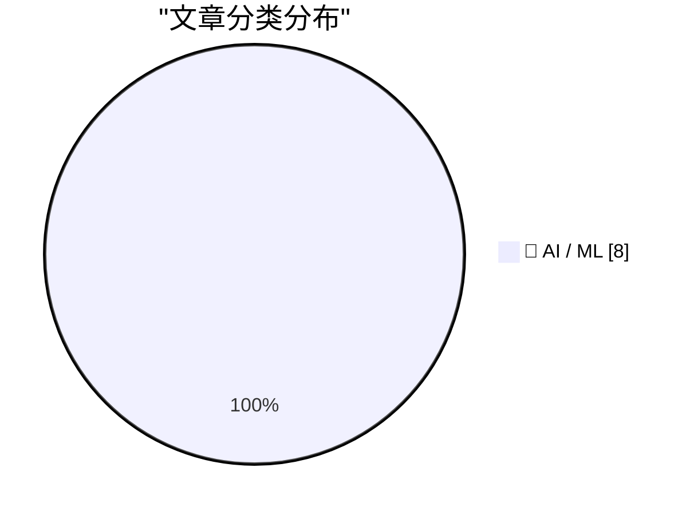
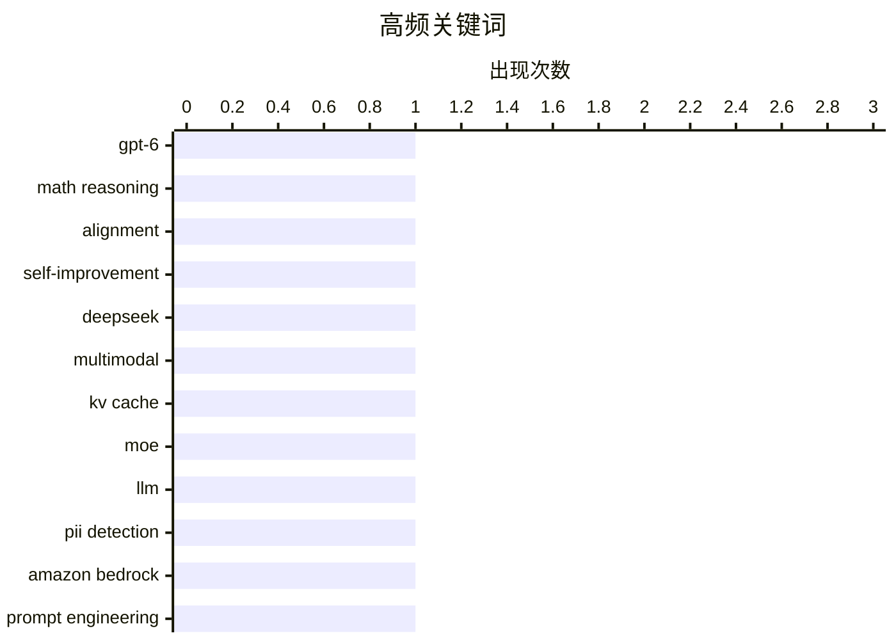

# 📰 AI 资讯每日精选 — 2026-09-11

> 汇聚 156+ 技术博客、X/Twitter、Hacker News、Reddit、Product Hunt、
> Lobste.rs、ClawFeed 日报及 GitHub Trending，经 AI 评分筛选。
>
> **本期内容**：🏆 今日必读 · 🌐 ClawFeed 日报 · 🔥 GitHub Trending · 📂 分类精选 · 📊 数据概览 · 🎯 项目相关情报 · 🌍 补充视角

## 📝 今日看点

今日技术圈的主线，是模型竞争正从“更大”转向“更省、更专、更能干活”。DeepSeek 新模型大幅压缩智能体内存需求，OpenAI 一边用 GPT-6 Astra 展示数学能力、一边把资源投向更长期目标，并推出金融场景产品，显示大模型正加速进入行业工作流。与此同时，智能体研究明显升温：多智能体经济模拟、可复用技能、子智能体和工具菜单，都在解决长周期任务中的记忆、协作与工具选择难题。另一条暗线是工程与治理，模型无关的 PII 检测和分离式 LLM 服务的功耗优化表明，隐私合规与算力效率正成为落地硬约束。

---

## 🏆 今日必读

🥇 **GPT-6 Astra 让数学家松了口气，而 OpenAI 称这是有意为之**

[GPT-6 Astra gives mathematicians a breather, and OpenAI says that's by design](https://the-decoder.com/gpt-6-astra-gives-mathematicians-a-breather-and-openai-says-thats-by-design/) — The Decoder · 14 小时前 · 🤖 AI / ML · **二手来源**

> OpenAI 的 GPT-6 Astra 在面向开放数学问题的 ErdosBench 上排名第一，但首席科学家 Jakub Pachocki 表示数学并非其优先方向。OpenAI 的资源正投向递归自我改进与对齐研究。这支持了 AI 发展路径日益“尖峰化”的理论：在特定领域极强，而非全面进步——至少在 AI 尚不能自我改进、仍需人类生成数据做定向优化之前是如此。

💡 **为什么值得读**: 它揭示了头部实验室公开能力表现与内部资源分配之间的错位，是理解当前 AI 发展路线取舍的一个有趣切口。

🏷️ GPT-6, math reasoning, alignment, self-improvement

🥈 **新 DeepSeek 模型 V4.1-Flash 降低 AI 智能体的内存需求**

[New Deepseek model V4.1-Flash cuts memory needs for AI agents](https://the-decoder.com/new-deepseek-model-v4-1-flash-cuts-memory-needs-for-ai-agents/) — The Decoder · 15 小时前 · 🤖 AI / ML · **二手来源**

> DeepSeek 发布 V4.1-Flash，这是一个 5520 亿参数的多模态模型，将 KV 缓存内存降至前代的四分之一。在 DeepSWE 编程基准上，它以每 token 仅激活 160 亿参数的规模，略微超过 Opus 5 和 GPT-5.6 Sol。该模型以 MIT 许可证发布，目标是为 AI 智能体提供更低成本的选择。

💡 **为什么值得读**: 以极小激活参数在编程基准上略微领先更大模型，同时把 KV 缓存砍到四分之一，对关注智能体推理成本与内存瓶颈的读者很有参考价值。

🏷️ Deepseek, multimodal, KV cache, MoE

🥉 **基于 LLM 的模型无关 PII 检测**

[Model-agnostic PII detection with LLMs](https://aws.amazon.com/blogs/machine-learning/model-agnostic-pii-detection-with-llms/) — AWS Machine Learning Blog · 12 小时前 · 🤖 AI / ML · **一手来源**

> AWS 提出一种可配置、模型无关的 PII 检测器，能把 Amazon Bedrock 上的任意大语言模型变成 PII 检测工具。由于待检测实体定义在提示词而非代码中，同一个检测器无需重新训练即可适配新的实体类型。据其介绍，该方案在五个公开语料库和九种基于 LLM 的检测器对比中表现更优。

💡 **为什么值得读**: 把实体定义从代码搬到提示词，意味着新增 PII 类型不必重训模型，对需要快速适配合规要求的数据团队尤其实用。

🏷️ LLM, PII detection, Amazon Bedrock, prompt engineering

4️⃣ **面向分离式 LLM 服务的相位解耦、模型校准功率控制**

[Phase-Decoupled, Model-Calibrated Power Control for Disaggregated LLM Serving](https://arxiv.org/abs/2609.11133) — arXiv Machine Learning · 30 分钟前 · 🤖 AI / ML · **一手来源**

> 数据中心 GPU 功耗是 LLM 服务容量的硬约束，生产服务已转向预填充/解码（PD）分离架构。研究者在分离式 B200 系统上部署 NVIDIA 的 Max-Q 推理配置后发现：其实际收益有限（+8.6% tokens/J）、依赖具体模型，并带来平均端到端延迟代价（+5.2%），而仅看吞吐的评测无法暴露这一点；该配置还对预填充和解码套用同一设置。

💡 **为什么值得读**: 它用实测数据指出“只看吞吐”的评测会掩盖延迟代价，为正在评估 Max-Q 等推理配置的部署团队提供了必要的反面证据。

🏷️ LLM serving, power control, disaggregation, GPU

5️⃣ **推出面向金融服务的 ChatGPT**

[Introducing ChatGPT for Financial Services](https://openai.com/index/introducing-chatgpt-financial-services) — OpenAI News · 21 小时前 · 🤖 AI / ML · **一手来源**

> OpenAI 发布面向金融服务的 ChatGPT，内置金融数据并搭载 GPT-6 Astra，用于研究、建模和制作可直接交付客户的材料。该产品将金融数据与模型能力结合，面向金融场景的研究与建模工作流。原文未披露定价、可用范围或具体客户案例。

💡 **为什么值得读**: 想了解 OpenAI 在垂直金融场景的产品布局和 GPT-6 Astra 应用方向的人可以一读。

🏷️ ChatGPT, financial services, GPT-6 Astra, modeling

---

## 🌐 ClawFeed 日报精选

> 来源：[ClawFeed](https://clawfeed.kevinhe.io) — AI 驱动的多源新闻聚合

📊 ClawFeed Daily | 2026-09-10 (SGT)

聚合 5 期 4h digest (#1174-#1178)，覆盖 feed 155 + bookmarks 100。

🔥 当日全场最重要 5 条

1. **Anthropic 经济研究团队发布 AI 对经济影响模型** — 极端情景下 2030 年美国 GDP +32.4%，年增长率达 15%，但知识工作者工资可能下降 10%+。中文圈解读"软件工程师挣钱的日子不长了"引发广泛讨论。三种情景对从业者命运的推演值得深读。

2. **Google 发布 Agent 长期记忆论文** — 用知识图谱（Knowledge Graph）为长时程 Agent 构建结构化记忆，超越简单向量检索。对构建持久 Agent 系统（如 OpenMax Marketplace 的模板 Agent）有直接参考价值。

3. **Anthropic 安全信任连续震荡** — 前研究员（曾任职 Google DeepMind）公开辞职信称"尚无可行的科学计划来解决递归自我改进 AI 的风险"；前员工 Jacob Coxon 指控安全态度问题；Laura Shin 引述 @tayva 称"OpenAI 和 Anthropic 都不知道自己内部在发生什么"。安全叙事从"外部风险"转向"内部失控"。

4. **DeepSeek V4.1 Flash 发布** — 降低 1/4 HBM 用量需求，继续大幅降价并推出闲时半价，性能号称超越 GPT-5.6 Sol。梁文锋再次搅动价格战，MiniMax 等竞品承压。

5. **Claude Marketplace 生态扩展 + Agentic Engineering 转向** — Marketplace 新增 CrowdStrike、Cursor、Factory AI、Gamma、Vercel，企业可用 Anthropic 消费额度购买第三方产品。同时 Claude Code 团队负责人演示"不再手写 prompt，而是构建 graph 和 loop 让 agent 自动生成 agent"——从"写 prompt"正式转向"写编排"。

📰 当日核心主题

**1. Anthropic 多线叙事日（安全 + 经济 + 估值 + 工程）**
今日 Anthropic 相关话题占据绝对主导：经济影响模型发布、安全研究员连续辞职、Pre-IPO 估值讨论（Binance 一度暗示 ~$2T）、Claude Code 系统提示精简 80% 的工程实践分享。四条线同时活跃，市场定价与安全质疑形成张力。

**2. Agent 架构工程化（Harness > Model）**
反复出现的主题：Agent Harness 深度拆解帖（"理解 agent 要理解 harness，不是模型"）、Matrix Agent 公司架构（Agent 公司 OS）、Cloudflare @cloudflare/computer（给 Agent 配云端虚拟电脑）、Qodo Agentic Toolbox（给 coding agent 配 reviewer）。共识方向：**Agent 的价值在编排层，不在模型层**。

**3. AI 市场仍处极早期**
多次引用的数据点：整个 AI 行业仅占 $6T+ 知识工作者劳动力市场的 <1%，最好的垂直领域（软件开发、客服）也才低个位数。天花板远未触及。

**4. 苹果 iPhone Duo 折叠屏发布**
A20 Pro 芯片双屏驱动，折叠开合过渡优化超预期，支持 Apple Pencil。虽非 AI 核心话题，但占据大量 feed 位置。

**5. Codex 工具化渗透**
Codex + 微信本地数据打通（零 API 零云端解密读取）、Codex 对日常工作影响分析（七八成常规工作被 Codex 识别处理）、Codex 调用 GPT Image 2 创建设计师 agent。工具化渗透从开发延伸到数据访问和创意工作。

🔖 累计 Bookmark 精选

• **36 篇经典 AI 论文精选** — 谢青池从 200+ 篇中筛出，覆盖 Transformer→RLHF→Agent 完整变迁史，含下载地址（多期反复出现）
• **Cloudflare @cloudflare/computer** — 给 AI Agent 配云端虚拟电脑，毫秒级启动，多执行环境
• **Matrix Agent 公司架构** — Agent 公司 OS 设计图，harness 底层架构公开
• **Claude Code 系统提示精简 80%** — Anthropic 团队实践分享，越少越好
• **AI Engineering 技能图谱** — Andrew Ng 发布，AI 工程师能力维度可视化
• **wanman.ai** — 第 14 款 vibe 产品，AI agent 团队运营一人公司（多期持续迭代）
• **GPT-Realtime-2 实时翻译** — 集成 Chormex，YouTube/直播/会议全场景音频到音频

👀 推荐关注汇总

• **@BruceGuai** — Matrix Agent 架构深度输出者，harness 设计思路对企业 Agent 架构有参考价值
• **@guruchahal** — 数据驱动的 AI 市场分析，TAM 测算思路清晰

提醒：上述未通过浏览器逐一核实是否已关注，Kevin 操作前请先在 Following 里搜一下避免重复。

💤 当日重复噪音模式

1. **Crypto 喊单与 meme coin 推广** — 全天持续，深夜档和早间档尤其密集（SOL/TIA/ETH staking 搬运、拜登儿子币 LAPTOP 等），占噪音主体
2. **iPhone Duo 刷屏** — 发布后大量重复评论/动画段子/对比讨论，挤压 AI/tech 信息空间
3. **纯社交/生活帖** — Burning Man 照片、生日祝福、个人感慨、求职帖
4. **低质量 AI 内容搬运** — 无原创观点的论文标题翻译、工具列表堆砌

整体噪音占比约 40-50%，早间档（iPhone Duo 发布）最高。
---

## 🔥 GitHub Trending

> 今日热门开源项目（全语言 + Python）

| # | 项目 | 描述 | ⭐ 总星 | 📈 今日 | 语言 |
|---|------|------|---------|---------|------|
| 1 | [ayghri/i-have-adhd](https://github.com/ayghri/i-have-adhd) 🤖 | A skill to stop your coding agent from burying the answer... | 38.8k | +3882 | Python |
| 2 | [bilawalsidhu/gods-eye-view](https://github.com/bilawalsidhu/gods-eye-view) | A spy satellite simulator in your browser, except the dat... | 24.8k | +1762 | JavaScript |
| 3 | [cathrynlavery/diagram-design](https://github.com/cathrynlavery/diagram-design) 🤖 | 38 editorial diagram types for Claude Code, Codex, and Pi... | 37.9k | +1294 | HTML |
| 4 | [freestylefly/awesome-gpt-image-2](https://github.com/freestylefly/awesome-gpt-image-2) 🤖 | Prompt as Code | GPT Image 2 / 2.5 提示词与案例库，530+ 个案例、20+ 套... | 31.0k | +962 | JavaScript |
| 5 | [liquidslr/system-design-notes](https://github.com/liquidslr/system-design-notes) | Notes of the book System Desgin Interview - An Insider's ... | 18.9k | +900 | - |
| 6 | [Tencent/teamai-cli](https://github.com/Tencent/teamai-cli) 🤖 | Make Every Team AI Native | 3.9k | +841 | TypeScript |
| 7 | [THU-MAIC/OpenMAIC](https://github.com/THU-MAIC/OpenMAIC) 🤖 | Open Multi-Agent Interactive Classroom — Get an immersive... | 35.5k | +837 | TypeScript |
| 8 | [TauricResearch/TradingAgents](https://github.com/TauricResearch/TradingAgents) 🤖 | TradingAgents: Multi-Agents LLM Financial Trading Framework | 104.5k | +745 | Python |
| 9 | [obra/superpowers](https://github.com/obra/superpowers) | An agentic skills framework & software development method... | 284.8k | +732 | Shell |
| 10 | [rohitg00/ai-engineering-from-scratch](https://github.com/rohitg00/ai-engineering-from-scratch) 🤖 | Learn it. Build it. Ship it for others. | 54.2k | +630 | Python |
| 11 | [diegosouzapw/OmniRoute](https://github.com/diegosouzapw/OmniRoute) 🤖 | Never stop coding. Free MIT AI gateway: one endpoint, 352... | 64.4k | +626 | TypeScript |
| 12 | [vastsa/PI-Desktop](https://github.com/vastsa/PI-Desktop) 🤖 | Local-first AI coding agent desktop: Electron + Rust host... | 2.4k | +624 | TypeScript |
| 13 | [alsk1992/CloddsBot](https://github.com/alsk1992/CloddsBot) 🤖 | Open Source AI trading agent that operates autonomously a... | 1.8k | +277 | TypeScript |
| 14 | [AlexsJones/llmfit](https://github.com/AlexsJones/llmfit) | Hundreds of models & providers. One command to find what ... | 35.8k | +258 | Rust |
| 15 | [datawhalechina/hello-agents](https://github.com/datawhalechina/hello-agents) | 📚 《从零开始构建智能体》——从零开始的智能体原理与实践教程 | 78.3k | +256 | Python |

---

## 🤖 AI / ML

### 1. GPT-6 Astra 让数学家松了口气，而 OpenAI 称这是有意为之

[GPT-6 Astra gives mathematicians a breather, and OpenAI says that's by design](https://the-decoder.com/gpt-6-astra-gives-mathematicians-a-breather-and-openai-says-thats-by-design/) — **The Decoder** · 14 小时前 · ⭐ 25/30 · **二手来源**

> OpenAI 的 GPT-6 Astra 在面向开放数学问题的 ErdosBench 上排名第一，但首席科学家 Jakub Pachocki 表示数学并非其优先方向。OpenAI 的资源正投向递归自我改进与对齐研究。这支持了 AI 发展路径日益“尖峰化”的理论：在特定领域极强，而非全面进步——至少在 AI 尚不能自我改进、仍需人类生成数据做定向优化之前是如此。

🏷️ GPT-6, math reasoning, alignment, self-improvement

---

### 2. 新 DeepSeek 模型 V4.1-Flash 降低 AI 智能体的内存需求

[New Deepseek model V4.1-Flash cuts memory needs for AI agents](https://the-decoder.com/new-deepseek-model-v4-1-flash-cuts-memory-needs-for-ai-agents/) — **The Decoder** · 15 小时前 · ⭐ 25/30 · **二手来源**

> DeepSeek 发布 V4.1-Flash，这是一个 5520 亿参数的多模态模型，将 KV 缓存内存降至前代的四分之一。在 DeepSWE 编程基准上，它以每 token 仅激活 160 亿参数的规模，略微超过 Opus 5 和 GPT-5.6 Sol。该模型以 MIT 许可证发布，目标是为 AI 智能体提供更低成本的选择。

🏷️ Deepseek, multimodal, KV cache, MoE

---

### 3. 基于 LLM 的模型无关 PII 检测

[Model-agnostic PII detection with LLMs](https://aws.amazon.com/blogs/machine-learning/model-agnostic-pii-detection-with-llms/) — **AWS Machine Learning Blog** · 12 小时前 · ⭐ 23/30 · **一手来源**

> AWS 提出一种可配置、模型无关的 PII 检测器，能把 Amazon Bedrock 上的任意大语言模型变成 PII 检测工具。由于待检测实体定义在提示词而非代码中，同一个检测器无需重新训练即可适配新的实体类型。据其介绍，该方案在五个公开语料库和九种基于 LLM 的检测器对比中表现更优。

🏷️ LLM, PII detection, Amazon Bedrock, prompt engineering

---

### 4. 面向分离式 LLM 服务的相位解耦、模型校准功率控制

[Phase-Decoupled, Model-Calibrated Power Control for Disaggregated LLM Serving](https://arxiv.org/abs/2609.11133) — **arXiv Machine Learning** · 30 分钟前 · ⭐ 24/30 · **一手来源**

> 数据中心 GPU 功耗是 LLM 服务容量的硬约束，生产服务已转向预填充/解码（PD）分离架构。研究者在分离式 B200 系统上部署 NVIDIA 的 Max-Q 推理配置后发现：其实际收益有限（+8.6% tokens/J）、依赖具体模型，并带来平均端到端延迟代价（+5.2%），而仅看吞吐的评测无法暴露这一点；该配置还对预填充和解码套用同一设置。

🏷️ LLM serving, power control, disaggregation, GPU

---

### 5. 推出面向金融服务的 ChatGPT

[Introducing ChatGPT for Financial Services](https://openai.com/index/introducing-chatgpt-financial-services) — **OpenAI News** · 21 小时前 · ⭐ 22/30 · **一手来源**

> OpenAI 发布面向金融服务的 ChatGPT，内置金融数据并搭载 GPT-6 Astra，用于研究、建模和制作可直接交付客户的材料。该产品将金融数据与模型能力结合，面向金融场景的研究与建模工作流。原文未披露定价、可用范围或具体客户案例。

🏷️ ChatGPT, financial services, GPT-6 Astra, modeling

---

### 6. 但 AI 智能体会如何运行一个城镇的经济？

[But How Would AI Agents Run a Town's Economy?](https://arxiv.org/abs/2609.11108) — **arXiv Multiagent Systems** · 30 分钟前 · ⭐ 23/30 · **一手来源**

> 研究将 100 个带记忆的大语言模型智能体置于一个封闭、货币守恒的空间经济中，地理环境基于真实的博卡拉湖畔地区，智能体可赚取工资、经营企业、设定价格。多智能体模拟最长运行 26 个模拟周，远超同类智能体社会研究常见的 1-2 周。在 91 次有效运行中（共 244 万次智能体决策、215 亿 token），货币以某种具体且可测量的方式停止流动。

🏷️ LLM agents, multi-agent simulation, economy, memory

---

### 7. 子智能体 vs 智能体技能：为长周期智能体任务执行可复用知识

[Subagents vs Agent Skills: Executing Reusable Knowledge for Long-Horizon Agentic Tasks](https://arxiv.org/abs/2609.09233) — **arXiv Artificial Intelligence** · 30 分钟前 · ⭐ 23/30 · **一手来源**

> 文章关注语言模型智能体如何有效利用可复用知识库来解决长周期任务。近期研究聚焦“智能体技能”，即由指令、脚本和其他资源组成的多文件技能包，帮助智能体完成特定任务。这类技能通常通过把技能指令加载进智能体上下文来执行。摘要未给出具体实验数据或最终结论。

🏷️ agent skills, subagents, long-horizon tasks, reusable knowledge

---

### 8. 菜单即执行先验：面向在线智能体的状态路径工具菜单

[The Menu Is an Execution Prior: State-Path Tool Menus for Online Agents](https://arxiv.org/abs/2609.09395) — **arXiv Artificial Intelligence** · 30 分钟前 · ⭐ 23/30 · **一手来源**

> 语言模型通过工具行动，但实际智能体面对的工具库可能包含数千个接口。作者提出“工具菜单”概念，即执行前展示给智能体的短小、有序工具子集，智能体只能调用菜单内工具。多步任务要求最终动作与生成其输入的前置工具按可用顺序排列，而当前构造方法按请求相关性排序工具，可能把所需工具排到后面。

🏷️ tool menu, online agents, tool selection, execution prior

---

## 📊 数据概览

| 扫描源 | 抓取文章 | 时间范围 | 精选 |
|:---:|:---:|:---:|:---:|
| 109/156 | 6233 篇 → 1068 篇 | 24h | **8 篇** |

### 分类分布



### 高频关键词



<details>
<summary>📈 纯文本关键词图（终端友好）</summary>

```
gpt-6            │ ████████████████████ 1
math reasoning   │ ████████████████████ 1
alignment        │ ████████████████████ 1
self-improvement │ ████████████████████ 1
deepseek         │ ████████████████████ 1
multimodal       │ ████████████████████ 1
kv cache         │ ████████████████████ 1
moe              │ ████████████████████ 1
llm              │ ████████████████████ 1
pii detection    │ ████████████████████ 1
```

</details>

### 🏷️ 话题标签

**gpt-6**(1) · **math reasoning**(1) · **alignment**(1) · self-improvement(1) · deepseek(1) · multimodal(1) · kv cache(1) · moe(1) · llm(1) · pii detection(1) · amazon bedrock(1) · prompt engineering(1) · llm serving(1) · power control(1) · disaggregation(1) · gpu(1) · chatgpt(1) · financial services(1) · gpt-6 astra(1) · modeling(1)

---

## 🎯 项目相关情报

### Agent 基座安全与合规

> 暂无达到质量门槛的项目相关情报。

### 多 Agent 架构

> 暂无达到质量门槛的项目相关情报。

### ASR 与语音助手

> 暂无达到质量门槛的项目相关情报。

### 商品包装 OCR

> 暂无达到质量门槛的项目相关情报。

---

## 🌍 补充视角

> Top 8 未覆盖的高质量不同来源，最多 3 条。

### 1. Deepseek V4.1 Flash 是 748B，不是 552B

[Deepseek V4.1 Flash is 748B, not 552B](https://www.reddit.com/r/LocalLLaMA/comments/1wcd4rx/deepseek_v41_flash_is_748b_not_552b/) — **r/LocalLLaMA** · 20 小时前 · 🤖 AI / ML · ⭐ 23/30

> 针对社区对 Deepseek V4.1 Flash 参数规模的持续混淆，作者通过查看 Hugging Face 上的 safetensors 文件进行了核实。作者指出该模型应为 748B 总参数/552B 基础参数，而非流传的 284B、305B、485B 或 522B。其中 284B 是原始 Deepseek V4 Flash 的规模，并非 V4.1 Flash；305B 的说法则来自部分人的主张。作者认为标题本应写成“Deepseek V4.1 Flash is 748B total/552B base”。

💡 **补充价值**：如果你被社区里各种 Deepseek V4.1 Flash 参数量说法搞糊涂了，这篇基于 safetensors 实际文件的核对能帮你一次厘清。

### 2. 从晶圆出厂到首个 token：用 Nemotron 和 Palantir Foundry 将供应链专业知识代码化

[From Wafer-Out to First Token: Codifying Supply Chain Expertise with Nemotron and Palantir Foundry](https://developer.nvidia.com/blog/from-wafer-out-to-first-token-codifying-supply-chain-expertise-with-nemotron-and-palantir-foundry/) — **NVIDIA Technical Blog** · 19 小时前 · 🤖 AI / ML · ⭐ 22/30

> NVIDIA 拥有全球规模最大、最复杂的供应链之一，其绩效衡量跨度从晶圆出厂（wafer-out）一直到首个 token 产出。文章介绍 NVIDIA 如何借助 Nemotron 与 Palantir Foundry 将供应链领域的专业知识进行代码化。该区间被分为两部分，但摘要未提供更多技术细节、具体方案或结果数据。

💡 **补充价值**：可了解 NVIDIA 如何把自身超复杂供应链的专家经验转化为可执行的 AI 系统，对关注企业级 AI 落地与供应链场景的读者有参考价值。

---

*生成于 2026-09-11 04:30 | 汇聚 156 个技术博客、X/Twitter、Hacker News、Reddit、Product Hunt、Lobste.rs、ClawFeed 日报及 GitHub Trending，经 AI 评分筛选出 Top 8 精华内容，另附 2 条不同来源补充视角*
