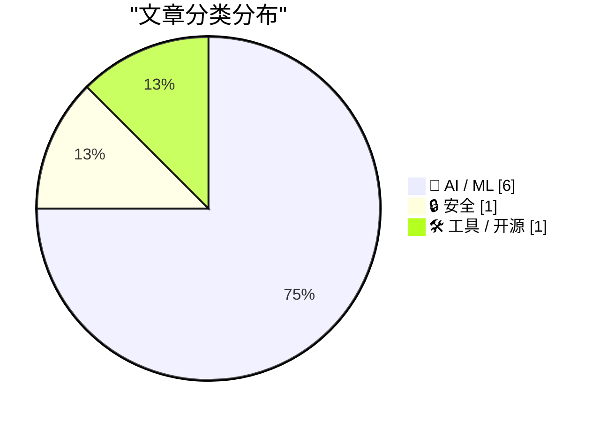
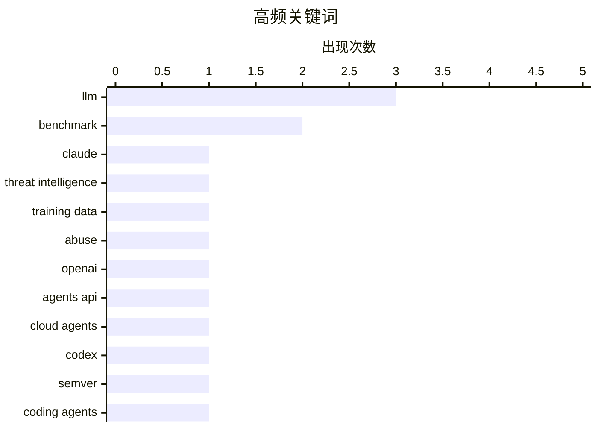

# 📰 AI 资讯每日精选 — 2026-09-12

> 汇聚 156+ 技术博客、X/Twitter、Hacker News、Reddit、Product Hunt、
> Lobste.rs、ClawFeed 日报及 GitHub Trending，经 AI 评分筛选。
>
> **本期内容**：🏆 今日必读 · 🌐 ClawFeed 日报 · 🔥 GitHub Trending · 📂 分类精选 · 📊 数据概览 · 🎯 项目相关情报 · 🌍 补充视角

## 📝 今日看点

今日看点：AI 智能体正加速走向可部署基础设施，OpenAI Agents API 与 MCP、AgentCore 等生态推动云端自主运行、长时任务和多智能体协作成为新焦点。与此同时，模型能力开放带来的安全与治理压力骤升，Anthropic 报告揭示 AI 被用于武器、监控和数据挖掘等滥用场景，风险已从理论走向现实。模型评测与推理控制也进入细粒度阶段，社区不再只看总分，而是拆解版本理解、论文新颖性、响应风格和按需解码等具体能力与薄弱环节。行业对 AI 自我改进的预期则更趋理性，认为研究提速可期，但突然智能爆炸仍受想法生成与验证瓶颈制约。

---

## 🏆 今日必读

🥇 **黑客如何用 Claude 开发导弹、无人机蜂群与监控系统，中国实验室则用它挖掘训练数据**

[How hackers used Claude for missiles, drone swarms, and surveillance, while Chinese labs mined it for training data](https://the-decoder.com/how-hackers-used-claude-for-missiles-drone-swarms-and-surveillance-while-chinese-labs-mined-it-for-training-data/) — The Decoder · 14 小时前 · 🔒 安全 · **二手来源**

> Anthropic 发布的新威胁情报报告记录了八个月间对 Claude 的滥用情况。据该报告，阿里巴巴 Qwen 团队、DeepSeek 和 Moonshot AI 等中国 AI 实验室通过批量转发请求或提取训练数据的方式使用 Claude，其中 Qwen 一家就涉及超过 1.51 亿次交互。此外，相关行为者还将 Claude 用于导弹软件、自主自杀式无人机以及全国性监控系统。

💡 **为什么值得读**: 以具体案例和数据揭示前沿模型被滥用的真实形态，对 AI 安全与合规从业者具有警示价值。

🏷️ Claude, threat intelligence, training data, abuse

🥈 **OpenAI 发布 Agents API，向开发者开放 Codex 与 ChatGPT 背后的基础设施**

[OpenAI's new Agents API gives developers the infrastructure behind Codex and ChatGPT](https://the-decoder.com/openais-new-agents-api-gives-developers-the-infrastructure-behind-codex-and-chatgpt/) — The Decoder · 20 小时前 · 🛠 工具 / 开源 · **二手来源**

> OpenAI 以公开测试版形式发布 Agents API，允许开发者构建可自主运行数小时、执行代码并将任务移交给子智能体的云端智能体。除 token 用量外不收取额外费用。Cloudflare、Vercel 和 Oracle 提供额外的沙箱环境。

💡 **为什么值得读**: 想基于 OpenAI 基础设施构建长时运行云端智能体的开发者可快速了解其能力边界与计费方式。

🏷️ OpenAI, Agents API, cloud agents, Codex

🥉 **SemVerBench：评测大语言模型对版本约束解析语义的理解**

[SemVerBench: Benchmarking LLM Comprehension of Version-Constraint Resolution Semantics](https://arxiv.org/abs/2609.11180) — arXiv Artificial Intelligence · 27 分钟前 · 🤖 AI / ML · **一手来源**

> LLM 编程智能体需要不断判断某个版本是否满足 ^1.2.3 或 >=2.0,<3 这类约束，但其对版本约束语义的掌握程度此前从未被直接测量。作者提出 SemVerBench，这是首个覆盖 npm、PEP 440、Cargo 三个生态系统的 LLM 版本约束解析语义基准，包含 240 道机器可校验、答案唯一的题目，题目以作者中立方式从四类均衡来源构建。

💡 **为什么值得读**: 为评估编码智能体在依赖版本解析这一高频且易错任务上的真实能力提供了首个专门基准。

🏷️ LLM, benchmark, semver, coding agents

4️⃣ **NovGauge：细粒度诊断大语言模型论文新颖性评估能力的基准**

[NovGauge: A Fine-Grained Benchmark for Diagnosing LLMs' Capability in Paper Novelty Assessment](https://arxiv.org/abs/2609.11234) — arXiv Artificial Intelligence · 27 分钟前 · 🤖 AI / ML · **一手来源**

> LLM 正越来越多地用于主要 AI 会议的同行评审，但新颖性评估始终是薄弱环节。现有基准将新颖性作为单一整体分数评估，难以诊断模型在哪个维度判断失误、其证据是否忠实。作者提出 NovGauge，一个以人类标注为锚的细粒度新颖性评估诊断基准，包含 619 个论文对和 50 个多论文样本。

💡 **为什么值得读**: 针对 LLM 参与同行评审中最受质疑的新颖性判断环节，提供了可定位具体失误维度的诊断工具。

🏷️ LLM, benchmark, peer review, novelty assessment

5️⃣ **韩语 27B 语言模型响应风格对齐的脱靶效应**

[Off-Target Effects of Response-Style Alignment in a Korean 27B Language Model](https://arxiv.org/abs/2609.11291) — arXiv Artificial Intelligence · 27 分钟前 · 🤖 AI / ML · **一手来源**

> 作者对 Qwen3.8-27B 进行韩语响应风格的后训练，涉及冗长度、列表与 Markdown 使用、语篇结构和语域。随后测量了两个训练目标从未涉及的行为：在 KoBBQ 中面对正确答案为 UNKNOWN 的模糊社交问题时是否弃答，以及在证券指导中是否出现未经提示的披露。两项行为均发生变化，且变化主要通过模型的输出策略体现，即回答频率和回答量。

💡 **为什么值得读**: 以具体实验展示风格对齐可能波及未针对的目标行为，对关注对齐副作用与安全评估的研究者很有参考价值。

🏷️ LLM, alignment, post-training, Korean

---

## 🌐 ClawFeed 日报精选

> 来源：[ClawFeed](https://clawfeed.kevinhe.io) — AI 驱动的多源新闻聚合

📋 ClawFeed Daily | 2026-09-11 (Thu) | 5 期 4h digest (#1181-#1185)

feed 总计 151 / bookmarks 20 / errors 0

---

🔥 当日全场最重要 5 条

1. **Cursor 发布 Projects 模式** — 告别每个任务一个 chat，改为与 coordinator agent 在单一持久线程中工作。AI 编码工具架构从"对话"走向"项目"级别的持续编排。(#1185)

2. **ChatGPT for Financial Services 上线** — OpenAI 直接面向投行/股票研究推出工作台，集成 Daloopa/PitchBook/LSEG/Crunchbase/Quartr 等金融数据源。大量金融分析应用面临替代。(#1185)

3. **GPT-6 Astra 多模态能力爆发** — 从 YouTube 视频逆向工程 Cessna 337 起落架机械结构(#1183)；10 分钟将 4 小时旅行视频剪辑成 20 分钟短片(#1182)；Ottermind 发布 721 个 Astra 项目(#1183)。

4. **SpaceXAI Grok Bot Galaxy 直播** — 9/15-17 三天直播，三人团队全程用 Grok Bot 从零构建公司。AI 原生创业从概念走向公开挑战。(#1184, #1185)

5. **Fable 6TB 数据泄露事件** — 安全研究员从中国头部 LLM 中转商处获取含 7 家政府机构+19 家科技公司 SSH Key/VPN 配置/云凭证的数据集。数据供应链安全警报持续升级。(#1184, #1185)

---

📰 当日核心主题

**Agent Runtime 竞争时代开启**
OpenAI Agents API 将 harness+sandbox 打包成免费云托管服务(#1184)、Cursor Projects 引入持久线程 coordinator(#1185)、Notion MCP 开放记忆层(#1182)——行业从 token 工厂竞争全面转向 Agent Runtime 竞争。

**GPT-6 Astra 生态快速膨胀**
机械结构逆向工程、视频剪辑、721 个社区项目……Astra 的多模态能力在一天内从多个维度被验证，vibe coding 进入内容创作和工程设计领域。

**AI 安全与数据供应链**
FrontierMath 基准测试时代终结(#1181)、Anthropic/OpenAI 对模型内部机制缺乏理解(#1181)、Fable 数据集泄露含政府敏感信息(#1184-#1185)、0G Labs Stanford 论坛讨论"能否信任不理解的 AI"(#1183)。

**SaaS 估值压缩**
Miro $17.5B 被 Bending Spoons 低价收购(~2.3x ARR)，继 Airtable 之后又一协作工具巨头(#1184)。AI 对传统 SaaS 的冲击从用户流失走向并购压价。

**企业级 AI 工具化**
Anthropic 开源 oncall-kit(#1182)、Anthropic 删掉 Claude Code ~80% system prompt 的经验(#1181-#1182)、MIT 免费多模态 AI 课程(#1184)、会计事务所利润率 5%→70% 的 AI 原生重建(#1184)。

---

🔖 Bookmarks 精选（当日未刷新，汇总跨期重复项）
- @AndrewYNg — AI Engineering 最重要技能地图
- @trq212 — Anthropic 删掉 Claude Code ~80% system prompt 的经验
- @guruchahal — AI 市场渗透率 vs $6T+ 知识工作者劳动力支出（<1%）
- @xiaohu — Cloudflare @cloudflare/computer：AI Agent 云端虚拟电脑
- @BruceGuai — Matrix：长期运行的 Agent 公司架构（Agent Company OS）
- @turingou — wanman.ai 一人公司 AI agent 运营平台（开源）
- @gdb — GPT-Realtime-2 实时音频翻译

---

👀 推荐关注汇总
- （本日各期 digest 未新增推荐关注，跳过）

---

💤 当日重复噪音模式
- **Crypto meme 币/喊单**：每期均有大量 pump/dump/内盘/FOMO 帖，占 feed 15-25%
- **政治争议内容**：Elon Musk 非 AI/tech 政治评论每期出现
- **NSFW/低信息量生活帖**：健身/selfie/茶道/折叠屏讨论等非领域内容
- **VPN/工具推广**：伪装用户分享的商业推广帖

---

汇总自 5 期 4h digest: #1181(00:00-03:59) #1182(04:00-07:59) #1183(08:00-11:59) #1184(12:00-15:59) #1185(16:00-19:59)
⚠️ 20:00-23:59 档尚未生成（下一个 4h 窗口）
---

## 🔥 GitHub Trending

> 今日热门开源项目（全语言 + Python）

| # | 项目 | 描述 | ⭐ 总星 | 📈 今日 | 语言 |
|---|------|------|---------|---------|------|
| 1 | [bilawalsidhu/gods-eye-view](https://github.com/bilawalsidhu/gods-eye-view) | A spy satellite simulator in your browser, except the dat... | 27.4k | +3680 | JavaScript |
| 2 | [ayghri/i-have-adhd](https://github.com/ayghri/i-have-adhd) 🤖 | A skill to stop your coding agent from burying the answer... | 42.2k | +3463 | Python |
| 3 | [github/spec-kit](https://github.com/github/spec-kit) | 💫 Toolkit to help you get started with Spec-Driven Devel... | 135.8k | +1015 | Python |
| 4 | [obra/superpowers](https://github.com/obra/superpowers) | An agentic skills framework & software development method... | 285.4k | +729 | Shell |
| 5 | [nashsu/llm_wiki](https://github.com/nashsu/llm_wiki) 🤖 | LLM Wiki is a cross-platform desktop application that tur... | 18.8k | +647 | TypeScript |
| 6 | [alsk1992/CloddsBot](https://github.com/alsk1992/CloddsBot) 🤖 | Open Source AI trading agent that operates autonomously a... | 2.2k | +626 | TypeScript |
| 7 | [k2-fsa/OmniVoice](https://github.com/k2-fsa/OmniVoice) | High-Quality Voice Cloning TTS for 600+ Languages | 12.4k | +572 | Python |
| 8 | [vastsa/PI-Desktop](https://github.com/vastsa/PI-Desktop) 🤖 | Local-first AI coding agent desktop: Electron + Rust host... | 2.8k | +552 | TypeScript |
| 9 | [armory3d/armorpaint](https://github.com/armory3d/armorpaint) | Graphics Creation Tools | 4.8k | +350 | C |
| 10 | [D4Vinci/Scrapling](https://github.com/D4Vinci/Scrapling) | 🕷️ An adaptive Web Scraping framework that handles every... | 80.3k | +338 | Python |
| 11 | [bojieli/ai-agent-book](https://github.com/bojieli/ai-agent-book) 🤖 | 《深入理解 AI Agent：设计原理与工程实践》（李博杰 著）开源主仓库：全书正文、编译版 PDF 与按章配套代码 | 45.9k | +301 | Python |
| 12 | [donnemartin/system-design-primer](https://github.com/donnemartin/system-design-primer) | Learn how to design large-scale systems. Prep for the sys... | 369.5k | +268 | Python |
| 13 | [volcengine/OpenViking](https://github.com/volcengine/OpenViking) 🤖 | Self-evolving Context Database for AI Agents. Unify Agent... | 36.7k | +200 | Python |
| 14 | [p1neappleXpress/OpenFlux](https://github.com/p1neappleXpress/OpenFlux) | Network stack research tool. TCP tunnel with pluggable tr... | 1.2k | +198 | Go |
| 15 | [Sonarr/Sonarr](https://github.com/Sonarr/Sonarr) | Smart PVR for newsgroup and bittorrent users. | 15.8k | +191 | C# |

---

## 🤖 AI / ML

### 1. SemVerBench：评测大语言模型对版本约束解析语义的理解

[SemVerBench: Benchmarking LLM Comprehension of Version-Constraint Resolution Semantics](https://arxiv.org/abs/2609.11180) — **arXiv Artificial Intelligence** · 27 分钟前 · ⭐ 23/30 · **一手来源**

> LLM 编程智能体需要不断判断某个版本是否满足 ^1.2.3 或 >=2.0,<3 这类约束，但其对版本约束语义的掌握程度此前从未被直接测量。作者提出 SemVerBench，这是首个覆盖 npm、PEP 440、Cargo 三个生态系统的 LLM 版本约束解析语义基准，包含 240 道机器可校验、答案唯一的题目，题目以作者中立方式从四类均衡来源构建。

🏷️ LLM, benchmark, semver, coding agents

---

### 2. NovGauge：细粒度诊断大语言模型论文新颖性评估能力的基准

[NovGauge: A Fine-Grained Benchmark for Diagnosing LLMs' Capability in Paper Novelty Assessment](https://arxiv.org/abs/2609.11234) — **arXiv Artificial Intelligence** · 27 分钟前 · ⭐ 23/30 · **一手来源**

> LLM 正越来越多地用于主要 AI 会议的同行评审，但新颖性评估始终是薄弱环节。现有基准将新颖性作为单一整体分数评估，难以诊断模型在哪个维度判断失误、其证据是否忠实。作者提出 NovGauge，一个以人类标注为锚的细粒度新颖性评估诊断基准，包含 619 个论文对和 50 个多论文样本。

🏷️ LLM, benchmark, peer review, novelty assessment

---

### 3. 韩语 27B 语言模型响应风格对齐的脱靶效应

[Off-Target Effects of Response-Style Alignment in a Korean 27B Language Model](https://arxiv.org/abs/2609.11291) — **arXiv Artificial Intelligence** · 27 分钟前 · ⭐ 23/30 · **一手来源**

> 作者对 Qwen3.8-27B 进行韩语响应风格的后训练，涉及冗长度、列表与 Markdown 使用、语篇结构和语域。随后测量了两个训练目标从未涉及的行为：在 KoBBQ 中面对正确答案为 UNKNOWN 的模糊社交问题时是否弃答，以及在证券指导中是否出现未经提示的披露。两项行为均发生变化，且变化主要通过模型的输出策略体现，即回答频率和回答量。

🏷️ LLM, alignment, post-training, Korean

---

### 4. 使用 Amazon Bedrock AgentCore 构建交互式 MCP 应用

[Build interactive MCP Apps using Amazon Bedrock AgentCore](https://aws.amazon.com/blogs/machine-learning/build-interactive-mcp-apps-using-amazon-bedrock-agentcore/) — **AWS Machine Learning Blog** · 10 小时前 · ⭐ 21/30 · **一手来源**

> 文章介绍如何在 Amazon Bedrock AgentCore 上构建并部署带交互式 HTML 组件的 MCP App。MCP Apps 是一种与宿主无关的标准，因此同一个服务器可以在支持该扩展的 ChatGPT、Claude 等 AI 宿主中提供相同的丰富体验。文章给出了构建和部署的具体方法。

🏷️ MCP, AgentCore, Bedrock, AI apps

---

### 5. 前 DeepMind 副总裁 Vinyals 称 AI 自我改进即将到来，但不会引发智能爆炸

[Ex-Deepmind VP Vinyals says AI self-improvement is coming but won't trigger an intelligence explosion](https://the-decoder.com/ex-deepmind-vp-vinyals-says-ai-self-improvement-is-coming-but-wont-trigger-an-intelligence-explosion/) — **The Decoder** · 10 小时前 · ⭐ 24/30 · **可追溯二手**

> 前 Google DeepMind 研究负责人 Oriol Vinyals 认为，通过递归自我改进引发 AI 智能突然爆炸的可能性不大。他表示 AI 可以将研究速度提升十倍，但会遇到两个瓶颈：提出想法（“研究品味”）和可靠地判断结果。奖励黑客行为和光速进一步构成限制。Vinyals 现在希望通过他与 Jeff Dean、Sanjay Ghemawat 和 Quoc 共同创立的初创公司 Discovery Loop 来解决这些瓶颈。

🏷️ recursive self-improvement, intelligence explosion, DeepMind

---

### 6. 按推理需求路由：面向扩散视觉语言模型的轨迹感知解码控制

[Routing by Reasoning Need: Trajectory-Aware Decoding Control for Diffusion Vision-Language Models](https://arxiv.org/abs/2609.11315) — **arXiv Artificial Intelligence** · 27 分钟前 · ⭐ 23/30 · **一手来源**

> 扩散视觉语言模型通过迭代细化生成答案，暴露出可在推理时检查和控制的中间答案轨迹。然而这种可控性带来了推理需求不匹配的问题：对推理需求不同的问题却采用统一的生成长度。视觉上封闭的问题在答案已稳定后继续细化可能受到损害，而需要推理的问题则可能因细化不足而受益不够。该研究提出轨迹感知的解码控制方法，以按推理需求进行路由。

🏷️ diffusion, vision-language model, decoding, inference

---

## 🔒 安全

### 7. 黑客如何用 Claude 开发导弹、无人机蜂群与监控系统，中国实验室则用它挖掘训练数据

[How hackers used Claude for missiles, drone swarms, and surveillance, while Chinese labs mined it for training data](https://the-decoder.com/how-hackers-used-claude-for-missiles-drone-swarms-and-surveillance-while-chinese-labs-mined-it-for-training-data/) — **The Decoder** · 14 小时前 · ⭐ 26/30 · **二手来源**

> Anthropic 发布的新威胁情报报告记录了八个月间对 Claude 的滥用情况。据该报告，阿里巴巴 Qwen 团队、DeepSeek 和 Moonshot AI 等中国 AI 实验室通过批量转发请求或提取训练数据的方式使用 Claude，其中 Qwen 一家就涉及超过 1.51 亿次交互。此外，相关行为者还将 Claude 用于导弹软件、自主自杀式无人机以及全国性监控系统。

🏷️ Claude, threat intelligence, training data, abuse

---

## 🛠 工具 / 开源

### 8. OpenAI 发布 Agents API，向开发者开放 Codex 与 ChatGPT 背后的基础设施

[OpenAI's new Agents API gives developers the infrastructure behind Codex and ChatGPT](https://the-decoder.com/openais-new-agents-api-gives-developers-the-infrastructure-behind-codex-and-chatgpt/) — **The Decoder** · 20 小时前 · ⭐ 26/30 · **二手来源**

> OpenAI 以公开测试版形式发布 Agents API，允许开发者构建可自主运行数小时、执行代码并将任务移交给子智能体的云端智能体。除 token 用量外不收取额外费用。Cloudflare、Vercel 和 Oracle 提供额外的沙箱环境。

🏷️ OpenAI, Agents API, cloud agents, Codex

---

## 📊 数据概览

| 扫描源 | 抓取文章 | 时间范围 | 精选 |
|:---:|:---:|:---:|:---:|
| 103/156 | 5567 篇 → 358 篇 | 24h | **8 篇** |

### 分类分布



### 高频关键词



<details>
<summary>📈 纯文本关键词图（终端友好）</summary>

```
llm                 │ ████████████████████ 3
benchmark           │ █████████████░░░░░░░ 2
claude              │ ███████░░░░░░░░░░░░░ 1
threat intelligence │ ███████░░░░░░░░░░░░░ 1
training data       │ ███████░░░░░░░░░░░░░ 1
abuse               │ ███████░░░░░░░░░░░░░ 1
openai              │ ███████░░░░░░░░░░░░░ 1
agents api          │ ███████░░░░░░░░░░░░░ 1
cloud agents        │ ███████░░░░░░░░░░░░░ 1
codex               │ ███████░░░░░░░░░░░░░ 1
```

</details>

### 🏷️ 话题标签

**llm**(3) · **benchmark**(2) · **claude**(1) · threat intelligence(1) · training data(1) · abuse(1) · openai(1) · agents api(1) · cloud agents(1) · codex(1) · semver(1) · coding agents(1) · peer review(1) · novelty assessment(1) · alignment(1) · post-training(1) · korean(1) · mcp(1) · agentcore(1) · bedrock(1)

---

## 🎯 项目相关情报

### Agent 基座安全与合规

> 暂无达到质量门槛的项目相关情报。

### 多 Agent 架构

> 暂无达到质量门槛的项目相关情报。

### ASR 与语音助手

> 暂无达到质量门槛的项目相关情报。

### 商品包装 OCR

> 暂无达到质量门槛的项目相关情报。

---

## 🌍 补充视角

> Top 8 未覆盖的高质量不同来源，最多 3 条。

### 1. 快速扩展在线存储以服务超过10亿ChatGPT用户

[Rapidly scaling online storage to serve over 1 billion ChatGPT users](https://openai.com/index/scaling-storage-one-billion-users-part-one) — **OpenAI News** · 18 小时前 · ⚙️ 工程 · ⭐ 21/30 · **一手来源**

> OpenAI分享了其在线存储系统Habitat的演进过程，从最初的Python库发展为全球分布式存储平台。该平台目前支撑ChatGPT超过10亿用户，处理每秒2200万次请求。文章介绍了OpenAI如何通过架构演进应对如此大规模的存储需求。

💡 **补充价值**：了解OpenAI如何将内部存储工具扩展为支撑10亿级用户的基础设施，对大规模系统设计有参考价值。

### 2. Waymo效应：AI如何悄然让研究变得更缺乏协作

[The Waymo effect: how AI is quietly making research less collaborative](https://www.researchagenda.news/articles/the-waymo-effect.html) — **Hacker News Best** · 17 小时前 · 🤖 AI / ML · ⭐ 22/30

> 文章探讨了AI对科研协作方式的潜在影响，以Waymo效应为切入点分析AI如何改变研究生态。该文在Hacker News上获得321分和295条评论，引发广泛讨论。

💡 **补充价值**：从社会与协作角度审视AI对科研的影响，提供了不同于纯技术视角的思考。

---

*生成于 2026-09-12 04:27 | 汇聚 156 个技术博客、X/Twitter、Hacker News、Reddit、Product Hunt、Lobste.rs、ClawFeed 日报及 GitHub Trending，经 AI 评分筛选出 Top 8 精华内容，另附 2 条不同来源补充视角*
