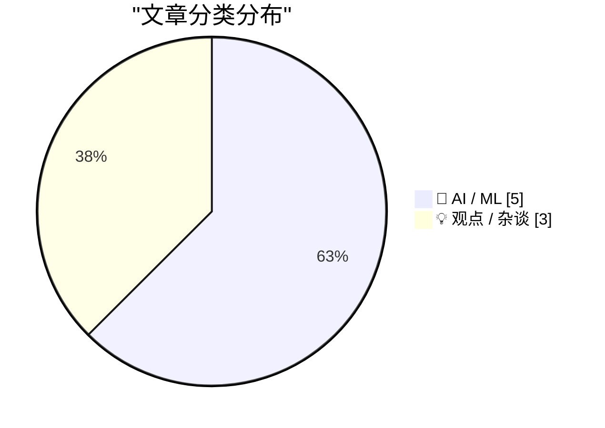
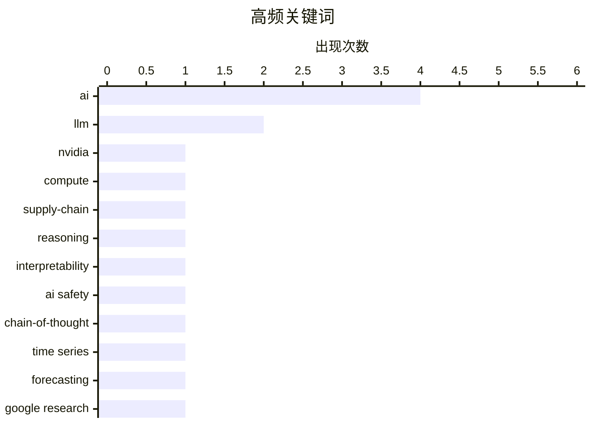

# 📰 AI 资讯每日精选 — 2026-09-13

> 汇聚 156+ 技术博客、X/Twitter、Hacker News、Reddit、Product Hunt、
> Lobste.rs、ClawFeed 日报及 GitHub Trending，经 AI 评分筛选。
>
> **本期内容**：🏆 今日必读 · 🌐 ClawFeed 日报 · 🔥 GitHub Trending · 📂 分类精选 · 📊 数据概览 · 🎯 项目相关情报

## 📝 今日看点

今日看点：技术圈的焦点正从“模型又变强了”转向“AI如何成为基础设施、又如何被理解与约束”。英伟达被比作AI时代的中央银行，叠加AMD GPU本地部署与大模型代理任务，显示算力、工具链和生态枢纽仍是产业竞争核心。与此同时，新研究揭示模型推理步骤与内部状态存在对应关系，谷歌TimesFM-3则把预测推向结合外部事件的一次性生成，说明可解释性与实用预测正在同步推进。围绕数学家专业能力、AI发展速度以及“LLM是真的、AI是假的”等争论，也折射出AI跃迁正在冲击专业评价体系，并激化监管与减速话语中的立场分歧。

---

## 🏆 今日必读

🥇 **英伟达是AI的中央银行**

[Nvidia is the central bank of AI](https://www.economist.com/interactive/briefing/2026/09/03/nvidia-is-the-central-bank-of-ai) — Hacker News Best · 13 小时前 · 🤖 AI / ML

> 《经济学人》的一篇简报将英伟达比作AI时代的“中央银行”，讨论其在AI产业链中的核心地位。文章以这一比喻切入，分析英伟达在算力供给与生态中的枢纽角色。该文在Hacker News上获得420点、288条评论，引发广泛讨论。作者的核心观点是英伟达在AI领域的影响力已类似央行对金融体系的掌控。

💡 **为什么值得读**: 用“中央银行”这一犀利比喻理解英伟达在AI产业中的权力结构，适合关注AI经济与产业格局的读者。

🏷️ Nvidia, AI, compute, supply-chain

🥈 **新研究发现：AI模型写出的推理步骤对应着不同的内部模式**

[AI models' written reasoning steps correspond to distinct internal patterns, a new study finds](https://the-decoder.com/ai-models-written-reasoning-steps-correspond-to-distinct-internal-patterns-a-new-study-finds/) — The Decoder · 14 小时前 · 🤖 AI / ML · **二手来源**

> 一项新研究发现，AI模型写出的推理步骤与其内部状态存在对应关系。计算、公式检索和演绎等推理步骤在模型内部状态中清晰可辨，尤其在中层。这一发现对AI安全有重要意义，因为模型处理的信息比其可见的思维链所揭示的更多。

💡 **为什么值得读**: 揭示模型“说的”与“想的”之间的差距，是理解AI可解释性与安全风险的关键线索。

🏷️ reasoning, interpretability, AI safety, chain-of-thought

🥉 **谷歌新AI模型可依据销售数据、天气和折扣安排预测未来**

[Google's new AI model predicts the future from sales data, weather, and discount schedules](https://the-decoder.com/googles-new-ai-model-predicts-the-future-from-sales-data-weather-and-discount-schedules/) — The Decoder · 19 小时前 · 🤖 AI / ML · **二手来源**

> 谷歌研究发布了TimesFM-3，这是一个预测模型，可结合时间序列与相关数据以及已知的未来事件（如促销活动或天气预报）进行分析。该模型拥有3.3亿参数，不再逐步预测未来，而是一次性填充所有未来时间点，从而缩短计算时间并减少误差累积。

💡 **为什么值得读**: 一次性预测所有未来时间点的思路，为时间序列预测的算力效率与误差控制提供了新方案。

🏷️ time series, forecasting, Google Research, TimesFM

4️⃣ **AI正在打破我们衡量专业能力的代理指标**

[AI is breaking our proxies for expertise](https://seangoedecke.com/ai-is-breaking-our-proxies-for-expertise/) — seangoedecke.com · 4 小时前 · 💡 观点 / 杂谈 · **待核实**

> 数学家群体总体上并不反对AI，相比艺术家或作家，他们在文化上更愿意将AI作为工具使用。然而，随着越来越多真正有分量的数学问题被AI攻克，这种态度可能正在改变。文章提到近五千名数学家（包括二十五位菲尔兹奖得主）的相关行动，讨论AI如何动摇人们以往用来判断专业能力的代理指标。

💡 **为什么值得读**: 当AI能解决“真正有声望”的难题时，我们判断谁是专家的旧标准正在失效，值得思考。

🏷️ AI, expertise, mathematics, research

5️⃣ **Pluralistic：LLM是真的，AI是假的（2026年9月12日）**

[Pluralistic: LLMs are real, AI is fake (12 Sep 2026)](https://pluralistic.net/2026/09/12/god-in-the-box/) — pluralistic.net · 17 小时前 · 💡 观点 / 杂谈

> 文章标题提出“LLM是真的，AI是假的”，并明确表示“不，它没有‘失控’”。该文是Pluralistic的当日链接合集，除主论点外还包含多个杂项链接，涉及9·11、博客、吉米·威尔士与《大英百科全书》主编、好莱坞在澳大利亚的公关操作、代理与酷儿青少年小说、腐败警察的软着陆、泄露的Stingray手册等话题。

💡 **为什么值得读**: 对“AI失控”叙事的一次直接反驳，适合想厘清LLM与AI概念混淆的读者。

🏷️ LLM, AI, critique, Cory Doctorow

---

## 🌐 ClawFeed 日报精选

> 来源：[ClawFeed](https://clawfeed.kevinhe.io) — AI 驱动的多源新闻聚合

📅 ClawFeed Daily | 2026-09-12 (5 期 4h 汇总)

Sources: #1188 (00:00-03:59) · #1189 (04:00-07:59) · #1190 (08:00-11:59) · #1191 (12:00-15:59) · #1192 (16:00-19:59)
Total: feed ~141 / bookmarks 20 / errors 0

---

🔥 当日全场 Top 5

1. **Kimi（月之暗面）16 人被带走含负责人** — 与 Anthropic 入侵报告中"非法蒸馏"指控直接相关：月之暗面将客户请求偷偷转给 Claude，再把 Claude 回答当作 Kimi 输出。AI 合规执法里程碑事件。(#1190)

2. **OpenAI 双重发布：Agents API + ChatGPT 语音系统开放** — Agents API 把 Codex 背后的 Agent harness 直接开放为一等公民 API，Agent 基础设施公司需重新审视护城河；语音系统覆盖 10 亿用户，全双工+工具调用。(#1189, #1190)

3. **Cursor Projects：协调 Agent 指挥成百上千子 Agent** — 不写代码的协调层，功能开发/PR 迁移/代码维护全覆盖，可靠性靠 PR+CI 兜底。与 Grok Bot（单 Agent 执行）形成差异化。(#1192)

4. **美国财政部长债回购信号反转 + 10 年期收益率冲 5%** — 扩大单次回购上限至 60 亿美元，但市场解读为财政部自己也担心长债不好卖。叠加特朗普称美伊战争将很快结束/油价暴跌。(#1191, #1192)

5. **RWA 永续交易量 8 月达 6020 亿美元创历史新高** — Binance 稳居首位（bStocks 3 个月 $300 亿），OKX 紧随，Gate 增长最快。Kalshi 计划申请美国监管批准约 60 种股票永续合约（Tesla/Apple/Nvidia），若获批将成美国首批受监管单一股票永续合约。(#1189, #1190, #1191)

---

📰 当日核心主题

**Agent 基础设施竞赛加速**
当天最密集的主题。OpenAI Agents API、Cursor Projects、Cloudflare @cloudflare/computer（Agent 虚拟电脑）、LangSmith Engine（Agent for Agent Engineering）、SkySynth（形式化验证 Agent 代码）、Agent harness 90 秒讲解、看板管理 Agent 任务——从平台到工具到方法论全线推进。"如果你不在做模型，你就在做 harness"成为当日金句。

**AI 合规与安全治理**
Kimi 非法蒸馏执法事件 + Anthropic 154 页武器化报告被批为 pre-IPO pitch + Nvidia CEO 称 AI 安全恐慌是"行业制造的歇斯底里" + David Sacks 拆解"doomer op" + 量子计算攻击 BTC/ETH 密钥基准减半 + 6TB Fable 数据集泄漏。安全叙事正在分裂为"真风险"和"叙事武器"两极。

**RWA/金融创新**
RWA 永续 $602B 新高 + Kalshi 60 种股票永续合约 + UniCredit 数字资产布局 + The Smarter Web 伦敦 IPO（2747 BTC） + SBF 最高法院请愿。传统金融和 crypto 的交叉点持续加深。

**开源/Builder 生态**
腾讯 AuK 语音全能模型开源 + Nous Research Hermes 技能中心 + wanman.ai 一人公司 OS 开源 + Meme Radar 开源 + Claude for Open Source Program。

---

🔖 Bookmarks 精选（全天未变，汇总）
• Claude Code 系统提示词为最新模型削减约 80%
• AI 市场渗透率 <1%（$6T+ 知识工作者市场）
• AI Engineering 最重要技能地图
• Cloudflare Agent 虚拟电脑
• Matrix Agent 公司 OS 架构
• GPT-Realtime-2 实时翻译音频
• wanman.ai 一人公司 OS 开源
• 谢青池 36 项经典 AI 论文精选

---

💤 当日重复噪音模式
• Crypto meme 币喊单/矩阵号推广（多期反复出现）
• VPN/免费节点聚合推广
• 纯政治军事讨论（佛州恐怖组织定性等）
• 生活方式/健身/旅行内容（与 AI/crypto/tech 无关）---

## 🔥 GitHub Trending

> 今日热门开源项目（全语言 + Python）

| # | 项目 | 描述 | ⭐ 总星 | 📈 今日 | 语言 |
|---|------|------|---------|---------|------|
| 1 | [ayghri/i-have-adhd](https://github.com/ayghri/i-have-adhd) 🤖 | A skill to stop your coding agent from burying the answer... | 43.5k | +2584 | Python |
| 2 | [bilawalsidhu/gods-eye-view](https://github.com/bilawalsidhu/gods-eye-view) | A spy satellite simulator in your browser, except the dat... | 30.2k | +2265 | JavaScript |
| 3 | [jordan-gibbs/hyperresearch](https://github.com/jordan-gibbs/hyperresearch) 🤖 | Agent-driven research knowledge base. Agents collect, sea... | 3.1k | +642 | Python |
| 4 | [k2-fsa/OmniVoice](https://github.com/k2-fsa/OmniVoice) | High-Quality Voice Cloning TTS for 600+ Languages | 12.9k | +534 | Python |
| 5 | [melgarafael/DeskcommCRM](https://github.com/melgarafael/DeskcommCRM) 🤖 | Open-source AI sales OS — self-hosted CRM with native AI ... | 1.9k | +504 | TypeScript |
| 6 | [alsk1992/CloddsBot](https://github.com/alsk1992/CloddsBot) 🤖 | Open Source AI trading agent that operates autonomously a... | 2.6k | +376 | TypeScript |
| 7 | [github/spec-kit](https://github.com/github/spec-kit) | 💫 Toolkit to help you get started with Spec-Driven Devel... | 136.1k | +375 | Python |
| 8 | [p1neappleXpress/OpenFlux](https://github.com/p1neappleXpress/OpenFlux) | Network stack research tool. TCP tunnel with pluggable tr... | 1.4k | +355 | Go |
| 9 | [virgiliojr94/book-to-skill](https://github.com/virgiliojr94/book-to-skill) 🤖 | Turn any technical book PDF into a Claude Code skill — re... | 30.3k | +288 | Python |
| 10 | [jihe520/MathModelAgent](https://github.com/jihe520/MathModelAgent) 🤖 | 🤖📐专为数学建模设计的 Agent & skills ,自动完成数学建模，生成一份完整的可以直接提交的论文。 ... | 5.2k | +262 | Python |
| 11 | [armory3d/armorpaint](https://github.com/armory3d/armorpaint) | Graphics Creation Tools | 4.9k | +237 | C |
| 12 | [Shubhamsaboo/awesome-llm-apps](https://github.com/Shubhamsaboo/awesome-llm-apps) 🤖 | 100+ AI Agents, Agent Skills and RAG Apps - Free and Open... | 137.7k | +230 | Python |
| 13 | [Sonarr/Sonarr](https://github.com/Sonarr/Sonarr) | Smart PVR for newsgroup and bittorrent users. | 16.0k | +227 | C# |
| 14 | [D4Vinci/Scrapling](https://github.com/D4Vinci/Scrapling) | 🕷️ An adaptive Web Scraping framework that handles every... | 80.6k | +226 | Python |
| 15 | [asgeirtj/system_prompts_leaks](https://github.com/asgeirtj/system_prompts_leaks) 🤖 | Extracted system prompts from Anthropic - Claude Fable 5.... | 65.5k | +217 | JavaScript |

---

## 🤖 AI / ML

### 1. 英伟达是AI的中央银行

[Nvidia is the central bank of AI](https://www.economist.com/interactive/briefing/2026/09/03/nvidia-is-the-central-bank-of-ai) — **Hacker News Best** · 13 小时前 · ⭐ 24/30

> 《经济学人》的一篇简报将英伟达比作AI时代的“中央银行”，讨论其在AI产业链中的核心地位。文章以这一比喻切入，分析英伟达在算力供给与生态中的枢纽角色。该文在Hacker News上获得420点、288条评论，引发广泛讨论。作者的核心观点是英伟达在AI领域的影响力已类似央行对金融体系的掌控。

🏷️ Nvidia, AI, compute, supply-chain

---

### 2. 新研究发现：AI模型写出的推理步骤对应着不同的内部模式

[AI models' written reasoning steps correspond to distinct internal patterns, a new study finds](https://the-decoder.com/ai-models-written-reasoning-steps-correspond-to-distinct-internal-patterns-a-new-study-finds/) — **The Decoder** · 14 小时前 · ⭐ 24/30 · **二手来源**

> 一项新研究发现，AI模型写出的推理步骤与其内部状态存在对应关系。计算、公式检索和演绎等推理步骤在模型内部状态中清晰可辨，尤其在中层。这一发现对AI安全有重要意义，因为模型处理的信息比其可见的思维链所揭示的更多。

🏷️ reasoning, interpretability, AI safety, chain-of-thought

---

### 3. 谷歌新AI模型可依据销售数据、天气和折扣安排预测未来

[Google's new AI model predicts the future from sales data, weather, and discount schedules](https://the-decoder.com/googles-new-ai-model-predicts-the-future-from-sales-data-weather-and-discount-schedules/) — **The Decoder** · 19 小时前 · ⭐ 24/30 · **二手来源**

> 谷歌研究发布了TimesFM-3，这是一个预测模型，可结合时间序列与相关数据以及已知的未来事件（如促销活动或天气预报）进行分析。该模型拥有3.3亿参数，不再逐步预测未来，而是一次性填充所有未来时间点，从而缩短计算时间并减少误差累积。

🏷️ time series, forecasting, Google Research, TimesFM

---

### 4. 用GPT-6 Astra和ChatGPT Work生成跑步路线

[Generating running routes with GPT-6 Astra and ChatGPT Work](https://simonwillison.net/2026/Sep/12/astra-running-routes/) — **simonwillison.net** · 4 小时前 · ⭐ 21/30

> 作者让ChatGPT Work配合GPT-6 Astra（Max）完成一项任务：根据其住址，使用OSM数据规划从家出发的5公里和10公里环形跑步路线。模型运行了27分钟，产出了嵌入可视化以及可下载的GPX文件和GeoJSON文件，结果完全符合要求。

🏷️ LLM, ChatGPT, agents, OSM

---

### 5. ProxiMax H3的Team Red第二部分（Ubuntu版）：在AMD GPU RDNA 4（rx9070、AI Pro R9700）和RDNA 3（rx7900）上运行ComfyUI+MMH3

[Team Red from ProxiMax H3 Part 2 (Ubuntu edition): ComfyUI+MMH3 with AMD GPUsRDNA 4 (rx9070, AI Pro R9700), and RDNA 3 (rx7900)](https://www.reddit.com/r/StableDiffusion/comments/1wer1mz/team_red_from_proximax_h3_part_2_ubuntu_edition/) — **r/StableDiffusion** · 5 小时前 · ⭐ 21/30

> 这是ProxiMax H3系列“Team Red”的第二部分，聚焦Ubuntu环境下在AMD GPU上运行ComfyUI与MMH3。涉及RDNA 4架构的rx9070和AI Pro R9700，以及RDNA 3架构的rx7900。内容面向希望在AMD显卡上搭建Stable Diffusion工作流的用户。

🏷️ ComfyUI, AMD-GPU, MiniMax, video-generation

---

## 💡 观点 / 杂谈

### 6. AI正在打破我们衡量专业能力的代理指标

[AI is breaking our proxies for expertise](https://seangoedecke.com/ai-is-breaking-our-proxies-for-expertise/) — **seangoedecke.com** · 4 小时前 · ⭐ 24/30 · **待核实**

> 数学家群体总体上并不反对AI，相比艺术家或作家，他们在文化上更愿意将AI作为工具使用。然而，随着越来越多真正有分量的数学问题被AI攻克，这种态度可能正在改变。文章提到近五千名数学家（包括二十五位菲尔兹奖得主）的相关行动，讨论AI如何动摇人们以往用来判断专业能力的代理指标。

🏷️ AI, expertise, mathematics, research

---

### 7. Pluralistic：LLM是真的，AI是假的（2026年9月12日）

[Pluralistic: LLMs are real, AI is fake (12 Sep 2026)](https://pluralistic.net/2026/09/12/god-in-the-box/) — **pluralistic.net** · 17 小时前 · ⭐ 22/30

> 文章标题提出“LLM是真的，AI是假的”，并明确表示“不，它没有‘失控’”。该文是Pluralistic的当日链接合集，除主论点外还包含多个杂项链接，涉及9·11、博客、吉米·威尔士与《大英百科全书》主编、好莱坞在澳大利亚的公关操作、代理与酷儿青少年小说、腐败警察的软着陆、泄露的Stingray手册等话题。

🏷️ LLM, AI, critique, Cory Doctorow

---

### 8. 除了我，所有人都应该放慢AI发展

[Everyone should slow down AI development except for me](https://xeiaso.net/notes/2026/everyone-slowdown-but-me/) — **Hacker News Best** · 4 小时前 · ⭐ 21/30

> 文章标题讽刺性地提出“除了我，所有人都应该放慢AI发展”，讨论AI发展速度之争中的双重标准问题。该文在Hacker News上获得233点、125条评论，引发关于AI减速主张与自身利益之间矛盾的讨论。

🏷️ AI, regulation, policy, development

---

## 📊 数据概览

| 扫描源 | 抓取文章 | 时间范围 | 精选 |
|:---:|:---:|:---:|:---:|
| 100/156 | 5239 篇 → 80 篇 | 24h | **8 篇** |

### 分类分布



### 高频关键词



<details>
<summary>📈 纯文本关键词图（终端友好）</summary>

```
ai               │ ████████████████████ 4
llm              │ ██████████░░░░░░░░░░ 2
nvidia           │ █████░░░░░░░░░░░░░░░ 1
compute          │ █████░░░░░░░░░░░░░░░ 1
supply-chain     │ █████░░░░░░░░░░░░░░░ 1
reasoning        │ █████░░░░░░░░░░░░░░░ 1
interpretability │ █████░░░░░░░░░░░░░░░ 1
ai safety        │ █████░░░░░░░░░░░░░░░ 1
chain-of-thought │ █████░░░░░░░░░░░░░░░ 1
time series      │ █████░░░░░░░░░░░░░░░ 1
```

</details>

### 🏷️ 话题标签

**ai**(4) · **llm**(2) · **nvidia**(1) · compute(1) · supply-chain(1) · reasoning(1) · interpretability(1) · ai safety(1) · chain-of-thought(1) · time series(1) · forecasting(1) · google research(1) · timesfm(1) · expertise(1) · mathematics(1) · research(1) · critique(1) · cory doctorow(1) · regulation(1) · policy(1)

---

## 🎯 项目相关情报

### Agent 基座安全与合规

> 暂无达到质量门槛的项目相关情报。

### 多 Agent 架构

> 暂无达到质量门槛的项目相关情报。

### ASR 与语音助手

> 暂无达到质量门槛的项目相关情报。

### 商品包装 OCR

> 暂无达到质量门槛的项目相关情报。

---

*生成于 2026-09-13 04:39 | 汇聚 156 个技术博客、X/Twitter、Hacker News、Reddit、Product Hunt、Lobste.rs、ClawFeed 日报及 GitHub Trending，经 AI 评分筛选出 Top 8 精华内容*
