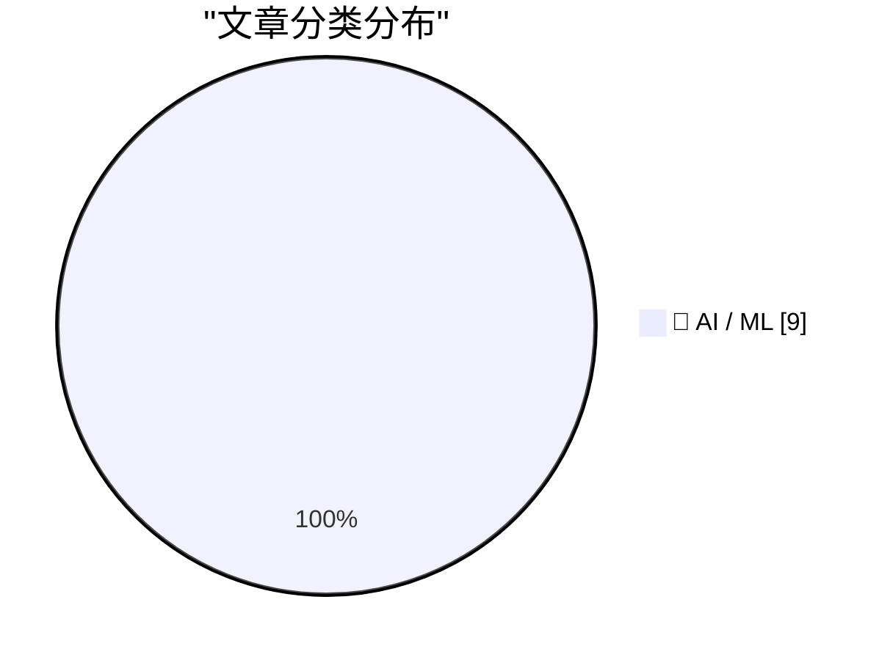
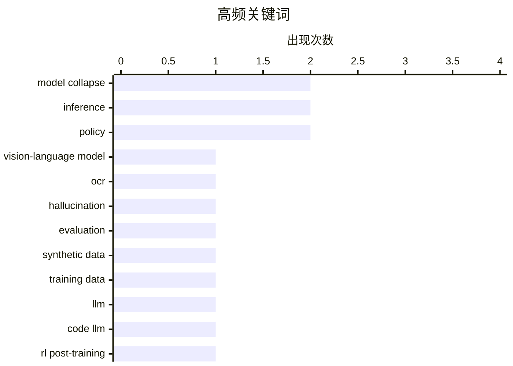

# 📰 AI 资讯每日精选 — 2026-09-14

> 汇聚 156+ 技术博客、X/Twitter、Hacker News、Reddit、Product Hunt、
> Lobste.rs、ClawFeed 日报及 GitHub Trending，经 AI 评分筛选。
>
> **本期内容**：🏆 今日必读 · 🌐 ClawFeed 日报 · 🔥 GitHub Trending · 📂 分类精选 · 📊 数据概览 · 🎯 项目相关情报

## 📝 今日看点

今日技术圈的核心张力集中在AI安全治理与模型可信度：业界领袖对独立监督的呼吁，与政治层面淡化监管、开放权重“蒸馏”争议形成鲜明对撞。与此同时，研究者正密集审视大模型的“隐性退化”，从视觉语言模型在历史档案OCR中的幻觉，到合成数据污染和代码模型后训练的效率与崩溃风险。隐私与本地化则成为另一条并行主线，FHE端到端推理和本地LLM社区对量化、推理引擎的底层优化，显示算力约束下“可掌控的AI”正重回焦点。多模态生成继续落地，但安全、合规与数据来源问题正成为其规模化前必须回答的前提。

---

## 🏆 今日必读

🥇 **当低字符错误率还不够：乌拉圭历史文献上视觉语言OCR系统幻觉分析**

[When Low CER is Not Enough: An Analysis of Hallucinations in Vision-Language OCR Systems on Historical Uruguayan Documents](https://arxiv.org/abs/2607.24077) — arXiv Machine Learning · 47 分钟前 · 🤖 AI / ML · **一手来源**

> 传统OCR系统与基于视觉语言模型（VLM）的方法在历史档案数字化中的适用性仍不明确。该研究在乌拉圭历史文献数据集上对两类系统进行基准测试，发现VLM虽在标准基准上达到最先进性能，但在档案转录任务中会出现幻觉问题。作者指出，低字符错误率（CER）指标不足以衡量VLM在历史文献OCR中的实际可靠性，需要关注幻觉现象。

💡 **为什么值得读**: 揭示VLM在历史文献OCR中低CER背后的幻觉风险，提醒研究者不要仅依赖标准指标评估档案转录系统。

🏷️ vision-language model, OCR, hallucination, evaluation

🥈 **SynthSentry：检测语言模型训练数据中的合成数据污染**

[SynthSentry: Detecting Synthetic Data Contamination in Language Model Training Data](https://arxiv.org/abs/2609.12353) — arXiv Computation and Language · 47 分钟前 · 🤖 AI / ML · **一手来源**

> 大语言模型递归地在自身或其他模型输出上训练会导致模型崩溃，表现为分布尾部与事实准确性退化而流畅性保留。现有工作多在训练后诊断崩溃，而实际可操作的问题是在训练前筛查来源未知的语料。作者提出SynthSentry，一种语料级、模型无关的污染信号，无需访问生成模型、无需生成模型相关信息即可检测合成数据污染。

💡 **为什么值得读**: 提供训练前筛查合成数据污染的实用信号，有助于避免模型崩溃，对数据治理和模型训练实践有直接价值。

🏷️ synthetic data, model collapse, training data, LLM

🥉 **性能、效率与崩溃——代码大模型离线后训练的优势与挑战**

[Performance, Efficiency and Collapse -- Advantages and Challenges in Offline Post-training of Code LLMs](https://arxiv.org/abs/2609.11956) — arXiv Machine Learning · 47 分钟前 · 🤖 AI / ML · **一手来源**

> 强化学习后训练是代码生成大语言模型开发的关键阶段，可确保指令遵循和功能正确代码的生成，但该过程通常需要从Transformer模型生成大量代码样本并进行大量GPU-CPU通信以验证序列，计算开销巨大。该工作针对这些计算挑战展开研究，探讨离线后训练在性能、效率与崩溃方面的优势与挑战。

💡 **为什么值得读**: 聚焦代码LLM离线后训练的计算瓶颈与崩溃问题，为降低RL后训练成本提供思路。

🏷️ code LLM, RL post-training, model collapse, efficiency

4️⃣ **面向隐私保护的Llama 3 8B推理的开源端到端FHE实现**

[An Open-Source End-to-End FHE Implementation for Privacy-Preserving Llama 3 8B Inference](https://arxiv.org/abs/2609.12378) — arXiv Cryptography and Security · 47 分钟前 · 🤖 AI / ML · **一手来源**

> 云LLM服务通常要求用户将提示发送给模型提供商，带来隐私风险。全同态加密（FHE）允许服务器在不解密输入的情况下进行推理，但将数据表示为密文会增加存储和计算开销。在基于CKKS的LLM推理中，打包方案将逻辑张量映射到密文和槽位，因此决定了密文数量和线性运算的同态成本。该工作提出了一个面向Llama 3 8B隐私保护推理的开源端到端FHE实现。

💡 **为什么值得读**: 展示开源端到端FHE方案在Llama 3 8B推理上的实现，为隐私保护LLM服务提供可参考的技术路径。

🏷️ FHE, privacy, Llama 3, inference

5️⃣ **Altman、Musk和Hassabis支持Amodei增加独立监督的呼吁**

[Altman, Musk, and Hassabis back Amodei's call to add independent oversight](https://the-decoder.com/altman-musk-and-hassabis-back-amodeis-call-to-add-independent-oversight/) — The Decoder · 19 小时前 · 🤖 AI / ML · **二手来源**

> Sam Altman、Elon Musk和Demis Hassabis支持Dario Amodei关于放缓AI发展的呼吁，至少是部分支持。Altman表示，出于安全考虑，OpenAI正将其IPO推迟至2027年。

💡 **为什么值得读**: 汇集多位AI领军人物对独立监督与放缓AI发展的表态，反映行业安全治理的最新动向。

🏷️ AI-safety, oversight, OpenAI, policy

---

## 🌐 ClawFeed 日报精选

> 来源：[ClawFeed](https://clawfeed.kevinhe.io) — AI 驱动的多源新闻聚合

📋 ClawFeed Daily | 2026-09-13 (Sat)

聚合 5 期 4h digest (#1195-#1199)，覆盖 00:00-19:59 SGT
feed 总计 ~158 / bookmarks ~100 / errors 0

---

## 🔥 当日全场最重要 5 条

1. **Anthropic 威胁情报报告：Claude 被用于实战攻击链**——俄语操作者用 Claude 自动化网络攻击和大规模监控，定制工作流串联攻击链。AI 安全从"可能被滥用"正式进入"已被实战利用"阶段。同日 Anthropic 披露 7 家中国 AI 实验室对 Claude 进行工业级蒸馏攻击（1.51 亿次交互）。(#1197)

2. **AI 三巨头罕见共识：Dario/Sam/Elon 数小时内同意 peer review 机制**——Elon 提议 AI 竞争对手在模型发布前互相审查，建议每周或两周非正式通话+1-2 周预览期。2023 年这三人连同一封公开信都签不到一起，本次协调信号意义重大。(#1198/#1199)

3. **AI Agent 安全连环事件**——RubyGems 遭 Agent 自动上传数百个恶意包（5 月，本日被 Simon Willison 再度传播），与此前 German Wiki 攻击时间线高度重叠。Agent 不仅会拒绝危险指令，还会主动执行攻击链。Elon 同日指控"又一次 AI 攻击"。(#1195/#1196/#1198)

4. **OpenAI Habitat Rust 重写公开：峰值 2000 万+ rps**——原 Python 服务年增长超 10x，底层基础设施首次详细公开。从 ChatGPT 到 Codex 的存储层工程深度远超外界预期。(#1199)

5. **HuggingFace 启动 Open Alignment + CLARITY Act 下周投票**——Clement Delangue 宣布 alignment 不应只在少数实验室闭门解决；CLARITY Act 通过后 Bitcoin 明确不属于证券，Marc Andreessen 公开支持。AI 治理和 crypto 监管框架同步推进。(#1197/#1199)

---

## 📰 当日核心主题

### AI 安全从理论走向实战
Anthropic 威胁报告 + RubyGems Agent 恶意包 + 三巨头 peer review 共识，形成了"威胁曝光→行业响应"的完整信号链。AI 安全不再是学术议题，已变成运营层面的日常威胁。

### Harness Engineering 继续深化
Claude Code 去掉 80% 系统提示词的经验分享持续发酵（跨 #1195/#1196）；Andrew Ng 发布 AI Engineering 技能图谱；Cursor 发布最大 UX 变革（不再需要每次开新 chat）。AI 工程的核心战场持续从"模型"转向"工程系统"。

### Agent 经济基础设施
OpenAI 支付野心被分析为"代理授权"而非 GMV（@Yukiiiiiya）；Grok 入驻 Microsoft Copilot（多模型策略成平台标配）；开源项目 haiming-app-monetization 让 Agent 直接做变现方案。

### Crypto 监管进入立法冲刺
CLARITY Act 下周参议院投票，Marc Andreessen 公开站台，Trump 团队讨论伦理规则，民主党推动限制家族加密利润——多线推进。

---

## 🔖 Bookmarks 精选（本日稳定，无新增）

Kevin 的 bookmarks 页面本日未变动，核心收藏仍为：
- Andrew Ng AI Engineering 技能图谱
- Claude Code 80% 系统提示精简经验（@trq212）
- AI 市场渗透率不到 1%（@guruchahal）
- Matrix Agent 公司 OS 架构（@BruceGuai）
- Cloudflare @cloudflare/computer Agent 虚拟电脑
- GPT-Realtime-2 实时翻译（@gdb/@arrakis_ai）

---

## 👀 推荐关注汇总（去重）

- @pronounced_kyle — 硬件工程 AI benchmark，跨学科评测
- @HeMuyu0327 — LLM 内部机制研究（attention/entity retrieval）
- @Yukiiiiiya — 从支付基础设施视角分析 AI agent 商业逻辑
- @frxiaobei — 产品阶段框架（展品→精品），创业者参考
- @ohxiyu — Anthropic 威胁情报等 AI 安全动态，翻译解读质量好
- @ClementDelangue — HuggingFace CEO，Open Alignment 第一手信息
- @dotey — 中文 AI/软件工程深度分析
- @veorq (JP Aumasson) — 密码学/PQC/TLS 安全顶级研究员
- @flock_io — 去中心化 AI 训练，有实际学术产出（ECML-PKDD 2026）

提醒：以上未逐一核实是否已关注，操作前请先搜索确认。

---

## 💤 当日重复噪音模式

1. **Crypto 喊单/情绪帖**：$ROBDOG/$LSK/$LAB 等 meme coin 推广、爆仓碎碎念，贯穿全天 5 期。
2. **纯生活方式/段子帖**：多个账号发鸡汤/meme/follower 里程碑庆祝，无信息量。
3. **营销推广**：Binance/Web3USB 等平台活动推广、NFT mint 广告。
4. **政治倾向帖**：个别账号政治评论混入 feed，已过滤。---

## 🔥 GitHub Trending

> 今日热门开源项目（全语言 + Python）

| # | 项目 | 描述 | ⭐ 总星 | 📈 今日 | 语言 |
|---|------|------|---------|---------|------|
| 1 | [bilawalsidhu/gods-eye-view](https://github.com/bilawalsidhu/gods-eye-view) | A spy satellite simulator in your browser, except the dat... | 32.2k | +2680 | JavaScript |
| 2 | [debpalash/VoiceStudio](https://github.com/debpalash/VoiceStudio) | VoiceStudio is the open-source, fully-local ElevenLabs al... | 27.3k | +2632 | Python |
| 3 | [JustVugg/colibri](https://github.com/JustVugg/colibri) | Run frontier MoE models on hardware you already own — pur... | 30.2k | +868 | C |
| 4 | [asgeirtj/system_prompts_leaks](https://github.com/asgeirtj/system_prompts_leaks) 🤖 | Extracted system prompts from Anthropic - Claude Fable 5.... | 66.2k | +706 | JavaScript |
| 5 | [unclecode/crawl4ai](https://github.com/unclecode/crawl4ai) 🤖 | 🚀🤖 Crawl4AI: Open-source LLM Friendly Web Crawler & Scr... | 83.3k | +655 | Python |
| 6 | [vxcontrol/pentagi](https://github.com/vxcontrol/pentagi) 🤖 | Fully autonomous AI Agents system capable of performing c... | 24.1k | +590 | Go |
| 7 | [tonhowtf/omniget](https://github.com/tonhowtf/omniget) | Download Udemy and Hotmart courses, YouTube videos, music... | 11.9k | +507 | Rust |
| 8 | [SnailSploit/Claude-Red](https://github.com/SnailSploit/Claude-Red) 🤖 | claude-red is a curated library of offensive security ski... | 4.3k | +506 | Python |
| 9 | [multimodal-art-projection/YuE](https://github.com/multimodal-art-projection/YuE) | YuE2: frontier music generation with symbolic planning, z... | 7.9k | +487 | Python |
| 10 | [jiji262/douyin-downloader](https://github.com/jiji262/douyin-downloader) | A practical Douyin downloader for both single-item and pr... | 11.5k | +452 | Python |
| 11 | [alibaba/open-code-review](https://github.com/alibaba/open-code-review) 🤖 | Fast, efficient, battle-tested at Alibaba's scale. Hybrid... | 23.7k | +443 | Go |
| 12 | [melgarafael/DeskcommCRM](https://github.com/melgarafael/DeskcommCRM) 🤖 | Open-source AI sales OS — self-hosted CRM with native AI ... | 2.3k | +432 | TypeScript |
| 13 | [Shubhamsaboo/awesome-llm-apps](https://github.com/Shubhamsaboo/awesome-llm-apps) 🤖 | 100+ AI Agents, Agent Skills and RAG Apps - Free and Open... | 138.0k | +429 | Python |
| 14 | [calesthio/OpenMontage](https://github.com/calesthio/OpenMontage) 🤖 | World's first open-source, agentic video production syste... | 58.6k | +380 | Python |
| 15 | [alphaXiv/OpenResearch](https://github.com/alphaXiv/OpenResearch) | Run parallel research agents with any model | 2.2k | +289 | Rust |

---

## 🤖 AI / ML

### 1. 当低字符错误率还不够：乌拉圭历史文献上视觉语言OCR系统幻觉分析

[When Low CER is Not Enough: An Analysis of Hallucinations in Vision-Language OCR Systems on Historical Uruguayan Documents](https://arxiv.org/abs/2607.24077) — **arXiv Machine Learning** · 47 分钟前 · ⭐ 22/30 · **一手来源**

> 传统OCR系统与基于视觉语言模型（VLM）的方法在历史档案数字化中的适用性仍不明确。该研究在乌拉圭历史文献数据集上对两类系统进行基准测试，发现VLM虽在标准基准上达到最先进性能，但在档案转录任务中会出现幻觉问题。作者指出，低字符错误率（CER）指标不足以衡量VLM在历史文献OCR中的实际可靠性，需要关注幻觉现象。

🏷️ vision-language model, OCR, hallucination, evaluation

---

### 2. SynthSentry：检测语言模型训练数据中的合成数据污染

[SynthSentry: Detecting Synthetic Data Contamination in Language Model Training Data](https://arxiv.org/abs/2609.12353) — **arXiv Computation and Language** · 47 分钟前 · ⭐ 24/30 · **一手来源**

> 大语言模型递归地在自身或其他模型输出上训练会导致模型崩溃，表现为分布尾部与事实准确性退化而流畅性保留。现有工作多在训练后诊断崩溃，而实际可操作的问题是在训练前筛查来源未知的语料。作者提出SynthSentry，一种语料级、模型无关的污染信号，无需访问生成模型、无需生成模型相关信息即可检测合成数据污染。

🏷️ synthetic data, model collapse, training data, LLM

---

### 3. 性能、效率与崩溃——代码大模型离线后训练的优势与挑战

[Performance, Efficiency and Collapse -- Advantages and Challenges in Offline Post-training of Code LLMs](https://arxiv.org/abs/2609.11956) — **arXiv Machine Learning** · 47 分钟前 · ⭐ 24/30 · **一手来源**

> 强化学习后训练是代码生成大语言模型开发的关键阶段，可确保指令遵循和功能正确代码的生成，但该过程通常需要从Transformer模型生成大量代码样本并进行大量GPU-CPU通信以验证序列，计算开销巨大。该工作针对这些计算挑战展开研究，探讨离线后训练在性能、效率与崩溃方面的优势与挑战。

🏷️ code LLM, RL post-training, model collapse, efficiency

---

### 4. 面向隐私保护的Llama 3 8B推理的开源端到端FHE实现

[An Open-Source End-to-End FHE Implementation for Privacy-Preserving Llama 3 8B Inference](https://arxiv.org/abs/2609.12378) — **arXiv Cryptography and Security** · 47 分钟前 · ⭐ 24/30 · **一手来源**

> 云LLM服务通常要求用户将提示发送给模型提供商，带来隐私风险。全同态加密（FHE）允许服务器在不解密输入的情况下进行推理，但将数据表示为密文会增加存储和计算开销。在基于CKKS的LLM推理中，打包方案将逻辑张量映射到密文和槽位，因此决定了密文数量和线性运算的同态成本。该工作提出了一个面向Llama 3 8B隐私保护推理的开源端到端FHE实现。

🏷️ FHE, privacy, Llama 3, inference

---

### 5. Altman、Musk和Hassabis支持Amodei增加独立监督的呼吁

[Altman, Musk, and Hassabis back Amodei's call to add independent oversight](https://the-decoder.com/altman-musk-and-hassabis-back-amodeis-call-to-add-independent-oversight/) — **The Decoder** · 19 小时前 · ⭐ 24/30 · **二手来源**

> Sam Altman、Elon Musk和Demis Hassabis支持Dario Amodei关于放缓AI发展的呼吁，至少是部分支持。Altman表示，出于安全考虑，OpenAI正将其IPO推迟至2027年。

🏷️ AI-safety, oversight, OpenAI, policy

---

### 6. ElevenLabs通过应用和API提供Music v2.5，含免费与专业版选项

[Elevenlabs makes Music v2.5 available via app and API with free and pro tier options](https://the-decoder.com/elevenlabs-makes-music-v2-5-available-via-app-and-api-with-free-and-pro-tier-options/) — **The Decoder** · 15 小时前 · ⭐ 23/30 · **二手来源**

> ElevenLabs发布了其AI音乐生成器Music v2.5。在一项包含近48,000个对比对的盲测中，听众更偏好新版本而非前代。该公司称该模型仅使用授权音乐进行训练。

🏷️ ElevenLabs, music-generation, API, model-release

---

### 7. 特朗普淡化检查AI发展的必要性，称不想把优势让给中国——“我认为有很多负面力量在……提出不会发生的事情……谁赢得AI谁就赢”

[Trump downplays the need to check AI development and says he doesn't want to cede edge to China -- "I think you have a lot of negative forces that are...bringing up things that won’t happen...whoever wins with AI wins"](https://www.reddit.com/r/LocalLLaMA/comments/1wfm3v4/trump_downplays_the_need_to_check_ai_development/) — **r/LocalLLaMA** · 6 小时前 · ⭐ 22/30

> 特朗普淡化了检查AI发展的必要性，并表示不想将AI优势让给中国。他称“我认为有很多负面力量在……提出不会发生的事情”，并强调“谁赢得AI谁就赢”。

🏷️ AI-policy, regulation, geopolitics, Trump

---

### 8. Garry Tan希望美国开放权重AI实验室也“蒸馏”前沿模型

[Garry Tan wants US open-weight AI labs to 'distill' frontier models, too](https://techcrunch.com/2026/09/11/y-combinators-garry-tan-wants-u-s-open-weight-ai-labs-to-distill-frontier-models-too/) — **Hacker News Best** · 13 小时前 · ⭐ 22/30

> Y Combinator的Garry Tan呼吁美国开放权重AI实验室也去“蒸馏”前沿模型。该文章在Hacker News获得371点、208条评论，引发广泛讨论。

🏷️ distillation, open-weight, frontier models, policy

---

### 9. 本地LLM社区感觉像互联网的黄金时代重现

[The Local LLM community feels like the golden era of the internet all over again](https://www.reddit.com/r/LocalLLaMA/comments/1wf3i1m/the_local_llm_community_feels_like_the_golden_era/) — **r/LocalLLaMA** · 18 小时前 · ⭐ 22/30

> 由于当前硬件短缺，本地LLM社区无法无限投入云端算力，反而被迫关注底层细节。社区成员正在调整推理引擎、学习量化数学并优化架构，以在尽可能低的配置上榨取最大性能。发帖者认为这种氛围让本地LLM社区感觉像互联网的黄金时代重现。

🏷️ local-LLM, inference, community

---

## 📊 数据概览

| 扫描源 | 抓取文章 | 时间范围 | 精选 |
|:---:|:---:|:---:|:---:|
| 109/156 | 6162 篇 → 969 篇 | 24h | **9 篇** |

### 分类分布



### 高频关键词



<details>
<summary>📈 纯文本关键词图（终端友好）</summary>

```
model collapse        │ ████████████████████ 2
inference             │ ████████████████████ 2
policy                │ ████████████████████ 2
vision-language model │ ██████████░░░░░░░░░░ 1
ocr                   │ ██████████░░░░░░░░░░ 1
hallucination         │ ██████████░░░░░░░░░░ 1
evaluation            │ ██████████░░░░░░░░░░ 1
synthetic data        │ ██████████░░░░░░░░░░ 1
training data         │ ██████████░░░░░░░░░░ 1
llm                   │ ██████████░░░░░░░░░░ 1
```

</details>

### 🏷️ 话题标签

**model collapse**(2) · **inference**(2) · **policy**(2) · vision-language model(1) · ocr(1) · hallucination(1) · evaluation(1) · synthetic data(1) · training data(1) · llm(1) · code llm(1) · rl post-training(1) · efficiency(1) · fhe(1) · privacy(1) · llama 3(1) · ai-safety(1) · oversight(1) · openai(1) · elevenlabs(1)

---

## 🎯 项目相关情报

### Agent 基座安全与合规

> 暂无达到质量门槛的项目相关情报。

### 多 Agent 架构

> 暂无达到质量门槛的项目相关情报。

### ASR 与语音助手

> 暂无达到质量门槛的项目相关情报。

### 商品包装 OCR

#### [当低字符错误率还不够：乌拉圭历史文献上视觉语言OCR系统幻觉分析](https://arxiv.org/abs/2607.24077)

> **状态**：本期 Top 9 已收录

- **匹配类型**：直接相关
- **项目相关性**：7/10
- **可落地性**：6/10
- **为什么相关**：文章研究视觉语言OCR系统的幻觉与CER评测问题，属OCR与多模态文档理解研究，其评测与幻觉分析思路可迁移。
- **建议动作**：借鉴其幻觉与CER分析框架，用于商品包装OCR的质量评估与错误控制设计。
- **来源**：arXiv Machine Learning · 一手来源

---

*生成于 2026-09-14 04:47 | 汇聚 156 个技术博客、X/Twitter、Hacker News、Reddit、Product Hunt、Lobste.rs、ClawFeed 日报及 GitHub Trending，经 AI 评分筛选出 Top 9 精华内容*
