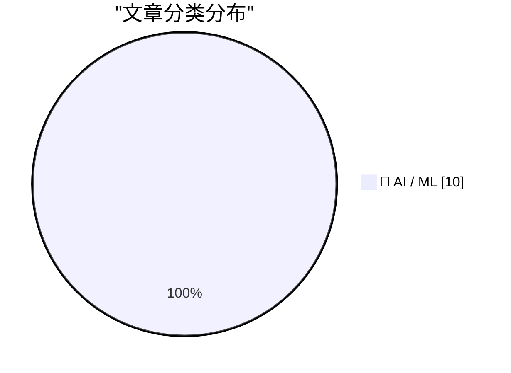
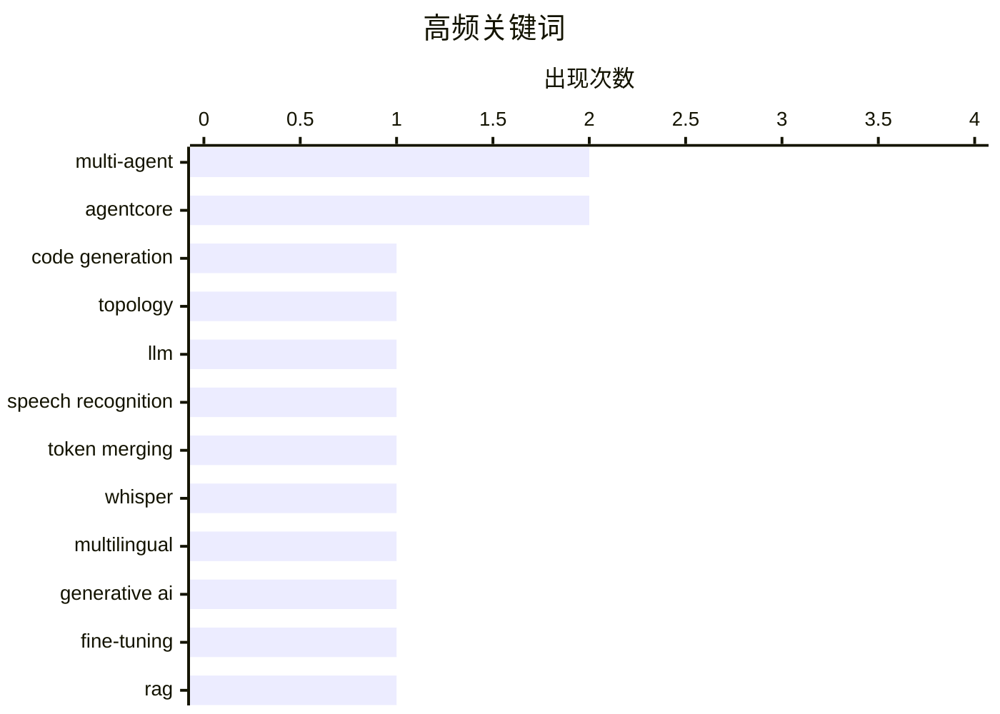

# 📰 AI 资讯每日精选 — 2026-09-15

> 汇聚 156+ 技术博客、X/Twitter、Hacker News、Reddit、Product Hunt、
> Lobste.rs、ClawFeed 日报及 GitHub Trending，经 AI 评分筛选。
>
> **本期内容**：🏆 今日必读 · 🌐 ClawFeed 日报 · 🔥 GitHub Trending · 📂 分类精选 · 📊 数据概览 · 🎯 项目相关情报

## 📝 今日看点

今日技术圈的关键词是“落地”与“提效”：智能体正从代码生成、虚拟任务走向邮件安全、金融入驻和长时程物理操作，多智能体协作、可靠性及规模化部署成为核心挑战。模型侧则继续围绕效率与定制化演进，MoE 训练加速、语音 token 合并、开放基础模型和生成式 AI 定制路径，都在压低训练与推理成本。多模态实时交互也在升温，VLM 正从离线分析迈向低延迟边云部署。与此同时，OpenAI 合同工阅读 ChatGPT 对话的报道再次敲响隐私与数据治理警钟。

---

## 🏆 今日必读

🥇 **学习协作程度：面向多智能体代码生成的难度感知拓扑选择**

[Learning How Much to Collaborate: Difficulty-Aware Topology Selection for Multi-Agent Code Generation](https://arxiv.org/abs/2609.13890) — arXiv Multiagent Systems · 46 分钟前 · 🤖 AI / ML · **一手来源**

> 多智能体代码生成系统通常为所有问题固定使用同一种通信拓扑，作者认为这种粒度是错误的。研究在 APPS、HumanEval+ 和 LiveCodeBench 的 614 道题上评估五种拓扑，发现分层协作相对单智能体的 pass@1 优势从最简单三分之一题目上的 2.4 分增长到最难三分之一题目上的 21.1 分，而 token 成本大致保持稳定。基于此，作者提出按问题难度动态选择协作拓扑的思路。

💡 **为什么值得读**: 用一组跨三个基准的对比数据说明“固定拓扑”为何低效，并给出难度感知的替代方案，适合关注多智能体代码生成成本与收益权衡的读者。

🏷️ multi-agent, code generation, topology, LLM

🥈 **多语言语音识别中的 Token 合并：跨模型规模与微调的系统性研究**

[Token Merging for Multilingual Speech Recognition: A Systematic Study Across Model Scale and Fine-Tuning](https://arxiv.org/abs/2609.13151) — arXiv Computation and Language · 46 分钟前 · 🤖 AI / ML · **一手来源**

> Whisper 等领先多语言语音识别模型无需语言特定训练即可转写多种低资源语言，但部署计算成本高。Token 合并通过在推理时动态合并冗余特征来缩短序列长度，且无需重新训练。本文在 Whisper 模型家族上跨十六种不同语言系统评估 token 合并的效果，并考察模型规模与微调的影响。

💡 **为什么值得读**: 为想在低资源多语言场景中降低 Whisper 推理成本、又不想重新训练的工程团队提供系统性的 token 合并评估参考。

🏷️ speech recognition, token merging, Whisper, multilingual

🥉 **生成式 AI 定制化光谱：从提示工程到 AWS 上的自定义模型**

[The generative AI customization spectrum: From prompt engineering to custom models on AWS](https://aws.amazon.com/blogs/machine-learning/the-generative-ai-customization-spectrum-from-prompt-engineering-to-custom-models-on-aws/) — AWS Machine Learning Blog · 12 小时前 · 🤖 AI / ML · **一手来源**

> 文章讨论在 AWS 上如何为生成式 AI 应用选择合适的定制化程度。作者提出一个 8 步决策框架，覆盖从提示工程、RAG 到微调、持续预训练以及 Amazon Nova Forge 的多种路径。核心建议是从最简单的方法起步，只在确有需要时才升级到更重的定制手段。

💡 **为什么值得读**: 用一份可操作的决策框架帮助团队避免过度定制，适合正在 AWS 上规划生成式 AI 落地方案的技术决策者。

🏷️ generative AI, fine-tuning, RAG, AWS

4️⃣ **ZGCM-1：面向数学与智能体搜索的全开放、极致高效基础模型**

[ZGCM-1: A Fully Open and Extremely Efficient Foundation Model for Math and Agentic Search](https://arxiv.org/abs/2609.13356) — arXiv Artificial Intelligence · 46 分钟前 · 🤖 AI / ML · **一手来源**

> ZGCM-1 是一个从零训练的 7B 稠密基础模型，强调数据、系统和算法三个层面的极致效率。其核心前提是：紧凑模型无法被动记忆开放网络，但可以通过结合内部思考与主动外部工具使用来突破参数容量限制。为支持 256K 上下文下的这一范式，作者开发了一套端到端的高效开放方案。

💡 **为什么值得读**: 展示了一条不靠堆参数、而靠“内部思考+外部工具”提升紧凑模型数学与搜索能力的路线，适合关注高效基础模型与智能体搜索的读者。

🏷️ foundation model, open source, math, agentic search

5️⃣ **使用 NVIDIA Transformer Engine 在 JAX 中加速无丢弃 MoE 训练**

[Accelerating Dropless MoE Training in JAX with NVIDIA Transformer Engine](https://developer.nvidia.com/blog/accelerating-dropless-moe-training-in-jax-with-nvidia-transformer-engine/) — NVIDIA Technical Blog · 12 小时前 · 🤖 AI / ML

> 混合专家（MoE）已成为大规模 AI 模型训练的标志性架构趋势，DeepSeek、Qwen 和 Mixtral 都是典型例子。文章介绍如何借助 NVIDIA Transformer Engine 在 JAX 中加速 dropless MoE 训练。

💡 **为什么值得读**: 面向正在 JAX 生态中训练 MoE 的工程师，提供来自 NVIDIA 的加速实践路径。

🏷️ MoE, JAX, Transformer Engine, training

---

## 🌐 ClawFeed 日报精选

> 来源：[ClawFeed](https://clawfeed.kevinhe.io) — AI 驱动的多源新闻聚合

# 📅 ClawFeed 日报 | 2026-09-14 (SGT)

> 聚合当日 5 档 4h digest（id 1203–1207，覆盖 00:00–19:59 SGT）。feed 合计 ~163 条 / bookmarks 20 / errors 0。

## 🔥 当日全场最重要 5 条

1. **「Pace the Frontier」辩论升级为政策博弈（当日主线，横跨 4 档）** — Anthropic CEO Dario Amodei 发长文呼吁放缓前沿模型开发、请政府协助，并承诺给第三方评估者永久访问权。David Sacks 公开回击「欢迎他们自己踩刹车，但别要求政府给所有人加速罚单」；Bloomberg 指出 Anthropic/OpenAI 的放缓主张正与科技行业、华尔街、特朗普政府正面冲突。辩论从学术层进入政策层。

2. **CLARITY Act 投票在即（明天）** — 加密市场结构立法关键时刻，参议院程序性投票逼近，通过需 60 票、三大分歧待解。通过后 Bitcoin 将被明确排除在证券定义之外，X 上「BC vs AC」（Before/After Clarity）叙事发酵。Lummis 表态支持。

3. **SWIFT 联合 17 家全球银行测试区块链跨境支付** — 「Swift Digital Ledger」参与方含花旗、三菱 UFJ、富国、UBS、法国巴黎银行；汇丰、渣打已完成实际交易。传统金融基础设施正式拥抱代币化存款。

4. **iOS 27 暗藏 Model Delegation API，开发者已把 Claude 接入 Siri** — 苹果预留第三方 AI 模型替换 Siri 后端的接口，Claude 直接出现在 Ask 菜单。模型接入从封闭走向平台化开放。

5. **AI 产出学术级数学成果 + 情感拐点** — Bittensor 子网矿工解出 16 年未解的 Green's Problem 51 近半密度解（Lean 形式化验证通过）；康奈尔数学教授 Strogatz 受访谈及 AI 数学飞跃时当场落泪（「支撑很多研究者的是优越感而非探索欲，AI 把这层戳破了」）。

## 📰 当日核心主题（聚类视角）

- **Agent 经济落地为「支付 + 岗位」**：Circle 上线 Agent Marketplace（Agent 用 USDC 发现并支付服务）；Brex 联创 Pedro「别造 AI agent，造 AI 员工」（有岗位/技能/上级/预算）；SpaceX 工程师晒 Grok agent 编排（Chief of Staff + PM + 15+ workers）；Meta Muse 被用户评「feels like AGI」，Muse+Link 支付几分钟买下 $400 演唱会门票。
- **模型平台化 / 开放接入**：iOS 27 Model Delegation、GPT-Live-1 语音 API 开放（边听边说）、GPT Images 2.5 品牌级设计、Claude 20x 账户用量吃紧（前沿模型使用强度攀升）。
- **TradFi 上链 / 代币化主线**：SWIFT 17 行、Uniswap 月量破 $70B（超二到四名之和）、RWA + 代币化股票、TradFi 结构化产品转向 Hyperliquid basis trade。
- **Skills / 工具生态到整合期**：Skill 注册表碎片化（10+ 平台）催生统一搜索；Claude Code 系统提示精简 80%；Cloudflare @cloudflare/computer 给 Agent 配云端虚拟机；GPT-6/Astra 官方 Skills 指南提倡「做减法」。
- **加密监管周**：CLARITY Act 投票 + 美联储利率决定（周三，加息概率 86.5%）叠加，短期市场承压。

## 🔖 累计 Bookmark 精选（全天高热，去重）

- **谢青池 36 篇经典 AI 论文合集** + Codex 整理下载地址（全天持续热门）。
- **AI 市场渗透率不到 1%** — $6T+ 知识工作者支出中 AI 捕获不足 1%，最好的垂直（软件开发/客服）也仅个位数。
- **Cloudflare @cloudflare/computer** — 每个 Agent 一台云端虚拟电脑（文件系统 + 多执行环境，自主调度）。
- **Claude Code 系统提示精简 80%** — Anthropic 分享 system prompt / Skills / CLAUDE.md 写作经验。
- **wanman.ai 开源**（第 14 款 vibe 产品）— AI Agent 团队零部署运营一人公司，支持 Codex 调 GPT Image 2 自动建设计师 Agent + 跨 Story 搜索。
- **Andrew Ng AI Engineering 技能图谱** · **Matrix Agent 公司 OS 架构**（多 Agent 编排 + 权限 + 长期运行）· **GPT-Realtime-2 浏览器内实时翻译**。

## 👀 推荐关注汇总（去重）

- **@bibryam** — Kubernetes/Cloud Native 老兵，做 Agent Skills 统一注册表。
- **@turingou** — wanman.ai 作者，高频 building in public。
- **@RebeccaRettig1** — 加密政策专家，跟踪 CLARITY Act 与预测市场监管。
- **@poteto** — Grok Bot 工程师 / React Compiler 核心，pstack 插件作者（支撑每月 2000 PR）。
- **@istdrc** — Raft 联合创始人兼 CEO，前 Kimi CLI 作者，AI coding 一线 builder。

## 💤 当日重复/噪音模式

- **加密 meme / perp 炒作**（$ROBDOG、$EMBER 转盘、MEMEPERPSZN、「纸手」/frontrun 叙事）— 全天约占 feed ~25%，周末散户活跃度上升，信噪比偏低。
- **币圈 KOL 自我营销 / 招聘帖**（Bitget 天使、Predict Fun BD、Predict.fun 等）— 信息密度低。
- **生活碎片类**（医生段子、同性恋新闻、海底烟花）混入 tech feed。

---
*聚合 4h digest ids: 1203, 1204, 1205, 1206, 1207 · 生成于 2026-09-14 23:59 SGT*
---

## 🔥 GitHub Trending

> 今日热门开源项目（全语言 + Python）

| # | 项目 | 描述 | ⭐ 总星 | 📈 今日 | 语言 |
|---|------|------|---------|---------|------|
| 1 | [debpalash/VoiceStudio](https://github.com/debpalash/VoiceStudio) | VoiceStudio is the open-source, fully-local ElevenLabs al... | 29.6k | +2776 | Python |
| 2 | [JustVugg/colibri](https://github.com/JustVugg/colibri) | Run frontier MoE models on hardware you already own — pur... | 32.4k | +2173 | C |
| 3 | [alibaba/open-code-review](https://github.com/alibaba/open-code-review) 🤖 | Fast, efficient, battle-tested at Alibaba's scale. Hybrid... | 26.2k | +1571 | Go |
| 4 | [ever-co/ever-gauzy](https://github.com/ever-co/ever-gauzy) | Ever® Gauzy™ - Open Business Management Platform (ERP/CRM... | 6.1k | +1130 | TypeScript |
| 5 | [calesthio/OpenMontage](https://github.com/calesthio/OpenMontage) 🤖 | World's first open-source, agentic video production syste... | 59.2k | +823 | Python |
| 6 | [asgeirtj/system_prompts_leaks](https://github.com/asgeirtj/system_prompts_leaks) 🤖 | Extracted system prompts from Anthropic - Claude Fable 5.... | 66.9k | +764 | JavaScript |
| 7 | [TauricResearch/TradingAgents](https://github.com/TauricResearch/TradingAgents) 🤖 | TradingAgents: Multi-Agents LLM Financial Trading Framework | 106.3k | +745 | Python |
| 8 | [Panniantong/Agent-Reach](https://github.com/Panniantong/Agent-Reach) 🤖 | Give your AI agent eyes to see the entire internet. Read ... | 81.5k | +651 | Python |
| 9 | [SnailSploit/Claude-Red](https://github.com/SnailSploit/Claude-Red) 🤖 | claude-red is a curated library of offensive security ski... | 4.9k | +579 | Python |
| 10 | [666ghj/MiroFish](https://github.com/666ghj/MiroFish) | A Simple and Universal Swarm Intelligence Engine, Predict... | 73.3k | +560 | Python |
| 11 | [multimodal-art-projection/YuE](https://github.com/multimodal-art-projection/YuE) | YuE2: frontier music generation with symbolic planning, z... | 8.5k | +559 | Python |
| 12 | [huggingface/transformers](https://github.com/huggingface/transformers) 🤖 | 🤗 Transformers: the model-definition framework for state... | 166.1k | +536 | Python |
| 13 | [tech-leads-club/agent-skills](https://github.com/tech-leads-club/agent-skills) 🤖 | The secure, validated skill registry for professional AI ... | 6.1k | +512 | TypeScript |
| 14 | [harry0703/MoneyPrinterTurbo](https://github.com/harry0703/MoneyPrinterTurbo) 🤖 | 利用 AI 大模型和自动化工作流，根据主题或关键词一键生成高清短视频。Generate HD short vide... | 123.7k | +504 | Python |
| 15 | [MadsLorentzen/ai-job-search](https://github.com/MadsLorentzen/ai-job-search) 🤖 | The job search that runs on your machine. AI job applicat... | 42.8k | +443 | Python |

---

## 🤖 AI / ML

### 1. 学习协作程度：面向多智能体代码生成的难度感知拓扑选择

[Learning How Much to Collaborate: Difficulty-Aware Topology Selection for Multi-Agent Code Generation](https://arxiv.org/abs/2609.13890) — **arXiv Multiagent Systems** · 46 分钟前 · ⭐ 23/30 · **一手来源**

> 多智能体代码生成系统通常为所有问题固定使用同一种通信拓扑，作者认为这种粒度是错误的。研究在 APPS、HumanEval+ 和 LiveCodeBench 的 614 道题上评估五种拓扑，发现分层协作相对单智能体的 pass@1 优势从最简单三分之一题目上的 2.4 分增长到最难三分之一题目上的 21.1 分，而 token 成本大致保持稳定。基于此，作者提出按问题难度动态选择协作拓扑的思路。

🏷️ multi-agent, code generation, topology, LLM

---

### 2. 多语言语音识别中的 Token 合并：跨模型规模与微调的系统性研究

[Token Merging for Multilingual Speech Recognition: A Systematic Study Across Model Scale and Fine-Tuning](https://arxiv.org/abs/2609.13151) — **arXiv Computation and Language** · 46 分钟前 · ⭐ 21/30 · **一手来源**

> Whisper 等领先多语言语音识别模型无需语言特定训练即可转写多种低资源语言，但部署计算成本高。Token 合并通过在推理时动态合并冗余特征来缩短序列长度，且无需重新训练。本文在 Whisper 模型家族上跨十六种不同语言系统评估 token 合并的效果，并考察模型规模与微调的影响。

🏷️ speech recognition, token merging, Whisper, multilingual

---

### 3. 生成式 AI 定制化光谱：从提示工程到 AWS 上的自定义模型

[The generative AI customization spectrum: From prompt engineering to custom models on AWS](https://aws.amazon.com/blogs/machine-learning/the-generative-ai-customization-spectrum-from-prompt-engineering-to-custom-models-on-aws/) — **AWS Machine Learning Blog** · 12 小时前 · ⭐ 25/30 · **一手来源**

> 文章讨论在 AWS 上如何为生成式 AI 应用选择合适的定制化程度。作者提出一个 8 步决策框架，覆盖从提示工程、RAG 到微调、持续预训练以及 Amazon Nova Forge 的多种路径。核心建议是从最简单的方法起步，只在确有需要时才升级到更重的定制手段。

🏷️ generative AI, fine-tuning, RAG, AWS

---

### 4. ZGCM-1：面向数学与智能体搜索的全开放、极致高效基础模型

[ZGCM-1: A Fully Open and Extremely Efficient Foundation Model for Math and Agentic Search](https://arxiv.org/abs/2609.13356) — **arXiv Artificial Intelligence** · 46 分钟前 · ⭐ 25/30 · **一手来源**

> ZGCM-1 是一个从零训练的 7B 稠密基础模型，强调数据、系统和算法三个层面的极致效率。其核心前提是：紧凑模型无法被动记忆开放网络，但可以通过结合内部思考与主动外部工具使用来突破参数容量限制。为支持 256K 上下文下的这一范式，作者开发了一套端到端的高效开放方案。

🏷️ foundation model, open source, math, agentic search

---

### 5. 使用 NVIDIA Transformer Engine 在 JAX 中加速无丢弃 MoE 训练

[Accelerating Dropless MoE Training in JAX with NVIDIA Transformer Engine](https://developer.nvidia.com/blog/accelerating-dropless-moe-training-in-jax-with-nvidia-transformer-engine/) — **NVIDIA Technical Blog** · 12 小时前 · ⭐ 25/30

> 混合专家（MoE）已成为大规模 AI 模型训练的标志性架构趋势，DeepSeek、Qwen 和 Mixtral 都是典型例子。文章介绍如何借助 NVIDIA Transformer Engine 在 JAX 中加速 dropless MoE 训练。

🏷️ MoE, JAX, Transformer Engine, training

---

### 6. Abnormal AI：用 Amazon Bedrock AgentCore 实现大规模智能体邮件安全

[Abnormal AI: Amazon Bedrock AgentCore for agentic email security at scale](https://aws.amazon.com/blogs/machine-learning/abnormal-ai-amazon-bedrock-agentcore-for-agentic-email-security-at-scale/) — **AWS Machine Learning Blog** · 7 小时前 · ⭐ 23/30 · **一手来源**

> 文章介绍 Abnormal AI 如何将 Amazon Bedrock AgentCore Code Interpreter 用作临时计算暂存区，支撑其实时邮件威胁检测背后的智能体，处理规模达到十亿级消息。内容还涵盖沙箱设计决策，以及在生产环境部署 Code Interpreter 的实践经验。

🏷️ AgentCore, agents, sandbox, email security

---

### 7. OpenAI 有数百名合同工在阅读你的 ChatGPT 对话

[OpenAI has hundreds of contract workers reading your ChatGPT conversations](https://the-decoder.com/openai-has-hundreds-of-contract-workers-reading-your-chatgpt-conversations/) — **The Decoder** · 11 小时前 · ⭐ 24/30 · **二手来源**

> 据 404 Media 报道，OpenAI 有数百名合同工在阅读真实的 ChatGPT 对话，并按 1 到 7 分进行评分，部分目的是减少谄媚和类人行为。这些提示词虽经匿名化处理，但仍可能包含敏感数据。不想让聊天被人工审查的用户必须主动关闭默认开启的“Improve the model for everyone”设置。

🏷️ OpenAI, ChatGPT, privacy, data labeling

---

### 8. Ninth Wave 如何在 Amazon Bedrock 上构建 AI 驱动的开放金融入驻

[How Ninth Wave built AI-powered open finance onboarding on Amazon Bedrock](https://aws.amazon.com/blogs/machine-learning/how-ninth-wave-built-ai-powered-open-finance-onboarding-on-amazon-bedrock/) — **AWS Machine Learning Blog** · 12 小时前 · ⭐ 22/30 · **一手来源**

> 文章介绍 Ninth Wave 如何在 Amazon Bedrock AgentCore 上构建 Compass，一个多智能体 AI 入驻助手。Compass 依据金融数据交换（FDX）标准验证银行 API、对合规性打分，并将开放金融入驻周期从数周压缩到数分钟，同时满足 SOC 2 和 PCI DSS 要求。

🏷️ multi-agent, AgentCore, open finance, compliance

---

### 9. 基于 VLM 的低延迟实时视频理解交互系统

[A Low-Latency Interactive System for Real-Time Video Understanding Based on VLMs](https://arxiv.org/abs/2609.13986) — **arXiv Multiagent Systems** · 46 分钟前 · ⭐ 23/30 · **一手来源**

> 视觉语言模型正从离线片段分析扩展到持续交互式流媒体，但多数研究仍侧重模型能力而非可部署的低延迟交互。本文提出一个面向实时视频 VLM 应用的统一边云系统：手机、智能眼镜、PC 和伪回放等轻量客户端将视频与语音发布到服务端运行时，由后者提供共享的 ASR/TTS 与会话能力。

🏷️ VLM, video understanding, low-latency, streaming

---

### 10. 迈向自适应物理 AI：LLM 智能体能否管理长时程物理任务？

[Toward Self-Adaptive Physical AI: Can LLM Agents Manage Long-Horizon Physical Tasks?](https://arxiv.org/abs/2609.13436) — **arXiv Artificial Intelligence** · 46 分钟前 · ⭐ 23/30 · **一手来源**

> LLM 智能体被视为无需人工干预即可自主管理长期物理任务的一条有前景路径，但物理任务要求智能体持续观察环境、执行有后果的动作，并在环境变化时保持有效。现有方法要么需要大量数据和重新训练，要么主要聚焦虚拟世界中的智能体。本文探索 LLM 智能体在长时程物理任务中的自适应管理能力。

🏷️ LLM agent, physical AI, long-horizon, robotics

---

## 📊 数据概览

| 扫描源 | 抓取文章 | 时间范围 | 精选 |
|:---:|:---:|:---:|:---:|
| 109/156 | 7385 篇 → 2187 篇 | 24h | **10 篇** |

### 分类分布



### 高频关键词



<details>
<summary>📈 纯文本关键词图（终端友好）</summary>

```
multi-agent        │ ████████████████████ 2
agentcore          │ ████████████████████ 2
code generation    │ ██████████░░░░░░░░░░ 1
topology           │ ██████████░░░░░░░░░░ 1
llm                │ ██████████░░░░░░░░░░ 1
speech recognition │ ██████████░░░░░░░░░░ 1
token merging      │ ██████████░░░░░░░░░░ 1
whisper            │ ██████████░░░░░░░░░░ 1
multilingual       │ ██████████░░░░░░░░░░ 1
generative ai      │ ██████████░░░░░░░░░░ 1
```

</details>

### 🏷️ 话题标签

**multi-agent**(2) · **agentcore**(2) · **code generation**(1) · topology(1) · llm(1) · speech recognition(1) · token merging(1) · whisper(1) · multilingual(1) · generative ai(1) · fine-tuning(1) · rag(1) · aws(1) · foundation model(1) · open source(1) · math(1) · agentic search(1) · moe(1) · jax(1) · transformer engine(1)

---

## 🎯 项目相关情报

### Agent 基座安全与合规

> 暂无达到质量门槛的项目相关情报。

### 多 Agent 架构

#### [学习协作程度：面向多智能体代码生成的难度感知拓扑选择](https://arxiv.org/abs/2609.13890)

> **状态**：本期 Top 10 已收录

- **匹配类型**：直接相关
- **项目相关性**：8/10
- **可落地性**：7/10
- **为什么相关**：研究多 agent 代码生成的通信拓扑选择，按问题难度动态调整协作结构，直接涉及多智能体协作编排。
- **建议动作**：精读其拓扑选择方法与评测设置，借鉴到自身多智能体通信结构设计。
- **来源**：arXiv Multiagent Systems · 一手来源

### ASR 与语音助手

#### [多语言语音识别中的 Token 合并：跨模型规模与微调的系统性研究](https://arxiv.org/abs/2609.13151)

> **状态**：本期 Top 10 已收录

- **匹配类型**：直接相关
- **项目相关性**：8/10
- **可落地性**：6/10
- **为什么相关**：文章直接研究多语言语音识别模型（Whisper）的 token merging 方法，跨模型规模与微调进行系统研究，属于 ASR 模型效率方向。
- **建议动作**：纳入 ASR 模型跟踪，重点记录 token merging 对转写准确率与计算开销的影响，评估是否可迁移到自有转写流程。
- **来源**：arXiv Computation and Language · 一手来源

### 商品包装 OCR

> 暂无达到质量门槛的项目相关情报。

---

*生成于 2026-09-15 04:46 | 汇聚 156 个技术博客、X/Twitter、Hacker News、Reddit、Product Hunt、Lobste.rs、ClawFeed 日报及 GitHub Trending，经 AI 评分筛选出 Top 10 精华内容*
