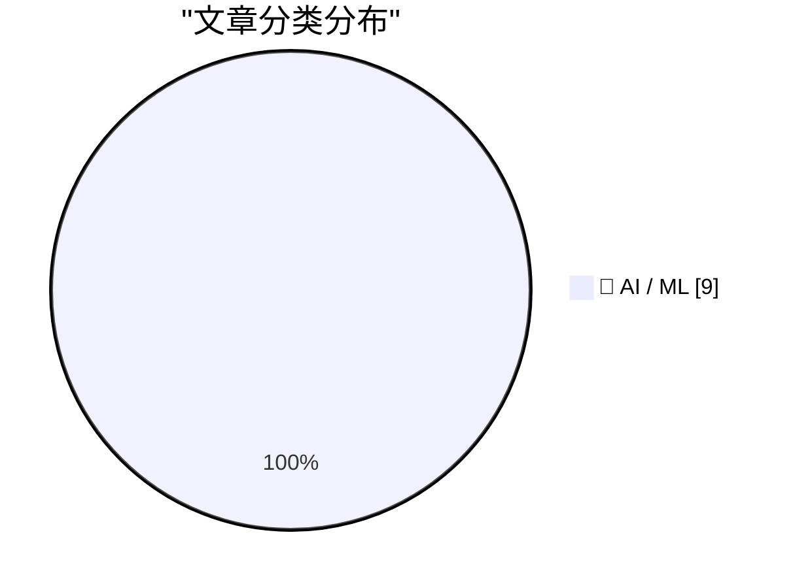
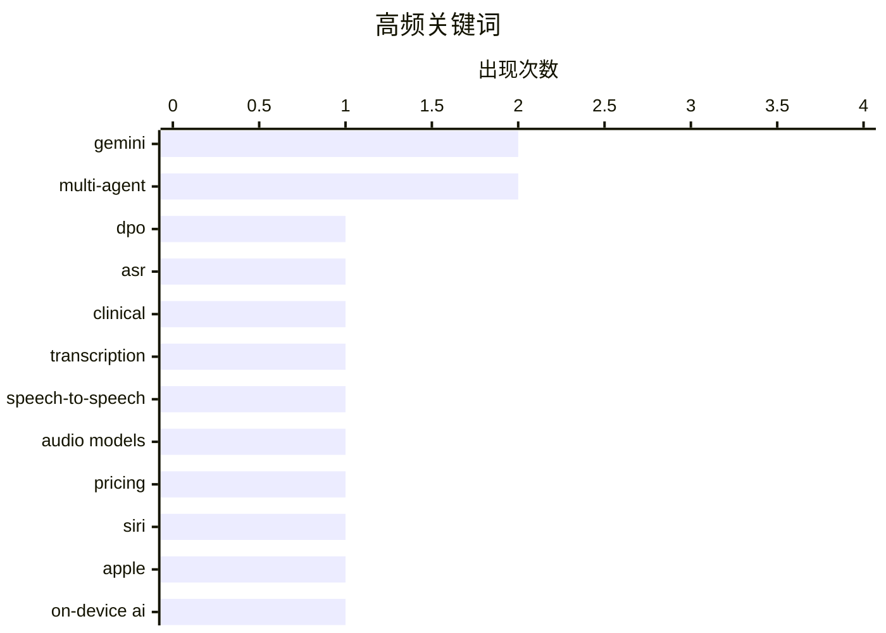

# 📰 AI 资讯每日精选 — 2026-09-16

> 汇聚 156+ 技术博客、X/Twitter、Hacker News、Reddit、Product Hunt、
> Lobste.rs、ClawFeed 日报及 GitHub Trending，经 AI 评分筛选。
>
> **本期内容**：🏆 今日必读 · 🌐 ClawFeed 日报 · 🔥 GitHub Trending · 📂 分类精选 · 📊 数据概览 · 🎯 项目相关情报 · 🌍 补充视角

## 📝 今日看点

今日技术圈看点集中在三条主线：大模型竞争正从性能比拼转向成本、生态与终端整合，谷歌以 Gemini 新音频模型压低价格，苹果则借 Gemini 重构 Siri，模型能力加速嵌入平台与设备。其次，企业级 AI 落地更强调降本增效和定制化，提示缓存、无服务器微调与 MoE 架构成为控制推理成本、提升吞吐的关键手段。同时，AI 智能体研究正从单点能力转向复杂协作与专业场景的可靠性，多智能体沟通、语义多样性维持，以及临床、专利等高门槛任务的评估与归属受到关注。整体看，模型商品化、工程化落地和智能体可信度正共同塑造今日 AI 叙事。

---

## 🏆 今日必读

🥇 **DiaWhisper-DPO：通过失败挖掘偏好优化实现临床访谈的角色归属转录**

[DiaWhisper-DPO: Role-Attributed Transcription of Clinical Interviews via Failure-Mined Preference Optimization](https://arxiv.org/abs/2609.16661) — arXiv Computation and Language · 43 分钟前 · 🤖 AI / ML · **一手来源**

> 临床访谈自动抑郁筛查需要将话语归属给临床医生或患者。研究评估了两个数据集：DAIC-WOZ（仅参与者录音，需重新合成双方以进行受控双人评估）和 PDCH-HAMD（包含语音转换的真实中文访谈，用于跨语言验证）。级联系统将说话人日志与角色分配启发式方法结合，因此错误可能传播。该工作提出 DiaWhisper-DPO，利用失败挖掘的偏好优化来改进角色归属转录。

💡 **为什么值得读**: 针对临床访谈角色归属这一抑郁筛查关键环节，提出基于失败挖掘偏好优化的新方法，并涵盖跨语言验证，对语音与医疗交叉领域研究者有参考价值。

🏷️ DPO, ASR, clinical, transcription

🥈 **谷歌发布 Gemini 3.8 Live，以远低于 OpenAI GPT-Live-1 的成本展开竞争**

[Google launches Gemini 3.8 Live to take on OpenAI's GPT-Live-1 at a fraction of the cost](https://the-decoder.com/google-launches-gemini-3-8-live-to-take-on-openais-gpt-live-1-at-a-fraction-of-the-cost/) — The Decoder · 10 小时前 · 🤖 AI / ML · **可追溯二手**

> Google DeepMind 发布 Gemini 3.8 Live 和 3.8 Live Extended Thinking 两款面向开发者的新音频模型，据称在 Artificial Analysis 语音到语音排行榜上登顶。其语音对话价格为每小时 1.38 美元，明显低于 OpenAI 的 GPT-Live-1。文章指出 GPT-Live-1 凭借全双工能力，听起来可能仍更自然。

💡 **为什么值得读**: 想了解实时语音模型最新价格与排行榜表现对比的开发者可快速获取关键信息。

🏷️ Gemini, speech-to-speech, audio models, pricing

🥉 **苹果推出基于谷歌 Gemini 全面重构的 Siri，但暂不登陆欧盟**

[Apple brings a fully revamped Siri built on Google's Gemini, but not to the EU](https://the-decoder.com/apple-brings-a-fully-revamped-siri-built-on-googles-gemini-but-not-to-the-eu/) — The Decoder · 18 小时前 · 🤖 AI / ML · **二手来源**

> 苹果在多年延迟后发布重建的“Siri AI”，基于谷歌 Gemini 模型，部分在设备端运行，部分通过 Private Cloud Compute 处理。早期测试者称赞多步骤请求和屏幕上下文能力，但也报告存在幻觉以及个人上下文方面的不足。该助手目前在欧盟仍不可用。

💡 **为什么值得读**: 关注苹果 AI 战略、端云协同架构及区域合规影响的读者值得一读。

🏷️ Siri, Gemini, Apple, on-device AI

4️⃣ **使用 Amazon Bedrock 提示缓存优化成本与延迟**

[Optimizing cost and latency with Amazon Bedrock prompt caching](https://aws.amazon.com/blogs/machine-learning/optimizing-cost-and-latency-with-amazon-bedrock-prompt-caching/) — AWS Machine Learning Blog · 12 小时前 · 🤖 AI / ML · **一手来源**

> Amazon Bedrock 的提示缓存可在反复向基础模型发送相同上下文时，将输入 token 成本降低最多 90%。文章通过 Converse API 演示六个实用提示缓存场景：消息内容、系统提示、工具定义、混合 TTL、租户隔离以及 LangChain 集成。

💡 **为什么值得读**: 为需要降低大模型调用成本与延迟的开发者提供了可直接落地的六种缓存模式。

🏷️ prompt caching, Bedrock, LLM, cost optimization

5️⃣ **使用 Amazon SageMaker 无服务器模型定制构建 AI 驱动的产品打标系统**

[Build an AI-powered product tagging system with Amazon SageMaker serverless model customization](https://aws.amazon.com/blogs/machine-learning/build-an-ai-powered-product-tagging-system-with-amazon-sagemaker-serverless-model-customization/) — AWS Machine Learning Blog · 12 小时前 · 🤖 AI / ML · **一手来源**

> 人工为数千个目录产品打标既慢又不一致。该教程展示如何在 Amazon SageMaker 无服务器模型定制上，通过监督微调（SFT）和可验证奖励的强化学习（RLVR）定制 Qwen3-8B，并部署为异步推理，从而构建成本高效的产品打标系统。

💡 **为什么值得读**: 适合希望用 SFT 与 RLVR 组合方案实现自动化产品打标的工程团队参考。

🏷️ fine-tuning, SageMaker, Qwen3, RLVR

---

## 🌐 ClawFeed 日报精选

> 来源：[ClawFeed](https://clawfeed.kevinhe.io) — AI 驱动的多源新闻聚合

# 📅 ClawFeed 日报 | 2026-09-14 (SGT)

> 聚合当日 5 档 4h digest（id 1203–1207，覆盖 00:00–19:59 SGT）。feed 合计 ~163 条 / bookmarks 20 / errors 0。

## 🔥 当日全场最重要 5 条

1. **「Pace the Frontier」辩论升级为政策博弈（当日主线，横跨 4 档）** — Anthropic CEO Dario Amodei 发长文呼吁放缓前沿模型开发、请政府协助，并承诺给第三方评估者永久访问权。David Sacks 公开回击「欢迎他们自己踩刹车，但别要求政府给所有人加速罚单」；Bloomberg 指出 Anthropic/OpenAI 的放缓主张正与科技行业、华尔街、特朗普政府正面冲突。辩论从学术层进入政策层。

2. **CLARITY Act 投票在即（明天）** — 加密市场结构立法关键时刻，参议院程序性投票逼近，通过需 60 票、三大分歧待解。通过后 Bitcoin 将被明确排除在证券定义之外，X 上「BC vs AC」（Before/After Clarity）叙事发酵。Lummis 表态支持。

3. **SWIFT 联合 17 家全球银行测试区块链跨境支付** — 「Swift Digital Ledger」参与方含花旗、三菱 UFJ、富国、UBS、法国巴黎银行；汇丰、渣打已完成实际交易。传统金融基础设施正式拥抱代币化存款。

4. **iOS 27 暗藏 Model Delegation API，开发者已把 Claude 接入 Siri** — 苹果预留第三方 AI 模型替换 Siri 后端的接口，Claude 直接出现在 Ask 菜单。模型接入从封闭走向平台化开放。

5. **AI 产出学术级数学成果 + 情感拐点** — Bittensor 子网矿工解出 16 年未解的 Green's Problem 51 近半密度解（Lean 形式化验证通过）；康奈尔数学教授 Strogatz 受访谈及 AI 数学飞跃时当场落泪（「支撑很多研究者的是优越感而非探索欲，AI 把这层戳破了」）。

## 📰 当日核心主题（聚类视角）

- **Agent 经济落地为「支付 + 岗位」**：Circle 上线 Agent Marketplace（Agent 用 USDC 发现并支付服务）；Brex 联创 Pedro「别造 AI agent，造 AI 员工」（有岗位/技能/上级/预算）；SpaceX 工程师晒 Grok agent 编排（Chief of Staff + PM + 15+ workers）；Meta Muse 被用户评「feels like AGI」，Muse+Link 支付几分钟买下 $400 演唱会门票。
- **模型平台化 / 开放接入**：iOS 27 Model Delegation、GPT-Live-1 语音 API 开放（边听边说）、GPT Images 2.5 品牌级设计、Claude 20x 账户用量吃紧（前沿模型使用强度攀升）。
- **TradFi 上链 / 代币化主线**：SWIFT 17 行、Uniswap 月量破 $70B（超二到四名之和）、RWA + 代币化股票、TradFi 结构化产品转向 Hyperliquid basis trade。
- **Skills / 工具生态到整合期**：Skill 注册表碎片化（10+ 平台）催生统一搜索；Claude Code 系统提示精简 80%；Cloudflare @cloudflare/computer 给 Agent 配云端虚拟机；GPT-6/Astra 官方 Skills 指南提倡「做减法」。
- **加密监管周**：CLARITY Act 投票 + 美联储利率决定（周三，加息概率 86.5%）叠加，短期市场承压。

## 🔖 累计 Bookmark 精选（全天高热，去重）

- **谢青池 36 篇经典 AI 论文合集** + Codex 整理下载地址（全天持续热门）。
- **AI 市场渗透率不到 1%** — $6T+ 知识工作者支出中 AI 捕获不足 1%，最好的垂直（软件开发/客服）也仅个位数。
- **Cloudflare @cloudflare/computer** — 每个 Agent 一台云端虚拟电脑（文件系统 + 多执行环境，自主调度）。
- **Claude Code 系统提示精简 80%** — Anthropic 分享 system prompt / Skills / CLAUDE.md 写作经验。
- **wanman.ai 开源**（第 14 款 vibe 产品）— AI Agent 团队零部署运营一人公司，支持 Codex 调 GPT Image 2 自动建设计师 Agent + 跨 Story 搜索。
- **Andrew Ng AI Engineering 技能图谱** · **Matrix Agent 公司 OS 架构**（多 Agent 编排 + 权限 + 长期运行）· **GPT-Realtime-2 浏览器内实时翻译**。

## 👀 推荐关注汇总（去重）

- **@bibryam** — Kubernetes/Cloud Native 老兵，做 Agent Skills 统一注册表。
- **@turingou** — wanman.ai 作者，高频 building in public。
- **@RebeccaRettig1** — 加密政策专家，跟踪 CLARITY Act 与预测市场监管。
- **@poteto** — Grok Bot 工程师 / React Compiler 核心，pstack 插件作者（支撑每月 2000 PR）。
- **@istdrc** — Raft 联合创始人兼 CEO，前 Kimi CLI 作者，AI coding 一线 builder。

## 💤 当日重复/噪音模式

- **加密 meme / perp 炒作**（$ROBDOG、$EMBER 转盘、MEMEPERPSZN、「纸手」/frontrun 叙事）— 全天约占 feed ~25%，周末散户活跃度上升，信噪比偏低。
- **币圈 KOL 自我营销 / 招聘帖**（Bitget 天使、Predict Fun BD、Predict.fun 等）— 信息密度低。
- **生活碎片类**（医生段子、同性恋新闻、海底烟花）混入 tech feed。

---
*聚合 4h digest ids: 1203, 1204, 1205, 1206, 1207 · 生成于 2026-09-14 23:59 SGT*
---

## 🔥 GitHub Trending

> 今日热门开源项目（全语言 + Python）

| # | 项目 | 描述 | ⭐ 总星 | 📈 今日 | 语言 |
|---|------|------|---------|---------|------|
| 1 | [alibaba/open-code-review](https://github.com/alibaba/open-code-review) 🤖 | Fast, efficient, battle-tested at Alibaba's scale. Hybrid... | 29.1k | +2756 | Go |
| 2 | [debpalash/VoiceStudio](https://github.com/debpalash/VoiceStudio) | VoiceStudio is the open-source, fully-local ElevenLabs al... | 31.2k | +2072 | Python |
| 3 | [JustVugg/colibri](https://github.com/JustVugg/colibri) | Run frontier MoE models on hardware you already own — pur... | 34.1k | +2026 | C |
| 4 | [Panniantong/Agent-Reach](https://github.com/Panniantong/Agent-Reach) 🤖 | Give your AI agent eyes to see the entire internet. Read ... | 82.1k | +960 | Python |
| 5 | [TauricResearch/TradingAgents](https://github.com/TauricResearch/TradingAgents) 🤖 | TradingAgents: Multi-Agents LLM Financial Trading Framework | 106.8k | +727 | Python |
| 6 | [NationalSecurityAgency/ghidra](https://github.com/NationalSecurityAgency/ghidra) | Ghidra is a software reverse engineering (SRE) framework | 76.9k | +725 | Java |
| 7 | [multimodal-art-projection/YuE](https://github.com/multimodal-art-projection/YuE) | YuE2: frontier music generation with symbolic planning, z... | 9.1k | +701 | Python |
| 8 | [SnailSploit/Claude-Red](https://github.com/SnailSploit/Claude-Red) 🤖 | claude-red is a curated library of offensive security ski... | 5.4k | +699 | Python |
| 9 | [bojieli/ai-agent-book](https://github.com/bojieli/ai-agent-book) 🤖 | 《深入理解 AI Agent：设计原理与工程实践》（李博杰 著）开源主仓库：全书正文、编译版 PDF 与按章配套代码 | 47.8k | +660 | Python |
| 10 | [ever-co/ever-gauzy](https://github.com/ever-co/ever-gauzy) | Ever® Gauzy™ - Open Business Management Platform (ERP/CRM... | 6.8k | +634 | TypeScript |
| 11 | [666ghj/MiroFish](https://github.com/666ghj/MiroFish) | A Simple and Universal Swarm Intelligence Engine, Predict... | 73.7k | +619 | Python |
| 12 | [alphaXiv/OpenResearch](https://github.com/alphaXiv/OpenResearch) | Turn your coding agents into research agents | 3.5k | +531 | Rust |
| 13 | [earendil-works/pi](https://github.com/earendil-works/pi) 🤖 | AI agent toolkit: unified LLM API, agent loop, TUI, codin... | 105.9k | +458 | TypeScript |
| 14 | [addyosmani/agent-skills](https://github.com/addyosmani/agent-skills) 🤖 | Production-grade engineering skills for AI coding agents. | 94.9k | +307 | JavaScript |
| 15 | [calesthio/OpenMontage](https://github.com/calesthio/OpenMontage) 🤖 | World's first open-source, agentic video production syste... | 59.4k | +273 | Python |

---

## 🤖 AI / ML

### 1. DiaWhisper-DPO：通过失败挖掘偏好优化实现临床访谈的角色归属转录

[DiaWhisper-DPO: Role-Attributed Transcription of Clinical Interviews via Failure-Mined Preference Optimization](https://arxiv.org/abs/2609.16661) — **arXiv Computation and Language** · 43 分钟前 · ⭐ 22/30 · **一手来源**

> 临床访谈自动抑郁筛查需要将话语归属给临床医生或患者。研究评估了两个数据集：DAIC-WOZ（仅参与者录音，需重新合成双方以进行受控双人评估）和 PDCH-HAMD（包含语音转换的真实中文访谈，用于跨语言验证）。级联系统将说话人日志与角色分配启发式方法结合，因此错误可能传播。该工作提出 DiaWhisper-DPO，利用失败挖掘的偏好优化来改进角色归属转录。

🏷️ DPO, ASR, clinical, transcription

---

### 2. 谷歌发布 Gemini 3.8 Live，以远低于 OpenAI GPT-Live-1 的成本展开竞争

[Google launches Gemini 3.8 Live to take on OpenAI's GPT-Live-1 at a fraction of the cost](https://the-decoder.com/google-launches-gemini-3-8-live-to-take-on-openais-gpt-live-1-at-a-fraction-of-the-cost/) — **The Decoder** · 10 小时前 · ⭐ 25/30 · **可追溯二手**

> Google DeepMind 发布 Gemini 3.8 Live 和 3.8 Live Extended Thinking 两款面向开发者的新音频模型，据称在 Artificial Analysis 语音到语音排行榜上登顶。其语音对话价格为每小时 1.38 美元，明显低于 OpenAI 的 GPT-Live-1。文章指出 GPT-Live-1 凭借全双工能力，听起来可能仍更自然。

🏷️ Gemini, speech-to-speech, audio models, pricing

---

### 3. 苹果推出基于谷歌 Gemini 全面重构的 Siri，但暂不登陆欧盟

[Apple brings a fully revamped Siri built on Google's Gemini, but not to the EU](https://the-decoder.com/apple-brings-a-fully-revamped-siri-built-on-googles-gemini-but-not-to-the-eu/) — **The Decoder** · 18 小时前 · ⭐ 25/30 · **二手来源**

> 苹果在多年延迟后发布重建的“Siri AI”，基于谷歌 Gemini 模型，部分在设备端运行，部分通过 Private Cloud Compute 处理。早期测试者称赞多步骤请求和屏幕上下文能力，但也报告存在幻觉以及个人上下文方面的不足。该助手目前在欧盟仍不可用。

🏷️ Siri, Gemini, Apple, on-device AI

---

### 4. 使用 Amazon Bedrock 提示缓存优化成本与延迟

[Optimizing cost and latency with Amazon Bedrock prompt caching](https://aws.amazon.com/blogs/machine-learning/optimizing-cost-and-latency-with-amazon-bedrock-prompt-caching/) — **AWS Machine Learning Blog** · 12 小时前 · ⭐ 22/30 · **一手来源**

> Amazon Bedrock 的提示缓存可在反复向基础模型发送相同上下文时，将输入 token 成本降低最多 90%。文章通过 Converse API 演示六个实用提示缓存场景：消息内容、系统提示、工具定义、混合 TTL、租户隔离以及 LangChain 集成。

🏷️ prompt caching, Bedrock, LLM, cost optimization

---

### 5. 使用 Amazon SageMaker 无服务器模型定制构建 AI 驱动的产品打标系统

[Build an AI-powered product tagging system with Amazon SageMaker serverless model customization](https://aws.amazon.com/blogs/machine-learning/build-an-ai-powered-product-tagging-system-with-amazon-sagemaker-serverless-model-customization/) — **AWS Machine Learning Blog** · 12 小时前 · ⭐ 22/30 · **一手来源**

> 人工为数千个目录产品打标既慢又不一致。该教程展示如何在 Amazon SageMaker 无服务器模型定制上，通过监督微调（SFT）和可验证奖励的强化学习（RLVR）定制 Qwen3-8B，并部署为异步推理，从而构建成本高效的产品打标系统。

🏷️ fine-tuning, SageMaker, Qwen3, RLVR

---

### 6. “寻找怪异之事”：人类如何在语义坍缩中维持 AI 智能体的新颖性

["Looking for Something Weird to Happen": How Humans Sustain AI Agent Novelty Amid Semantic Collapse](https://arxiv.org/abs/2609.16051) — **arXiv Multiagent Systems** · 43 分钟前 · ⭐ 23/30 · **一手来源**

> 语义坍缩指 AI 系统生成内容逐渐收窄，此前主要在封闭环境中研究，补救措施多针对模型和数据。该研究在 MOLTBOOK——一个由人类用户配置和引导的交互式 AI 智能体社交网络——中考察该现象。在 30,076 个活跃智能体中，数周内智能体内部输出多样性下降、智能体之间输出趋于相似，但少数仍保持高新颖性。研究还对高新颖性和低新颖性用户进行了访谈。

🏷️ AI agents, semantic collapse, multi-agent, novelty

---

### 7. 廉价谈话稳定 LLM 智能体的策略互动

[Cheap Talk Stabilizes Strategic Interaction in LLM Agents](https://arxiv.org/abs/2609.16270) — **arXiv Multiagent Systems** · 43 分钟前 · ⭐ 23/30 · **一手来源**

> 随着大语言模型越来越多地作为交互式智能体部署，其行动策略在重复互动中的持续性对可靠的多智能体运行至关重要。研究考察智能体生成的非约束性预沟通（“廉价谈话”）是否以及如何提高这种持续性，实验覆盖四个开放权重的 7-9B 参数 LLM。实验涉及四个重复双人博弈：囚徒困境、雪堆博弈、 stag hunt 等。

🏷️ LLM agents, multi-agent, cheap talk, game theory

---

### 8. Vibe Patenting：评估用于专业专利起草智能体的 LLM 评审员

[Vibe Patenting: Evaluating LLM Judges for Professional Patent-Drafting Agents](https://arxiv.org/abs/2609.13422) — **arXiv Artificial Intelligence** · 43 分钟前 · ⭐ 23/30 · **一手来源**

> LLM 评审员越来越多用于评估和改进 AI 生成输出，但其在复杂专业工作中的可靠性仍不明确。研究通过 Vibe Patenting——一个端到端专利起草测试平台——来考察该问题。一个单独调用的 LLM 评审员评估生成的专利草稿，并提供结构化反馈用于迭代修订。研究覆盖多项发明和多种起草智能体配置，考察评审员引导的效果。

🏷️ LLM judges, agents, patent drafting, evaluation

---

### 9. 稠密模型 vs. MoE 模型：活跃参数、吞吐量及各自适用场景

[Dense vs. MoE Models: Active Parameters, Throughput, and When to Choose Each](https://developer.nvidia.com/blog/dense-vs-moe-models-active-parameters-throughput-and-when-to-choose-each/) — **NVIDIA Technical Blog** · 11 小时前 · ⭐ 23/30

> 文章探讨一个 30B 参数模型如何每 token 仅激活 3B 参数，同时仍利用更大模型的容量。以 Nemotron 3.5 Lightning 为例，说明稠密模型与混合专家（MoE）模型在活跃参数、吞吐量方面的差异，并给出选择建议。

🏷️ MoE, active parameters, throughput, Nemotron

---

## 📊 数据概览

| 扫描源 | 抓取文章 | 时间范围 | 精选 |
|:---:|:---:|:---:|:---:|
| 109/156 | 6667 篇 → 1482 篇 | 24h | **9 篇** |

### 分类分布



### 高频关键词



<details>
<summary>📈 纯文本关键词图（终端友好）</summary>

```
gemini           │ ████████████████████ 2
multi-agent      │ ████████████████████ 2
dpo              │ ██████████░░░░░░░░░░ 1
asr              │ ██████████░░░░░░░░░░ 1
clinical         │ ██████████░░░░░░░░░░ 1
transcription    │ ██████████░░░░░░░░░░ 1
speech-to-speech │ ██████████░░░░░░░░░░ 1
audio models     │ ██████████░░░░░░░░░░ 1
pricing          │ ██████████░░░░░░░░░░ 1
siri             │ ██████████░░░░░░░░░░ 1
```

</details>

### 🏷️ 话题标签

**gemini**(2) · **multi-agent**(2) · **dpo**(1) · asr(1) · clinical(1) · transcription(1) · speech-to-speech(1) · audio models(1) · pricing(1) · siri(1) · apple(1) · on-device ai(1) · prompt caching(1) · bedrock(1) · llm(1) · cost optimization(1) · fine-tuning(1) · sagemaker(1) · qwen3(1) · rlvr(1)

---

## 🎯 项目相关情报

### Agent 基座安全与合规

> 暂无达到质量门槛的项目相关情报。

### 多 Agent 架构

> 暂无达到质量门槛的项目相关情报。

### ASR 与语音助手

#### [DiaWhisper-DPO：通过失败挖掘偏好优化实现临床访谈的角色归属转录](https://arxiv.org/abs/2609.16661)

> **状态**：本期 Top 9 已收录

- **匹配类型**：直接相关
- **项目相关性**：7/10
- **可落地性**：6/10
- **为什么相关**：针对临床访谈的自动转写，并将话语归属到临床医生或患者，涉及语音转写与说话人角色归因，与ASR及说话人分离方向直接相关。
- **建议动作**：精读其角色归因转写流程与基于失败挖掘的偏好优化方法，评估可否用于自身语音转写的说话人分离与角色标注环节。
- **来源**：arXiv Computation and Language · 一手来源

### 商品包装 OCR

> 暂无达到质量门槛的项目相关情报。

---

## 🌍 补充视角

> Top 9 未覆盖的高质量不同来源，最多 3 条。

### 1. CrofAI“全球最便宜推理服务商”被曝是 OpenRouter 套壳，将请求路由到更小更便宜的模型并加价最高 20 倍；面对电汇欺诈指控先全盘否认、再改口，3 小时后清空全部线上痕迹

[CrofAI "cheapest inference provider in the world" gets exposed as an OpenRouter wrapper, routing requests to smaller, cheaper models at up to 20x markup. CrofAI responds to Wire Fraud allegations by denying everything, then backtracking, then 3 hours later wiping their entire online presence](https://www.reddit.com/r/LocalLLaMA/comments/1wgwe4n/crofai_cheapest_inference_provider_in_the_world/) — **r/LocalLLaMA** · 18 小时前 · 🤖 AI / ML · ⭐ 23/30

> r/LocalLLaMA 上的一篇帖子曝光 CrofAI 自称“全球最便宜推理服务商”，实际是 OpenRouter 的套壳转售：把请求路由到更小、更便宜的模型，并加价最高 20 倍。曝光文发布后，CrofAI 相关方 nahcrof 先否认电汇欺诈指控，随后改口，并在 3 小时后删除全部线上存在，包括宣布关停服务的推文。帖子将此事定位为追逐廉价 token 的警示案例。

💡 **补充价值**：想找便宜推理 API 的人可以借此了解低价转售套壳的典型套路与风险信号。

---

*生成于 2026-09-16 04:43 | 汇聚 156 个技术博客、X/Twitter、Hacker News、Reddit、Product Hunt、Lobste.rs、ClawFeed 日报及 GitHub Trending，经 AI 评分筛选出 Top 9 精华内容，另附 1 条不同来源补充视角*
