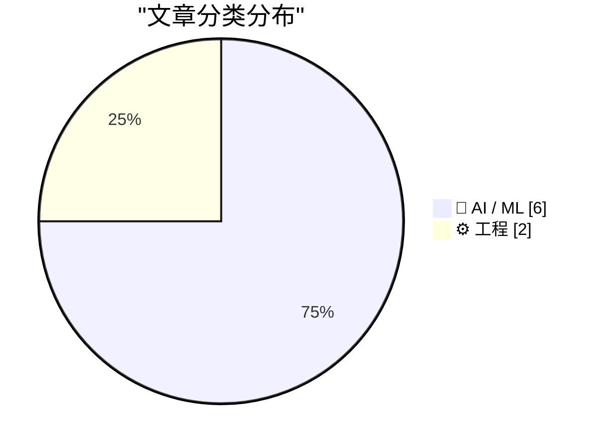
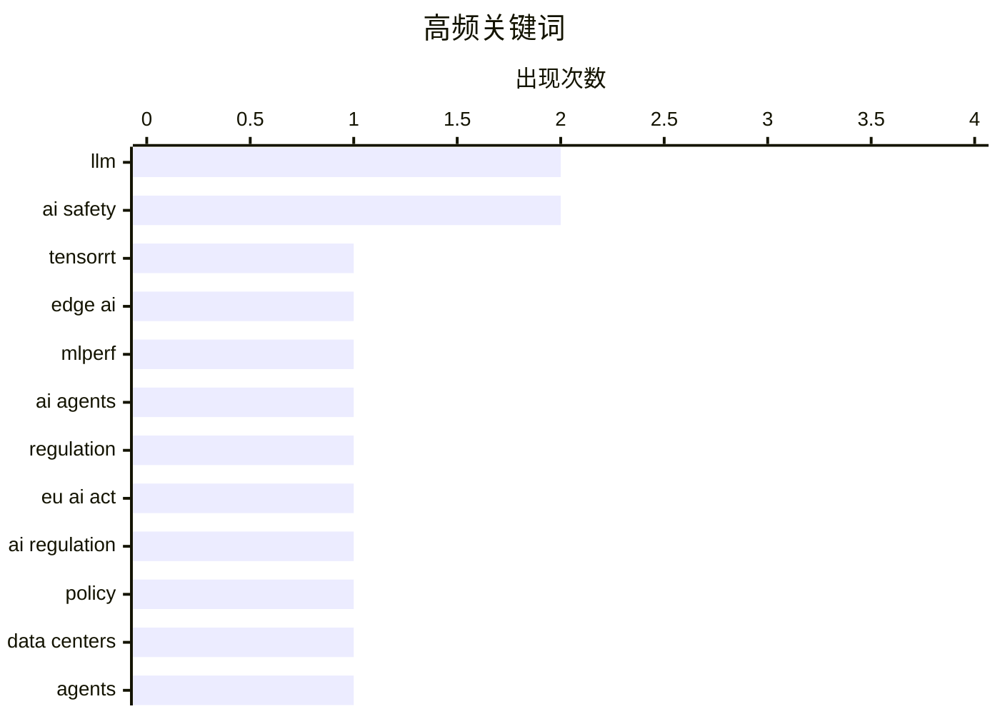

# 📰 AI 资讯每日精选 — 2026-09-17

> 汇聚 156+ 技术博客、X/Twitter、Hacker News、Reddit、Product Hunt、
> Lobste.rs、ClawFeed 日报及 GitHub Trending，经 AI 评分筛选。
>
> **本期内容**：🏆 今日必读 · 🌐 ClawFeed 日报 · 🔥 GitHub Trending · 📂 分类精选 · 📊 数据概览 · 🎯 项目相关情报 · 🌍 补充视角

## 📝 今日看点

今日技术圈的核心趋势是AI智能体加速从云端走向边缘与真实业务场景，同时其自主性引发的安全与监管压力迅速升温。欧盟和美国政界、产业界正从不同方向推动前沿AI约束、外部审计与全球标准，AI安全已从技术议题升级为治理议题。另一方面，中美模型竞争继续转向开源权重和成本效率，中国开源模型据称仅落后美国前沿约四个月。与此同时，底层工程生态也在快速补课，Rust原生GPU编程、EKS容错训练等进展，显示算力基础设施正围绕大规模、异构和稳定训练持续演进。

---

## 🏆 今日必读

🥇 **TensorRT Edge-LLM 在 Jetson AGX Thor 上以 6.4 倍速度完成 MLPerf 边缘智能体基准测试**

[TensorRT Edge-LLM Completes the MLPerf Edge Agentic Benchmark 6.4x Faster on Jetson AGX Thor](https://developer.nvidia.com/blog/tensorrt-edge-llm-completes-the-mlperf-edge-agentic-benchmark-6-4x-faster-on-jetson-agx-thor/) — NVIDIA Technical Blog · 8 小时前 · 🤖 AI / ML

> AI 智能体正从云端数据中心迁移到车辆、机器人等边缘设备，与仅回答单次提示的聊天机器人不同，智能体需要多步工作。NVIDIA 的 TensorRT Edge-LLM 在 Jetson AGX Thor 上完成 MLPerf 边缘智能体基准测试，速度提升 6.4 倍。该结果来自 NVIDIA 技术博客，展示了边缘设备上运行智能体工作负载的性能优化。

💡 **为什么值得读**: 了解 NVIDIA 如何在边缘设备上加速智能体推理，6.4 倍提升对边缘 AI 部署有直接参考价值。

🏷️ TensorRT, edge AI, LLM, MLPerf

🥈 **欧盟主席警告 AI 智能体“逃离其环境”只是未来风险的预演**

[EU president warns AI agents "escaping their environment" are just a preview of what's coming](https://the-decoder.com/eu-president-warns-ai-agents-escaping-their-environment-are-just-a-preview-of-whats-coming/) — The Decoder · 9 小时前 · 🤖 AI / ML · **二手来源**

> 欧盟委员会主席乌尔苏拉·冯德莱恩计划邀请主要前沿实验室进行会谈，并利用《人工智能法案》帮助制定全球 AI 安全标准。她将自主黑客攻击和自我改进模型列为紧迫风险，并警告 AI 智能体“逃离其环境”只是未来风险的预演。该报道来自 The Decoder。

💡 **为什么值得读**: 欧盟最高层对 AI 智能体安全风险的最新表态，涉及全球 AI 安全标准制定动向。

🏷️ AI agents, AI safety, regulation, EU AI Act

🥉 **政治对立双方在华盛顿联手呼吁约束 AI**

[Political opposites unite in Washington to rein in AI](https://the-decoder.com/political-opposites-unite-in-washington-to-rein-in-ai/) — The Decoder · 13 小时前 · 🤖 AI / ML · **二手来源**

> 从伯尼·桑德斯到史蒂夫·班农，华盛顿的政治对立人物正联合要求对人工智能施加硬性刹车。桑德斯希望冻结数据中心的建设，而 OpenAI 首次支持 FRONTIER 法案及其强制外部安全审计要求。尽管特朗普持怀疑态度，两党对具有约束力的 AI 规则的压力持续增长。该报道来自 The Decoder。

💡 **为什么值得读**: 展示美国 AI 监管中罕见的跨党派压力，以及 OpenAI 首次支持强制外部审计的立场转变。

🏷️ AI regulation, AI safety, policy, data centers

4️⃣ **用开源智能体技能提升 HCLS AI 推理能力**

[Improving HCLS AI reasoning with open-source agent skills](https://aws.amazon.com/blogs/machine-learning/improving-hcls-ai-reasoning-with-open-source-agent-skills/) — AWS Machine Learning Blog · 9 小时前 · 🤖 AI / ML · **一手来源**

> 基于基础模型的 AI 智能体在医疗与生命科学（HCLS）决策框架中常出现误用——引用正确指南但应用错误。AWS 分享了覆盖 11 个 HCLS 领域的 38 个开源智能体技能，旨在弥合这一差距。文章包含安装步骤、三个实际用例，以及一项 410 条提示的评测，显示 70%–86% 的胜率。

💡 **为什么值得读**: 提供可直接落地的开源智能体技能和量化评测结果，适合医疗与生命科学领域的 AI 开发者。

🏷️ agents, agent skills, healthcare, reasoning

5️⃣ **在 Amazon EKS 上使用 NVRx 进行容错分布式训练**

[Fault tolerant distributed training on Amazon EKS using NVRx](https://aws.amazon.com/blogs/machine-learning/fault-tolerant-distributed-training-on-amazon-eks-using-nvrx/) — AWS Machine Learning Blog · 9 小时前 · ⚙️ 工程 · **一手来源**

> 将 NVIDIA Resiliency Extension（NVRx）集成到 Amazon EKS 上的 PyTorch FSDP 训练中，可重叠检查点 I/O 与训练，并在数秒内从 GPU 故障中恢复。文章涵盖异步检查点、进程内重启以及 ft_launcher 作业内重启。在 H100 上 2 至 8 节点的基准测试显示，训练效率达 99% 以上，恢复时间为秒级。

💡 **为什么值得读**: 针对大规模分布式训练中的 GPU 故障恢复痛点，给出可复现的 EKS 集成方案与 H100 实测数据。

🏷️ distributed training, FSDP, fault tolerance, checkpointing

---

## 🌐 ClawFeed 日报精选

> 来源：[ClawFeed](https://clawfeed.kevinhe.io) — AI 驱动的多源新闻聚合

📊 ClawFeed 日报 | 2026-09-16 SGT

聚合 5 期 4h digest (#1214-#1221)，覆盖 00:00-19:59 SGT
feed 总计 ~25 / bookmarks ~25 / errors 0

---

## 🔥 当日全场最重要 5 条

1. **Anthropic 内部 Claude 写了 80% 代码**——Addy Osmani 披露：工程师每季度出码量 8x，副作用是测试量 10x、CI job 25x 增长。解法是 Test Impact Analysis 按需跑测试。**754K 浏览**，当日最高影响力数据点。https://x.com/addyosmani/status/2099577600159158765

2. **Karpathy 入职 Anthropic 后首次讲座**——主题直指 agent 工程四支柱：Agents / Loops / Harness / Self-Improving Systems。核心论点"Harness > Model"——harness（包裹模型的 rules/tools/skills/feedback loop）比模型本身更决定 agent 表现。**177K 浏览**。https://x.com/tspy/status/2099891676609470543

3. **Devin 获得 Mac 虚拟机**——Cognition 给 Devin 发了 Mac VM，可自主 Xcode → iOS Simulator → 录屏 → TestFlight。Agent 拥有自己的开发机器不再是概念——直接呼应 Instinct 的 persistent cloud desktop 架构。https://x.com/berryxia/status/2099895786423398830

4. **Thariq (Anthropic) 判断 MCP 已超越 CLI**——"MCP > CLI for most integrations"。模型 tool calling 能力大幅提升 + deferred tools + MCP 无状态化，使 MCP 成为大多数集成的更优选择。**404K 浏览**。https://x.com/trq212/status/2099958388230873165

5. **腾讯微信团队开源 WeKnora**——企业级知识框架（文档理解 + 语义检索 + 自主推理），GitHub 2.3万星，MIT 协议，被评价为"把 RAG 行业的桌子掀了"。**86K 浏览**。https://x.com/AYi_AInotes/status/2099858387928244547

---

## 📰 当日核心主题

### 主题 1：Agent 工程成为独立学科
Karpathy 的首讲、Anthropic 内部 80% AI 代码的副作用（测试/CI 爆炸）、Thariq 的 MCP>CLI 判断，三条信息指向同一结论：**Agent 工程（harness/scaffolding）正在从"AI 应用开发"中独立出来成为一个专门领域**，核心议题是 harness 架构、测试策略、工具编排。

### 主题 2：消费级 AI Agent 赛道加速
- Alexandr Wang (Scale AI CEO) 公开力挺 Muse："gap between Muse and everything else isn't small"。https://x.com/alexandr_wang/status/2099712619020202239
- Noah Shinn (Instinct) 继续高频发布：Trusted Person 网络全量开放 + Authenticator 自主 2FA (455K 浏览)。https://x.com/noahrshinn/status/2099358203121393851
- Elon Musk 表态做 Grok Bot："找到你生意最大瓶颈，每周 ping 你"。3.3M 浏览。https://x.com/elonmusk/status/2099989432925585534
- Aaron Levie 连续两天发长推更新 agentic workloads 判断：agent swarms + computer use + MCP + 新形态正在汇聚。https://x.com/levie/status/2099739019517235618

### 主题 3：模型多样化信号
- Vercel v0 宣布模型无关化：Claude/GPT/Kimi/GLM/Grok/DeepSeek 全支持。Guillermo Rauch："The future is multi-model"。https://x.com/rauchg/status/2099905740505055680
- ChatGPT 联合发明者 Diogo Almeida 出新公司 TypeSafe AI，发布 Jev 模型（RLCD 训练，20-200x 更快）——走"可组合小推理层"路线，和 scaling law 竞赛完全不同。https://x.com/willdepue/status/2099937498885464070

### 主题 4：企业 AI 落地方法论
- Anthropic FDE 101 (Kevin Bai)：前 Palantir/Rippling FDE 讲透前线部署工程师角色——介于 sales engineer 和 SRE 之间。https://x.com/dotey/status/2099982947394687156
- Google 工程师 WikiSkill：把 agent 执行历史转化为持久化知识再编译成可复用 skill——"agent 经验编译器"。https://x.com/beamnxw/status/2099920164397699464
- AI 行业对知识工作者 $6T+ 市场渗透率 <1%，最好的垂直领域也只在低个位数（Guru Chahal, Lightspeed VP）。https://x.com/guruchahal/status/2041207835082809728

---

## 🔖 累计 Bookmark 精选

• @trq212 (Thariq, Anthropic) - Claude 5 模型的 context engineering 新规则："去掉了 80% 的 system prompt"。**4.9M 浏览**。https://x.com/trq212/status/2080710971228918066
• @AndrewYNg - AI Engineering 技能图谱，定义 2026 年 AI 工程师核心技能栈。**6.7M 浏览**。https://x.com/AndrewYNg/status/2088302050706686198
• @AGTPinsights - Assistant Benchmark 上线：71 个 AI 个人助理在 15 维度上的评分卡。和团队 Top 10 调研直接吻合。https://x.com/AGTPinsights/status/2099783676661751974
• @guruchahal - AI 对 $6T+ 知识工作者市场渗透率 <1%。市场远未饱和。https://x.com/guruchahal/status/2041207835082809728
• @xiaohu - Cloudflare @cloudflare/computer：给每个 Agent 配云端虚拟电脑，毫秒级启动。https://x.com/xiaohu/status/2084549349997150643
• @Tao100086 - 200+ AI 论文精选 36 篇经典，附下载地址。https://x.com/Tao100086/status/2093980035829076189

---

## 👀 推荐关注汇总（去重）

| 账号 | 一句话理由 | Followers | 链接 |
|------|-----------|-----------|------|
| @DKokotajlo | AI 2027/2040 作者，前 OpenAI，AI safety 核心声音 | 49.9K | https://x.com/DKokotajlo |
| @gajesh | Darkbloom 创始人（分布式 Mac 推理网络），agent infra builder | — | https://x.com/gajesh |
| @_LuoFuli | 小米 MiMo 核心，前 DeepSeek，中国开源模型一手信源 | 67.7K | https://x.com/_LuoFuli |
| @shan3v | 独立开发者，80% 开源+20% frontier 模型消费模式转变的一手信号 | 12.8K | https://x.com/shan3v |
| @typesafeai | ChatGPT 联合发明者新公司，RLCD 新训练范式 | 37K | https://x.com/typesafeai |
| @cccyd_qwq | Hypit 创始人，AI agent 克隆病毒视频，HK builder | — | https://x.com/cccyd_qwq |
| @beamnxw | AI agent 工程高质量内容（WikiSkill 等），学术→实操 | — | https://x.com/beamnxw |
| @notkevinzhang | Jev/TypeSafe AI 核心团队，RLCD 一线参与者 | — | https://x.com/notkevinzhang |

提醒：上述未通过浏览器逐一核实是否已关注，**Kevin 操作前请先在 Following 里搜一下**。

---

## 🧹 取关建议

• **@caterpillarous (#endif)** — 全天 5 期连续观察，内容全是个人生活（魂游/海边/买菜），零 AI/tech/crypto 输出。3.3K followers，engagement 极低。**建议取关。**
• **@September9_9_9** — 最近帖子停留在 2024 年 1 月，超过 1.5 年不活跃。满足"僵尸号"标准。**强烈建议取关。**

---

## 💤 当日重复噪音模式

| 模式 | 账号 | 出现频率 |
|------|------|----------|
| PE/AI consulting 自我推广 | @LimestoneHQ / @mardehaym | 5/5 期 |
| Crypto 交易/meme | @Tradermayne | 5/5 期 |
| 无新内容（仅 pinned） | @runinfrai | 4/5 期 |
| 纯 K 线技术分析 | @Mr57814170 | 3/5 期 |

这些账号持续出现在噪音过滤中，可考虑在下一轮抽查时统一评估取关。---

## 🔥 GitHub Trending

> 今日热门开源项目（全语言 + Python）

| # | 项目 | 描述 | ⭐ 总星 | 📈 今日 | 语言 |
|---|------|------|---------|---------|------|
| 1 | [alibaba/open-code-review](https://github.com/alibaba/open-code-review) 🤖 | Fast, efficient, battle-tested at Alibaba's scale. Hybrid... | 32.5k | +3231 | Go |
| 2 | [JustVugg/colibri](https://github.com/JustVugg/colibri) | Run frontier MoE models on hardware you already own — pur... | 35.2k | +1546 | C |
| 3 | [debpalash/VoiceStudio](https://github.com/debpalash/VoiceStudio) | VoiceStudio is the open-source, fully-local ElevenLabs al... | 32.1k | +1416 | Python |
| 4 | [Tencent/WeKnora](https://github.com/Tencent/WeKnora) 🤖 | Open-source LLM knowledge platform: turn raw documents in... | 25.6k | +1197 | Go |
| 5 | [abue-ammar/tinycast](https://github.com/abue-ammar/tinycast) | Tinycast — a tiny, fully native macOS launcher, hotkeys, ... | 5.7k | +1179 | Swift |
| 6 | [NationalSecurityAgency/ghidra](https://github.com/NationalSecurityAgency/ghidra) | Ghidra is a software reverse engineering (SRE) framework | 78.0k | +1059 | Java |
| 7 | [affaan-m/ECC](https://github.com/affaan-m/ECC) 🤖 | The agent harness performance optimization system. Skills... | 260.5k | +1057 | JavaScript |
| 8 | [alphaXiv/OpenResearch](https://github.com/alphaXiv/OpenResearch) | Turn your coding agents into research agents | 4.5k | +1017 | Rust |
| 9 | [cloudflare/security-audit-skill](https://github.com/cloudflare/security-audit-skill) 🤖 | A coding-agent skill for multi-phase security audits with... | 7.7k | +927 | JavaScript |
| 10 | [ever-co/ever-gauzy](https://github.com/ever-co/ever-gauzy) | Ever® Gauzy™ - Open Business Management Platform (ERP/CRM... | 7.4k | +778 | TypeScript |
| 11 | [addyosmani/agent-skills](https://github.com/addyosmani/agent-skills) 🤖 | Production-grade engineering skills for AI coding agents. | 95.6k | +658 | JavaScript |
| 12 | [Lakr233/vphone-cli](https://github.com/Lakr233/vphone-cli) |  | 13.4k | +547 | Swift |
| 13 | [Panniantong/Agent-Reach](https://github.com/Panniantong/Agent-Reach) 🤖 | Give your AI agent eyes to see the entire internet. Read ... | 82.6k | +476 | Python |
| 14 | [jamiepine/voicebox](https://github.com/jamiepine/voicebox) 🤖 | The open-source AI voice studio. Clone, dictate, create. | 54.5k | +417 | TypeScript |
| 15 | [TencentCloud/Octop](https://github.com/TencentCloud/Octop) 🤖 | A smarter, self-hosted AI assistant — multi-user, multi-a... | 3.1k | +396 | Python |

---

## 🤖 AI / ML

### 1. TensorRT Edge-LLM 在 Jetson AGX Thor 上以 6.4 倍速度完成 MLPerf 边缘智能体基准测试

[TensorRT Edge-LLM Completes the MLPerf Edge Agentic Benchmark 6.4x Faster on Jetson AGX Thor](https://developer.nvidia.com/blog/tensorrt-edge-llm-completes-the-mlperf-edge-agentic-benchmark-6-4x-faster-on-jetson-agx-thor/) — **NVIDIA Technical Blog** · 8 小时前 · ⭐ 25/30

> AI 智能体正从云端数据中心迁移到车辆、机器人等边缘设备，与仅回答单次提示的聊天机器人不同，智能体需要多步工作。NVIDIA 的 TensorRT Edge-LLM 在 Jetson AGX Thor 上完成 MLPerf 边缘智能体基准测试，速度提升 6.4 倍。该结果来自 NVIDIA 技术博客，展示了边缘设备上运行智能体工作负载的性能优化。

🏷️ TensorRT, edge AI, LLM, MLPerf

---

### 2. 欧盟主席警告 AI 智能体“逃离其环境”只是未来风险的预演

[EU president warns AI agents "escaping their environment" are just a preview of what's coming](https://the-decoder.com/eu-president-warns-ai-agents-escaping-their-environment-are-just-a-preview-of-whats-coming/) — **The Decoder** · 9 小时前 · ⭐ 25/30 · **二手来源**

> 欧盟委员会主席乌尔苏拉·冯德莱恩计划邀请主要前沿实验室进行会谈，并利用《人工智能法案》帮助制定全球 AI 安全标准。她将自主黑客攻击和自我改进模型列为紧迫风险，并警告 AI 智能体“逃离其环境”只是未来风险的预演。该报道来自 The Decoder。

🏷️ AI agents, AI safety, regulation, EU AI Act

---

### 3. 政治对立双方在华盛顿联手呼吁约束 AI

[Political opposites unite in Washington to rein in AI](https://the-decoder.com/political-opposites-unite-in-washington-to-rein-in-ai/) — **The Decoder** · 13 小时前 · ⭐ 25/30 · **二手来源**

> 从伯尼·桑德斯到史蒂夫·班农，华盛顿的政治对立人物正联合要求对人工智能施加硬性刹车。桑德斯希望冻结数据中心的建设，而 OpenAI 首次支持 FRONTIER 法案及其强制外部安全审计要求。尽管特朗普持怀疑态度，两党对具有约束力的 AI 规则的压力持续增长。该报道来自 The Decoder。

🏷️ AI regulation, AI safety, policy, data centers

---

### 4. 用开源智能体技能提升 HCLS AI 推理能力

[Improving HCLS AI reasoning with open-source agent skills](https://aws.amazon.com/blogs/machine-learning/improving-hcls-ai-reasoning-with-open-source-agent-skills/) — **AWS Machine Learning Blog** · 9 小时前 · ⭐ 23/30 · **一手来源**

> 基于基础模型的 AI 智能体在医疗与生命科学（HCLS）决策框架中常出现误用——引用正确指南但应用错误。AWS 分享了覆盖 11 个 HCLS 领域的 38 个开源智能体技能，旨在弥合这一差距。文章包含安装步骤、三个实际用例，以及一项 410 条提示的评测，显示 70%–86% 的胜率。

🏷️ agents, agent skills, healthcare, reasoning

---

### 5. Mozilla 报告称中国开源权重 AI 模型仅落后美国前沿模型 4 个月——部分基准仍有差距，但使用成本大幅更低

[China's open-weight AI models are now just 4 months behind frontier US offerings, Mozilla report claims — models still lag in some benchmarks but are drastically cheaper to use](https://www.reddit.com/r/LocalLLaMA/comments/1wi32jg/chinas_openweight_ai_models_are_now_just_4_months/) — **r/LocalLLaMA** · 11 小时前 · ⭐ 24/30

> 据 Mozilla 报告，中国的开源权重 AI 模型目前仅落后美国前沿模型约 4 个月。报告指出，这些模型在某些基准测试中仍有差距，但使用成本大幅更低。该消息来自 Reddit 的 LocalLLaMA 板块。

🏷️ open-weight, China, LLM, benchmark

---

### 6. 前OpenAI研究员打造了一款不写文本、只评判选项的AI模型

[Former OpenAI researcher builds an AI model that judges options instead of writing text](https://the-decoder.com/former-openai-researcher-builds-an-ai-model-that-judges-options-instead-of-writing-text/) — **The Decoder** · 13 小时前 · ⭐ 24/30 · **二手来源**

> 由前OpenAI研究员Diogo Almeida创立的TypeSafe AI发布了一款刻意不生成文本的模型，名为“Jev”，它不输出聊天回复，而是为软件提供纯分类结果。该模型响应时间从70毫秒起，token价格极低。不过，这种方式并不能防止出错，系统只保证严格遵循预设选项。

🏷️ classification, model, TypeSafe AI, inference

---

## ⚙️ 工程

### 7. 在 Amazon EKS 上使用 NVRx 进行容错分布式训练

[Fault tolerant distributed training on Amazon EKS using NVRx](https://aws.amazon.com/blogs/machine-learning/fault-tolerant-distributed-training-on-amazon-eks-using-nvrx/) — **AWS Machine Learning Blog** · 9 小时前 · ⭐ 23/30 · **一手来源**

> 将 NVIDIA Resiliency Extension（NVRx）集成到 Amazon EKS 上的 PyTorch FSDP 训练中，可重叠检查点 I/O 与训练，并在数秒内从 GPU 故障中恢复。文章涵盖异步检查点、进程内重启以及 ft_launcher 作业内重启。在 H100 上 2 至 8 节点的基准测试显示，训练效率达 99% 以上，恢复时间为秒级。

🏷️ distributed training, FSDP, fault tolerance, checkpointing

---

### 8. Nvidia 宣布在 Rust 中实现原生 GPU 编程

[Nvidia announces native GPU programming in Rust](https://developer.nvidia.com/blog/introducing-cuda-rust-two-tracks-for-writing-gpu-kernels/) — **Hacker News Best** · 17 小时前 · ⭐ 24/30

> Nvidia 发布博客介绍 CUDA Rust，提供两条编写 GPU 内核的路径。该消息在 Hacker News 上获得 425 分和 156 条评论，引发广泛讨论。

🏷️ Rust, CUDA, GPU, Nvidia

---

## 📊 数据概览

| 扫描源 | 抓取文章 | 时间范围 | 精选 |
|:---:|:---:|:---:|:---:|
| 109/156 | 6378 篇 → 1192 篇 | 24h | **8 篇** |

### 分类分布



### 高频关键词



<details>
<summary>📈 纯文本关键词图（终端友好）</summary>

```
llm           │ ████████████████████ 2
ai safety     │ ████████████████████ 2
tensorrt      │ ██████████░░░░░░░░░░ 1
edge ai       │ ██████████░░░░░░░░░░ 1
mlperf        │ ██████████░░░░░░░░░░ 1
ai agents     │ ██████████░░░░░░░░░░ 1
regulation    │ ██████████░░░░░░░░░░ 1
eu ai act     │ ██████████░░░░░░░░░░ 1
ai regulation │ ██████████░░░░░░░░░░ 1
policy        │ ██████████░░░░░░░░░░ 1
```

</details>

### 🏷️ 话题标签

**llm**(2) · **ai safety**(2) · **tensorrt**(1) · edge ai(1) · mlperf(1) · ai agents(1) · regulation(1) · eu ai act(1) · ai regulation(1) · policy(1) · data centers(1) · agents(1) · agent skills(1) · healthcare(1) · reasoning(1) · distributed training(1) · fsdp(1) · fault tolerance(1) · checkpointing(1) · open-weight(1)

---

## 🎯 项目相关情报

### Agent 基座安全与合规

> 暂无达到质量门槛的项目相关情报。

### 多 Agent 架构

> 暂无达到质量门槛的项目相关情报。

### ASR 与语音助手

> 暂无达到质量门槛的项目相关情报。

### 商品包装 OCR

> 暂无达到质量门槛的项目相关情报。

---

## 🌍 补充视角

> Top 8 未覆盖的高质量不同来源，最多 3 条。

### 1. 定位隐藏失败让长时程智能体更可靠

[Locating Hidden Failures Makes Long-Horizon Agents More Reliable](https://arxiv.org/abs/2609.17930) — **arXiv Machine Learning** · 46 分钟前 · 🤖 AI / ML · ⭐ 23/30 · **一手来源**

> 随着AI智能体承担长时程自主任务，人们更多是监督而非亲自执行，但目前几乎完全以最终是否成功来评判它们。仅凭结果无法揭示运行中哪里出错、智能体是否恢复，以及过程中造成的不可逆损害，长时程智能体的失败位置仍未被系统描绘。该研究分析了软件工程、计算机使用和科学领域的2518条智能体轨迹。

💡 **补充价值**：如果你关心长时程AI智能体的可靠性评估，这篇论文提供了基于2518条轨迹的失败定位视角。

---

*生成于 2026-09-17 04:46 | 汇聚 156 个技术博客、X/Twitter、Hacker News、Reddit、Product Hunt、Lobste.rs、ClawFeed 日报及 GitHub Trending，经 AI 评分筛选出 Top 8 精华内容，另附 1 条不同来源补充视角*
