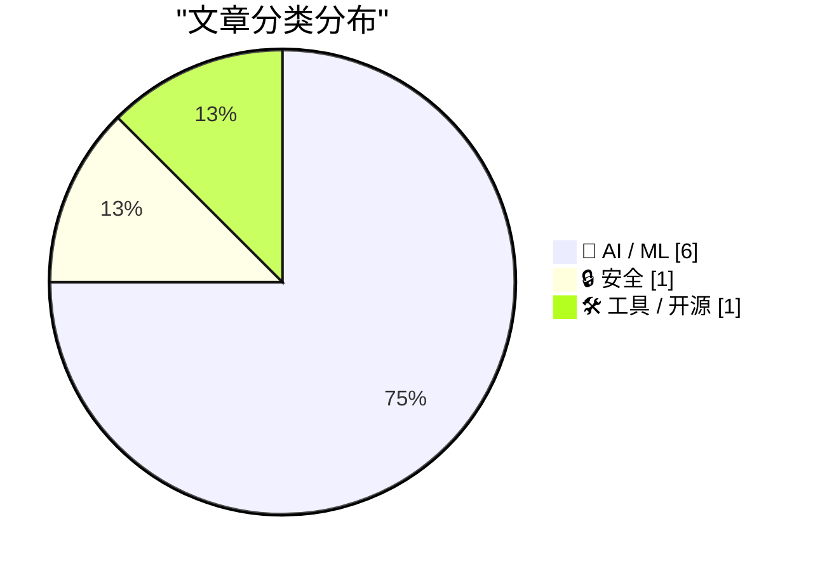
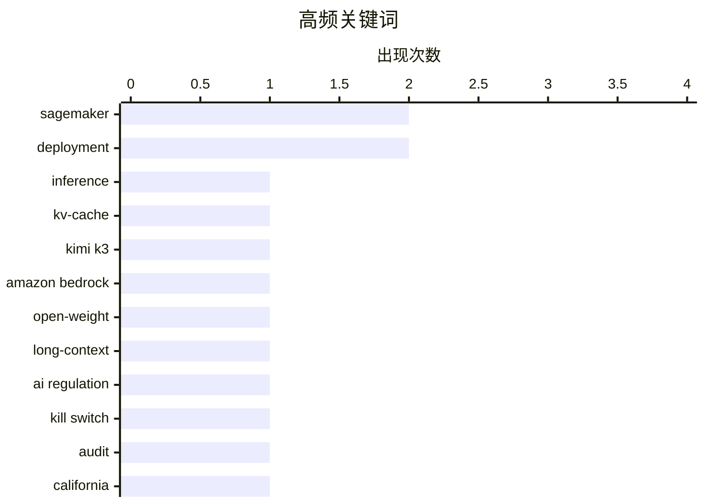

# 📰 AI 资讯每日精选 — 2026-09-19

> 汇聚 156+ 技术博客、X/Twitter、Hacker News、Reddit、Product Hunt、
> Lobste.rs、ClawFeed 日报及 GitHub Trending，经 AI 评分筛选。
>
> **本期内容**：🏆 今日必读 · 🌐 ClawFeed 日报 · 🔥 GitHub Trending · 📂 分类精选 · 📊 数据概览 · 🎯 项目相关情报

## 📝 今日看点

今日技术圈的主线很清晰：AI安全与治理正从原则讨论转向硬约束，围绕模型“终止开关”、独立审计和危险事件报告的制度探索明显提速。与此同时，多起AI误用与攻击事件——从虚假情报到模型被用于突破内部系统——让能力滥用和系统脆弱性成为焦点。另一条主线是AI工程化落地继续加速，云平台正把开放权重、长上下文和编码代理等能力快速产品化、标准化。数据与劳动力价值争议也在升温，AI抓取引发的版权与合规博弈恐难降温。整体看，AI正同时进入强监管、强工程化与强争议的新阶段。

---

## 🏆 今日必读

🥇 **Amazon SageMaker Inference：2026 年迄今发布功能回顾**

[Amazon SageMaker Inference: 2026 year-to-date launches in review](https://aws.amazon.com/blogs/machine-learning/amazon-sagemaker-inference-2026-year-to-date-launches-in-review/) — AWS Machine Learning Blog · 7 小时前 · 🤖 AI / ML · **一手来源**

> Amazon SageMaker AI 在 2026 年迄今共推出 13 项推理相关发布，覆盖两条部署路径：全托管端点和 Amazon SageMaker HyperPod Inference。文章逐一回顾了这些发布，包括推理建议、容量感知实例池、分层 KV 缓存以及分离式 prefill 与 decode。读者可借此了解 SageMaker 推理能力在今年的整体演进脉络。

💡 **为什么值得读**: 想快速掌握 SageMaker 推理今年全部新功能与两条部署路径差异的人，这一篇汇总即可省去逐条翻公告的时间。

🏷️ SageMaker, inference, KV-cache, deployment

🥈 **在 Amazon Bedrock 上推出 Kimi K3**

[Introducing Kimi K3 on Amazon Bedrock](https://aws.amazon.com/blogs/machine-learning/introducing-kimi-k3-on-amazon-bedrock/) — AWS Machine Learning Blog · 11 小时前 · 🤖 AI / ML · **一手来源**

> Moonshot AI 的 Kimi K3 现已在 Amazon Bedrock 上提供，定位为面向编程和知识工作的开放权重模型选项。据文章介绍，它具备原生视觉能力、100 万 token 上下文窗口，并支持显式提示缓存以降低延迟和输入成本。

💡 **为什么值得读**: 如果你在 Bedrock 上选型编程或长上下文模型，这篇给出了 Kimi K3 的关键规格与可用性信息。

🏷️ Kimi K3, Amazon Bedrock, open-weight, long-context

🥉 **加州州长纽森签署行政令，要求为 AI 模型设置“终止开关”**

[California Governor Newsom signs executive order demanding "kill switch" for AI models](https://the-decoder.com/california-governor-newsom-signs-executive-order-demanding-kill-switch-for-ai-models/) — The Decoder · 10 小时前 · 🤖 AI / ML · **二手来源**

> 加州州长加文·纽森签署行政令，寻求在 AI 实验室内部派驻独立审计人员，并为 AI 模型设置“终止开关”。一个专家小组有两个月时间提交建议。纽森表示，目前没有联邦法律要求 AI 公司报告危险事件。

💡 **为什么值得读**: 这是美国州级层面针对 AI 审计与紧急关停机制的最新监管动作，关注 AI 治理的人值得了解其具体诉求与时间表。

🏷️ AI regulation, kill switch, audit, California

4️⃣ **美军因使用 AI 生成的虚假情报报告而险些酿成事故**

[US Military had close call after using AI for hallucinated intelligence report](https://www.cnn.com/2026/09/18/politics/us-military-ai-false-intelligence-china-ship) — Hacker News Best · 11 小时前 · 🤖 AI / ML

> 据 CNN 报道，美军在一次事件中使用了 AI 生成的虚假情报报告，导致出现险情。该报道在 Hacker News 上获得 416 分和 317 条评论，讨论热度较高。

💡 **为什么值得读**: 这是 AI 幻觉在真实军事决策场景中造成风险的典型案例，适合关注 AI 可靠性与高风险应用的人阅读。

🏷️ hallucination, military, LLM, AI safety

5️⃣ **安全研究人员用 Anthropic 的 Claude 在 72 小时内攻破 OpenAI 内部系统**

[Security researchers used Anthropic's Claude to hack OpenAI's internal systems in under 72 hours](https://the-decoder.com/security-researchers-used-anthropics-claude-to-hack-openais-internal-systems-in-under-72-hours/) — The Decoder · 11 小时前 · 🔒 安全 · **可追溯二手**

> 三名安全研究人员利用 Anthropic 的 Claude 模型，通过 OpenAI 的社区论坛在不到 72 小时内入侵了其内部系统。据该团队称，Opus 5 成功绕过了其前代模型无法突破的一项常见安全措施。该攻击表明，更新的 AI 模型可以降低利用安全漏洞所需的时间和专业门槛。

💡 **为什么值得读**: 它直观展示了前沿模型如何被用于加速真实攻击，对安全从业者评估 AI 带来的攻防节奏变化很有参考价值。

🏷️ Claude, AI security, hacking, OpenAI

---

## 🌐 ClawFeed 日报精选

> 来源：[ClawFeed](https://clawfeed.kevinhe.io) — AI 驱动的多源新闻聚合

📊 ClawFeed 日报 | 2026-09-18 SGT

聚合 5 期 4h digest (#1231-#1235)，覆盖 00:00-19:59 SGT
feed 总计 ~25 / bookmarks ~25 / errors 0

---

## 🔥 当日全场最重要 5 条

1. **Jev（TypeSafe AI）全面爆发——ChatGPT 联合发明人的决策专用模型**——用 RLCD 训练的分类/路由/排序模型，20-200x 速度、40-400x 成本优势，输出侧免费。名字源自 Jevons 悖论。Browser Use + Stagehand 集成实现单任务 $0.001。130+ 项目导航站上线（logicrw/awesome-jev-projects），LangChain 官方集成构建 Agent Harness。中文圈从"这是什么"进入"怎么用"阶段，实操教程涌现。

2. **Claude Code Projects 上线——多线程并行执行+上下文共享**——自动拆任务为多线程并行执行，线程间共享上下文，离开电脑后继续工作。从"对话辅助"到"项目自治"的跨越，对 OpenMax 多 agent 架构有直接参考价值。

3. **Rene 正式发布——iMessage 原生多人协作 AI agent**——像发短信一样用，能浏览网页/写代码/购物/做网站/做 PPT/做图片，multiplayer-first 设计，已内测四个月。代表个人助理赛道的新品类方向。

4. **Aaron Levie 论 agentic workload 质变拐点**——agent swarm + computer use + API/MCP + Muse/Instinct 新形态 + 垂直企业 agent = 企业级 AI 全面升级，"我们需要更新对即将到来的东西的认知"。

5. **Assistant Benchmark 正式上线**——公开评分卡排名 71 个 AI 个人助理，15 维度打分（速度/记忆/邮件/研究/购物/权限等），首个同类横评体系 assistantbenchmark.com。与 Jessie 的 OAB 工作直接相关。

---

## 📰 当日核心主题

### 🏷️ Jev / TypeSafe AI（全天主导，5 期 feed 几乎全覆盖）
- **技术本质**：不生成文本，只输出决策（Choice/Score/Bool schema），RLCD 训练+并行推理替代自回归
- **生态爆发**：Browser Use 集成、Cua Driver "jev-use" Fast Computer Use、jev-trader 开源、LangChain 官方集成、130+ 项目导航站
- **实操落地**：waitlist 当天过审、Codex 一键安装 TypeSafe skill、API Key 配置门槛极低
- **Harness 定位**：Agent = 观察→决策→行动→再观察循环，Jev 专注决策层，让 LLM 回归推理
- **创始人叙事**：ChatGPT 联合发明人两年隐身研发，核心问题"为什么超人级对话模型没有通向 AGI"

### 🏷️ 个人助理赛道
- Rene（iMessage 原生 multiplayer）、Instinct（"OpenClaw for normal people"，magic 级别体验）、Assistant Benchmark（71 助理横评）
- 赛道从硅谷早期用户扩展到大众化（帮家人设置）

### 🏷️ Agentic workload 拐点
- Aaron Levie 的四股力量汇聚判断（agent swarm / computer use / API+MCP / 新模型）
- Claude Code Projects 在 IDE 内实现多线程协作模式
- LangChain + Jev 构建 Agent Harness 范式

---

## 🔖 Bookmarks 精选

- **Rene**：iMessage 原生 AI agent 新品类，multiplayer-first
- **Instinct**："OpenClaw for normal people"，magic 级别体验，大众化验证
- **Assistant Benchmark**：71 AI 助理、15 维度首个公开横评
- **谢青池 AI 论文精选**：200+ 论文中选 36 篇经典，Codex 整理的下载地址
- **jev-trader**：@jarrodwatts 开源链上自动交易系统，14 小时实盘（亏 300% 但架构惊艳）

---

## 👀 推荐关注汇总

- **@typesafeai** — Jev 模型官方，RLCD 训练方法论持续输出
- **@jarrodwatts** — Monad 开发者，Jev 生态早期 builder，开源 demo 质量高
- **@reneiMessage** — Rene 官方，iMessage 原生 AI agent 新品类
- **@0xLogicrw** — Jev 生态整理者，130+ 项目导航站 + GitHub Actions 自动更新

---

## 💤 当日重复噪音模式

- **Jev 刷屏**：全天 5 期 feed 中 Jev 相关占比极高（约 20/25 条），属新模型发布后集中刷屏。内容有差异化角度（技术原理/实操教程/开源集成/项目导航/LangChain 集成），信息密度从第一天到第二天递减但不算无效重复。feed 多样性偏低。
- 1 条纯 crypto 交易推广（$ZEC@PhoenixTrade）为噪音。
---

## 🔥 GitHub Trending

> 今日热门开源项目（全语言 + Python）

| # | 项目 | 描述 | ⭐ 总星 | 📈 今日 | 语言 |
|---|------|------|---------|---------|------|
| 1 | [cloudflare/security-audit-skill](https://github.com/cloudflare/security-audit-skill) 🤖 | A coding-agent skill for multi-phase security audits with... | 14.1k | +3006 | JavaScript |
| 2 | [alibaba/open-code-review](https://github.com/alibaba/open-code-review) 🤖 | Secure, fast, efficient, battle-tested at Alibaba's scale... | 36.8k | +2704 | Go |
| 3 | [Tencent/BrowserSkill](https://github.com/Tencent/BrowserSkill) 🤖 | Let AI agents use your real, logged-in browser without in... | 5.4k | +1306 | TypeScript |
| 4 | [affaan-m/ECC](https://github.com/affaan-m/ECC) 🤖 | The agent harness performance optimization system. Skills... | 262.2k | +958 | JavaScript |
| 5 | [asciimoo/hister](https://github.com/asciimoo/hister) | Your own search engine | 5.0k | +889 | Go |
| 6 | [addyosmani/agent-skills](https://github.com/addyosmani/agent-skills) 🤖 | Production-grade engineering skills for AI coding agents. | 96.5k | +675 | JavaScript |
| 7 | [TencentCloud/Octop](https://github.com/TencentCloud/Octop) 🤖 | A smarter, self-hosted AI assistant — multi-user, multi-a... | 4.0k | +569 | Python |
| 8 | [coder/coder](https://github.com/coder/coder) | Secure environments for developers and their agents | 15.3k | +478 | Go |
| 9 | [anthropics/claude-code](https://github.com/anthropics/claude-code) 🤖 | Claude Code is an agentic coding tool that lives in your ... | 146.4k | +444 | TypeScript |
| 10 | [Graphify-Labs/graphify](https://github.com/Graphify-Labs/graphify) 🤖 | Turn any codebase, with its docs, SQL schemas, configs, a... | 119.4k | +387 | Python |
| 11 | [bobeff/open-source-games](https://github.com/bobeff/open-source-games) | A list of open source games. | 15.2k | +339 | Python |
| 12 | [D4Vinci/Scrapling](https://github.com/D4Vinci/Scrapling) | 🕷️ An adaptive Web Scraping framework that handles every... | 82.2k | +335 | Python |
| 13 | [anthropics/knowledge-work-plugins](https://github.com/anthropics/knowledge-work-plugins) 🤖 | Open source repository of plugins primarily intended for ... | 24.9k | +299 | Python |
| 14 | [Fission-AI/OpenSpec](https://github.com/Fission-AI/OpenSpec) 🤖 | Spec-driven development (SDD) for AI coding assistants. | 69.4k | +296 | TypeScript |
| 15 | [rustfs/rustfs](https://github.com/rustfs/rustfs) | RustFS is an open-source, S3-compatible high-performance ... | 33.2k | +267 | Rust |

---

## 🤖 AI / ML

### 1. Amazon SageMaker Inference：2026 年迄今发布功能回顾

[Amazon SageMaker Inference: 2026 year-to-date launches in review](https://aws.amazon.com/blogs/machine-learning/amazon-sagemaker-inference-2026-year-to-date-launches-in-review/) — **AWS Machine Learning Blog** · 7 小时前 · ⭐ 24/30 · **一手来源**

> Amazon SageMaker AI 在 2026 年迄今共推出 13 项推理相关发布，覆盖两条部署路径：全托管端点和 Amazon SageMaker HyperPod Inference。文章逐一回顾了这些发布，包括推理建议、容量感知实例池、分层 KV 缓存以及分离式 prefill 与 decode。读者可借此了解 SageMaker 推理能力在今年的整体演进脉络。

🏷️ SageMaker, inference, KV-cache, deployment

---

### 2. 在 Amazon Bedrock 上推出 Kimi K3

[Introducing Kimi K3 on Amazon Bedrock](https://aws.amazon.com/blogs/machine-learning/introducing-kimi-k3-on-amazon-bedrock/) — **AWS Machine Learning Blog** · 11 小时前 · ⭐ 24/30 · **一手来源**

> Moonshot AI 的 Kimi K3 现已在 Amazon Bedrock 上提供，定位为面向编程和知识工作的开放权重模型选项。据文章介绍，它具备原生视觉能力、100 万 token 上下文窗口，并支持显式提示缓存以降低延迟和输入成本。

🏷️ Kimi K3, Amazon Bedrock, open-weight, long-context

---

### 3. 加州州长纽森签署行政令，要求为 AI 模型设置“终止开关”

[California Governor Newsom signs executive order demanding "kill switch" for AI models](https://the-decoder.com/california-governor-newsom-signs-executive-order-demanding-kill-switch-for-ai-models/) — **The Decoder** · 10 小时前 · ⭐ 25/30 · **二手来源**

> 加州州长加文·纽森签署行政令，寻求在 AI 实验室内部派驻独立审计人员，并为 AI 模型设置“终止开关”。一个专家小组有两个月时间提交建议。纽森表示，目前没有联邦法律要求 AI 公司报告危险事件。

🏷️ AI regulation, kill switch, audit, California

---

### 4. 美军因使用 AI 生成的虚假情报报告而险些酿成事故

[US Military had close call after using AI for hallucinated intelligence report](https://www.cnn.com/2026/09/18/politics/us-military-ai-false-intelligence-china-ship) — **Hacker News Best** · 11 小时前 · ⭐ 25/30

> 据 CNN 报道，美军在一次事件中使用了 AI 生成的虚假情报报告，导致出现险情。该报道在 Hacker News 上获得 416 分和 317 条评论，讨论热度较高。

🏷️ hallucination, military, LLM, AI safety

---

### 5. 微软高管称 AI 抓取是“人类历史上最大的劳动力盗窃”

[Microsoft exec called AI scraping 'the largest theft of labor in human history'](https://techcrunch.com/2026/09/17/microsoft-exec-called-ai-scraping-the-largest-theft-of-labor-in-human-history-new-unredacted-filings-reveal/) — **Hacker News Best** · 18 小时前 · ⭐ 24/30

> 据 TechCrunch 报道，新近解密的法庭文件显示，一名微软高管曾将 AI 抓取称为“人类历史上最大的劳动力盗窃”。该报道在 Hacker News 上获得 867 分和 765 条评论，引发广泛讨论。

🏷️ AI scraping, copyright, training data, Microsoft

---

### 6. 使用编码代理在 Amazon SageMaker AI 上部署 Hugging Face 模型

[Deploy Hugging Face models on Amazon SageMaker AI with coding agents](https://aws.amazon.com/blogs/machine-learning/deploy-hugging-face-models-on-amazon-sagemaker-ai-with-coding-agents/) — **AWS Machine Learning Blog** · 13 小时前 · ⭐ 22/30 · **一手来源**

> 文章介绍如何用六个开源代理技能，在 Amazon SageMaker AI 上部署生产就绪的 Hugging Face 模型。只需把编码代理指向一个模型，就能得到带正确服务容器、自动扩缩容、Amazon CloudWatch 告警以及可验证拆除路径的实时端点。

🏷️ SageMaker, Hugging Face, coding agents, deployment

---

## 🔒 安全

### 7. 安全研究人员用 Anthropic 的 Claude 在 72 小时内攻破 OpenAI 内部系统

[Security researchers used Anthropic's Claude to hack OpenAI's internal systems in under 72 hours](https://the-decoder.com/security-researchers-used-anthropics-claude-to-hack-openais-internal-systems-in-under-72-hours/) — **The Decoder** · 11 小时前 · ⭐ 25/30 · **可追溯二手**

> 三名安全研究人员利用 Anthropic 的 Claude 模型，通过 OpenAI 的社区论坛在不到 72 小时内入侵了其内部系统。据该团队称，Opus 5 成功绕过了其前代模型无法突破的一项常见安全措施。该攻击表明，更新的 AI 模型可以降低利用安全漏洞所需的时间和专业门槛。

🏷️ Claude, AI security, hacking, OpenAI

---

## 🛠 工具 / 开源

### 8. 引用 Thariq Shihipar 的话

[Quoting Thariq Shihipar](https://simonwillison.net/2026/Sep/18/thariq-shihipar/) — **simonwillison.net** · 9 小时前 · ⭐ 23/30

> Thariq Shihipar 表示，Claude Code 正在加入对 AGENTS.md 的支持。从 2.1.277 版本开始，如果某个文件夹中没有 CLAUDE.md，Claude 将检查并使用 AGENTS.md。该支持基于 Claude Code mods 构建，这是其即将推出的自定义 Claude Code harness 的方式；AGENTS.md 支持是一个内置 mod，用户之后也可以自行构建自定义版本的项目指令。

🏷️ Claude Code, AGENTS.md, coding agent

---

## 📊 数据概览

| 扫描源 | 抓取文章 | 时间范围 | 精选 |
|:---:|:---:|:---:|:---:|
| 102/156 | 5315 篇 → 96 篇 | 24h | **8 篇** |

### 分类分布



### 高频关键词



<details>
<summary>📈 纯文本关键词图（终端友好）</summary>

```
sagemaker      │ ████████████████████ 2
deployment     │ ████████████████████ 2
inference      │ ██████████░░░░░░░░░░ 1
kv-cache       │ ██████████░░░░░░░░░░ 1
kimi k3        │ ██████████░░░░░░░░░░ 1
amazon bedrock │ ██████████░░░░░░░░░░ 1
open-weight    │ ██████████░░░░░░░░░░ 1
long-context   │ ██████████░░░░░░░░░░ 1
ai regulation  │ ██████████░░░░░░░░░░ 1
kill switch    │ ██████████░░░░░░░░░░ 1
```

</details>

### 🏷️ 话题标签

**sagemaker**(2) · **deployment**(2) · **inference**(1) · kv-cache(1) · kimi k3(1) · amazon bedrock(1) · open-weight(1) · long-context(1) · ai regulation(1) · kill switch(1) · audit(1) · california(1) · hallucination(1) · military(1) · llm(1) · ai safety(1) · claude(1) · ai security(1) · hacking(1) · openai(1)

---

## 🎯 项目相关情报

### Agent 基座安全与合规

> 暂无达到质量门槛的项目相关情报。

### 多 Agent 架构

> 暂无达到质量门槛的项目相关情报。

### ASR 与语音助手

> 暂无达到质量门槛的项目相关情报。

### 商品包装 OCR

> 暂无达到质量门槛的项目相关情报。

---

*生成于 2026-09-19 04:30 | 汇聚 156 个技术博客、X/Twitter、Hacker News、Reddit、Product Hunt、Lobste.rs、ClawFeed 日报及 GitHub Trending，经 AI 评分筛选出 Top 8 精华内容*
