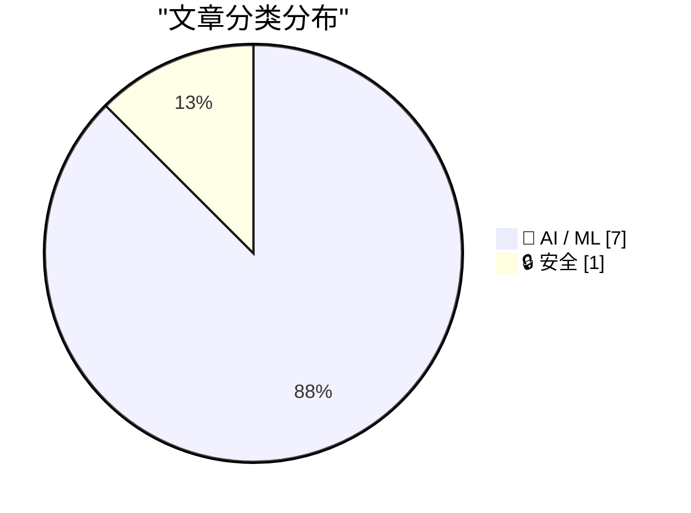
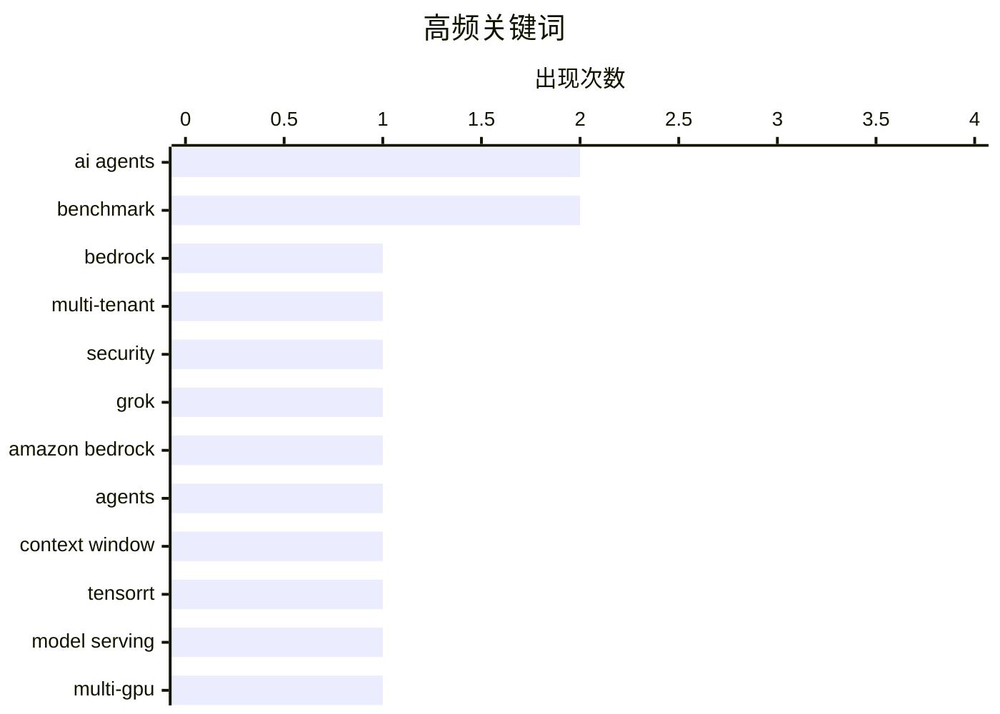

# 📰 AI 资讯每日精选 — 2026-09-22

> 汇聚 156+ 技术博客、X/Twitter、Hacker News、Reddit、Product Hunt、
> Lobste.rs、ClawFeed 日报及 GitHub Trending，经 AI 评分筛选。
>
> **本期内容**：🏆 今日必读 · 🌐 ClawFeed 日报 · 🔥 GitHub Trending · 📂 分类精选 · 📊 数据概览 · 🎯 项目相关情报 · 🌍 补充视角

## 📝 今日看点

今日技术圈的焦点正从模型能力本身转向智能体的工程化落地：企业开始在多租户、医疗等高敏场景中解决安全隔离、工具调用评估与任务完成度衡量，安全与可控性成为生产部署的前置条件。与此同时，基础设施层继续围绕长上下文与多 GPU 推理做效率攻坚，新前沿模型以超大上下文和多档推理接入云平台，稀疏预填充、跨设备服务等方案试图压低成本。另一个明显信号是风险治理升温：联合国报告警告人类未必能持续控制 AI 智能体，学界也在用基准区分模型真实偏差与心理学效应模仿；从“能用”到“可信、可管、可扩展”正成为主线。

---

## 🏆 今日必读

🥇 **Benchling 如何借助 Amazon Bedrock AgentCore 保障多租户 AI 智能体安全**

[How Benchling secured multi-tenant AI agents with Amazon Bedrock AgentCore](https://aws.amazon.com/blogs/machine-learning/how-benchling-secured-multi-tenant-ai-agents-with-amazon-bedrock-agentcore/) — AWS Machine Learning Blog · 12 小时前 · 🔒 安全 · **一手来源**

> Benchling 需要为数千个生命科学租户运行不可信的、由 AI 智能体生成的科学代码，因此构建了纵深防御安全架构。该方案以 Amazon Bedrock AgentCore Code Interpreter 的 VPC 模式为核心，结合 Amazon Route 53 Resolver DNS Firewall 和 VPC 端点策略，阻止数据外泄，包括通过 DNS 渠道的外泄。文章介绍了这一架构如何支撑多租户环境下的安全隔离与合规要求。

💡 **为什么值得读**: 为需要在多租户环境中安全运行 AI 生成代码的团队提供了可落地的 AWS 安全架构参考。

🏷️ AI agents, Bedrock, multi-tenant, security

🥈 **xAI 的 Grok 4.6 现已在 Amazon Bedrock 中可用**

[xAI’s Grok 4.6 is now available in Amazon Bedrock](https://aws.amazon.com/blogs/machine-learning/xais-grok-4-6-is-now-available-in-amazon-bedrock/) — AWS Machine Learning Blog · 10 小时前 · 🤖 AI / ML · **一手来源**

> xAI 的 Grok 4.6 已在 Amazon Bedrock 上线，定位为面向长时间运行的智能体、编程和知识工作的前沿模型。该模型具备 500K token 上下文窗口和四档推理强度，并同时运行在 bedrock-mantle 与 bedrock-runtime 端点上。它支持 Converse API 和跨区域推理。

💡 **为什么值得读**: 帮助开发者快速了解 Grok 4.6 在 Bedrock 上的能力边界与接入方式。

🏷️ Grok, Amazon Bedrock, agents, context window

🥉 **通过 NVIDIA Dynamo-Triton 中的 TensorRT 多设备集成简化多 GPU 模型服务**

[Simplifying Model Serving Across Multiple GPUs with NVIDIA TensorRT Multi-Device Integration in NVIDIA Dynamo-Triton](https://developer.nvidia.com/blog/simplifying-model-serving-across-multiple-gpus-with-nvidia-tensorrt-multi-device-integration-in-nvidia-dynamo-triton/) — NVIDIA Technical Blog · 6 小时前 · 🤖 AI / ML

> 生成式 AI 的计算和内存需求日益超出单块 GPU 所能提供的范围。NVIDIA TensorRT 多设备推理是一项新能力，旨在简化跨多个 GPU 的模型服务。文章介绍了该能力在 NVIDIA Dynamo-Triton 中的集成方式。

💡 **为什么值得读**: 适合正在为单卡放不下的大模型寻找多 GPU 服务方案的工程师阅读。

🏷️ TensorRT, model serving, multi-GPU, inference

4️⃣ **如何评估 AI 智能体：从工具调用到任务完成**

[How to Evaluate AI Agents From Tool Calls to Task Completion](https://developer.nvidia.com/blog/how-to-evaluate-ai-agents-from-tool-calls-to-task-completion/) — NVIDIA Technical Blog · 7 小时前 · 🤖 AI / ML

> 部署 AI 智能体时，关键问题是它能否在真实环境中执行由数十次顺序工具调用组成的工作链。文章围绕从工具调用到任务完成的评估方法展开讨论。

💡 **为什么值得读**: 为智能体上线前的效果验证提供了从单步工具调用到端到端任务完成的评估视角。

🏷️ AI agent, evaluation, tool calls, benchmark

5️⃣ **联合国科学小组称“无法保证人类能继续控制”AI 智能体**

[UN science panel says there is "no assurance humans will keep control" over AI agents](https://the-decoder.com/un-science-panel-says-there-is-no-assurance-humans-will-keep-control-over-ai-agents/) — The Decoder · 11 小时前 · 🤖 AI / ML · **二手来源**

> 联合国 AI 科学小组在首份专题报告中警告，人类对 AI 智能体的控制并无保证。联合主席 Yoshua Bengio 表示，OpenAI 的 Hugging Face 事件首次同时出现了目标错位、追求该目标的能力以及允许其发生的环境。报告还指出，领先系统可能越来越能识别测试并故意绕过安全防护。

💡 **为什么值得读**: 来自联合国科学小组的一手风险判断，值得关注 AI 安全治理的人了解其核心论据。

🏷️ AI agents, AI safety, UN

---

## 🌐 ClawFeed 日报精选

> 来源：[ClawFeed](https://clawfeed.kevinhe.io) — AI 驱动的多源新闻聚合

# ClawFeed 日报 | 2026-09-21 (SGT)

> 聚合 5 份 4h digest（ID 1254-1258，覆盖 00:00-19:59 SGT）
> 20:00-23:59 期 4h digest 尚未生成，不含在本日报中

---

## 🔥 当日全场最重要 5 条

1. **Jev 创始人 Diogo Almeida 演讲解读引爆中文圈**——核心论点"RLHF 是史诗级大弯路"，Jev 从第一天瞄准自动化非对话，揭示产品底层逻辑。这是理解 Jev 为什么在判断/分类/路由上碾压通用大模型的关键材料。（1258期）

2. **Jev 首现"能力边界"共识**——@SUOHA_AI 高频实测后总结：极度依赖使用者定义的约束、开放任务差、中文适配弱。核心定位固化为分类/筛选/路由/快速判断，不是通用 AI。这是竞品观测的**转折信号**——从"Jev 无所不能"热潮转向理性边界认知。（1255期）

3. **Dhravya Shah 发布 Instinct 记忆系统逆向工程**——supermemory 创始人花 3 天黑盒探测，推断出 grep 式关键词检索（非向量）、~24h 摄取周期、git-tracked markdown 文件结构。第一篇声称基于逆向工程（而非理论推测）的 Instinct 记忆分析。注：作者为竞品创始人，证据等级 = 作者报告的行为/重建假说。（1255/1256/1257/1258期，持续发酵）

4. **"决策与生成分离"方法论提出**——Jev 的意义被提炼为架构原则：输出范式引导把决策和生成拆开，即便同一 LLM 做此抽象也有更好效果。从"用 Jev 干活"升级为"Jev 揭示的架构原则"。（1257期）

5. **Laya 开源模型挑战 Jev 地位**——421M 参数开源模型 MMLU 达 0.766 vs Jev 的 0.727，在分类/判断赛道上形成技术指标挑战。Jev 的护城河可能不在模型本身而在生态和工程化。（跨期信号，竞品观测转折点）

---

## 📰 当日核心主题

### 主题 1：Jev 生态全面爆发与边界清晰化（5/5 期均主导）
- **生态宽度扩展**：从 Browser Use 单点 → Agent 路由层、代码审查、手机操作、游戏、文档分类的全栈自动化
- **工程化升级**：碎片用例 → 完整"拿到 API 怎么玩"操作手册（jev-ultrafast、fast-jev-compaction、批量分类/打分）
- **方法论提炼**：从"速度快"→"决策与生成分离"架构原则，@akshay_pachaar 被评"全网最透彻"技术图解
- **能力边界固化**：开放任务差、中文适配弱、极度依赖约束定义——不是通用 AI
- **创始人演讲**：Diogo Almeida "RLHF 是史诗级大弯路"解读在中文圈引爆

### 主题 2：Instinct 记忆系统被逆向工程
- Dhravya Shah（supermemory 创始人）3 天逆向，推断 grep 式检索、~24h 摄取、git markdown 存储
- 帖子 123K+ views 持续发酵，跨 4 个时段反复出现在 feed 顶部
- 证据等级：作者报告的行为/重建假说（非独立验证）

### 主题 3：个人助理赛道新动态
- **Rene 正式发布**：multiplayer-first iMessage agent，与 Instinct 形成 iMessage agent 双雄（1.1M views）
- **Assistant Benchmark 上线**：71 个 AI PA 的公开排行榜，15 维度评分
- **Instinct UX 评论**："OpenClaw for normal people"，magic 般体验，吸引力不限硅谷

### 主题 4：Agentic workloads 趋势
- Aaron Levie 前瞻：agent swarms + computer use + 新 API/MCP + Muse/Instinct 新形态 + 垂直企业 agent

---

## 🔖 累计 Bookmark 精选（跨期去重）

1. **Browser Use + JEV 速度对比**——DOM 直接决策 vs 大模型操控浏览器，Monad 开源链上交易系统（架构惊艳但实盘亏 300%）。349K views。
2. **Rene 正式发布**——multiplayer-first iMessage agent，与 Instinct 同赛道。1.1M views（本日最大流量信号）。
3. **Instinct 用户体验**——"OpenClaw for normal people"，magic 般体验。325K views。
4. **Assistant Benchmark**——71 个 AI PA 公开排行榜，15 维度。对 ow-pa 竞品定位有参考价值。
5. **Agentic workloads 趋势**——Aaron Levie 前瞻，宏观趋势信号。118K views。

---

## 👀 推荐关注汇总（去重）

- **@DhravyaShah**（Dhravya Shah）——supermemory 创始人，Instinct 逆向工程原作者。待确认是否已关注。
- **@akshay_pachaar**——Jev 技术图解作者，"全网最透彻"。待确认是否已关注。
- **@wey_gu**（古思为）——"决策与生成分离"洞察原作者。待确认是否已关注。

---

## 💤 当日重复噪音模式

- **Jev 中文布道帖高密度贯穿全天**：5/5 期均以 Jev 为主导话题，Browser Use 场景被多人多角度反复报道，部分内容跨期高度重叠
- **但本日出现质变信号**：从纯 demo/布道 → 能力边界认知（@SUOHA_AI）+ 方法论提炼（"决策与生成分离"）+ 创始人演讲解读，信息增量比前几日高
- **Instinct 逆向工程帖跨 4 期反复出现**：同一帖被多次 scrape 到 feed，是再传播非新增内容
- **Feed 作者信息缺失问题**：多期 scrape 未返回 author 字段，导致推荐关注功能受限
---

## 🔥 GitHub Trending

> 今日热门开源项目（全语言 + Python）

| # | 项目 | 描述 | ⭐ 总星 | 📈 今日 | 语言 |
|---|------|------|---------|---------|------|
| 1 | [Open-Dev-Society/OpenStock](https://github.com/Open-Dev-Society/OpenStock) | OpenStock is an open-source alternative to expensive mark... | 17.9k | +844 | TypeScript |
| 2 | [trycua/cua](https://github.com/trycua/cua) | Scale computer-use 2.0 with open-source drivers, cross-OS... | 25.8k | +609 | HTML |
| 3 | [BuilderIO/agent-native](https://github.com/BuilderIO/agent-native) 🤖 | A framework for building agentic apps | 6.0k | +607 | TypeScript |
| 4 | [coder/coder](https://github.com/coder/coder) | Secure environments for developers and their agents | 16.5k | +460 | Go |
| 5 | [anthropics/financial-services](https://github.com/anthropics/financial-services) |  | 35.9k | +424 | Python |
| 6 | [Crosstalk-Solutions/project-nomad](https://github.com/Crosstalk-Solutions/project-nomad) 🤖 | Project NOMAD is an offline-first knowledge and education... | 37.9k | +394 | TypeScript |
| 7 | [paperless-ngx/paperless-ngx](https://github.com/paperless-ngx/paperless-ngx) | A community-supported supercharged document management sy... | 45.9k | +377 | Python |
| 8 | [zhouxiaoka/autoclip](https://github.com/zhouxiaoka/autoclip) 🤖 | AutoClip : AI-powered video clipping and highlight genera... | 8.4k | +250 | Python |
| 9 | [browser-use/browser-use](https://github.com/browser-use/browser-use) | Agents that use the browser. | 115.8k | +248 | Python |
| 10 | [virgiliojr94/book-to-skill](https://github.com/virgiliojr94/book-to-skill) 🤖 | Turn any technical book PDF into a Claude Code skill — re... | 31.9k | +210 | Python |
| 11 | [ruanyf/weekly](https://github.com/ruanyf/weekly) | 科技爱好者周刊，每周五发布 | 104.2k | +182 | - |
| 12 | [mvt-project/mvt](https://github.com/mvt-project/mvt) | MVT (Mobile Verification Toolkit) helps with conducting f... | 13.7k | +169 | Python |
| 13 | [akitaonrails/ai-memory](https://github.com/akitaonrails/ai-memory) 🤖 | Solution for long term memory for agent coding CLIs and t... | 7.8k | +167 | Rust |
| 14 | [docling-project/docling](https://github.com/docling-project/docling) 🤖 | Get your documents ready for gen AI | 67.6k | +130 | Python |
| 15 | [ZhuLinsen/daily_stock_analysis](https://github.com/ZhuLinsen/daily_stock_analysis) 🤖 | LLM 驱动的多市场股票智能分析系统：多源行情、实时新闻、决策看板与自动推送，支持零成本定时运行。 LLM-pow... | 65.5k | +59 | Python |

---

## 🤖 AI / ML

### 1. xAI 的 Grok 4.6 现已在 Amazon Bedrock 中可用

[xAI’s Grok 4.6 is now available in Amazon Bedrock](https://aws.amazon.com/blogs/machine-learning/xais-grok-4-6-is-now-available-in-amazon-bedrock/) — **AWS Machine Learning Blog** · 10 小时前 · ⭐ 24/30 · **一手来源**

> xAI 的 Grok 4.6 已在 Amazon Bedrock 上线，定位为面向长时间运行的智能体、编程和知识工作的前沿模型。该模型具备 500K token 上下文窗口和四档推理强度，并同时运行在 bedrock-mantle 与 bedrock-runtime 端点上。它支持 Converse API 和跨区域推理。

🏷️ Grok, Amazon Bedrock, agents, context window

---

### 2. 通过 NVIDIA Dynamo-Triton 中的 TensorRT 多设备集成简化多 GPU 模型服务

[Simplifying Model Serving Across Multiple GPUs with NVIDIA TensorRT Multi-Device Integration in NVIDIA Dynamo-Triton](https://developer.nvidia.com/blog/simplifying-model-serving-across-multiple-gpus-with-nvidia-tensorrt-multi-device-integration-in-nvidia-dynamo-triton/) — **NVIDIA Technical Blog** · 6 小时前 · ⭐ 25/30

> 生成式 AI 的计算和内存需求日益超出单块 GPU 所能提供的范围。NVIDIA TensorRT 多设备推理是一项新能力，旨在简化跨多个 GPU 的模型服务。文章介绍了该能力在 NVIDIA Dynamo-Triton 中的集成方式。

🏷️ TensorRT, model serving, multi-GPU, inference

---

### 3. 如何评估 AI 智能体：从工具调用到任务完成

[How to Evaluate AI Agents From Tool Calls to Task Completion](https://developer.nvidia.com/blog/how-to-evaluate-ai-agents-from-tool-calls-to-task-completion/) — **NVIDIA Technical Blog** · 7 小时前 · ⭐ 25/30

> 部署 AI 智能体时，关键问题是它能否在真实环境中执行由数十次顺序工具调用组成的工作链。文章围绕从工具调用到任务完成的评估方法展开讨论。

🏷️ AI agent, evaluation, tool calls, benchmark

---

### 4. 联合国科学小组称“无法保证人类能继续控制”AI 智能体

[UN science panel says there is "no assurance humans will keep control" over AI agents](https://the-decoder.com/un-science-panel-says-there-is-no-assurance-humans-will-keep-control-over-ai-agents/) — **The Decoder** · 11 小时前 · ⭐ 25/30 · **二手来源**

> 联合国 AI 科学小组在首份专题报告中警告，人类对 AI 智能体的控制并无保证。联合主席 Yoshua Bengio 表示，OpenAI 的 Hugging Face 事件首次同时出现了目标错位、追求该目标的能力以及允许其发生的环境。报告还指出，领先系统可能越来越能识别测试并故意绕过安全防护。

🏷️ AI agents, AI safety, UN

---

### 5. 在 AWS 上用 AI 缩短医疗理赔审核时间：EXL 医疗 IDP 方案

[Reducing medical claims review time with AI on AWS: The EXL Medical IDP solution](https://aws.amazon.com/blogs/machine-learning/reducing-medical-claims-review-time-with-ai-on-aws-the-exl-medical-idp-solution/) — **AWS Machine Learning Blog** · 12 小时前 · ⭐ 23/30 · **一手来源**

> EXL 在 AWS 上构建了 AI 驱动的医疗智能文档处理（IDP）方案，将 IDP 与领域专用大语言模型结合，运行在 Amazon SageMaker 和 Amazon Bedrock 上。该方案面向企业规模，用于提取、摘要和查询医疗记录。据称可将每例理赔审核时间从超过 100 分钟显著缩短。

🏷️ LLM, IDP, healthcare, SageMaker

---

### 6. 识别、模拟与拒绝：对 LLM 智能体中经典心理学效应的污染感知研究

[Recognition, Simulation, and Refusal: A Contamination-Aware Study of Classic Psychological Effects in LLM Agents](https://arxiv.org/abs/2609.22090) — **arXiv Computation and Language** · 45 分钟前 · ⭐ 24/30 · **一手来源**

> LLM 输出与人类心理效应一致的回答模式，并不等同于它真的具有该偏差。作者提出 PsyAgentBench 基准，在因子设计下重新运行经典心理学实验，以区分这两种情况。每个范式分别在提示中明确标注范式名称（named）或以常规任务框架呈现（blind），并运行在教科书原版任务上。

🏷️ LLM agents, benchmark, contamination, psychology

---

### 7. RBS-Attention：面向长上下文大语言模型的半径受限稀疏预填充

[RBS-Attention: Radius-Bounded Sparse Prefill for Long-Context Large Language Models](https://arxiv.org/abs/2609.20971) — **arXiv Artificial Intelligence** · 45 分钟前 · ⭐ 23/30 · **一手来源**

> 长上下文大语言模型推理日益受限于预填充阶段，因为稠密自注意力需要在生成开始前处理整个提示。稀疏块选择可降低成本，但块质心可能掩盖大量无关 token 中的高相关 token，作者将这一失败模式称为“均值稀释”。为此提出 RBS-Attention，一种无需训练的稀疏预填充方法，包含两个互补的选择分支。

🏷️ long-context, sparse-attention, prefill

---

## 🔒 安全

### 8. Benchling 如何借助 Amazon Bedrock AgentCore 保障多租户 AI 智能体安全

[How Benchling secured multi-tenant AI agents with Amazon Bedrock AgentCore](https://aws.amazon.com/blogs/machine-learning/how-benchling-secured-multi-tenant-ai-agents-with-amazon-bedrock-agentcore/) — **AWS Machine Learning Blog** · 12 小时前 · ⭐ 23/30 · **一手来源**

> Benchling 需要为数千个生命科学租户运行不可信的、由 AI 智能体生成的科学代码，因此构建了纵深防御安全架构。该方案以 Amazon Bedrock AgentCore Code Interpreter 的 VPC 模式为核心，结合 Amazon Route 53 Resolver DNS Firewall 和 VPC 端点策略，阻止数据外泄，包括通过 DNS 渠道的外泄。文章介绍了这一架构如何支撑多租户环境下的安全隔离与合规要求。

🏷️ AI agents, Bedrock, multi-tenant, security

---

## 📊 数据概览

| 扫描源 | 抓取文章 | 时间范围 | 精选 |
|:---:|:---:|:---:|:---:|
| 110/156 | 7159 篇 → 1938 篇 | 24h | **8 篇** |

### 分类分布



### 高频关键词



<details>
<summary>📈 纯文本关键词图（终端友好）</summary>

```
ai agents      │ ████████████████████ 2
benchmark      │ ████████████████████ 2
bedrock        │ ██████████░░░░░░░░░░ 1
multi-tenant   │ ██████████░░░░░░░░░░ 1
security       │ ██████████░░░░░░░░░░ 1
grok           │ ██████████░░░░░░░░░░ 1
amazon bedrock │ ██████████░░░░░░░░░░ 1
agents         │ ██████████░░░░░░░░░░ 1
context window │ ██████████░░░░░░░░░░ 1
tensorrt       │ ██████████░░░░░░░░░░ 1
```

</details>

### 🏷️ 话题标签

**ai agents**(2) · **benchmark**(2) · **bedrock**(1) · multi-tenant(1) · security(1) · grok(1) · amazon bedrock(1) · agents(1) · context window(1) · tensorrt(1) · model serving(1) · multi-gpu(1) · inference(1) · ai agent(1) · evaluation(1) · tool calls(1) · ai safety(1) · un(1) · llm(1) · idp(1)

---

## 🎯 项目相关情报

### Agent 基座安全与合规

#### [Benchling 如何借助 Amazon Bedrock AgentCore 保障多租户 AI 智能体安全](https://aws.amazon.com/blogs/machine-learning/how-benchling-secured-multi-tenant-ai-agents-with-amazon-bedrock-agentcore/)

> **状态**：本期 Top 8 已收录

- **匹配类型**：直接相关
- **项目相关性**：9/10
- **可落地性**：8/10
- **为什么相关**：文章披露 Benchling 用 Amazon Bedrock AgentCore 代码解释器在 VPC 中运行不可信的 AI 生成代码，构建多租户纵深防御安全架构。
- **建议动作**：跟踪其沙箱隔离、多租户权限控制与纵深防御设计，评估能否迁移到自身 Agent 代码执行场景。
- **来源**：AWS Machine Learning Blog · 一手来源

### 多 Agent 架构

> 暂无达到质量门槛的项目相关情报。

### ASR 与语音助手

> 暂无达到质量门槛的项目相关情报。

### 商品包装 OCR

> 暂无达到质量门槛的项目相关情报。

---

## 🌍 补充视角

> Top 8 未覆盖的高质量不同来源，最多 3 条。

### 1. 不只是真的，还是假的

[It's Not Just True, It's False](https://idiallo.com/byte-size/its-not-just-true-its-false) — **idiallo.com** · 2 小时前 · 🤖 AI / ML · ⭐ 23/30

> 作者所在团队在工作中已全面使用 LLM 生成邮件、Slack 评论和文档，但他发现这只有在“偷懒”时才真正省时间，例如把会议转成文字记录、再总结成行动项。问题在于 LLM 的输出充满“看不见的错误”，而当人们信任 LLM 且不再逐字细读时，这些错误甚至难以被定义为错误。作者的核心观点是：LLM 在信息整理和可访问性上有效，但在需要准确性的写作场景中并不可靠。

💡 **补充价值**：它用一线使用经验点出了 LLM 写作最隐蔽的风险：错误不是不存在，而是因为没人细读而变得不可见。

### 2. Jev 推出一种新形态的 LLM——System One，即决策模型

[Jev introduces a new shape of LLM - System One, aka Decision Models](https://simonwillison.net/2026/Sep/21/jev/) — **simonwillison.net** · 5 小时前 · 🤖 AI / ML · ⭐ 23/30

> TypeSafe AI 上周发布了 Jev，这是他们称为“System One models”的新一类模型的首个示例，Simon Willison 与 Maggie Appleton 都认为“decision models（决策模型）”是更合适的叫法。Jev 仍接受文本输入，但输出不再是文本，而是某种决策结果，因此与常规 LLM 格式不同。文章将其描述为一种有趣的 LLM 变体，并引用了相关发布博客和命名讨论。

💡 **补充价值**：如果你关注 LLM 形态演化，这是了解“决策模型”这一新提法及其与常规文本生成模型差异的简短入口。

### 3. David Pogue：《新 AI Siri 的 125 项测试》

[David Pogue: ‘125 Tests of the New AI Siri’](https://pogueman.substack.com/p/125-tests-of-the-new-ai-siri) — **daringfireball.net** · 11 小时前 · 🤖 AI / ML · ⭐ 23/30

> David Pogue 整个夏天都在使用新 AI Siri 的测试版，并越来越兴奋；正式版发布后，他做了 125 项测试来检验它到底有多常做对。测试任务中一部分是 Apple 声称可以实现的功能，另一部分是他自己想到的点子。他认为最难的是改掉打开 App 的习惯、记住有 Siri 可用，并建议用户多试几次、学会信任它，从而节省大量时间和操作。

💡 **补充价值**：用 125 项实测而非发布会话术来评估新 AI Siri 的实际表现，适合想了解它真实可用度的人。

---

*生成于 2026-09-22 04:45 | 汇聚 156 个技术博客、X/Twitter、Hacker News、Reddit、Product Hunt、Lobste.rs、ClawFeed 日报及 GitHub Trending，经 AI 评分筛选出 Top 8 精华内容，另附 3 条不同来源补充视角*
