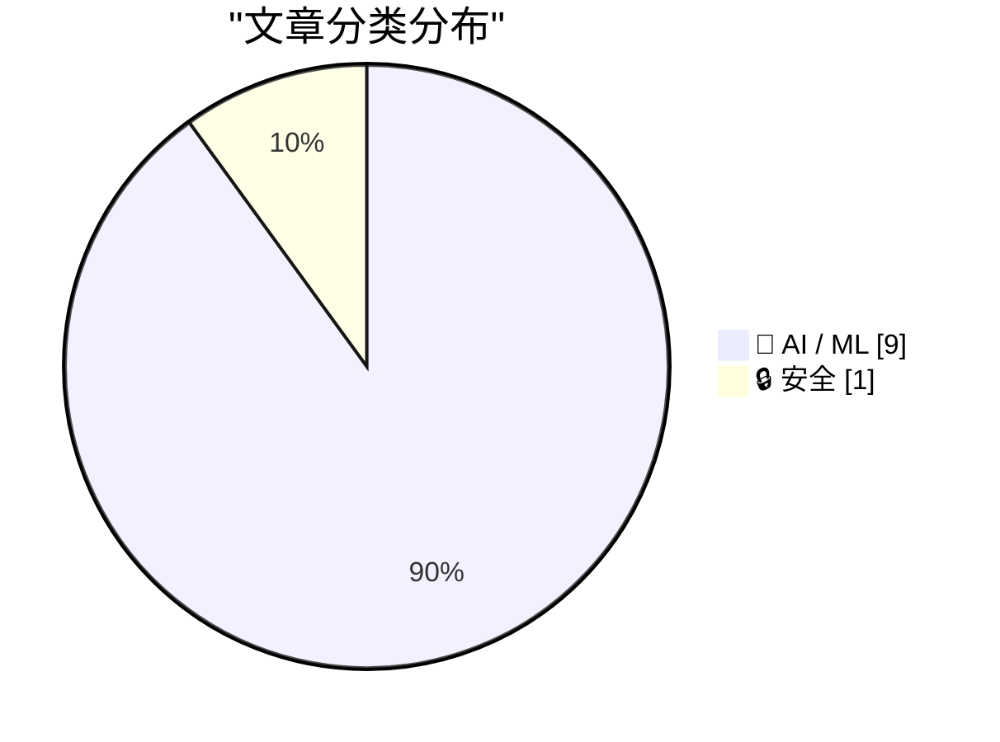
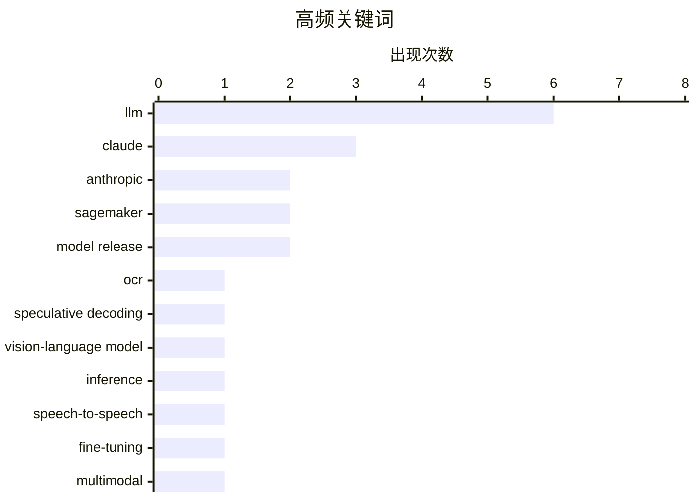

# 📰 AI 资讯每日精选 — 2026-09-23

> 汇聚 156+ 技术博客、X/Twitter、Hacker News、Reddit、Product Hunt、
> Lobste.rs、ClawFeed 日报及 GitHub Trending，经 AI 评分筛选。
>
> **本期内容**：🏆 今日必读 · 🌐 ClawFeed 日报 · 🔥 GitHub Trending · 📂 分类精选 · 📊 数据概览 · 🎯 项目相关情报

## 📝 今日看点

今日技术圈最密集的信号来自模型发布与价格战：Claude Opus 5.5 以更低成本对标前代旗舰，GPT-6 系列、Grok 4.7 与小米新模型接连登场，大模型竞争正从能力比拼转向性价比与推理成本的硬碰硬。与此同时，效率优化成为工程侧主线，无论是用扩散并行草稿加自回归验证加速文档 OCR，还是在语音到语音生成中保留原有语音到文本能力，目标都是打破逐 token 串行解码的瓶颈。智能体则继续向应用与产业两端渗透，Meta 的 Muse 应用登顶美区 App Store，工业安全与生成式 AI 端点的规格配置也在 AWS 上落地成可复制的方案。值得警惕的是，智能体安全评估的"攻击成功率"被指并非单一指标，测量效度问题提醒业界：繁荣的发布节奏之下，评测标准本身仍需补课。

---

## 🏆 今日必读

🥇 **扩散草稿，自回归验证：用自推测解码加速文档 OCR**

[Diffusion Drafts, AR Verifies: Accelerating Document OCR with Self-Speculative Decoding](https://arxiv.org/abs/2609.26638) — arXiv Computation and Language · 38 分钟前 · 🤖 AI / ML · **一手来源**

> 自回归 OCR 视觉语言模型能准确将文档图像转为文本和结构化标记，但每个输出 token 都需一次串行解码，限制了推理速度。与开放式文本生成不同，OCR 输出与输入图像强绑定，因此基于扩散的并行生成颇具前景。然而，当在一个扩散步骤中预测多个 token 时，每个 token 都是在其他 token 未知的情况下预测的。摘要在此处截断，未给出所提方法的具体机制、实验设置或加速数据。

💡 **为什么值得读**: 适合关注 OCR 推理加速与扩散/自回归混合解码思路的研究者，但需注意摘要信息不完整。

🏷️ OCR, speculative decoding, vision-language model, inference

🥈 **在语音到语音生成中保留语音到文本 LLM 的能力**

[Preserving Speech-to-Text LLM Capabilities in Speech-to-Speech Generation](https://arxiv.org/abs/2606.30944) — arXiv Sound · 38 分钟前 · 🤖 AI / ML · **一手来源**

> 强语音到文本（S2T）LLM 已具备稳健的语音感知与文本推理能力，但增加语音到语音（S2S）输出并不容易：微调主干会损害原有 S2T 性能，而外接下游 talker 又会重新引入串行的文本到语音瓶颈。作者提出 PRIME-Speech，一个冻结主干的 S2S 转换框架，仅训练语音生成模块。摘要在此处截断，未说明其同步机制、训练细节或评测结果。

💡 **为什么值得读**: 为想在不牺牲 S2T 能力的前提下扩展语音输出能力的研究者提供了一条冻结主干的技术路线。

🏷️ speech-to-speech, LLM, fine-tuning, multimodal

🥉 **Claude Opus 5.5 现已在 AWS 上线**

[Claude Opus 5.5 is now available on AWS](https://aws.amazon.com/blogs/machine-learning/claude-opus-5-5-is-now-available-on-aws/) — AWS Machine Learning Blog · 11 小时前 · 🤖 AI / ML · **一手来源**

> Anthropic 称 Claude Opus 5.5 是其面向智能体编程、知识工作和长时任务的最强 Opus 模型，现已在 Amazon Bedrock 和 AWS 上的 Claude Platform 提供。该文章介绍 Opus 5.5 的新特性、实用指南，以及如何在 Amazon Bedrock 上开始构建。

💡 **为什么值得读**: 面向已在 AWS 上构建应用的开发者，提供该模型的上手路径与官方使用指引。

🏷️ Claude, agentic-coding, Amazon-Bedrock, LLM

4️⃣ **Claude Opus 5.5 以更低成本达到 Fable 5.1 的性能，并承诺减少“Claudish”文风**

[Claude Opus 5.5 matches Fable 5.1 performance at lower cost and promises less "Claudish" writing](https://the-decoder.com/claude-opus-5-5-matches-fable-5-1-at-40-percent-lower-cost-as-anthropic-promises-to-fix-claudish-writing/) — The Decoder · 11 小时前 · 🤖 AI / ML · **二手来源**

> Anthropic 发布新一代首个模型 Claude Opus 5.5。该公司称其在多数任务上与 Claude Fable 5.1 相当，而运行成本比 Opus 5 低约 40%。Anthropic 的基准测试还显示，它在多数任务上领先 OpenAI 的 GPT-6 Astra，同时价格显著更低。Sonnet 5.5 和 Haiku 5.5 预计将在未来几周推出。

💡 **为什么值得读**: 用一组价格与基准对比快速呈现新一代 Opus 的定位，适合关注模型性价比竞争的人。

🏷️ Anthropic, Claude, LLM, benchmark

5️⃣ **用 Amazon SageMaker AI 上的并发扫描为生成式 AI 端点做合理规格配置**

[Right-size generative AI endpoints with concurrency sweeps on Amazon SageMaker AI](https://aws.amazon.com/blogs/machine-learning/right-size-generative-ai-endpoints-with-concurrency-sweeps-on-amazon-sagemaker-ai/) — AWS Machine Learning Blog · 13 小时前 · 🤖 AI / ML · **一手来源**

> 并发扫描通过在逐步升高的负载水平上系统性地对生成式 AI 端点进行基准测试，帮助在 Amazon SageMaker AI 上为其合理配置规格。文章演示了如何部署模型、使用 CreateAIBenchmarkJob API 运行自动化并发扫描，并利用结果就机群规模做出数据驱动的容量决策。

💡 **为什么值得读**: 给出了一套可操作的端点压测与容量规划流程，适合负责生成式 AI 推理成本与性能的工程团队。

🏷️ SageMaker, generative AI, benchmarking, endpoint

---

## 🌐 ClawFeed 日报精选

> 来源：[ClawFeed](https://clawfeed.kevinhe.io) — AI 驱动的多源新闻聚合

# ClawFeed Daily | 2026-09-22 (SGT)

aggregated: 5 x 4h digests (IDs 1261-1265, 00:00-19:59 SGT)
feed: 25 total (high overlap) | bookmarks: 5 (static all day) | errors: 0

---

## 🔥 当日全场最重要 5 条

1. **Laya 开源模型正面挑战 Jev——System One 赛道出现搅局者**（#1265, 16:00-19:59）
   421M 参数开源模型，本地跑 45ms 决策 vs Jev 云端 ~300ms，速度快 7-11x，成本 $0 vs 按 token 收费，权重开源。贪吃蛇/俄罗斯方块实测 Laya 碾压。这是 Jev 发布以来第一次来自开源社区的正面性能挑战。

2. **Lauren Tan (@poteto) 单月 2500 PRs agent 舰队实战**（#1264-1265, 12:00-19:59）
   前 Meta/Netflix、现 xAI/Grok Bot 核心工程师。核心方法论：不是 agent 数量，而是把工程经验/约束/验证能力沉淀为运行环境，建立"信任"后 agent 自主持续交付。目前公开的最大规模 agent 编程实战数据之一。

3. **TypeSafe CEO 公开 coding agent 设计笔记——KV cache 反事实思想实验**（#1261, 00:00-03:59，持续 5 期）
   Diogo Almeida 分享 TypeSafe 方向文档：如果 LLM 没有 KV cache，coding agent 该怎么设计？论点：今天 agent 的许多"标准特性"不是源于用户价值，而是绕过 KV cache 和按 token 计费的权宜之计。对当前 agent 范式的结构性质疑。

4. **OpenAI 正在开发对标 Grok Bot 的长期在线 Agent 产品**（#1265, 16:00-19:59）
   The Information 爆料，把 Codex + ChatGPT Agent 能力重组。Agent 竞争全面升级信号。

5. **Jev 60 案例合集 + 12 重点场景系统梳理**（#1261-1265, 全天）
   目前最完整的 Jev 应用场景梳理。核心框架：生成模型（复杂推理）+ Jev（分类/筛选/评分/路由）+ 代码执行 + 人工复核。配合 Codex 实测 token 节省 90%。

---

## 📰 当日核心主题

### System One 模型赛道爆发
Jev 话题贯穿全天 5 个 4h 周期，从技术图解→案例沉淀→生态盘点完成一轮传播周期。更重要的信号是 Laya 开源模型的出现——System One 不再是 Jev 独占赛道，开源替代方案首次在速度和成本上正面挑战。"System One Models" 作为新概念被提出：继文字/图片/音频/视频之后，又一个可能改变 Agent 格局的模型类型。

### Agent 规模化从概念到量化
Lauren Tan 的 2500 PRs/月是"agent 舰队"从概念验证跨越到生产力量化的标志性数据。方法论核心是信任工程（沉淀约束和验证能力为环境），而非简单堆叠 agent 数量。

### Coding Agent 架构反思
TypeSafe/Diogo 的 KV cache 反事实实验全天持续传播。核心质疑：当前 agent 设计有多少是"真需求"，有多少是绕过基础设施约束的 workaround？如果约束变了，架构该怎么变？

### 个人助理赛道持续分化（Bookmarks 层）
Rene（iMessage Agent）、Instinct（"OpenClaw for normal people"）、Assistant Benchmark（71 助理 x 15 维度）三者分别代表：新交互形态、普通人市场、可量化比较。赛道从技术圈扩散到普通用户。

---

## 🔖 累计 Bookmark 精选

全天 5 期 bookmarks 完全相同（未刷新），5 条关键书签：

1. **Browser Use + Jev**：DOM 级操作让浏览器 Agent 速度暴增，不再"杀鸡用牛刀"
2. **Rene**：multiplayer-first iMessage Agent，像朋友一样发短信交互，已内测 4 个月
3. **Instinct**：用户评价"OpenClaw for normal people"，个人 AI Agent 走向普通人市场
4. **Assistant Benchmark**：71 个 AI 个人助理公开评分卡，15 维度，赛道进入可量化比较阶段
5. **Aaron Levie agentic workload 预判**：agent swarms + computer use + 新 API/MCP + 垂直企业 Agent + 后台 Agent 同时涌来

---

## 👀 推荐关注汇总

| 账号 | 身份 | 推荐理由 |
|------|------|---------|
| @CompleteSkeptic (Diogo Almeida) | TypeSafe/Jev 创始人 | coding agent 设计笔记一手信息源 |
| @akshay_pachaar | 技术写作者 | Jev 技术图解长文"全网最透彻" |
| @poteto (Lauren Tan) | xAI 核心工程师，前 Meta/Netflix | agent 舰队工程实战 2500 PRs/月 |

（需确认是否已关注，操作前请先在 Following 里搜索。）

---

## 💤 当日重复噪音模式

- **Jev 内容饱和循环**：同一批 Jev 内容（60 案例合集、Codex 节省 90%、TypeSafe 设计笔记）在 5 个 4h 周期中反复出现，feed 信息增量从第 3 期开始趋近于零。第 1-2 期有原创深度分析，第 3-4 期退化为搬运/汇编
- **Bookmarks 全天未刷新**：5/5 bookmarks 连续 5 期完全相同，无新增书签信号
- **建议**：Jev 话题已进入收敛期，除非出现新竞品（如 Laya 后续动态）或新技术维度，可降频关注。关注点转向 Laya 开源挑战和 System One 赛道竞争格局

---

version: daily | date: 2026-09-22 | aggregated_ids: [1261, 1262, 1263, 1264, 1265]---

## 🔥 GitHub Trending

> 今日热门开源项目（全语言 + Python）

| # | 项目 | 描述 | ⭐ 总星 | 📈 今日 | 语言 |
|---|------|------|---------|---------|------|
| 1 | [google/ax](https://github.com/google/ax) | Google's open agentic orchestration runtime | 7.9k | +2305 | Go |
| 2 | [zhouxiaoka/autoclip](https://github.com/zhouxiaoka/autoclip) 🤖 | AutoClip : AI-powered video clipping and highlight genera... | 8.7k | +594 | Python |
| 3 | [mvt-project/mvt](https://github.com/mvt-project/mvt) | MVT (Mobile Verification Toolkit) helps with conducting f... | 14.2k | +441 | Python |
| 4 | [anthropics/financial-services](https://github.com/anthropics/financial-services) |  | 36.5k | +438 | Python |
| 5 | [dream-num/univer](https://github.com/dream-num/univer) 🤖 | The Office Harness for AI Agents — Spreadsheets, Docs, Sl... | 15.7k | +255 | TypeScript |
| 6 | [agent-substrate/substrate](https://github.com/agent-substrate/substrate) 🤖 | Agent Substrate: the core system | 3.1k | +245 | Go |
| 7 | [superdesigndev/treg](https://github.com/superdesigndev/treg) 🤖 | OpenRouter for agent tools. Join community here: https://... | 2.3k | +230 | Python |
| 8 | [browser-use/video-use](https://github.com/browser-use/video-use) | Edit videos with coding agents | 26.0k | +191 | Python |
| 9 | [TNT-Likely/PanWatch](https://github.com/TNT-Likely/PanWatch) 🤖 | 盯盘侠 PanWatch · 自托管 AI 盯盘助手，集成 TradingAgents 多 Agent 投资决策 ... | 1.3k | +175 | Python |
| 10 | [FareedKhan-dev/train-llm-from-scratch](https://github.com/FareedKhan-dev/train-llm-from-scratch) 🤖 | A straightforward method for training your LLM, from down... | 10.8k | +141 | Python |
| 11 | [paperless-ngx/paperless-ngx](https://github.com/paperless-ngx/paperless-ngx) | A community-supported supercharged document management sy... | 45.9k | +75 | Python |
| 12 | [davila7/claude-code-templates](https://github.com/davila7/claude-code-templates) 🤖 | CLI tool for configuring and monitoring Claude Code | 31.2k | +64 | Python |

---

## 🤖 AI / ML

### 1. 扩散草稿，自回归验证：用自推测解码加速文档 OCR

[Diffusion Drafts, AR Verifies: Accelerating Document OCR with Self-Speculative Decoding](https://arxiv.org/abs/2609.26638) — **arXiv Computation and Language** · 38 分钟前 · ⭐ 23/30 · **一手来源**

> 自回归 OCR 视觉语言模型能准确将文档图像转为文本和结构化标记，但每个输出 token 都需一次串行解码，限制了推理速度。与开放式文本生成不同，OCR 输出与输入图像强绑定，因此基于扩散的并行生成颇具前景。然而，当在一个扩散步骤中预测多个 token 时，每个 token 都是在其他 token 未知的情况下预测的。摘要在此处截断，未给出所提方法的具体机制、实验设置或加速数据。

🏷️ OCR, speculative decoding, vision-language model, inference

---

### 2. 在语音到语音生成中保留语音到文本 LLM 的能力

[Preserving Speech-to-Text LLM Capabilities in Speech-to-Speech Generation](https://arxiv.org/abs/2606.30944) — **arXiv Sound** · 38 分钟前 · ⭐ 22/30 · **一手来源**

> 强语音到文本（S2T）LLM 已具备稳健的语音感知与文本推理能力，但增加语音到语音（S2S）输出并不容易：微调主干会损害原有 S2T 性能，而外接下游 talker 又会重新引入串行的文本到语音瓶颈。作者提出 PRIME-Speech，一个冻结主干的 S2S 转换框架，仅训练语音生成模块。摘要在此处截断，未说明其同步机制、训练细节或评测结果。

🏷️ speech-to-speech, LLM, fine-tuning, multimodal

---

### 3. Claude Opus 5.5 现已在 AWS 上线

[Claude Opus 5.5 is now available on AWS](https://aws.amazon.com/blogs/machine-learning/claude-opus-5-5-is-now-available-on-aws/) — **AWS Machine Learning Blog** · 11 小时前 · ⭐ 24/30 · **一手来源**

> Anthropic 称 Claude Opus 5.5 是其面向智能体编程、知识工作和长时任务的最强 Opus 模型，现已在 Amazon Bedrock 和 AWS 上的 Claude Platform 提供。该文章介绍 Opus 5.5 的新特性、实用指南，以及如何在 Amazon Bedrock 上开始构建。

🏷️ Claude, agentic-coding, Amazon-Bedrock, LLM

---

### 4. Claude Opus 5.5 以更低成本达到 Fable 5.1 的性能，并承诺减少“Claudish”文风

[Claude Opus 5.5 matches Fable 5.1 performance at lower cost and promises less "Claudish" writing](https://the-decoder.com/claude-opus-5-5-matches-fable-5-1-at-40-percent-lower-cost-as-anthropic-promises-to-fix-claudish-writing/) — **The Decoder** · 11 小时前 · ⭐ 25/30 · **二手来源**

> Anthropic 发布新一代首个模型 Claude Opus 5.5。该公司称其在多数任务上与 Claude Fable 5.1 相当，而运行成本比 Opus 5 低约 40%。Anthropic 的基准测试还显示，它在多数任务上领先 OpenAI 的 GPT-6 Astra，同时价格显著更低。Sonnet 5.5 和 Haiku 5.5 预计将在未来几周推出。

🏷️ Anthropic, Claude, LLM, benchmark

---

### 5. 用 Amazon SageMaker AI 上的并发扫描为生成式 AI 端点做合理规格配置

[Right-size generative AI endpoints with concurrency sweeps on Amazon SageMaker AI](https://aws.amazon.com/blogs/machine-learning/right-size-generative-ai-endpoints-with-concurrency-sweeps-on-amazon-sagemaker-ai/) — **AWS Machine Learning Blog** · 13 小时前 · ⭐ 23/30 · **一手来源**

> 并发扫描通过在逐步升高的负载水平上系统性地对生成式 AI 端点进行基准测试，帮助在 Amazon SageMaker AI 上为其合理配置规格。文章演示了如何部署模型、使用 CreateAIBenchmarkJob API 运行自动化并发扫描，并利用结果就机群规模做出数据驱动的容量决策。

🏷️ SageMaker, generative AI, benchmarking, endpoint

---

### 6. Tata Elxsi 如何在 AWS 上数秒内检测工业安全风险

[How Tata Elxsi detects industrial safety risks in seconds on AWS](https://aws.amazon.com/blogs/machine-learning/how-tata-elxsi-detects-industrial-safety-risks-in-seconds-on-aws/) — **AWS Machine Learning Blog** · 13 小时前 · ⭐ 23/30 · **一手来源**

> 文章介绍 Tata Elxsi 如何在 AWS 上构建实时工业安全平台 IRIS。IRIS 在边缘过滤摄像头视频，通过 Amazon Kinesis 流式传输元数据，在 Amazon SageMaker AI 上运行计算机视觉，并将检测结果关联为高置信度告警，从而把不安全状况的检测时间从数分钟缩短到数秒。

🏷️ computer vision, SageMaker, edge, safety

---

### 7. Claude Opus 5.5、GPT-6 Sol、GPT-6 Luna，以及一场新的价格战

[Claude Opus 5.5, GPT-6 Sol, GPT-6 Luna, and a new price war](https://simonwillison.net/2026/Sep/22/opus-and-sol-and-luna/) — **simonwillison.net** · 4 小时前 · ⭐ 24/30

> 文章记录了连续两天的模型发布潮：先是 Grok 4.7 与小米 MiMo v2.6 Flash/Pro，随后 Anthropic 发布 Claude Opus 5.5，约一小时后 OpenAI 发布 GPT-6 Sol 和 Luna。摘要在此处截断，未给出各模型的具体能力、定价或作者对价格战的判断。

🏷️ LLM, model release, price war, OpenAI

---

### 8. Meta 新 Muse AI 智能体应用超越 ChatGPT，登顶 iPhone 应用榜

[Meta’s New Muse AI Agent App Overtakes ChatGPT as Top iPhone App](https://9to5mac.com/2026/09/18/metas-new-muse-ai-agent-app-overtakes-chatgpt-as-top-iphone-app/) — **daringfireball.net** · 8 小时前 · ⭐ 24/30

> 据 9to5Mac 的 Zac Hall 报道，Meta 新推出的 Muse AI 智能体应用已登上美国 App Store 免费 iPhone 榜首位，将 OpenAI 的 ChatGPT 挤到第二。Muse by Meta 本月才发布，应用已上线约两周，这意味着新增安装量正持续推高其榜单排名，而非仅靠首发日效应。就在前一天，Meta 还将 Muse 应用的可用范围扩展到 Mac。摘要在此处截断，未给出桌面版细节。

🏷️ Meta, Muse, ChatGPT, app store

---

### 9. Claude Opus 5.5

[Claude Opus 5.5](https://www.anthropic.com/claude-opus-5-5) — **Hacker News Best** · 12 小时前 · ⭐ 24/30

> 这是 Anthropic 官方 Claude Opus 5.5 发布页在 Hacker News 上的收录条目，指向 anthropic.com/claude-opus-5-5。该条目在 Hacker News 获得 1301 分、859 条评论。除链接与互动数据外，输入未提供模型能力、定价或可用性等具体信息。

🏷️ Claude, Anthropic, LLM, model release

---

## 🔒 安全

### 10. 攻击成功率不是一个数：论智能体 AI 安全评估中的测量效度

[Attack Success Rate Is Not a Number: On Measurement Validity in Agentic AI Security Evaluation](https://arxiv.org/abs/2609.25173) — **arXiv Cryptography and Security** · 38 分钟前 · ⭐ 24/30 · **一手来源**

> 攻击成功率（ASR）几乎是所有已发表的 LLM 智能体攻击与防御评估中的头条指标。作者认为，当前使用的 ASR 并非单一量，而是一族由六个设计选择参数化的指标，这些选择论文很少说明，也从未在文献间保持一致。作者用两项无需专有访问权限的研究支持这一论点，其中第一项是对 259 篇智能体安全文献的全文元分析。摘要在此处截断，未给出第二项研究内容与具体结论。

🏷️ agent security, evaluation, attack success rate, LLM

---

## 📊 数据概览

| 扫描源 | 抓取文章 | 时间范围 | 精选 |
|:---:|:---:|:---:|:---:|
| 110/156 | 6734 篇 → 1505 篇 | 24h | **10 篇** |

### 分类分布



### 高频关键词



<details>
<summary>📈 纯文本关键词图（终端友好）</summary>

```
llm                   │ ████████████████████ 6
claude                │ ██████████░░░░░░░░░░ 3
anthropic             │ ███████░░░░░░░░░░░░░ 2
sagemaker             │ ███████░░░░░░░░░░░░░ 2
model release         │ ███████░░░░░░░░░░░░░ 2
ocr                   │ ███░░░░░░░░░░░░░░░░░ 1
speculative decoding  │ ███░░░░░░░░░░░░░░░░░ 1
vision-language model │ ███░░░░░░░░░░░░░░░░░ 1
inference             │ ███░░░░░░░░░░░░░░░░░ 1
speech-to-speech      │ ███░░░░░░░░░░░░░░░░░ 1
```

</details>

### 🏷️ 话题标签

**llm**(6) · **claude**(3) · **anthropic**(2) · sagemaker(2) · model release(2) · ocr(1) · speculative decoding(1) · vision-language model(1) · inference(1) · speech-to-speech(1) · fine-tuning(1) · multimodal(1) · agentic-coding(1) · amazon-bedrock(1) · benchmark(1) · generative ai(1) · benchmarking(1) · endpoint(1) · computer vision(1) · edge(1)

---

## 🎯 项目相关情报

### Agent 基座安全与合规

> 暂无达到质量门槛的项目相关情报。

### 多 Agent 架构

> 暂无达到质量门槛的项目相关情报。

### ASR 与语音助手

#### [在语音到语音生成中保留语音到文本 LLM 的能力](https://arxiv.org/abs/2606.30944)

> **状态**：本期 Top 10 已收录

- **匹配类型**：直接相关
- **项目相关性**：7/10
- **可落地性**：6/10
- **为什么相关**：关注在增加语音到语音输出时保持语音到文本LLM的识别与推理能力，直接涉及STT模型能力保持与微调问题。
- **建议动作**：跟踪其保持S2T能力的方法与评测，评估对语音助手双模态（识别+生成）方案的迁移价值。
- **来源**：arXiv Sound · 一手来源

### 商品包装 OCR

#### [扩散草稿，自回归验证：用自推测解码加速文档 OCR](https://arxiv.org/abs/2609.26638)

> **状态**：本期 Top 10 已收录

- **匹配类型**：直接相关
- **项目相关性**：7/10
- **可落地性**：6/10
- **为什么相关**：针对文档图像的OCR视觉语言模型，输出文本与结构化标记，属多模态文档理解与视觉文本提取范畴，涉及OCR解码效率。
- **建议动作**：评估其自推测解码方案能否用于商品包装OCR/结构化提取的推理加速与成本控制。
- **来源**：arXiv Computation and Language · 一手来源

---

*生成于 2026-09-23 04:38 | 汇聚 156 个技术博客、X/Twitter、Hacker News、Reddit、Product Hunt、Lobste.rs、ClawFeed 日报及 GitHub Trending，经 AI 评分筛选出 Top 10 精华内容*
