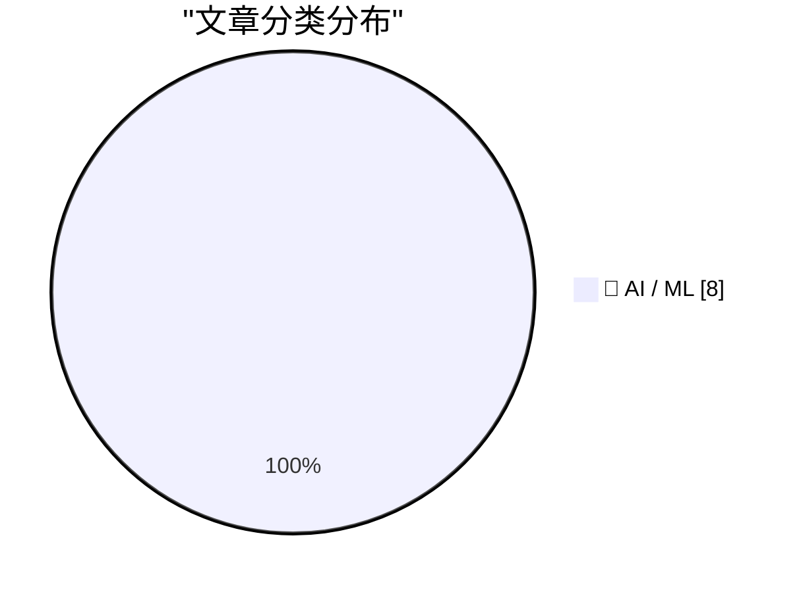
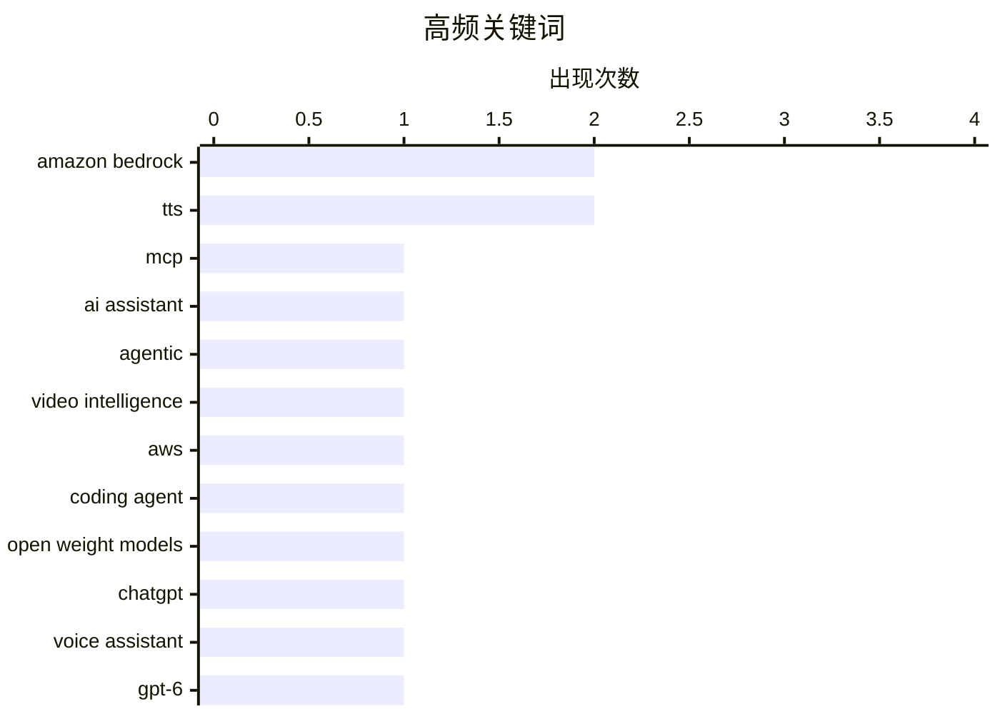

# 📰 AI 资讯每日精选 — 2026-09-24

> 汇聚 156+ 技术博客、X/Twitter、Hacker News、Reddit、Product Hunt、
> Lobste.rs、ClawFeed 日报及 GitHub Trending，经 AI 评分筛选。
>
> **本期内容**：🏆 今日必读 · 🌐 ClawFeed 日报 · 🔥 GitHub Trending · 📂 分类精选 · 📊 数据概览 · 🎯 项目相关情报 · 🌍 补充视角

## 📝 今日看点

今日看点：企业级AI智能体正加速落地，AWS生态下基于Bedrock、MCP等工具，智能体开始接管编码、视频理解和内部知识问答等具体工作流。与此同时，语音与音频AI迎来密集迭代，ChatGPT Voice打通邮件、日历和Slack，Google推出可定制音色的TTS，阿里则以Qwen Audio 3.1和最高95%降价加速多语言语音交互普及。第三，行业在模型能力狂飙后更重视体验、评估与安全，围绕Claude写作风格变化和OpenAI心理健康基准的讨论，说明优化目标与人类感知之间的张力正成为新焦点。整体看，AI竞争正从单点模型能力转向智能体落地、多模态交互和可信评估的综合较量。

---

## 🏆 今日必读

🥇 **从门户跳转到即时答案：HEMA借助MCP和Amazon Bedrock的实践**

[From portal-hopping to instant answers: HEMA’s journey with MCP and Amazon Bedrock](https://aws.amazon.com/blogs/machine-learning/from-portal-hopping-to-instant-answers-hemas-journey-with-mcp-and-amazon-bedrock/) — AWS Machine Learning Blog · 9 小时前 · 🤖 AI / ML · **一手来源**

> 拥有百年历史的荷兰零售商HEMA为改变开发者反复跳转门户的现状，基于Amazon Bedrock AgentCore构建了内部AI助手HAL。HAL采用Model Context Protocol（MCP），在团队日常使用的工具内提供受治理的知识，客户端不保存AWS凭证，安全性依托Microsoft Entra ID。该方案将原本需要门户跳转的查询转变为即时答案。

💡 **为什么值得读**: 提供了一个传统零售企业用MCP与Bedrock AgentCore落地内部知识助手的真实案例，对关注企业级AI助手与安全治理的读者有参考价值。

🏷️ MCP, Amazon Bedrock, AI assistant

🥈 **基于AWS构建智能体式对话视频智能**

[Agentic conversational video intelligence built on AWS](https://aws.amazon.com/blogs/machine-learning/agentic-conversational-video-intelligence-built-on-aws/) — AWS Machine Learning Blog · 10 小时前 · 🤖 AI / ML · **一手来源**

> 该方案介绍如何在AWS上以智能体架构构建对话式视频智能应用。单个Strands Agents SDK智能体在运行时编排Amazon Bedrock、Amazon Rekognition和Amazon Transcribe，自行决定调用哪个服务，从而让用户用自然语言提问视频内容并在数秒内获得答案。

💡 **为什么值得读**: 展示了用单一智能体编排多个AWS AI服务实现视频问答的具体架构，适合想快速搭建对话式视频分析应用的开发者。

🏷️ agentic, video intelligence, AWS

🥉 **在Amazon Bedrock上使用开放权重模型作为AI编码智能体**

[Use open weight models as your AI coding agent with Amazon Bedrock](https://aws.amazon.com/blogs/machine-learning/use-open-weight-models-as-your-ai-coding-agent-with-amazon-bedrock/) — AWS Machine Learning Blog · 10 小时前 · 🤖 AI / ML · **一手来源**

> 该文介绍将开源终端原生AI编码智能体OpenCode与Amazon Bedrock上的开放权重模型配对，获得安全、灵活、按使用付费的编码助手。内容包括配置多模型工作流、为不同任务匹配合适模型，以及将数据保留在自己的AWS账户中且无需管理基础设施。

💡 **为什么值得读**: 为希望以按需付费方式在自有AWS账户内使用开放权重模型驱动编码智能体的团队提供了可操作的配置路径。

🏷️ coding agent, open weight models, Amazon Bedrock

4️⃣ **ChatGPT Voice更接近《她》：可访问邮件、日历和Slack**

[ChatGPT Voice gets closer to "Her" with email, calendar, and Slack access](https://the-decoder.com/chatgpt-voice-gets-closer-to-her-with-email-calendar-and-slack-access/) — The Decoder · 10 小时前 · 🤖 AI / ML · **二手来源**

> ChatGPT Voice现在运行于OpenAI的新模型GPT-6 Astra、Sol和Luna，并可接入邮件、日历和Slack等插件。用户仅通过语音即可管理日程、发送邮件或搭建网站。该更新使OpenAI更接近Sam Altman长期类比科幻电影《她》中所描绘的日常AI助手。

💡 **为什么值得读**: 语音助手接入真实工作流工具是迈向日常AI助手的关键一步，适合关注OpenAI产品演进与人机交互趋势的读者。

🏷️ ChatGPT, voice assistant, GPT-6, plugins

5️⃣ **Google新Flash TTS模型支持用文本描述从零设计AI语音**

[Google's new Flash TTS models let you design AI voices from scratch using text descriptions](https://the-decoder.com/googles-new-flash-tts-models-let-you-design-ai-voices-from-scratch-using-text-descriptions/) — The Decoder · 10 小时前 · 🤖 AI / ML · **二手来源**

> Google推出两款新的文本转语音模型Gemini 3.8 Flash TTS和Flash-Lite TTS，支持超过100种语言。Flash TTS可根据文本描述创建全新语音，两款模型都允许用户为单行台词添加舞台指示，并从单一脚本生成双人对话。此外，语音克隆功能可基于30秒样本构建语音档案。

💡 **为什么值得读**: 文本描述生成语音、舞台指示与单脚本双人对话等能力，为内容创作者和语音应用开发者提供了更灵活的语音设计手段。

🏷️ TTS, Gemini, voice, multilingual

---

## 🌐 ClawFeed 日报精选

> 来源：[ClawFeed](https://clawfeed.kevinhe.io) — AI 驱动的多源新闻聚合

# ClawFeed Daily | 2026-09-23 (SGT)

aggregated: 5 x 4h digests (IDs 1268-1272, 00:00-19:59 SGT)
feed: 25 total | bookmarks: 25 total (高度重叠，实际独立条目约 8) | errors: 0

---

## 🔥 当日全场最重要 5 条

1. **Harvey 法律 AI 毛利崩塌——Agent 时代推理成本风险实证**（#1271, 12:00-15:59）
   Agent token 使用量暴增 20 倍，毛利率从约 50% 直跌至 -50%（彭博报道）。结论指向开源模型或自己做后训练。这是迄今最清晰的"Agent 密集调用经济性"警示案例，对所有 Agent 平台（包括 OpenMax）的定价和成本模型有直接参考价值。

2. **Muse 登顶 App Store + Amazon 封杀——从产品事件升级为平台博弈**（#1270-1272, 全天持续）
   Muse 上线 13 天压过 ChatGPT 登顶美区 App Store 效率类，带飞 Meta 股价（小扎身家涨 1000+ 亿）、AMD 股价。Amazon 直接封杀 Muse 代购（Muse 可自动比价/购物）。同时 OpenMuse 开源版发布，个人 Agent 架构正在被商品化。

3. **Lauren Tan 单月 2500 PR Agent 舰队方法论公开**（#1268-1269, 00:00-07:59）
   前 Meta/Netflix、现 xAI/Grok Bot 核心工程师，Cursor 官方大会 38 分钟技术演讲免费放出。核心：不是堆 Agent 数量，而是把工程经验/约束/验证能力沉淀为运行环境，建立"信任"后 Agent 自主持续交付。目前公开的最大规模 Agent 编程实战数据之一。

4. **Opus 5.5 + GPT-6 Sol/Luna 同日发布，推理成本断崖下降**（#1270-1272, 08:00 起）
   Opus 5.5 价格比 Opus 5 低 40%、token 用量减 63%；GPT-6 Sol/Luna 降价 50%。实测 Opus 5.5 可直接生成产品宣传视频。Anthropic Playbook 三核心差异：独立工作更长、直白汇报、不需"think carefully"。Agent 密集调用场景经济性显著改善。

5. **Personal AI 四产品白热化竞争 + Today 9/24 中国上线**（#1268-1272, 全天）
   Muse（Meta，App Store #1）、Today（中国版 9/24 上线，全平台）、Instinct（$3.5 亿融资 / $25 亿估值）、Rene（iMessage 原生 multiplayer Agent）四家产品同周竞争。OpenMuse 开源版加入战局。Assistant Benchmark 上线对 71 款 AI 助手做 15 维横评。

---

## 📰 当日核心主题

### Agent 经济性：从理论风险到实证崩塌
Harvey 毛利从 +50% 到 -50% 是今天最重要的单一信号。同时 Opus 5.5/GPT-6 大幅降价提供了解药方向。两条消息合在一起的结论：Agent 密集调用的推理成本是生死线，但模型厂商降价速度也在加快——谁能最快适配新模型价格曲线，谁就能把 Harvey 的教训变成竞争优势。

### Personal AI 赛道：一周内从概念到混战
本周 Muse/Today/Instinct/Rene 四产品同时活跃，OpenMuse 开源版加入，Assistant Benchmark 提供量化比较框架。赛道特征正在收敛：主动式、后台持续运行、代执行真实任务、消息平台入口。Amazon 封杀 Muse 代购标志着 Personal AI 已触及电商平台利益边界。

### Agent 工程化从演示到量产
Lauren Tan 2500 PR/月是"Agent 舰队"从概念跨越到生产力量化的标志。方法论核心是信任工程（沉淀约束和验证为环境），而非堆叠 Agent 数量。Mirasim 多 Agent 统一 IDE（支持 Claude/Codex/Grok 同 session 切换）也指向 Agent 工具链走向成熟。

### Jev 生态：一周 194 个项目
Jev（Monad 团队小模型）生态持续爆发，一周内 194 个项目上线。热门方向：浏览器自动化（jev-ultrafast 15k⭐）、Claude Code 上下文压缩、链上交易。Browser Use + Jev 组合把 Computer Use 推理开销砍到极低。但信息密度已进入递减区间。

### 知识基础设施：Firecrawl $75M 转向
Firecrawl B 轮 $75M（Smash Capital 领投），从爬虫工具转向 Agent 知识基础设施（Alexandria 知识库）。"为超级智能构建最大知识库"——数据集和数据提供商整合为 Agent 即时可用的知识层。

---

## 🔖 累计 Bookmark 精选

全天 bookmarks 高度重叠（5 期基本相同），核心独立条目：
- **Browser Use + Jev**：小模型做 DOM 离散操作，速度碾压大模型。链上交易 demo 开源（架构参考）。
- **Rene**：iMessage 原生 multiplayer Agent，浏览器/代码/购物/建站全能。
- **Instinct**："OpenClaw for normal people"，非技术用户可用。
- **Assistant Benchmark**：71 款 AI 助手 x 15 维度公开横评（assistantbenchmark.com）。
- **Agent 工作负载预判**：agent swarms + computer use + MCP + 新形态组合，规模可能超预期。

---

## 👀 推荐关注汇总

- **@jarrodwatts** — Monad 开发者，Jev 链上交易系统开源（#1269）
- **@ataiiam (Atai Barkai)** — OpenMuse 创作者，开源个人 Agent 架构（#1270）
- **@poteto (Lauren Tan)** — xAI 工程师，2500 PR/月 Agent 舰队方法论（#1270）
- **@TodayAIofficial** — Today AI 中国版 Personal Agent，竞品监测对象（#1270）

---

## 💤 当日重复噪音模式

- **Jev 项目列表类内容信息密度递减**：5 期中 4 期包含 Jev 项目合集/案例站推荐，核心事实（194 项目/热门方向/速度优势）在第一期即已饱和。后续可降权。
- **Muse 霸屏**：5 期中 3-4 期包含 Muse 相关内容（登顶/OpenMuse/Amazon 封杀），事件已从产品层升级到平台博弈层，但信息增量在 #1271 后趋于饱和。
- **Personal AI 四方框架重复**：Muse/Today/Instinct/Rene 竞争格局在每期重复出现，核心事实已稳定。
- **Bookmarks 全天几乎不变**：5 期 bookmarks 高度重叠，实际独立条目约 8 条。---

## 🔥 GitHub Trending

> 今日热门开源项目（全语言 + Python）

| # | 项目 | 描述 | ⭐ 总星 | 📈 今日 | 语言 |
|---|------|------|---------|---------|------|
| 1 | [google/ax](https://github.com/google/ax) | Google's open agentic orchestration runtime | 9.3k | +1543 | Go |
| 2 | [dream-num/univer](https://github.com/dream-num/univer) 🤖 | The Office Harness for AI Agents — Spreadsheets, Docs, Sl... | 16.5k | +1142 | TypeScript |
| 3 | [browser-use/video-use](https://github.com/browser-use/video-use) | Edit videos with coding agents | 26.6k | +746 | Python |
| 4 | [anthropics/financial-services](https://github.com/anthropics/financial-services) |  | 37.0k | +664 | Python |
| 5 | [agent-substrate/substrate](https://github.com/agent-substrate/substrate) 🤖 | Agent Substrate: the core system | 3.6k | +558 | Go |
| 6 | [mvt-project/mvt](https://github.com/mvt-project/mvt) | MVT (Mobile Verification Toolkit) helps with conducting f... | 14.5k | +543 | Python |
| 7 | [superdesigndev/treg](https://github.com/superdesigndev/treg) 🤖 | OpenRouter for agent tools. Join community here: https://... | 2.8k | +506 | Python |
| 8 | [obra/superpowers](https://github.com/obra/superpowers) | An agentic skills framework & software development method... | 290.8k | +474 | Shell |
| 9 | [davila7/claude-code-templates](https://github.com/davila7/claude-code-templates) 🤖 | CLI tool for configuring and monitoring Claude Code | 31.6k | +389 | Python |
| 10 | [Open-Dev-Society/OpenStock](https://github.com/Open-Dev-Society/OpenStock) | OpenStock is an open-source alternative to expensive mark... | 18.9k | +344 | TypeScript |
| 11 | [pbakaus/impeccable](https://github.com/pbakaus/impeccable) 🤖 | The design language that makes your AI harness better at ... | 70.4k | +304 | JavaScript |
| 12 | [Comfy-Org/ComfyUI](https://github.com/Comfy-Org/ComfyUI) 🤖 | The most powerful and modular diffusion model GUI, api an... | 134.8k | +209 | Python |
| 13 | [DeusData/codebase-memory-mcp](https://github.com/DeusData/codebase-memory-mcp) | High-performance code intelligence MCP server. Indexes co... | 44.7k | +190 | C |
| 14 | [zhouxiaoka/autoclip](https://github.com/zhouxiaoka/autoclip) 🤖 | AutoClip : AI-powered video clipping and highlight genera... | 8.8k | +139 | Python |
| 15 | [strands-agents/harness-sdk](https://github.com/strands-agents/harness-sdk) 🤖 | Build an agent harness and control it end-to-end. Open-so... | 7.9k | +115 | Python |

---

## 🤖 AI / ML

### 1. 从门户跳转到即时答案：HEMA借助MCP和Amazon Bedrock的实践

[From portal-hopping to instant answers: HEMA’s journey with MCP and Amazon Bedrock](https://aws.amazon.com/blogs/machine-learning/from-portal-hopping-to-instant-answers-hemas-journey-with-mcp-and-amazon-bedrock/) — **AWS Machine Learning Blog** · 9 小时前 · ⭐ 23/30 · **一手来源**

> 拥有百年历史的荷兰零售商HEMA为改变开发者反复跳转门户的现状，基于Amazon Bedrock AgentCore构建了内部AI助手HAL。HAL采用Model Context Protocol（MCP），在团队日常使用的工具内提供受治理的知识，客户端不保存AWS凭证，安全性依托Microsoft Entra ID。该方案将原本需要门户跳转的查询转变为即时答案。

🏷️ MCP, Amazon Bedrock, AI assistant

---

### 2. 基于AWS构建智能体式对话视频智能

[Agentic conversational video intelligence built on AWS](https://aws.amazon.com/blogs/machine-learning/agentic-conversational-video-intelligence-built-on-aws/) — **AWS Machine Learning Blog** · 10 小时前 · ⭐ 23/30 · **一手来源**

> 该方案介绍如何在AWS上以智能体架构构建对话式视频智能应用。单个Strands Agents SDK智能体在运行时编排Amazon Bedrock、Amazon Rekognition和Amazon Transcribe，自行决定调用哪个服务，从而让用户用自然语言提问视频内容并在数秒内获得答案。

🏷️ agentic, video intelligence, AWS

---

### 3. 在Amazon Bedrock上使用开放权重模型作为AI编码智能体

[Use open weight models as your AI coding agent with Amazon Bedrock](https://aws.amazon.com/blogs/machine-learning/use-open-weight-models-as-your-ai-coding-agent-with-amazon-bedrock/) — **AWS Machine Learning Blog** · 10 小时前 · ⭐ 23/30 · **一手来源**

> 该文介绍将开源终端原生AI编码智能体OpenCode与Amazon Bedrock上的开放权重模型配对，获得安全、灵活、按使用付费的编码助手。内容包括配置多模型工作流、为不同任务匹配合适模型，以及将数据保留在自己的AWS账户中且无需管理基础设施。

🏷️ coding agent, open weight models, Amazon Bedrock

---

### 4. ChatGPT Voice更接近《她》：可访问邮件、日历和Slack

[ChatGPT Voice gets closer to "Her" with email, calendar, and Slack access](https://the-decoder.com/chatgpt-voice-gets-closer-to-her-with-email-calendar-and-slack-access/) — **The Decoder** · 10 小时前 · ⭐ 24/30 · **二手来源**

> ChatGPT Voice现在运行于OpenAI的新模型GPT-6 Astra、Sol和Luna，并可接入邮件、日历和Slack等插件。用户仅通过语音即可管理日程、发送邮件或搭建网站。该更新使OpenAI更接近Sam Altman长期类比科幻电影《她》中所描绘的日常AI助手。

🏷️ ChatGPT, voice assistant, GPT-6, plugins

---

### 5. Google新Flash TTS模型支持用文本描述从零设计AI语音

[Google's new Flash TTS models let you design AI voices from scratch using text descriptions](https://the-decoder.com/googles-new-flash-tts-models-let-you-design-ai-voices-from-scratch-using-text-descriptions/) — **The Decoder** · 10 小时前 · ⭐ 24/30 · **二手来源**

> Google推出两款新的文本转语音模型Gemini 3.8 Flash TTS和Flash-Lite TTS，支持超过100种语言。Flash TTS可根据文本描述创建全新语音，两款模型都允许用户为单行台词添加舞台指示，并从单一脚本生成双人对话。此外，语音克隆功能可基于30秒样本构建语音档案。

🏷️ TTS, Gemini, voice, multilingual

---

### 6. Anthropic 工程师解释为何 Claude 变聪明了，写作却变差了

[Anthropic engineer explains why Claude's writing got worse although the model got smarter](https://the-decoder.com/anthropic-engineer-explains-why-claudes-writing-got-worse-although-the-model-got-smarter/) — **The Decoder** · 13 小时前 · ⭐ 24/30 · **二手来源**

> Anthropic 员工 Jackson Kernion 解释了为何较新的 Claude 模型写作风格显得怪异。据其说法，为数学、代码以及面向其他 AI 模型的技术解释进行优化，导致输出在人类看来像"过于密集的信息堆砌"。Opus 5.5 试图修复这一问题，但 Opus 4.6 作为纯写作模型仍无人能及。

🏷️ Claude, LLM, alignment, writing style

---

### 7. 阿里发布 Qwen Audio 3.1，推出多款新模型并将 AI 音频价格最高下调 95%

[Alibaba launches Qwen Audio 3.1 with new models and slashes AI audio prices by up to 95 percent](https://the-decoder.com/alibaba-launches-qwen-audio-3-1-with-five-new-models-and-slashes-ai-audio-prices-by-up-to-95-percent/) — **The Decoder** · 16 小时前 · ⭐ 24/30 · **二手来源**

> 阿里 AI 团队 Qwen 发布 Qwen-Audio-3.1，包含五款面向语音识别（ASR）、文本转语音（TTS）和实时交互的模型。其中 ASR 模型提升了多语言与方言识别能力，并能自动清理填充词和重复内容；ASR-Next 增加了带时间戳的多说话人识别，可检测情绪、环境音和机器噪声。TTS 支持多语言合成。该系列同时将 AI 音频价格最高下调 95%。

🏷️ Qwen, ASR, TTS, audio models

---

### 8. OpenAI 推出 MentalHealthBench

[Introducing MentalHealthBench](https://openai.com/index/introducing-mentalhealthbench) — **OpenAI News** · 18 小时前 · ⭐ 22/30 · **一手来源**

> MentalHealthBench 是一个由专家参与设计的基准，用于评估 AI 在贴近真实的心理健康对话中给出的回应是否有帮助且安全。

🏷️ benchmark, mental health, AI safety

---

## 📊 数据概览

| 扫描源 | 抓取文章 | 时间范围 | 精选 |
|:---:|:---:|:---:|:---:|
| 110/156 | 6510 篇 → 1269 篇 | 24h | **8 篇** |

### 分类分布



### 高频关键词



<details>
<summary>📈 纯文本关键词图（终端友好）</summary>

```
amazon bedrock     │ ████████████████████ 2
tts                │ ████████████████████ 2
mcp                │ ██████████░░░░░░░░░░ 1
ai assistant       │ ██████████░░░░░░░░░░ 1
agentic            │ ██████████░░░░░░░░░░ 1
video intelligence │ ██████████░░░░░░░░░░ 1
aws                │ ██████████░░░░░░░░░░ 1
coding agent       │ ██████████░░░░░░░░░░ 1
open weight models │ ██████████░░░░░░░░░░ 1
chatgpt            │ ██████████░░░░░░░░░░ 1
```

</details>

### 🏷️ 话题标签

**amazon bedrock**(2) · **tts**(2) · **mcp**(1) · ai assistant(1) · agentic(1) · video intelligence(1) · aws(1) · coding agent(1) · open weight models(1) · chatgpt(1) · voice assistant(1) · gpt-6(1) · plugins(1) · gemini(1) · voice(1) · multilingual(1) · claude(1) · llm(1) · alignment(1) · writing style(1)

---

## 🎯 项目相关情报

### Agent 基座安全与合规

> 暂无达到质量门槛的项目相关情报。

### 多 Agent 架构

> 暂无达到质量门槛的项目相关情报。

### ASR 与语音助手

> 暂无达到质量门槛的项目相关情报。

### 商品包装 OCR

> 暂无达到质量门槛的项目相关情报。

---

## 🌍 补充视角

> Top 8 未覆盖的高质量不同来源，最多 3 条。

### 1. SWE-Serve 如何揭示本地测试与线上服务之间的差距

[How SWE-Serve Exposes the Gap Between Local Tests and Live Serving](https://developer.nvidia.com/blog/how-swe-serve-exposes-the-gap-between-local-tests-and-live-serving/) — **NVIDIA Technical Blog** · 12 小时前 · 🤖 AI / ML · ⭐ 23/30

> AI 编程代理生成的补丁可能通过测试，却在服务器加载真实模型并处理请求时失败。文章围绕推理服务软件的变更评估展开，探讨本地测试与真实线上服务环境之间的落差。

💡 **补充价值**：如果你依赖测试通过来判断 AI 编程代理的补丁是否可用，这篇文章点出了测试环境与真实推理服务之间的关键盲区。

### 2. Claude Code 仅在遥测开启时才读取 AGENTS.md [已修复]

[Claude Code reads AGENTS.md only when telemetry is on [fixed]](https://blog.szypowi.cz/p/claude-code-reads-agents.md-only-when-telemetry-is-on/) — **Hacker News Best** · 16 小时前 · 🤖 AI / ML · ⭐ 23/30

> 一篇博客文章指出，Claude Code 只有在遥测功能开启时才会读取 AGENTS.md 文件，该问题已被标记为已修复。该帖在 Hacker News 上获得 458 分和 260 条评论。

💡 **补充价值**：涉及开发者日常使用的 Claude Code 行为细节，且社区讨论热度高，适合关注 AI 编程工具实现细节的读者。

---

*生成于 2026-09-24 04:38 | 汇聚 156 个技术博客、X/Twitter、Hacker News、Reddit、Product Hunt、Lobste.rs、ClawFeed 日报及 GitHub Trending，经 AI 评分筛选出 Top 8 精华内容，另附 2 条不同来源补充视角*
