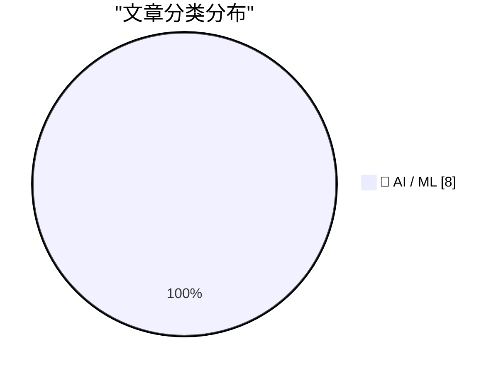
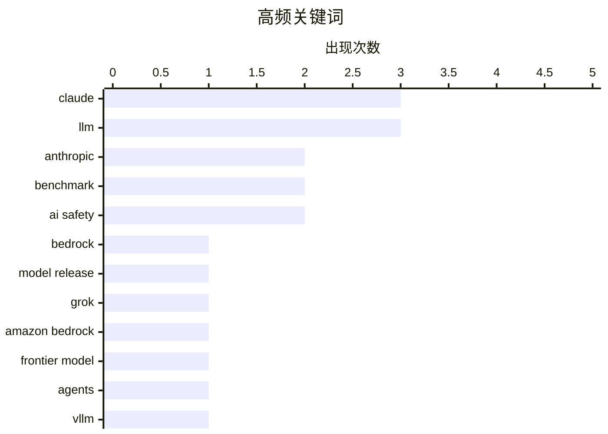

# 📰 AI 资讯每日精选 — 2026-09-29

> 汇聚 156+ 技术博客、X/Twitter、Hacker News、Reddit、Product Hunt、
> Lobste.rs、ClawFeed 日报及 GitHub Trending，经 AI 评分筛选。
>
> **本期内容**：🏆 今日必读 · 🌐 ClawFeed 日报 · 🔥 GitHub Trending · 📂 分类精选 · 📊 数据概览 · 🎯 项目相关情报 · 🌍 补充视角

## 📝 今日看点

今日技术圈的核心仍是模型迭代与落地竞速：Claude Sonnet 5.5、Grok 4.7 等新一代模型密集上线云平台，主打更强推理、更快速度、更低成本和超长上下文，企业级 AI 供给继续加速。与此同时，语音等实时多模态应用的工程化部署正成为焦点，相关工具链在进一步降低落地门槛。另一条主线是 AI 安全与治理升温，从芯片级看门狗到顶尖研究者对自动化 AI 研究“智能爆炸”风险的警告，行业在追求能力突破的同时，正被迫直面越来越紧迫的失控与责任问题。

---

## 🏆 今日必读

🥇 **在 AWS 上推出 Claude Sonnet 5.5**

[Introducing Claude Sonnet 5.5 on AWS](https://aws.amazon.com/blogs/machine-learning/introducing-claude-sonnet-5-5-on-aws/) — AWS Machine Learning Blog · 10 小时前 · 🤖 AI / ML · **一手来源**

> Claude Sonnet 5.5 现已在 Amazon Bedrock 和 AWS 上的 Claude Platform 提供。据该文章介绍，这是一款更智能、更高效的 Sonnet 模型，面向专注的编码与知识工作，具有更低的任务成本和更快的速度。文章还介绍了新特性、何时选择 Sonnet 以及如何开始使用。

💡 **为什么值得读**: 想了解 Claude Sonnet 5.5 在 AWS 上的可用渠道、定位与上手方式，这篇官方博客提供了直接入口。

🏷️ Claude, Bedrock, LLM, model release

🥈 **Anthropic 的 Claude Sonnet 5.5 在基准测试中几乎追平 Opus 5.5，每任务成本最多低 30%**

[Anthropic's Claude Sonnet 5.5 nearly matches Opus 5.5 on benchmarks while costing up to 30 percent less per task](https://the-decoder.com/anthropics-claude-sonnet-5-5-nearly-matches-opus-5-5-on-benchmarks-while-costing-up-to-30-percent-less-per-task/) — The Decoder · 11 小时前 · 🤖 AI / ML · **二手来源**

> Anthropic 发布 Claude 5.5 家族的第二款模型 Claude Sonnet 5.5。据该报道，其输出生成速度提升超过 30%，每任务成本最多降低 30%，在知识工作基准上几乎追平 Opus 5.5。在编码基准 Terminal-Bench 上，该模型从 10.3% 跃升至 70.6%。随着 Haiku 5.5 宣布将在未来几周推出，Anthropic 将很快与 OpenAI 的三款 GPT-6 模型形成一一对应。

💡 **为什么值得读**: 用具体基准分数和成本、速度数据说明 Sonnet 5.5 与 Opus 5.5 及 OpenAI 产品线的相对位置，适合做模型选型参考。

🏷️ Anthropic, Claude, benchmark, LLM

🥉 **Grok 4.7 现已在 Amazon Bedrock 上提供**

[Grok 4.7 is now available on Amazon Bedrock](https://aws.amazon.com/blogs/machine-learning/grok-4-7-is-now-available-on-amazon-bedrock/) — AWS Machine Learning Blog · 7 小时前 · 🤖 AI / ML · **一手来源**

> xAI 的 Grok 4.7 现已在 Amazon Bedrock 上提供，定位为面向编码、长时间运行的智能体和知识工作的前沿模型。它提供 500K token 的上下文窗口和四个可配置的推理强度级别，可通过 Responses、Chat Completions 和 Converse API 访问。

💡 **为什么值得读**: 需要 500K 上下文、可调推理强度并希望在 Bedrock 上调用 Grok 4.7 的开发者，可据此快速确认能力与接入方式。

🏷️ Grok, Amazon Bedrock, frontier model, agents

4️⃣ **Claude Sonnet 5.5**

[Claude Sonnet 5.5](https://simonwillison.net/2026/Sep/28/claude-sonnet-5-5/) — simonwillison.net · 7 小时前 · 🤖 AI / ML

> Anthropic 发布新的 Sonnet 模型 Claude Sonnet 5.5。据该文章引述，Anthropic 称其“运行速度快 30% 以上，且对大多数工作成本最多降低 30%”。该模型定价与 Sonnet 5 相同，但似乎在每项基准上都优于 Sonnet 5，运行成本也应更低。文章还附带了相关示例（pelicans 渲染）。

💡 **为什么值得读**: 来自 Simon Willison 的简短点评，点出 Sonnet 5.5 与 Sonnet 5 同价但基准全面占优这一关键信息，适合快速判断升级价值。

🏷️ Anthropic, Claude, LLM, benchmark

5️⃣ **在 SageMaker AI 上用 vLLM-Omni 构建实时语音应用——第 1 部分**

[Build real-time voice applications with vLLM-Omni on SageMaker AI – Part 1](https://aws.amazon.com/blogs/machine-learning/build-real-time-voice-applications-with-vllm-omni-on-sagemaker-ai-part-1/) — AWS Machine Learning Blog · 13 小时前 · 🤖 AI / ML · **一手来源**

> 这是一篇教程，介绍如何在 Amazon SageMaker AI 上使用 AWS vLLM-Omni 深度学习容器部署文本转语音模型，并通过持久双向连接流式传输生成的语音。第 1 部分具体部署 Qwen3-TTS，并通过 Gradio 应用流式输出语音。

💡 **为什么值得读**: 手把手演示 Qwen3-TTS 在 SageMaker AI 上的部署与双向流式语音输出，适合需要落地实时语音应用的工程师直接照做。

🏷️ vLLM, TTS, SageMaker, voice

---

## 🌐 ClawFeed 日报精选

> 来源：[ClawFeed](https://clawfeed.kevinhe.io) — AI 驱动的多源新闻聚合

# ClawFeed 日报 | 2026-09-28 (SGT)

> 聚合 1 份 4h digest（id: 1301, 16:00-19:59）
> 今日仅有 1 个时段有数据（素材 feed 5 + bookmarks 5）

---

## 🔥 当日全场最重要 5 条

1. **Meta Muse 全面爆发** — 假期期间 Muse 全面开放注册，原生支持 Tailscale 连接器免客户端一键绑定。核心认知：Meta 实际上为每个注册账号白送一台 2核CPU/8G内存的云端机器，Muse 不是简单的聊天 Agent。
2. **Muse + Hermes 打通** — 用户实现 Muse 通过 TailScale 连接 Hermes 浏览器和主动设备，内网直连；还发现 Muse 可以直接打美国境内商家电话（不支持私人/境外号码）。
3. **Browser Use + JEV 极速方案** — Browser Use 团队基于 Jev 模型做了 jev-ultrafast（19000+ Star），Google Flights 搜航班仅用 7.1 秒。原理：把页面可交互元素编成带编号的表，Jev 一次请求同时决定动作+目标元素。
4. **OpenMuse 开源替代方案出现** — 开源社区快速跟进 Meta Muse，出现了 OpenMuse 替代方案。
5. **Instinct 被评价为 "OpenClaw for normal people"** — 体验如魔法，不限于硅谷人群，作者在帮父亲也设置使用。

## 📰 当日核心主题

- **Meta Muse 生态爆发**：今日几乎所有 feed 都围绕 Muse 展开——开放注册、Tailscale 连接器、套娃注册、Hermes 打通、电话功能、OpenMuse 开源替代、社区更新警告。Muse 的本质是"云端白送算力的个人 Agent 工具"。
- **浏览器自动化提速**：Browser Use + Jev 模型将网页操作从"慢到卡死"变成"7 秒完成"，核心洞察是"网页操作本质是离散多选题"。
- **Agent-as-friend 范式**：Rene（multiplayer-first iMessage agent）和 Instinct 代表了 Agent 从工具向朋友/助手的转变。

## 🔖 累计 Bookmark 精选

- **Browser Use jev-ultrafast**（19000+ Star）— Jev 模型让浏览器操控极速化。开发者 @jarrodwatts 还用 JEV 做了纯 AI 原生链上自动交易系统（开源，跑了 14 小时亏了 300%，但架构惊艳）。
- **Rene** — multiplayer-first iMessage agent，像朋友一样发短信交互。有浏览器、能写代码、购物、建站、做幻灯片。
- **Instinct** — 被描述为"OpenClaw for normal people"，体验如魔法。

## 👀 推荐关注汇总

- 本日 scraper 未能提取推文作者 handle 和 URL，无法做关注推荐。

## 💤 当日重复噪音模式

- **Muse 更新警告重复帖**：多条"不要更新 Muse"类警告帖，内容重复，情绪驱动。
- **Muse 纯情绪帖**：非技术讨论的兴奋/吐槽帖被过滤。

---

*Generated: 2026-09-28 23:59:00 SGT | Sources: digest #1301*
---

## 🔥 GitHub Trending

> 今日热门开源项目（全语言 + Python）

| # | 项目 | 描述 | ⭐ 总星 | 📈 今日 | 语言 |
|---|------|------|---------|---------|------|
| 1 | [vectorize-io/hindsight](https://github.com/vectorize-io/hindsight) 🤖 | Hindsight: Agent Memory That Learns | 41.4k | +4561 | Python |
| 2 | [debpalash/VoiceStudio](https://github.com/debpalash/VoiceStudio) | VoiceStudio is the open-source, fully-local ElevenLabs al... | 44.9k | +3221 | Python |
| 3 | [paperclipai/paperclip](https://github.com/paperclipai/paperclip) | The open-source app everyone uses to manage agents at work | 93.3k | +3197 | TypeScript |
| 4 | [rohitg00/ai-engineering-from-scratch](https://github.com/rohitg00/ai-engineering-from-scratch) 🤖 | Learn it. Build it. Ship it for others. | 60.5k | +1287 | Python |
| 5 | [dream-num/univer](https://github.com/dream-num/univer) 🤖 | The Office Harness for AI Agents — Spreadsheets, Docs, Sl... | 21.4k | +1099 | TypeScript |
| 6 | [mvschwarz/openrig](https://github.com/mvschwarz/openrig) 🤖 | Multi-agent harness that runs Claude Code and Codex toget... | 1.9k | +734 | TypeScript |
| 7 | [byoungd/up](https://github.com/byoungd/up) 🤖 | An advanced guide which might benefit you a lot 🎉 . 韩先凯的... | 65.0k | +327 | JavaScript |
| 8 | [practical-tutorials/project-based-learning](https://github.com/practical-tutorials/project-based-learning) | Curated list of project-based tutorials | 285.2k | +206 | Python |
| 9 | [cs341-illinois/coursebook](https://github.com/cs341-illinois/coursebook) | Open Source Introductory Systems Programming Textbook for... | 2.6k | +195 | TeX |
| 10 | [NawfalMotii79/PLFM_RADAR](https://github.com/NawfalMotii79/PLFM_RADAR) | Open-source, low-cost 10.5 GHz PLFM phased array RADAR sy... | 25.9k | +158 | PLSQL |
| 11 | [alirezarezvani/claude-skills](https://github.com/alirezarezvani/claude-skills) 🤖 | 380 Claude Code skills & agent skills & plugins (30+ Agen... | 26.8k | +145 | Python |
| 12 | [microsoft/SkillOpt](https://github.com/microsoft/SkillOpt) 🤖 | SkillOpt is a text-space optimizer that trains reusable n... | 17.8k | +136 | Python |
| 13 | [ashhart/TensorFold](https://github.com/ashhart/TensorFold) 🤖 | Fast, exact LLM decoding on Apple Silicon (MLX) behind an... | 563 | +120 | Python |
| 14 | [topoteretes/cognee](https://github.com/topoteretes/cognee) 🤖 | Cognee is the open-source AI memory platform for agents. ... | 31.2k | +96 | Python |
| 15 | [samugit83/redamon](https://github.com/samugit83/redamon) 🤖 | An AI-powered agentic red team framework that automates o... | 2.8k | +84 | Python |

---

## 🤖 AI / ML

### 1. 在 AWS 上推出 Claude Sonnet 5.5

[Introducing Claude Sonnet 5.5 on AWS](https://aws.amazon.com/blogs/machine-learning/introducing-claude-sonnet-5-5-on-aws/) — **AWS Machine Learning Blog** · 10 小时前 · ⭐ 25/30 · **一手来源**

> Claude Sonnet 5.5 现已在 Amazon Bedrock 和 AWS 上的 Claude Platform 提供。据该文章介绍，这是一款更智能、更高效的 Sonnet 模型，面向专注的编码与知识工作，具有更低的任务成本和更快的速度。文章还介绍了新特性、何时选择 Sonnet 以及如何开始使用。

🏷️ Claude, Bedrock, LLM, model release

---

### 2. Anthropic 的 Claude Sonnet 5.5 在基准测试中几乎追平 Opus 5.5，每任务成本最多低 30%

[Anthropic's Claude Sonnet 5.5 nearly matches Opus 5.5 on benchmarks while costing up to 30 percent less per task](https://the-decoder.com/anthropics-claude-sonnet-5-5-nearly-matches-opus-5-5-on-benchmarks-while-costing-up-to-30-percent-less-per-task/) — **The Decoder** · 11 小时前 · ⭐ 26/30 · **二手来源**

> Anthropic 发布 Claude 5.5 家族的第二款模型 Claude Sonnet 5.5。据该报道，其输出生成速度提升超过 30%，每任务成本最多降低 30%，在知识工作基准上几乎追平 Opus 5.5。在编码基准 Terminal-Bench 上，该模型从 10.3% 跃升至 70.6%。随着 Haiku 5.5 宣布将在未来几周推出，Anthropic 将很快与 OpenAI 的三款 GPT-6 模型形成一一对应。

🏷️ Anthropic, Claude, benchmark, LLM

---

### 3. Grok 4.7 现已在 Amazon Bedrock 上提供

[Grok 4.7 is now available on Amazon Bedrock](https://aws.amazon.com/blogs/machine-learning/grok-4-7-is-now-available-on-amazon-bedrock/) — **AWS Machine Learning Blog** · 7 小时前 · ⭐ 24/30 · **一手来源**

> xAI 的 Grok 4.7 现已在 Amazon Bedrock 上提供，定位为面向编码、长时间运行的智能体和知识工作的前沿模型。它提供 500K token 的上下文窗口和四个可配置的推理强度级别，可通过 Responses、Chat Completions 和 Converse API 访问。

🏷️ Grok, Amazon Bedrock, frontier model, agents

---

### 4. Claude Sonnet 5.5

[Claude Sonnet 5.5](https://simonwillison.net/2026/Sep/28/claude-sonnet-5-5/) — **simonwillison.net** · 7 小时前 · ⭐ 25/30

> Anthropic 发布新的 Sonnet 模型 Claude Sonnet 5.5。据该文章引述，Anthropic 称其“运行速度快 30% 以上，且对大多数工作成本最多降低 30%”。该模型定价与 Sonnet 5 相同，但似乎在每项基准上都优于 Sonnet 5，运行成本也应更低。文章还附带了相关示例（pelicans 渲染）。

🏷️ Anthropic, Claude, LLM, benchmark

---

### 5. 在 SageMaker AI 上用 vLLM-Omni 构建实时语音应用——第 1 部分

[Build real-time voice applications with vLLM-Omni on SageMaker AI – Part 1](https://aws.amazon.com/blogs/machine-learning/build-real-time-voice-applications-with-vllm-omni-on-sagemaker-ai-part-1/) — **AWS Machine Learning Blog** · 13 小时前 · ⭐ 23/30 · **一手来源**

> 这是一篇教程，介绍如何在 Amazon SageMaker AI 上使用 AWS vLLM-Omni 深度学习容器部署文本转语音模型，并通过持久双向连接流式传输生成的语音。第 1 部分具体部署 Qwen3-TTS，并通过 Gradio 应用流式输出语音。

🏷️ vLLM, TTS, SageMaker, voice

---

### 6. Nvidia 想把 AI 智能体拴紧：在芯片里内置看门狗

[Nvidia wants to keep AI agents on a short leash with a watchdog built into its chips](https://the-decoder.com/nvidia-wants-to-keep-ai-agents-on-a-short-leash-with-a-watchdog-built-into-its-chips/) — **The Decoder** · 15 小时前 · ⭐ 24/30 · **二手来源**

> Nvidia 将其 OpenShell 智能体软件与新的硬件看门狗 Sentry 结合，构建 Open Agent Safety Platform。据该报道，Sentry 应在毫秒级隔离越界的 AI 智能体；作为对比，OpenAI 在 9 月发生类似事件时，停止运行耗时近三小时。不过文章也指出，Nvidia 的看门狗无法单独可靠地阻止被欺骗或隐藏意图的智能体。

🏷️ Nvidia, AI agents, safety, hardware

---

### 7. AI公司竞相证明自家模型对人类威胁最大

[AI companies in race to demonstrate their model most threatening to humanity](https://thecivilian.co.nz/2026/09/27/ai-companies-in-fierce-arms-race-to-demonstrate-their-model-is-the-most-existentially-threatening-to-humanity/) — **Hacker News Best** · 21 小时前 · ⭐ 24/30

> 这是一篇讽刺文章，调侃AI公司之间展开激烈竞赛，争相展示自家模型对人类构成最严重的生存威胁。文章标题以“军备竞赛”比喻各公司在模型危险性宣传上的攀比，暗示这种自我渲染已成为一种营销手段。该文来自新西兰媒体 The Civilian，在 Hacker News 上获得 427 分和 385 条评论，讨论热度较高。

🏷️ AI safety, existential risk, model race, satire

---

### 8. 20多位顶尖AI研究者警告：自动化AI研究带来极端风险

[More than 20 leading AI researchers warn that automated AI research poses extreme risks](https://the-decoder.com/more-than-20-leading-ai-researchers-warn-that-automated-ai-research-poses-extreme-risks/) — **The Decoder** · 10 小时前 · ⭐ 25/30 · **待核实**

> 包括 Geoffrey Hinton、Yoshua Bengio 和 OpenAI 研究负责人 Jakub Pachocki 在内的 20 多位 AI 研究者警告，自我改进的 AI 可能引发“智能爆炸”。他们认为，AI 系统可能很快自动化全部 AI 研究，把原本需要数年的进展压缩到几个月内完成。该警告的核心担忧是自动化 AI 研究带来的极端风险。

🏷️ AI safety, automated research, intelligence explosion

---

## 📊 数据概览

| 扫描源 | 抓取文章 | 时间范围 | 精选 |
|:---:|:---:|:---:|:---:|
| 110/156 | 10220 篇 → 4975 篇 | 24h | **8 篇** |

### 分类分布



### 高频关键词



<details>
<summary>📈 纯文本关键词图（终端友好）</summary>

```
claude         │ ████████████████████ 3
llm            │ ████████████████████ 3
anthropic      │ █████████████░░░░░░░ 2
benchmark      │ █████████████░░░░░░░ 2
ai safety      │ █████████████░░░░░░░ 2
bedrock        │ ███████░░░░░░░░░░░░░ 1
model release  │ ███████░░░░░░░░░░░░░ 1
grok           │ ███████░░░░░░░░░░░░░ 1
amazon bedrock │ ███████░░░░░░░░░░░░░ 1
frontier model │ ███████░░░░░░░░░░░░░ 1
```

</details>

### 🏷️ 话题标签

**claude**(3) · **llm**(3) · **anthropic**(2) · benchmark(2) · ai safety(2) · bedrock(1) · model release(1) · grok(1) · amazon bedrock(1) · frontier model(1) · agents(1) · vllm(1) · tts(1) · sagemaker(1) · voice(1) · nvidia(1) · ai agents(1) · safety(1) · hardware(1) · existential risk(1)

---

## 🎯 项目相关情报

### Agent 基座安全与合规

> 暂无达到质量门槛的项目相关情报。

### 多 Agent 架构

> 暂无达到质量门槛的项目相关情报。

### ASR 与语音助手

> 暂无达到质量门槛的项目相关情报。

### 商品包装 OCR

> 暂无达到质量门槛的项目相关情报。

---

## 🌍 补充视角

> Top 8 未覆盖的高质量不同来源，最多 3 条。

### 1. 时间维度的拉锯战：通过轨迹方差可视化并检测扩散模型中的RAG冲突

[The Temporal Tug-of-War: Visualizing and Detecting RAG Conflicts in Diffusion Models via Trajectory Variance](https://arxiv.org/abs/2609.31684) — **arXiv Computation and Language** · 1 小时前 · 🤖 AI / ML · ⭐ 23/30 · **一手来源**

> 该论文关注检索增强生成（RAG）在离散扩散语言模型中的一种特定失效模式：当检索到的上下文与模型参数化知识相矛盾时，迭代去噪过程会成为两种知识来源相互竞争的可见战场。作者提出将“时间语义分歧”作为检测此类冲突的可观测指标，并引入轨迹方差分数（Trajectory Variance Score, TVS），一种简单且可解释的度量方法。

💡 **补充价值**：为扩散语言模型中的RAG知识冲突提供了可解释的检测指标，适合关注RAG可靠性的研究者。

---

*生成于 2026-09-29 05:37 | 汇聚 156 个技术博客、X/Twitter、Hacker News、Reddit、Product Hunt、Lobste.rs、ClawFeed 日报及 GitHub Trending，经 AI 评分筛选出 Top 8 精华内容，另附 1 条不同来源补充视角*
