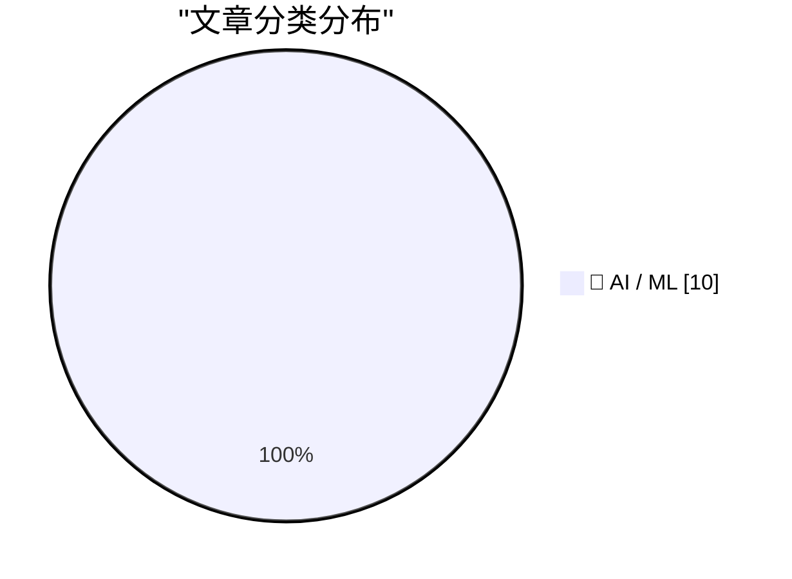
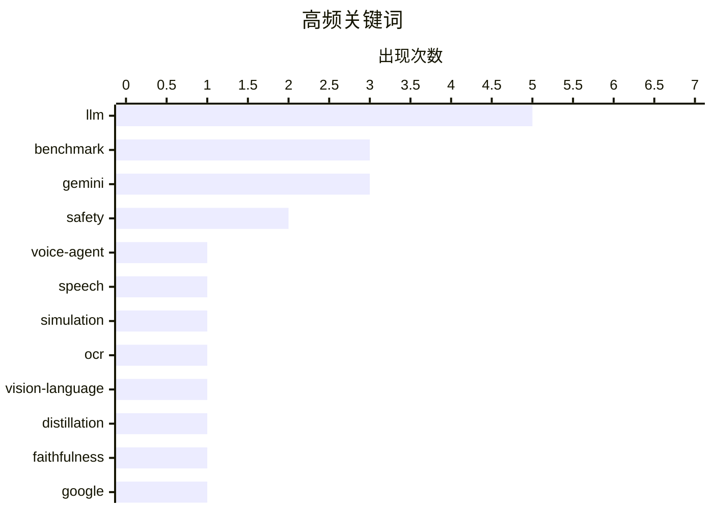

# 📰 AI 资讯每日精选 — 2026-10-01

> 汇聚 156+ 技术博客、X/Twitter、Hacker News、Reddit、Product Hunt、
> Lobste.rs、ClawFeed 日报及 GitHub Trending，经 AI 评分筛选。
>
> **本期内容**：🏆 今日必读 · 🌐 ClawFeed 日报 · 🔥 GitHub Trending · 📂 分类精选 · 📊 数据概览 · 🎯 项目相关情报 · 🌍 补充视角

## 📝 今日看点

今日技术圈看点集中在：前沿大模型竞争依旧胶着，Gemini 4 Argon试图缩小与OpenAI、Anthropic的差距，却未形成明显领先，厂商同时把能力推向芯片设计等垂直场景，资本与IPO叙事也在升温。另一条主线是智能体加速走向生产环境，语音客服、医疗协作与安全工具调用等场景都在直面多请求、隐私泄露和误操作风险。与之呼应，可靠性与对齐正成为落地前提，从OCR忠实度、对齐预测到在线策略蒸馏，行业关注点正从“能做”转向“可信、可控、可审计”。整体看，AI竞赛正从单一模型榜单转向系统级工程、垂直整合与治理能力的综合较量。

---

## 🏆 今日必读

🥇 **VAmoS Part Deux：更难、更真实的语音智能体模拟**

[VAmoS Part Deux: Harder, More Realistic Voice-Agent Simulation](https://arxiv.org/abs/2609.38512) — arXiv Artificial Intelligence · 1 小时前 · 🤖 AI / ML · **一手来源**

> 面向生产环境的语音智能体需要同时处理多个请求、背景语音以及失去耐心的客户，VAmoS Energy 基准将这三类挑战整合进 100 通关于水电费账单与支付协助的通话中。每位来电者会提出 2 到 4 个请求，智能体可调用 16 个工具，这些工具由带状态的 Stripe 计费孪生系统和 Apache Fineract 贷款引擎支撑。在来电者身份验证成功之前，账户访问会被阻止。

💡 **为什么值得读**: 想了解语音智能体在真实多任务、嘈杂环境与用户情绪压力下如何被评测，这个基准给出了具体的通话规模、工具数量和权限控制设计。

🏷️ voice-agent, benchmark, speech, simulation

🥈 **通过门控与衰减的在线策略蒸馏提升 OCR 忠实度**

[Improving OCR Faithfulness via Gated and Attenuated On-Policy Distillation](https://arxiv.org/abs/2609.38282) — arXiv Artificial Intelligence · 1 小时前 · 🤖 AI / ML · **一手来源**

> 视觉语言模型可能把图像中的异常文本改写成语言上更通顺的表达，从而损害 OCR 转录的忠实度。序列级任务奖励与局部教师指导具有互补性，但同一个教师的指导未必会随着学生模型变强而保持同等效果。离线分析显示，随着学生模型进步，来自固定教师的监督会逐渐变得不那么有利。

💡 **为什么值得读**: 如果你关注 OCR 忠实度问题以及在线策略蒸馏中教师信号随学生能力变化而失效的现象，这篇文章提供了问题诊断与改进思路。

🏷️ OCR, vision-language, distillation, faithfulness

🥉 **Google Gemini 4 Argon 缩小了与 OpenAI 和 Anthropic 的差距，但未取得明显领先**

[Google Gemini 4 Argon closes the gap with OpenAI and Anthropic but doesn't take a clear lead](https://the-decoder.com/google-gemini-4-argon-closes-the-gap-with-openai-and-anthropic-but-doesnt-take-a-clear-lead/) — The Decoder · 7 小时前 · 🤖 AI / ML · **二手来源**

> Gemini 4 Argon 是 Google 七个多月来推出的首个前沿模型。在独立测试中，它与 GPT-6 Astra 持平，但无法跟上 Anthropic 的 Claude Opus 5.5。其每 token 价格较低，但 Argon 完成每个任务消耗的 token 数量是 Astra 的两倍以上。部分测试者将优先获得访问权限，API 和付费层级随后跟进。

💡 **为什么值得读**: 想快速了解 Gemini 4 Argon 在独立测试中的相对位置、token 效率与定价取舍，这篇报道给出了直接的对比结论。

🏷️ Gemini, LLM, benchmark, Google

4️⃣ **OpenAI 与 Synopsys 联手打造像资深工程师一样设计芯片的 AI 模型**

[OpenAI and Synopsys team up to build an AI model that designs chips like a seasoned engineer](https://the-decoder.com/openai-and-synopsys-team-up-to-build-an-ai-model-that-designs-chips-like-a-seasoned-engineer/) — The Decoder · 10 小时前 · 🤖 AI / ML · **二手来源**

> OpenAI 与 Synopsys 正在构建 GPT-Synopsys，这是一个面向芯片设计的专用 AI 模型。它旨在像资深工程师一样操作 Synopsys 的 EDA 工具，并自主优化设计。与半导体客户的早期测试已经展开。OpenAI 很可能也在借助这一合作推进自身的芯片研发。

💡 **为什么值得读**: 芯片设计与 AI 智能体结合是当前热点，这篇报道点出了合作方、模型名称、目标能力与早期测试进展，信息密度高。

🏷️ OpenAI, Synopsys, chip design, EDA

5️⃣ **PrivMeSA：面向医疗的隐私感知自演化多智能体系统，通过本地-远程 LLM 协作实现**

[PrivMeSA: Privacy-Aware Self-Evolving Multi-Agent System for Medicine via Local-Remote LLM Collaboration](https://arxiv.org/abs/2609.38458) — arXiv Artificial Intelligence · 1 小时前 · 🤖 AI / ML · **一手来源**

> 本地部署的临床大语言模型智能体可以咨询能力更强的远程模型，但这样做有暴露患者信息的风险。注重隐私的委托机制把披露决策交给本地智能体，然而仅移除显式标识符并不足够：准标识符可能在多轮咨询和重复就诊中累积，从而实现再识别。为此，作者提出了隐私感知的自演化系统 PrivMeSA。

💡 **为什么值得读**: 医疗场景下本地与远程 LLM 协作的隐私风险常被简化为去标识化，这篇文章指出了准标识符跨轮累积这一更隐蔽的威胁，并给出系统方案。

🏷️ LLM, multi-agent, privacy, healthcare

---

## 🌐 ClawFeed 日报精选

> 来源：[ClawFeed](https://clawfeed.kevinhe.io) — AI 驱动的多源新闻聚合

# ClawFeed Daily Digest | 2026-09-30

> 聚合 5 个 4h digest (IDs: 1311, 1313, 1314, 1315, 1316)
> 覆盖 00:00-19:59 SGT

---

## 🔥 当日全场最重要 5 条

1. **OpenAI DevDay 发布 Dots——24/7 自主 Agent 成为现实产品**
   基于 GPT-6 Astra 驱动，每个 dot 拥有独立云端电脑和浏览器，记住用户偏好，离线时持续推进工作，4000+ app 插件，甚至可以免费打电话。目前仅限 Pro 和 Business Premium。Sam Altman 定调"get more of your time and attention back"。这是 Personal Agent 赛道从概念到"always-on + 全平台连接"的里程碑。
   来源: @OpenAI, @sama, @dotey, @sleepy0x13, @indigox, @oragnes（全天 5 个时段均有覆盖）

2. **Personal Agent 五大玩家阵列化——赛道密度史无前例**
   Meta Muse / Manus Cue / OpenAI Dots / Grok Bot / 开源 Hermes Agent 同时在场。玉伯(@lifesinger)总结：Claude Tag / Grok Bot / Muse / Cue / Dots 一连串发布标志"agent 新物种"确立，computer 和 phone 正变成 agent 基础设施。GPT-6.1 Sol 定价明显面向大规模 agent 使用。Anthropic 是五大玩家中唯一尚未推出 Personal Agent 的。
   来源: @lifesinger, @xiaomovps, @indigox

3. **Manus 命运大逆转——AI 时代商业模式被改写**
   Meta 去年 12 月 $20 亿收购 → 中国要求撤回 → Meta 以近 $20 亿卖回中国公司 → 上周扎克伯格直接发布 Meta 自研。三个月 6664 万访问，直接访问占 62.8%，付费搜索仅 3.1%——品牌心智而非买量在驱动 agent 产品增长。业内一致认为 Manus 工程和交付在所有 agent 里最顶级。MAU 不再是护城河，Agent 能力才是。
   来源: @gelunding, feed[1], feed[3]

4. **Instinct + Shopify 合作——个人 AI Agent 进入真实商业交易闭环**
   人类专家策展推荐 + Shopify 一站式发现/下单/物流追踪。35% 用户已在用 Instinct 购物。Noah Shinn 团队正在开放更多名额。Personal Agent 从"帮你搜"升级到"帮你买"。
   来源: @noahrshinn, @pitdesi

5. **Anthropic 公开内部方法论——Prompt 优化 / Agent 评测 / 自动调优标准化**
   首次公开 eval design + hillclimbing 自动化方法论，Claude Code 可直接构建评估并迭代优化。被评为"理论上比 GEPA 更完备"，提示词优化从黑箱走向标准化。同时 Claude Code Skill 上线两个神级指令。
   来源: @LotusDecoder

---

## 📰 当日核心主题

### 1. OpenAI DevDay / Dots（贯穿全天）
今日绝对主线。从凌晨发布到晚间，5 个 4h 时段全部覆盖 Dots 话题。多位华语 KOL（宝玉 @dotey 万字长文、@sleepy0x13 深度复盘、@oragnes 7 条核心压缩）从不同角度解读。核心共识：OpenAI 从 API provider 转型为 agent infrastructure provider，Dots 是这一战略的产品化载体。GPT-6.1 旗舰缺席（延至 10 月），Sol 6.1 补位。

### 2. Personal Agent 军备竞赛
五大玩家同时在场的密度前所未有。类比 2012 年滴滴——上游模型厂商通过补贴 PA 应用抢占入口。Cue Agents 免费开放（Android/Mac/Windows），补贴战正式打响。Fo（前 DeepMind 工程负责人）的差异化路线：AI+人类混合，承认 AI 做不了就找真人，2x 真实任务完成率。

### 3. Agent 设计范式争论
两大范式：Agent 整体跑在 sandbox vs Agent 在外/tools 在 sandbox。大厂偏向前者——用资源开销换隔离的直观性。CopilotKit 做了 Meta Muse 的开源版 OpenMuse，可自部署。

### 4. Manus 商业剧变
从 Meta 收购到中国要求撤回到卖回再到 Meta 自研，三个月内完成商业模式的完整闭环反转。Manus 2.0 发布是分手后首次重大迭代。

---

## 🔖 累计 Bookmark 精选

- **@sama** — Dots 官方发布推文："A new way to use AI that works 24/7 for you"
- **@alexandr_wang** — Scale AI CEO 哲学短文 "Here's to the wanting" + Muse 小企业版（水管工、杂货店、农场、餐馆）
- **@ManusAI** — Manus 2.0 正式发布
- **@tlxue** — Rene：multiplayer-first iMessage agent，像发短信一样用，四个月内测找到新办公室
- **@pitdesi** — Instinct 深度体验："OpenClaw for normal people"
- **@GitHub_Daily** — Browser Use + Jev ultrafast（19000+ stars），Google Flights 搜航班 7.1 秒
- **@SUOHA_AI** — Browser Use + JEV 速度实测，Monad 团队做了链上自动交易开源版

---

## 👀 推荐关注汇总

- **@noahrshinn (Noah Shinn)** — Instinct 创始人，Personal Agent + Shopify 电商整合，持续 building in public，关注价值高
- **@CueAgents** — Manus 旗下 Cue，刚发布免费 Personal Agent，值得追踪产品迭代节奏
- **@lifesinger (玉伯)** — "Agent 新物种"元视角总结者，高质量产业观察

---

## 💤 当日重复噪音模式

1. **DevDay 同质化解读泛滥** — 5/5 时段均覆盖 Dots，中后期出现大量重复转述（同一条 @dotey 万字长文被多次引用），信噪比在后期下降
2. **Crypto 交易类内容持续混入** — @Tradermayne（Breakout Prop 推广）、@ColdBloodShill（喊单）、@RookieXBT（meme token）与 AI/tech builder 方向不符，建议清理
3. **Bookmark 跨期重叠** — alexandr_wang/Jev/Rene/Instinct 连续多期出现在 bookmarks 中未被清除，说明 Kevin 标记后未手动处理
4. **Kevin mark 微信文章无法抓取** — `mp.weixin.qq.com` 遇到"环境异常"验证墙，待 Kevin 手动提供内容

---

*Generated from 5 × 4h digests spanning 2026-09-30 00:00-19:59 SGT*---

## 🔥 GitHub Trending

> 今日热门开源项目（全语言 + Python）

| # | 项目 | 描述 | ⭐ 总星 | 📈 今日 | 语言 |
|---|------|------|---------|---------|------|
| 1 | [debpalash/VoiceStudio](https://github.com/debpalash/VoiceStudio) | VoiceStudio is the open-source, fully-local ElevenLabs al... | 50.7k | +3483 | Python |
| 2 | [NVIDIA/OpenShell](https://github.com/NVIDIA/OpenShell) 🤖 | OpenShell is the safe, private runtime for autonomous AI ... | 13.1k | +1281 | Rust |
| 3 | [rohitg00/ai-engineering-from-scratch](https://github.com/rohitg00/ai-engineering-from-scratch) 🤖 | Learn it. Build it. Ship it for others. | 62.2k | +1205 | Python |
| 4 | [t8y2/dbx](https://github.com/t8y2/dbx) 🤖 | 25 MB lightweight cross-platform database client for 100+... | 23.4k | +1138 | Rust |
| 5 | [VectifyAI/PageIndex](https://github.com/VectifyAI/PageIndex) 🤖 | 📑 PageIndex: Document Index for Vectorless, Reasoning-ba... | 38.2k | +1097 | Python |
| 6 | [mattpocock/skills](https://github.com/mattpocock/skills) | Skills for Real Engineers. Straight from my .agents direc... | 273.2k | +876 | Shell |
| 7 | [DietrichGebert/ponytail](https://github.com/DietrichGebert/ponytail) 🤖 | Makes your AI agent think like the laziest senior dev in ... | 149.4k | +743 | JavaScript |
| 8 | [byoungd/up](https://github.com/byoungd/up) 🤖 | An advanced guide which might benefit you a lot 🎉 . 韩先凯的... | 66.5k | +743 | JavaScript |
| 9 | [HunxByts/GhostTrack](https://github.com/HunxByts/GhostTrack) | Useful tool to track location or mobile number | 16.0k | +635 | Python |
| 10 | [mvschwarz/openrig](https://github.com/mvschwarz/openrig) 🤖 | Multi-agent harness that runs Claude Code and Codex toget... | 3.2k | +624 | TypeScript |
| 11 | [harry0703/MoneyPrinterTurbo](https://github.com/harry0703/MoneyPrinterTurbo) 🤖 | 利用 AI 大模型和自动化工作流，根据主题或关键词一键生成高清短视频。Generate HD short vide... | 127.7k | +431 | Python |
| 12 | [heygen-com/hyperframes](https://github.com/heygen-com/hyperframes) | Write HTML. Render video. Built for agents. | 54.9k | +349 | TypeScript |
| 13 | [ifixai-ai/iFixAi](https://github.com/ifixai-ai/iFixAi) 🤖 | Independent Auditing of AI Agents. Run by human or the ag... | 17.7k | +340 | Python |
| 14 | [TencentCloud/Octop](https://github.com/TencentCloud/Octop) 🤖 | A smarter, self-hosted AI assistant — multi-user, multi-a... | 6.1k | +285 | Python |
| 15 | [NawfalMotii79/PLFM_RADAR](https://github.com/NawfalMotii79/PLFM_RADAR) | Open-source, low-cost 10.5 GHz PLFM phased array RADAR sy... | 26.5k | +263 | PLSQL |

---

## 🤖 AI / ML

### 1. VAmoS Part Deux：更难、更真实的语音智能体模拟

[VAmoS Part Deux: Harder, More Realistic Voice-Agent Simulation](https://arxiv.org/abs/2609.38512) — **arXiv Artificial Intelligence** · 1 小时前 · ⭐ 23/30 · **一手来源**

> 面向生产环境的语音智能体需要同时处理多个请求、背景语音以及失去耐心的客户，VAmoS Energy 基准将这三类挑战整合进 100 通关于水电费账单与支付协助的通话中。每位来电者会提出 2 到 4 个请求，智能体可调用 16 个工具，这些工具由带状态的 Stripe 计费孪生系统和 Apache Fineract 贷款引擎支撑。在来电者身份验证成功之前，账户访问会被阻止。

🏷️ voice-agent, benchmark, speech, simulation

---

### 2. 通过门控与衰减的在线策略蒸馏提升 OCR 忠实度

[Improving OCR Faithfulness via Gated and Attenuated On-Policy Distillation](https://arxiv.org/abs/2609.38282) — **arXiv Artificial Intelligence** · 1 小时前 · ⭐ 21/30 · **一手来源**

> 视觉语言模型可能把图像中的异常文本改写成语言上更通顺的表达，从而损害 OCR 转录的忠实度。序列级任务奖励与局部教师指导具有互补性，但同一个教师的指导未必会随着学生模型变强而保持同等效果。离线分析显示，随着学生模型进步，来自固定教师的监督会逐渐变得不那么有利。

🏷️ OCR, vision-language, distillation, faithfulness

---

### 3. Google Gemini 4 Argon 缩小了与 OpenAI 和 Anthropic 的差距，但未取得明显领先

[Google Gemini 4 Argon closes the gap with OpenAI and Anthropic but doesn't take a clear lead](https://the-decoder.com/google-gemini-4-argon-closes-the-gap-with-openai-and-anthropic-but-doesnt-take-a-clear-lead/) — **The Decoder** · 7 小时前 · ⭐ 26/30 · **二手来源**

> Gemini 4 Argon 是 Google 七个多月来推出的首个前沿模型。在独立测试中，它与 GPT-6 Astra 持平，但无法跟上 Anthropic 的 Claude Opus 5.5。其每 token 价格较低，但 Argon 完成每个任务消耗的 token 数量是 Astra 的两倍以上。部分测试者将优先获得访问权限，API 和付费层级随后跟进。

🏷️ Gemini, LLM, benchmark, Google

---

### 4. OpenAI 与 Synopsys 联手打造像资深工程师一样设计芯片的 AI 模型

[OpenAI and Synopsys team up to build an AI model that designs chips like a seasoned engineer](https://the-decoder.com/openai-and-synopsys-team-up-to-build-an-ai-model-that-designs-chips-like-a-seasoned-engineer/) — **The Decoder** · 10 小时前 · ⭐ 25/30 · **二手来源**

> OpenAI 与 Synopsys 正在构建 GPT-Synopsys，这是一个面向芯片设计的专用 AI 模型。它旨在像资深工程师一样操作 Synopsys 的 EDA 工具，并自主优化设计。与半导体客户的早期测试已经展开。OpenAI 很可能也在借助这一合作推进自身的芯片研发。

🏷️ OpenAI, Synopsys, chip design, EDA

---

### 5. PrivMeSA：面向医疗的隐私感知自演化多智能体系统，通过本地-远程 LLM 协作实现

[PrivMeSA: Privacy-Aware Self-Evolving Multi-Agent System for Medicine via Local-Remote LLM Collaboration](https://arxiv.org/abs/2609.38458) — **arXiv Artificial Intelligence** · 1 小时前 · ⭐ 24/30 · **一手来源**

> 本地部署的临床大语言模型智能体可以咨询能力更强的远程模型，但这样做有暴露患者信息的风险。注重隐私的委托机制把披露决策交给本地智能体，然而仅移除显式标识符并不足够：准标识符可能在多轮咨询和重复就诊中累积，从而实现再识别。为此，作者提出了隐私感知的自演化系统 PrivMeSA。

🏷️ LLM, multi-agent, privacy, healthcare

---

### 6. 对齐预测：从训练数据预测模型失准

[Alignment Forecasting: Predicting Misalignment From Training Data](https://arxiv.org/abs/2609.35805) — **arXiv Computation and Language** · 1 小时前 · ⭐ 24/30 · **一手来源**

> 在带有某种狭窄缺陷的数据上训练语言模型，有时会让模型出现广泛的失准行为。仅凭表面检查数据往往无法判断这种失准是否会出现，目前只能在训练后通过审计模型来发现。为补充事后审计，作者提出了“对齐预测”任务：在训练之前预测对齐失败。给定目标模型、微调数据集和失败模式，该方法尝试提前判断风险。

🏷️ alignment, training-data, LLM, safety

---

### 7. 环境引导：用数据流控制提升智能体效用与安全性

[Environment Steering: Using Data Flow Control to Improve Agent Utility and Safety](https://arxiv.org/abs/2609.35807) — **arXiv Computation and Language** · 1 小时前 · ⭐ 24/30 · **一手来源**

> 即使被指示要安全行事，LLM 智能体仍可能发起不安全的工具调用。现有防御手段包括在执行前约束智能体、修改工具输入输出，或依赖 LLM 裁判；这些方法可能依赖模型行为，或者只是阻止不安全动作而不帮助智能体恢复。作者主张执行环境应在智能体运行过程中强制安全，并在发生违规时将其引导至安全替代方案，这被称为环境引导。

🏷️ agent, safety, tool-use, data-flow

---

### 8. Gemini 4 Argon

[Gemini 4 Argon](https://blog.google/innovation-and-ai/models-and-research/gemini-models/gemini-4-argon/) — **Hacker News Best** · 9 小时前 · ⭐ 24/30

> 这是 Google 官方博客关于 Gemini 4 Argon 的发布页面，Hacker News 上相关讨论获得 1170 分、772 条评论。页面同时链接到一篇关于 Gemini 4 Argon（High）的智能、性能与价格分析。

🏷️ Gemini, LLM, benchmark, pricing

---

### 9. Anthropic 的 IPO 招股书真是够劲爆

[Anthropic’s IPO Prospectus Is a Fucking Doozy](https://www.reuters.com/business/finance/anthropics-ipo-prospectus-shows-sweeping-ai-vision-surging-costs-2026-09-28/) — **daringfireball.net** · 10 小时前 · ⭐ 23/30

> 路透社记者 Echo Wang 报道称，Anthropic 在其 IPO 招股书中押注 AI 将比工业化、电力和互联网更深刻地改变全球经济。Daring Fireball 的评论认为，这个导语虽然清晰有力，但仍未充分表达 Anthropic 所代表的事物的真正量级。文章指出，真正具有变革性的不只是“AI”这个领域，而是更具体的东西。

🏷️ Anthropic, IPO, AI economy

---

### 10. Gemini 4 Argon：我们前沿智能的新纪元

[Gemini 4 Argon: our next era of frontier intelligence](https://deepmind.google/blog/gemini-4-argon-our-next-era-of-frontier-intelligence/) — **Google DeepMind Blog** · 9 小时前 · ⭐ 25/30

> 这是 Google DeepMind 官方博客关于 Gemini 4 Argon 的发布文章，将其定位为前沿智能的新纪元。

🏷️ Gemini, frontier model, DeepMind, LLM

---

## 📊 数据概览

| 扫描源 | 抓取文章 | 时间范围 | 精选 |
|:---:|:---:|:---:|:---:|
| 109/156 | 7258 篇 → 2207 篇 | 24h | **10 篇** |

### 分类分布



### 高频关键词



<details>
<summary>📈 纯文本关键词图（终端友好）</summary>

```
llm             │ ████████████████████ 5
benchmark       │ ████████████░░░░░░░░ 3
gemini          │ ████████████░░░░░░░░ 3
safety          │ ████████░░░░░░░░░░░░ 2
voice-agent     │ ████░░░░░░░░░░░░░░░░ 1
speech          │ ████░░░░░░░░░░░░░░░░ 1
simulation      │ ████░░░░░░░░░░░░░░░░ 1
ocr             │ ████░░░░░░░░░░░░░░░░ 1
vision-language │ ████░░░░░░░░░░░░░░░░ 1
distillation    │ ████░░░░░░░░░░░░░░░░ 1
```

</details>

### 🏷️ 话题标签

**llm**(5) · **benchmark**(3) · **gemini**(3) · safety(2) · voice-agent(1) · speech(1) · simulation(1) · ocr(1) · vision-language(1) · distillation(1) · faithfulness(1) · google(1) · openai(1) · synopsys(1) · chip design(1) · eda(1) · multi-agent(1) · privacy(1) · healthcare(1) · alignment(1)

---

## 🎯 项目相关情报

### Agent 基座安全与合规

> 暂无达到质量门槛的项目相关情报。

### 多 Agent 架构

> 暂无达到质量门槛的项目相关情报。

### ASR 与语音助手

#### [VAmoS Part Deux：更难、更真实的语音智能体模拟](https://arxiv.org/abs/2609.38512)

> **状态**：本期 Top 10 已收录

- **匹配类型**：直接相关
- **项目相关性**：8/10
- **可落地性**：7/10
- **为什么相关**：提出VAmoS Energy语音Agent仿真基准，覆盖多请求、背景语音和用户不耐烦，直接服务语音助手鲁棒性评测。
- **建议动作**：获取该基准与指标，评估其在语音助手/ASR实时交互与鲁棒性测试中的可用性。
- **来源**：arXiv Artificial Intelligence · 一手来源

### 商品包装 OCR

#### [通过门控与衰减的在线策略蒸馏提升 OCR 忠实度](https://arxiv.org/abs/2609.38282)

> **状态**：本期 Top 10 已收录

- **匹配类型**：直接相关
- **项目相关性**：7/10
- **可落地性**：6/10
- **为什么相关**：针对VLM改写图像异常文本导致OCR不忠实的问题，提出门控衰减的on-policy蒸馏，提升OCR转写忠实度。
- **建议动作**：关注其蒸馏方法，测试在商品包装复杂/异常文字与品牌字段识别中的迁移效果。
- **来源**：arXiv Artificial Intelligence · 一手来源

---

## 🌍 补充视角

> Top 10 未覆盖的高质量不同来源，最多 3 条。

### 1. 微调 NVIDIA Nemotron 以支持沙特阿拉伯方言，并探索通往其他语言的路径

[Fine-Tuning NVIDIA Nemotron for Saudi Arabic Dialects, with a Path to Other Languages](https://developer.nvidia.com/blog/fine-tuning-nvidia-nemotron-for-saudi-arabic-dialects-with-a-path-to-other-languages/) — **NVIDIA Technical Blog** · 42 分钟前 · 🤖 AI / ML · ⭐ 22/30

> 自动语音识别需要处理人们实际说话的方式，而不仅仅是预训练数据中占主导地位的语言和风格。NVIDIA 技术博客介绍了如何微调 NVIDIA Nemotron 模型，使其能够识别沙特阿拉伯方言，并提出了将这一方法扩展到其他语言的路径。文章聚焦于区域方言在语音识别中的挑战，以及通过微调提升模型对特定方言的适应能力。作者的核心观点是，针对特定方言的微调是提升语音识别实用性的关键，且该方法具有推广到其他语言的潜力。

💡 **补充价值**：如果你关注语音识别在真实方言场景中的落地，这篇来自 NVIDIA 的技术博客提供了具体的微调思路和可扩展的语言路径。

---

*生成于 2026-10-01 05:42 | 汇聚 156 个技术博客、X/Twitter、Hacker News、Reddit、Product Hunt、Lobste.rs、ClawFeed 日报及 GitHub Trending，经 AI 评分筛选出 Top 10 精华内容，另附 1 条不同来源补充视角*
