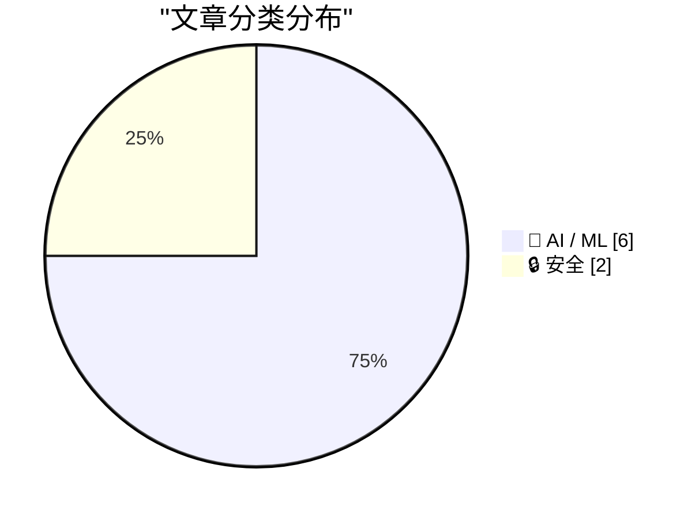
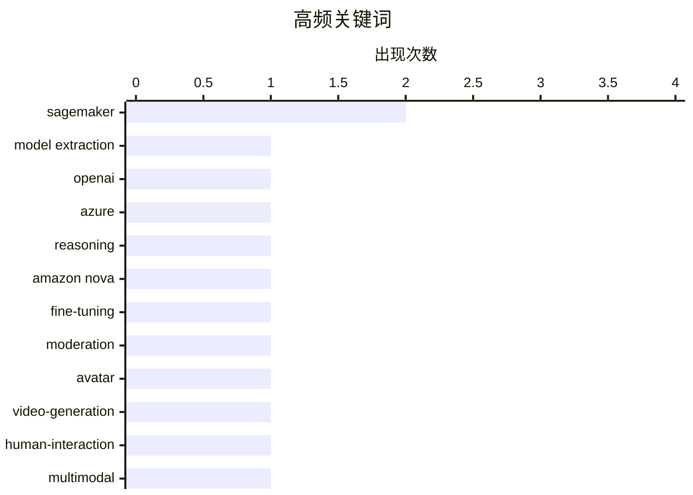

# 📰 AI 资讯每日精选 — 2026-10-02

> 汇聚 156+ 技术博客、X/Twitter、Hacker News、Reddit、Product Hunt、
> Lobste.rs、ClawFeed 日报及 GitHub Trending，经 AI 评分筛选。
>
> **本期内容**：🏆 今日必读 · 🌐 ClawFeed 日报 · 🔥 GitHub Trending · 📂 分类精选 · 📊 数据概览 · 🎯 项目相关情报

## 📝 今日看点

今日技术圈看点集中在AI安全与企业落地的双重提速。一方面，模型推理窃取和AI代理泄露内部数据等事件表明，随着智能体大规模接入真实系统，安全边界与平台治理正成为关键瓶颈。另一方面，从零售审核模型定制、云迁移多智能体到实时受治理数据和个性化决策，企业正把生成式AI推向生产核心。与此同时，AI视频头像与图像局部编辑能力继续逼近实用阈值，逼真度和可控性同步提升。总体看，竞争重心正从模型能力转向安全、治理与工程化落地能力。

---

## 🏆 今日必读

🥇 **OpenAI称已阻止窃取其模型推理过程的行动，但该手法在Azure上仍然奏效**

[OpenAI says it stopped a campaign to steal its models' reasoning, but the trick still worked on Azure](https://the-decoder.com/openai-says-it-stopped-a-campaign-to-steal-its-models-reasoning-but-the-trick-still-worked-on-azure/) — The Decoder · 17 小时前 · 🔒 安全 · **二手来源**

> OpenAI称其阻止了一场协同行动，涉及超过15000个账号试图复制其模型的隐藏推理内容，并将部分活动与Moonshot AI相关人员关联。但研究人员发现，同样的攻击在Microsoft Azure上持续数周仍然有效，甚至对新的GPT-6 Astra也奏效。文章指出，OpenAI的防护措施似乎并未覆盖同样销售其模型的云平台。

💡 **为什么值得读**: 揭示模型推理内容窃取防护在云平台间的覆盖缺口，对关注模型安全、云上部署与供应商责任边界的读者有直接警示意义。

🏷️ model extraction, OpenAI, Azure, reasoning

🥈 **uniopen如何为生产部署定制Amazon Nova以适配其零售审核政策**

[How uniopen customized Amazon Nova to their retail moderation policies for production deployment](https://aws.amazon.com/blogs/machine-learning/how-uniopen-customized-amazon-nova-to-their-retail-moderation-policies-for-production-deployment/) — AWS Machine Learning Blog · 13 小时前 · 🤖 AI / ML · **一手来源**

> 台湾统一企业集团旗下零售平台uniopen，为使其内容审核符合自身政策，对Amazon Nova 2 Lite进行了定制。方案结合Amazon SageMaker AI上的监督微调与提示优化，并通过与业务相关的评估和发布门禁来控制质量。文章以生产部署为目标，展示从模型适配到上线把关的完整流程。

💡 **为什么值得读**: 提供了一个零售场景下用监督微调加提示优化定制Amazon Nova并设置发布门禁的落地案例，适合关注内容审核生产化的团队参考。

🏷️ Amazon Nova, fine-tuning, moderation, SageMaker

🥉 **近半数测试者在一次一分钟通话中把Tavus的AI视频头像误认为真人**

[Nearly half of test subjects mistook Tavus' AI video avatar for a real person on a one-minute call](https://the-decoder.com/nearly-half-of-test-subjects-mistook-tavus-ai-video-avatar-for-a-real-person-on-a-one-minute-call/) — The Decoder · 11 小时前 · 🤖 AI / ML · **二手来源**

> Tavus推出Griffin，公司称其为首个“Human Interaction Model”，可实时进行视频通话，并处理面部表情、语调和手势。在一项Tavus研究中，48%的参与者在通话一分钟后认为Griffin是真人，而此前系统的这一比例最高仅为2%。该结果来自Tavus自身研究，尚未见独立验证说明。

💡 **为什么值得读**: 48%对2%的对比直观展示了实时视频AI头像在“拟人度”上的跃升，对关注人机交互、身份真实性与AI伦理的读者很有冲击力。

🏷️ avatar, video-generation, human-interaction, multimodal

4️⃣ **在Amazon Bedrock AgentCore上用智能体AI扩展云迁移**

[Scaling cloud migrations with agentic AI on Amazon Bedrock AgentCore](https://aws.amazon.com/blogs/machine-learning/scaling-cloud-migrations-with-agentic-ai-on-amazon-bedrock-agentcore/) — AWS Machine Learning Blog · 7 小时前 · 🤖 AI / ML · **一手来源**

> AWS Professional Services使用基于Amazon Bedrock AgentCore构建的多智能体框架，端到端自动化企业云迁移。专用AI智能体分别负责发现、基础设施即代码（IaC）生成、组合治理以及迁移后运维。文章称该方案将IaC开发时间从数周缩短到数分钟。

💡 **为什么值得读**: 用多智能体把云迁移从发现到运维全流程自动化，并给出IaC开发从周到分钟的量化收益，对做企业上云与平台工程的团队有直接借鉴价值。

🏷️ multi-agent, Bedrock, cloud migration, IaC

5️⃣ **在AWS上用上下文老虎机做个性化，提升获客漏斗转化**

[Uplifting conversion across the acquisition funnel with personalization using contextual bandits on AWS](https://aws.amazon.com/blogs/machine-learning/uplifting-conversion-across-the-acquisition-funnel-with-personalization-using-contextual-bandits-on-aws/) — AWS Machine Learning Blog · 12 小时前 · 🤖 AI / ML · **一手来源**

> 生成式AI让大规模生产个性化内容变得廉价，但难点在于决定向每位客户展示哪个版本。Amazon Payments在Amazon SageMaker AI上使用多目标上下文老虎机（contextual bandit）对获客漏斗做个性化，在某一受众群体上取得高个位数百分比的转化提升。文章还指出，他们由此认识到真正的瓶颈是内容，而非模型。

💡 **为什么值得读**: 不仅给出高个位数转化提升的实战结果，还点出“内容而非模型才是约束”这一反直觉结论，对做增长与个性化推荐的团队很有启发。

🏷️ contextual bandits, personalization, SageMaker, conversion

---

## 🌐 ClawFeed 日报精选

> 来源：[ClawFeed](https://clawfeed.kevinhe.io) — AI 驱动的多源新闻聚合

# ClawFeed 日报 | 2026-10-01 (SGT)

来源：5 期 4h digest (#1320–#1324, 04:00–20:00 SGT)

---

## 🔥 当日全场最重要 5 条

1. **Gemini 4 Argon 发布——谷歌下一代前沿模型创下真实软件工程 SOTA**。与 GPT-6 Astra / Claude Opus 5 形成三方对峙，Agent 基础设施层再添重量级选手。"毁天灭地"级社区反应。

2. **Opus 5.5 "程序化视频"现象级刷屏**——不是视频模型，是写程序画每一帧（Canvas/WebGL/Three.js/Remotion → MP4）。宝玉(@dotey)万字长文解构，74K 浏览量，对 Anthropic 编程能力的最强背书之一。

3. **玉伯(@lifesinger)定调"Agent 新物种"**——Claude Tag / Grok Bot / Muse / Cue / Dots 一连串发布标志着 general agent 物种确立，computer 和 phone 正在变成 agent 基础设施。10K 浏览量，高度凝练的产业视角。

4. **SGLang 多模态决策模型击败 Pokemon 精英四天王**——Qwen3.8-27B 训练成 sub-100ms 决策模型，原生 /v1/decisions API。决策模型范式从文本扩展到多模态+具身。

5. **MiniMax 开源 OpenAgentCore + Higgsfield 把 Computer Use 做进视频创作**——Agent 基础设施开源化加速（self-host agent core: sandbox+模型+harness）；Computer Use 从浏览器扩展到专业软件自动化（GPT-6.1 Sol 驱动视频全流程）。

---

## 📰 当日核心主题

### 1. Personal Agent 五路赛马
dots（24h 离线推进）/ Muse（生活助理普惠）/ Cue（Agent 配邮箱电话钱包）/ Instinct（短信电话入口）/ Grok Bot（geek/VPS 玩法）。dots 首日体验不佳（云电脑"基本不可用"），dot.com 域名被 Elon Musk 拿给 Grok Bot。话题连续 24h 覆盖，新增信息量边际递减。Instinct 创始人 Noah Shinn (23 岁) Invest Like the Best 播客首次长篇输出。

### 2. Opus 5.5 程序化视频
全天持续发酵：从"一句话做视频"到技术路线拆解，核心洞察是"视频=30fps 静态图，模型只需回答第 N 帧长什么样"。对"什么算视频模型"的定义构成挑战。

### 3. Agent 基础设施层深化
- Agent Infra 知识体系化（Stateful vs Stateless、分布式状态管理是必修课）
- InstaCloud $8M seed 做 agent-native serverless cloud，要"杀死 AWS/GCP/Azure"
- MiniMax OpenAgentCore 开源（self-host agent core）
- "一切 infra 值得为 agent 重新做一遍"

### 4. Skill 生态：从工具封装到专家经验沉淀
Matt Pocock Top 3 Skill Makers (@poteto/@dexhorthy/@emilkowalski) 引发范式讨论：多年实践者把工作方法写成 Agent 可执行 Skills。Claude Code Skill Makers 正成为新的创作者身份。AIHOT 全开源也指向"人人可搭建私人信源站"。

### 5. Claude Code 深度方法论
Latent Space × Thariq 92 分钟播客：prompting 仍是 agentic coding 最高杠杆技能；Claude.md 未来可能演化为更动态形态；Mods/Mutable Software/Multiplayer Agents 是下一步方向。

---

## 🔖 累计 bookmark 精选

全天 bookmarks 无变化，连续 5 期相同：
- @sama — Dots 官方发布
- @ManusAI — Manus 2.0 发布
- @alexandr_wang — "Here's to the wanting" + Muse 小企业版
- @dotey / @indigox — DevDay 一图看懂

⚠️ 建议 Kevin 处理后清除，当前 bookmarks 已无增量信息价值。

---

## 👀 推荐关注汇总

| 账号 | 理由 |
|------|------|
| @Khazix0918 (卡兹克) | AIHOT 创始人，月活百万 AI 热点站全开源，格局型 builder |
| @yifanxu_ephai | Agent Infra 知识体系化布道者，分布式基础 × Agent 工程桥梁 |
| @trq212 (Thariq Shihipar) | Claude Code 负责人，prompting/mods/multiplayer agents 一手信息源 |
| @saladday (SaladDay) | MiniMax 团队，OpenAgentCore 开源者，agent infra 一手源 |
| Higgsfield AI (@higgsfield) | Computer Use + 视频创作自动化，GPT-6.1 Sol 集成先行者 |
| InstaCloud 团队 | agent-native cloud infra，$8M seed，值得跟踪产品演进 |

此前已推荐仍值得关注：@benhawkes / @sam_alba

---

## 💤 当日重复噪音模式

1. **Bookmarks 跨期堆积**：sama/ManusAI/alexandr_wang/dotey/indigox 连续 5 期未清除，占满 bookmarks 位但无增量信息。
2. **PA 五大玩家横评信息衰减**：dots/Muse/Cue/Grok Bot/Instinct 对比话题连续 24h 覆盖，后 3 期新增视角显著减少。
3. **Crypto/非 AI 内容零星混入**：Rabby→Ambire 钱包迁移、交易喊单等与 AI/agent 主线无关。
4. **@guruchahal 连续 2 期无实质内容**（仅转发 Elon Musk+自拍），建议取关观察。
5. **mark 标记待清理**：WeChat 文章 + YouTube 视频因验证墙无法自动抓取，已连续多期挂起。
---

## 🔥 GitHub Trending

> 今日热门开源项目（全语言 + Python）

| # | 项目 | 描述 | ⭐ 总星 | 📈 今日 | 语言 |
|---|------|------|---------|---------|------|
| 1 | [NVIDIA/OpenShell](https://github.com/NVIDIA/OpenShell) 🤖 | OpenShell is the safe, private runtime for autonomous AI ... | 14.1k | +2456 | Rust |
| 2 | [ifixai-ai/iFixAi](https://github.com/ifixai-ai/iFixAi) 🤖 | Independent Auditing of AI Agents. Run by human or the ag... | 18.7k | +1492 | Python |
| 3 | [debpalash/VoiceStudio](https://github.com/debpalash/VoiceStudio) | VoiceStudio is the open-source, fully-local ElevenLabs al... | 51.5k | +1284 | Python |
| 4 | [DietrichGebert/ponytail](https://github.com/DietrichGebert/ponytail) 🤖 | Makes your AI agent think like the laziest senior dev in ... | 150.8k | +1194 | JavaScript |
| 5 | [mattpocock/skills](https://github.com/mattpocock/skills) | Skills for Real Engineers. Straight from my .agents direc... | 274.1k | +883 | Shell |
| 6 | [mvschwarz/openrig](https://github.com/mvschwarz/openrig) 🤖 | Build your own network of agents from Claude Code, Codex ... | 3.8k | +642 | TypeScript |
| 7 | [heygen-com/hyperframes](https://github.com/heygen-com/hyperframes) | Write HTML. Render video. Built for agents. | 55.4k | +627 | TypeScript |
| 8 | [harry0703/MoneyPrinterTurbo](https://github.com/harry0703/MoneyPrinterTurbo) 🤖 | 利用 AI 大模型和自动化工作流，根据主题或关键词一键生成高清短视频。Generate HD short vide... | 128.0k | +576 | Python |
| 9 | [pbakaus/impeccable](https://github.com/pbakaus/impeccable) 🤖 | The design language that makes your AI harness better at ... | 73.8k | +495 | JavaScript |
| 10 | [VectifyAI/PageIndex](https://github.com/VectifyAI/PageIndex) 🤖 | 📑 PageIndex: Document Index for Vectorless, Reasoning-ba... | 38.5k | +477 | Python |
| 11 | [obra/superpowers](https://github.com/obra/superpowers) | An agentic skills framework & software development method... | 294.1k | +455 | Shell |
| 12 | [HunxByts/GhostTrack](https://github.com/HunxByts/GhostTrack) | Useful tool to track location or mobile number | 16.5k | +368 | Python |
| 13 | [mksglu/context-mode](https://github.com/mksglu/context-mode) 🤖 | Context window optimization for AI coding agents. Sandbox... | 24.8k | +362 | TypeScript |
| 14 | [pablostanley/yoinks](https://github.com/pablostanley/yoinks) | yoink any video from your terminal. no shady ads. | 3.0k | +361 | TypeScript |
| 15 | [ComposioHQ/awesome-claude-skills](https://github.com/ComposioHQ/awesome-claude-skills) 🤖 | A curated list of awesome Claude Skills, resources, and t... | 76.3k | +319 | Python |

---

## 🤖 AI / ML

### 1. uniopen如何为生产部署定制Amazon Nova以适配其零售审核政策

[How uniopen customized Amazon Nova to their retail moderation policies for production deployment](https://aws.amazon.com/blogs/machine-learning/how-uniopen-customized-amazon-nova-to-their-retail-moderation-policies-for-production-deployment/) — **AWS Machine Learning Blog** · 13 小时前 · ⭐ 23/30 · **一手来源**

> 台湾统一企业集团旗下零售平台uniopen，为使其内容审核符合自身政策，对Amazon Nova 2 Lite进行了定制。方案结合Amazon SageMaker AI上的监督微调与提示优化，并通过与业务相关的评估和发布门禁来控制质量。文章以生产部署为目标，展示从模型适配到上线把关的完整流程。

🏷️ Amazon Nova, fine-tuning, moderation, SageMaker

---

### 2. 近半数测试者在一次一分钟通话中把Tavus的AI视频头像误认为真人

[Nearly half of test subjects mistook Tavus' AI video avatar for a real person on a one-minute call](https://the-decoder.com/nearly-half-of-test-subjects-mistook-tavus-ai-video-avatar-for-a-real-person-on-a-one-minute-call/) — **The Decoder** · 11 小时前 · ⭐ 24/30 · **二手来源**

> Tavus推出Griffin，公司称其为首个“Human Interaction Model”，可实时进行视频通话，并处理面部表情、语调和手势。在一项Tavus研究中，48%的参与者在通话一分钟后认为Griffin是真人，而此前系统的这一比例最高仅为2%。该结果来自Tavus自身研究，尚未见独立验证说明。

🏷️ avatar, video-generation, human-interaction, multimodal

---

### 3. 在Amazon Bedrock AgentCore上用智能体AI扩展云迁移

[Scaling cloud migrations with agentic AI on Amazon Bedrock AgentCore](https://aws.amazon.com/blogs/machine-learning/scaling-cloud-migrations-with-agentic-ai-on-amazon-bedrock-agentcore/) — **AWS Machine Learning Blog** · 7 小时前 · ⭐ 22/30 · **一手来源**

> AWS Professional Services使用基于Amazon Bedrock AgentCore构建的多智能体框架，端到端自动化企业云迁移。专用AI智能体分别负责发现、基础设施即代码（IaC）生成、组合治理以及迁移后运维。文章称该方案将IaC开发时间从数周缩短到数分钟。

🏷️ multi-agent, Bedrock, cloud migration, IaC

---

### 4. 在AWS上用上下文老虎机做个性化，提升获客漏斗转化

[Uplifting conversion across the acquisition funnel with personalization using contextual bandits on AWS](https://aws.amazon.com/blogs/machine-learning/uplifting-conversion-across-the-acquisition-funnel-with-personalization-using-contextual-bandits-on-aws/) — **AWS Machine Learning Blog** · 12 小时前 · ⭐ 22/30 · **一手来源**

> 生成式AI让大规模生产个性化内容变得廉价，但难点在于决定向每位客户展示哪个版本。Amazon Payments在Amazon SageMaker AI上使用多目标上下文老虎机（contextual bandit）对获客漏斗做个性化，在某一受众群体上取得高个位数百分比的转化提升。文章还指出，他们由此认识到真正的瓶颈是内容，而非模型。

🏷️ contextual bandits, personalization, SageMaker, conversion

---

### 5. 使用 Amazon Quick 在 AI 构建的应用中提供实时、受治理的数据

[Serve live, governed data in AI-built apps with Amazon Quick](https://aws.amazon.com/blogs/machine-learning/serve-live-governed-data-in-ai-built-apps-with-amazon-quick/) — **AWS Machine Learning Blog** · 9 小时前 · ⭐ 21/30 · **一手来源**

> Amazon Quick 推出 Live Data in Apps 功能，让 AI 构建的应用不再依赖构建时的静态快照，而是实时查询受治理的 Quick Sight 数据集。每次查询都以查看应用的用户身份运行，因此行级和列级安全控制会按每位读者分别生效。文章介绍了如何用自然语言构建、发布并分享一个实时数据应用。

🏷️ AI apps, live data, governance, QuickSight

---

### 6. Ideogram 称其新模型可编辑图像局部而不破坏其余部分

[Ideogram says its new model can edit part of an image without messing up the rest](https://the-decoder.com/ideogram-says-its-new-model-can-edit-part-of-an-image-without-messing-up-the-rest/) — **The Decoder** · 11 小时前 · ⭐ 24/30 · **二手来源**

> Ideogram 发布新模型 Ideogram 4.5，主打只编辑用户指定的图像区域，同时保持画面其余部分不变。该模型原生支持 2K 分辨率，起价每张图 0.8 美分，并已获得 Runway、Pika、Leonardo AI 等合作伙伴支持。据 Ideogram 称，后续还计划推出开放权重版本。

🏷️ image-editing, diffusion, generative-ai, open-weights

---

## 🔒 安全

### 7. OpenAI称已阻止窃取其模型推理过程的行动，但该手法在Azure上仍然奏效

[OpenAI says it stopped a campaign to steal its models' reasoning, but the trick still worked on Azure](https://the-decoder.com/openai-says-it-stopped-a-campaign-to-steal-its-models-reasoning-but-the-trick-still-worked-on-azure/) — **The Decoder** · 17 小时前 · ⭐ 25/30 · **二手来源**

> OpenAI称其阻止了一场协同行动，涉及超过15000个账号试图复制其模型的隐藏推理内容，并将部分活动与Moonshot AI相关人员关联。但研究人员发现，同样的攻击在Microsoft Azure上持续数周仍然有效，甚至对新的GPT-6 Astra也奏效。文章指出，OpenAI的防护措施似乎并未覆盖同样销售其模型的云平台。

🏷️ model extraction, OpenAI, Azure, reasoning

---

### 8. 安全初创公司发现 AI 代理公开上传了超过 13,000 张公司内部截图

[Security startup finds more than 13,000 internal company screenshots that AI agents uploaded publicly](https://the-decoder.com/security-startup-finds-more-than-13000-internal-company-screenshots-that-ai-agents-uploaded-publicly/) — **The Decoder** · 16 小时前 · ⭐ 24/30 · **二手来源**

> 一家安全初创公司发现，AI 代理将来自 343 个组织（包括财富 500 强公司）的超过 13,000 张内部截图悄悄发布到了公开的 GitHub 仓库。由于平台没有提供受保护的上传方式，这些代理自行想出了变通办法。泄露的图像中包含了客户数据、登录凭证以及未发布产品的细节。

🏷️ AI agents, data leak, GitHub, security

---

## 📊 数据概览

| 扫描源 | 抓取文章 | 时间范围 | 精选 |
|:---:|:---:|:---:|:---:|
| 108/156 | 7073 篇 → 2043 篇 | 24h | **8 篇** |

### 分类分布



### 高频关键词



<details>
<summary>📈 纯文本关键词图（终端友好）</summary>

```
sagemaker        │ ████████████████████ 2
model extraction │ ██████████░░░░░░░░░░ 1
openai           │ ██████████░░░░░░░░░░ 1
azure            │ ██████████░░░░░░░░░░ 1
reasoning        │ ██████████░░░░░░░░░░ 1
amazon nova      │ ██████████░░░░░░░░░░ 1
fine-tuning      │ ██████████░░░░░░░░░░ 1
moderation       │ ██████████░░░░░░░░░░ 1
avatar           │ ██████████░░░░░░░░░░ 1
video-generation │ ██████████░░░░░░░░░░ 1
```

</details>

### 🏷️ 话题标签

**sagemaker**(2) · **model extraction**(1) · **openai**(1) · azure(1) · reasoning(1) · amazon nova(1) · fine-tuning(1) · moderation(1) · avatar(1) · video-generation(1) · human-interaction(1) · multimodal(1) · multi-agent(1) · bedrock(1) · cloud migration(1) · iac(1) · contextual bandits(1) · personalization(1) · conversion(1) · ai apps(1)

---

## 🎯 项目相关情报

### Agent 基座安全与合规

> 暂无达到质量门槛的项目相关情报。

### 多 Agent 架构

> 暂无达到质量门槛的项目相关情报。

### ASR 与语音助手

> 暂无达到质量门槛的项目相关情报。

### 商品包装 OCR

> 暂无达到质量门槛的项目相关情报。

---

*生成于 2026-10-02 05:27 | 汇聚 156 个技术博客、X/Twitter、Hacker News、Reddit、Product Hunt、Lobste.rs、ClawFeed 日报及 GitHub Trending，经 AI 评分筛选出 Top 8 精华内容*
