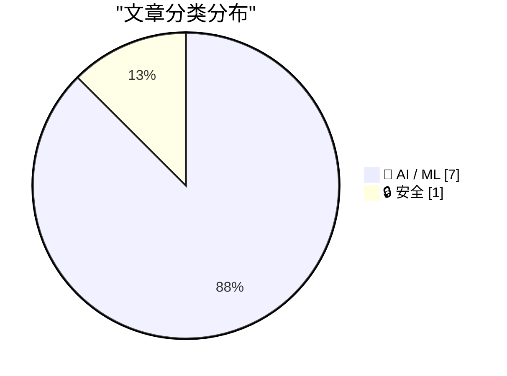
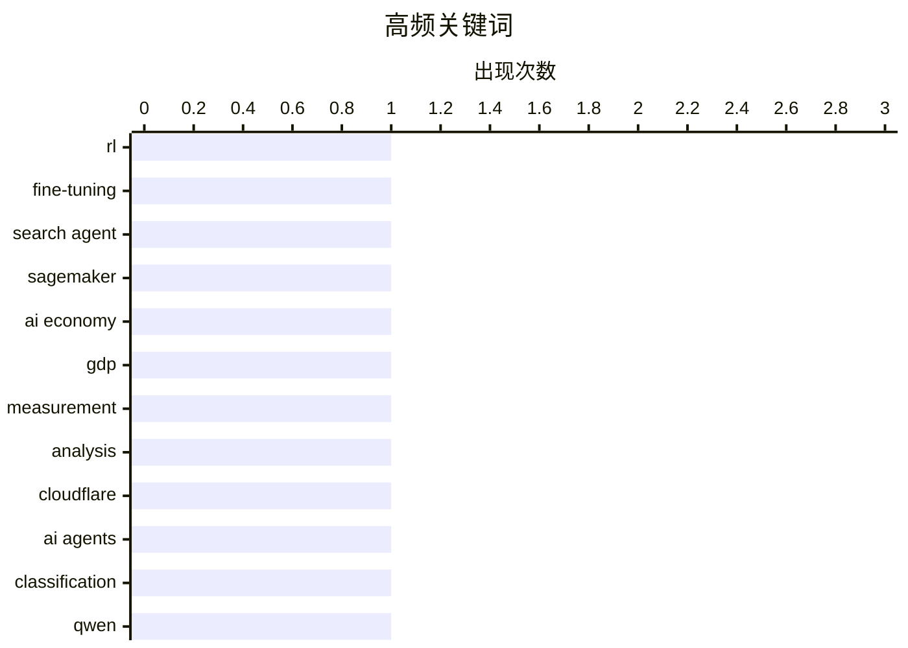

# 📰 AI 资讯每日精选 — 2026-10-03

> 汇聚 156+ 技术博客、X/Twitter、Hacker News、Reddit、Product Hunt、
> Lobste.rs、ClawFeed 日报及 GitHub Trending，经 AI 评分筛选。
>
> **本期内容**：🏆 今日必读 · 🌐 ClawFeed 日报 · 🔥 GitHub Trending · 📂 分类精选 · 📊 数据概览 · 🎯 项目相关情报

## 📝 今日看点

今日看点：技术圈的焦点正从“模型能不能做”转向“智能体如何可靠上岗”，低成本强化学习、毫秒级决策和系统级权限治理同步升温。AI 在结构化专业任务上已展现出超越人类的速度与准确率，但在开放场景中仍难摆脱漂移、幻觉和监督依赖，可靠性成为规模化落地的核心瓶颈。围绕这一落差，新的工程工作流、开源数据集与评测基准正在补位，安全与合规也被推到智能体应用的前置位置。简言之，智能体要真正进入生产，下一战不在参数规模，而在可控、可验、可治理。

---

## 🏆 今日必读

🥇 **在 Amazon SageMaker AI 上用多轮强化学习微调搜索智能体**

[Fine-tune a search agent with multi-turn RL on Amazon SageMaker AI](https://aws.amazon.com/blogs/machine-learning/fine-tune-a-search-agent-with-multi-turn-rl-on-amazon-sagemaker-ai/) — AWS Machine Learning Blog · 13 小时前 · 🤖 AI / ML · **一手来源**

> 文章介绍如何在 Amazon SageMaker AI 上，通过多轮强化学习（MTRL）微调一个由 LLM 驱动的搜索智能体。微调的目的是让小型搜索智能体学会使用你的工具和环境，从而以更低的延迟和成本获得接近前沿模型的可靠性。作者分享了在检索质量和可靠性方面实测到的提升。

💡 **为什么值得读**: 如果你关心如何用强化学习把搜索智能体调教到接近前沿模型的可靠性，同时降低延迟和成本，这篇来自 AWS 官方博客的实践值得一读。

🏷️ RL, fine-tuning, search agent, SageMaker

🥈 **付费内容：AI 如何改变了经济？**

[Premium: How Has AI Changed The Economy?](https://www.wheresyoured.at/premium-how-has-ai-changed-the-economy/) — wheresyoured.at · 10 小时前 · 🤖 AI / ML

> 文章围绕《华尔街日报》本周发布的一张关于 AI 可能占 GDP 比例的图表展开讨论。作者认为这张图更多是在搅浑水，而非真正说明问题，部分原因是其测算区间覆盖 2025 至 2032 年，其中六年属于预测。原文摘要在此处截断，未给出完整论证与结论。

💡 **为什么值得读**: 如果你对 AI 对经济的实际影响以及媒体如何呈现这类数据感兴趣，这篇对《华尔街日报》图表的批评性分析值得一读。

🏷️ AI economy, GDP, measurement, analysis

🥉 **Cloudflare 称其新模型 Clef 意味着 AI 智能体不再需要人类在环**

[Cloudflare says its new Clef model means humans no longer need to be in the loop for AI agents](https://the-decoder.com/cloudflare-says-its-new-clef-model-means-humans-no-longer-need-to-be-in-the-loop-for-ai-agents/) — The Decoder · 10 小时前 · 🤖 AI / ML · **二手来源**

> Cloudflare 推出 Clef 和 Clef-flash，对标 TypeSafe AI 的 Jev 决策模型。据称 Clef-flash 可在约 39 毫秒内完成分类，比 Jev 快十倍以上。两个模型均基于 Qwen 构建，采用 Apache 2.0 许可，设计目标是让 AI 智能体在不生成文本的情况下做出结构化决策。

💡 **为什么值得读**: 如果你关注 AI 智能体的决策基础设施与低延迟分类模型，这篇关于 Cloudflare 新模型及其与 Jev 对比的报道值得一读。

🏷️ Cloudflare, AI agents, classification, Qwen

4️⃣ **我开源了 30,000 对带多解码器验证与鲁棒性评分的二维码错觉图（可在 Hugging Face 免费用于 ControlNet / LoRA 训练）**

[[D] I open-sourced 30,000 paired QR-Code Illusions with multi-decoder verification & robustness scores on Hugging Face (Free for ControlNet / LoRA training)](https://www.reddit.com/r/StableDiffusion/comments/1wvsu0d/d_i_opensourced_30000_paired_qrcode_illusions/) — r/StableDiffusion · 16 小时前 · 🤖 AI / ML

> 作者在 Hugging Face 上开源了 30,000 对二维码错觉图数据集。该数据集包含多解码器验证和鲁棒性评分，可免费用于 ControlNet 或 LoRA 训练。

💡 **为什么值得读**: 如果你在训练 ControlNet 或 LoRA 做二维码错觉图生成，这个带验证与鲁棒性评分的大规模配对数据集可以直接拿来用。

🏷️ ControlNet, LoRA, dataset, QR-code

5️⃣ **漂移是 AI 视频的隐形杀手**

[Drift is the silent killer of AI video](https://www.reddit.com/r/StableDiffusion/comments/1wvwoxp/drift_is_the_silent_killer_of_ai_video/) — r/StableDiffusion · 13 小时前 · 🤖 AI / ML

> 作者指出，制作 AI 视频时最令人沮丧的不是生成质量差，而是漂移：画面在几秒后开始缓慢偏移，颜色变化、边缘模糊、物体变形，且片段越长越明显。作者使用 pixverse V6 拍摄连续镜头，感觉这一问题比之前有所改善，尤其在保持角色和场景一致性方面。

💡 **为什么值得读**: 如果你在做 AI 视频并苦恼于画面随时间漂移，这篇来自实践者的观察和 pixverse V6 的使用体验值得参考。

🏷️ AI video, drift, generation, quality

---

## 🌐 ClawFeed 日报精选

> 来源：[ClawFeed](https://clawfeed.kevinhe.io) — AI 驱动的多源新闻聚合

# 📅 ClawFeed 日报 | 2026-10-02 (SGT)

> 聚合自 3 期 4h digest（#1327 00:00, #1328 04:00, #1329 08:00）

---

## 🔥 当日全场最重要 5 条

1. **Claude Code Mods 正式发布** — @bcherny（Boris Cherny）宣布可通过 TypeScript 自定义 Claude Code 行为/UI/功能，Plugin 形式安装（/plugin），支持社区共享。**262K 浏览，179 转发**，当日最高热度。
   来源: https://x.com/bcherny/status/2105756563302723721

2. **DeepSeek Harness 桌面版发布（v0.2 preview）** — macOS + Windows，"Everything is a plugin" 理念。**561K 浏览**，首条推文即引爆。Agent harness 可扩展性成为行业共识。
   来源: https://x.com/DeepSeekHarness/status/2105330281389662575

3. **Griffin 通过视频图灵测试** — Tavus 发布首个 Human Interaction Model (HIM)，48% 真人对话者以为在和真人说话（此前 <3%），NVIDIA 全双工 AI 视频 benchmark 第一。@suwakopro 评价"比 Fable 还让我兴奋"。15K 浏览。
   来源: https://x.com/suwakopro/status/2105730329416011844

4. **Meta Muse 真实用户画像出人意料** — @AYi_AInotes 总结 Alexandr Wang 发现：用 Muse 最猛的是修水管的、开农场的、杂货店和小餐馆老板，上线两周 1/3 用户绑了商业账号，Meta 顺势推出 Muse for Small Business。15K→19K 浏览，跨两期持续发酵。
   来源: https://x.com/AYi_AInotes/status/2105666186520227886

5. **Anthropic 上线 Claude.dev 开发者站点** — 面向用 Claude 做开发的人，发布工程深度文章、Claude Code 和 API 指南。宝玉(@dotey)中文转发，76K 浏览。同日 @huxlab 揭秘 Claude Code「自学习 Agent 群」玩法（20K 浏览），Anthropic 开发者生态持续扩张。
   来源: https://x.com/dotey/status/2105431620769427549

---

## 📰 当日核心主题

### 🔧 Agent Harness / 可扩展 AI 工具链
Claude Code Mods（262K）+ DeepSeek Harness Desktop（561K）同日发布，"everything is a plugin" 理念趋同。Agent 工具链从"用就行"转向"可定制可组合"，Plugin 生态竞争开始。

### 🏗️ Agent Cloud Infra 融资潮
InstaCloud $8M seed（@hanghuang_ + 合伙人，两名大学生），做 agent-native serverless cloud。@yifanxu_ephai 连续两期引用，引发中美 VC 对 agent infra 态度差距讨论（54K 浏览跨期）。InsForge 同期 seed $8M。方向已被资本验证。

### 🎭 AI 拟人化突破
Griffin/Tavus HIM 通过视频图灵测试（48% 以为是真人），@suwakopro 评价超越 Fable。Meta Muse 在小企业场景爆发。AI 从工具向"像人一样交互"迈进。

### 📝 AI 时代的代码哲学
Uncle Bob（《Clean Code》作者）不再读代码——Clean Code 的目的是让代码退出注意力中心。@LinearUncle 用超级提示词让 Opus 5.5 画出项目架构地图（18K 浏览）。代码正在从"人写"到"人审"转变。

---

## 🔖 累计 Bookmark 精选

⚠️ **以下 4 组 bookmark 已连续 8+ 期标记未清除，建议 Kevin 处理：**
- @sama — Dots 官方发布（1.9M 浏览）
- @ManusAI — Manus 2.0（5.5M 浏览）
- @alexandr_wang — Muse 小企业版 + "Here's to the wanting"
- @indigox — DevDay 一图看懂

---

## 👀 推荐关注汇总

| 账号 | 理由 |
|------|------|
| @hanghuang_ (Hang Huang) | InstaCloud 创始人，agent-native serverless cloud $8M seed，连续两期出现 |
| @Red_Xiao_ (Red Xiao) | Manus AI Founder & CEO，20.9K followers，Agent 领域核心人物 |
| @ClaudeDevs | Claude Code 官方开发者账号，Mods/Plugin 生态核心信息源 |

---

## 💤 当日重复噪音模式

- **Bookmarks 僵尸标记**：sama/ManusAI/alexandr_wang/indigox 已连续 8+ 期未清除，每期都占位
- **InstaCloud 跨期重复**：@yifanxu_ephai 同一条推文（54K 浏览）连续 3 期出现
- **低质量 Following**：@Hill0100（零活跃）、@Tradermayne（纯 crypto meme）、@StartupWisdom_（纯名言搬运）、@LimestoneHQ/@mardehaym（互相引用偏营销）连续多期被标记
- **宝玉 Opus 5.5 视频话题**：连续第 4 期出现（77K→79K），进入长尾

---

*Generated from 4h digests #1327, #1328, #1329 | 2026-10-02 SGT*---

## 🔥 GitHub Trending

> 今日热门开源项目（全语言 + Python）

| # | 项目 | 描述 | ⭐ 总星 | 📈 今日 | 语言 |
|---|------|------|---------|---------|------|
| 1 | [DietrichGebert/ponytail](https://github.com/DietrichGebert/ponytail) 🤖 | Makes your AI agent think like the laziest senior dev in ... | 152.0k | +1435 | JavaScript |
| 2 | [mattpocock/skills](https://github.com/mattpocock/skills) | Skills for Real Engineers. Straight from my .agents direc... | 274.8k | +955 | Shell |
| 3 | [pbakaus/impeccable](https://github.com/pbakaus/impeccable) 🤖 | The design language that makes your AI harness better at ... | 74.4k | +722 | JavaScript |
| 4 | [Panniantong/Agent-Reach](https://github.com/Panniantong/Agent-Reach) 🤖 | Give your AI agent eyes to see the entire internet. Read ... | 88.9k | +696 | Python |
| 5 | [mvschwarz/openrig](https://github.com/mvschwarz/openrig) 🤖 | Build your own network of agents from Claude Code, Codex ... | 4.4k | +683 | TypeScript |
| 6 | [pablostanley/yoinks](https://github.com/pablostanley/yoinks) | yoink any video from your terminal. no shady ads. | 3.6k | +623 | TypeScript |
| 7 | [NVIDIA/OpenShell](https://github.com/NVIDIA/OpenShell) 🤖 | OpenShell is the safe, private runtime for autonomous AI ... | 14.5k | +594 | Rust |
| 8 | [heygen-com/hyperframes](https://github.com/heygen-com/hyperframes) | Write HTML. Render video. Built for agents. | 56.0k | +580 | TypeScript |
| 9 | [obra/superpowers](https://github.com/obra/superpowers) | An agentic skills framework & software development method... | 294.5k | +556 | Shell |
| 10 | [HunxByts/GhostTrack](https://github.com/HunxByts/GhostTrack) | Useful tool to track location or mobile number | 16.7k | +543 | Python |
| 11 | [mksglu/context-mode](https://github.com/mksglu/context-mode) 🤖 | Context window optimization for AI coding agents. Sandbox... | 25.1k | +282 | TypeScript |
| 12 | [ayghri/i-have-adhd](https://github.com/ayghri/i-have-adhd) 🤖 | A skill to stop your coding agent from burying the answer... | 53.0k | +276 | Python |
| 13 | [Friedrich-M/UniMate](https://github.com/Friedrich-M/UniMate) | [SIGGRAPH Asia 2026] UniMate: One Unified Model to Animat... | 1.2k | +248 | Python |
| 14 | [tile-ai/tilelang](https://github.com/tile-ai/tilelang) 🤖 | Domain-specific language designed to streamline the devel... | 8.3k | +244 | Python |
| 15 | [D4Vinci/Scrapling](https://github.com/D4Vinci/Scrapling) | 🕷️ An adaptive Web Scraping framework that handles every... | 85.3k | +241 | Python |

---

## 🤖 AI / ML

### 1. 在 Amazon SageMaker AI 上用多轮强化学习微调搜索智能体

[Fine-tune a search agent with multi-turn RL on Amazon SageMaker AI](https://aws.amazon.com/blogs/machine-learning/fine-tune-a-search-agent-with-multi-turn-rl-on-amazon-sagemaker-ai/) — **AWS Machine Learning Blog** · 13 小时前 · ⭐ 24/30 · **一手来源**

> 文章介绍如何在 Amazon SageMaker AI 上，通过多轮强化学习（MTRL）微调一个由 LLM 驱动的搜索智能体。微调的目的是让小型搜索智能体学会使用你的工具和环境，从而以更低的延迟和成本获得接近前沿模型的可靠性。作者分享了在检索质量和可靠性方面实测到的提升。

🏷️ RL, fine-tuning, search agent, SageMaker

---

### 2. 付费内容：AI 如何改变了经济？

[Premium: How Has AI Changed The Economy?](https://www.wheresyoured.at/premium-how-has-ai-changed-the-economy/) — **wheresyoured.at** · 10 小时前 · ⭐ 23/30

> 文章围绕《华尔街日报》本周发布的一张关于 AI 可能占 GDP 比例的图表展开讨论。作者认为这张图更多是在搅浑水，而非真正说明问题，部分原因是其测算区间覆盖 2025 至 2032 年，其中六年属于预测。原文摘要在此处截断，未给出完整论证与结论。

🏷️ AI economy, GDP, measurement, analysis

---

### 3. Cloudflare 称其新模型 Clef 意味着 AI 智能体不再需要人类在环

[Cloudflare says its new Clef model means humans no longer need to be in the loop for AI agents](https://the-decoder.com/cloudflare-says-its-new-clef-model-means-humans-no-longer-need-to-be-in-the-loop-for-ai-agents/) — **The Decoder** · 10 小时前 · ⭐ 23/30 · **二手来源**

> Cloudflare 推出 Clef 和 Clef-flash，对标 TypeSafe AI 的 Jev 决策模型。据称 Clef-flash 可在约 39 毫秒内完成分类，比 Jev 快十倍以上。两个模型均基于 Qwen 构建，采用 Apache 2.0 许可，设计目标是让 AI 智能体在不生成文本的情况下做出结构化决策。

🏷️ Cloudflare, AI agents, classification, Qwen

---

### 4. 我开源了 30,000 对带多解码器验证与鲁棒性评分的二维码错觉图（可在 Hugging Face 免费用于 ControlNet / LoRA 训练）

[[D] I open-sourced 30,000 paired QR-Code Illusions with multi-decoder verification & robustness scores on Hugging Face (Free for ControlNet / LoRA training)](https://www.reddit.com/r/StableDiffusion/comments/1wvsu0d/d_i_opensourced_30000_paired_qrcode_illusions/) — **r/StableDiffusion** · 16 小时前 · ⭐ 23/30

> 作者在 Hugging Face 上开源了 30,000 对二维码错觉图数据集。该数据集包含多解码器验证和鲁棒性评分，可免费用于 ControlNet 或 LoRA 训练。

🏷️ ControlNet, LoRA, dataset, QR-code

---

### 5. 漂移是 AI 视频的隐形杀手

[Drift is the silent killer of AI video](https://www.reddit.com/r/StableDiffusion/comments/1wvwoxp/drift_is_the_silent_killer_of_ai_video/) — **r/StableDiffusion** · 13 小时前 · ⭐ 22/30

> 作者指出，制作 AI 视频时最令人沮丧的不是生成质量差，而是漂移：画面在几秒后开始缓慢偏移，颜色变化、边缘模糊、物体变形，且片段越长越明显。作者使用 pixverse V6 拍摄连续镜头，感觉这一问题比之前有所改善，尤其在保持角色和场景一致性方面。

🏷️ AI video, drift, generation, quality

---

### 6. AI 在速度和准确率上击败持证会计师，但仍无法在无人监督下完成结账

[AI beats licensed accountants on speed and accuracy, but still can't close the books without supervision](https://the-decoder.com/ai-beats-licensed-accountants-on-speed-and-accuracy-but-still-cant-close-the-books-without-supervision/) — **The Decoder** · 17 小时前 · ⭐ 22/30 · **可追溯二手**

> 根据 Mercor 的一项研究，当前 AI 模型在结构化会计任务上的速度和准确率均已超过持证注册会计师，而 18 个月前它们还远远落后。但在要求更高的 APEX Benchmark 上，没有任何模型能完整完成所有任务。没有人类监督，AI 仍无法独立完成结账。

🏷️ AI benchmark, accounting, automation, CPA

---

### 7. 大脑三明治

[The Brain Sandwich](https://terriblesoftware.org/2026/10/02/the-brain-sandwich/) — **terriblesoftware.org** · 15 小时前 · ⭐ 20/30

> 文章提出“大脑三明治”这一实用的 AI 编程工作流：先理解问题，再让智能体协助，最后在分享之前验证并解释它的工作。

🏷️ AI coding, agent, workflow, verification

---

## 🔒 安全

### 8. 苹果将因智能体 AI 应用失控而进一步收紧 macOS 的完全磁盘访问权限

[★ Apple Is Going to Further Tighten the Screws on Full Disk Access on MacOS, in Response to Agentic AI Apps Running Amok](https://daringfireball.net/2026/10/apple_full_disk_access) — **daringfireball.net** · 8 小时前 · ⭐ 21/30

> 文章讨论苹果计划进一步收紧 macOS 上的完全磁盘访问权限，以应对智能体 AI 应用失控的问题。作者希望苹果能拿出一个方案，让懂行的资深用户仍可通过确认足够吓人的警告，把 Mac 置于与今天类似的状态。作者对此表示担忧。

🏷️ macOS, agentic AI, privacy, permissions

---

## 📊 数据概览

| 扫描源 | 抓取文章 | 时间范围 | 精选 |
|:---:|:---:|:---:|:---:|
| 101/156 | 5145 篇 → 70 篇 | 24h | **8 篇** |

### 分类分布



### 高频关键词



<details>
<summary>📈 纯文本关键词图（终端友好）</summary>

```
rl           │ ████████████████████ 1
fine-tuning  │ ████████████████████ 1
search agent │ ████████████████████ 1
sagemaker    │ ████████████████████ 1
ai economy   │ ████████████████████ 1
gdp          │ ████████████████████ 1
measurement  │ ████████████████████ 1
analysis     │ ████████████████████ 1
cloudflare   │ ████████████████████ 1
ai agents    │ ████████████████████ 1
```

</details>

### 🏷️ 话题标签

**rl**(1) · **fine-tuning**(1) · **search agent**(1) · sagemaker(1) · ai economy(1) · gdp(1) · measurement(1) · analysis(1) · cloudflare(1) · ai agents(1) · classification(1) · qwen(1) · controlnet(1) · lora(1) · dataset(1) · qr-code(1) · ai video(1) · drift(1) · generation(1) · quality(1)

---

## 🎯 项目相关情报

### Agent 基座安全与合规

> 暂无达到质量门槛的项目相关情报。

### 多 Agent 架构

> 暂无达到质量门槛的项目相关情报。

### ASR 与语音助手

> 暂无达到质量门槛的项目相关情报。

### 商品包装 OCR

> 暂无达到质量门槛的项目相关情报。

---

*生成于 2026-10-03 05:09 | 汇聚 156 个技术博客、X/Twitter、Hacker News、Reddit、Product Hunt、Lobste.rs、ClawFeed 日报及 GitHub Trending，经 AI 评分筛选出 Top 8 精华内容*
