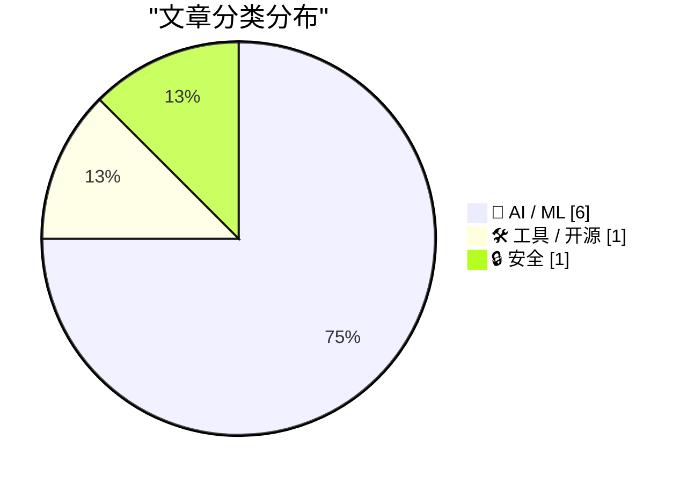
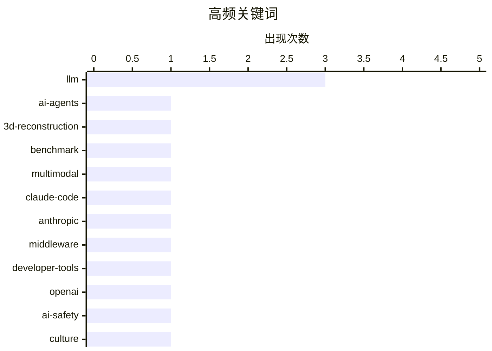

# 📰 AI 资讯每日精选 — 2026-10-04

> 汇聚 156+ 技术博客、X/Twitter、Hacker News、Reddit、Product Hunt、
> Lobste.rs、ClawFeed 日报及 GitHub Trending，经 AI 评分筛选。
>
> **本期内容**：🏆 今日必读 · 🌐 ClawFeed 日报 · 🔥 GitHub Trending · 📂 分类精选 · 📊 数据概览 · 🎯 项目相关情报

## 📝 今日看点

今日技术圈的核心线索，是 AI 智能体正从“能生成”迈向“可编辑、可协作”，但可靠性、评估与对齐仍未跟上，3D 场景重建等任务暴露出智能体“不知道自己做得对不对”的短板。与此同时，AI 编码工具开始走向开放可编程，把界面与行为交给开发者重塑，平台生态竞争升温。更值得注意的是，安全与治理正从边缘议题变成主线：从内部文化争议到 LLM 时代安全，再到“人工共生智能”和主权大模型，行业正在重新思考模型之外的规则、制度与协作网络。硬件侧，消费级 AI 生成的供电风险也提醒人们，热潮背后仍有现实工程代价。

---

## 🏆 今日必读

🥇 **AI 智能体能从照片构建 3D 场景，却不知道自己做得对不对**

[AI agents build 3D scenes from photos but have no idea if they got it right](https://the-decoder.com/ai-agents-build-3d-scenes-from-photos-but-have-no-idea-if-they-got-it-right/) — The Decoder · 21 小时前 · 🤖 AI / ML · **二手来源**

> 新方法 LEGO-Anything 可将单张照片转换为可编辑的 Blender 代码，从而生成 3D 场景。在配套基准测试中，GPT-6 Astra 以最高 53% 的重建准确率领先。所有受测智能体最大的共同短板是自我评估能力：它们判断自身几何准确度的表现与抛硬币无异。

💡 **为什么值得读**: 它揭示了一个被忽视的关键问题——AI 能生成 3D 场景，却几乎无法判断自己生成得对不对。

🏷️ AI-agents, 3D-reconstruction, benchmark, multimodal

🥈 **Claude Code 的新 Mods 系统让开发者从内部改写这款 AI 编码工具**

[Claude Code's new Mods system lets developers rewrite the AI coding tool from the inside](https://the-decoder.com/claude-codes-new-mods-system-lets-developers-rewrite-the-ai-coding-tool-from-the-inside/) — The Decoder · 22 小时前 · 🛠 工具 / 开源 · **二手来源**

> Anthropic 为 Claude Code 引入名为 Mods 的系统，本质上是直接运行在工具内部的中间件。开发者可用 JavaScript 或 TypeScript 重塑界面与行为，例如添加自定义面板、拦截工具调用或接入新命令。

💡 **为什么值得读**: 想深度定制 AI 编码工具工作流的开发者，可以借此了解 Claude Code 的可扩展边界。

🏷️ Claude-Code, Anthropic, middleware, developer-tools

🥉 **OpenAI 安全负责人离职，警告公司文化“已经崩坏”**

[OpenAI safety leader quits, warning AI company's culture is 'broken'](https://www.theguardian.com/technology/2026/oct/03/openai-safety-leader-quits-warning-ai-companys-culture-is-broken) — Hacker News Best · 7 小时前 · 🤖 AI / ML

> 据《卫报》报道，OpenAI 一名安全负责人已离职，并警告该公司的文化“已经崩坏”。该消息在 Hacker News 上获得 256 点关注。报道将离职与对内部文化的批评直接关联。

💡 **为什么值得读**: 来自 OpenAI 内部安全岗位的离职与公开批评，是观察该公司治理与安全取向的重要信号。

🏷️ OpenAI, AI-safety, culture, resignation

4️⃣ **Aleph Alpha Kolibri：主权德国大模型是如何运作的**

[Aleph Alpha Kolibri: How the sovereign German LLM works](https://tej.as/blog/aleph-alpha-kolibri) — Hacker News Best · 18 小时前 · 🤖 AI / ML

> 文章介绍 Aleph Alpha 推出的 Kolibri 模型，聚焦其作为“主权德国大模型”的技术实现方式。内容围绕该模型如何运作展开，并关联 Aleph Alpha 官方博客的发布说明。该条目在 Hacker News 上获得 410 点关注。

💡 **为什么值得读**: 对欧洲主权 AI 与本土大模型技术路线感兴趣的读者，可借此了解德国方案的具体做法。

🏷️ LLM, Aleph Alpha, sovereign AI, Kolibri

5️⃣ **如果你最近刚开始做 AI 生成，请注意：我的 RTX 4090 供电接口仅一个月就熔化了**

[If you recently started AI generation, be aware of this: my RTX 4090 power connector melted after just one month.](https://www.reddit.com/r/StableDiffusion/comments/1wwtbdg/if_you_recently_started_ai_generation_be_aware_of/) — r/StableDiffusion · 11 小时前 · 🤖 AI / ML

> 一位用户发帖警告，其 RTX 4090 的供电接口在使用仅一个月后发生熔化。帖子面向近期开始进行 AI 生成的用户，提醒注意该硬件风险。内容来自 r/StableDiffusion 社区分享。

💡 **为什么值得读**: 正在用高端显卡跑 AI 生成的用户，值得看一眼这个真实的硬件损坏案例。

🏷️ RTX 4090, hardware, AI generation, power connector

---

## 🌐 ClawFeed 日报精选

> 来源：[ClawFeed](https://clawfeed.kevinhe.io) — AI 驱动的多源新闻聚合

# 📅 ClawFeed 日报 | 2026-10-03 (SGT)

> 聚合自 5 期 4h digest（#1332 00:00, #1333 04:00, #1334 08:00, #1335 12:00, #1336 16:00）

---

## 🔥 当日全场最重要 5 条

1. **Anthropic IPO 时间表曝光（⚠️ 未经公司确认）**：早间先有匿名知情人士爆料，说 Anthropic 最早 11 月中旬启动 IPO，10/14 在旧金山总部见潜在投资者，目标感恩节（11/26）前挂牌，部分投资者认为合理估值在 1.8 万亿到 2 万亿美元之间。午后彭博跟进，称路演最快可能在 11/9 当周开始，具体日期未定。如果成行，AI 公司估值会第一次有公开市场的直接锚点。
   来源: https://x.com/ohxiyu/status/2106165030714560609 ｜ https://x.com/OliverYeung6/status/2106293181562183938

2. **Anthropic 拿出 $100M 办 Claude Frontier Academy**：目标是 2027 年底前培养 10,000 名 "Frontier Deployed Engineers"，首批学员来自 Accenture、Bain、Capgemini、Deloitte、McKinsey、Morgan Stanley。@levie 同日也说，他接触的大企业正在把内部 FDE 派到各个部门。FDE 模式正在成为企业落地 AI 的标准做法。
   来源: https://x.com/mardehaym/status/2106140196941279601 ｜ https://x.com/levie/status/2105695329513504976

3. **微软 Copilot 大改版，加入常驻 agent「Autopilot」**：Word、Excel、PowerPoint、聊天和写代码合进一个应用，给 Autopilot 一个目标，它就在后台一直干活（Every 的标题是 "Copilot Gets a Seat in the Org Chart"）。同一天还有几件相关的事：OpenDots 开源（可自托管的全天在线 AI coworker），Cua Spaces 在本机开一个真实桌面给 agent 用。「一直在线的 agent」这个品类一天之内多了好几个玩家。
   来源: https://x.com/every/status/2106330419927093558 ｜ https://x.com/DavidOndrej1/status/2106160241725649103

4. **AI 做会计已经超过持证会计师**：Mercor 的研究显示，在四项月末结账任务上，AI 的表现超过了 12 名持证 CPA。另一项研究发现，18 个月前最强的模型在会计任务上只有普通会计约 37% 的得分，现在已经能轻松完成，研究方说结果"惊人到一度考虑不发表"，Elon 转发时称之为 "Super Intelligence"。专业服务类的知识工作正在被一项一项攻破。
   来源: https://x.com/mardehaym/status/2106111216439718355 ｜ https://x.com/BrendanFoody/status/2106212431592894926

5. **Supabase 融资 $150M，估值 $10.65B**：YC 官宣。超过 1300 万开发者用 Supabase，每月新增 100 万以上用户、400 万以上数据库。凌晨的 Supabase Select 上还连发了一批面向 agent 的基建：Declarative schemas、Supabase compute、Logs Query MCP、Scoped PATs，以及给 Claude Code 用的 MCP elicitations。AI coding 带来的新应用爆发，直接反映在后端的增长曲线上。
   来源: https://x.com/ycombinator/status/2106106946503971236 ｜ https://x.com/DavidOndrej1/status/2106094242216960099

**次重要（备选）**
- Blast 宣布关停 L2：运营成本长期高于链上收入。DeFiLlama 数据显示关停前 24h 收入只有 $124，而 Sonic、Scroll、Berachain 等链还更低，公链洗牌开始。https://x.com/blast/status/2106032805280891073
- ChatGPT Finances 向美国 Free 和 Go 用户开放，通过 Plaid 和 Experian 连接银行和征信账户。https://x.com/ChatGPT/status/2106083592522932320
- Sam Altman 称 Cerebras 是"亲密伙伴"，双方在推理速度上深度合作。Cerebras CEO 讲晶圆级芯片推理快约 2500 倍的视频全天都在传。https://x.com/sama/status/2106147184693620924
- NerfBench：Opus 5.5 已经跌到发布时得分的 94.2%，Sonnet 5.5 和 GPT-6.1 Sol 仍在 100% 以上。https://x.com/RoundtableSpace/status/2106168602667679911
- X「Xpass」订阅爆料（⚠️ 未官宣）：把 X、Grok、Cursor、Grok Bot 打包，分 $8 / $30 / $100 三档。https://x.com/vikingmute/status/2106283728351973504
- 传阿里、DeepSeek 等被要求改用国产显卡（⚠️ 一手聊天转述，无官方确认）。https://x.com/NFTCPS/status/2106216669274320907

---

## 📰 当日核心主题

### 🏢 Anthropic 资本和企业化齐头并进
早间的 IPO 爆料、午后彭博的路演时间表，加上 $100M 的 Frontier Academy，Anthropic 一天之内贯穿了 3 期 digest。一边在为上市铺路，一边在用咨询公司和投行的渠道把 Claude 推进企业。相关的还有：NerfBench 显示 Opus 5.5 被"降智"的证据在累积，Fable 5.5 尚未官宣，内测作品已经在流传（@GoSailGlobal 收录了 33 个视频）。

### 🤖 常驻 agent 和 computer use 成了标配
微软 Copilot Autopilot、OpenDots 开源、Cua Spaces、Cline Desktop Connectors（一键接入 Gmail、Slack、Linear、Notion）、Muse Gadgets 和 Muse Home Link 硬件同一天出现。同时反方声音也来了：@madhav1 问「为什么所有 agent 演示都是订机票？」，有 3.7 万浏览；@JakeBlockchain 则说 Dots "出乎意料地用得很多"。产品已经到了"日常到底拿它干什么"的阶段。
来源: https://x.com/madhav1/status/2106234585923440840 ｜ https://x.com/JakeBlockchain/status/2106232109212033310

### 🧩 Claude Code Mods 和 Skill 生态继续扩张
Lydia Hallie、Addy Osmani 发了讲解和视频，官方插件 "You should Know" 上线（`/plugin enable cc-plugin-you-should-know@builtin`），社区有 image-viewer 等 mod。Vercel CEO @rauchg 发布了他的第一个公开 skill，skill 开始成为个人经验的分发格式。也有反对声音：@HamelHusain 批评官方演示是 "visual slop"。
来源: https://x.com/addyosmani/status/2106288676796055820 ｜ https://x.com/andrewqu/status/2106222760603324869 ｜ https://x.com/HamelHusain/status/2106216683585294741

### 💰 企业开始算 AI 的账
Warp 测量、跑 benchmark 再按任务路由模型，30 天内把每个 PR 的成本从 $71 降到 $20。Factory 推出按模型、按用户拆账的 Analytics。@mardehaym 观察到企业不再无上限地给 API 预算，开始要求按项目核算。另外，DeepSeek V4.1 Flash 定价 $0.14/1M 输入，兼容 Anthropic 接口，便宜的模型正在加剧路由竞争。
来源: https://x.com/zachlloydtweets/status/2106162147390894352 ｜ https://x.com/mardehaym/status/2106315846884688298 ｜ https://x.com/runinfrai/status/2106276675642347633

### ⚡ 算力和推理芯片
Cerebras 和 OpenAI 的合作，Elon 说 Terafab 目标是每年 1 TW 算力（"量变本身就是质变"），DGX Spark 出了 64GB 版本，Epoch 按 HBM 出货量估算全球能支撑的并发 agent 数量，加上上面那条国产卡传闻。

### ⛓️ 加密：公链出清 + agent 金融
Blast 关停，DeFiLlama 显示一批明星链收入极低。agent 金融的叙事同时升温：Base 上的 AiFi / Butler、Agentics 用交易记录给 agent 做信用借贷、Yat Siu 说"钱包就是 agent 的银行账户"、Robinhood 计划股票 24/7 交易。

### ⚠️ 中文开发圈的抄袭争议
@happycat_wang 指控有人把他的开源项目改名重发，称 76.8% 的代码一字不差。目前只有指控方的说法，对方还没回应。
来源: https://x.com/GoSailGlobal/status/2106343141997695317

---

## 🔖 累计 Bookmark 精选

⚠️ **18 条 bookmark 全天没有变化，前 4 组已经连续十几期没清，建议 Kevin 集中处理一次：**
- @sama — Dots 发布；@ManusAI — Manus 2.0；@alexandr_wang — Muse for Small Business；@indigox — DevDay 一图看懂
- @GitHub_Daily — jev-ultrafast；@SUOHA_AI — Browser Use 接 JEV 测评；@tlxue — Rene；@levie — agentic workload 需要重估

**今天重新浮上来、值得重读的：**
- @trq212 — Claude 5 时代怎么写 system prompt、skills 和 CLAUDE.md（删掉约 80% 的 system prompt），和我们自己维护 prompt / skill 直接相关。https://x.com/trq212/status/2080710971228918066
- @BruceGuai — Matrix「Agent 公司 OS」：按职责拆分 agent、可问责，和我们多 agent 协作的思路相关。https://x.com/BruceGuai/status/2070130243059495142
- @AGTPinsights — Assistant Benchmark：71 个 AI 个人助理在 15 个维度上的排名。https://x.com/AGTPinsights/status/2099783676661751974
- @xiaohu — @cloudflare/computer，给每个 agent 配一台云端电脑。https://x.com/xiaohu/status/2084549349997150643
- 另有 @pitdesi Instinct、@Tao100086 36 篇经典 AI 论文、@guruchahal AI 渗透率 <1%、@AndrewYNg AI Engineering Skills Map、@mardehaym Five Stages、@LimestoneHQ AI-Native 方法论

---

## 👀 推荐关注汇总（已去重）

| 账号 | 理由 |
|------|------|
| @zachlloydtweets (Zach Lloyd) | Warp 创始人，agent 成本工程的一手数据 |
| @trycua (Cua) | computer-use agent 基础设施（Cua Driver / Spaces） |
| @jarrodwatts (Jarrod Watts) | 持续开源 Claude Code mod 和 agent 交易系统 |
| @andrewqu (Andrew Qu) | 跟踪 skills.sh 和 skill 生态 |
| @lydiahallie (Lydia Hallie) | Claude Code Mods / plugin 一线讲解 |
| @AndrewCurran_ (Andrew Curran) | AI 研究进展的一手搬运（会计研究来源） |
| @xuanphinguyen (Xuan Phi Nguyen) | 刚加入 Prime Intellect 做开源模型前沿研究 |
| @hammer_mt (Mike Taylor) | 用 Fable 5.1 搭生成式 agent 村庄，偏实操 |
| @vikingmute (Viking) | 中文圈 AI 产品和订阅动态整理 |
| @OliverYeung6 (Oli.) | AI 公司资本市场动态的中文搬运 |

提醒：以上都没有逐一核实是否已经关注，操作前请先在 Following 里搜一下。

**建议取关（全天结论没变）**：@HeXiaobo（2018 年后不再活跃）、@0xJasonBateman（近 6 个月没发推，内容不相关）、@Hill0100（零推文）、@StartupWisdom_（名言搬运）。@caterpillarous 继续观察。

---

## 💤 当日重复噪音模式

- **Bookmark 僵尸占位**：5 期都在重复列同一批 18 条 bookmark，占了每期篇幅的一大块。清掉之后 digest 会干净很多。
- **取关建议原样重复**：followingProfiles 全天都是同一批 24 个账号，每期结论一样，抽样没有轮换。
- **币圈拉新 / 喊单 / 抽奖**：邀请码（Arcus、OKX、Muse 提示词）、小盘币喊单（$REPOPAD、$BEM）、Frontier Traders 抽奖、Primus 项目推广，每期都有好几条。
- **@mardehaym / @LimestoneHQ / @rwayne 的营销内容**：偶尔有好料（FDE 消息、企业预算观察），但大部分是导流和推广。
- **无信息量短帖和生活照**：健身照、钓鱼、国足吐槽、鸡汤，以及美国选举政治内容。
- **没有来源的传闻**：例如 @Anbzydd520「我孙哥被枪击了？」，⚠️ 只有一条无来源的提问帖，不当新闻处理。
- **周六傍晚信息量明显下降**：16:00–20:00 这一期 feed 一半是币圈活动和闲聊。

---
— Lisa
---

## 🔥 GitHub Trending

> 今日热门开源项目（全语言 + Python）

| # | 项目 | 描述 | ⭐ 总星 | 📈 今日 | 语言 |
|---|------|------|---------|---------|------|
| 1 | [Panniantong/Agent-Reach](https://github.com/Panniantong/Agent-Reach) 🤖 | Give your AI agent eyes to see the entire internet. Read ... | 90.0k | +1696 | Python |
| 2 | [DietrichGebert/ponytail](https://github.com/DietrichGebert/ponytail) 🤖 | Makes your AI agent think like the laziest senior dev in ... | 153.7k | +1281 | JavaScript |
| 3 | [affaan-m/ECC](https://github.com/affaan-m/ECC) 🤖 | The agent harness performance optimization system. Skills... | 272.4k | +897 | JavaScript |
| 4 | [mattpocock/skills](https://github.com/mattpocock/skills) | Skills for Real Engineers. Straight from my .agents direc... | 275.5k | +751 | Shell |
| 5 | [pbakaus/impeccable](https://github.com/pbakaus/impeccable) 🤖 | The design language that makes your AI harness better at ... | 75.5k | +699 | JavaScript |
| 6 | [obra/superpowers](https://github.com/obra/superpowers) | An agentic skills framework & software development method... | 295.0k | +577 | Shell |
| 7 | [JuliusBrussee/caveman](https://github.com/JuliusBrussee/caveman) | 🪨 why use many token when few token do trick. Viral skil... | 109.6k | +507 | Go |
| 8 | [earendil-works/pi](https://github.com/earendil-works/pi) 🤖 | AI agent toolkit: unified LLM API, agent loop, TUI, codin... | 112.2k | +408 | TypeScript |
| 9 | [Effect-TS/effect](https://github.com/Effect-TS/effect) | Build production-ready applications in TypeScript | 16.9k | +302 | TypeScript |
| 10 | [calesthio/OpenMontage](https://github.com/calesthio/OpenMontage) 🤖 | World's first open-source, agentic video production syste... | 62.7k | +292 | Python |
| 11 | [p-e-w/heretic](https://github.com/p-e-w/heretic) | Fully automatic censorship removal for language models | 33.1k | +257 | Python |
| 12 | [mksglu/context-mode](https://github.com/mksglu/context-mode) 🤖 | Context window optimization for AI coding agents. Sandbox... | 25.3k | +256 | TypeScript |
| 13 | [pingdotgg/t3code](https://github.com/pingdotgg/t3code) |  | 24.8k | +252 | TypeScript |
| 14 | [addyosmani/agent-skills](https://github.com/addyosmani/agent-skills) 🤖 | Production-grade engineering skills for AI coding agents. | 100.9k | +252 | JavaScript |
| 15 | [OpenCut-app/OpenCut](https://github.com/OpenCut-app/OpenCut) | The open-source CapCut alternative | 91.7k | +232 | TypeScript |

---

## 🤖 AI / ML

### 1. AI 智能体能从照片构建 3D 场景，却不知道自己做得对不对

[AI agents build 3D scenes from photos but have no idea if they got it right](https://the-decoder.com/ai-agents-build-3d-scenes-from-photos-but-have-no-idea-if-they-got-it-right/) — **The Decoder** · 21 小时前 · ⭐ 24/30 · **二手来源**

> 新方法 LEGO-Anything 可将单张照片转换为可编辑的 Blender 代码，从而生成 3D 场景。在配套基准测试中，GPT-6 Astra 以最高 53% 的重建准确率领先。所有受测智能体最大的共同短板是自我评估能力：它们判断自身几何准确度的表现与抛硬币无异。

🏷️ AI-agents, 3D-reconstruction, benchmark, multimodal

---

### 2. OpenAI 安全负责人离职，警告公司文化“已经崩坏”

[OpenAI safety leader quits, warning AI company's culture is 'broken'](https://www.theguardian.com/technology/2026/oct/03/openai-safety-leader-quits-warning-ai-companys-culture-is-broken) — **Hacker News Best** · 7 小时前 · ⭐ 22/30

> 据《卫报》报道，OpenAI 一名安全负责人已离职，并警告该公司的文化“已经崩坏”。该消息在 Hacker News 上获得 256 点关注。报道将离职与对内部文化的批评直接关联。

🏷️ OpenAI, AI-safety, culture, resignation

---

### 3. Aleph Alpha Kolibri：主权德国大模型是如何运作的

[Aleph Alpha Kolibri: How the sovereign German LLM works](https://tej.as/blog/aleph-alpha-kolibri) — **Hacker News Best** · 18 小时前 · ⭐ 22/30

> 文章介绍 Aleph Alpha 推出的 Kolibri 模型，聚焦其作为“主权德国大模型”的技术实现方式。内容围绕该模型如何运作展开，并关联 Aleph Alpha 官方博客的发布说明。该条目在 Hacker News 上获得 410 点关注。

🏷️ LLM, Aleph Alpha, sovereign AI, Kolibri

---

### 4. 如果你最近刚开始做 AI 生成，请注意：我的 RTX 4090 供电接口仅一个月就熔化了

[If you recently started AI generation, be aware of this: my RTX 4090 power connector melted after just one month.](https://www.reddit.com/r/StableDiffusion/comments/1wwtbdg/if_you_recently_started_ai_generation_be_aware_of/) — **r/StableDiffusion** · 11 小时前 · ⭐ 20/30

> 一位用户发帖警告，其 RTX 4090 的供电接口在使用仅一个月后发生熔化。帖子面向近期开始进行 AI 生成的用户，提醒注意该硬件风险。内容来自 r/StableDiffusion 社区分享。

🏷️ RTX 4090, hardware, AI generation, power connector

---

### 5. 一个用于 YuE2 的元提示词

[A Meta-Prompt for YuE2](https://www.reddit.com/r/StableDiffusion/comments/1wwjm6g/a_metaprompt_for_yue2/) — **r/StableDiffusion** · 19 小时前 · ⭐ 16/30

> 作者分享了一个用于生成 YuE2 提示词的元提示词，可复制粘贴到具备联网搜索能力的 LLM 中使用，作者本人主要使用 ChatGPT。为做测试，作者用它生成了一首关于邻居修剪树木的 psychobilly 风格歌曲，参数为最大时长 150、CFG 2、16 步。

🏷️ meta-prompt, YuE2, LLM, prompt generation

---

### 6. Deepmind 研究人员提出“人工共生智能”作为奇点的替代方案

[Deepmind researchers propose "Artificial Symbiotic Intelligence" as an alternative to the singularity](https://the-decoder.com/deepmind-researchers-propose-artificial-symbiotic-intelligence-as-an-alternative-to-the-singularity/) — **The Decoder** · 19 小时前 · ⭐ 23/30 · **可追溯二手**

> Deepmind 研究所的研究人员认为，通用人工智能不会以单一超级模型的形式出现，而是由协作的智能体与人类组成的网络。他们主张，最重要的不是模型规模，而是规范这些智能体与人类如何协同工作的规则与制度。这一观点将“人工共生智能”作为奇点叙事的替代方案。

🏷️ DeepMind, AGI, multi-agent, governance

---

## 🛠 工具 / 开源

### 7. Claude Code 的新 Mods 系统让开发者从内部改写这款 AI 编码工具

[Claude Code's new Mods system lets developers rewrite the AI coding tool from the inside](https://the-decoder.com/claude-codes-new-mods-system-lets-developers-rewrite-the-ai-coding-tool-from-the-inside/) — **The Decoder** · 22 小时前 · ⭐ 24/30 · **二手来源**

> Anthropic 为 Claude Code 引入名为 Mods 的系统，本质上是直接运行在工具内部的中间件。开发者可用 JavaScript 或 TypeScript 重塑界面与行为，例如添加自定义面板、拦截工具调用或接入新命令。

🏷️ Claude-Code, Anthropic, middleware, developer-tools

---

## 🔒 安全

### 8. LLM 时代的安全

[Security in the LLM Age](https://www.youtube.com/watch?v=NnV_cWeoo5Q) — **Lobste.rs** · 17 小时前 · ⭐ 21/30

> 这是一场以“LLM 时代的安全”为主题的演讲视频，发布在 Lobste.rs 上并附有讨论链接。内容聚焦大语言模型普及背景下的安全问题。

🏷️ LLM, security, AI safety

---

## 📊 数据概览

| 扫描源 | 抓取文章 | 时间范围 | 精选 |
|:---:|:---:|:---:|:---:|
| 100/156 | 5121 篇 → 71 篇 | 24h | **8 篇** |

### 分类分布



### 高频关键词



<details>
<summary>📈 纯文本关键词图（终端友好）</summary>

```
llm               │ ████████████████████ 3
ai-agents         │ ███████░░░░░░░░░░░░░ 1
3d-reconstruction │ ███████░░░░░░░░░░░░░ 1
benchmark         │ ███████░░░░░░░░░░░░░ 1
multimodal        │ ███████░░░░░░░░░░░░░ 1
claude-code       │ ███████░░░░░░░░░░░░░ 1
anthropic         │ ███████░░░░░░░░░░░░░ 1
middleware        │ ███████░░░░░░░░░░░░░ 1
developer-tools   │ ███████░░░░░░░░░░░░░ 1
openai            │ ███████░░░░░░░░░░░░░ 1
```

</details>

### 🏷️ 话题标签

**llm**(3) · **ai-agents**(1) · **3d-reconstruction**(1) · benchmark(1) · multimodal(1) · claude-code(1) · anthropic(1) · middleware(1) · developer-tools(1) · openai(1) · ai-safety(1) · culture(1) · resignation(1) · aleph alpha(1) · sovereign ai(1) · kolibri(1) · rtx 4090(1) · hardware(1) · ai generation(1) · power connector(1)

---

## 🎯 项目相关情报

### Agent 基座安全与合规

> 暂无达到质量门槛的项目相关情报。

### 多 Agent 架构

> 暂无达到质量门槛的项目相关情报。

### ASR 与语音助手

> 暂无达到质量门槛的项目相关情报。

### 商品包装 OCR

> 暂无达到质量门槛的项目相关情报。

---

*生成于 2026-10-04 05:43 | 汇聚 156 个技术博客、X/Twitter、Hacker News、Reddit、Product Hunt、Lobste.rs、ClawFeed 日报及 GitHub Trending，经 AI 评分筛选出 Top 8 精华内容*
