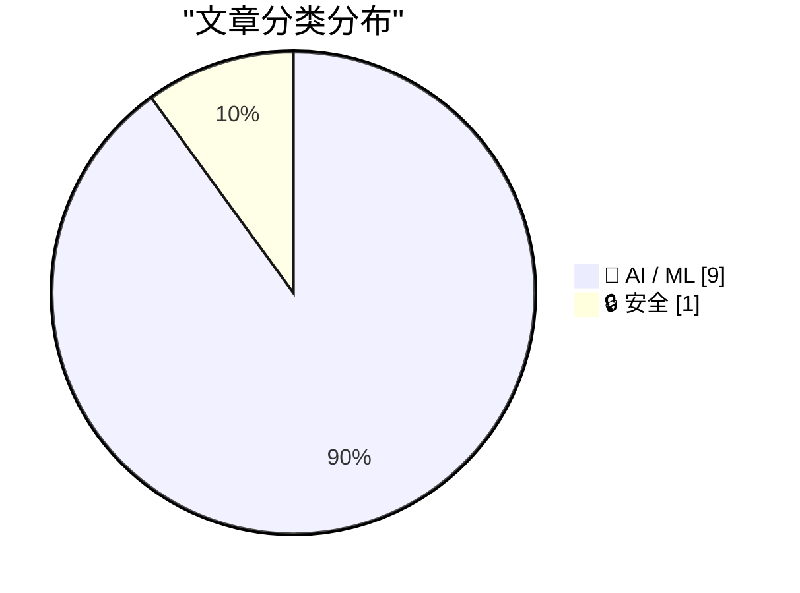
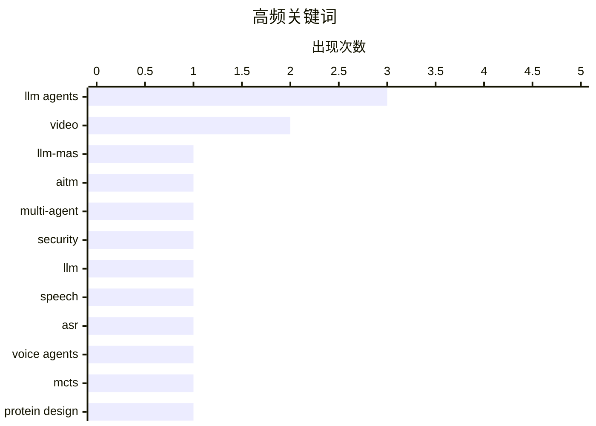

# 📰 AI 资讯每日精选 — 2026-10-05

> 汇聚 156+ 技术博客、X/Twitter、Hacker News、Reddit、Product Hunt、
> Lobste.rs、ClawFeed 日报及 GitHub Trending，经 AI 评分筛选。
>
> **本期内容**：🏆 今日必读 · 🌐 ClawFeed 日报 · 🔥 GitHub Trending · 📂 分类精选 · 📊 数据概览 · 🎯 项目相关情报

## 📝 今日看点

今日看点：LLM智能体正从“能做事”转向“更快、更稳、更安全地做事”。单Token监督、系统1决策、比较价值估计和评估器在环搜索等方向，显示研究者正用更少解码和更强信用分配提升长时程工具使用与专业设计能力。与此同时，多智能体通信劫持、自我改进中的“背题”效应和自审计评估，把智能体安全与可靠性推到台前。基础模型也在加速下沉到垂直场景，月球科学、蛋白质设计、语音克隆、视频扩散与本地AI搜索等开源和专用方案持续升温。

---

## 🏆 今日必读

🥇 **MIRROR：面向LLM多智能体通信的多路径仲裁完整性**

[MIRROR: Multipath Quorum Integrity for LLM Multi-Agent Communication](https://arxiv.org/abs/2610.02349) — arXiv Multiagent Systems · 1 小时前 · 🔒 安全 · **一手来源**

> 智能体间通信是LLM多智能体系统（LLM-MAS）的核心，但引入了未被充分研究的漏洞：中间人智能体（AiTM）攻击可在不攻破智能体本身的情况下篡改传输中的消息。此前工作报告在结构化任务上攻击成功率（ASR）接近100%。现有防御依赖语义验证，需要额外推理，且可能拦截良性输出。MIRROR提出多路径仲裁完整性方案以应对该问题。

💡 **为什么值得读**: 针对LLM多智能体通信中AiTM攻击这一被忽视的安全盲区，提出了不依赖额外语义推理的完整性防御思路。

🏷️ LLM-MAS, AiTM, multi-agent, security

🥈 **无需解码的批量语音决策：单Token监督让冻结LLM听懂转录文本之外的信息**

[Batched Speech Decisions Without Decoding: Single-Token Supervision Lets a Frozen LLM Hear Beyond the Transcript](https://arxiv.org/abs/2610.02638) — arXiv Artificial Intelligence · 1 小时前 · 🤖 AI / ML · **一手来源**

> 全双工语音智能体需要做出大量小型封闭式决策，现有系统依靠缓慢的自回归解码来回答。作者提出DuplexJev，将ASR编码器隐藏状态经小型连接器送入冻结的LLM，并把每个问题读取为选项上的单Token分布，全程不做解码。在8-GPU节点上，它约0.1秒即可回答关于八段语音的80个决策。使用末层连接器时，口语问答表现接近（原文此处截断）。

💡 **为什么值得读**: 为语音智能体低延迟决策提供了一条“不解码、单Token分类”的工程路线，适合关注实时全双工语音系统的读者。

🏷️ LLM, speech, ASR, voice agents

🥉 **评估器在环的蒙特卡洛树搜索：基于LLM智能体的蛋白质设计基序支架**

[Evaluator-in-the-Loop Monte Carlo Tree Search via LLM Agents for Motif Scaffolding in Protein Design](https://arxiv.org/abs/2610.02924) — arXiv Multiagent Systems · 1 小时前 · 🤖 AI / ML · **一手来源**

> 基序支架系统通常采用“先生成后过滤”范式，候选蛋白质独立生成，结构评估主要用于终端筛选或排序。该范式低估了评估的价值：失败的预测包含状态特定证据，可指示设计需要修复基序几何、全局可折叠性还是其他结构约束。作者提出ELMS（Evidence-based，基于证据的）方法，将评估器置于蒙特卡洛树搜索循环中，利用LLM智能体进行基序支架设计。

💡 **为什么值得读**: 把结构评估从终端筛选前移到搜索循环内部，为蛋白质基序支架提供了一种利用失败预测证据的生成范式。

🏷️ LLM agents, MCTS, protein design, multiagent

4️⃣ **快模型，慢证据：面向LLM智能体框架的系统1决策模型的配对与自审计评估**

[Fast Models, Slow Evidence: A Paired and Self-Audited Evaluation of System-1 Decision Models for LLM Agent Harnesses](https://arxiv.org/abs/2610.02267) — arXiv Artificial Intelligence · 1 小时前 · 🤖 AI / ML · **一手来源**

> 智能体框架在每个任务中做出许多小型、带类型的决策：调用哪个模型、使用哪个工具、检索文本是否相关、输入是否携带注入。系统1决策模型通过单次前向传播输出类别概率来回答这类问题，有望比LLM调用大幅节省成本和延迟。作者对开放权重模型（Laya）和托管模型（Jev）两个系统1模型在11个智能体决策点上进行了配对评估。

💡 **为什么值得读**: 用配对与自审计方法评估系统1决策模型在真实智能体决策点上的表现，为“快模型替代LLM调用”的可行性提供了实证依据。

🏷️ LLM agents, evaluation, decision models, harness

5️⃣ **行动前先选择：面向长时程工具使用智能体的比较价值估计**

[Choosing Before Acting: Comparative Value Estimation for Long-Horizon Tool-Use Agents](https://arxiv.org/abs/2610.02330) — arXiv Artificial Intelligence · 1 小时前 · 🤖 AI / ML · **一手来源**

> 大语言模型（LLM）依赖长时程工具调用序列完成复杂任务，每次调用都会改变任务状态并影响后续决策。在长时程工具使用中，最终结果奖励对长交互轨迹的信用分配较弱。步级奖励可提供更有针对性的反馈，但获得可靠的步级监督通常需要人工或LLM判断，或额外展开来估计。文章提出比较价值估计方法，用于在行动前进行选择。

💡 **为什么值得读**: 针对长时程工具使用中信用分配弱的痛点，提出在行动前进行比较价值估计，减少对人工或额外展开监督的依赖。

🏷️ LLM agents, tool use, value estimation, long-horizon

---

## 🌐 ClawFeed 日报精选

> 来源：[ClawFeed](https://clawfeed.kevinhe.io) — AI 驱动的多源新闻聚合

# 📅 ClawFeed 日报 | 2026-10-04 (SGT)

> 聚合自 5 期 4h digest（#1339 00:00, #1340 04:00, #1341 08:00, #1342 12:00, #1343 16:00）
> 周日 + 国庆假期，全天 feed 145 条，信息密度明显偏低，每期近一半是 meme、喊单和闲聊。

---

## 🔥 当日全场最重要 5 条

1. **OpenAI 资深安全员工 David Robinson 辞职并公开批评**：他是 OpenAI 资历最老的员工之一，负责过 12 次前沿模型发布的安全报告。本周离职后在《大西洋月刊》发文《我辞掉了 OpenAI，因为它的文化已经坏掉了》，原话是「试错的时代已经结束」。同日还有 @xerocooleth 说 OpenAI「碰到了天花板」（个人观点）。OpenAI 安全团队的人员流失又多一例。
   来源: https://x.com/MaxForAI/status/2106572331808387453

2. **美国传将设「AI 沙皇」，牵头「Super Intelligence Force」（⚠️ 二手转述 WSJ，白宫未官宣）**：国家情报总监 Jay Clayton 据称将兼任，原 AI Force 改名，最快下周五宣布。凌晨还有美国财长 Bessent 回应「AI CEO 说可能失控」时说「那他们就该慢下来」。监管层开始把超级智能当作国家安全问题来管。
   来源: https://x.com/NFT_Chen/status/2106593996097417272 ｜ https://x.com/VraserX/status/2106451690300060032

3. **Agent 能力栈正在同质化，差异化要找别处**：OpenRouter 联创 Alex Atallah 在 a16z 节目上说，几乎所有 AI 公司都在做同一个 agent 循环——通知、上下文管理、连接器、记忆、沙箱、搜索、电脑操控，再加一个常开的智能体。Box CEO Levie 同日补充：agent 落地两极分化，编码已经跑起来，其他场景还在起跑线，企业正往各部门派内部 FDE。和 Zylos 的产品形态直接相关。
   来源: https://x.com/XAngus/status/2106644601490780226 ｜ https://x.com/levie/status/2106583814709633413

4. **LiteLLM Lens：让 agent 自己审查生产轨迹并给出改进建议**：把问题聚类、附证据出建议，数据放在用户自己的 ClickHouse，Codex、Claude Code 可通过 SQL/API 直接读轨迹，号称 20 万条以上轨迹也能便宜地跑完。「运行日志 → 自动找问题 → 自动改进」正在变成现成产品，和我们的运维/记忆体系直接相关。
   来源: https://x.com/shao__meng/status/2106709835626734028

5. **本地 / 开源模型门槛继续下降**：antirez（Redis 作者）发布 ds4，一个精简的 C 推理引擎，能在大内存 Mac 上本地跑 DeepSeek V4 Flash、GLM 5.x、Qwen 3.8 Flash Next，支持 Metal / CUDA / ROCm；Aleph Alpha 以 Apache 2.0 开源 Kolibri（⚠️ 暂无第三方跑分）；Cline 接入 560B MoE 的 Ling 3.1 Flash，10/13 前免费用。
   来源: https://x.com/RoundtableSpace/status/2106530990730404260 ｜ https://x.com/MichaelLHofmann/status/2106309667853123854 ｜ https://x.com/NFT_Chen/status/2106651340080636247

**次重要（备选）**
- Claude Science 的创建者 Alec（@AlecTPhD）离开 Anthropic，加入医疗 AI 公司 OpenEvidence。https://x.com/AlecTPhD/status/2106251264925589827
- Bitget 3.88 亿美元被盗复盘：用来保护 Bitget 的安全产品反而成了入侵入口，又一个供应链案例。https://x.com/laurashin/status/2106451718997184909
- Replit CEO Amjad Masad：比起递归自我改进，更该讨论「通用大模型现场训练更小的垂直模型」。https://x.com/a16z/status/2106493596857954790
- 《经济学人》封面称 EA 是「21 世纪最重要的社会运动」，DeepMind 的 Neel Nanda 转发背书，EA 叙事在 AI 安全圈回暖。https://x.com/NeelNanda5/status/2106330576341119431
- pi 编码 agent 作者 Mario Zechner 在「pi durable」上做历史对话按页加载，可能下周放出。https://x.com/badlogicgames/status/2106707737048715303
- 首批 Justin Sun Prize 获奖者解决了 Erdős 问题目录里的题目。https://x.com/justinsuntron/status/2106525177731547616

---

## 📰 当日核心主题

### 🛡️ AI 安全与治理：人才流动 + 监管接话
OpenAI 的 David Robinson 公开辞职批评、Claude Science 创建者离开 Anthropic、Bessent「那就慢下来」、传闻中的「AI 沙皇」和 Super Intelligence Force、《经济学人》EA 封面加 Neel Nanda 背书。安全/治理话题贯穿了全天 4 期 digest，方向一致：从业者在用脚投票，监管层开始接 AI 公司自己的话茬。

### 🤖 Agent 栈同质化，落地两极分化
Atallah 的「人人都在做同一个 agent 循环」、Levie 的「编码跑起来、其他还在起跑线」、Computer Use 是 personal agent 核心（@code7forzn）、个人 FDE =「个人麦肯锡 + 埃森哲」（@rwayne）。配套的 agent 运维工具也在冒出来：LiteLLM Lens、pi durable 的长历史会话。
来源: https://x.com/code7forzn/status/2106515173796388894

### 💻 本地 / 开源模型
ds4（大内存 Mac 本地跑前沿开源模型）、Kolibri（欧洲主权 AI，Apache 2.0）、Ling 3.1 Flash 免费窗口、「Claude Pro + DeepSeek API + 本地 Qwen」的平价配置（@zengjiajun_eth）、旧手机 K40S 刷机跑 agent（@Yayoi_no_yume）。

### 🔧 Muse / Grok Bot 生态的社区玩法
Meta 开源的 Muse 固件被移植到 ESP32 做成电子宠物（@alexandr_wang 转发），@wlzh 科普 ESP32 硬件底座；Grok Bot 被用来点菜、挑旧推文再发，Elon 转发「快得离谱」造势（150 万浏览）。

### 🧹 Claude 配置「做减法」
@alex_prompter：prompt 库、skill、层层文件夹九成只是增加负担，呼应 Thariq「Claude 5 删掉 80% system prompt」（也在我们的 bookmark 里）。

### ⛓️ 加密：安全事件 + 资金面
Bitget 被盗复盘、Malone Lam 电话诈骗 2.45 亿美元 BTC 被捕、ZEC 现货 ETF 首次单周净流出 9356 万美元、Haseeb Qureshi 谈代币解锁削弱信心、Legion 打新超募约 13 倍但离「打新牛市」还远。社工和供应链仍是最大风险。

---

## 🔖 累计 Bookmark 精选

⚠️ **18 条 bookmark 全天 5 期没有任何变化**（凌晨那期只是少了 @BruceGuai），从 12:00 那期开始 digest 已经不再重复列出。建议 Kevin 集中清理一次或加新 bookmark，否则这一栏会一直是空的。

**和今天话题呼应、值得重读的：**
- @trq212 — Claude 5 时代的 context engineering（呼应今天的「Claude 配置做减法」）
- @levie — agentic workload 规模需要重估（呼应 Levie 今天的「落地两极分化」）
- @xiaohu — @cloudflare/computer，给每个 agent 配一台云端电脑（呼应 Computer Use 话题）

---

## 👀 推荐关注汇总（已去重）

| 账号 | 理由 |
|------|------|
| @dgrobinson (David Robinson) | 前 OpenAI 资深安全负责人，刚离职公开发文 |
| @NeelNanda5 (Neel Nanda) | DeepMind 机制可解释性负责人，原创观点多 |
| @antirez (Salvatore Sanfilippo) | Redis 作者，ds4 本地推理引擎作者 |
| @ishaan_jaff (Ishaan) | LiteLLM 联创，agent 网关和轨迹分析一手更新 |
| @badlogicgames (Mario Zechner) | pi 编码 agent 作者，常分享 agent 工具开发过程 |
| @gneubig (Graham Neubig) | CMU 11-768 AI Agents 课程主讲，agent RL 系统 |
| @MichaelLHofmann (Michael Hofmann) | Aleph Alpha 团队，Kolibri 发布者 |
| @pablosabbatella | 安全研究员，Bitget 被盗复盘主讲 |
| @Kautukkundan (Kautuk) | 把 Muse 固件移植到 ESP32 的独立开发者 |
| @XAngus (Angus) | 中文 AI 圈搬运加点评，偏 agent 产品和行业访谈 |

提醒：以上都没有逐一核实是否已经关注，操作前请先在 Following 里搜一下。

**建议取关（全天结论没变）**：@HeXiaobo（2018 年后不再活跃）、@0xJasonBateman（近 6 个月没发推，内容不相关）、@Hill0100（零推文）、@StartupWisdom_（名言搬运）。@caterpillarous 继续观察。

---

## 💤 当日重复噪音模式

- **Bookmark 僵尸占位**：连续第二天全天不变，已经到了 digest 主动不列的程度。
- **取关建议原样重复**：followingProfiles 抽样全天都是同一批 24 个账号，抽样没有轮换，5 期结论一字不差。
- **小盘币喊单 / 空投 / 白名单**：$STRK 被 @resaang、@hieuvueth 在不同时段反复喊；Rialo 水龙头、Bitget PoolX、Axis Robotics 任务推广（@uiuxweb 在 3 期里都出现）。
- **固定的低信息量账号**：@MosesCyborg、@BrianRoemmele、@suma2z、@0xchal、@RichardHanania 几乎每期都进噪音区。
- **营销式数字**：「三个模型 55 分钟 4.92 美元替代 12 万美元外包」这类无可核实来源的爆款帖。
- **假期效应**：周日 + 国庆，每期 feed 只有 27–31 条，AI 干货每期只有三四条。

---
— Lisa
---

## 🔥 GitHub Trending

> 今日热门开源项目（全语言 + Python）

| # | 项目 | 描述 | ⭐ 总星 | 📈 今日 | 语言 |
|---|------|------|---------|---------|------|
| 1 | [DietrichGebert/ponytail](https://github.com/DietrichGebert/ponytail) 🤖 | Makes your AI agent think like the laziest senior dev in ... | 155.1k | +1894 | JavaScript |
| 2 | [pbakaus/impeccable](https://github.com/pbakaus/impeccable) 🤖 | The design language that makes your AI harness better at ... | 76.5k | +1171 | JavaScript |
| 3 | [Panniantong/Agent-Reach](https://github.com/Panniantong/Agent-Reach) 🤖 | Give your AI agent eyes to see the entire internet. Read ... | 91.1k | +980 | Python |
| 4 | [thedotmack/claude-mem](https://github.com/thedotmack/claude-mem) 🤖 | Persistent Context Across Sessions for Every Agent – Capt... | 96.2k | +628 | TypeScript |
| 5 | [OpenCut-app/OpenCut](https://github.com/OpenCut-app/OpenCut) | The open-source CapCut alternative | 92.3k | +512 | TypeScript |
| 6 | [pingdotgg/t3code](https://github.com/pingdotgg/t3code) |  | 25.3k | +490 | TypeScript |
| 7 | [experientiallabs/experiential](https://github.com/experientiallabs/experiential) | Experiential is the open source, zero markup gateway for ... | 9.0k | +472 | Python |
| 8 | [tester-army/e2e](https://github.com/tester-army/e2e) | Next generation e2e testing framework for web and mobile ... | 3.4k | +345 | TypeScript |
| 9 | [addyosmani/agent-skills](https://github.com/addyosmani/agent-skills) 🤖 | Production-grade engineering skills for AI coding agents. | 101.3k | +336 | JavaScript |
| 10 | [ifixai-ai/iFixAi](https://github.com/ifixai-ai/iFixAi) 🤖 | Independent Auditing of AI Agents. Run by human or the ag... | 20.5k | +298 | Python |
| 11 | [calesthio/OpenMontage](https://github.com/calesthio/OpenMontage) 🤖 | World's first open-source, agentic video production syste... | 63.3k | +245 | Python |
| 12 | [michael-denyer/pstack-claude](https://github.com/michael-denyer/pstack-claude) 🤖 | Claude Code, Codex, Pi, OpenCode, Gemini, and Prime Agent... | 1.2k | +232 | JavaScript |
| 13 | [jamwithai/production-agentic-rag-course](https://github.com/jamwithai/production-agentic-rag-course) 🤖 |  | 9.6k | +220 | Python |
| 14 | [antirez/ds4](https://github.com/antirez/ds4) | DeepSeek 4 Flash and PRO local inference engine for Metal... | 23.5k | +211 | C |
| 15 | [coreyhaines31/marketingskills](https://github.com/coreyhaines31/marketingskills) 🤖 | Marketing skills for Claude Code and AI agents. CRO, copy... | 53.2k | +197 | JavaScript |

---

## 🤖 AI / ML

### 1. 无需解码的批量语音决策：单Token监督让冻结LLM听懂转录文本之外的信息

[Batched Speech Decisions Without Decoding: Single-Token Supervision Lets a Frozen LLM Hear Beyond the Transcript](https://arxiv.org/abs/2610.02638) — **arXiv Artificial Intelligence** · 1 小时前 · ⭐ 23/30 · **一手来源**

> 全双工语音智能体需要做出大量小型封闭式决策，现有系统依靠缓慢的自回归解码来回答。作者提出DuplexJev，将ASR编码器隐藏状态经小型连接器送入冻结的LLM，并把每个问题读取为选项上的单Token分布，全程不做解码。在8-GPU节点上，它约0.1秒即可回答关于八段语音的80个决策。使用末层连接器时，口语问答表现接近（原文此处截断）。

🏷️ LLM, speech, ASR, voice agents

---

### 2. 评估器在环的蒙特卡洛树搜索：基于LLM智能体的蛋白质设计基序支架

[Evaluator-in-the-Loop Monte Carlo Tree Search via LLM Agents for Motif Scaffolding in Protein Design](https://arxiv.org/abs/2610.02924) — **arXiv Multiagent Systems** · 1 小时前 · ⭐ 23/30 · **一手来源**

> 基序支架系统通常采用“先生成后过滤”范式，候选蛋白质独立生成，结构评估主要用于终端筛选或排序。该范式低估了评估的价值：失败的预测包含状态特定证据，可指示设计需要修复基序几何、全局可折叠性还是其他结构约束。作者提出ELMS（Evidence-based，基于证据的）方法，将评估器置于蒙特卡洛树搜索循环中，利用LLM智能体进行基序支架设计。

🏷️ LLM agents, MCTS, protein design, multiagent

---

### 3. 快模型，慢证据：面向LLM智能体框架的系统1决策模型的配对与自审计评估

[Fast Models, Slow Evidence: A Paired and Self-Audited Evaluation of System-1 Decision Models for LLM Agent Harnesses](https://arxiv.org/abs/2610.02267) — **arXiv Artificial Intelligence** · 1 小时前 · ⭐ 23/30 · **一手来源**

> 智能体框架在每个任务中做出许多小型、带类型的决策：调用哪个模型、使用哪个工具、检索文本是否相关、输入是否携带注入。系统1决策模型通过单次前向传播输出类别概率来回答这类问题，有望比LLM调用大幅节省成本和延迟。作者对开放权重模型（Laya）和托管模型（Jev）两个系统1模型在11个智能体决策点上进行了配对评估。

🏷️ LLM agents, evaluation, decision models, harness

---

### 4. 行动前先选择：面向长时程工具使用智能体的比较价值估计

[Choosing Before Acting: Comparative Value Estimation for Long-Horizon Tool-Use Agents](https://arxiv.org/abs/2610.02330) — **arXiv Artificial Intelligence** · 1 小时前 · ⭐ 23/30 · **一手来源**

> 大语言模型（LLM）依赖长时程工具调用序列完成复杂任务，每次调用都会改变任务状态并影响后续决策。在长时程工具使用中，最终结果奖励对长交互轨迹的信用分配较弱。步级奖励可提供更有针对性的反馈，但获得可靠的步级监督通常需要人工或LLM判断，或额外展开来估计。文章提出比较价值估计方法，用于在行动前进行选择。

🏷️ LLM agents, tool use, value estimation, long-horizon

---

### 5. 谷歌研究人员找到方法，防止自我改进的AI智能体背题

[Google researchers find a way to keep self-improving AI agents from memorizing their tests](https://the-decoder.com/google-researchers-find-a-way-to-keep-self-improving-ai-agents-from-memorizing-their-tests/) — **The Decoder** · 16 小时前 · ⭐ 23/30 · **二手来源**

> 自我改进的AI智能体倾向于记住测试任务，导致其收益在新任务上缩小甚至消失。谷歌研究人员提出的新方法RRSI抑制了这一效应，在未见过的基准上最多提升4.7分，同时比未加正则化的版本少用约30%的token。

🏷️ self-improving agents, benchmark, Google, RRSI

---

### 6. NASA与IBM的开源月球模型：把17年轨道器数据变成月球科学研究的基础

[NASA and IBM's open source lunar model turns 17 years of orbiter data into a foundation for lunar science](https://the-decoder.com/nasa-and-ibms-open-source-lunar-model-turns-17-years-of-orbiter-data-into-a-foundation-for-lunar-science/) — **The Decoder** · 19 小时前 · ⭐ 22/30 · **二手来源**

> NASA与IBM发布了Lunar Foundation Model，这是面向月球科学的早期开源AI模型之一。该模型在近200万个瓦片包（tile bundle）上训练，数据主要来自17年的月球勘测轨道飞行器（LRO）观测。据报道，它降低了预测极地冰沉积的误差。

🏷️ foundation model, NASA, IBM, lunar science

---

### 7. Show HN：为macOS上每张照片和每一帧视频提供AI搜索

[Show HN: AI search for every photo and every frame of video on macOS](https://github.com/allenv0/SCM) — **Hacker News Best** · 20 小时前 · ⭐ 22/30

> 该项目在Hacker News上展示，为macOS上的每张照片和每一帧视频提供AI搜索功能。发布在GitHub上，获得146点积分和66条评论。

🏷️ AI search, multimodal, macOS, video

---

### 8. PDMD：面向视频扩散模型的投影分布匹配蒸馏

[PDMD: Projected Distribution Matching Distillation for Video Diffusion Models](https://www.reddit.com/r/StableDiffusion/comments/1wxlyq2/pdmd_projected_distribution_matching_distillation/) — **r/StableDiffusion** · 11 小时前 · ⭐ 21/30

> 该帖子在r/StableDiffusion发布，介绍PDMD（Projected Distribution Matching Distillation，投影分布匹配蒸馏），一种面向视频扩散模型的蒸馏方法。帖子包含外部预览图，但摘要未提供具体技术细节、实验数据或结论。

🏷️ diffusion, distillation, video, PDMD

---

### 9. Sopro V2 Turbo 2610：更干净的克隆语音，同为120M模型，CPU上比实时快5倍

[Sopro V2 Turbo 2610: cleaner cloned voices, same 120M model, 5x faster than real time on CPU](https://www.reddit.com/r/StableDiffusion/comments/1wxfs0d/sopro_v2_turbo_2610_cleaner_cloned_voices_same/) — **r/StableDiffusion** · 15 小时前 · ⭐ 21/30

> 该帖子在r/StableDiffusion发布，介绍Sopro V2 Turbo 2610语音克隆模型。据帖子标题，该版本提供更干净的克隆语音，模型规模保持120M，在CPU上运行速度比实时快5倍。帖子包含外部预览图，但摘要未提供更多技术细节或评测数据。

🏷️ voice cloning, TTS, CPU inference, Sopro

---

## 🔒 安全

### 10. MIRROR：面向LLM多智能体通信的多路径仲裁完整性

[MIRROR: Multipath Quorum Integrity for LLM Multi-Agent Communication](https://arxiv.org/abs/2610.02349) — **arXiv Multiagent Systems** · 1 小时前 · ⭐ 23/30 · **一手来源**

> 智能体间通信是LLM多智能体系统（LLM-MAS）的核心，但引入了未被充分研究的漏洞：中间人智能体（AiTM）攻击可在不攻破智能体本身的情况下篡改传输中的消息。此前工作报告在结构化任务上攻击成功率（ASR）接近100%。现有防御依赖语义验证，需要额外推理，且可能拦截良性输出。MIRROR提出多路径仲裁完整性方案以应对该问题。

🏷️ LLM-MAS, AiTM, multi-agent, security

---

## 📊 数据概览

| 扫描源 | 抓取文章 | 时间范围 | 精选 |
|:---:|:---:|:---:|:---:|
| 109/156 | 6514 篇 → 1431 篇 | 24h | **10 篇** |

### 分类分布



### 高频关键词



<details>
<summary>📈 纯文本关键词图（终端友好）</summary>

```
llm agents   │ ████████████████████ 3
video        │ █████████████░░░░░░░ 2
llm-mas      │ ███████░░░░░░░░░░░░░ 1
aitm         │ ███████░░░░░░░░░░░░░ 1
multi-agent  │ ███████░░░░░░░░░░░░░ 1
security     │ ███████░░░░░░░░░░░░░ 1
llm          │ ███████░░░░░░░░░░░░░ 1
speech       │ ███████░░░░░░░░░░░░░ 1
asr          │ ███████░░░░░░░░░░░░░ 1
voice agents │ ███████░░░░░░░░░░░░░ 1
```

</details>

### 🏷️ 话题标签

**llm agents**(3) · **video**(2) · **llm-mas**(1) · aitm(1) · multi-agent(1) · security(1) · llm(1) · speech(1) · asr(1) · voice agents(1) · mcts(1) · protein design(1) · multiagent(1) · evaluation(1) · decision models(1) · harness(1) · tool use(1) · value estimation(1) · long-horizon(1) · self-improving agents(1)

---

## 🎯 项目相关情报

### Agent 基座安全与合规

> 暂无达到质量门槛的项目相关情报。

### 多 Agent 架构

#### [MIRROR：面向LLM多智能体通信的多路径仲裁完整性](https://arxiv.org/abs/2610.02349)

> **状态**：本期 Top 10 已收录

- **匹配类型**：直接相关
- **项目相关性**：8/10
- **可落地性**：6/10
- **为什么相关**：聚焦LLM多Agent系统的agent间通信与仲裁一致性机制，涉及通信协议与容错设计，直接落在多Agent通信架构范畴。
- **建议动作**：结合自身多Agent通信协议设计，参考其多路径仲裁与完整性校验思路提升通信容错。
- **来源**：arXiv Multiagent Systems · 一手来源

### ASR 与语音助手

#### [无需解码的批量语音决策：单Token监督让冻结LLM听懂转录文本之外的信息](https://arxiv.org/abs/2610.02638)

> **状态**：本期 Top 10 已收录

- **匹配类型**：直接相关
- **项目相关性**：7/10
- **可落地性**：6/10
- **为什么相关**：面向全双工语音助手的批量决策，利用ASR编码器隐状态让冻结LLM不经自回归解码完成小判定，直接关系语音助手低延迟架构。
- **建议动作**：评估其单token监督与批处理决策方案在自家语音助手实时决策链路上的降延迟可行性。
- **来源**：arXiv Artificial Intelligence · 一手来源

### 商品包装 OCR

> 暂无达到质量门槛的项目相关情报。

---

*生成于 2026-10-05 05:27 | 汇聚 156 个技术博客、X/Twitter、Hacker News、Reddit、Product Hunt、Lobste.rs、ClawFeed 日报及 GitHub Trending，经 AI 评分筛选出 Top 10 精华内容*
