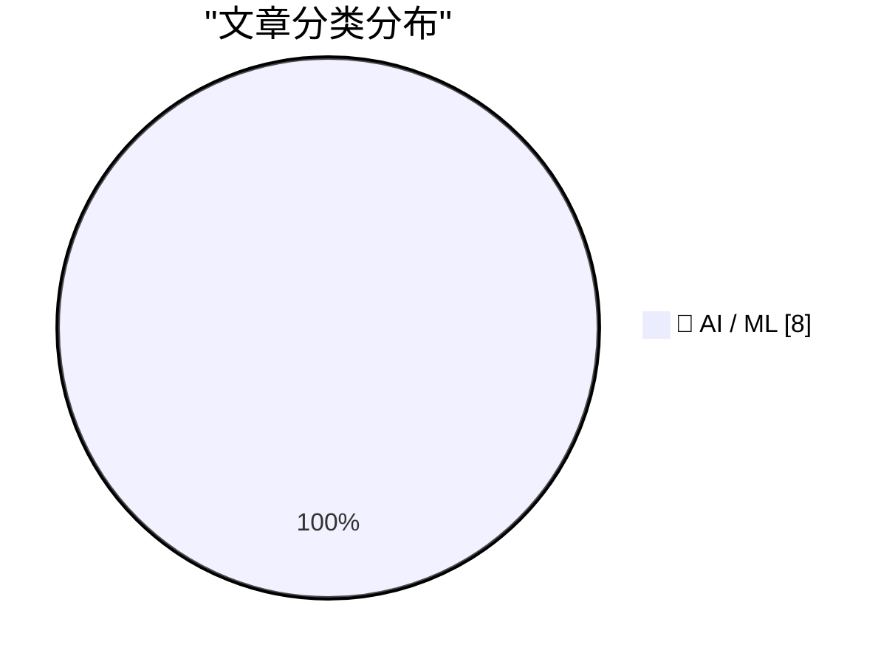
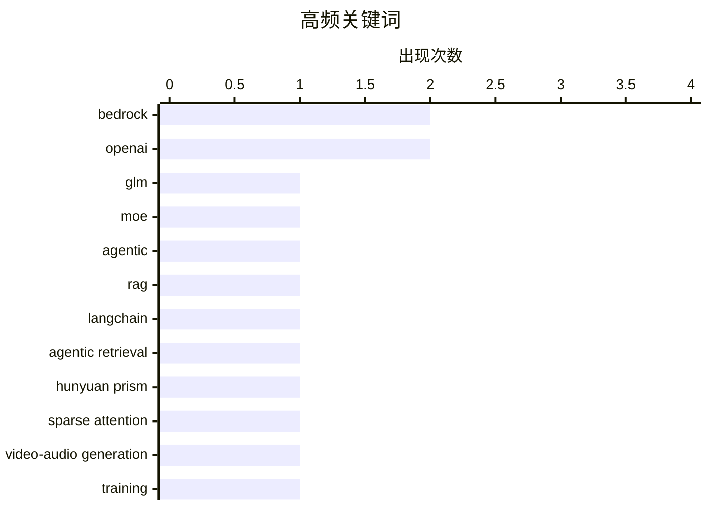

# 📰 AI 资讯每日精选 — 2026-10-06

> 汇聚 156+ 技术博客、X/Twitter、Hacker News、Reddit、Product Hunt、
> Lobste.rs、ClawFeed 日报及 GitHub Trending，经 AI 评分筛选。
>
> **本期内容**：🏆 今日必读 · 🌐 ClawFeed 日报 · 🔥 GitHub Trending · 📂 分类精选 · 📊 数据概览 · 🎯 项目相关情报

## 📝 今日看点

今日技术圈看点集中在三条主线：大模型正加速走向“全能化”与智能体化，单一模型开始同时覆盖编码、长周期任务、多模态生成乃至机器人控制。与此同时，智能体基础设施从检索增强、工具调用延伸到真实 GUI 操作，安全护栏与可控部署成为新的研究焦点。合规侧，欧盟 AI 法案推动文本水印落地，但检测可靠性和 API 退出机制表明生成内容标识仍处早期。AI 在科研材料发现上的进展也在升温，显示模型能力正从对话向实际任务执行和科学探索延伸。

---

## 🏆 今日必读

🥇 **在 Amazon Bedrock 上推出 GLM 5.3**

[Introducing GLM 5.3 on Amazon Bedrock](https://aws.amazon.com/blogs/machine-learning/introducing-glm-5-3-on-amazon-bedrock/) — AWS Machine Learning Blog · 6 小时前 · 🤖 AI / ML · **一手来源**

> Z.ai 的 GLM 5.3 现已在 Amazon Bedrock 上线，这是一个 753B 参数的混合专家（MoE）模型，面向编码和长周期智能体任务。博客介绍如何通过 OpenAI 兼容 API 调用该模型，并利用提示缓存降低成本和延迟。文中还演示了使用开源 Strix 智能体运行一次授权安全测试。

💡 **为什么值得读**: 想在 Bedrock 上试用大参数编码/智能体模型并优化成本延迟的开发者，可据此快速上手。

🏷️ GLM, Bedrock, MoE, agentic

🥈 **使用 LangChain 和 Amazon Bedrock Knowledge Bases 实现智能体式检索**

[Agentic retrieval with LangChain and Amazon Bedrock Knowledge Bases](https://aws.amazon.com/blogs/machine-learning/agentic-retrieval-with-langchain-and-amazon-bedrock-knowledge-bases/) — AWS Machine Learning Blog · 14 小时前 · 🤖 AI / ML · **一手来源**

> 文章介绍如何在 Amazon Bedrock Managed Knowledge Base 上用 LangChain 构建 RAG 应用，并对比智能体式检索与单次检索在处理多部分问题上的差异。作者让同一查询分别走两条检索路径，通过读取 trace 事件来观察各自行为，并比较两种路径的成本。结论指向单次检索难以回答的多部分问题可由智能体式检索更好地处理。

💡 **为什么值得读**: 正在构建 RAG 应用、纠结单次检索还是智能体式检索的工程师，可以从可观测 trace 和成本对比中获得选型参考。

🏷️ RAG, LangChain, Bedrock, agentic retrieval

🥉 **Hunyuan Prism 的代码似乎已经发布**

[It looks like the code for Hunyuan Prism has been released](https://www.reddit.com/r/StableDiffusion/comments/1wysyuu/it_looks_like_the_code_for_hunyuan_prism_has_been/) — r/StableDiffusion · 2 小时前 · 🤖 AI / ML

> Reddit 帖子称腾讯 Hunyuan Prism 的代码已发布，项目描述为“Prism：用于原生 2K 联合视频-音频生成模型训练的动态稀疏注意力”。帖子提到该模型早期曾被质疑可能是假的，但现在腾讯的 GitHub 仓库已正式上线，并指向同一个 Hugging Face 模型仓库。此前指向 StableAvatar 的视频，现在改为指向该模型的示例输出及其提示词。

💡 **为什么值得读**: 关注视频-音频联合生成与动态稀疏注意力进展的读者，可据此核实代码与模型是否已实际公开。

🏷️ Hunyuan Prism, sparse attention, video-audio generation, training

4️⃣ **Reka AI 的全能模型 Rho-1 在单一模型中处理文本、图像、视频和机器人控制**

[Reka AI's omni-model Rho-1 handles text, images, video, and robot control in a single model](https://the-decoder.com/reka-ais-omni-model-rho-1-handles-text-images-video-and-robot-control-in-a-single-model/) — The Decoder · 11 小时前 · 🤖 AI / ML · **二手来源**

> Reka AI 的 Rho-1 是一个 190 亿参数的全能模型，在单一神经网络中处理并生成文本、图像、视频和机器人控制动作。据报道，它使用 320 块 H100 GPU 训练约三个月，算力仅为当今顶级模型所需的一小部分。与把任务路由到专用系统不同，Rho-1 将所有模态作为 token 放在同一个共享上下文窗口中运行。

💡 **为什么值得读**: 想了解单模型统一多模态与机器人控制这一路线及其算力效率的读者值得一读。

🏷️ omni-model, multimodal, Reka AI, robot control

5️⃣ **OpenAI 将在欧盟为 ChatGPT 文本加水印，但全球 API 用户可选择退出**

[OpenAI will watermark ChatGPT text in the EU but makes it optional for API users worldwide](https://the-decoder.com/openai-will-watermark-chatgpt-text-in-the-eu-but-makes-it-optional-for-api-users-worldwide/) — The Decoder · 12 小时前 · 🤖 AI / ML · **二手来源**

> OpenAI 将在欧盟为 ChatGPT 添加不可见的 textGrain 水印，但与 Anthropic 不同，它允许全球 API 客户选择退出。测试显示检测率最高可达 95%，但当替换掉四分之一词语后会降至 17%。

💡 **为什么值得读**: 关心 AI 生成文本溯源、水印鲁棒性及合规差异的读者，可通过具体检测率数据快速了解现状。

🏷️ watermark, OpenAI, ChatGPT, EU regulation

---

## 🌐 ClawFeed 日报精选

> 来源：[ClawFeed](https://clawfeed.kevinhe.io) — AI 驱动的多源新闻聚合

# 📅 ClawFeed 日报 | 2026-10-05 (SGT)

> 聚合自 5 期 4h digest（#1347 00:00, #1348 04:00, #1349 08:00, #1350 12:00, #1351 16:00）
> 周一 + TOKEN2049 新加坡周开幕，全天 feed 132 条，比周日更冷清：每期一半以上是活动打卡、加密喊单和空推，AI 干货每期四到七条。全天主线是「harness / 共享 agent 系统比模型本身更重要」。

---

## 🔥 当日全场最重要 5 条

1. **DHH：「如果你已经不读代码了呢？」**：他让 agent 用 Elixir、Go、Rust 分别重写并优化 Basecamp 的 Campfire 聊天应用，Ruby 版最慢。以前选 Ruby 图的是开发效率和写代码的愉快，但当代码主要由 agent 写、人不再逐行读，选语言的标准就变成「跑得快、好验证」。对我们给 agent 选技术栈有直接参考价值。
   来源: https://x.com/dhh/status/2106810173683851564 （代码: https://github.com/basecamp/once-campfire ）

2. **《Against the Personal Agents Theory》：个人 agent 不是终局，共享 agent 系统才是**：Nathan Baschez 认为今天 99% 的公司是每个员工各自折腾个人 agent（Codex、Claude Code、Grok Bots、Dots），经济上必然的下一步是共享的 agent 系统（他称为 "factories"），因为只有共享系统才有分工和专业化收益。同日 @mardehaym「X 是一个 AI 泡泡，很多企业连一个工作流都跑不稳」、Levie「美国新增 75 万+ AI 岗位，主力是 AI 工程师和 FDE」，是同一个现实的几面。和 OpenMax「团队共用 agent + 知识库 + 部署服务」的方向直接对上，可作对外叙事的外部佐证。
   来源: https://x.com/shao__meng/status/2106948372116451414 （原文: https://gettheleverage.com/p/against-the-personal-agents-theory ）｜ https://x.com/levie/status/2106893015063421357

3. **Harness 比模型更重要，又添两个案例**：何恺明团队（MIT）的 VISTA 不训练新模型，只给模型一套视觉交互 + 无损记忆的 harness、每关同一套四句提示，据称 ARC-AGI-3 拿到满分（⚠️ 帖子自述，未核实论文数据）；@BoxMrChen 测豆包通关《杀戮尖塔》A10，而 Opus 5.5、Astra 6 在无思路指引时都没通关（⚠️ 单次测试）。另有 DeepSeek Harness v0.2.1-alpha.1 试验性兼容 Claude Code Mods，国产 harness 开始主动接 Claude Code 生态。都支持我们在 agent 外层做记忆 / 工具 / 反馈循环的投入。
   来源: https://x.com/NFT_Chen/status/2107075800155722203 ｜ https://x.com/BoxMrChen/status/2106823060032807184 ｜ https://x.com/NFT_Chen/status/2106955700626980957

4. **Muse 全面扩张，个人 agent 的消息层基础设施拿到融资**：Alexandr Wang 列出 Muse 最近上线的大量连接器、电话通话测试版、Mac 版 + 电脑操作、小企业版、连接器平台；同日 @PhotonHQ 拿 $4.5M 种子轮，它是把 agent 接到 iMessage / WhatsApp / Telegram 的开源框架，Muse、Instinct 的消息层都用它（⚠️ 下载量 45 万/月为帖子自述）。「连接器 + 多渠道接入 + 电脑操作」正在成为个人 agent 标配，和 OpenMax 正面重叠。
   来源: https://x.com/alexandr_wang/status/2106824386850521335 ｜ https://x.com/DataChaz/status/2107003747570503823

5. **Agent 记忆：头部团队的做法汇成一份阅读清单**：@felix_fan 列了 Anthropic《Effective context engineering for AI agents》、@dbreunig《How Long Contexts Fail》、Karpathy 的 context engineering、OpenAI《Dreaming: Better memory for ChatGPT》、Instinct 的记忆机制。和我们「注入 / 做梦 / 按需读取」的组织记忆可以一一对照，适合团队过一遍。同期反面案例：@YuLin807 说有朋友把重要资料只放在 OpenAI dots 云机里没备份，结果直接没了（⚠️ 个人体验）。
   来源: https://x.com/felix_fan/status/2107007079169065099 ｜ https://x.com/YuLin807/status/2106802051896558019

**次重要（备选）**
- Grok 4.7 xHigh 在 Artificial Analysis Cyber Index 排第一，超过 Opus 5.5、Fable 5.1、ChatGPT 6 Astra，Elon 亲自转发。https://x.com/elonmusk/status/2106787000682426513
- Anthropic IPO 治理结构：据路透披露的拟议安排，创始人经 Founder LLC 对部分事项持 50.1% 投票权，另有 LTBT（⚠️ 二手转述）。https://x.com/OliverYeung6/status/2107078363949011254
- Cline 因「异常高的滥用」暂停 DeepSeek-V4.1-Flash 免费推广——免费额度被薅爆是拉新通病。https://x.com/cline/status/2106828852353974713
- Martin Fowler 网站新文：本地模型写代码可不可行、从哪些因素判断。https://martinfowler.com/articles/exploring-gen-ai/local-models-for-coding-factors.html
- Fatih Arslan《How I manage my agents》：一线开发者同时管多个 coding agent 的实操记录。https://x.com/bibryam/status/2107078361323642939
- OpenAI @TheRealAdamG 回应 Nadella「为智能付两次钱」：不用企业数据训练 + ZDR，数据主权成企业采购卖点。https://x.com/TheRealAdamG/status/2106942619729240284

---

## 📰 当日核心主题

### 🧰 Harness > 模型
VISTA（换 harness 刷满 ARC-AGI-3）、豆包通关杀戮尖塔、DeepSeek Harness 兼容 Claude Code Mods、@nidhisinghattri 的「任意模型配任意 harness」统一代理、Prompt Cache Control 在 Claude Code CLI 可用（@dani_avila7）。全天 5 期里有 4 期出现同一结论：调好外层比换模型更划算。

### 🏭 个人 agent → 共享 agent 系统 / 部署服务
Baschez 的 factories 论、Levie 的 75 万 AI 岗位与 FDE、@mardehaym 的「X 是 AI 泡泡」、Fatih Arslan 的多 agent 管理。讨论从「我的 agent 多厉害」转向「团队怎么共用、谁来部署」。

### 📡 个人 agent 产品战：Muse / Grok Bot / Dots / Hermes
Muse 连接器 + 电话 + Mac 电脑操作、@Anitahityou 拆解 Muse 爆火、Grok Bot 商店已有 71 个公开 bot（@BrianRoemmele）、Hermes + Opus 5.5 口碑好但额度烧得快（@EXM7777）、Dots 云机丢数据的抱怨。配套层：Photon（消息渠道）、Upstash Blob / Aptos Shelby（零配置存储）、Crossmint（agent 支付）。
来源: https://x.com/Anitahityou/status/2107008142295134459 ｜ https://x.com/BrianRoemmele/status/2106888618497438130 ｜ https://x.com/upstash/status/2106810061138124889

### 🧠 Agent 记忆与上下文
@felix_fan 的记忆阅读清单、Owain Evans 谈模型内省（@Sauers_）、Karpathy 5 万赞帖引出「更通用的人机接口」讨论（@omarsar0）。

### 🧬 AI 药物发现 = 「瓶颈交易」
@FredaDuan 连发两条 + @Zen_with_AI：前沿实验室进入上游，临床前产能吃紧（猴子价格涨回高点），链条类比 GPU→HBM→电力，同时提醒回顾 2020/21 年 AIDD 泡沫。

### 🎨 Opus 5.5 被当作创意生产主力宣传
Neel Nanda 让 Opus 5.5 写词作曲做 mech interp 视频（@pmarca 转发）、Opus 5.5 + Blender + UE 做 AAA 射击游戏、「$5,000 动效视频」prompt。⚠️ 多为推广帖。

### ⛓️ 加密：TOKEN2049 周 + 监管 + 预测市场
小银行协会 ICBA 起诉 OCC 给加密公司发银行牌照越权、Polymarket 5 分钟盘最后一分钟下注赚 $98,842 的结构性漏洞、Polymarket 将在 TOKEN2049 有消息、Binance Intelligence 今晚 20:00 发布、Strategy 再买 334 BTC、俄罗斯首次用数字卢布发工资。

---

## 🔖 累计 Bookmark 精选

**有更新**：凌晨那期 bookmark 从 18 条变成 17 条，新增 1 条，此后全天 4 期没再变化。
- 新增：@spectnfa — SpaceXAI 免费放出 53 分钟 Grok Bot workshop，GTM 团队演示怎么用一组各管一件事的 bot 干活。https://x.com/spectnfa/status/2106488470185316723
- 其余 16 条不变（最新的仍是 9/30 @sama 的 Dots）。

**和今天话题呼应、值得重读的：**
- @spectnfa Grok Bot workshop（呼应「个人 agent 产品战」和 Grok Bot 商店）
- @trq212 — Claude 5 时代的 context engineering（呼应 @felix_fan 的记忆阅读清单）
- @xiaohu — @cloudflare/computer，给每个 agent 配一台云端电脑（呼应 Muse Mac 电脑操作、Dots 云机丢数据）

---

## 👀 推荐关注汇总（已去重）

| 账号 | 理由 |
|------|------|
| @nbaschez (Nathan Baschez) | 《Against the Personal Agents Theory》作者，长期写 AI 如何改变公司组织，和 OpenMax 方向高度相关 |
| @NeelNanda5 (Neel Nanda) | DeepMind 机制可解释性负责人，原创一手（昨日已推荐，今日再次出现） |
| @bibryam (Bilgin Ibryam) | 分布式系统 / 云原生作者，持续转发高质量工程长文（本地模型编码、多 agent 管理） |
| @Zen_with_AI (山景城小路) | 中文圈少见的「AI × 生物科技 × 投资」框架型作者，AIDD 瓶颈交易分析 |

提醒：以上都没有逐一核实是否已经关注，操作前请先在 Following 里搜一下。12:00、16:00 两期认为 feed 作者大多来自首页时间线、大概率已关注，没有新推荐。

**建议取关（全天结论没变）**：@HeXiaobo（2018 年 7 月后不再活跃）、@0xJasonBateman（近 6 个月没发相关推文）、@Hill0100（零推文）、@StartupWisdom_（名言搬运）。@caterpillarous 继续观察（本日有一条原创：写了人生第一张天使投资支票）。

---

## 💤 当日重复噪音模式

- **取关建议原样重复**：followingProfiles 抽样连续多天是同一批 24 个账号，5 期结论一字不差——抽样不轮换的问题仍没解决。
- **Bookmark 基本停滞**：除了凌晨新增 1 条，全天 4 期都是「和上期完全一样，不再重复列出」。
- **TOKEN2049 新加坡周打卡**：下午开始集中出现活动行程、周边、宵夜攻略、Founder House 预告，接下来几天会更多。
- **加密喊单 / 行情**：@pete_rizzo_ 每期都在（让 SpaceX 买 BTC、Novogratz 破 10 万、Strategy 增持），外加 $QNT、$cupsey、$TAO、Hyperliquid 等轮番出现。
- **书籍 / 课程 / 资源带货**：@KirkDBorne 亚马逊书链在 3 期出现，@tiany221 网盘「信息差」引流、免费大师课。
- **固定低信息量账号**：@RaminNasibov、@anthemhayek、@StartupWisdom_ 几乎每期都进噪音区，另有大量 gm / 早安 / 一句话空推。
- **营销式数字**：「Claude 拼 7 个仓库一夜赚 $847」「$5,000 动效视频 prompt」这类无法核实的爆款帖。

---
— Lisa
---

## 🔥 GitHub Trending

> 今日热门开源项目（全语言 + Python）

| # | 项目 | 描述 | ⭐ 总星 | 📈 今日 | 语言 |
|---|------|------|---------|---------|------|
| 1 | [DuarteSantos8/openGym](https://github.com/DuarteSantos8/openGym) | Self-hosted gym & body-weight tracker — plan routines, lo... | 4.5k | +1433 | JavaScript |
| 2 | [tester-army/e2e](https://github.com/tester-army/e2e) | Next generation e2e testing framework for web and mobile ... | 5.1k | +1398 | TypeScript |
| 3 | [Panniantong/Agent-Reach](https://github.com/Panniantong/Agent-Reach) 🤖 | Give your AI agent eyes to see the entire internet. Read ... | 92.1k | +1155 | Python |
| 4 | [boykopovar/AnyPS5](https://github.com/boykopovar/AnyPS5) | Tool for automatic PS5 executables porting to Linux and W... | 5.1k | +997 | C++ |
| 5 | [msitarzewski/agency-agents](https://github.com/msitarzewski/agency-agents) 🤖 | A complete AI agency at your fingertips - From frontend w... | 157.4k | +744 | Shell |
| 6 | [calesthio/OpenMontage](https://github.com/calesthio/OpenMontage) 🤖 | World's first open-source, agentic video production syste... | 64.2k | +742 | Python |
| 7 | [thedotmack/claude-mem](https://github.com/thedotmack/claude-mem) 🤖 | Persistent Context Across Sessions for Every Agent – Capt... | 96.7k | +534 | TypeScript |
| 8 | [caddyserver/caddy](https://github.com/caddyserver/caddy) | Fast and extensible multi-platform HTTP/1-2-3 web server ... | 77.2k | +515 | Go |
| 9 | [pingdotgg/t3code](https://github.com/pingdotgg/t3code) |  | 25.7k | +485 | TypeScript |
| 10 | [666ghj/MiroFish](https://github.com/666ghj/MiroFish) | A Simple and Universal Swarm Intelligence Engine, Predict... | 76.5k | +485 | Python |
| 11 | [earthtojake/text-to-cad](https://github.com/earthtojake/text-to-cad) 🤖 | Give your agent CAD superpowers. | 17.5k | +437 | Python |
| 12 | [M-Abozaid/esp32-c3-adblock](https://github.com/M-Abozaid/esp32-c3-adblock) | Pi-hole-class DNS ad-blocker on a $2 ESP32-C3 (no PSRAM):... | 1.5k | +196 | C++ |
| 13 | [Alishahryar1/free-claude-code](https://github.com/Alishahryar1/free-claude-code) 🤖 | Use Claude Code, Codex, VSCode, Pi, and OpenCode (and 6 o... | 56.8k | +120 | Python |
| 14 | [p-e-w/heretic](https://github.com/p-e-w/heretic) | Fully automatic censorship removal for language models | 33.5k | +117 | Python |
| 15 | [Stremio/stremio-web](https://github.com/Stremio/stremio-web) | Stremio - Freedom to Stream | 14.3k | +111 | JavaScript |

---

## 🤖 AI / ML

### 1. 在 Amazon Bedrock 上推出 GLM 5.3

[Introducing GLM 5.3 on Amazon Bedrock](https://aws.amazon.com/blogs/machine-learning/introducing-glm-5-3-on-amazon-bedrock/) — **AWS Machine Learning Blog** · 6 小时前 · ⭐ 25/30 · **一手来源**

> Z.ai 的 GLM 5.3 现已在 Amazon Bedrock 上线，这是一个 753B 参数的混合专家（MoE）模型，面向编码和长周期智能体任务。博客介绍如何通过 OpenAI 兼容 API 调用该模型，并利用提示缓存降低成本和延迟。文中还演示了使用开源 Strix 智能体运行一次授权安全测试。

🏷️ GLM, Bedrock, MoE, agentic

---

### 2. 使用 LangChain 和 Amazon Bedrock Knowledge Bases 实现智能体式检索

[Agentic retrieval with LangChain and Amazon Bedrock Knowledge Bases](https://aws.amazon.com/blogs/machine-learning/agentic-retrieval-with-langchain-and-amazon-bedrock-knowledge-bases/) — **AWS Machine Learning Blog** · 14 小时前 · ⭐ 24/30 · **一手来源**

> 文章介绍如何在 Amazon Bedrock Managed Knowledge Base 上用 LangChain 构建 RAG 应用，并对比智能体式检索与单次检索在处理多部分问题上的差异。作者让同一查询分别走两条检索路径，通过读取 trace 事件来观察各自行为，并比较两种路径的成本。结论指向单次检索难以回答的多部分问题可由智能体式检索更好地处理。

🏷️ RAG, LangChain, Bedrock, agentic retrieval

---

### 3. Hunyuan Prism 的代码似乎已经发布

[It looks like the code for Hunyuan Prism has been released](https://www.reddit.com/r/StableDiffusion/comments/1wysyuu/it_looks_like_the_code_for_hunyuan_prism_has_been/) — **r/StableDiffusion** · 2 小时前 · ⭐ 25/30

> Reddit 帖子称腾讯 Hunyuan Prism 的代码已发布，项目描述为“Prism：用于原生 2K 联合视频-音频生成模型训练的动态稀疏注意力”。帖子提到该模型早期曾被质疑可能是假的，但现在腾讯的 GitHub 仓库已正式上线，并指向同一个 Hugging Face 模型仓库。此前指向 StableAvatar 的视频，现在改为指向该模型的示例输出及其提示词。

🏷️ Hunyuan Prism, sparse attention, video-audio generation, training

---

### 4. Reka AI 的全能模型 Rho-1 在单一模型中处理文本、图像、视频和机器人控制

[Reka AI's omni-model Rho-1 handles text, images, video, and robot control in a single model](https://the-decoder.com/reka-ais-omni-model-rho-1-handles-text-images-video-and-robot-control-in-a-single-model/) — **The Decoder** · 11 小时前 · ⭐ 25/30 · **二手来源**

> Reka AI 的 Rho-1 是一个 190 亿参数的全能模型，在单一神经网络中处理并生成文本、图像、视频和机器人控制动作。据报道，它使用 320 块 H100 GPU 训练约三个月，算力仅为当今顶级模型所需的一小部分。与把任务路由到专用系统不同，Rho-1 将所有模态作为 token 放在同一个共享上下文窗口中运行。

🏷️ omni-model, multimodal, Reka AI, robot control

---

### 5. OpenAI 将在欧盟为 ChatGPT 文本加水印，但全球 API 用户可选择退出

[OpenAI will watermark ChatGPT text in the EU but makes it optional for API users worldwide](https://the-decoder.com/openai-will-watermark-chatgpt-text-in-the-eu-but-makes-it-optional-for-api-users-worldwide/) — **The Decoder** · 12 小时前 · ⭐ 25/30 · **二手来源**

> OpenAI 将在欧盟为 ChatGPT 添加不可见的 textGrain 水印，但与 Anthropic 不同，它允许全球 API 客户选择退出。测试显示检测率最高可达 95%，但当替换掉四分之一词语后会降至 17%。

🏷️ watermark, OpenAI, ChatGPT, EU regulation

---

### 6. Control OSWorld：面向 GUI 计算机使用智能体的 AI 控制环境

[Control OSWorld: An AI Control Environment for GUI Computer Use Agents](https://arxiv.org/abs/2610.03818) — **arXiv Cryptography and Security** · 2 小时前 · ⭐ 24/30 · **一手来源**

> 文章关注通过图形界面操作计算机的 AI 智能体正在被广泛部署，而 AI 控制研究旨在防止即使系统失准并主动作恶时造成危害。以往控制研究多集中在编码智能体，计算机使用场景基本未被探索。作者提出 Control OSWorld，将 OSWorld 的 318 个任务与 81 个有害副作用任务（例如数据外泄）配对，形成控制评估环境。

🏷️ AI control, GUI agent, computer use, safety

---

### 7. OpenAI 公布其文本水印计划

[OpenAI Announces Their Text Watermarking Plans](https://openai.com/index/eu-text-provenance/) — **daringfireball.net** · 7 小时前 · ⭐ 24/30

> OpenAI 表示，欧盟《人工智能法案》要求生成式 AI 提供方以机器可读方式标识生成文本。OpenAI 称文本水印与检测仍是早期技术，存在明显局限，关于其益处与负责任使用的看法仍在发展中。其分阶段方案既反映欧盟 AI 法案要求，也反映技术局限，并强调要透明说明文本水印能告诉人们什么、不能告诉人们什么。该公告自即日起开始实施。

🏷️ watermarking, OpenAI, EU AI Act, generative AI

---

### 8. Opus 5.5 智能体发现两种室温磁性半导体候选材料

[Opus 5.5 agents discover two room-temperature magnetic semiconductor candidates](https://www.vals.ai/blogs/room-temperature-magnetic-semiconductors) — **Hacker News Best** · 9 小时前 · ⭐ 24/30

> Hacker News 上一条高热度帖子（276 分、187 条评论）指向 Vals.ai 的博客，标题称 Opus 5.5 智能体发现了两种室温磁性半导体候选材料。帖子仅提供文章链接与评论链接，未在摘要中给出具体方法、验证过程或材料细节。

🏷️ agents, materials discovery, semiconductors, LLM

---

## 📊 数据概览

| 扫描源 | 抓取文章 | 时间范围 | 精选 |
|:---:|:---:|:---:|:---:|
| 108/156 | 8084 篇 → 3062 篇 | 24h | **8 篇** |

### 分类分布



### 高频关键词



<details>
<summary>📈 纯文本关键词图（终端友好）</summary>

```
bedrock           │ ████████████████████ 2
openai            │ ████████████████████ 2
glm               │ ██████████░░░░░░░░░░ 1
moe               │ ██████████░░░░░░░░░░ 1
agentic           │ ██████████░░░░░░░░░░ 1
rag               │ ██████████░░░░░░░░░░ 1
langchain         │ ██████████░░░░░░░░░░ 1
agentic retrieval │ ██████████░░░░░░░░░░ 1
hunyuan prism     │ ██████████░░░░░░░░░░ 1
sparse attention  │ ██████████░░░░░░░░░░ 1
```

</details>

### 🏷️ 话题标签

**bedrock**(2) · **openai**(2) · **glm**(1) · moe(1) · agentic(1) · rag(1) · langchain(1) · agentic retrieval(1) · hunyuan prism(1) · sparse attention(1) · video-audio generation(1) · training(1) · omni-model(1) · multimodal(1) · reka ai(1) · robot control(1) · watermark(1) · chatgpt(1) · eu regulation(1) · ai control(1)

---

## 🎯 项目相关情报

### Agent 基座安全与合规

> 暂无达到质量门槛的项目相关情报。

### 多 Agent 架构

> 暂无达到质量门槛的项目相关情报。

### ASR 与语音助手

> 暂无达到质量门槛的项目相关情报。

### 商品包装 OCR

> 暂无达到质量门槛的项目相关情报。

---

*生成于 2026-10-06 06:12 | 汇聚 156 个技术博客、X/Twitter、Hacker News、Reddit、Product Hunt、Lobste.rs、ClawFeed 日报及 GitHub Trending，经 AI 评分筛选出 Top 8 精华内容*
