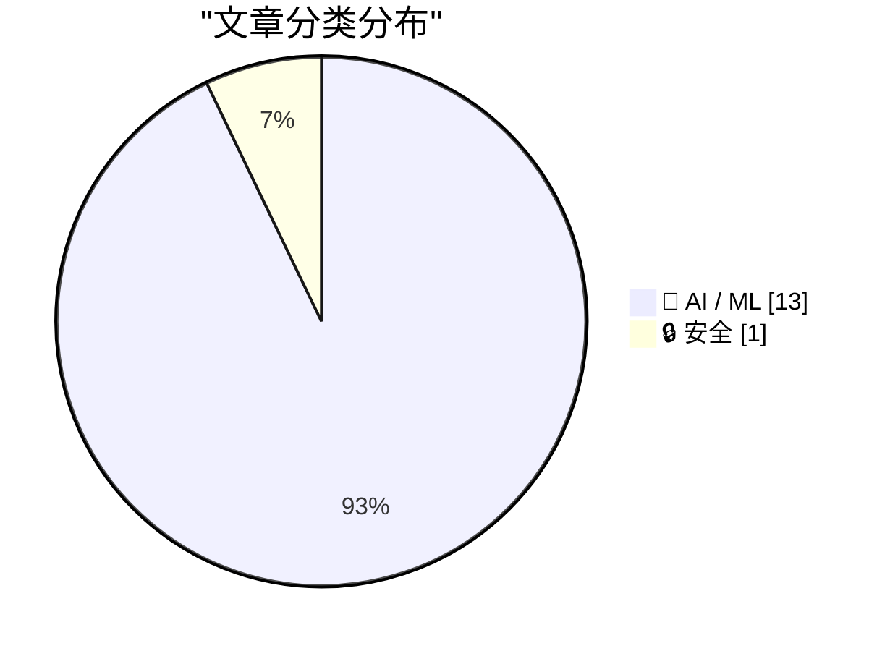
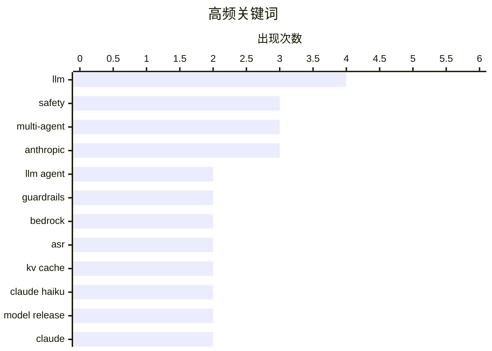

# 📰 AI 资讯每日精选 — 2026-10-08

> 汇聚 156+ 技术博客、X/Twitter、Hacker News、Reddit、Product Hunt、
> Lobste.rs、ClawFeed 日报及 GitHub Trending，经 AI 评分筛选。
>
> **本期内容**：🏆 今日必读 · 🌐 ClawFeed 日报 · 🔥 GitHub Trending · 📂 分类精选 · 📊 数据概览 · 🎯 项目相关情报

## 📝 今日看点

今日技术圈看点集中在三条主线。其一，LLM智能体正从能力展示转向安全与可信落地，围绕间接提示注入的红队测试、运行时形式化验证以及企业级可溯源答案，安全护栏正成为智能体基础设施的一部分。其二，多智能体协作与语音模型适配继续追求效率与鲁棒性，潜在KV通信、儿童语音识别和对抗迁移研究显示，如何在有限算力下保持泛化与防御是共同难题。其三，模型竞争进一步白热化，Claude Haiku 5.5以大幅降价和性能跃升搅动市场，GPT-6则推动ChatGPT从文本输出走向图表、按钮和小应用组成的交互式UI，低价、高频、多模态交互成为新方向。

---

## 🏆 今日必读

🥇 **ASPIRE：智能体安全与提示注入红队测试引擎**

[ASPIRE: Agentic Safety & Prompt Injection Red-teaming Engine](https://arxiv.org/abs/2610.08951) — arXiv Cryptography and Security · 1 小时前 · 🔒 安全 · **一手来源**

> LLM 智能体在检索不可信内容并通过工具执行操作时，会产生间接提示注入风险，可能导致未授权操作或持久状态改变。现有自动化红队测试大多针对预设场景优化载荷，未探索智能体行为空间中潜在的漏洞。作者提出 ASPIRE，一个面向开放式、行为级漏洞挖掘的智能体安全与提示注入红队测试引擎。

💡 **为什么值得读**: 关注 LLM 智能体安全与提示注入攻防的研究者可借此了解从场景化载荷优化转向行为级漏洞探索的新思路。

🏷️ prompt injection, LLM agent, red-teaming, safety

🥈 **面向使用工具的 LLM 智能体的形式化运行时验证：在 AgentDojo 与 STAC 上的离线同基准研究**

[Formal Runtime Verification for Tool-Using LLM Agents: An Offline Same-Benchmark Study on AgentDojo and STAC](https://arxiv.org/abs/2610.09793) — arXiv Cryptography and Security · 1 小时前 · 🤖 AI / ML · **一手来源**

> 使用工具的 LLM 智能体护栏通常是应用特定规则，导致多步、数据依赖的安全策略难以规范、审计和复用。作者以度量一阶时序逻辑（MFOTL）作为声明式替代方案，将 AgentDojo、STAC 和 R-Judge 已记录的轨迹离线回放至未经修改的 MonPoly 监控器，且不运行智能体。在这些语料上，五条通用义务……（摘要在此处截断）。

💡 **为什么值得读**: 适合想了解如何用形式化时序逻辑为工具型 LLM 智能体构建可审计、可复用安全策略的读者。

🏷️ LLM agent, runtime verification, guardrails, safety

🥉 **Qlik 如何借助 Amazon Bedrock 构建有依据的企业级 AI**

[How Qlik built grounded, enterprise-scale AI with Amazon Bedrock](https://aws.amazon.com/blogs/machine-learning/how-qlik-built-grounded-enterprise-scale-ai-with-amazon-bedrock/) — AWS Machine Learning Blog · 14 小时前 · 🤖 AI / ML · **一手来源**

> Qlik 基于 Amazon Bedrock 构建了 Qlik Answers，为其 40,000 多家客户在结构化和非结构化企业数据上提供有依据、可溯源的答案。方案采用分层多智能体架构，结合跨区域推理和 Amazon Bedrock Guardrails，以在全球范围内交付可信 AI。

💡 **为什么值得读**: 适合关注企业级 RAG 与多智能体架构落地实践、以及如何在规模化场景下保障 AI 可信性的读者。

🏷️ Bedrock, multi-agent, enterprise AI, Guardrails

4️⃣ **兼顾成人保留的儿童语音识别适配：一项实证研究**

[Child ASR Adaptation with Adult Retention: An Empirical Study](https://arxiv.org/abs/2610.08827) — arXiv Artificial Intelligence · 1 小时前 · 🤖 AI / ML · **一手来源**

> 自动语音识别（ASR）系统在儿童和非母语者上往往表现不佳，而将成人 ASR 模型适配到儿童语音又可能导致成人语音能力遗忘。作者在阿拉伯语和英语上研究兼顾成人保留的儿童 ASR 适配，比较了全量微调、LoRA 和事后权重空间合并三种方法，覆盖编码器-解码器、编码器-CTC 和基于 AudioLLM 的 ASR 系统。实验使用阿拉伯语母语与非母语儿童……（摘要在此处截断）。

💡 **为什么值得读**: 适合研究语音识别领域微调与灾难性遗忘权衡的读者，尤其是关注儿童语音适配方案选型的人。

🏷️ ASR, speech, adaptation, catastrophic-forgetting

5️⃣ **面向任务的键层 KV 通信：实现高效潜在多智能体协作**

[Task-Oriented Key-Layer KV Communication for Efficient Latent Multi-Agent Collaboration](https://arxiv.org/abs/2610.08820) — arXiv Machine Learning · 1 小时前 · 🤖 AI / ML · **一手来源**

> 基于大语言模型的多智能体系统通过协作提升复杂问题求解能力，而潜在通信直接传输模型内部状态，可避免自然语言推理的高昂成本。然而现有基于 KV 的潜在通信方法优先考虑发送端状态保真度，带来大量通信与计算开销，并可能引入冗余信息。为应对这些问题……（摘要在此处截断）。

💡 **为什么值得读**: 适合关注多智能体系统通信效率与 KV 缓存优化的研究者，了解如何从发送端保真转向任务导向的通信设计。

🏷️ multi-agent, KV cache, LLM, latent communication

---

## 🌐 ClawFeed 日报精选

> 来源：[ClawFeed](https://clawfeed.kevinhe.io) — AI 驱动的多源新闻聚合

# 📅 ClawFeed 日报 | 2026-10-07 (SGT)

> 聚合自 5 期 4h digest（#1361 00:00, #1362 04:00, #1363 08:00, #1364 12:00, #1365 16:00）
> 周三 + Token2049 新加坡周第三天，全天 feed 148 条，信噪比偏低：每期一半以上是峰会打卡、喊单和生活帖，有信息量的每期三到十条。全天两条主线：「agent 怎么和商家、网站打交道」（Personal Agent Protocol、电商审计、AgentID、agent 支付），以及「Grok Bot 改成按任务路由后端模型，实际默认跑 Opus 5.5」。Anthropic 自己也有两条：Claude 进 Google Docs / Sheets / Slides，Cyber Verification Program 扩到 Mythos 5.1。

---

## 🔥 当日全场最重要 5 条

1. **agent 代用户交易：标准、身份、支付同一天都有动作**：Meta 和 Sierra 发起 Personal Agent Protocol（PAP），规定个人 agent 如何与商家交互，创始成员有 Stripe、Shopify、Walmart、Genesys、Instinct、Rocket（@jeff_weinstein）。同一时段 @billions_ntwk 审计美国 51 家最大电商：没有一家能让经过验证的 AI agent 下单，37 家还会无意中把购物 agent 拦掉。下午 AgentMail 推出 AgentID，号称「给 agent 用的 Sign in with Google」：agent 有自己的登录和收件箱，并绑定回真人主人（@rohanpaul_ai）。傍晚 Kite AI 在新加坡集中推 agent 支付活动。昨天的主线是「agent 开始碰钱」，今天往下走到协议层和身份层。对 Zylos 这类要替用户注册、登录第三方服务的 agent，AgentID 值得看。⚠️ PAP 只有发布帖，协议具体内容没看到。
   来源: https://x.com/jeff_weinstein/status/2107541730870632493 ｜ https://x.com/rohanpaul_ai/status/2107570923612348816

2. **Grok Bot 改成按任务路由后端模型，Cursor 侧说 bot 全部跑 Opus 5.5**：@elonmusk 表示 Grok Bot 后续会按任务选用最合适的后端，点名 Claude Opus 5.5、Midjourney、Suno 等第三方 API（@liyue_ai 转评）。傍晚 Cursor 侧的 @poteto 回复称「所有 bot 都会跑在 Opus 5.5 上」，还能拉起 Cursor 自有模型的云端 agent，@DaveShapi 调侃「那家 Claude 套壳公司」；@mardehaym 认为路由是 Grok Bot 最聪明的产品决策之一。头部 agent 产品不再绑定自家模型，模型层和产品 / 编排层在分开。这和昨天 OpenAI 说「编排层会被模型吸收」是两个相反方向的信号。
   来源: https://x.com/liyue_ai/status/2107742825878360525 ｜ https://x.com/DaveShapi/status/2107795108980474143

3. **Claude 进 Google Docs / Sheets / Slides，Cyber Verification 扩到 Mythos 5.1**：Claude 可以在 Google Workspace 侧边栏读取当前打开的文件、原地修改，每处修改先由用户批准再落地；这些文件也能在 Claude 里打开（@claudeai，下午 @alex_prompter 又转了一次）。同期 Anthropic 扩大 Cyber Verification Program，经过验证的安全从业者可以用 Mythos 5.1、Opus 5.5、Sonnet 5.5。团队日常用 Google 文档的话可以直接试。
   来源: https://x.com/claudeai/status/2107522596845822135 ｜ https://x.com/AndrewCurran_/status/2107547709112828188

4. **GitHub：Git 活动一年翻倍，正在为 agent 规模重建 Git 基础设施**：2025 年 9 月到 2026 年 8 月，Git 活动量翻了一倍多，达到每月 4733 亿次事件；GitHub 说正在「不停机重建 Git 基础设施」，给 agent 规模的软件开发打地基（工程博客《Building Git infrastructure for agent-scale development》）。agent 写代码的流量已经大到逼平台重构底层，这是今天最硬的一个数据。
   来源: https://x.com/github/status/2107589127051063771

5. **加密：监管细化、L2 关停、单日回撤 3%**：CFTC 首批加密规则 Regulation CTX / CAM 征求意见，针对带保证金、杠杆、融资的零售交易，普通现货不在范围内（@laurashin）。L2 Abstract 运营近三年后宣布关停，资金需通过 migrate.abs.xyz 撤出，在 3 期反复出现。傍晚加密总市值单日跌 3% 至 2.85 万亿美元，多头爆仓超 4.03 亿美元；BTC ETF 净流入 1.19 亿，ETH ETF 净流出 2.02 亿（@CoinGapeMedia）。今晚美东 14:00 还有 FOMC 纪要。
   来源: https://x.com/laurashin/status/2107433690095841429 ｜ https://x.com/AbstractChain/status/2107554632675340420 ｜ https://x.com/CoinGapeMedia/status/2107800664487379263

**次重要（备选）**
- Claude 按「人」封号在中文圈发酵：@rwayne 用澳洲 ID / IP / 银行卡都没事，国内朋友整套照搬仍被封，推测按人而不是按网络环境判定。对团队里依赖 Claude 的中文用户是实际风险。https://x.com/rwayne/status/2107778653337821222
- ElevenLabs 和一个印度邦政府签首份 MOU；印度一年 1 亿多次 ElevenAgents 对话里超过 70% 用印地语、卡纳达语、泰米尔语、泰卢固语。语音 agent 在新兴市场是多语种优先。https://x.com/ElevenLabs/status/2107669995698246044
- Codex Auto-review 对所有 ChatGPT 账号用户免费，用来替代「每一步都要你批准」的默认沙箱。https://x.com/daniel_mac8/status/2107556065667600493
- supermemory API v5：「agent-first 的记忆 API」，namespace 放进 URL、结果按 agent 上下文优化。做 agent 长期记忆可参考。https://x.com/DhravyaShah/status/2107551610499125757
- Meta 开源内部用了 9 年的资源分配库 Rebalancer，把规则定义和求解算法解耦。https://x.com/Gorden_Sun/status/2107673087432962258
- Cardano CIP-0113 上主网，合规规则可写进原生代币；Arbitrum 加入 Global Dollar Network，USDG 上线。https://x.com/Cardano_CF/status/2107667227210367411

---

## 📰 当日核心主题

### 🛒 agent × 商业：协议、身份、支付
PAP（Meta + Sierra + Stripe / Shopify / Walmart）、51 家电商零支持 agent 下单、AgentID 给 agent 发登录身份、Kite AI 与 Agentic Money 2026 活动、Stripe John Collison「agent 会重写互联网商业」。昨天是 Coinbase / Grok Bot 让 agent 动钱，今天是标准和身份层补位。
来源: https://x.com/Kite_Frens_Eco/status/2107782661762920666

### 🔀 模型路由 vs. 模型归属
Grok Bot 按任务路由后端，Cursor 侧确认 Opus 5.5 是默认大脑；@cryptoxiao 回顾 GrokBot 吸收 Cursor、Meta 吸收 Manus 做 Muse 的路线。和 10/6 OpenAI「编排会被模型吸收」形成对照：一边是模型厂把 harness 收进来，一边是产品方把模型变成可替换的后端。

### 🧩 Anthropic 产品与账号
Claude 进 Google Workspace（两期出现）、Cyber Verification 扩到 Mythos 5.1、中文圈 Claude 封号讨论、Opus 5.5 作为 Grok Bot 底座。AI 进办公文档的方式在收敛到「侧边栏 + 逐条审批」。

### 🛠️ agent 开发基础设施
GitHub agent 规模 Git 重建、Codex Auto-review 免费、supermemory v5、Walrus Console（托管 agent 上下文，原生 MCP）、Meta Rebalancer、ministack（单端口本地跑 60+ AWS 服务）、@libukai 用 MCP UI 在对话里渲染表单。本地模型：Qwen3.8-Flash-Next 双 DGX Spark 93/100、GLM-5.3-Flash 单张 3090 35 tok/s。

### ⛓️ 加密：Token2049 周 + 监管 + 收缩
监管：CFTC Regulation CTX / CAM。合规资产上链：USDG 上 Arbitrum、Cardano CIP-0113、ICE 公开讨论链上结算。收缩整合：Abstract 关停、STG 并入 ZRO。市场：总市值 -3%、BTC.D 五年来首个死亡交叉、FOMC 纪要。另有 Bittensor SN51 用经营收入买 5000 TAO、TOKEN2049 2027 年 6 月进军纽约。

---

## 🔖 累计 Bookmark 精选

**无更新**：全天 5 期都是 17 条，最新一条仍是 @spectnfa 的 SpaceXAI Grok Bot workshop，和 10/5、10/6 一样，连续三天没有新增。

**和今天话题呼应、值得重读的：**
- @spectnfa Grok Bot workshop（呼应 Grok Bot 改按任务路由模型）
- @alexandr_wang 的 Muse for small businesses、Manus 2.0（呼应 04:00 期中日用户对 Muse / Manus 的自然口碑）

---

## 👀 推荐关注汇总（已去重）

| 账号 | 理由 |
|------|------|
| @jerrychen | Greylock GP，「The New Moats」系列作者，发推低频但偏思考型；抽样页显示尚未关注（12:00 期推荐） |
| @edsim | boldstart ventures 创始人，Fund VII 2.5 亿美元专投「autonomous enterprise」；持续更新「What's 🔥」周报；抽样页显示尚未关注（16:00 期推荐） |
| @DhravyaShah | supermemory 创始人，agent 记忆基础设施一线 builder；⚠️ 之前在 feed 出现过，很可能已关注，操作前先在 Following 里搜一下（00:00 期推荐） |

此前推荐、仍未处理：@AlecTPhD、@mschoening、@typesafeai（见 10/6 日报）。

**建议取关**：@Hill0100（抓不到有效推文）、@StartupWisdom_（名人语录搬运）、@0xJasonBateman（近 6 个月没有相关推文）。@Mr57814170 在 12:00 期后主页按钮已显示「Follow」，看起来已取关。
**继续观察**：@Tradermayne、@caterpillarous；新增 @MosesCyborg（04:00 期只有八卦转评，如持续可考虑取关）。

---

## 💤 当日重复噪音模式

- **Token2049 现场打卡**：峰会照片、场地吐槽（烧烤味、新加坡物价）、抽奖、KOL 申请，每期都占一大块。
- **喊单与行情一句话**：SOL / BTC / OKB / meme 地址、「牛市拿住」「SOL 上 1000」、交易鸡汤，部分带 TG 群引流。
- **引流式 AI 营销**：@MoonDevOnYT 连续两期（「15 个 Opus 5.5 agent 吃散户爆仓」、回测引流）。
- **固定低信息量账号**：@RaminNasibov（每期都有生活帖）、@marquistrillx（三期都是创作者 / 情感段子）、@BrianRoemmele（直播预告、电子管功放）。
- **政治八卦**：04:00 期 Andrew Tate 段子刷屏、特朗普诺奖提名旧闻。
- **结论原样重复**：followingProfiles 抽样仍以同一批 24 个账号为主，取关对象每期一样；bookmark 连续三天无变化。
- **同一消息多期重复收录**：Abstract 关停（3 期）、Claude 进 Google Workspace（2 期）、Minerva Humanoids（2 期）。

---
— Lisa
---

## 🔥 GitHub Trending

> 今日热门开源项目（全语言 + Python）

| # | 项目 | 描述 | ⭐ 总星 | 📈 今日 | 语言 |
|---|------|------|---------|---------|------|
| 1 | [morluto/rea](https://github.com/morluto/rea) | Reverse engineer anything with agents, from app behavior ... | 17.0k | +4655 | TypeScript |
| 2 | [boykopovar/AnyPS5](https://github.com/boykopovar/AnyPS5) | Tool for automatic PS5 executables porting to Linux and W... | 11.4k | +2716 | C++ |
| 3 | [DuarteSantos8/openGym](https://github.com/DuarteSantos8/openGym) | Self-hosted gym & body-weight tracker — plan routines, lo... | 7.3k | +1493 | JavaScript |
| 4 | [mattpocock/skills](https://github.com/mattpocock/skills) | Skills for Real Engineers. Straight from my .agents direc... | 280.0k | +1403 | Shell |
| 5 | [tester-army/e2e](https://github.com/tester-army/e2e) | Next generation e2e testing framework for web and mobile ... | 7.7k | +1390 | TypeScript |
| 6 | [cathrynlavery/diagram-design](https://github.com/cathrynlavery/diagram-design) 🤖 | Editorial diagram design for Claude Code, Codex, GitHub C... | 45.2k | +825 | HTML |
| 7 | [anthropics/knowledge-work-plugins](https://github.com/anthropics/knowledge-work-plugins) 🤖 | Open source repository of plugins primarily intended for ... | 27.2k | +766 | Python |
| 8 | [addyosmani/agent-skills](https://github.com/addyosmani/agent-skills) 🤖 | Production-grade engineering skills for AI coding agents. | 103.0k | +677 | JavaScript |
| 9 | [ayghri/i-have-adhd](https://github.com/ayghri/i-have-adhd) 🤖 | A skill to stop your coding agent from burying the answer... | 55.3k | +619 | Python |
| 10 | [thedotmack/claude-mem](https://github.com/thedotmack/claude-mem) 🤖 | Persistent Context Across Sessions for Every Agent – Capt... | 97.9k | +578 | TypeScript |
| 11 | [cloudflare/security-audit-skill](https://github.com/cloudflare/security-audit-skill) 🤖 | A coding-agent skill for multi-phase security audits with... | 26.2k | +576 | JavaScript |
| 12 | [earthtojake/text-to-cad](https://github.com/earthtojake/text-to-cad) 🤖 | Give your agent CAD superpowers. | 18.3k | +447 | Python |
| 13 | [superdesigndev/treg](https://github.com/superdesigndev/treg) 🤖 | OpenRouter for agent tools. Join community here: https://... | 4.8k | +416 | Python |
| 14 | [calesthio/OpenMontage](https://github.com/calesthio/OpenMontage) 🤖 | World's first open-source, agentic video production syste... | 65.1k | +369 | Python |
| 15 | [trycua/cua](https://github.com/trycua/cua) | Scale computer-use 2.0 with open-source drivers, cross-OS... | 28.9k | +228 | Rust |

---

## 🤖 AI / ML

### 1. 面向使用工具的 LLM 智能体的形式化运行时验证：在 AgentDojo 与 STAC 上的离线同基准研究

[Formal Runtime Verification for Tool-Using LLM Agents: An Offline Same-Benchmark Study on AgentDojo and STAC](https://arxiv.org/abs/2610.09793) — **arXiv Cryptography and Security** · 1 小时前 · ⭐ 23/30 · **一手来源**

> 使用工具的 LLM 智能体护栏通常是应用特定规则，导致多步、数据依赖的安全策略难以规范、审计和复用。作者以度量一阶时序逻辑（MFOTL）作为声明式替代方案，将 AgentDojo、STAC 和 R-Judge 已记录的轨迹离线回放至未经修改的 MonPoly 监控器，且不运行智能体。在这些语料上，五条通用义务……（摘要在此处截断）。

🏷️ LLM agent, runtime verification, guardrails, safety

---

### 2. Qlik 如何借助 Amazon Bedrock 构建有依据的企业级 AI

[How Qlik built grounded, enterprise-scale AI with Amazon Bedrock](https://aws.amazon.com/blogs/machine-learning/how-qlik-built-grounded-enterprise-scale-ai-with-amazon-bedrock/) — **AWS Machine Learning Blog** · 14 小时前 · ⭐ 23/30 · **一手来源**

> Qlik 基于 Amazon Bedrock 构建了 Qlik Answers，为其 40,000 多家客户在结构化和非结构化企业数据上提供有依据、可溯源的答案。方案采用分层多智能体架构，结合跨区域推理和 Amazon Bedrock Guardrails，以在全球范围内交付可信 AI。

🏷️ Bedrock, multi-agent, enterprise AI, Guardrails

---

### 3. 兼顾成人保留的儿童语音识别适配：一项实证研究

[Child ASR Adaptation with Adult Retention: An Empirical Study](https://arxiv.org/abs/2610.08827) — **arXiv Artificial Intelligence** · 1 小时前 · ⭐ 20/30 · **一手来源**

> 自动语音识别（ASR）系统在儿童和非母语者上往往表现不佳，而将成人 ASR 模型适配到儿童语音又可能导致成人语音能力遗忘。作者在阿拉伯语和英语上研究兼顾成人保留的儿童 ASR 适配，比较了全量微调、LoRA 和事后权重空间合并三种方法，覆盖编码器-解码器、编码器-CTC 和基于 AudioLLM 的 ASR 系统。实验使用阿拉伯语母语与非母语儿童……（摘要在此处截断）。

🏷️ ASR, speech, adaptation, catastrophic-forgetting

---

### 4. 面向任务的键层 KV 通信：实现高效潜在多智能体协作

[Task-Oriented Key-Layer KV Communication for Efficient Latent Multi-Agent Collaboration](https://arxiv.org/abs/2610.08820) — **arXiv Machine Learning** · 1 小时前 · ⭐ 23/30 · **一手来源**

> 基于大语言模型的多智能体系统通过协作提升复杂问题求解能力，而潜在通信直接传输模型内部状态，可避免自然语言推理的高昂成本。然而现有基于 KV 的潜在通信方法优先考虑发送端状态保真度，带来大量通信与计算开销，并可能引入冗余信息。为应对这些问题……（摘要在此处截断）。

🏷️ multi-agent, KV cache, LLM, latent communication

---

### 5. 打破微调语音识别中的对抗迁移性

[Breaking Adversarial Transferability in Fine-Tuned Speech Recognition](https://arxiv.org/abs/2610.09109) — **arXiv Machine Learning** · 1 小时前 · ⭐ 22/30 · **一手来源**

> 许多组织微调公开预训练的自动语音识别（ASR）模型并在黑盒环境中部署，假设有限访问权限能提供保护。作者表明这一假设很脆弱：在公开基础模型上构造的对抗扰动可有效迁移到微调后的目标模型，严重降低性能，并对安全关键应用构成隐患。为此作者提出 TransferBreaker，一个统一的……（摘要在此处截断）。

🏷️ ASR, adversarial, fine-tuning, speech recognition

---

### 6. Claude Haiku 5.5

[Claude Haiku 5.5](https://simonwillison.net/2026/Oct/7/claude-haiku-5-5/) — **simonwillison.net** · 8 小时前 · ⭐ 26/30

> Anthropic 发布了新的快速、低成本模型 Claude Haiku 5.5。此前的 Haiku 4.5 发布于近一年前，定价为每百万输入 token 1 美元、每百万输出 token 5 美元，即便在当时也相对昂贵。

🏷️ Anthropic, Claude Haiku, LLM, model release

---

### 7. 搭载 GPT-6 的 ChatGPT 告别以文本为主的输出，转向带图表、按钮和小应用的交互式 UI

[ChatGPT with GPT-6 ditches mostly text output for interactive UI with charts, buttons, and mini apps](https://the-decoder.com/chatgpt-with-gpt-6-ditches-mostly-text-output-for-interactive-ui-with-charts-buttons-and-mini-apps/) — **The Decoder** · 10 小时前 · ⭐ 25/30 · **二手来源**

> OpenAI 正在推出搭载“智能 UI”的 GPT-6，该功能可将答案转化为包含图表、按钮和表单的交互式界面。模型现在可以在思考过程中同时响应，将等待时间缩短 44%。付费用户可使用 GPT-6 Sol，免费用户可使用 GPT-6 Luna。

🏷️ GPT-6, OpenAI, interactive UI, multimodal

---

### 8. Claude Haiku 5.5 携大幅降价而来，证明 AI 价格战远未结束

[Claude Haiku 5.5 arrives with massive price cuts proving the AI pricing arms race is far from over](https://the-decoder.com/claude-haiku-5-5-arrives-with-massive-price-cuts-proving-the-ai-pricing-arms-race-is-far-from-over/) — **The Decoder** · 11 小时前 · ⭐ 25/30 · **二手来源**

> Anthropic 的新模型 Claude Haiku 5.5 在基准测试中大幅超越前代，在 OSWorld 计算机使用测试上从 15.7% 跃升至 72.4%。其 token 价格最高下降 90%，不过新的分词器会因每任务消耗更多 token 而抵消部分节省。

🏷️ Claude, Anthropic, pricing, benchmark

---

### 9. Claude Haiku 5.5

[Claude Haiku 5.5](https://www.anthropic.com/claude-haiku-5-5) — **Hacker News Best** · 11 小时前 · ⭐ 25/30

> 该条目为 Hacker News 上关于 Anthropic 官方 Claude Haiku 5.5 发布页面的讨论帖，获得 786 分、389 条评论。

🏷️ Claude, Anthropic, LLM, model release

---

### 10. 在 AWS 上推出 Claude Haiku 5.5

[Introducing Claude Haiku 5.5 on AWS](https://aws.amazon.com/blogs/machine-learning/introducing-claude-haiku-5-5-on-aws/) — **AWS Machine Learning Blog** · 11 小时前 · ⭐ 23/30 · **一手来源**

> Claude Haiku 5.5 现已在 Amazon Bedrock 和 AWS 上的 Claude Platform 上线。据 Anthropic 称，它是 Claude 5.5 系列中速度最快、效率最高的模型，面向子代理和高并发、成本敏感型工作负载。该模型在大多数任务上的成本比 Claude Haiku 4.5 低约 75%。文章介绍了其改进之处以及如何开始使用。

🏷️ Claude Haiku, Amazon Bedrock, LLM

---

### 11. Cornerstone OnDemand 如何借助 Amazon Bedrock 将数据库诊断时间缩短 78%

[How Cornerstone OnDemand cut database diagnosis by 78% with Amazon Bedrock](https://aws.amazon.com/blogs/machine-learning/how-cornerstone-ondemand-cut-database-diagnosis-by-78-with-amazon-bedrock/) — **AWS Machine Learning Blog** · 14 小时前 · ⭐ 23/30 · **一手来源**

> Cornerstone OnDemand 基于 Amazon Bedrock 和 Strands Agents 构建了多代理系统 Orion AI，将数据库运维从被动救火转变为主动自动化。一个三人团队在六个月内把数据库诊断时间从 45 分钟缩短到 10 分钟，降幅达 78%。文章分享了其他团队可以复用的设计决策。

🏷️ multi-agent, Bedrock, database, automation

---

### 12. 面向代理式 AI 自动化的有界自主性与可验证安全

[Bounded Autonomy and Verifiable Safety for Agentic AI Enabled Automation](https://arxiv.org/abs/2610.08815) — **arXiv Machine Learning** · 1 小时前 · ⭐ 23/30 · **一手来源**

> 代理式 AI 自动化仅靠概率推理无法安全部署于高风险环境，一个反复出现的风险是“认知漂移”：随着推理深入，系统行为可能偏离主题专家设定的安全运行约束。论文提出 BRaVeS，一种称为“可辩护下一代推理系统”（DNRS）的有界推理与安全治理框架。BRaVeS 将主题专家定义的约束编码为不变量。

🏷️ agentic AI, safety, autonomy, verification

---

### 13. 自剪枝 Transformer：基于通用注意力的极端 KV-Cache 压缩

[A Self-Pruning Transformer: Extreme KV-Cache Compression with Universal Attention](https://arxiv.org/abs/2610.09051) — **arXiv Machine Learning** · 1 小时前 · ⭐ 23/30 · **一手来源**

> 现代 LLM 庞大的 KV-Cache 规模成为高效部署的障碍。已有研究尝试用基于衰减的替代机制替换注意力层的 RoPE 位置嵌入，从而在推理时剪枝 KV-Cache，但这些衰减函数表达能力有限，实践中退化为类似滑动窗口的淘汰模式。本文提出了一个统一框架来整合互补方法。

🏷️ KV cache, transformer, attention, compression

---

## 🔒 安全

### 14. ASPIRE：智能体安全与提示注入红队测试引擎

[ASPIRE: Agentic Safety & Prompt Injection Red-teaming Engine](https://arxiv.org/abs/2610.08951) — **arXiv Cryptography and Security** · 1 小时前 · ⭐ 23/30 · **一手来源**

> LLM 智能体在检索不可信内容并通过工具执行操作时，会产生间接提示注入风险，可能导致未授权操作或持久状态改变。现有自动化红队测试大多针对预设场景优化载荷，未探索智能体行为空间中潜在的漏洞。作者提出 ASPIRE，一个面向开放式、行为级漏洞挖掘的智能体安全与提示注入红队测试引擎。

🏷️ prompt injection, LLM agent, red-teaming, safety

---

## 📊 数据概览

| 扫描源 | 抓取文章 | 时间范围 | 精选 |
|:---:|:---:|:---:|:---:|
| 108/156 | 6731 篇 → 1692 篇 | 24h | **14 篇** |

### 分类分布



### 高频关键词



<details>
<summary>📈 纯文本关键词图（终端友好）</summary>

```
llm          │ ████████████████████ 4
safety       │ ███████████████░░░░░ 3
multi-agent  │ ███████████████░░░░░ 3
anthropic    │ ███████████████░░░░░ 3
llm agent    │ ██████████░░░░░░░░░░ 2
guardrails   │ ██████████░░░░░░░░░░ 2
bedrock      │ ██████████░░░░░░░░░░ 2
asr          │ ██████████░░░░░░░░░░ 2
kv cache     │ ██████████░░░░░░░░░░ 2
claude haiku │ ██████████░░░░░░░░░░ 2
```

</details>

### 🏷️ 话题标签

**llm**(4) · **safety**(3) · **multi-agent**(3) · anthropic(3) · llm agent(2) · guardrails(2) · bedrock(2) · asr(2) · kv cache(2) · claude haiku(2) · model release(2) · claude(2) · prompt injection(1) · red-teaming(1) · runtime verification(1) · enterprise ai(1) · speech(1) · adaptation(1) · catastrophic-forgetting(1) · latent communication(1)

---

## 🎯 项目相关情报

### Agent 基座安全与合规

#### [ASPIRE：智能体安全与提示注入红队测试引擎](https://arxiv.org/abs/2610.08951)

> **状态**：本期 Top 14 已收录

- **匹配类型**：直接相关
- **项目相关性**：9/10
- **可落地性**：8/10
- **为什么相关**：直接针对LLM Agent检索不可信内容引发的间接提示注入风险，构建Agentic安全与红队测试引擎，覆盖越权动作等威胁。
- **建议动作**：跟进其红队测试方法与防御评估流程，纳入Agent提示注入防护与安全测试实践。
- **来源**：arXiv Cryptography and Security · 一手来源

#### [面向使用工具的 LLM 智能体的形式化运行时验证：在 AgentDojo 与 STAC 上的离线同基准研究](https://arxiv.org/abs/2610.09793)

> **状态**：本期 Top 14 已收录

- **匹配类型**：直接相关
- **项目相关性**：9/10
- **可落地性**：8/10
- **为什么相关**：直接研究工具型LLM Agent的运行时验证与安全护栏，面向AgentDojo和STAC等安全基准。
- **建议动作**：精读其形式化验证与护栏审计方法，评估用于工具调用权限与合规审计。
- **来源**：arXiv Cryptography and Security · 一手来源

### 多 Agent 架构

#### [Qlik 如何借助 Amazon Bedrock 构建有依据的企业级 AI](https://aws.amazon.com/blogs/machine-learning/how-qlik-built-grounded-enterprise-scale-ai-with-amazon-bedrock/)

> **状态**：本期 Top 14 已收录

- **匹配类型**：直接相关
- **项目相关性**：8/10
- **可落地性**：7/10
- **为什么相关**：构建了分层多Agent架构，将结构化与非结构化企业数据问答落地到生产环境，涉及跨区域推理，属于多Agent编排与实现证据。
- **建议动作**：梳理其分层多Agent编排、路由与跨区域推理设计，沉淀企业级多Agent架构参考。
- **来源**：AWS Machine Learning Blog · 一手来源

#### [面向任务的键层 KV 通信：实现高效潜在多智能体协作](https://arxiv.org/abs/2610.08820)

> **状态**：本期 Top 14 已收录

- **匹配类型**：直接相关
- **项目相关性**：8/10
- **可落地性**：6/10
- **为什么相关**：研究LLM多Agent系统通过关键层KV潜在通信进行协作，直接涉及Agent间通信机制与效率优化，属多Agent架构核心议题。
- **建议动作**：精读其潜在通信协议与评测设置，评估用于降低Agent间通信开销的方案。
- **来源**：arXiv Machine Learning · 一手来源

### ASR 与语音助手

#### [兼顾成人保留的儿童语音识别适配：一项实证研究](https://arxiv.org/abs/2610.08827)

> **状态**：本期 Top 14 已收录

- **匹配类型**：直接相关
- **项目相关性**：8/10
- **可落地性**：7/10
- **为什么相关**：实证研究儿童语音ASR适配并保持成人性能，属语音识别模型优化与评测。
- **建议动作**：关注其适配策略与评测指标，评估用于多人群ASR场景。
- **来源**：arXiv Artificial Intelligence · 一手来源

#### [打破微调语音识别中的对抗迁移性](https://arxiv.org/abs/2610.09109)

> **状态**：本期 Top 14 已收录

- **匹配类型**：直接相关
- **项目相关性**：7/10
- **可落地性**：6/10
- **为什么相关**：研究微调ASR模型的对抗迁移性，属于语音识别模型鲁棒性与评测范畴。
- **建议动作**：纳入ASR模型鲁棒性评测，关注其攻击迁移与防御评估方法。
- **来源**：arXiv Machine Learning · 一手来源

### 商品包装 OCR

> 暂无达到质量门槛的项目相关情报。

---

*生成于 2026-10-08 05:54 | 汇聚 156 个技术博客、X/Twitter、Hacker News、Reddit、Product Hunt、Lobste.rs、ClawFeed 日报及 GitHub Trending，经 AI 评分筛选出 Top 14 精华内容*
