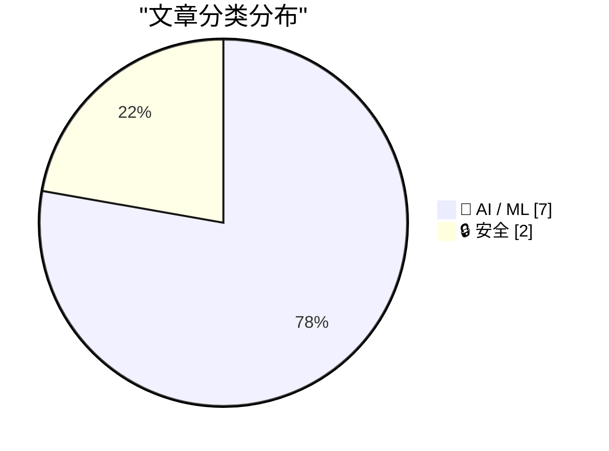
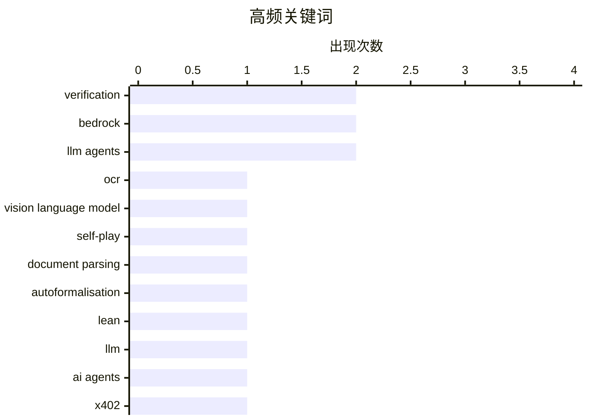

# 📰 AI 资讯每日精选 — 2026-10-09

> 汇聚 156+ 技术博客、X/Twitter、Hacker News、Reddit、Product Hunt、
> Lobste.rs、ClawFeed 日报及 GitHub Trending，经 AI 评分筛选。
>
> **本期内容**：🏆 今日必读 · 🌐 ClawFeed 日报 · 🔥 GitHub Trending · 📂 分类精选 · 📊 数据概览 · 🎯 项目相关情报

## 📝 今日看点

今日技术圈的主线是AI智能体的安全与可控性：从MoE路由遥测泄露成员身份，到一条提示词即可劫持同一AWS账户下所有智能体，再到AI驱动工具攻破韩国银行，攻击面正从模型输出延伸至智能体所依赖的运行基础设施。与之呼应，多篇研究把焦点转向智能体的验证与自我改进边界，主张用有界验证框架和合规受限的演化来约束其行为，并提醒自动形式化验证并不等同于自然语言证明正确。商业侧则出现降温与结算并行的信号：OpenAI年化收入比此前释放的信号低约200亿美元，而按次推理付费等机制正试图为智能体经济建立可度量的账本。

---

## 🏆 今日必读

🥇 **SP-DocReader：面向精准文档OCR的差异感知自博弈框架**

[SP-DocReader: Difference-Aware Self-Play for Precise Document OCR](https://arxiv.org/abs/2610.11148) — arXiv Artificial Intelligence · 2 小时前 · 🤖 AI / ML · **一手来源**

> 视觉语言模型在输入和训练预算有限的情况下，仍难以实现精准的整页文档转录。作者提出SP-DocReader，一个针对监督微调后残余误差的自博弈OCR框架。其核心机制“阅读差异掩码”（Reading Discrepancy Masking）通过最长公共子序列对齐参考文本与生成文本的token，并用完整条件前缀对未匹配位置打分。摘要仅提供到“Focused”处，后续内容未给出。

💡 **为什么值得读**: 想了解如何用自博弈思路专门攻克OCR微调后残余错误的研究者可关注，但需注意原文摘要信息不完整。

🏷️ OCR, vision language model, self-play, document parsing

🥈 **翻译中丢失的Navier-Stokes：为何AI自动形式化的Lean验证不能保证自然语言证明正确**

[Navier-Stokes lost in translation: Why Lean verification of AI autoformalisation does not guarantee correct natural language proofs](https://arxiv.org/abs/2610.08144) — Lobste.rs · 12 小时前 · 🤖 AI / ML

> 自动形式化正被越来越多地用于验证数学文本，包括AI生成的证明，例如OpenAI宣称的Navier-Stokes方程解爆破证明。该流程由AI系统将自然语言文本翻译为Lean等形式化语言，随后形式化论证可被机械验证。文章旨在论证为何这一过程可能无法提供任何正确性保证，因为自然语言到形式语言的翻译环节本身可能出错。

💡 **为什么值得读**: 对AI辅助数学证明的可信度边界感兴趣的人值得一读，它直指“形式化验证”链条中最脆弱的一环。

🏷️ autoformalisation, Lean, verification, LLM

🥉 **AI智能体的按次推理付费：BlockRun与Incarna如何使用Amazon Bedrock AgentCore支付**

[Pay-per-inference for AI agents: How BlockRun and Incarna use Amazon Bedrock AgentCore payments](https://aws.amazon.com/blogs/machine-learning/pay-per-inference-for-ai-agents-how-blockrun-and-incarna-use-amazon-bedrock-agentcore-payments/) — AWS Machine Learning Blog · 11 小时前 · 🤖 AI / ML · **一手来源**

> Amazon Bedrock AgentCore payments为AI智能体提供了一种托管式的按需服务付费方式，支出限额由基础设施强制执行。Incarna的智能体通过x402协议逐次请求向BlockRun支付模型推理费用，据称将添加x402支付支持的工作量从数月缩短到数天。

💡 **为什么值得读**: 适合正在构建需要自主付费能力的AI智能体、并关心托管式支付与限额控制的工程团队参考。

🏷️ AI agents, Bedrock, x402, pay-per-inference

4️⃣ **智能体AI中的验证与自我改进：基础与局限**

[Verification and Self-Improvement in Agentic AI: Foundations and Limits](https://arxiv.org/abs/2610.10611) — arXiv Artificial Intelligence · 2 小时前 · 🤖 AI / ML · **一手来源**

> 智能体AI系统可以通过搜索更久、获得额外支持，或改变提出与验证输出的方式来提升表现，但单一性能分数无法区分这些机制。作者通过带隐藏终端随机性的有界验证框架对上述变化进行比较，其中每个“阶段”规定了可接受记录、多项式界、交替验证协议和终端检查器。摘要在此处截断，未给出完整结论。

💡 **为什么值得读**: 为想从理论层面厘清“智能体自我改进”究竟来自何种机制的研究者提供了形式化比较框架，但原文摘要信息不完整。

🏷️ agentic AI, verification, self-improvement, LLM agents

5️⃣ **当路由泄露成员身份：MoE路由器遥测带来的隐私泄漏**

[When Routing Reveals Membership: Privacy Leakage from MoE Router Telemetry](https://arxiv.org/abs/2610.10616) — arXiv Machine Learning · 2 小时前 · 🤖 AI / ML · **一手来源**

> 混合专家（MoE）语言模型在推理时会产生路由信息，这些信息可能被记录或暴露用于监控、调试、负载分析和安全审计。与普通模型输出不同，该遥测数据揭示了模型内部计算的一个视角，由此引出一个隐私问题：它能否揭示某个样本是否被用于微调已部署的模型。作者提出了一种路由器增强的成员推断攻击，摘要在此处截断。

💡 **为什么值得读**: 对MoE模型部署中的隐私风险与审计数据边界感兴趣的读者值得关注，但需注意原文摘要未给出完整攻击结果。

🏷️ MoE, privacy leakage, router telemetry, membership inference

---

## 🌐 ClawFeed 日报精选

> 来源：[ClawFeed](https://clawfeed.kevinhe.io) — AI 驱动的多源新闻聚合

# 📅 ClawFeed 日报 | 2026-10-07 (SGT)

> 聚合自 5 期 4h digest（#1361 00:00, #1362 04:00, #1363 08:00, #1364 12:00, #1365 16:00）
> 周三 + Token2049 新加坡周第三天，全天 feed 148 条，信噪比偏低：每期一半以上是峰会打卡、喊单和生活帖，有信息量的每期三到十条。全天两条主线：「agent 怎么和商家、网站打交道」（Personal Agent Protocol、电商审计、AgentID、agent 支付），以及「Grok Bot 改成按任务路由后端模型，实际默认跑 Opus 5.5」。Anthropic 自己也有两条：Claude 进 Google Docs / Sheets / Slides，Cyber Verification Program 扩到 Mythos 5.1。

---

## 🔥 当日全场最重要 5 条

1. **agent 代用户交易：标准、身份、支付同一天都有动作**：Meta 和 Sierra 发起 Personal Agent Protocol（PAP），规定个人 agent 如何与商家交互，创始成员有 Stripe、Shopify、Walmart、Genesys、Instinct、Rocket（@jeff_weinstein）。同一时段 @billions_ntwk 审计美国 51 家最大电商：没有一家能让经过验证的 AI agent 下单，37 家还会无意中把购物 agent 拦掉。下午 AgentMail 推出 AgentID，号称「给 agent 用的 Sign in with Google」：agent 有自己的登录和收件箱，并绑定回真人主人（@rohanpaul_ai）。傍晚 Kite AI 在新加坡集中推 agent 支付活动。昨天的主线是「agent 开始碰钱」，今天往下走到协议层和身份层。对 Zylos 这类要替用户注册、登录第三方服务的 agent，AgentID 值得看。⚠️ PAP 只有发布帖，协议具体内容没看到。
   来源: https://x.com/jeff_weinstein/status/2107541730870632493 ｜ https://x.com/rohanpaul_ai/status/2107570923612348816

2. **Grok Bot 改成按任务路由后端模型，Cursor 侧说 bot 全部跑 Opus 5.5**：@elonmusk 表示 Grok Bot 后续会按任务选用最合适的后端，点名 Claude Opus 5.5、Midjourney、Suno 等第三方 API（@liyue_ai 转评）。傍晚 Cursor 侧的 @poteto 回复称「所有 bot 都会跑在 Opus 5.5 上」，还能拉起 Cursor 自有模型的云端 agent，@DaveShapi 调侃「那家 Claude 套壳公司」；@mardehaym 认为路由是 Grok Bot 最聪明的产品决策之一。头部 agent 产品不再绑定自家模型，模型层和产品 / 编排层在分开。这和昨天 OpenAI 说「编排层会被模型吸收」是两个相反方向的信号。
   来源: https://x.com/liyue_ai/status/2107742825878360525 ｜ https://x.com/DaveShapi/status/2107795108980474143

3. **Claude 进 Google Docs / Sheets / Slides，Cyber Verification 扩到 Mythos 5.1**：Claude 可以在 Google Workspace 侧边栏读取当前打开的文件、原地修改，每处修改先由用户批准再落地；这些文件也能在 Claude 里打开（@claudeai，下午 @alex_prompter 又转了一次）。同期 Anthropic 扩大 Cyber Verification Program，经过验证的安全从业者可以用 Mythos 5.1、Opus 5.5、Sonnet 5.5。团队日常用 Google 文档的话可以直接试。
   来源: https://x.com/claudeai/status/2107522596845822135 ｜ https://x.com/AndrewCurran_/status/2107547709112828188

4. **GitHub：Git 活动一年翻倍，正在为 agent 规模重建 Git 基础设施**：2025 年 9 月到 2026 年 8 月，Git 活动量翻了一倍多，达到每月 4733 亿次事件；GitHub 说正在「不停机重建 Git 基础设施」，给 agent 规模的软件开发打地基（工程博客《Building Git infrastructure for agent-scale development》）。agent 写代码的流量已经大到逼平台重构底层，这是今天最硬的一个数据。
   来源: https://x.com/github/status/2107589127051063771

5. **加密：监管细化、L2 关停、单日回撤 3%**：CFTC 首批加密规则 Regulation CTX / CAM 征求意见，针对带保证金、杠杆、融资的零售交易，普通现货不在范围内（@laurashin）。L2 Abstract 运营近三年后宣布关停，资金需通过 migrate.abs.xyz 撤出，在 3 期反复出现。傍晚加密总市值单日跌 3% 至 2.85 万亿美元，多头爆仓超 4.03 亿美元；BTC ETF 净流入 1.19 亿，ETH ETF 净流出 2.02 亿（@CoinGapeMedia）。今晚美东 14:00 还有 FOMC 纪要。
   来源: https://x.com/laurashin/status/2107433690095841429 ｜ https://x.com/AbstractChain/status/2107554632675340420 ｜ https://x.com/CoinGapeMedia/status/2107800664487379263

**次重要（备选）**
- Claude 按「人」封号在中文圈发酵：@rwayne 用澳洲 ID / IP / 银行卡都没事，国内朋友整套照搬仍被封，推测按人而不是按网络环境判定。对团队里依赖 Claude 的中文用户是实际风险。https://x.com/rwayne/status/2107778653337821222
- ElevenLabs 和一个印度邦政府签首份 MOU；印度一年 1 亿多次 ElevenAgents 对话里超过 70% 用印地语、卡纳达语、泰米尔语、泰卢固语。语音 agent 在新兴市场是多语种优先。https://x.com/ElevenLabs/status/2107669995698246044
- Codex Auto-review 对所有 ChatGPT 账号用户免费，用来替代「每一步都要你批准」的默认沙箱。https://x.com/daniel_mac8/status/2107556065667600493
- supermemory API v5：「agent-first 的记忆 API」，namespace 放进 URL、结果按 agent 上下文优化。做 agent 长期记忆可参考。https://x.com/DhravyaShah/status/2107551610499125757
- Meta 开源内部用了 9 年的资源分配库 Rebalancer，把规则定义和求解算法解耦。https://x.com/Gorden_Sun/status/2107673087432962258
- Cardano CIP-0113 上主网，合规规则可写进原生代币；Arbitrum 加入 Global Dollar Network，USDG 上线。https://x.com/Cardano_CF/status/2107667227210367411

---

## 📰 当日核心主题

### 🛒 agent × 商业：协议、身份、支付
PAP（Meta + Sierra + Stripe / Shopify / Walmart）、51 家电商零支持 agent 下单、AgentID 给 agent 发登录身份、Kite AI 与 Agentic Money 2026 活动、Stripe John Collison「agent 会重写互联网商业」。昨天是 Coinbase / Grok Bot 让 agent 动钱，今天是标准和身份层补位。
来源: https://x.com/Kite_Frens_Eco/status/2107782661762920666

### 🔀 模型路由 vs. 模型归属
Grok Bot 按任务路由后端，Cursor 侧确认 Opus 5.5 是默认大脑；@cryptoxiao 回顾 GrokBot 吸收 Cursor、Meta 吸收 Manus 做 Muse 的路线。和 10/6 OpenAI「编排会被模型吸收」形成对照：一边是模型厂把 harness 收进来，一边是产品方把模型变成可替换的后端。

### 🧩 Anthropic 产品与账号
Claude 进 Google Workspace（两期出现）、Cyber Verification 扩到 Mythos 5.1、中文圈 Claude 封号讨论、Opus 5.5 作为 Grok Bot 底座。AI 进办公文档的方式在收敛到「侧边栏 + 逐条审批」。

### 🛠️ agent 开发基础设施
GitHub agent 规模 Git 重建、Codex Auto-review 免费、supermemory v5、Walrus Console（托管 agent 上下文，原生 MCP）、Meta Rebalancer、ministack（单端口本地跑 60+ AWS 服务）、@libukai 用 MCP UI 在对话里渲染表单。本地模型：Qwen3.8-Flash-Next 双 DGX Spark 93/100、GLM-5.3-Flash 单张 3090 35 tok/s。

### ⛓️ 加密：Token2049 周 + 监管 + 收缩
监管：CFTC Regulation CTX / CAM。合规资产上链：USDG 上 Arbitrum、Cardano CIP-0113、ICE 公开讨论链上结算。收缩整合：Abstract 关停、STG 并入 ZRO。市场：总市值 -3%、BTC.D 五年来首个死亡交叉、FOMC 纪要。另有 Bittensor SN51 用经营收入买 5000 TAO、TOKEN2049 2027 年 6 月进军纽约。

---

## 🔖 累计 Bookmark 精选

**无更新**：全天 5 期都是 17 条，最新一条仍是 @spectnfa 的 SpaceXAI Grok Bot workshop，和 10/5、10/6 一样，连续三天没有新增。

**和今天话题呼应、值得重读的：**
- @spectnfa Grok Bot workshop（呼应 Grok Bot 改按任务路由模型）
- @alexandr_wang 的 Muse for small businesses、Manus 2.0（呼应 04:00 期中日用户对 Muse / Manus 的自然口碑）

---

## 👀 推荐关注汇总（已去重）

| 账号 | 理由 |
|------|------|
| @jerrychen | Greylock GP，「The New Moats」系列作者，发推低频但偏思考型；抽样页显示尚未关注（12:00 期推荐） |
| @edsim | boldstart ventures 创始人，Fund VII 2.5 亿美元专投「autonomous enterprise」；持续更新「What's 🔥」周报；抽样页显示尚未关注（16:00 期推荐） |
| @DhravyaShah | supermemory 创始人，agent 记忆基础设施一线 builder；⚠️ 之前在 feed 出现过，很可能已关注，操作前先在 Following 里搜一下（00:00 期推荐） |

此前推荐、仍未处理：@AlecTPhD、@mschoening、@typesafeai（见 10/6 日报）。

**建议取关**：@Hill0100（抓不到有效推文）、@StartupWisdom_（名人语录搬运）、@0xJasonBateman（近 6 个月没有相关推文）。@Mr57814170 在 12:00 期后主页按钮已显示「Follow」，看起来已取关。
**继续观察**：@Tradermayne、@caterpillarous；新增 @MosesCyborg（04:00 期只有八卦转评，如持续可考虑取关）。

---

## 💤 当日重复噪音模式

- **Token2049 现场打卡**：峰会照片、场地吐槽（烧烤味、新加坡物价）、抽奖、KOL 申请，每期都占一大块。
- **喊单与行情一句话**：SOL / BTC / OKB / meme 地址、「牛市拿住」「SOL 上 1000」、交易鸡汤，部分带 TG 群引流。
- **引流式 AI 营销**：@MoonDevOnYT 连续两期（「15 个 Opus 5.5 agent 吃散户爆仓」、回测引流）。
- **固定低信息量账号**：@RaminNasibov（每期都有生活帖）、@marquistrillx（三期都是创作者 / 情感段子）、@BrianRoemmele（直播预告、电子管功放）。
- **政治八卦**：04:00 期 Andrew Tate 段子刷屏、特朗普诺奖提名旧闻。
- **结论原样重复**：followingProfiles 抽样仍以同一批 24 个账号为主，取关对象每期一样；bookmark 连续三天无变化。
- **同一消息多期重复收录**：Abstract 关停（3 期）、Claude 进 Google Workspace（2 期）、Minerva Humanoids（2 期）。

---
— Lisa
---

## 🔥 GitHub Trending

> 今日热门开源项目（全语言 + Python）

| # | 项目 | 描述 | ⭐ 总星 | 📈 今日 | 语言 |
|---|------|------|---------|---------|------|
| 1 | [morluto/rea](https://github.com/morluto/rea) | Reverse engineer anything with agents, from app behavior ... | 30.2k | +7738 | TypeScript |
| 2 | [boykopovar/AnyPS5](https://github.com/boykopovar/AnyPS5) | Tool for automatic PS5 executables porting to Linux and W... | 16.8k | +4669 | C++ |
| 3 | [storytold/artcraft](https://github.com/storytold/artcraft) | ArtCraft is an intentional crafting engine for artists, d... | 8.7k | +2103 | Rust |
| 4 | [mattpocock/skills](https://github.com/mattpocock/skills) | Skills for Real Engineers. Straight from my .agents direc... | 281.4k | +1774 | Shell |
| 5 | [cathrynlavery/diagram-design](https://github.com/cathrynlavery/diagram-design) 🤖 | Editorial diagram design for Claude Code, Codex, GitHub C... | 46.8k | +1160 | HTML |
| 6 | [ayghri/i-have-adhd](https://github.com/ayghri/i-have-adhd) 🤖 | A skill to stop your coding agent from burying the answer... | 55.9k | +845 | Python |
| 7 | [thedotmack/claude-mem](https://github.com/thedotmack/claude-mem) 🤖 | Persistent Context Across Sessions for Every Agent – Capt... | 98.7k | +670 | TypeScript |
| 8 | [liquidslr/system-design-notes](https://github.com/liquidslr/system-design-notes) | Notes of the book System Desgin Interview - An Insider's ... | 24.9k | +393 | - |
| 9 | [anthropics/knowledge-work-plugins](https://github.com/anthropics/knowledge-work-plugins) 🤖 | Open source repository of plugins primarily intended for ... | 27.8k | +392 | Python |
| 10 | [CursorTouch/Windows-MCP](https://github.com/CursorTouch/Windows-MCP) | MCP Server for Computer Use in Windows | 8.4k | +360 | Python |
| 11 | [EpicGames/raddebugger](https://github.com/EpicGames/raddebugger) | A native, user-mode, multi-process, graphical debugger. | 8.2k | +279 | C |
| 12 | [earthtojake/text-to-cad](https://github.com/earthtojake/text-to-cad) 🤖 | Give your agent CAD superpowers. | 18.5k | +159 | Python |
| 13 | [IAmTomShaw/f1-race-replay](https://github.com/IAmTomShaw/f1-race-replay) | An interactive Formula 1 race visualisation and data anal... | 6.7k | +148 | Python |
| 14 | [superdesigndev/treg](https://github.com/superdesigndev/treg) 🤖 | OpenRouter for agent tools. Join community here: https://... | 4.9k | +119 | Python |
| 15 | [smicallef/spiderfoot](https://github.com/smicallef/spiderfoot) | SpiderFoot automates OSINT for threat intelligence and ma... | 23.2k | +88 | Python |

---

## 🤖 AI / ML

### 1. SP-DocReader：面向精准文档OCR的差异感知自博弈框架

[SP-DocReader: Difference-Aware Self-Play for Precise Document OCR](https://arxiv.org/abs/2610.11148) — **arXiv Artificial Intelligence** · 2 小时前 · ⭐ 22/30 · **一手来源**

> 视觉语言模型在输入和训练预算有限的情况下，仍难以实现精准的整页文档转录。作者提出SP-DocReader，一个针对监督微调后残余误差的自博弈OCR框架。其核心机制“阅读差异掩码”（Reading Discrepancy Masking）通过最长公共子序列对齐参考文本与生成文本的token，并用完整条件前缀对未匹配位置打分。摘要仅提供到“Focused”处，后续内容未给出。

🏷️ OCR, vision language model, self-play, document parsing

---

### 2. 翻译中丢失的Navier-Stokes：为何AI自动形式化的Lean验证不能保证自然语言证明正确

[Navier-Stokes lost in translation: Why Lean verification of AI autoformalisation does not guarantee correct natural language proofs](https://arxiv.org/abs/2610.08144) — **Lobste.rs** · 12 小时前 · ⭐ 25/30

> 自动形式化正被越来越多地用于验证数学文本，包括AI生成的证明，例如OpenAI宣称的Navier-Stokes方程解爆破证明。该流程由AI系统将自然语言文本翻译为Lean等形式化语言，随后形式化论证可被机械验证。文章旨在论证为何这一过程可能无法提供任何正确性保证，因为自然语言到形式语言的翻译环节本身可能出错。

🏷️ autoformalisation, Lean, verification, LLM

---

### 3. AI智能体的按次推理付费：BlockRun与Incarna如何使用Amazon Bedrock AgentCore支付

[Pay-per-inference for AI agents: How BlockRun and Incarna use Amazon Bedrock AgentCore payments](https://aws.amazon.com/blogs/machine-learning/pay-per-inference-for-ai-agents-how-blockrun-and-incarna-use-amazon-bedrock-agentcore-payments/) — **AWS Machine Learning Blog** · 11 小时前 · ⭐ 23/30 · **一手来源**

> Amazon Bedrock AgentCore payments为AI智能体提供了一种托管式的按需服务付费方式，支出限额由基础设施强制执行。Incarna的智能体通过x402协议逐次请求向BlockRun支付模型推理费用，据称将添加x402支付支持的工作量从数月缩短到数天。

🏷️ AI agents, Bedrock, x402, pay-per-inference

---

### 4. 智能体AI中的验证与自我改进：基础与局限

[Verification and Self-Improvement in Agentic AI: Foundations and Limits](https://arxiv.org/abs/2610.10611) — **arXiv Artificial Intelligence** · 2 小时前 · ⭐ 24/30 · **一手来源**

> 智能体AI系统可以通过搜索更久、获得额外支持，或改变提出与验证输出的方式来提升表现，但单一性能分数无法区分这些机制。作者通过带隐藏终端随机性的有界验证框架对上述变化进行比较，其中每个“阶段”规定了可接受记录、多项式界、交替验证协议和终端检查器。摘要在此处截断，未给出完整结论。

🏷️ agentic AI, verification, self-improvement, LLM agents

---

### 5. 当路由泄露成员身份：MoE路由器遥测带来的隐私泄漏

[When Routing Reveals Membership: Privacy Leakage from MoE Router Telemetry](https://arxiv.org/abs/2610.10616) — **arXiv Machine Learning** · 2 小时前 · ⭐ 24/30 · **一手来源**

> 混合专家（MoE）语言模型在推理时会产生路由信息，这些信息可能被记录或暴露用于监控、调试、负载分析和安全审计。与普通模型输出不同，该遥测数据揭示了模型内部计算的一个视角，由此引出一个隐私问题：它能否揭示某个样本是否被用于微调已部署的模型。作者提出了一种路由器增强的成员推断攻击，摘要在此处截断。

🏷️ MoE, privacy leakage, router telemetry, membership inference

---

### 6. 以Harness为唯一可变面：信贷流水线中LLM智能体的合规受限自我演化与可度量准入闸门

[The Harness as the Only Mutable Surface: Compliance-Bounded Self-Evolution of LLM Agents in Credit Pipelines, with a Measured Admission Gate](https://arxiv.org/abs/2610.10629) — **arXiv Artificial Intelligence** · 2 小时前 · ⭐ 23/30 · **一手来源**

> 自我改进的LLM智能体可以适应信贷流水线中变化的规则，但一个能重写自身的智能体会破坏监管者所审查的产物：具名变更、记录在案的测试和审批。作者主张，只有当自我演化被限制在运行时harness（指令文本、工具调用逻辑和原语组合）内、而模型权重保持固定时，演化才是可审查的，这样每次适配都是一份附带原因和测试的diff。摘要在此处截断。

🏷️ LLM agents, self-evolution, compliance, credit pipeline

---

### 7. OpenAI年化收入比此前释放的信号低200亿美元

[OpenAI annualised revenues $20B less than previously signalled](https://www.cnbc.com/2026/10/08/open-ai-revenue-nvidia-oracle-coreweave.html) — **Hacker News Best** · 13 小时前 · ⭐ 22/30

> 据CNBC报道，OpenAI的年化收入比此前对外释放的信号低200亿美元。该消息在Hacker News上获得376点、248条评论。文章涉及Nvidia、Oracle与CoreWeave等相关方。

🏷️ OpenAI, revenue, AI business, NVIDIA

---

## 🔒 安全

### 8. AI驱动的黑客工具让疑似单一攻击者攻破多家韩国银行

[AI-powered hacking tools enabled a likely single attacker to breach multiple South Korean banks](https://the-decoder.com/ai-powered-hacking-tools-enabled-a-likely-single-attacker-to-breach-multiple-south-korean-banks/) — **The Decoder** · 20 小时前 · ⭐ 24/30 · **可追溯二手**

> 据CrowdStrike称，一名疑似讲中文的攻击者入侵了多家韩国金融机构，仅新韩银行一家就有超过2.5万条客户记录被窃。攻击者使用了开源工具ARTEX，该工具利用DeepSeek和GLM-5.3等AI模型进行自动化渗透测试。CrowdStrike表示，此案显示AI工具可让单个人实施大规模入侵。

🏷️ AI hacking, DeepSeek, bank breach, ARTEX

---

### 9. 一条提示词即可劫持AWS账户中的所有AI智能体，Zenity研究人员发现

[A single prompt was enough to hijack every AI agent in an AWS account, Zenity researchers found](https://the-decoder.com/a-single-prompt-was-enough-to-hijack-every-ai-agent-in-an-aws-account-zenity-researchers-found/) — **The Decoder** · 16 小时前 · ⭐ 25/30 · **待核实**

> Zenity Labs研究人员称，Amazon Bedrock AgentCore上一个可公开访问的AI智能体，就足以接管同一AWS账户和区域内所有AgentCore智能体。该攻击利用了智能体可无限制访问的AWS内部接口以获取临时云凭证。AWS随后修补了该问题，并大幅收紧了智能体的默认权限。

🏷️ AI agent, AWS, Bedrock, security

---

## 📊 数据概览

| 扫描源 | 抓取文章 | 时间范围 | 精选 |
|:---:|:---:|:---:|:---:|
| 109/156 | 6809 篇 → 1739 篇 | 24h | **9 篇** |

### 分类分布



### 高频关键词



<details>
<summary>📈 纯文本关键词图（终端友好）</summary>

```
verification          │ ████████████████████ 2
bedrock               │ ████████████████████ 2
llm agents            │ ████████████████████ 2
ocr                   │ ██████████░░░░░░░░░░ 1
vision language model │ ██████████░░░░░░░░░░ 1
self-play             │ ██████████░░░░░░░░░░ 1
document parsing      │ ██████████░░░░░░░░░░ 1
autoformalisation     │ ██████████░░░░░░░░░░ 1
lean                  │ ██████████░░░░░░░░░░ 1
llm                   │ ██████████░░░░░░░░░░ 1
```

</details>

### 🏷️ 话题标签

**verification**(2) · **bedrock**(2) · **llm agents**(2) · ocr(1) · vision language model(1) · self-play(1) · document parsing(1) · autoformalisation(1) · lean(1) · llm(1) · ai agents(1) · x402(1) · pay-per-inference(1) · agentic ai(1) · self-improvement(1) · moe(1) · privacy leakage(1) · router telemetry(1) · membership inference(1) · ai hacking(1)

---

## 🎯 项目相关情报

### Agent 基座安全与合规

> 暂无达到质量门槛的项目相关情报。

### 多 Agent 架构

> 暂无达到质量门槛的项目相关情报。

### ASR 与语音助手

> 暂无达到质量门槛的项目相关情报。

### 商品包装 OCR

#### [SP-DocReader：面向精准文档OCR的差异感知自博弈框架](https://arxiv.org/abs/2610.11148)

> **状态**：本期 Top 9 已收录

- **匹配类型**：直接相关
- **项目相关性**：7/10
- **可落地性**：6/10
- **为什么相关**：直接研究文档 OCR 的精确页面转写，提出差异感知自博弈框架，属文字识别核心方向。
- **建议动作**：评估其自博弈训练方法迁移至包装文本与复杂版面 OCR。
- **来源**：arXiv Artificial Intelligence · 一手来源

---

*生成于 2026-10-09 06:00 | 汇聚 156 个技术博客、X/Twitter、Hacker News、Reddit、Product Hunt、Lobste.rs、ClawFeed 日报及 GitHub Trending，经 AI 评分筛选出 Top 9 精华内容*
