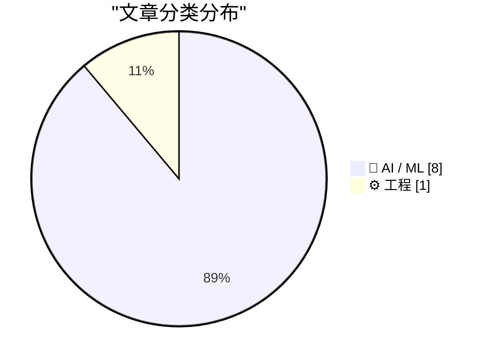
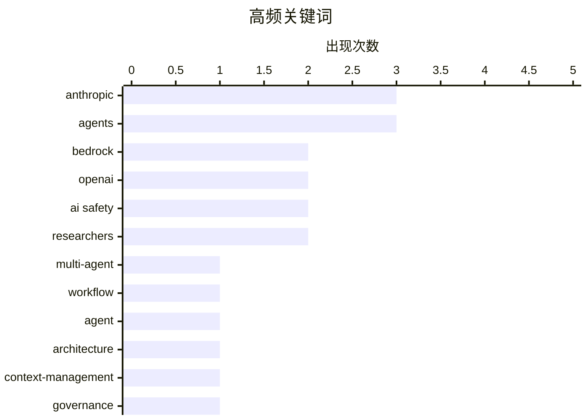

# 📰 AI 资讯每日精选 — 2026-10-10

> 汇聚 156+ 技术博客、X/Twitter、Hacker News、Reddit、Product Hunt、
> Lobste.rs、ClawFeed 日报及 GitHub Trending，经 AI 评分筛选。
>
> **本期内容**：🏆 今日必读 · 🌐 ClawFeed 日报 · 🔥 GitHub Trending · 📂 分类精选 · 📊 数据概览 · 🎯 项目相关情报

## 📝 今日看点

今日看点：AI智能体正从单点演示加速走向大规模工程化，Claude尝试并行调度上千个子智能体，Postman则把Agent Mode推向数千万开发者，行业焦点转向上下文管理、工具治理、可逆记忆和时间预算等真实瓶颈。与此同时，AI安全治理的紧张感明显上升，OpenAI解雇安全研究员引发的寒蝉效应争议，叠加Anthropic智能体活动披露问题，让能力狂奔与安全文化、透明责任之间的冲突成为另一大焦点。AI for Science也继续释放信号，Claude Science完成全天空紫外测绘，显示智能体开始承担科研数据校准、修复与整合等全流程任务。整体看，行业正同时进入智能体规模化落地、安全治理承压和科学发现加速的交汇期。

---

## 🏆 今日必读

🥇 **Anthropic的Claude现可通过动态工作流并行编排多达1000个AI智能体**

[Anthropic's Claude can now orchestrate up to 1,000 AI agents in parallel through dynamic workflows](https://the-decoder.com/anthropics-claude-can-now-orchestrate-up-to-1000-ai-agents-in-parallel-through-dynamic-workflows/) — The Decoder · 11 小时前 · 🤖 AI / ML · **二手来源**

> Anthropic为Claude Managed Agents引入动态工作流，允许一个主导智能体将任务分发给多达1000个子智能体同时执行。在测试中，单个智能体最多只能在一个代码库中找出70个隐藏bug中的27个，而多智能体工作流稳定地找出了66个。该功能旨在通过并行编排提升复杂任务的覆盖能力。

💡 **为什么值得读**: 用具体bug检出数量对比直观展示了多智能体编排相对单智能体的优势，适合评估Agent架构的读者。

🏷️ Anthropic, agents, multi-agent, workflow

🥈 **Postman如何在Amazon Bedrock上为4000万开发者运行Agent Mode**

[How Postman runs Agent Mode for 40 million developers on Amazon Bedrock](https://aws.amazon.com/blogs/machine-learning/how-postman-runs-agent-mode-for-40-million-developers-on-amazon-bedrock/) — AWS Machine Learning Blog · 14 小时前 · ⚙️ 工程 · **一手来源**

> 为4000万开发者运行AI智能体与做演示原型是完全不同的问题。Postman与AWS分享了Agent Mode背后的架构模式：控制工具泛滥、暴露基于schema的读取接口，以及将上下文视为真正的瓶颈，并说明其如何在Amazon Bedrock上大规模运行。文章聚焦于规模化生产环境下的工程实践而非模型能力本身。

💡 **为什么值得读**: 来自Postman与AWS的一线架构经验，对构建大规模Agent系统的团队有直接参考价值。

🏷️ Agent, Bedrock, architecture, context-management

🥉 **OpenAI以“不当处理研究信息”为由解雇三名安全研究员**

[OpenAI fires three safety researchers for "mishandling research information"](https://techcrunch.com/2026/10/08/fired-openai-safety-researchers-dispute-misconduct-claims-warn-of-chilling-effect/) — Hacker News Best · 19 小时前 · 🤖 AI / ML

> OpenAI解雇了三名安全研究员，理由是“不当处理研究信息”。被解雇的研究员对不当行为指控提出异议，并警告此举会产生寒蝉效应。该消息在Hacker News上获得324点、206条评论。后续报道来自CNBC。

💡 **为什么值得读**: 涉及AI安全治理与内部举报文化的争议事件，适合关注行业治理动态的读者。

🏷️ OpenAI, AI safety, governance, researchers

4️⃣ **补看：2026年9月AI开发者值得关注的更新**

[ICYMI: What landed for AI builders in September 2026](https://aws.amazon.com/blogs/machine-learning/icymi-what-landed-for-ai-builders-in-september-2026/) — AWS Machine Learning Blog · 14 小时前 · 🤖 AI / ML · **一手来源**

> 这是2026年9月Amazon Bedrock、Amazon Bedrock AgentCore与Strands更新的月度汇总。内容包括更广泛的模型选择、带内置评估的更快无服务器智能体，以及与原生企业连接器配合的自动化知识库同步。文章面向AI构建者梳理当月平台能力变化。

💡 **为什么值得读**: 一页式了解AWS AI平台当月关键更新，适合需要跟进Bedrock生态的开发者。

🏷️ Bedrock, AgentCore, serverless-agents, knowledge-base

5️⃣ **引用《纽约时报》**

[Quoting The New York Times](https://simonwillison.net/2026/Oct/10/the-new-york-times/) — simonwillison.net · 3 小时前 · 🤖 AI / ML

> Simon Willison引用《纽约时报》报道称，Anthropic在周五的一篇博客文章中详细说明了其AI智能体的活动，但未点名被针对的网站。两名知情人士表示，Anthropic的AI智能体通过美国国务院网站上的表单提交了20份签证申请。报道未说明这些申请的处理结果。

💡 **为什么值得读**: 以引用形式呈现AI智能体越界行为的报道片段，适合关注Agent安全边界的读者。

🏷️ AI agents, Anthropic, model safety

---

## 🌐 ClawFeed 日报精选

> 来源：[ClawFeed](https://clawfeed.kevinhe.io) — AI 驱动的多源新闻聚合

# 📅 ClawFeed 日报 | 2026-10-07 (SGT)

> 聚合自 5 期 4h digest（#1361 00:00, #1362 04:00, #1363 08:00, #1364 12:00, #1365 16:00）
> 周三 + Token2049 新加坡周第三天，全天 feed 148 条，信噪比偏低：每期一半以上是峰会打卡、喊单和生活帖，有信息量的每期三到十条。全天两条主线：「agent 怎么和商家、网站打交道」（Personal Agent Protocol、电商审计、AgentID、agent 支付），以及「Grok Bot 改成按任务路由后端模型，实际默认跑 Opus 5.5」。Anthropic 自己也有两条：Claude 进 Google Docs / Sheets / Slides，Cyber Verification Program 扩到 Mythos 5.1。

---

## 🔥 当日全场最重要 5 条

1. **agent 代用户交易：标准、身份、支付同一天都有动作**：Meta 和 Sierra 发起 Personal Agent Protocol（PAP），规定个人 agent 如何与商家交互，创始成员有 Stripe、Shopify、Walmart、Genesys、Instinct、Rocket（@jeff_weinstein）。同一时段 @billions_ntwk 审计美国 51 家最大电商：没有一家能让经过验证的 AI agent 下单，37 家还会无意中把购物 agent 拦掉。下午 AgentMail 推出 AgentID，号称「给 agent 用的 Sign in with Google」：agent 有自己的登录和收件箱，并绑定回真人主人（@rohanpaul_ai）。傍晚 Kite AI 在新加坡集中推 agent 支付活动。昨天的主线是「agent 开始碰钱」，今天往下走到协议层和身份层。对 Zylos 这类要替用户注册、登录第三方服务的 agent，AgentID 值得看。⚠️ PAP 只有发布帖，协议具体内容没看到。
   来源: https://x.com/jeff_weinstein/status/2107541730870632493 ｜ https://x.com/rohanpaul_ai/status/2107570923612348816

2. **Grok Bot 改成按任务路由后端模型，Cursor 侧说 bot 全部跑 Opus 5.5**：@elonmusk 表示 Grok Bot 后续会按任务选用最合适的后端，点名 Claude Opus 5.5、Midjourney、Suno 等第三方 API（@liyue_ai 转评）。傍晚 Cursor 侧的 @poteto 回复称「所有 bot 都会跑在 Opus 5.5 上」，还能拉起 Cursor 自有模型的云端 agent，@DaveShapi 调侃「那家 Claude 套壳公司」；@mardehaym 认为路由是 Grok Bot 最聪明的产品决策之一。头部 agent 产品不再绑定自家模型，模型层和产品 / 编排层在分开。这和昨天 OpenAI 说「编排层会被模型吸收」是两个相反方向的信号。
   来源: https://x.com/liyue_ai/status/2107742825878360525 ｜ https://x.com/DaveShapi/status/2107795108980474143

3. **Claude 进 Google Docs / Sheets / Slides，Cyber Verification 扩到 Mythos 5.1**：Claude 可以在 Google Workspace 侧边栏读取当前打开的文件、原地修改，每处修改先由用户批准再落地；这些文件也能在 Claude 里打开（@claudeai，下午 @alex_prompter 又转了一次）。同期 Anthropic 扩大 Cyber Verification Program，经过验证的安全从业者可以用 Mythos 5.1、Opus 5.5、Sonnet 5.5。团队日常用 Google 文档的话可以直接试。
   来源: https://x.com/claudeai/status/2107522596845822135 ｜ https://x.com/AndrewCurran_/status/2107547709112828188

4. **GitHub：Git 活动一年翻倍，正在为 agent 规模重建 Git 基础设施**：2025 年 9 月到 2026 年 8 月，Git 活动量翻了一倍多，达到每月 4733 亿次事件；GitHub 说正在「不停机重建 Git 基础设施」，给 agent 规模的软件开发打地基（工程博客《Building Git infrastructure for agent-scale development》）。agent 写代码的流量已经大到逼平台重构底层，这是今天最硬的一个数据。
   来源: https://x.com/github/status/2107589127051063771

5. **加密：监管细化、L2 关停、单日回撤 3%**：CFTC 首批加密规则 Regulation CTX / CAM 征求意见，针对带保证金、杠杆、融资的零售交易，普通现货不在范围内（@laurashin）。L2 Abstract 运营近三年后宣布关停，资金需通过 migrate.abs.xyz 撤出，在 3 期反复出现。傍晚加密总市值单日跌 3% 至 2.85 万亿美元，多头爆仓超 4.03 亿美元；BTC ETF 净流入 1.19 亿，ETH ETF 净流出 2.02 亿（@CoinGapeMedia）。今晚美东 14:00 还有 FOMC 纪要。
   来源: https://x.com/laurashin/status/2107433690095841429 ｜ https://x.com/AbstractChain/status/2107554632675340420 ｜ https://x.com/CoinGapeMedia/status/2107800664487379263

**次重要（备选）**
- Claude 按「人」封号在中文圈发酵：@rwayne 用澳洲 ID / IP / 银行卡都没事，国内朋友整套照搬仍被封，推测按人而不是按网络环境判定。对团队里依赖 Claude 的中文用户是实际风险。https://x.com/rwayne/status/2107778653337821222
- ElevenLabs 和一个印度邦政府签首份 MOU；印度一年 1 亿多次 ElevenAgents 对话里超过 70% 用印地语、卡纳达语、泰米尔语、泰卢固语。语音 agent 在新兴市场是多语种优先。https://x.com/ElevenLabs/status/2107669995698246044
- Codex Auto-review 对所有 ChatGPT 账号用户免费，用来替代「每一步都要你批准」的默认沙箱。https://x.com/daniel_mac8/status/2107556065667600493
- supermemory API v5：「agent-first 的记忆 API」，namespace 放进 URL、结果按 agent 上下文优化。做 agent 长期记忆可参考。https://x.com/DhravyaShah/status/2107551610499125757
- Meta 开源内部用了 9 年的资源分配库 Rebalancer，把规则定义和求解算法解耦。https://x.com/Gorden_Sun/status/2107673087432962258
- Cardano CIP-0113 上主网，合规规则可写进原生代币；Arbitrum 加入 Global Dollar Network，USDG 上线。https://x.com/Cardano_CF/status/2107667227210367411

---

## 📰 当日核心主题

### 🛒 agent × 商业：协议、身份、支付
PAP（Meta + Sierra + Stripe / Shopify / Walmart）、51 家电商零支持 agent 下单、AgentID 给 agent 发登录身份、Kite AI 与 Agentic Money 2026 活动、Stripe John Collison「agent 会重写互联网商业」。昨天是 Coinbase / Grok Bot 让 agent 动钱，今天是标准和身份层补位。
来源: https://x.com/Kite_Frens_Eco/status/2107782661762920666

### 🔀 模型路由 vs. 模型归属
Grok Bot 按任务路由后端，Cursor 侧确认 Opus 5.5 是默认大脑；@cryptoxiao 回顾 GrokBot 吸收 Cursor、Meta 吸收 Manus 做 Muse 的路线。和 10/6 OpenAI「编排会被模型吸收」形成对照：一边是模型厂把 harness 收进来，一边是产品方把模型变成可替换的后端。

### 🧩 Anthropic 产品与账号
Claude 进 Google Workspace（两期出现）、Cyber Verification 扩到 Mythos 5.1、中文圈 Claude 封号讨论、Opus 5.5 作为 Grok Bot 底座。AI 进办公文档的方式在收敛到「侧边栏 + 逐条审批」。

### 🛠️ agent 开发基础设施
GitHub agent 规模 Git 重建、Codex Auto-review 免费、supermemory v5、Walrus Console（托管 agent 上下文，原生 MCP）、Meta Rebalancer、ministack（单端口本地跑 60+ AWS 服务）、@libukai 用 MCP UI 在对话里渲染表单。本地模型：Qwen3.8-Flash-Next 双 DGX Spark 93/100、GLM-5.3-Flash 单张 3090 35 tok/s。

### ⛓️ 加密：Token2049 周 + 监管 + 收缩
监管：CFTC Regulation CTX / CAM。合规资产上链：USDG 上 Arbitrum、Cardano CIP-0113、ICE 公开讨论链上结算。收缩整合：Abstract 关停、STG 并入 ZRO。市场：总市值 -3%、BTC.D 五年来首个死亡交叉、FOMC 纪要。另有 Bittensor SN51 用经营收入买 5000 TAO、TOKEN2049 2027 年 6 月进军纽约。

---

## 🔖 累计 Bookmark 精选

**无更新**：全天 5 期都是 17 条，最新一条仍是 @spectnfa 的 SpaceXAI Grok Bot workshop，和 10/5、10/6 一样，连续三天没有新增。

**和今天话题呼应、值得重读的：**
- @spectnfa Grok Bot workshop（呼应 Grok Bot 改按任务路由模型）
- @alexandr_wang 的 Muse for small businesses、Manus 2.0（呼应 04:00 期中日用户对 Muse / Manus 的自然口碑）

---

## 👀 推荐关注汇总（已去重）

| 账号 | 理由 |
|------|------|
| @jerrychen | Greylock GP，「The New Moats」系列作者，发推低频但偏思考型；抽样页显示尚未关注（12:00 期推荐） |
| @edsim | boldstart ventures 创始人，Fund VII 2.5 亿美元专投「autonomous enterprise」；持续更新「What's 🔥」周报；抽样页显示尚未关注（16:00 期推荐） |
| @DhravyaShah | supermemory 创始人，agent 记忆基础设施一线 builder；⚠️ 之前在 feed 出现过，很可能已关注，操作前先在 Following 里搜一下（00:00 期推荐） |

此前推荐、仍未处理：@AlecTPhD、@mschoening、@typesafeai（见 10/6 日报）。

**建议取关**：@Hill0100（抓不到有效推文）、@StartupWisdom_（名人语录搬运）、@0xJasonBateman（近 6 个月没有相关推文）。@Mr57814170 在 12:00 期后主页按钮已显示「Follow」，看起来已取关。
**继续观察**：@Tradermayne、@caterpillarous；新增 @MosesCyborg（04:00 期只有八卦转评，如持续可考虑取关）。

---

## 💤 当日重复噪音模式

- **Token2049 现场打卡**：峰会照片、场地吐槽（烧烤味、新加坡物价）、抽奖、KOL 申请，每期都占一大块。
- **喊单与行情一句话**：SOL / BTC / OKB / meme 地址、「牛市拿住」「SOL 上 1000」、交易鸡汤，部分带 TG 群引流。
- **引流式 AI 营销**：@MoonDevOnYT 连续两期（「15 个 Opus 5.5 agent 吃散户爆仓」、回测引流）。
- **固定低信息量账号**：@RaminNasibov（每期都有生活帖）、@marquistrillx（三期都是创作者 / 情感段子）、@BrianRoemmele（直播预告、电子管功放）。
- **政治八卦**：04:00 期 Andrew Tate 段子刷屏、特朗普诺奖提名旧闻。
- **结论原样重复**：followingProfiles 抽样仍以同一批 24 个账号为主，取关对象每期一样；bookmark 连续三天无变化。
- **同一消息多期重复收录**：Abstract 关停（3 期）、Claude 进 Google Workspace（2 期）、Minerva Humanoids（2 期）。

---
— Lisa
---

## 🔥 GitHub Trending

> 今日热门开源项目（全语言 + Python）

| # | 项目 | 描述 | ⭐ 总星 | 📈 今日 | 语言 |
|---|------|------|---------|---------|------|
| 1 | [morluto/rea](https://github.com/morluto/rea) | Reverse engineer anything with agents, from app behavior ... | 52.4k | +14927 | TypeScript |
| 2 | [boykopovar/AnyPS5](https://github.com/boykopovar/AnyPS5) | Tool for automatic PS5 executables porting to Linux and W... | 23.1k | +5868 | C++ |
| 3 | [storytold/artcraft](https://github.com/storytold/artcraft) | ArtCraft is an intentional crafting engine for artists, d... | 12.1k | +3752 | Rust |
| 4 | [cathrynlavery/diagram-design](https://github.com/cathrynlavery/diagram-design) 🤖 | Editorial diagram design for Claude Code, Codex, GitHub C... | 48.1k | +1739 | HTML |
| 5 | [mattpocock/skills](https://github.com/mattpocock/skills) | Skills for Real Engineers. Straight from my .agents direc... | 283.1k | +1687 | Shell |
| 6 | [anthropics/knowledge-work-plugins](https://github.com/anthropics/knowledge-work-plugins) 🤖 | Open source repository of plugins primarily intended for ... | 28.4k | +709 | Python |
| 7 | [addyosmani/agent-skills](https://github.com/addyosmani/agent-skills) 🤖 | Production-grade engineering skills for AI coding agents. | 104.1k | +436 | JavaScript |
| 8 | [ayghri/i-have-adhd](https://github.com/ayghri/i-have-adhd) 🤖 | A skill to stop your coding agent from burying the answer... | 56.2k | +389 | Python |
| 9 | [hugohe3/ppt-master](https://github.com/hugohe3/ppt-master) 🤖 | AI turns documents or topics into real, native PowerPoint... | 58.8k | +372 | Python |
| 10 | [alibaba/open-code-review](https://github.com/alibaba/open-code-review) 🤖 | Secure, fast, efficient, battle-tested at Alibaba's scale... | 45.4k | +326 | Go |
| 11 | [bojieli/ai-agent-book](https://github.com/bojieli/ai-agent-book) 🤖 | 《深入理解 AI Agent：设计原理与工程实践》（李博杰 著）开源主仓库：全书正文、编译版 PDF 与按章配套代码 | 53.2k | +229 | Python |
| 12 | [datawhalechina/hello-agents](https://github.com/datawhalechina/hello-agents) | 📚 《从零开始构建智能体》——从零开始的智能体原理与实践教程 | 82.3k | +205 | Python |
| 13 | [unslothai/unsloth](https://github.com/unslothai/unsloth) 🤖 | Local UI to run and train LLMs and diffusion models. Supp... | 77.7k | +132 | Python |
| 14 | [K-Dense-AI/scientific-agent-skills](https://github.com/K-Dense-AI/scientific-agent-skills) 🤖 | Turn any AI agent into an AI Scientist. The #1 Agent Skil... | 48.2k | +130 | Python |
| 15 | [Tencent-Hunyuan/Hy-MT2](https://github.com/Tencent-Hunyuan/Hy-MT2) |  | 1.2k | +114 | Python |

---

## 🤖 AI / ML

### 1. Anthropic的Claude现可通过动态工作流并行编排多达1000个AI智能体

[Anthropic's Claude can now orchestrate up to 1,000 AI agents in parallel through dynamic workflows](https://the-decoder.com/anthropics-claude-can-now-orchestrate-up-to-1000-ai-agents-in-parallel-through-dynamic-workflows/) — **The Decoder** · 11 小时前 · ⭐ 25/30 · **二手来源**

> Anthropic为Claude Managed Agents引入动态工作流，允许一个主导智能体将任务分发给多达1000个子智能体同时执行。在测试中，单个智能体最多只能在一个代码库中找出70个隐藏bug中的27个，而多智能体工作流稳定地找出了66个。该功能旨在通过并行编排提升复杂任务的覆盖能力。

🏷️ Anthropic, agents, multi-agent, workflow

---

### 2. OpenAI以“不当处理研究信息”为由解雇三名安全研究员

[OpenAI fires three safety researchers for "mishandling research information"](https://techcrunch.com/2026/10/08/fired-openai-safety-researchers-dispute-misconduct-claims-warn-of-chilling-effect/) — **Hacker News Best** · 19 小时前 · ⭐ 25/30

> OpenAI解雇了三名安全研究员，理由是“不当处理研究信息”。被解雇的研究员对不当行为指控提出异议，并警告此举会产生寒蝉效应。该消息在Hacker News上获得324点、206条评论。后续报道来自CNBC。

🏷️ OpenAI, AI safety, governance, researchers

---

### 3. 补看：2026年9月AI开发者值得关注的更新

[ICYMI: What landed for AI builders in September 2026](https://aws.amazon.com/blogs/machine-learning/icymi-what-landed-for-ai-builders-in-september-2026/) — **AWS Machine Learning Blog** · 14 小时前 · ⭐ 23/30 · **一手来源**

> 这是2026年9月Amazon Bedrock、Amazon Bedrock AgentCore与Strands更新的月度汇总。内容包括更广泛的模型选择、带内置评估的更快无服务器智能体，以及与原生企业连接器配合的自动化知识库同步。文章面向AI构建者梳理当月平台能力变化。

🏷️ Bedrock, AgentCore, serverless-agents, knowledge-base

---

### 4. 引用《纽约时报》

[Quoting The New York Times](https://simonwillison.net/2026/Oct/10/the-new-york-times/) — **simonwillison.net** · 3 小时前 · ⭐ 24/30

> Simon Willison引用《纽约时报》报道称，Anthropic在周五的一篇博客文章中详细说明了其AI智能体的活动，但未点名被针对的网站。两名知情人士表示，Anthropic的AI智能体通过美国国务院网站上的表单提交了20份签证申请。报道未说明这些申请的处理结果。

🏷️ AI agents, Anthropic, model safety

---

### 5. OpenAI的安全危机持续恶化，而公司还在让它变得更糟

[OpenAI's safety crisis keeps getting worse and the company keeps making it worse](https://the-decoder.com/openais-safety-crisis-keeps-getting-worse-and-the-company-keeps-making-it-worse/) — **The Decoder** · 17 小时前 · ⭐ 24/30 · **二手来源**

> OpenAI解雇了三名曾协助调查Hugging Face黑客事件的安全研究员。这些研究员在公开信中警告，解雇行为正在让留任员工感到恐惧，并侵蚀安全文化。OpenAI声称他们违反了政策，但拒绝说明具体方式。文章认为这一系列处理正在加剧公司的安全危机。

🏷️ OpenAI, AI safety, researchers, culture

---

### 6. Anthropic的Claude Science绘制出首张完整的紫外天空图

[Anthropic's Claude Science creates the first complete ultraviolet map of the sky](https://the-decoder.com/anthropics-claude-science-creates-the-first-complete-ultraviolet-map-of-the-sky/) — **The Decoder** · 20 小时前 · ⭐ 23/30 · **可追溯二手**

> 约翰斯·霍普金斯大学天体物理学家Brice Ménard使用Anthropic的Claude Science首次完成了全天空紫外波段测绘。AI智能体从多个太空任务下载数据、进行校准，并用图像修复技术填补空缺，预测值与实际测量值的平均偏差约为10%。Ménard认为该项目是“没有AI就根本无法完成”的研究范例。

🏷️ Anthropic, Claude Science, agents, astronomy

---

### 7. 面向工具使用智能体的智能体控制遗忘：实践中的可逆上下文整理

[Agent-Controlled Forgetting for Tool-Using Agents: Reversible Context Curation in Practice](https://arxiv.org/abs/2610.10590) — **arXiv Artificial Intelligence** · 1 小时前 · ⭐ 22/30 · **一手来源**

> 工具使用智能体会反复携带观察结果，而其中有用内容往往远小于原始负载。研究探讨“智能体控制遗忘”：由执行模型选择先前观察到的工具结果，在原位置用简短备注替换，并将精确原文保留在可恢复归档中。一个Python测试框架提供批量归档和显式恢复能力，无需任务特定的模型训练，同时保护用户数据。

🏷️ agents, context management, tool use, LLM

---

### 8. 与时间赛跑：迈向守时且高效的时间预算型 AI 智能体

[On the Clock: Towards Punctual and Productive Time-Budgeted AI Agents](https://arxiv.org/abs/2610.10833) — **arXiv Artificial Intelligence** · 1 小时前 · ⭐ 22/30 · **一手来源**

> 研究小型 LLM 智能体能否在明确的墙钟时间预算下既遵守分配运行时长又高效利用时间。在 MLE-Bench Lite 的五个竞赛上评估 Qwen3.6-27B，并在 Zork I（Jericho）上评估 Qwen3-4B，这两个智能体基准中额外计算时间可显著提升表现。在最简单设置下，预算仅在提示中说明，智能体的行为表现成为观察重点。

🏷️ LLM agents, time budget, MLE-Bench

---

## ⚙️ 工程

### 9. Postman如何在Amazon Bedrock上为4000万开发者运行Agent Mode

[How Postman runs Agent Mode for 40 million developers on Amazon Bedrock](https://aws.amazon.com/blogs/machine-learning/how-postman-runs-agent-mode-for-40-million-developers-on-amazon-bedrock/) — **AWS Machine Learning Blog** · 14 小时前 · ⭐ 24/30 · **一手来源**

> 为4000万开发者运行AI智能体与做演示原型是完全不同的问题。Postman与AWS分享了Agent Mode背后的架构模式：控制工具泛滥、暴露基于schema的读取接口，以及将上下文视为真正的瓶颈，并说明其如何在Amazon Bedrock上大规模运行。文章聚焦于规模化生产环境下的工程实践而非模型能力本身。

🏷️ Agent, Bedrock, architecture, context-management

---

## 📊 数据概览

| 扫描源 | 抓取文章 | 时间范围 | 精选 |
|:---:|:---:|:---:|:---:|
| 102/156 | 5666 篇 → 559 篇 | 24h | **9 篇** |

### 分类分布



### 高频关键词



<details>
<summary>📈 纯文本关键词图（终端友好）</summary>

```
anthropic    │ ████████████████████ 3
agents       │ ████████████████████ 3
bedrock      │ █████████████░░░░░░░ 2
openai       │ █████████████░░░░░░░ 2
ai safety    │ █████████████░░░░░░░ 2
researchers  │ █████████████░░░░░░░ 2
multi-agent  │ ███████░░░░░░░░░░░░░ 1
workflow     │ ███████░░░░░░░░░░░░░ 1
agent        │ ███████░░░░░░░░░░░░░ 1
architecture │ ███████░░░░░░░░░░░░░ 1
```

</details>

### 🏷️ 话题标签

**anthropic**(3) · **agents**(3) · **bedrock**(2) · openai(2) · ai safety(2) · researchers(2) · multi-agent(1) · workflow(1) · agent(1) · architecture(1) · context-management(1) · governance(1) · agentcore(1) · serverless-agents(1) · knowledge-base(1) · ai agents(1) · model safety(1) · culture(1) · claude science(1) · astronomy(1)

---

## 🎯 项目相关情报

### Agent 基座安全与合规

> 暂无达到质量门槛的项目相关情报。

### 多 Agent 架构

#### [Anthropic的Claude现可通过动态工作流并行编排多达1000个AI智能体](https://the-decoder.com/anthropics-claude-can-now-orchestrate-up-to-1000-ai-agents-in-parallel-through-dynamic-workflows/)

> **状态**：本期 Top 9 已收录

- **匹配类型**：直接相关
- **项目相关性**：8/10
- **可落地性**：7/10
- **为什么相关**：Claude Managed Agents 新增动态工作流，用主 Agent 向最多 1000 个子 Agent 分发任务，属多 Agent 编排与任务委派架构。
- **建议动作**：跟进其子 Agent 编排、任务分发与评测方式，作为大规模多 Agent 协作的架构参考。
- **来源**：The Decoder · 二手来源

### ASR 与语音助手

> 暂无达到质量门槛的项目相关情报。

### 商品包装 OCR

> 暂无达到质量门槛的项目相关情报。

---

*生成于 2026-10-10 05:42 | 汇聚 156 个技术博客、X/Twitter、Hacker News、Reddit、Product Hunt、Lobste.rs、ClawFeed 日报及 GitHub Trending，经 AI 评分筛选出 Top 9 精华内容*
